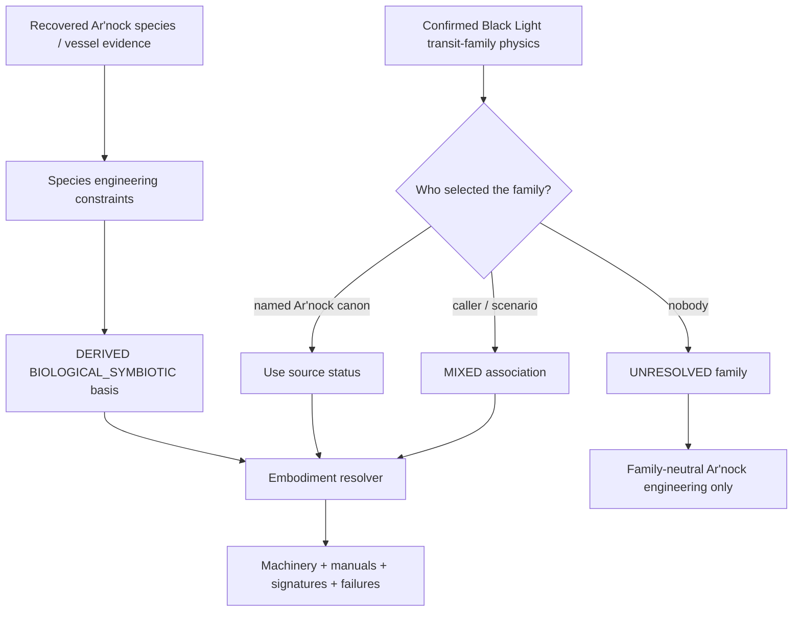
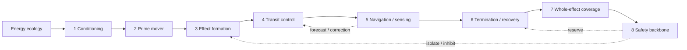
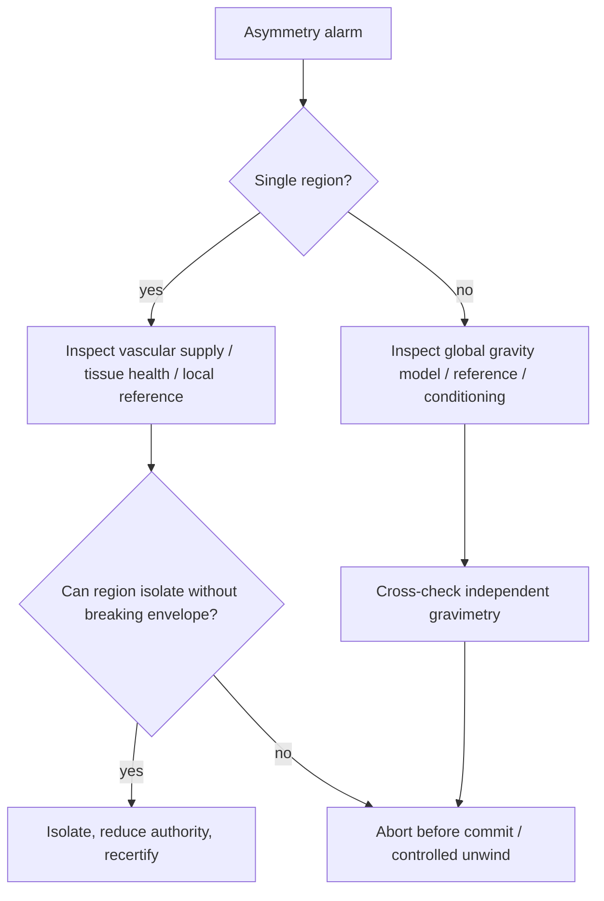
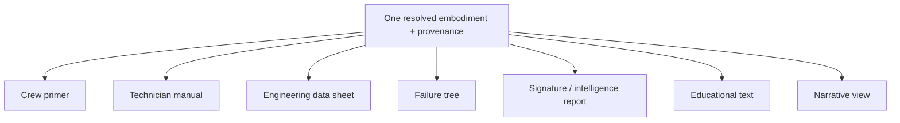

# Ar'nock FTL Family Embodiment Field Manual

**Status:** race/species-constrained, family-specific engineering derivation manual.  
**Authority:** subordinate to `BLACK_LIGHT_PROPULSION_TRANSIT_AUTHORITY.md`, the family technical volumes, `BLACK_LIGHT_FTL_CIVILIZATION_ENGINEERING_DOCTRINE.md`, `ARNOCK_PROPULSION_TRANSIT_ENGINEERING_PROFILE.md`, and the surviving Ar'nock foundation archive.  
**Machine-readable companion:** `data/exo-vessel/arnock-ftl-family-embodiment-matrix.json`.  
**Association status:** `MIXED` for every family in this volume unless later named Ar'nock canon explicitly establishes the association.  
**Primary recovered species source:** `data/blacklight-continuum/wiki/foundation-lore.json#arnock-species` and `#arnock-derelict`.  
**Design source:** Google Drive document *The different lightspeed methods*, current document id `1e0Xp71EFubBZgXWjjvPxAqPoJIZNwqS6nu1-r7Kil7Y`.

---

## 1. What this manual is for

The Ar'nock corpus now has enough confirmed biology, fabrication, computation, environmental, ergonomic, and interface information to answer a useful engineering question without pretending that an unanswered historical question has been solved:

> If a confirmed Black Light FTL family is deliberately selected for a scenario, what does a physically coherent Ar'nock-constrained embodiment of that family look like?

The archive still does **not** establish which family the Ar'nock actually invented, purchased, inherited, captured, or routinely operated. That absence is preserved. This manual therefore supplies family-by-family machinery, service logic, signatures, failure interactions, scaling, and operator doctrine while keeping the family association `MIXED`.

The governing separation is:

\[
\boxed{
\text{confirmed family physics}
+\text{confirmed Ar'nock traits}
+\text{derived embodiment}
\neq
\text{confirmed Ar'nock ownership}
}
\]

That distinction is not editorial fussiness. It is the mechanism that prevents a plausible generator result from laundering itself into future canon.

---

## 2. Recovered Ar'nock engineering constraints

The foundation archive supports the following hard inputs: biological fabrication from construction instructions and versatile feedstock; cultivated neural computation; elongated segmented limbs; flexible interfaces; vibration-based controls; unfamiliar identity controls; and an atmosphere with human-survivable pressure and oxygen-equivalent exchange but acidic compounds and unfamiliar trace gases.

The current operative-technology resolver maps those facts most closely to `BIOLOGICAL_SYMBIOTIC`, but that registry label is a modern `DERIVED` classification. It is not claimed to be an Ar'nock historical term.

The engineering consequences are therefore allowed to affect **embodiment**:

- grown or cultivated field structures where physically compatible;
- distributed rather than cabinet-centered computation;
- vascular, ionic, metabolic, neural, acoustic, optical, and mineralized biological carriers;
- service through feeding, grafting, excision, culture management, flushing, isolation, regeneration, reinnervation, chemical balancing, and recertification;
- nonhuman access geometry and control surfaces;
- condition-based health rather than elapsed-hours-only maintenance.

They are not allowed to change **operator physics**.

---

## 3. The family-association firewall

The generator must process Ar'nock family embodiments in this order:



A renderer, narrative generator, equipment catalog, or later manual may not treat repeated `MIXED` outputs as new evidence.

### 3.1 Provenance graph

For a scenario-selected family:

\[
S_A \rightarrow C_A \rightarrow B_A
\]

\[
S_F \rightarrow O_F
\]

\[
(B_A,O_F,S_{assoc}) \rightarrow E_{A,F}
\]

where:

- \(S_A\) is the Ar'nock source archive;
- \(C_A\) is the confirmed Ar'nock constraint set;
- \(B_A\) is the derived operative basis;
- \(S_F\) is the family authority;
- \(O_F\) is the family physical operator;
- \(S_{assoc}\) is the source that associates the two;
- \(E_{A,F}\) is the generated embodiment.

If \(S_{assoc}\) is merely a scenario selection, the result remains `MIXED`.

---

## 4. A common Ar'nock machinery grammar

Every family still resolves the same eight engineering end effects:



For Ar'nock-constrained machinery, these blocks should normally resolve into networks rather than single objects. The machinery may have organ-like local units, mineralized active structures, conductive tissues, vascular trunks, cultivated neural nodes, flexible membranes, or chemically active interfaces. Exact material remains dependent on family, Path level, vessel, condition, and any later manufacturer canon.

### 4.1 A useful scaling pressure

The previously established proposed segmentation measure remains useful:

\[
\Pi_A=\frac{L}{v_c t_r}(1+\sigma_f+\sigma_i)
\]

As \(\Pi_A\) increases, a coherent design should shift toward more local controllers, shorter control paths, regional recovery capacity, sectional isolation, and decentralized sensing.

This is an engineering estimator, not a canonical universal constant.

---

# Part I — Family-specific embodiments

## 5. Metric Compression Envelope

**Family association:** `MIXED`.  
**Family physics:** `CONFIRMED`.  
**Ar'nock embodiment:** `DERIVED`.

The central problem is maintaining a protected metric deformation around the vessel while respecting curvature, tides, structural loading, horizon behavior, navigation uncertainty, and unwind reserve.

### 5.1 Physical embodiment

An Ar'nock-constrained metric installation should resemble a distributed body-scale field organ more than a terrestrial engine cylinder. Field-bearing tissues or mineralized biological lattices can occupy hull bands, ribs, flexible membranes, or repeated regional structures. Cultivated ganglia control local sectors; vascular or electrochemical trunks feed the field structures; independent isolation tissue can starve or disconnect a damaged sector.

A capital ship should not contain one gigantic irreplaceable 'warp organ.' Its large scale should produce hierarchical regional field anatomy.

### 5.2 Control margin

Let regional envelope demand be \(A_i\) and available local authority \(C_i\). A useful derived local margin is:

\[
\mu_i=C_i-A_i.
\]

Whole-vessel admissibility requires more than a positive average. A conservative Ar'nock controller should care about

\[
\mu_{min}=\min_i \mu_i.
\]

If one living field sector is starving, scarred, desynchronized, or structurally displaced, a healthy vessel-average reading cannot conceal it.

### 5.3 Practical manual — AME-01 Sector asymmetry



Do not surgically remove a suspect field organ while the topology of the active envelope depends on it. First determine the family-specific commit and unwind state.

---

## 6. Gravitational-Plane Skimmer

The family treats naturally existing gravitational/shear terrain as route structure. Strong gravity can therefore be useful terrain and catastrophic hazard at the same time.

### 6.1 Ar'nock machinery

Long-baseline gravimetric sensing should be distributed along the hull and not concentrated at a human-style bridge. Cultivated processors compare local gradients, tidal tensors, inferred hidden terrain, and branch solutions. Coupling organs tie directly into structural load paths so the organism can sense and correct regional differential loading.

A biological implementation is especially vulnerable to an attractive failure mode: **coherent bad consensus**. If multiple ganglia share the same diseased sensory tissue, contaminated reference chemistry, or corrupted ancestral model, they are correlated, not independent.

### 6.2 Branch ambiguity

For branch probabilities \(p_i\):

\[
A_f=1-\max_i(p_i).
\]

The dangerous quantity is not ambiguity alone but ambiguity combined with increasing branch divergence and shrinking recoupling time.

### 6.3 Practical manual — AGP-02 Fork alarm

1. Freeze automatic preference escalation.
2. Group observations by actual source ancestry, not by the number of ganglia reporting them.
3. Compare regional coupling loads and structural strain.
4. Reject any branch whose confidence depends on a single shared biological/reference lineage.
5. Preserve recoupling and de-transit margin before attempting a branch transfer.
6. Quarantine neural tissue that continues to report certainty unsupported by independent evidence.

---

## 7. Hyperspatial Slipstream Shear

Slipstream requires acquisition and continued adhesion to a Q-boundary, forward prediction of Q-weather, sectional correction, exit correspondence, and controlled detachment.

### 7.1 Living adhesion skin

The most coherent Ar'nock embodiment is a distributed hull organ whose local sectors can alter the selected family-specific coupling state. The organ does not have to be literally exposed skin; it can be a protected grown lattice within the hull. What matters is that whole-vessel attachment is distributed and measurable.

The derived adhesion margin remains:

\[
\mu_A=A_{available}-A_{required}.
\]

The biologically important addition is that \(A_{available}\) may drift with nutrition, tissue damage, chemical state, scar formation, infection, neural control latency, or vascular starvation.

### 7.2 Q-weather as a biological forecasting problem

A cultivated controller can be exceptionally good at noisy-pattern recognition without becoming omniscient. Forecast confidence must retain covariance and provenance. A strongly patterned neural prediction is not equivalent to a measured Q-state.

### 7.3 Practical manual — ASS-03 Adhesion tissue deterioration

If correction energy and regional metabolic demand rise together, inspect local adhesion health before treating the event as external Q-weather. If all sectors rise coherently, inspect the environmental model and common conditioning path before cutting living machinery apart.

The service sequence is:

`observe -> classify common/local -> reduce route demand -> protect detachment reserve -> isolate if admissible -> detach if margin continues falling -> repair after recovery`.

---

## 8. Q-Lattice Phase Translation

The Q-Lattice family solves discrete address and epoch validity. A living resonator does not turn the lattice into intuition-driven teleportation.

### 8.1 Address resonance organs

A plausible Ar'nock embodiment uses multiple cultivated resonant structures whose states are compared by a neural clock mesh. Each organ can contribute an address hypothesis; none is allowed to become authoritative merely because its response is stronger.

The correct safety question is whether candidate addresses remain distinguishable under current uncertainty.

### 8.2 Whole-state cage

Coverage remains controlled by the weakest included region:

\[
C_Q=\min_{x\in\Omega}c(x).
\]

Living hull flexibility makes this especially important. A stretched membrane, healed wound, new graft, cargo sling, deployed sensor organ, or temporary repair can move outside the previously certified protected state.

### 8.3 Practical manual — AQL-04 Clock split

When regional epoch clocks disagree:

1. do not average them;
2. identify clock ancestry and shared tissue/reference dependencies;
3. isolate the discrepant clock if the cage remains certifiable;
4. reacquire external or independent internal reference;
5. recompute every candidate epoch affected by the split;
6. reject translation if no independent clock chain survives.

---

## 9. N-Dimensional Manifold Drive

The N-Manifold family solves a higher-dimensional route and a valid return projection. A short route with a badly conditioned return map is a bad route.

### 9.1 Biological topology solving

Cultivated neural structures are a natural embodiment for large dynamic inference problems, but that does not reduce the physical complexity of higher-dimensional navigation. Mature designs should separate route-optimization tissues from return-map certification tissues wherever possible.

For return mapping \(R\), the derived conditioning measure is:

\[
\kappa_R=\|J_R\|\,\|J_R^{-1}\|.
\]

High \(\kappa_R\) means small state errors may become very large ordinary-space emergence errors.

### 9.2 The 'minimum sufficient dimensionality' doctrine

Ar'nock-style organic computation should not be written as enjoying extra dimensions merely because it is alien. Every added active axis increases sensing, model, control, and return burden. An efficient controller prefers the lowest-dimensional admissible route unless another objective justifies more axes.

### 9.3 Practical manual — ANM-02 Unexplained tomography residual

A persistent coherent residual is treated as an unresolved obstacle hypothesis. It is not deleted from the model merely because the biological navigator cannot classify it. Reduce route authority, compare independent sensory lineages, and either bound the hidden structure or select another manifold route.

---

## 10. Discrete Fold-Jump

Fold-Jump creates temporary adjacency between certified origin and destination volumes. Its defining operator problem is solved before commit; post-commit steering may not be invented.

### 10.1 Grown topology-forming aperture

An Ar'nock fold embodiment can use living field structures distributed around a certified volume boundary. Cultivated computation may continuously update destination covariance, occupancy evidence, and topology candidates until the family-specific commit point.

### 10.2 Destination evidence

The destination remains a volume. A proposed biological implementation should evaluate obstruction evidence across the entire target region rather than allowing an apparently clear centroid to dominate.

\[
E_{occ}=\int_{\Omega_d}\rho_{occ}(x)w(x)dV.
\]

### 10.3 Practical manual — AFJ-05 Scar-induced coverage change

A repair that regrows field tissue changes geometry even when it improves health. After major healing or grafting:

`resurvey hull -> recalculate protected volume -> recertify field boundary -> recertify endpoint covariance -> low-authority test -> restore fold eligibility`.

A healed ship is not automatically a geometrically identical ship.

---

## 11. Anchored Wormhole / Gate Transit

This family is infrastructure-dominated: paired mouths, throat stability, aperture geometry, mass flux, synchronization, chronology protection, anchoring, traffic, and controlled closure.

No current Ar'nock source establishes that they built or used gates. Everything in this section is therefore explicitly hypothetical embodiment work.

### 11.1 Do not enlarge a ship organ into a gate

A gate-sized biological system must be treated as an industrial ecology. It needs local energy conversion, nutrient/material logistics, waste handling, repair populations or machinery, large-scale circulation, distributed aperture sectors, structural anchoring, remote-mouth references, traffic management, and independent closure authority.

### 11.2 Mass flow

\[
\dot m(t)=\int_{A_t}\rho(x,t)v_n(x,t)dA.
\]

Traffic control must therefore care about actual crossing geometry and temporal mass distribution, not just vessel dry mass.

### 11.3 Practical manual — AWG-01 Unknown living gate intake

1. Treat both the topology and organism as hazardous until independently classified.
2. Do not stimulate suspected aperture tissue merely to see whether it opens.
3. Establish whether a remote mouth exists and whether any apparent remote state is measured or predicted.
4. Identify chronology protection and closure authority before traffic testing.
5. Begin with passive observation and reversible, sub-threshold stimulation.
6. Do not classify ecological maintenance structures as decorative tissue.

---

## 12. Quantum Phase Displacement

Phase Displacement maps a protected macroscopic state to a compatible nonlocal target while satisfying explicit engineering continuity invariants.

### 12.1 Continuity without metaphysical invention

This family intersects directly with the No Return Signal archive's refusal to require one metaphysical answer about whether soul, consciousness, original person, copy, or pattern crossed during Q-MAP. That archive stance does **not** establish that Q-MAP is Phase Displacement. It does provide a useful canon discipline: engineering identity handling can remain operational without pretending a machine has solved philosophy.

Let required engineering invariants be

\[
I=\{I_1,I_2,\ldots,I_n\}.
\]

Passing them proves only the specified engineering test.

### 12.2 Cultivated state mapping

An Ar'nock-constrained hypothetical implementation may use cultivated neural structures to encode or compare macroscopic state models, but any claim of complete state knowledge must remain bounded by actual sensor and reference capability.

### 12.3 Practical manual — APD-06 Reference ancestry audit

Before displacement, collapse apparently independent references into their actual ancestry groups. Three cultivated controllers reading descendants of one damaged remote clock count as one compromised evidence family, not three votes.

---

# Part II — Cross-family equipment doctrine

## 13. Ar'nock service equipment classes

These equipment classes are `DERIVED` functional categories. They are deliberately not presented as recovered Ar'nock product names.

| Equipment class | Purpose | Typical physical embodiment | Primary mistake to avoid |
|---|---|---|---|
| Tissue-state mapper | health and geometry | chemical, optical, electrical, vibratory tomography | assuming healthy means calibrated |
| Vascular route tracer | power/cooling/nutrient routing | tracer chemistry, flow sensing, pressure/acoustic observation | cutting a line before learning what else it carries |
| Neural coherence monitor | controller synchronization | field/electrical/chemical/vibration correlation | treating correlated nodes as independent confirmations |
| Effect-boundary probe | coverage certification | family-specific low-authority stimulus + local sensing | extrapolating a point test to the whole hull |
| Isolation stimulator | safe sectional shutdown | neural gating, chemical inhibition, vascular closure, field isolation | assuming isolation is valid after a family commit boundary |
| Regeneration monitor | recovery readiness | metabolic, tissue, scar, microbiome, chemistry observation | using elapsed time instead of condition |
| Translation adapter | human-readable interface | sensor fusion + semantic mapping | hiding uncertainty behind familiar gauge labels |

---

## 14. Combined readiness state

A biologically embodied transit system should not have one generic health percentage. A useful proposed readiness vector is:

\[
\mathbf R_A=
[E_u,O_m,C_h,F_n,H_t,R_g,C_f,N_f]^T
\]

where the previously used biological terms are extended with:

- \(C_f\): family-specific effect/coverage margin;
- \(N_f\): family-specific navigation/reference admissibility.

A conservative admission predicate is:

\[
A_{transit}=\bigwedge_i(R_i\ge R_{i,min}).
\]

This is intentionally an AND condition. High metabolic reserve does not compensate for a failed endpoint proof; excellent navigation does not compensate for necrotic field tissue.

---

## 15. Failure composition

A useful derived expression is:

\[
F_{instance}=F_{family}\otimes F_{basis}\otimes F_{species}\otimes F_{condition}.
\]

The tensor symbol is conceptual: failures interact. A vascular occlusion inside a Metric field organ is not the same event as a vascular occlusion feeding a Q-Lattice resonator. The biological defect may be similar; the transit consequence is family-specific.

### 15.1 Root-cause ordering

When a system fails, inspect in this order unless direct evidence points elsewhere:

`environment/reference -> family mathematics -> common conditioning -> sectional control -> local embodiment health -> structure/coverage -> recovery path`.

This ordering helps prevent the most tempting mistake when dealing with living machines: blaming every failure on 'sick tissue' simply because the machine is biological.

---

## 16. Signature interpretation

Ar'nock embodiment adds observable channels but does not erase family signatures.

A useful signature vector is:

\[
\mathbf S_{A,f}=[S_{EM},S_{th},S_g,S_Q,S_{top},S_{bio},S_{chem},S_{vib},S_{wake},S_{rec}]_f.
\]

`S_bio`, `S_chem`, and `S_vib` are especially relevant to the Ar'nock-derived embodiment. Their presence does not identify the FTL family by itself. A hot metabolically active organ could be conditioning a Metric field, charging a Q resonator, stabilizing a Fold boundary, or doing something entirely unrelated to transit.

---

## 17. Educational text: how not to misread alien engineering

### First-year principle

Function is not appearance.

A human engineer sees a pulsing vascular structure and wants to call it a pump. An Ar'nock machine may use that structure as a power route, coolant route, nutrient supply, timing carrier, control signal path, immune barrier, or several simultaneously. Classification follows measured end effect and dependencies, not resemblance.

### Second-year principle

Species is not mechanism.

Knowing that the Ar'nock cultivate neural computation does not answer whether their ship uses Fold, Slipstream, Metric, Q-Lattice, N-Manifold, Gravitational-Plane, Gate, Phase Displacement, or no working FTL at all.

### Advanced principle

Correlation is not provenance independence.

If five biological controllers learned from one damaged ancestral model, they are five processors but one evidence lineage.

---

## 18. Training problem

A salvage team finds a living annular structure surrounding an inaccessible machinery cavity. It warms when supplied with compatible nutrients, nearby membranes tighten, and three neural nodes begin producing synchronized vibration patterns.

An inexperienced technician identifies it as a 'jump ring.'

The correct engineering conclusion is much smaller:

- the structure is active;
- it participates in a coordinated machinery network;
- it has metabolic/chemical dependencies;
- its geometry may be relevant to an effect boundary;
- the three neural nodes are correlated until their input ancestry is known;
- its transit family remains unresolved.

Only family-specific measurements can move the classification further.

---

## 19. API contract

The machine-readable resolver is conceptually:

```text
resolveArNockTransitEmbodiment({
  familyKey,
  vesselScale,
  mission,
  condition,
  pathLevel?,
  sharedTier?,
  authorityMode,
  sourceSnapshot
})
```

`familyKey` must come from a caller/scenario or a named authoritative source. The Ar'nock resolver does not choose it.

Minimum outputs are:

```text
associationStatus = MIXED unless named source establishes otherwise
familyInvariant
resolvedEightBlockMachinery
powerAndRecovery
navigationAndControl
maintenancePlan
signatureVector
failureComposition
infrastructureDependencies
scalingPressures
manualProcedures
provenanceGraph
canonWarnings
```

### 19.1 Generator hard guards

The resolver rejects or flags any result that:

- says the Ar'nock canonically use a family without an association source;
- changes family physics to make biological embodiment easier;
- invents a manufacturer, inventor, patent date, Path, T-tier, performance, infrastructure ownership, connector standard, or chronology capability;
- treats repeated generated records as independent confirmation;
- suppresses a family hazard because the machinery is self-healing;
- treats neural consensus as independent evidence without ancestry analysis;
- converts a derived basis label into native historical terminology.

---

## 20. Documentation views from one resolved record

The same resolved embodiment should generate the crew primer, engineering data sheet, salvage manual, maintenance checklist, failure tree, intelligence signature report, educational diagram, and narrative description.



This matters because prose drift is a canon defect. A narrative view cannot casually name a Fold organ if the underlying engineering record still says `transitFamily = UNRESOLVED`.

---

## 21. Provenance and origin policy

Every family-specific Ar'nock record should expose three independently inspectable origins:

1. **species origin** — the recovered Ar'nock archive facts;
2. **physics origin** — the confirmed family authority;
3. **association origin** — the source that says these two belong together in this record.

The association origin is the critical missing link in current canon. Until it is recovered, scenario-generated family embodiments remain `MIXED` by construction.

A useful provenance-completeness test is:

\[
C_P=\frac{N_{claims\ with\ source+status+transform}}{N_{externally\ asserted\ claims}}.
\]

Published generator output should target \(C_P=1\). The quantity is an editorial audit metric, not an in-universe scientific constant.

---

## 22. Relationship to *The different lightspeed methods*

This manual directly extends the source document's governing design intent in a race-specific way:

- gravity/environment interaction remains family-specific;
- safety lookahead and emergency response remain family-specific;
- increasing technological maturity improves prediction, redundancy, control, and margin rather than creating perfect safety;
- the mathematical framework remains explicit and labeled where invented;
- machinery is physically embodied and serviceable;
- education and field procedures are part of the technology corpus, not an afterthought.

What the source does **not** supply is Ar'nock ownership of any particular method. This manual refuses to manufacture that missing historical link.

---

## 23. Future admission path

A later authoritative source can promote one association without rewriting this framework. The required source would need to identify an Ar'nock vessel, polity, archive, manufacturer, installation, or historical record and connect it to a particular confirmed transit family with adequate confidence.

Then:

```text
new named source
    -> association claim
    -> scope/confidence/status review
    -> update Ar'nock annex
    -> update family matrix association status only where supported
    -> generate installation-specific manuals
```

Until then, the correct technical answer to “what FTL do the Ar'nock use?” remains:

**UNRESOLVED.**

The correct answer to “what would an Ar'nock-constrained implementation of a selected Black Light FTL family physically look like?” is now fully generatable, inspectable, and provenance-bound.
