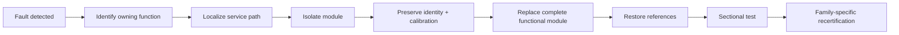
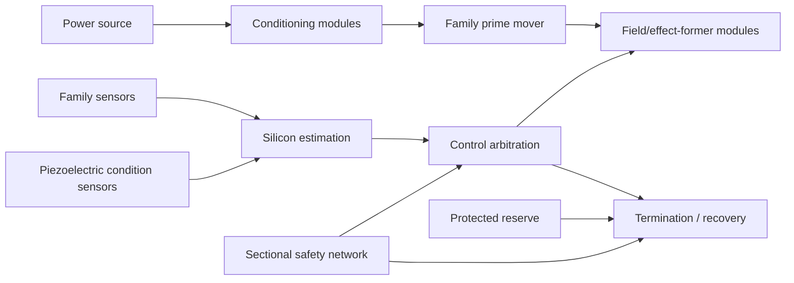
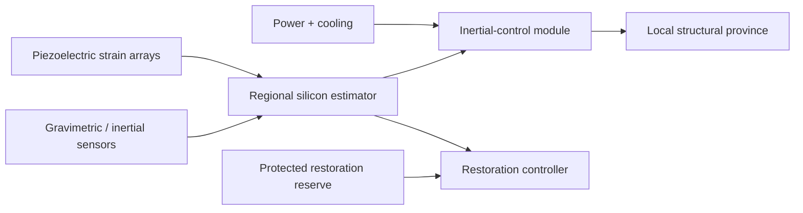
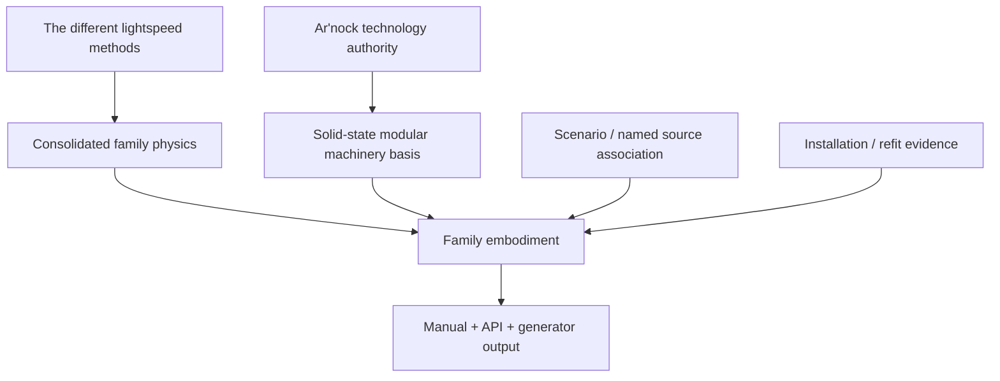

# Ar'nock FTL Family Embodiment Field Manual

**Status:** race/species-constrained engineering derivation manual.  
**Authority:** subordinate to `BLACK_LIGHT_PROPULSION_TRANSIT_AUTHORITY.md` and the family technical volumes; synchronized with `data/blacklight-continuum/wiki/arnock-technology-authority.json`, `ARNOCK_PROPULSION_TRANSIT_ENGINEERING_PROFILE.md`, and `data/exo-vessel/arnock-ftl-family-embodiment-matrix.json`.  
**Governing family design source:** *The different lightspeed methods*.  
**Association status:** every family below is `MIXED` unless later named Ar'nock canon establishes actual ownership/use.

---

## 1. Field doctrine

This manual answers one constrained question:

> If a confirmed Black Light transit family is deliberately embodied in Ar'nock engineering, what machinery, controls, maintenance practice and failure behavior follow from the corrected Ar'nock technology baseline?

It does **not** answer which FTL family the Ar'nock historically used.

The corrected Ar'nock baseline is:

```text
solid-state materials / silicon computation
              +
piezoelectric sensing and actuation
              +
highly integrated functional modules
              +
electromechanical power / cooling / control
              =
DEFAULT AR'NOCK GENERAL MACHINERY

bioprinting / biological fabrication
              -> feedstock
              -> food
              -> medicine
              -> environmental support
              -> life support
```

The old biological-default interpretation is superseded.

\[
\boxed{\text{advanced biotechnology}\neq\text{biotechnology-first technological base}}
\]

\[
\boxed{\text{Ar'nock machinery style}\neq\text{Ar'nock FTL-family identity}}
\]

---

## 2. Ar'nock functional modules

A Human technician often thinks downward toward components. An Ar'nock technician more often thinks laterally across replaceable functions.

A single Ar'nock module may integrate:

- power conditioning;
- switching;
- conductive routing;
- resistive and capacitive structures;
- signal conditioning;
- local silicon computation;
- calibration storage;
- piezoelectric transduction;
- mechanical reference geometry;
- thermal interfaces;
- safety interlocks.

The resulting service doctrine is:



This means Ar'nock systems may be unusually straightforward to repair **when compatible modules exist**, while being unusually difficult to repair internally when they do not.

---

## 3. Piezoelectric instrumentation

Piezoelectric technology is not decorative flavor. It is a practical bridge between Ar'nock solid-state electronics and mechanical systems.

For linear piezoelectric behavior:

\[
\mathbf D=\mathbf d\mathbf T+\boldsymbol\epsilon^T\mathbf E
\]

\[
\mathbf S=\mathbf s^E\mathbf T+\mathbf d^T\mathbf E.
\]

Ar'nock transit machinery can therefore use piezoelectric elements for:

| Use | Engineering value |
|---|---|
| strain sensing | detects field-mount distortion and structural load |
| vibration analysis | identifies looseness, bearings, pumps, resonance changes |
| precision actuation | trims alignments, valves, optical elements or field hardware |
| pressure sensing | monitors coolant, hydraulic and environmental circuits |
| resonant reference | supports local timing/calibration functions |
| mechanically coupled input | supports vibration-oriented Ar'nock controls |
| bond/crack inspection | compares modal response against certified baseline |

A family-required gravimeter, Q-state detector, topology sensor or endpoint estimator may **not** be replaced in documentation by “piezoelectric sensor” unless the physical relationship is established.

---

## 4. Common machinery grammar

Every family-specific Ar'nock implementation should resolve these functions:



The same family equations can therefore exist in Human, Mur'rek, Ar'nock or other machinery while the hardware embodiment remains visibly different.

\[
\boxed{\text{same family physics}\neq\text{same machine}}
\]

---

# Part I — Continuous projected-progress families

## 5. Metric Envelope

The family requirement is a controlled protected metric deformation. Ar'nock machinery should implement this with replaceable regional field-former sectors rather than living field tissue.

### Machinery

A plausible installation contains:

- sectional field-former modules;
- local silicon control processors;
- redundant curvature/gravimetric sensor chains;
- piezoelectric mounting/alignment transducers;
- power-conditioning modules;
- protected unwind stores;
- sectional cooling;
- hard isolation interfaces.

For local sector authority \(C_i\) and demanded authority \(A_i\):

\[
\mu_i=C_i-A_i,
\qquad
\mu_{min}=\min_i\mu_i.
\]

A positive vessel-average margin cannot hide one sector with \(\mu_i<0\).

### Maintenance procedure AME-01

1. Read module identity and revision before removal.
2. Measure field-sector output against independent external/reference sensors.
3. Excite piezoelectric mount sensors and compare modal response with baseline.
4. Verify cooling and power paths independently.
5. Isolate the suspect module only if envelope continuity permits.
6. Replace the complete module rather than opening its integrated substrate in situ.
7. Restore calibration and sector geometry.
8. Perform low-authority field test.
9. Recompute whole-envelope coverage.
10. Restore transit eligibility only after unwind reserve remains protected.

---

## 6. Gravitational Plane

The family couples to gravitational/shear terrain. The Ar'nock embodiment should emphasize independent gravimetric modules, covariance-aware silicon solvers and structural feedback.

The physical tidal tensor remains:

\[
T_{jk}=\sum_a\frac{GM_a}{r_a^3}(3n_jn_k-\delta_{jk}).
\]

Near-zero net acceleration does not imply a harmless tidal environment:

\[
|\mathbf g|\approx0\not\Rightarrow\|T\|\approx0.
\]

### Machinery

- long-baseline gravimetry modules;
- source-state/covariance processors;
- sectional coupling modules;
- piezoelectric hull-strain arrays;
- local recoupling/decoupling controllers;
- independent reference clocks.

### Shear-fork doctrine

When competing terrain branches emerge, count **independent evidence ancestry**, not the number of processors reporting the same inherited solution.

For branch weights \(p_i\), an ambiguity indicator may be retained as:

\[
A_f=1-\max_i p_i.
\]

It is not itself failure probability.

### Maintenance procedure AGP-02

`freeze branch escalation -> separate sensor ancestries -> compare tidal eigensystem -> inspect structural strain -> preserve decoupling horizon -> reject unsupported branch certainty`.

---

## 7. Slipstream / Shear

The family requires acquisition, adhesion, prediction and detachment from the relevant shear/Q boundary.

The Ar'nock implementation uses modular coupling sectors and forward sensor arrays rather than a grown adhesion skin.

Define local adhesion margin:

\[
\mu_A=A_{available}-A_{required}.
\]

A decline in available authority may arise from external boundary conditions or internal machinery degradation. Those must be discriminated before repair action.

### Signatures

Family-primary evidence:

- Q-boundary interaction;
- wake behavior;
- adhesion/coupling effects;
- detachment event.

Ar'nock supporting evidence:

- power-converter harmonics;
- module switching;
- coolant response;
- timing-network activity;
- piezoelectric alignment sweeps;
- regional vibration changes.

### Procedure ASS-03

If multiple sectors lose margin coherently, inspect common power/reference/cooling before replacing multiple field modules. If one sector diverges while common services remain healthy, isolate and test its local module chain.

---

## 8. N-Manifold

The family selects a higher-dimensional route while retaining a valid return map.

For return map Jacobian \(J_R\), retain conditioning:

\[
\kappa_R=\|J_R\|\,\|J_R^{-1}\|.
\]

High \(\kappa_R\) means small state error can strongly amplify in emergence state.

### Ar'nock embodiment

- sectional embedding-field modules;
- high-density silicon topology solvers;
- independent return-map processors;
- distributed sensor/reference modules;
- protected re-embedding reserve;
- piezoelectric geometry monitoring.

The Ar'nock design advantage here is not “alien intuition.” It is compact local compute and module-level distribution. The mathematical burden remains intact.

### Procedure ANM-04

A persistent tomography residual is retained as unresolved evidence. Do not suppress it because multiple modules share the same model and produce the same prediction.

---

## 9. Inertial Torch

This family was missing from the earlier Ar'nock matrix and is now part of the complete family set.

The family manipulates effective inertial response according to the consolidated transit model while preserving ordinary-space trajectory knowledge, structural admissibility and safe restoration to normal inertial behavior.

An Ar'nock implementation is especially compatible with piezoelectric structural instrumentation because high-rate local mechanical response matters even if the exotic field changes effective inertial behavior.

### Machinery



### Structural response

For a local structural element with effective mass \(m_{eff}\), commanded acceleration \(a_c\) and measured internal force \(F_s\), a simple consistency residual is:

\[
r_F=F_s-m_{eff}a_c.
\]

The exact inertial-torch theory determines what \(m_{eff}\) means operationally; the maintenance system may still compare expected and measured structural response without inventing a new family law.

For vessel span \(L_v\), tidal differential acceleration remains approximately

\[
\Delta a\sim\|T\|L_v.
\]

Reducing some effective inertial response does not make external tidal structure disappear unless the family authority explicitly says so.

### Procedure AIT-01 — Regional disagreement

1. Reduce inertial-control authority.
2. Compare independent inertial/gravity references.
3. Compare regional strain/acceleration readings.
4. Verify module timing skew.
5. Verify power and cooling.
6. Isolate a disagreeing regional module if structural continuity permits.
7. Confirm protected restoration reserve.
8. Return to ordinary inertial state before attempting invasive repair.

---

# Part II — PRECOMMIT endpoint families

## 10. Q-Lattice

Q-Lattice is discrete address/epoch translation. The machinery should use solid-state address-resonance and timing modules rather than cultivated resonant organs.

Whole-state coverage remains limited by the weakest required region:

\[
C_Q=\min_{x\in\Omega}c(x).
\]

The timing model remains PRECOMMIT:

\[
M_T=t_{prediction}-t_{int}.
\]

Do **not** create a fake local superluminal velocity to calculate this margin.

### Procedure AQL-05 — Clock split

Do not average discrepant clock chains. Identify ancestry, isolate a bad chain where possible, reacquire reference and recompute candidate epochs.

---

## 11. Fold Jump

Fold Jump creates temporary adjacency between certified volumes and obeys a point of no return.

Ar'nock embodiment:

- modular topology-former assemblies;
- protected-volume boundary modules;
- silicon endpoint/occupancy solvers;
- independent clocks/references;
- protected closure/ringing recovery modules.

Destination occupancy remains a volume problem. A schematic occupancy measure can be written as:

\[
E_{occ}=\int_{\Omega_d}\rho_{occ}(\mathbf x)w(\mathbf x)dV.
\]

A clear centroid does not certify the whole destination volume.

### Procedure AFJ-06 — Module replacement

After replacing any topology-former module, resurvey protected geometry and endpoint solution. Mechanical fit does not establish identical field transfer function.

---

## 12. Phase Displacement

Phase Displacement maps a protected macroscopic state to an admissible nonlocal target under the family continuity rules.

Ar'nock machinery uses distributed phase-control modules synchronized by independent solid-state reference chains. Piezoelectric arrays can maintain mechanical-geometry evidence but cannot substitute for phase-state measurement.

Regional disagreement is a commit blocker:

\[
\boxed{\text{reference disagreement}\not\Rightarrow\text{average and proceed}}.
\]

### Procedure APD-03

`verify protected geometry -> verify independent clocks -> verify target compatibility -> verify rejection reserve -> freeze commit state -> execute or abort`.

---

# Part III — Anchored portal family

## 13. Wormhole / Gate

Wormhole-gate machinery is infrastructure rather than a large shipboard module.

A hypothetical Ar'nock gate should be built as an industrial array of replaceable aperture sectors, stabilization modules, power conversion, cooling, structural anchors, timing/reference networks and independent closure systems.

Mass flux remains:

\[
\dot m(t)=\int_{A_t}\rho(\mathbf x,t)v_n(\mathbf x,t)dA.
\]

The gate controller therefore cares about crossing geometry and time-dependent flow, not only vessel dry mass.

No current source establishes that the Ar'nock historically built or used gates.

---

# Part IV — Scaling, service graphs and safety timing

## 14. Large-vessel topology

For service graph \(G=(V,E)\), deterministic path support remains:

\[
A_p=\min\left(A_{source},\min_{e\in p}A_e\right)
\]

and the strongest surviving path:

\[
A_s=\max_p A_p.
\]

Path delay is independently:

\[
\tau_p=\sum_{e\in p}\tau_e.
\]

Neither quantity is a failure probability.

The Ar'nock tendency toward complete replaceable functional modules naturally produces a graph of modules and service links. A damaged capital ship may therefore remain locally functional while losing one service province.

### 14.1 k-of-n module groups

If at least \(k\) of \(n\) modules are required, sorted readiness values give:

\[
r_{group}=r_{(k)}^{\downarrow}.
\]

This prevents one dead spare from killing a three-of-four architecture while correctly blocking an all-four-required architecture.

---

## 15. Intervention timing

The complete emergency sequence remains:

\[
t_{int}=t_{sensor}+t_{solver}+t_{decision}+t_{command}+t_{actuate}+t_{exit}+t_{clear}+t_{margin}.
\]

Ar'nock hardware maps directly onto these stages:

| Stage | Typical Ar'nock machinery |
|---|---|
| sensor | family sensors + piezoelectric machinery-state arrays |
| solver | silicon estimate/covariance modules |
| decision | supervisory controller / crew arbitration |
| command | deterministic sectional links |
| actuate | electromechanical / field-control modules |
| exit | family-specific termination hardware |
| clear | restoration/stabilization modules |
| margin | certification reserve |

### 15.1 Propagation latency and double counting

A sectional path latency must not automatically be added to a baseline timing value that already includes that same physical path.

For stage \(i\), if certified baseline path delay is \(\tau_{i,0}\) and current path delay is \(\tau_{i,p}\), the conservative **excess-delay** model is:

\[
\Delta\tau_i=\max(0,\tau_{i,p}-\tau_{i,0}).
\]

Then:

\[
t_{i,eff}=t_{i,conditioned}+\Delta\tau_i.
\]

If \(\tau_{i,0}\) is unknown, the system must mark the added-delay relationship unresolved rather than silently assuming \(\tau_{i,0}=0\).

This is the preferred model for subsequent runtime integration because it preserves nominal certified timing while allowing battle damage, rerouting or refit to consume actual margin.

---

## 16. Power and thermal transient doctrine

For load \(P_L\) and available power \(P_a\):

\[
P_d=\max(0,P_L-P_a).
\]

With buffer energy \(E_b\),

\[
t_{hold}=\frac{E_b}{P_L-P_a},\qquad P_L>P_a.
\]

If \(t_{hold}<t_{int}\), the protected emergency sequence cannot be guaranteed from that buffer state.

Short-horizon thermal behavior:

\[
C_{th}\frac{dT}{dt}=P_{heat}-P_{reject}.
\]

Ar'nock implementation should report this through converter, buffer, coolant and thermal-interface modules rather than generic “metabolic strain.”

---

# Part V — Practical equipment manuals

## 17. AFS-100 Modular Transit Controller

**Function:** regional family-control, estimation and interlock assembly.  
**Typical construction:** sealed solid-state functional module with silicon compute, local nonvolatile calibration, timing input, power conditioning, data/command interfaces and piezoelectric/mechanical health transducers where needed.

### Field checks

1. Verify identity and hardware revision.
2. Verify firmware/solver revision if readable.
3. Compare input reference clocks.
4. Measure idle and loaded power.
5. Inspect thermal interface.
6. Excite built-in mechanical health test.
7. Compare local sensor residuals against independent instrumentation.
8. Check command latency.
9. Confirm interlock path.
10. Do not authorize transit after replacement until family-specific certification completes.

---

## 18. APS-220 Piezoelectric Structural Sensor Module

**Function:** strain, vibration, alignment and resonance monitoring.

For a simple damped modal response:

\[
H(\omega)=\frac{1}{\sqrt{(1-(\omega/\omega_n)^2)^2+(2\zeta\omega/\omega_n)^2}}.
\]

Changes in \(\omega_n\) or \(\zeta\) may indicate changed preload, cracking, bond degradation, mounting shift or geometry change. They do not uniquely identify which fault occurred.

### Service doctrine

- establish baseline before removal;
- avoid overdriving an unknown element;
- preserve mounting orientation;
- compare neighboring elements;
- recertify the structural model after replacement.

---

## 19. APR-400 Protected Recovery Module

**Function:** maintain independently protected energy/control capacity for exit, restoration and clear-state operations.

Required reserve may be expressed as:

\[
E_{req}=E_{exit}+E_{clear}+E_{control}+E_{safehold}+E_{margin}.
\]

Reserve ratio:

\[
R_E=\frac{E_{available,protected}}{E_{required,cons}}.
\]

Operational admission requires margin above unity according to installation certification; equality is not treated as comfortable safety margin.

Peak power alone does not prove sufficient stored energy.

---

# Part VI — Failure and forensic doctrine

## 20. Characteristic Ar'nock machinery failures

Expected generic failure classes now include:

- module identity/revision mismatch;
- solid-state radiation damage;
- semiconductor aging;
- timing/reference drift;
- nonvolatile calibration corruption;
- connector/contact degradation;
- bus partition;
- converter failure;
- buffer depletion;
- cooling-flow loss;
- piezoelectric cracking or depoling;
- actuator misalignment/seizure;
- structural interface shift;
- stale topology after refit;
- correlated software/model error.

Biological faults belong to actual biological support systems or specifically sourced biological exceptions.

The final fault composition remains:

\[
F_{instance}=F_{family}\otimes F_{basis}\otimes F_{species}\otimes F_{condition}.
\]

A module fault changes the vessel's ability to sense, control, exit or recover. It does not erase the selected family's own physical failure mechanism.

---

## 21. Forensic signatures

```text
PREPARATION
  converter harmonics
  buffer charging
  clock synchronization
  sensor calibration sweeps
  resonant alignment tests

ACTIVE / COMMITTED
  family-specific physical signature
  compute/control traffic
  power redistribution
  thermal load
  actuator / structural response

TERMINATION
  family-specific exit signature
  protected reserve discharge
  switching transient
  heat rejection
  mechanical settling

POST EVENT
  logs / fault records
  isolated modules
  changed resonance
  reference drift
  family-specific residuals
```

A biochemical trace is not a default Ar'nock drive signature.

---

# Part VII — Generation and provenance

## 22. Generation rules

A generator producing Ar'nock transit equipment MUST:

1. select family only from actual family authority or explicit scenario input;
2. use the nine-family consolidated set, including inertial-torch;
3. default machinery to solid-state/electromechanical modules;
4. default computation to solid-state silicon;
5. use piezoelectric functions where mechanically useful;
6. preserve complete functional modules as the normal service boundary;
7. keep biotechnology primarily in feedstock/medical/environment/life-support roles;
8. require explicit provenance before making propulsion/control/computation biological;
9. preserve family mathematics without rewriting it as species flavor;
10. preserve module/refit ancestry and calibration provenance;
11. keep unknown manufacturer/performance/path values unresolved;
12. never promote repeated hypothetical embodiments into species canon.

### 22.1 Forbidden unsourced defaults

Do not generically generate:

`living drive organ`, `cultivated neural transit controller`, `vascular power trunk`, `metabolic field generator`, `sensory tissue array`, `actuator organism`, or `regenerative FTL organ`.

---

## 23. Provenance ladder



The output status is determined independently for:

- family physics;
- species machinery basis;
- family/species association;
- named installation;
- refit state;
- performance data.

A confirmed species basis plus a confirmed family does not make their historical association confirmed.

---

# Part VIII — Education

## 24. Transit Engineering 720 — Alien Modular FTL Systems

**Course title:** *Ar'nock Solid-State Modularity, Piezoelectric Condition Monitoring, and Family-Preserving Transit Engineering*

Students must be able to:

- separate family physics from machinery embodiment;
- explain why bioprinting does not imply a biological technological base;
- use piezoelectric constitutive equations appropriately;
- analyze a modular service graph;
- distinguish path availability from probability;
- compute distributed-control pressure using

\[
\Pi_c=\frac{L_c}{v_c\tau_r};
\]

- evaluate intervention timing;
- recognize double counting of propagation latency;
- reconstruct refit provenance;
- service Ar'nock modules without assuming Human component boundaries.

### Worked problem

A command route is rerouted after battle damage. Certified baseline propagation delay is \(40\,\mu s\), current surviving path delay is \(115\,\mu s\), and the baseline command stage already includes the certified path.

The correct added penalty is not \(115\,\mu s\). It is

\[
\Delta\tau=\max(0,115-40)\,\mu s=75\,\mu s.
\]

If baseline command time was \(0.8\,ms\), then

\[
t_{command,eff}=0.800\,ms+0.075\,ms=0.875\,ms.
\]

This preserves the original certified path delay already embedded in the baseline and adds only degradation due to rerouting.

---

## 25. Closing invariant

Ar'nock technology should feel alien because of **integration, service boundaries, interface philosophy, modularity, piezoelectric sophistication and nonhuman ergonomics**, not because every advanced machine has been turned into an organ.

The corpus therefore closes on three rules:

\[
\boxed{\text{biological fabrication}\neq\text{biological technological base}}
\]

\[
\boxed{\text{same family physics}\neq\text{same machinery}}
\]

\[
\boxed{\text{species identity}\neq\text{FTL-family identity}.}
\]
