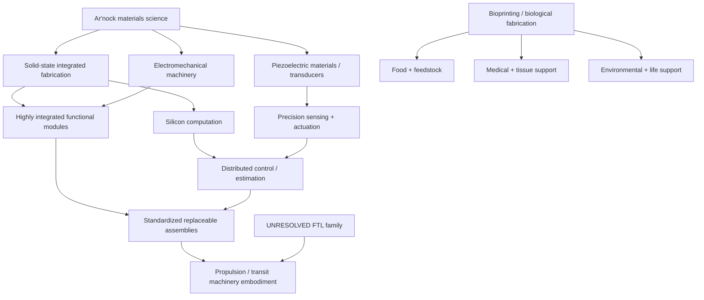
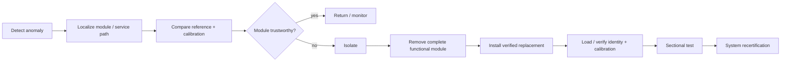

# Ar'nock Propulsion & Transit Engineering Profile

**Status:** authoritative race/species-specific engineering integration profile with field-level canon labels.  
**Authority relationship:** subordinate to `docs/blacklight/BLACK_LIGHT_PROPULSION_TRANSIT_AUTHORITY.md` and the governing FTL-family physics, but authoritative for the **general Ar'nock machinery basis** used by propulsion/transit generators.  
**Design source:** *The different lightspeed methods* remains the governing family-physics source.  
**Association rule:** this profile does **not** assign a recovered FTL family to the Ar'nock.  
**Correction notice:** this revision supersedes earlier descriptions that treated biological/symbiotic machinery, cultivated neural computation, metabolic power distribution, living field organs, or vascular control networks as the default Ar'nock technological basis.

---

## 1. Canon boundary

The Ar'nock are a technologically mature nonhuman civilization whose surviving vessel demonstrates advanced biological fabrication, but biological fabrication is **not** the foundation of their general technological stack.

The corrected baseline is:

> **Ar'nock general technology is primarily solid-state and electromechanical, with extensive silicon computation, piezoelectric sensing/actuation, high functional integration, rugged construction, and an unusually strong design commitment to modular replacement.**

Bioprinting remains an important but secondary technology. Its ordinary domains are feedstock conversion, food and nutrient production, medicine, replacement tissue, environmental management, waste processing, ecological support, and life support. A biological printer aboard an Ar'nock vessel no more implies that the navigation computer is alive than a human medical bioreactor implies that a reactor-control PLC is grown tissue.

The following are therefore `CONFIRMED` or current authoritative design constraints for generation:

| Property | Status | Engineering interpretation |
|---|---|---|
| Ar'nock are a nonhuman technological civilization | `CONFIRMED` | Species/polity archive |
| Biological fabrication / bioprinting exists | `CONFIRMED` | Secondary fabrication, medical, feedstock and environmental technology |
| General computation is solid-state silicon | `AUTHORITATIVE_CORRECTION` | Default compute substrate for ordinary machinery |
| Piezoelectric functions are technologically important | `AUTHORITATIVE_CORRECTION` | Sensing, precision actuation, vibration analysis, resonant timing and diagnostics |
| General machinery is solid-state/electromechanical | `AUTHORITATIVE_CORRECTION` | Default basis unless a source establishes an exception |
| Strong modularity is characteristic | `AUTHORITATIVE_CORRECTION` | Complete functional assemblies are the normal service boundary |
| Flexible/vibration-oriented interfaces occur | `CONFIRMED` | Compatible with segmented anatomy and piezoelectric technology |
| Ar'nock use any particular FTL family | `UNRESOLVED` | Species identity never selects family |
| Ar'nock FTL performance/range/spool time | `UNRESOLVED` | No recovered canonical numbers |

### 1.1 Canon safeguard

\[
\boxed{\text{bioprinting capability}\not\Rightarrow\text{biological technological base}}
\]

and

\[
\boxed{\text{Ar'nock identity}\not\Rightarrow\text{FTL family identity}}
\]

Both implications are prohibited in generators and prose.

---

## 2. Ar'nock engineering ancestry

The corrected technology ancestry is:



Biotechnology is deliberately shown as a parallel support branch rather than as the trunk from which computation and propulsion descend.

---

## 3. Modularity: the defining Ar'nock engineering habit

Human machinery commonly places many separately manufactured components on a serviceable board or chassis. Ar'nock fabrication pushes integration downward into the module itself.

A human electrical assembly may be approximated as:

\[
A_H = \sum_j C_j + P + K
\]

where \(C_j\) are discrete components, \(P\) is the board/interconnect substrate and \(K\) represents connectors and packaging.

An Ar'nock functional module is more usefully treated as a fabricated functional volume:

\[
M_A = \mathcal{F}(S, D, C, R, X, P, I)
\]

where the manufactured structure may integrate switching \(S\), conductive paths \(D\), capacitive structures \(C\), resistive functions \(R\), transducers \(X\), local processing \(P\), and interface geometry \(I\) into one replaceable object.

This is an engineering description, not a claim that every module is literally monolithic silicon. The important service distinction is:

\[
\boxed{\text{Human modularity}\approx\text{components on assemblies}}
\]

\[
\boxed{\text{Ar'nock modularity}\approx\text{complete functional assemblies as components}}
\]

A damaged Human control board may invite component-level repair. A damaged Ar'nock control module is more likely to be diagnosed, isolated, removed, replaced and recertified. Internal repair may require fabrication capabilities well beyond an ordinary shipboard workshop.

### 3.1 Consequence for derelict salvage

Ar'nock wreckage should therefore contain many objects that appear deceptively self-contained. A palm-sized or torso-sized unit may incorporate what a Human engineer expects to find spread across several boards, sensor interfaces, power conditioners and timing circuits.

This creates the characteristic archaeological experience:

> Everything looks like a component until examination reveals that each component is an entire subsystem.

---

## 4. Silicon computation

General Ar'nock computation defaults to solid-state silicon or closely related semiconductor implementations. The exact doping methods, lithography, three-dimensional integration, packaging, clocking and device geometries may be alien, but the conceptual substrate is electronic solid-state computation rather than cultivated nervous tissue.

Expected traits include:

- high local integration;
- distributed compute near sensors and actuators;
- strong module identity/versioning;
- deterministic hardware interlocks for safety-critical functions;
- redundant timing/reference chains;
- aggressive packaging against vibration, chemistry and radiation;
- replaceable compute modules rather than loose serviceable chips;
- local nonvolatile calibration state attached to module identity.

A transit installation should consequently be generated with **regional computing modules** rather than biological ganglia.

For distributed control, retain the physically useful ratio

\[
\Pi_c = \frac{L_c}{v_c\tau_r},
\]

where \(L_c\) is control span, \(v_c\) is signal propagation speed in the installed carrier and \(\tau_r\) is required response time.

As \(\Pi_c\) grows, the architecture should move toward local estimation, local interlocks and sectional abort authority. This is ordinary finite-propagation engineering; it does not require organic computation.

---

## 5. Piezoelectric technology

Piezoelectric and related electromechanical transduction is a characteristic Ar'nock strength.

The direct piezoelectric relation may be represented in linear form as

\[
\mathbf{D}=\mathbf{d}\,\mathbf{T}+\boldsymbol{\epsilon}^{T}\mathbf{E},
\]

and the converse effect as

\[
\mathbf{S}=\mathbf{s}^{E}\mathbf{T}+\mathbf{d}^{T}\mathbf{E},
\]

where \(\mathbf{D}\) is electric displacement, \(\mathbf{T}\) stress, \(\mathbf{E}\) electric field, \(\mathbf{S}\) strain, \(\mathbf{d}\) the piezoelectric coupling tensor, \(\boldsymbol{\epsilon}^{T}\) permittivity at constant stress and \(\mathbf{s}^{E}\) compliance at constant field.

This supports a coherent Ar'nock family of devices:

| Function | Typical use |
|---|---|
| Structural strain sensing | hull load, field-mount alignment, fatigue detection |
| Vibration spectroscopy | bearing health, pump state, loose interfaces, resonance mapping |
| Precision actuation | valves, optical elements, field-former alignment, micropositioning |
| Pressure sensing | fluid, atmosphere, hydraulic and process monitoring |
| Resonant timing | local oscillator/reference functions |
| Acoustic communication | mechanically coupled controls and maintenance signaling |
| Material characterization | crack detection and bond/interface inspection |
| Inertial support | accelerometer/gyro-related transduction where appropriate |

Piezoelectric instrumentation supplements rather than replaces family-required gravimetry, Q-state sensing, endpoint evidence or topological measurement.

---

## 6. Six invariant route semantics in Ar'nock form

| Route | Corrected Ar'nock embodiment | Status | Typical faults |
|---|---|---|---|
| `structural` | metallic/ceramic/composite load paths with integrated piezoelectric health sensing | `DERIVED` | fracture, delamination, fastener/interface shift, transducer drift |
| `power` | modular converters, buses, buffers, protection and local energy-conditioning assemblies | `DERIVED` | bus isolation, converter failure, connector resistance, reserve depletion |
| `cooling` | pumps, heat exchangers, cold plates, fluid trunks and sectional valves | `DERIVED` | flow loss, fouling, leakage, pump failure, exchanger saturation |
| `data` | solid-state silicon compute, deterministic buses, timing/reference links and local nonvolatile state | `DERIVED` | bit corruption, clock drift, bus partition, module-version mismatch |
| `atmosphere` | electromechanical environmental plant supplemented by biological/chemical processing where useful | `MIXED` | scrubber failure, chemical imbalance, feedstock exhaustion |
| `access` | modular bays and mechanically coupled interfaces suited to elongated segmented operators | `DERIVED` | inaccessible geometry, damaged latches, incompatible service adapters |

The same abstract route semantics can be implemented by another species through entirely different machinery.

---

## 7. Family-neutral transit machinery grammar

Until Ar'nock FTL-family identity is sourced, generated transit machinery uses the following eight-block grammar.

### 7.1 Energy conditioning

Default to replaceable solid-state power conversion, switching, energy buffering, isolation and measurement modules. Energy storage may use whatever setting-appropriate chemistry or field storage is established for the installation, but it should not become metabolic merely because the ship also contains bioprinters.

### 7.2 Prime mover

The prime mover remains family-specific. The Ar'nock contribution is packaging and control: modular field-producing assemblies, integrated power electronics, local silicon control and replaceable interfaces.

### 7.3 Field/effect formation

Use repeated field-former modules, emitter sectors, resonant structures, coupling assemblies or geometry-control units appropriate to the selected family. Large installations should segment rather than scale one central assembly without limit.

### 7.4 Transit control

Use distributed solid-state controllers with local feedback, independent references, deterministic interlocks and sectional isolation.

### 7.5 Navigation and sensing

Use the sensors demanded by the selected family, augmented by Ar'nock piezoelectric structural/actuator diagnostics and vibration-based interfaces.

### 7.6 Termination and recovery

Recovery means disposing of the family-specific field/state safely while retaining protected electrical, thermal, control and structural margin. It does **not** generically mean tissue regeneration.

### 7.7 Whole-effect coverage

Coverage is maintained by surveyed module geometry and actual vessel configuration. Refit, cargo, appendage changes and battle damage require recertification where they alter the protected region.

### 7.8 Safety backbone

Use hard isolation, independent abort buses, protected stores, local interlocks, sectional breakers/valves and mechanically independent emergency controls.

---

## 8. Scaling behavior

The useful generic control ratio remains

\[
\Pi_c=\frac{L_c}{v_c\tau_r}.
\]

A second useful modularity measure is the proportion of installation function that can survive loss of one service region. For service graph \(G=(V,E)\), path availability remains deterministic:

\[
A_p=\min\left(A_{source},\min_{e\in p}A_e\right),
\qquad
A_s=\max_p A_p.
\]

This is a normalized support state, not a probability.

Ar'nock capital systems should therefore become **more sectional and modular**, not more biological:

| Scale | Typical morphology |
|---|---|
| Probe | one or a few compact integrated modules; little redundancy |
| Shuttle/fighter | tightly packaged modules; rapid line replacement |
| Corvette | first strong sectional power/data/cooling isolation |
| Frigate/merchant | redundant functional bays and cross-ties |
| Cruiser | regional compute/control, local buffers and field sectors |
| Capital | hierarchical modular provinces with local safety authority and protected reserves |
| Fixed infrastructure | replaceable industrial sectors, remote service access and deep redundancy |

---

## 9. Power, thermal and recovery engineering

Gross power never establishes transit readiness.

For instantaneous load \(P_L\) and available generation \(P_a\),

\[
P_d=\max(0,P_L-P_a).
\]

With protected buffer energy \(E_b\), if \(P_L>P_a\),

\[
t_{hold}=\frac{E_b}{P_L-P_a}.
\]

If the required emergency sequence is \(t_{int}\), then

\[
\boxed{t_{hold}<t_{int}\Rightarrow\text{unsafe for that emergency state}.}
\]

For short thermal transients,

\[
C_{th}\frac{dT}{dt}=P_{heat}-P_{reject},
\]

or, over a sufficiently short interval with approximately constant terms,

\[
T(t)=T_0+\frac{P_{heat}-P_{reject}}{C_{th}}t.
\]

Ar'nock machinery should express these burdens through converter modules, bus state, protected stores, coolant loops, thermal interfaces and local isolation hardware.

Biological life-support loads remain ordinary consumers in the vessel energy budget rather than the drive's default working medium.

---

## 10. Control and safety timing

The installation intervention chain remains

\[
t_{int}=t_{sensor}+t_{solver}+t_{decision}+t_{command}+t_{actuate}+t_{exit}+t_{clear}+t_{margin}.
\]

Ar'nock implementation channels map naturally to:

- `sensor`: family-specific sensors plus piezoelectric condition sensors;
- `solver`: silicon estimation/route modules;
- `decision`: supervisory logic/operator arbitration;
- `command`: deterministic buses and sectional links;
- `actuate`: electromechanical or field-control modules;
- `exit`: family-specific termination hardware;
- `clear`: post-exit stabilization/clearance machinery;
- `margin`: certification reserve.

For PRECOMMIT systems, use timing margin rather than a fabricated local FTL speed:

\[
M_T=t_{prediction}-t_{int}.
\]

For continuous projected-progress families,

\[
M_T=\frac{D_B}{v_p}-t_{int}.
\]

Here \(v_p\) is route-progress semantics; it does not assert local hull velocity greater than \(c\).

---

## 11. Maintenance doctrine

Ar'nock maintenance is **module-centered condition maintenance**.

### 11.1 Normal service loop



### 11.2 Important maintenance consequence

The internal integration that makes modules compact also makes improvised component-level repair difficult. A Human technician may recognize power input, signal paths and output behavior while still being unable to identify a separately replaceable capacitor, resistor or ADC because those functions are fabricated into the module structure.

The correct salvage question is often not “which component is burned?” but:

> “Which module owns the failed function, what services does it require, what interfaces does it expose, and can another verified module replace it?”

### 11.3 Refit provenance

Every replacement should preserve:

- original module identity if known;
- replacement identity;
- hardware revision;
- firmware/solver revision where applicable;
- calibration epoch;
- calibration environment;
- vessel/refit authority;
- changed service paths;
- changed latency;
- changed protected reserve requirement.

A replacement that fits mechanically but changes timing is not automatically certified.

---

## 12. Signatures and forensics

Ar'nock technology should generally leave **solid-state/electromechanical** signatures:

| Condition | Likely evidence |
|---|---|
| standby | clock/reference emissions, low converter load, maintenance polling |
| spool/preparation | converter harmonics, buffer charging, compute load, calibration sweeps |
| actuation | switching transients, electromechanical motion, resonant/piezoelectric activity |
| high load | thermal rejection, current redistribution, coolant/pump changes |
| fault isolation | abrupt bus topology changes, module dropout, breaker/valve operation |
| post-event | heat, residual field evidence, error logs, changed resonance/alignment state |

Biochemical signatures should be associated primarily with crew/environmental support or explicitly biological equipment, not automatically with the transit drive.

---

## 13. Failure model

The corrected generic Ar'nock failure set includes:

- solid-state module failure;
- semiconductor aging or radiation damage;
- clock/reference drift;
- local nonvolatile calibration corruption;
- connector/contact degradation;
- bus partition;
- converter failure;
- protected-store depletion;
- cooling-loop isolation or flow loss;
- piezoelectric cracking, depoling or calibration drift;
- actuator seizure/misalignment;
- structural interface shift;
- incompatible module revision;
- stale refit topology;
- correlated software/model error;
- family-specific exotic failure.

The instance failure remains a composition:

\[
F_{instance}=F_{family}\otimes F_{basis}\otimes F_{species}\otimes F_{condition}.
\]

A solid-state Ar'nock module failure does not replace a gravitational-plane shear fork, Q-address error, fold endpoint conflict or wormhole throat instability. It modifies how the installation reaches or responds to that family-specific failure.

---

## 14. Biotechnology boundary

Bioprinting is technologically important and should remain visible in the vessel without swallowing the rest of its engineering identity.

Appropriate default domains include:

- food and nutrient feedstock;
- medical tissue production;
- replacement organs/prosthetic biological structures;
- recycling and waste conversion;
- atmospheric/ecological processing;
- microbial/chemical support systems;
- crew life support;
- emergency biological fabrication.

The generator rule is:

```text
if subsystem in {food, medicine, tissue, ecology, life-support, biological feedstock}:
    biotechnology is plausible by default
else:
    default to solid-state/electromechanical modular machinery
    unless a named source explicitly establishes a biological exception
```

---

## 15. Practical field manual — Human salvage crew

### ASM-01 — Unknown Ar'nock module

1. Photograph and map the module before removal.
2. Measure voltage, current, impedance, thermal state, vibration and signal activity without assuming Human connector conventions.
3. Identify mechanical latch/retention geometry before cutting the housing.
4. Search for piezoelectric or mechanically coupled service points; a surface that appears inert may be a pressure/vibration interface.
5. Map power, data, cooling and structural connections independently.
6. Do not open a sealed integrated module merely because its external function is understood.
7. Record module identity marks, geometry, neighboring modules and bus position.
8. Isolate and remove at the functional-module boundary where possible.
9. Substitute only after checking pin/function mapping, power conditioning, timing and cooling compatibility.
10. Recertify the affected service graph after replacement.

### ASM-02 — Piezoelectric diagnostic array

1. Establish unloaded baseline resonance.
2. Apply a bounded excitation sweep below known damage thresholds.
3. Record amplitude and phase response.
4. Compare against neighboring/reference transducers.
5. Treat abrupt resonance shifts as possible bond fracture, geometry change, preload change or material damage.
6. Do not infer exotic field damage until mechanical causes are bounded.

For a simple damped resonance,

\[
H(\omega)=\frac{1}{\sqrt{(1-(\omega/\omega_n)^2)^2+(2\zeta\omega/\omega_n)^2}},
\]

where \(\omega_n\) is natural frequency and \(\zeta\) damping ratio. Changes in \(\omega_n\) or \(\zeta\) can provide useful structural evidence without pretending that the relationship uniquely identifies a fault.

### ASM-03 — Transit compute replacement

`identify -> isolate -> preserve old calibration -> install replacement -> verify revision -> restore references -> sectional test -> compare latency -> family-specific recertification`

Never treat successful boot as proof of transit certification.

---

## 16. Generator contract

A valid Ar'nock propulsion/transit generator MUST:

1. Default general machinery to solid-state/electromechanical modular construction.
2. Default computation to solid-state silicon or an explicitly sourced equivalent semiconductor implementation.
3. Prefer piezoelectric transduction where vibration, strain, pressure, precision actuation or resonant timing are useful.
4. Treat complete functional assemblies as the normal modular/service boundary.
5. Keep biotechnology primarily in feedstock, medical, environmental and life-support roles unless a source explicitly establishes another use.
6. Never infer FTL family from species identity.
7. Never infer FTL family from words such as gravitic, slipstream, phase, fold or gate without authority mapping.
8. Preserve family mathematics unchanged by machinery style.
9. Preserve per-field provenance for family, machinery, module/refit identity and any biological exception.
10. Preserve `UNRESOLVED` values instead of filling them with genre assumptions.

### 16.1 Forbidden default phrases

Without a specific source, do not describe generic Ar'nock propulsion or control using:

- cultivated neural controller;
- living field organ;
- vascular power trunk;
- metabolic drive;
- sensory tissue;
- actuator organism;
- biological ganglion;
- regenerative field machinery;
- tissue-based transit computer.

Those descriptions require explicit subsystem-level authority.

---

## 17. Educational text — Transit Engineering 715

### **Ar'nock Modular Solid-State Systems, Piezoelectric Diagnostics, and Alien Service Boundaries**

Learning objectives:

- distinguish biological fabrication capability from a biological technological base;
- identify the Ar'nock functional-module service boundary;
- analyze distributed solid-state control with finite propagation delay;
- apply piezoelectric constitutive relations to diagnostics and actuation;
- construct power, cooling, data and abort dependency graphs;
- preserve family-specific FTL mathematics while changing machinery embodiment;
- distinguish a replaceable module from an internally repairable assembly;
- preserve refit provenance and timing certification after module replacement.

### Worked question

A regional controller is 420 m from a supervisory node. Its optical/electrical link has effective propagation speed \(v_c=1.8\times10^8\,\mathrm{m/s}\), while the required regional control response is \(\tau_r=3.0\times10^{-4}\,\mathrm{s}\).

\[
\Pi_c=\frac{420}{(1.8\times10^8)(3.0\times10^{-4})}\approx7.78\times10^{-3}.
\]

Propagation alone is therefore a small fraction of the allowed response interval. That does **not** prove the loop is fast enough: sensor integration, solver latency, arbitration, actuator response and margins remain in

\[
t_{int}=\sum_i t_i.
\]

The educational point is that physically small propagation pressure does not authorize ignoring the rest of the timing chain.

---

## 18. Provenance and supersession

This profile is the current authority for general Ar'nock technology embodiment inside propulsion/transit generation. Older references that derive `BIOLOGICAL_SYMBIOTIC` as the primary Ar'nock technology basis are superseded where they conflict with this document.

The foundation archive remains useful evidence that Ar'nock biological fabrication exists. Its older wording about cultivated computation is not to be generalized into the civilization's primary computing substrate. Current engineering authority resolves the general substrate as solid-state silicon and treats any genuinely biological compute component as a **specific exception requiring its own provenance**.

The final invariant is:

\[
\boxed{\text{same family physics}\neq\text{same machinery}}
\]

and, specifically for the Ar'nock:

\[
\boxed{\text{advanced biotechnology}\neq\text{biotechnology-first civilization}.}
\]
