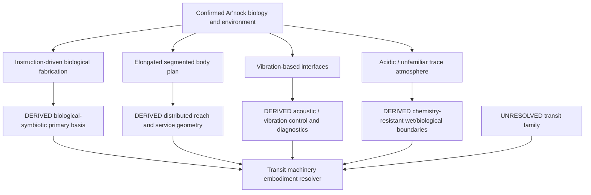
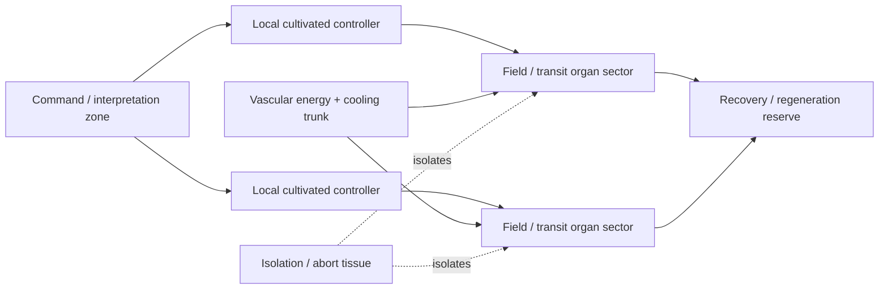
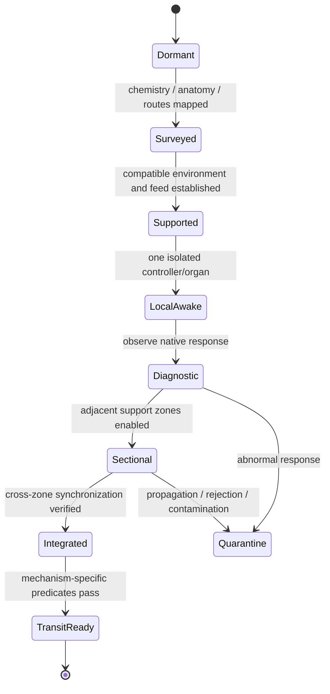

# Ar'nock Propulsion & Transit Engineering Profile

**Status:** race/species-specific engineering integration profile with field-level canon labels.  
**Authority relationship:** subordinate to `docs/blacklight/BLACK_LIGHT_PROPULSION_TRANSIT_AUTHORITY.md`, `EXO_OPERATIVE_TECHNOLOGY_BASIS.md`, and surviving Ar'nock campaign/archive records. This profile does **not** assign an unrecovered FTL family to the Ar'nock.  
**Primary source:** `data/blacklight-continuum/wiki/foundation-lore.json` (`arnock-species`, `arnock-derelict`).  
**Canon labels:** `CONFIRMED`, `DERIVED`, `PROPOSED`, and `UNRESOLVED` have the meanings defined by the consolidated propulsion/transit authority.

---

## 1. Canon boundary

The surviving Ar'nock record establishes a nonhuman civilization associated with a damaged vessel in the *No Return Signal* foundation archive. The archive confirms biological fabrication capable of constructing complete organisms from instruction sets and versatile feedstock; cultivated neural computation; nonhuman ergonomic and sensory assumptions; elongated segmented limbs; flexible interfaces; vibration-based controls; survivable but chemically unpleasant atmospheric overlap with humans; and Ar'nock-specific materials and safety conventions.

The archive does **not** currently establish:

- a named Ar'nock FTL/transit family;
- an Ar'nock manufacturer name or connector standard;
- transit Path level or shared T-tier;
- canonical transit performance, range, spool time, recovery time, or energy consumption;
- a canonical drive-room layout;
- a statement that all Ar'nock machinery is biological;
- a chronology capability.

Those fields remain `UNRESOLVED` until a higher-authority source is recovered. A generator may derive an operative machinery style from confirmed Ar'nock evidence, but it must not convert that derived style into an invented transit-family assignment.

### 1.1 Status matrix

| Property | Status | Current record |
|---|---|---|
| Ar'nock are a nonhuman technological civilization | `CONFIRMED` | foundation archive |
| Biological instruction-driven fabrication exists | `CONFIRMED` | foundation archive |
| Cultivated neural computation exists aboard the vessel | `CONFIRMED` | derelict/archive records |
| Flexible and vibration-based interfaces occur | `CONFIRMED` | environmental assumptions table |
| Human-survivable atmospheric overlap with acidic/unfamiliar traces | `CONFIRMED` | environmental assumptions table |
| Primary EXO operative basis maps most closely to `BIOLOGICAL_SYMBIOTIC` | `DERIVED` | operative-basis resolver applied to confirmed machinery ancestry |
| Vibration/acoustic control is a likely secondary implementation pressure | `DERIVED` | confirmed interface/sensory evidence |
| Ar'nock use any particular FTL family | `UNRESOLVED` | no surviving assignment located |
| Ar'nock FTL is inherently organic | `UNRESOLVED` | biological fabrication alone does not establish every subsystem's carrier |
| Ar'nock transit performance | `UNRESOLVED` | no recovered numbers |

---

## 2. Engineering ancestry

`EXO_OPERATIVE_TECHNOLOGY_BASIS.md` requires operative technology to resolve through species environment and chemistry, body plan and senses, civilization/organization, manufacturer identity, Path maturity, and subsystem purpose. Applied to the confirmed Ar'nock archive, this produces the following constrained machinery ancestry.



The diagram deliberately leaves the transit family unresolved. Machinery ancestry can be constrained without pretending the archive has told us whether the vessel folds space, rides a Q-boundary, translates through a lattice, follows a manifold, or uses some other confirmed Black Light family.

---

## 3. Provisional technology-basis binding

### 3.1 Primary basis — `DERIVED`

The strongest current resolver result is:

`BIOLOGICAL_SYMBIOTIC`

This is not because “alien equals organic.” It follows from direct evidence of biological printers, cultivated computation, versatile biological feedstock, and machinery explicitly described as biologically unfamiliar. The binding remains `DERIVED`, not `CONFIRMED`, because the foundation archive predates and does not itself use the modern registry identifier.

### 3.2 Secondary pressures — `DERIVED`

The generator should apply secondary Ar'nock-specific pressures without declaring an unsupported second registry family:

- vibration/acoustic signalling and controls;
- flexible interfaces compatible with segmented reach;
- cultivated neural control components;
- chemical tolerance appropriate to acidic trace compounds;
- maintenance assumptions that may involve feeding, culture care, grafting, cleaning, isolation, and biological state management;
- unfamiliar identity/authentication rules for computation and machinery access.

These pressures modify the physical implementation of route semantics. They do not change what the route semantics mean.

---

## 4. Six invariant route semantics in Ar'nock form

The EXO operative authority requires `structural`, `power`, `cooling`, `data`, `atmosphere`, and `access`. The following embodiments are constrained derivations rather than named Ar'nock components.

| Route | Ar'nock-constrained embodiment | Status | Failure questions |
|---|---|---|---|
| `structural` | grown composite members, flexible interfaces, internal/external support compatible with elongated users | `DERIVED` | tearing, delamination, fatigue, necrosis, attachment drift? |
| `power` | bioelectric/ionic/metabolic carrier or converted energy feeding active tissues and cultivated machinery | `DERIVED` | starvation, ionic imbalance, conduction loss, conversion failure? |
| `cooling` | vascular or circulated working medium with exchange surfaces and biological heat buffering | `DERIVED` | occlusion, contamination, flow loss, exchanger death? |
| `data` | cultivated neural signalling combined with vibration/acoustic interfaces and other unresolved carriers | `DERIVED` | desynchronization, sensory corruption, identity rejection, damaged pathways? |
| `atmosphere` | regulation of a human-survivable but Ar'nock-normal chemistry containing unfamiliar/acidic traces | `CONFIRMED` end condition / `DERIVED` machinery | scrubber ecology loss, chemical imbalance, boundary incompatibility? |
| `access` | reach geometry for segmented limbs plus biological service surfaces and unfamiliar safety boundaries | `DERIVED` | human inaccessibility, contamination, rejection, unavailable interface posture? |

The generator must preserve the distinction between a confirmed environmental fact and the derived machinery needed to maintain it.

---

## 5. Transit installation resolver

Until an Ar'nock transit-family source is recovered, generation should use a two-stage process.

### Stage A — resolve what is known

```text
species = ARNOCK
speciesSource = foundation-lore.json#arnock-species
vesselSource = foundation-lore.json#arnock-derelict
technologyBasis = BIOLOGICAL_SYMBIOTIC [DERIVED]
controlPressure = vibration/acoustic + cultivated neural [DERIVED]
workingEnvironment = Ar'nock vessel atmosphere [CONFIRMED]
transitFamily = UNRESOLVED
manufacturer = UNRESOLVED
transitPath = UNRESOLVED
sharedTier = UNRESOLVED
```

### Stage B — if an external caller deliberately selects a transit family

The generator may produce an **Ar'nock-style hypothetical implementation**, but its provenance must say that the family selection came from the caller/scenario rather than species canon.

```text
resolvedInstallation = embody(
  callerSelectedTransitFamily,
  Ar'nockSpeciesConstraints,
  derivedBiologicalSymbioticBasis,
  vesselScale,
  mission,
  condition,
  selectedPathOrTier
)
```

The result is `MIXED`: the family may be confirmed Black Light physics, the Ar'nock ancestry is source-constrained, but the association between them is not confirmed Ar'nock canon.

---

## 6. Eight-block Ar'nock machinery embodiment

The following is a **family-neutral `DERIVED` embodiment grammar**. It says how required transit functions should look when instantiated through current Ar'nock evidence; it does not say which transit mechanism the Ar'nock possess.

### 6.1 Energy conditioning

Likely embodiment: metabolically maintained conversion organs, electrochemical reservoirs, conductive tissue, mineralized or specialized active inclusions, and isolated high-output structures that convert vessel power into the state demanded by the selected transit mechanism.

Visible/service characteristics should favor branching supply anatomy over human busbars. High-energy interfaces may be chemically or biologically hostile even when they perform an equivalent engineering function.

### 6.2 Prime mover

The prime mover must remain mechanism-specific. For a hypothetical metric system it would create the required metric-driving state; for a Q-lattice system it would establish state coupling; for a fold system it would initiate adjacency. The Ar'nock-specific constraint is that the initiator should be realized through grown/cultivated machinery where compatible with the mechanism rather than defaulting to a terrestrial metal cylinder.

### 6.3 Field formation

A biologically derived Ar'nock implementation should preferentially form distributed effect surfaces: field-bearing tissue, grown conductive lattices, vascularly supplied emitter structures, or mineralized biological arrays integrated into the hull. Capital-scale craft should segment these into independently diagnosable regions rather than scale one organ indefinitely.

### 6.4 Transit control

Cultivated computation and vibration-based controls imply a control architecture in which local biological controllers can exchange state through neural, acoustic, vibratory, ionic, optical, or other compatible carriers. Exact carrier remains mechanism/manufacturer dependent.

### 6.5 Navigation and sensing

Navigation must use the sensors required by the selected transit family. The Ar'nock profile modifies interface and interpretation, not the physical information requirement. A fold solution still needs endpoint exclusion and geometry; a skimmer still needs mass-gradient information; a Q system still needs Q-state references.

Human characters should not automatically understand the control representation. Translation may require mapping vibration patterns, cultivated neural state, biological indicators, and alien reference conventions into human-readable instrumentation.

### 6.6 Termination and recovery

Recovery should include both mechanism-specific energy/state disposal and organism-level recovery debt. A biologically embodied field system may leave metabolic depletion, tissue strain, chemical imbalance, local cell death, neural desynchronization, or regenerative demand in addition to the family-specific physics burden.

### 6.7 Whole-effect coverage

Coverage anatomy should be treated as a distributed hull organ/system. Appendages, flexible surfaces, temporary structures, cargo and damage can invalidate the certified envelope. Biological self-awareness does not eliminate the need to measure what must be carried through the effect.

### 6.8 Control / thermal / abort backbone

The safety backbone should be physically separable enough to arrest propagation from diseased, damaged, desynchronized or contaminated regions. Plausible mechanisms include vascular isolation, neural gating, tissue contraction, local metabolic starvation, sacrificial shedding, chemical inhibition, and hard isolation boundaries. These are `DERIVED` options, not confirmed Ar'nock named procedures.

---

## 7. Scaling behavior

Ar'nock scaling must preserve biological and distributed identity rather than enlarging a single organ linearly.

A useful `PROPOSED` segmentation estimator is:

\[
\Pi_A = \frac{L}{v_c t_r}\left(1+\sigma_f+\sigma_i\right)
\]

where:

- \(L\) is characteristic installation span;
- \(v_c\) is effective coordination propagation speed through the installed control carrier;
- \(t_r\) is required response time;
- \(\sigma_f\) is hull-flex/damage disturbance;
- \(\sigma_i\) is biological state inhomogeneity.

Increasing \(\Pi_A\) should push the generator toward more local ganglia, isolated vascular zones, distributed field organs, regional sensors, and local recovery capacity. No numerical threshold is canonically established.

### 7.1 Scale morphology

| Vessel scale | Preferred derived morphology |
|---|---|
| Probe | one compact cultivated core with minimal regeneration and external support dependence |
| Fighter / shuttle | tightly merged organs, low redundancy, rapid replacement or regeneration burden |
| Corvette | first meaningful sectional vascular/control isolation |
| Frigate / merchant | multiple serviceable field organs, cargo-state compensation, redundant circulation |
| Cruiser | distributed controller ganglia and sectional coverage with battle-damage isolation |
| Capital | hierarchical biological network; regional field organs; independent emergency metabolism/recovery |
| Gatework | if Ar'nock gate use is ever sourced, treat as ecological/industrial infrastructure rather than merely a ship organ enlarged to megastructure size |

The final row is explicitly conditional; no Ar'nock gate use is presently confirmed.

---

## 8. Power and recovery mathematics

No Ar'nock-specific canonical energy law survives in the inspected source. The following are engineering bookkeeping aids.

### 8.1 Resource-state vector — `PROPOSED`

\[
\mathbf{R}_A = [E_u, O_m, C_h, F_n, H_t, R_g]^T
\]

with:

- \(E_u\): usable conditioned energy;
- \(O_m\): metabolic/chemical reserve;
- \(C_h\): cooling/heat-transport reserve;
- \(F_n\): functional neural/control coherence;
- \(H_t\): field-bearing tissue health;
- \(R_g\): regenerative reserve.

A drive may have sufficient gross power and still be unfit for transit if tissue health, cooling, control coherence or recovery reserve are below the family/manufacturer requirement.

### 8.2 Recovery debt — `PROPOSED`

\[
D_r = w_E d_E + w_M d_M + w_T d_T + w_N d_N + w_G d_G
\]

where the individual debts represent energy reserve depletion, metabolic debt, thermal burden, neural/control desynchronization and regenerative/tissue damage. Weights remain uncalibrated and cannot be presented as setting constants.

---

## 9. Control-room and machinery-space design language

A generated Ar'nock space should not default to human deck plans with biological texture applied afterward.

`DERIVED` spatial rules:

- controls may occupy vertical, circumferential or multi-reach surfaces suited to elongated segmented limbs;
- vibration-based input makes mechanically coupled control surfaces meaningful;
- machinery boundaries may be living membranes, sphincter-like access points, graft ports, flexible sealed surfaces or cultivated interfaces;
- cultivated computation may be physically distributed rather than cabinet-centered;
- service clearances should include body-posture and contamination assumptions, not only tool swing radius;
- diagnostic state may be expressed through motion, vibration, tissue tone, chemical markers, luminescence, temperature, pressure or neural activity rather than a screen alone;
- human access may require adapters, protective atmosphere, translation equipment, sterilization, anesthesia/inhibition, remote manipulation or physical modification of service routes.



This diagram is an embodiment model, not a recovered Ar'nock deck plan.

---

## 10. Practical field manual — human salvage crew

**Procedure status:** `DERIVED` survival/maintenance doctrine based on confirmed environment and operative-technology rules. It is not a recovered Ar'nock manual translation.

### 10.1 Before touching unfamiliar transit machinery

1. Establish whether the surface is structural, neural, vascular, respiratory, control, reproductive/regenerative, or unknown. Do not assume a panel is inert because it is stationary.
2. Sample atmosphere and surface chemistry. Confirm protection against acidic/unfamiliar trace compounds and biological contamination in both directions.
3. Observe vibration, pressure, temperature, electrical/ionic potential, chemical flow and spontaneous tissue response before making contact.
4. Identify cultivated neural structures before cutting, shocking, sedating, starving, isolating or mechanically restraining a component.
5. Map local supply and return routes. A tube that looks like coolant may also transport nutrients, signalling molecules or immune chemistry.
6. Establish an isolation boundary before attaching human power/data equipment. Default interoperability is not `DIRECT`.
7. Preserve samples and provenance. Unknown does not mean disposable.

### 10.2 Low-power wake-up

Do not jump directly from dormant to strategic transit state.



A human team should prefer sectional awakening because a living or cultivated system can propagate faults through chemistry, control state, vascular routes and immune responses that ordinary electrical isolation would not stop.

### 10.3 Post-operation checks

Record tissue tone/health, chemical balance, vascular flow, thermal condition, neural/control synchronization, field-organ structural state, regeneration demand, and family-specific residual effects. Compare against the pre-operation baseline. Do not erase abnormal behavior by immediately forcing a second cycle.

---

## 11. Maintenance model

### 11.1 Preventive maintenance — `DERIVED`

Ar'nock-derived machinery should favor condition-based service over a purely hour-based human schedule. The generator should emit measurable health indicators such as:

- tissue integrity and scar burden;
- vascular flow and pressure;
- nutrient/chemical reserve;
- contamination and microbiological state;
- neural synchronization;
- vibration/resonance response;
- interface elasticity and closure;
- field-bearing inclusion alignment or integrity where present;
- regeneration capacity;
- environmental chemistry.

### 11.2 Repair vocabulary

Valid repair verbs should include more than `replace` and `calibrate`:

`feed | flush | graft | excise | culture | regenerate | inhibit | stimulate | isolate | reinnervate | reseed | rebalance | cleanse | align | brace | seal | translate | recertify`

The exact verb depends on the component. A generator should not describe surgery on a purely mineral element or electrical recalibration of an endocrine control loop unless an explicit hybrid interface warrants it.

---

## 12. Signatures and observability

An Ar'nock-style transit installation should inherit the selected family's signatures and add basis-specific channels where physically justified.

| Operational phase | Mechanism signature | Ar'nock-derived additional evidence |
|---|---|---|
| dormant | family-dependent residuals | metabolism, chemistry, low neural/vibration activity |
| spool | family-specific field/exotic precursor | rising metabolic demand, vascular flow, thermal/chemical shift, synchronization vibration |
| commit | mechanism-specific discontinuity/field state | abrupt neural/control lock, organ contraction/pressure changes, resource draw |
| transit | family-specific observable state | sustained biological load where local process persists |
| termination | emergence/recovery signature | heat, chemical waste, tissue strain, control resynchronization |
| aftermath | residual field/topology/Q evidence | metabolites, inflammatory/regenerative activity, damaged tissue, altered microbiological state |

These additional channels are `DERIVED`; they must not be emitted when a future recovered Ar'nock source explicitly establishes a different implementation.

---

## 13. Failure construction

A useful generator relationship is:

\[
F_{instance}=F_{family}\otimes F_{basis}\otimes F_{species}\otimes F_{condition}
\]

This is categorical composition, not numerical multiplication.

For an Ar'nock-constrained hypothetical installation, basis/species failures may include:

- vascular occlusion or leakage;
- nutrient starvation;
- chemical/osmotic imbalance;
- infection or contamination;
- immune rejection;
- necrosis or scar interference;
- neural desynchronization;
- vibration/reference corruption;
- flexible-interface tearing or loss of closure;
- loss of regeneration reserve;
- cultivated-controller pathology;
- human repair action triggering an alien safety/identity response.

These must then be combined with the selected transit family's actual failure modes. For example, a biological control failure in a fold system is dangerous because it can corrupt endpoint/adjacency control; in a slipstream system it may threaten adhesion; in a metric system it may destabilize field symmetry. The same biological defect should not produce an identical generic “drive malfunction” in every family.

---

## 14. Navigation and operator interpretation

The Ar'nock archive gives us unfamiliar identity controls and vibration-based interfaces, but not a canonical navigator caste or bridge doctrine. Those remain `UNRESOLVED`.

A human-readable translation layer should therefore separate:

```text
native sensed state
    -> native cultivated/neural interpretation
    -> native control representation
    -> translation adapter
    -> human engineering quantities
```

The adapter must preserve uncertainty. If a vibration pattern is only tentatively mapped to “field symmetry,” the UI should display that translation confidence rather than silently presenting a perfect terrestrial gauge.

### 14.1 Translation-confidence model — `PROPOSED`

\[
C_t=C_s C_m C_r C_x
\]

where the factors represent sensor confidence, semantic-map confidence, reference-frame confidence and cross-check confidence. The product is useful as a reasoning aid but has no canonical calibration.

---

## 15. Interoperability

Until a specific conversion interface is recovered, human-to-Ar'nock transit machinery should default to:

`ADAPTER_REQUIRED`

and escalate to:

`HOSTILE_WITHOUT_CONVERSION`

where chemistry, biology, pressure, temperature, identity/authentication, control reference, or living-system safety makes direct attachment dangerous.

A proper conversion bay may need all of the following simultaneously: energy conversion, isolated sensing, protocol/semantic translation, chemical separation, atmosphere transition, sterilization, mechanical reach adaptation, biological containment, and a safe method for servicing living components. A cable with two different plugs is not sufficient.

---

## 16. Generator/API binding

A race-specific profile should be represented separately from a transit-family record so that absence of an FTL assignment remains expressible.

```json
{
  "speciesId": "arnock",
  "sourceStatus": "MIXED",
  "sources": [
    "data/blacklight-continuum/wiki/foundation-lore.json#arnock-species",
    "data/blacklight-continuum/wiki/foundation-lore.json#arnock-derelict",
    "EXO_OPERATIVE_TECHNOLOGY_BASIS.md"
  ],
  "technologyBasis": {
    "value": "BIOLOGICAL_SYMBIOTIC",
    "status": "DERIVED",
    "resolverRule": "species-environment-bodyplan-operative-basis"
  },
  "speciesPressures": {
    "fabrication": {"value": "instruction-driven biological fabrication", "status": "CONFIRMED"},
    "computation": {"value": "cultivated neural components", "status": "CONFIRMED"},
    "interface": {"value": "flexible and vibration-based", "status": "CONFIRMED"},
    "atmosphere": {"value": "human-survivable overlap with acidic/unfamiliar traces", "status": "CONFIRMED"}
  },
  "transitAssignment": {
    "family": null,
    "pathLevel": null,
    "sharedTier": null,
    "status": "UNRESOLVED"
  }
}
```

A caller-selected transit family must be stored as scenario/runtime input, not rewritten into `transitAssignment` as confirmed species canon.

---

## 17. Educational text

### Crew explanation

Ar'nock machinery may be alive, cultivated, or partly biological, but “alive” does not mean mysterious. It still requires energy, cooling, signals, structure, working chemistry, access and a safe way to fail. The difficulty is that the routes are implemented in ways human technicians did not evolve alongside.

### Technician explanation

Treat each living component as both machine and environment. Before repair, identify what it consumes, what it excretes, what controls it, what it supports, which other tissues depend on it, and what response damage will trigger. Cutting a supply vessel can be the equivalent of opening a power bus, coolant main, data trunk and alarm circuit simultaneously.

### Engineer explanation

Do not infer transit physics from machinery appearance. A cultivated biological field former could implement any transit family whose physical requirements the civilization can meet. Determine mechanism from measured effect and source evidence; determine embodiment from operative technology ancestry.

### Generator-designer explanation

Species profile and transit family are orthogonal records joined by a resolver. This preserves both canon safety and procedural diversity. It also means the same Ar'nock machinery ancestry can generate visibly coherent but physically different implementations if a campaign explicitly chooses different valid transit families.

---

## 18. Provenance grammar

Every Ar'nock-specific field should preserve three questions:

1. **What did the archive actually say?**
2. **What does the operative engineering framework let us derive from it?**
3. **What did the scenario/generator choose because the archive was silent?**

Recommended trace:

```json
{
  "field": "machineChain.navigationSensing.interface",
  "value": "cultivated neural controller with vibration-based local interface",
  "status": "DERIVED",
  "sourceRefs": [
    "data/blacklight-continuum/wiki/foundation-lore.json#arnock-species",
    "EXO_OPERATIVE_TECHNOLOGY_BASIS.md#2-source-authority"
  ],
  "resolverRule": "preserve confirmed species interface and computation pressures when embodying invariant data/control semantics",
  "parents": [
    "speciesPressures.computation",
    "speciesPressures.interface",
    "routeSemantics.data"
  ]
}
```

A statement such as “Ar'nock ships use Q-Lattice Phase Translation” cannot receive `CONFIRMED` or `DERIVED` status from the currently inspected sources. It would be a caller-selected/proposed association until a source is recovered.

---

## 19. Recovery targets

The next source-recovery pass should search specifically for:

- Ar'nock vessel propulsion or transit terminology;
- named Ar'nock manufacturers, lineages, polities, castes or shipyards;
- drive-room, navigation or power-system archive entries;
- route maps, beacon/gate references or historical travel records;
- transit-related failure/damage evidence on the derelict;
- native maintenance or medical/engineering procedures;
- evidence distinguishing species-wide practice from one vessel's design.

Until those records are found, this profile is intentionally useful without pretending to know more than the archive does.

---

## 20. Validation rules

An Ar'nock propulsion/transit output is invalid if it:

- silently assigns an FTL family from species identity alone;
- labels `BIOLOGICAL_SYMBIOTIC` as directly quoted Ar'nock canon rather than a modern derived registry binding;
- describes all controls as human screens/switches while ignoring confirmed vibration/flexible-interface evidence;
- assumes cultivated neural machinery is ordinary digital electronics;
- assumes biological fabrication grants every subsystem a biological carrier;
- erases the acidic/unfamiliar working-environment implications;
- assumes direct human compatibility;
- gives the Ar'nock chronology manipulation without explicit authority;
- presents proposed numerical equations as recovered physics;
- drops provenance when a scenario supplies otherwise unresolved transit choices.

The profile passes when the generated installation is recognizably Ar'nock because of source-constrained engineering ancestry, while its transit physics remains exactly as confirmed—or exactly as unresolved—as the source record permits.
