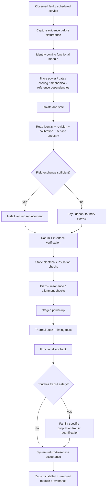
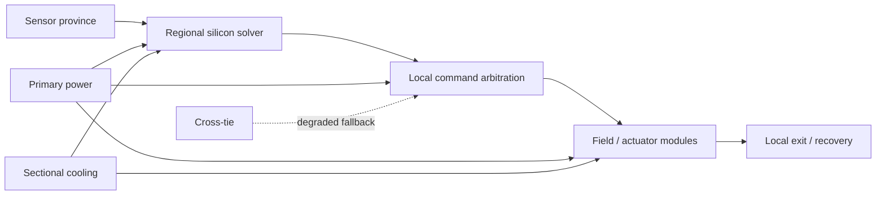

# Ar'nock Propulsion / Transit Service Equipment and Recertification Manual

**Status:** authoritative practical engineering expansion subordinate to the Black Light Propulsion & Transit Authority and the general Ar'nock technology correction.  
**Primary purpose:** connect Ar'nock modular solid-state maintenance practice to propulsion/transit safety, field tooling, fabrication evidence, calibration, refit provenance, and return-to-service certification.  
**FTL-family rule:** this manual does **not** assign the Ar'nock an FTL family. Family-specific procedures apply only after independent family identity is established.  
**Design-intent source:** *The different lightspeed methods* — family-specific gravity sensitivity, safety lookahead, emergency de-transit, maturity-scaled redundancy, realistic mathematical limits, and generations-deep technical documentation.

---

## 1. Engineering baseline

Ar'nock propulsion and transit machinery is maintained as a hierarchy of **ruggedized, highly integrated functional modules** built around solid-state silicon computation, electromechanical machinery, piezoelectric sensing/actuation, deterministic control, sectional power/cooling, and replaceable assemblies.

Biotechnology is not the general machinery substrate. Bioprinting and related biological process equipment remain primarily associated with feedstock, food, medicine, environmental processing, and life support unless a narrower subsystem source explicitly establishes an exception.

The service distinction is:

\[
\boxed{\text{field repair} \approx \text{module diagnosis + exchange + recertification}}
\]

rather than:

\[
\boxed{\text{field repair} \approx \text{arbitrary internal component surgery}}
\]

The internal module may itself contain switching, capacitance, resistance, signal conditioning, sensing, local computation, protection, and interface geometry fabricated into one functional object.

---

## 2. Service architecture



The defining best practice is that **service begins with evidence preservation**, not disassembly.

An intermittent connector, timing fault, resonance anomaly, thermal defect, or reference mismatch can disappear after reseating or power cycling. If the evidence is destroyed first, later certainty is usually false certainty.

---

## 3. Service equipment families

### 3.1 Identity and provenance reader

Every serviceable propulsion/transit module should be treated as potentially carrying locally relevant identity and calibration state.

Capture where available:

- module identifier;
- hardware revision;
- logic/firmware revision;
- calibration revision and epoch;
- installation identity;
- manufacturer/fabrication authority;
- refit authority;
- accumulated fault/service history;
- reference-state ancestry;
- unresolved provenance gaps.

A mechanically compatible module is not automatically a certified replacement.

### 3.2 Controlled electrical characterization fixture

The bench should permit controlled energization, current limiting, insulation/leakage tests, continuity, bus termination, signal injection, and representative load simulation.

For interface resistance \(R_c\) carrying current \(I\),

\[
P_{contact}=I^2R_c.
\]

At high current, small interface degradation can create localized heating large enough to damage an otherwise healthy module.

### 3.3 Piezoelectric impedance / resonance analyzer

Ar'nock machinery makes extensive use of piezoelectric elements for structural condition monitoring, alignment, vibration analysis, precision actuation, pressure sensing, resonant references, and mechanically coupled interfaces.

A first-order modal approximation is

\[
f_n=\frac{1}{2\pi}\sqrt{\frac{k}{m}},
\]

with quality factor

\[
Q\approx\frac{f_0}{\Delta f}.
\]

For small perturbations,

\[
\frac{\Delta f}{f}\approx\frac{1}{2}\left(\frac{\Delta k}{k}-\frac{\Delta m}{m}\right).
\]

This is diagnostic evidence, not a unique fault classifier. A resonance change can arise from temperature, cracking, looseness, contamination, altered preload, deposited mass, boundary-condition shift, or several effects together.

### 3.4 Thermal characterization

For short lumped transients,

\[
C_{th}\frac{dT}{dt}=P_{in}-P_{reject}.
\]

If terms are approximately constant over a short test interval,

\[
T(t)=T_0+\frac{P_{in}-P_{reject}}{C_{th}}t.
\]

A cold self-test does not establish loaded thermal serviceability.

### 3.5 Mechanical metrology

Verify:

- datum position and orientation;
- gap and flatness;
- mount geometry;
- preload evidence;
- actuator travel;
- vibration response;
- temperature-dependent dimensional state.

First-order thermal shift is

\[
\Delta L=\alpha L\Delta T.
\]

Alignment acceptance must therefore state the relevant thermal state when thermal expansion matters.

### 3.6 Bus / timing / protocol test set

Safety-critical control requires more than electrical continuity.

Measure:

- propagation delay;
- clock/reference agreement;
- arbitration timing;
- error counters;
- deterministic endpoint response;
- failover latency;
- sectional reroute latency.

For a control path with segment delays \(\tau_j\),

\[
\tau_p=\sum_j\tau_j.
\]

For a certified baseline \(\tau_0\) and current route \(\tau_c\), use the excess penalty

\[
\Delta\tau=\max(0,\tau_c-\tau_0).
\]

Do **not** add the entire current propagation delay to a timing budget that already included nominal certified delay.

---

## 4. Fabrication and module interface standard

A propulsion/transit module record should identify seven interface classes.

| Interface | Required engineering question |
|---|---|
| Mechanical datum | What establishes position and orientation? |
| Power | What source, voltage/current/energy domain, protection, and reserve are required? |
| Data/control | What protocol, arbitration, latency, and reference assumptions exist? |
| Thermal | How is heat coupled to sinks, fluid loops, radiators, or structure? |
| Environmental boundary | What atmosphere, vacuum, chemistry, contamination, or pressure state is required? |
| Calibration identity | Which stored state makes this module valid in this installation? |
| Service boundary | What may be exchanged in field, bay, depot, or foundry conditions? |

Two invariants follow:

\[
\boxed{\text{physical fit}\not\Rightarrow\text{functional compatibility}}
\]

and

\[
\boxed{\text{functional compatibility}\not\Rightarrow\text{calibration equivalence}}.
\]

A later-generation module may fit and communicate yet change actuator delay, reference behavior, thermal rejection, fault response, or timing enough to invalidate previous certification.

---

## 5. Service levels

| Level | Typical work | Typical equipment |
|---|---|---|
| L0 Operator | inspect, self-test, isolate, safe shutdown | local indicators, built-in diagnostics |
| L1 Field exchange | complete module replacement | identity reader, controlled electrical checks, basic metrology |
| L2 Bay service | alignment, calibration, thermal/timing validation | precision metrology, thermal rig, timing/protocol analyzer |
| L3 Depot rebuild | deep module characterization, controlled internal reconstruction | advanced fabrication, microscopy/material inspection, process tooling |
| L4 Foundry | recreate integrated substrate/material process | manufacturing-line or foundry-class capability |

Service level describes the required **infrastructure**, not merely technician skill.

A brilliant engineer without process equipment cannot convert an L4 failure into an L1 repair by confidence alone.

---

## 6. Propulsion/transit timing certification

The safety timing chain remains

\[
t_{int}=t_{sensor}+t_{solver}+t_{decision}+t_{command}+t_{actuate}+t_{exit}+t_{clear}+t_{margin}.
\]

A service action may alter any of these terms even when the module appears functionally correct.

Examples:

- a replacement sensor conditions data more slowly;
- a newer solver has different scheduling behavior;
- a refit adds a protocol bridge;
- a repaired command trunk takes a longer sectional route;
- actuator preload changes response time;
- replacement exit machinery has different power-up latency;
- recovery hardware now shares a more constrained power bus.

### 6.1 Continuous projected-progress families

Where the family semantics permit projected progress speed \(v_p\), and blocker distance is \(D_B\),

\[
M_T=\frac{D_B}{v_p}-t_{int}.
\]

Equivalently,

\[
M_D=D_B-v_pt_{int}.
\]

Here \(v_p\) is projected route-progress semantics. It does not assert local hull velocity greater than \(c\).

### 6.2 PRECOMMIT families

For Q-Lattice, Fold-Jump, or Phase-Displacement style endpoint commitment,

\[
M_T=t_{prediction}-t_{int}.
\]

No along-route hull velocity is invented for an endpoint event.

### 6.3 Anchored portal systems

For Wormhole/Gate systems, service certification concerns mouth state, synchronization, aperture authority, admission, exit, closure, and recovery. Do not manufacture a free-flight route velocity for a portal.

---

## 7. Gravity, sensing, and the governing design source

*The different lightspeed methods* requires different families to experience different gravity- and miscalculation-related efficiency losses and different failure behavior near distorted spacetime.

Service documentation must therefore distinguish ordinary machinery diagnostics from family-required navigation evidence.

A piezoelectric alignment sensor can establish mount strain or structural resonance. It cannot by itself establish:

- gravitational-plane shear-fork safety;
- Q-state address validity;
- manifold return-map validity;
- fold endpoint occupancy;
- wormhole mouth topology;
- phase-displacement compatibility.

The service rule is:

\[
\boxed{\text{machine health evidence}\neq\text{route safety evidence}}
\]

Both may be required before return to transit service.

---

## 8. Power and protected recovery

Power capability and protected emergency reserve are separate quantities.

If available generation is \(P_a\) and emergency load is \(P_L\),

\[
P_d=\max(0,P_L-P_a).
\]

If \(P_L>P_a\) and protected buffer energy \(E_b\) is available,

\[
t_{hold}=\frac{E_b}{P_L-P_a}.
\]

If

\[
t_{hold}<t_{int},
\]

then the protected store cannot sustain the full intervention sequence.

An energy reserve test must also consider peak bus power. Sufficient joules do not guarantee sufficient instantaneous watts.

A conservative service acceptance should therefore verify both:

\[
E_{available,protected}>E_{required}
\]

and, over each critical interval,

\[
P_{available}(t)\ge P_{required}(t).
\]

---

## 9. Large-vessel scaling

The distributed-control ratio remains

\[
\Pi_c=\frac{L_c}{v_c\tau_r},
\]

where \(L_c\) is control span, \(v_c\) carrier propagation speed, and \(\tau_r\) required response time.

As \(\Pi_c\) grows, service documentation should expect:

- local compute;
- local interlocks;
- sectional power/cooling;
- regional command authority;
- local protected recovery stores;
- explicitly measured failover paths;
- multiple calibration provinces.

A capital vessel is therefore not documented as one giant module.



---

## 10. Refit provenance

A refit packet should preserve separate identities for:

1. original installation;
2. original module/manufacturer;
3. removed module and calibration state;
4. replacement module origin/revision;
5. mechanical/interface adapter;
6. software/protocol adapter;
7. calibration authority;
8. post-refit acceptance evidence;
9. remaining limitations;
10. family-specific recertification result.

Do not collapse this into “upgraded drive.”

The difference matters archaeologically, operationally, and for generator provenance.

---

## 11. Failure signatures

Ar'nock propulsion/transit service records should separate failure evidence by physical class.

| Class | Representative evidence |
|---|---|
| Electrical | leakage, abnormal current draw, insulation loss, bus sag, interface heating |
| Timing | propagation increase, clock disagreement, arbitration delay, retry bursts |
| Piezoelectric | resonance shift, changed Q, response asymmetry, drive/sense mismatch |
| Mechanical | datum shift, preload loss, fracture, vibration growth, actuator misalignment |
| Thermal | abnormal rise rate, hot spots, coolant delta-T change, soak instability |
| Control | estimator divergence, command mismatch, failover, stale calibration identity |
| Transit-specific | family sensor disagreement, exit-time increase, protected-reserve shortfall, field geometry error |

A signature is evidence, not automatically a unique diagnosis.

---

## 12. Return-to-service acceptance

Minimum sequence:

```text
PRE-DISTURBANCE EVIDENCE
        ↓
ISOLATE / SAFE
        ↓
IDENTITY + CALIBRATION CAPTURE
        ↓
INTERFACE / DATUM INSPECTION
        ↓
REPLACEMENT COMPATIBILITY
        ↓
INSTALLATION
        ↓
STATIC ELECTRICAL TEST
        ↓
PIEZO / ALIGNMENT TEST
        ↓
STAGED POWER-UP
        ↓
THERMAL SOAK
        ↓
TIMING / PROTOCOL TEST
        ↓
FUNCTIONAL LOOPBACK
        ↓
TRANSIT RECERTIFICATION IF REQUIRED
        ↓
PROVENANCE CLOSE-OUT
```

The acceptance invariant is:

\[
\boxed{\text{return to service requires evidence, not absence of an alarm}.}
\]

---

## 13. Generator documentation contract

Every substantial generated Ar'nock propulsion or transit system should expose a discoverable **Maintenance / Service** block containing:

- service boundary;
- module identity and revision;
- required tooling;
- required measurements;
- calibration/reference state;
- known-good signatures;
- likely failure evidence;
- ambiguity warnings;
- field replacement procedure;
- acceptance tests;
- transit recertification triggers;
- provenance and refit ancestry.

The generator must not invent precise values merely to fill the block.

Unknown values remain `UNRESOLVED`.

Engineering controls must be labeled `DERIVED` or `PROPOSED`.

Measured values remain tied to the measured installation.

---

## 14. Machine-readable service packet

The corresponding service packet schema is:

`data/schemas/exo-vessel-arnock-maintenance-fabrication.schema.json`

with authority registry:

`data/exo-vessel/arnock-maintenance-fabrication-registry.json`

and resolver:

`blacklight-exo-arnock-service-documentation-runtime.js`

The resolver selects **documentation requirements**, tooling classes, service boundaries, and recertification triggers. It does not create family canon or hidden performance numbers.

Conceptual API:

```js
const packet = resolveArnockServicePacket({
  systemId: 'drive-control-sector-03',
  name: 'Transit Control Sector 03',
  function: 'regional transit estimation and command',
  tags: ['compute', 'control', 'timing', 'ftl'],
  calibrationStatus: 'VALID',
  staticTests: true,
  dynamicTests: true,
  thermalSoak: true,
  timingTests: true,
  evidenceComplete: true,
  touchesTransitSafety: true,
  family: null
});
```

Because family is unresolved, that packet can establish that recertification is required without pretending to know what family-specific certification procedure applies.

---

## 15. Technician education sequence

### Ar'nock Systems Engineering 210 — Functional Module Service

Covers module identity, interface classes, safe isolation, replacement discipline, provenance capture, and return-to-service evidence.

### Ar'nock Systems Engineering 320 — Piezoelectric Diagnostics and Structural Metrology

Covers linear piezoelectric response, impedance/resonance measurement, damping, boundary-condition effects, alignment, and diagnostic ambiguity.

### Ar'nock Systems Engineering 430 — Distributed Control and Timing Certification

Covers propagation delay, clock/reference distribution, deterministic buses, sectional reroute timing, failover, and \(\Pi_c\) scaling.

### Transit Safety Engineering 540 — Modular Refit and Family-Specific Recertification

Covers how apparently successful module replacements can alter safety timing, recovery reserves, sensor confidence, actuator response, and route admission.

### Transit Safety Engineering 640 — Derelict Reconstruction and Provenance-Limited Certification

Covers salvage where original calibration, cross-covariance, manufacturing authority, or family identity is incomplete.

---

## 16. Practical exercise: replacement control module

Assume a certified command path had baseline propagation delay

\[
\tau_0=42\ \mu s.
\]

After a refit, the replacement control module requires a protocol adapter and current propagation is measured as

\[
\tau_c=121\ \mu s.
\]

Then

\[
\Delta\tau=121-42=79\ \mu s.
\]

If the original command-stage contribution was

\[
t_{command,0}=0.340\ ms,
\]

then a simple timing adjustment is

\[
t_{command,new}=0.419\ ms.
\]

That may appear trivial, but if many stages gain delay or if the installation operates near its intervention boundary, accumulated microseconds and milliseconds are safety-relevant.

The service conclusion is not “the new module works.”

The service conclusion is:

> The new module works, its measured timing differs from the certified baseline, and the installation requires a timing-aware recertification before transit return-to-service.

---

## 17. Canon safeguards

\[
\boxed{\text{Ar'nock machinery}\not\Rightarrow\text{biological machinery}}
\]

\[
\boxed{\text{bioprinting capability}\not\Rightarrow\text{biological computation}}
\]

\[
\boxed{\text{piezoelectric sophistication}\not\Rightarrow\text{FTL-family sensor capability}}
\]

\[
\boxed{\text{successful self-test}\not\Rightarrow\text{transit certification}}
\]

\[
\boxed{\text{physical compatibility}\not\Rightarrow\text{calibration compatibility}}
\]

\[
\boxed{\text{species identity}\not\Rightarrow\text{FTL family}}
\]

\[
\boxed{\text{missing calibration}\neq 0\text{ error}}
\]

These rules are mandatory for generator output, manuals, salvage interpretation, and refit records.

---

## 18. Origin and provenance

This manual extends the current Ar'nock technology correction and service standard. Its real-physics equations are engineering consistency tools, not claims that recovered alien equipment literally uses Human nomenclature or identical component values.

Source chain:

1. project-owner Ar'nock technology correction;
2. `data/blacklight-continuum/wiki/arnock-technology-authority.json`;
3. `docs/blacklight/ARNOCK_PROPULSION_TRANSIT_ENGINEERING_PROFILE.md`;
4. `docs/blacklight/ARNOCK_SYSTEMS_MAINTENANCE_FABRICATION_STANDARD.md`;
5. `docs/blacklight/BLACK_LIGHT_PROPULSION_TRANSIT_AUTHORITY.md`;
6. *The different lightspeed methods* for the governing family-specific safety and mathematical design intent.

The manual is intentionally family-neutral until higher authority resolves a specific Ar'nock transit family.
