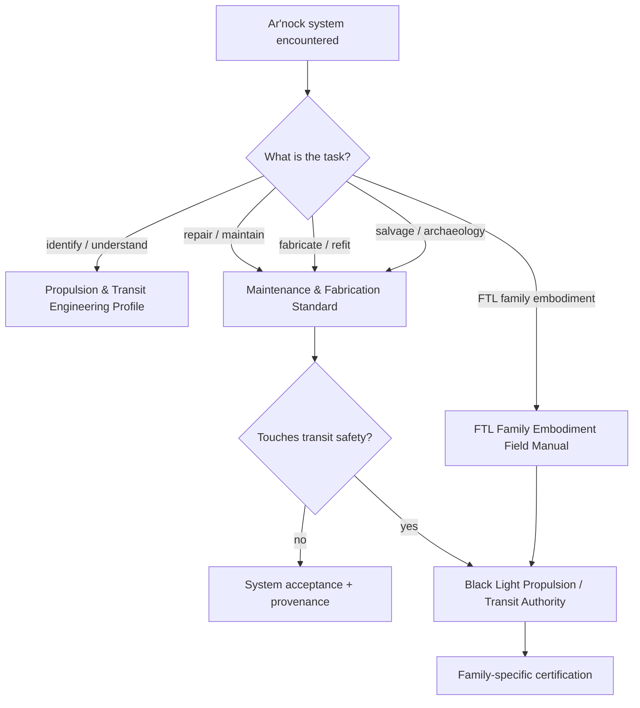

# Ar'nock Systems Documentation Index

**Purpose:** single discoverable entry point for Ar'nock engineering, maintenance, fabrication, propulsion/transit, and field-service documentation in Black Light.

**Current general technology baseline:** Ar'nock machinery is primarily solid-state/electromechanical, silicon-computational, modular, ruggedized, and strongly piezoelectric. Biotechnology and bioprinting are important secondary capabilities for feedstock, medicine, environmental support, and life support; they are not the default basis of computation, control, propulsion, or ordinary machinery.

---

## Start here

If the task is **maintenance, repair, fabrication, salvage, or refit**, begin with:

- [`ARNOCK_SYSTEMS_MAINTENANCE_FABRICATION_STANDARD.md`](ARNOCK_SYSTEMS_MAINTENANCE_FABRICATION_STANDARD.md) — general service layout, tool classes, fabrication rules, module replacement, inspection, acceptance, calibration/provenance, refits, transit recertification, and generator best practices.

If the task is **propulsion or transit machinery**, continue with:

- [`ARNOCK_PROPULSION_TRANSIT_ENGINEERING_PROFILE.md`](ARNOCK_PROPULSION_TRANSIT_ENGINEERING_PROFILE.md) — authoritative general Ar'nock propulsion/transit engineering basis; does not assign an FTL family.
- [`ARNOCK_FTL_FAMILY_EMBODIMENT_FIELD_MANUAL.md`](ARNOCK_FTL_FAMILY_EMBODIMENT_FIELD_MANUAL.md) — family-by-family machinery embodiments used only as engineering possibilities unless a narrower source establishes the family.
- [`BLACK_LIGHT_PROPULSION_TRANSIT_AUTHORITY.md`](BLACK_LIGHT_PROPULSION_TRANSIT_AUTHORITY.md) — consolidated Black Light propulsion/transit authority.
- [`BLACK_LIGHT_FTL_CONTROL_NAVIGATION_MAINTENANCE_EMBODIMENT_MANUAL.md`](BLACK_LIGHT_FTL_CONTROL_NAVIGATION_MAINTENANCE_EMBODIMENT_MANUAL.md) — cross-civilization control, navigation, maintenance, scaling and embodiment doctrine.

The conceptual FTL-family source remains **The different lightspeed methods**.

---

## Documentation routing



---

## Fast lookup by question

| Question | Primary document |
|---|---|
| What is the general Ar'nock technology base? | `ARNOCK_PROPULSION_TRANSIT_ENGINEERING_PROFILE.md` |
| What tools would an Ar'nock or Human technician use? | `ARNOCK_SYSTEMS_MAINTENANCE_FABRICATION_STANDARD.md` |
| What is replaceable in the field versus depot/foundry? | `ARNOCK_SYSTEMS_MAINTENANCE_FABRICATION_STANDARD.md` |
| How are modules fabricated and interfaced? | `ARNOCK_SYSTEMS_MAINTENANCE_FABRICATION_STANDARD.md` |
| How should piezoelectric diagnostics be interpreted? | `ARNOCK_SYSTEMS_MAINTENANCE_FABRICATION_STANDARD.md` |
| How should a refit preserve ancestry and calibration? | `ARNOCK_SYSTEMS_MAINTENANCE_FABRICATION_STANDARD.md` |
| What changes require propulsion/FTL recertification? | maintenance standard + propulsion/transit authority |
| Which FTL family do the Ar'nock use? | `UNRESOLVED`; species identity must not choose one |
| How could an Ar'nock implementation of a particular FTL family look? | `ARNOCK_FTL_FAMILY_EMBODIMENT_FIELD_MANUAL.md` |
| Are Ar'nock computers biological? | No as a general default; ordinary computation is solid-state silicon unless a narrower source explicitly establishes an exception |
| Where does bioprinting belong? | feedstock, medical, environmental/ecological, and life-support chains by default |

---

## Required section layout for generated Ar'nock systems

To make maintenance information discoverable rather than buried in lore prose, generated or manually written Ar'nock system records should expose these headings where applicable:

1. **Purpose and system identity**
2. **Technology basis and module architecture**
3. **Interfaces and dependencies**
4. **Operation and control**
5. **Maintenance / Service**
6. **Required tools and fixtures**
7. **Inspection and diagnostic evidence**
8. **Calibration and reference state**
9. **Replacement / refit procedure**
10. **Acceptance and recertification**
11. **Failure signatures and ambiguity**
12. **Provenance / origin / revision history**
13. **Related documentation**

The **Maintenance / Service** section should link to the general standard rather than restating every generic procedure.

---

## Service-document convention

Each serviceable Ar'nock system should make the following compact block easy to find:

```text
SERVICE BOUNDARY
  Field replaceable: ...
  Bay service: ...
  Depot/foundry only: ...

TOOLS
  Electrical: ...
  Piezo/resonance: ...
  Mechanical/metrology: ...
  Thermal: ...
  Protocol/timing: ...
  Special handling: ...

REFERENCES
  Identity/revision: ...
  Calibration: ...
  Known-good signature: ...

RETURN TO SERVICE
  Static tests: ...
  Dynamic tests: ...
  Thermal soak: ...
  Functional loopback: ...
  Recertification: ...

PROVENANCE
  Canon status: ...
  Origin/source: ...
  Refit/service ancestry: ...
  Unknowns: ...
```

---

## Canon safeguards

The following are navigation-level invariants across all Ar'nock documentation:

\[
\boxed{\text{Ar'nock}\not\Rightarrow\text{biological machinery}}
\]

\[
\boxed{\text{bioprinting}\not\Rightarrow\text{biological computation}}
\]

\[
\boxed{\text{piezoelectric instrumentation}\not\Rightarrow\text{exotic FTL sensing}}
\]

\[
\boxed{\text{module interchangeability}\not\Rightarrow\text{calibration equivalence}}
\]

\[
\boxed{\text{Ar'nock identity}\not\Rightarrow\text{FTL family}}
\]

Unknown information remains unknown. A generator may add `PROPOSED` or `ENGINEERING_CONTROL` material when useful, but it must remain visibly separated from `CANON` or authoritative correction material.

---

## Status vocabulary

- `CANON` — explicitly established by authoritative setting material.
- `DERIVED` — engineering consequence of established constraints.
- `ENGINEERING_CONTROL` — operational rule, service limit, test condition, or tolerance selected for engineering use rather than stated as setting fact.
- `PROPOSED` — useful extension awaiting stronger authority.
- `UNRESOLVED` — insufficient evidence; do not silently fill the gap.

---

## Authoring rule

When adding a new Ar'nock system, write it so a reader can answer five questions without searching the whole repository:

> **What does it do? What is it made of? How is it connected? How is it serviced? What evidence proves it is safe to return to service?**

That discoverability requirement is part of the engineering standard, not an optional presentation preference.
