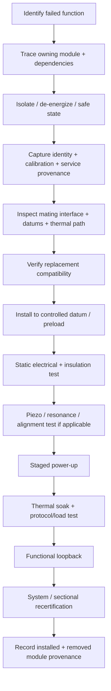

# Ar'nock Systems Maintenance, Fabrication, and Service Standard

**Status:** authoritative engineering practice guide for general Ar'nock machinery documentation.  
**Scope:** solid-state electromechanical systems, modular compute/control, piezoelectric instrumentation, fabrication, field service, depot repair, refit, salvage, and propulsion/transit recertification.  
**Authority relationship:** subordinate to Black Light system-specific canon and FTL-family physics. This document defines the **general Ar'nock maintenance and fabrication grammar** and must not be used to invent an FTL family, performance number, or biological machinery basis.  
**Technology baseline:** general Ar'nock technology is solid-state/electromechanical, silicon-computational, highly modular, ruggedized, and strongly piezoelectric. Bioprinting is a secondary capability used principally for feedstock, medical, environmental, and life-support functions unless a narrower source explicitly establishes otherwise.

---

## 1. Start here: what an Ar'nock technician expects

An Ar'nock machine is normally understood as a hierarchy of **replaceable functional modules**, not as a collection of individually serviceable discrete components. Conductive paths, switching structures, capacitive and resistive functions, local sensing, signal conditioning, nonvolatile identity, and sometimes local computation may be fabricated into one functional object.

The primary service question is therefore:

> Which module owns the failed function, what services feed it, what state and calibration belong to it, and can the module be trusted after replacement?

This gives the characteristic distinction:

\[
\boxed{\text{Human modularity}\approx\text{components on assemblies}}
\]

\[
\boxed{\text{Ar'nock modularity}\approx\text{complete functional assemblies as components}}
\]

This is a service philosophy, not a claim that every Ar'nock object is monolithic silicon. Large machinery still contains mechanical structures, fluid systems, conductors, thermal interfaces, bearings, valves, field-producing structures, pressure boundaries, and replaceable wear items.

---

## 2. Documentation map and discoverability

Every generated Ar'nock system should expose maintenance information in the same order so that a reader, character, forensic analyst, or generator can find it without knowing the subsystem in advance.

| Documentation block | Required content |
|---|---|
| **Identity** | module/system name, function, manufacturer/origin if known, revision, installation ancestry |
| **Interfaces** | power, data, mechanical datums, thermal path, fluid connections, signal/reference dependencies |
| **Service boundary** | what is replaceable in the field, bay, depot, or foundry |
| **Required tools** | test fixtures, metrology, handling, calibration and fabrication equipment |
| **Inspection** | visual, electrical, mechanical, thermal, piezoelectric and protocol checks |
| **Reference state** | calibration values, resonance baseline, firmware/logic revision, known-good signatures |
| **Failure evidence** | symptoms, likely fault classes, ambiguity warnings, isolation tests |
| **Replacement procedure** | isolation, removal, identity capture, installation, alignment, verification |
| **Acceptance** | minimum evidence required before return to service |
| **Recertification** | system-specific tests after replacement/refit, including propulsion/FTL when applicable |
| **Provenance** | source, confidence, service history, refit chain, unresolved assumptions |

### 2.1 Discovery rule

A system description should never hide maintenance requirements only in narrative prose. It should contain a clearly named **Maintenance / Service** section and, where relevant, direct the reader to this standard.

---

## 3. Service levels

The following levels are an engineering documentation convention. They are not asserted to be native translated Ar'nock occupational terms.

| Level | Working label | Typical authority |
|---|---|---|
| `L0` | Operator inspection | external condition, indicators, basic self-test, safe shutdown |
| `L1` | Field module exchange | isolate, remove and replace a complete verified module |
| `L2` | Bay service | precision fixtures, calibration, alignment, thermal/power validation |
| `L3` | Depot rebuild | module opening where possible, deep characterization, internal reconstruction, controlled refabrication |
| `L4` | Foundry/process remanufacture | material-process recreation, integrated module fabrication, substrate reconstruction |

The service level belongs to the **task**, not to the perceived sophistication of the technician. A skilled engineer without the required process tooling cannot convert an `L4` integrated fabrication problem into an `L1` repair by improvisation.

---

## 4. Standard maintenance tool classes

### 4.1 Identity and provenance reader

Required for modules carrying local identity, calibration, revision, configuration, or service history.

A service action should capture, where recoverable:

- module identity;
- hardware revision;
- logic/firmware revision;
- calibration revision and epoch;
- installation/vessel association;
- manufacturer or fabrication authority;
- refit authority;
- accumulated service/fault history;
- unresolved provenance gaps.

A physically compatible replacement without compatible state is not automatically interchangeable.

### 4.2 Electrical characterization fixture

A general bench should support controlled power-up, current limiting, continuity, insulation resistance, leakage, static I/V characterization, bus termination checks, signal injection, and load simulation.

For contact resistance \(R_c\) under current \(I\), local dissipation is

\[
P_{contact}=I^2R_c.
\]

A small increase in contact resistance can therefore create severe local heating in high-current modular interfaces.

### 4.3 Piezoelectric impedance and resonance analyzer

Because piezoelectric structures are common Ar'nock sensors, actuators and diagnostics, service equipment should measure impedance magnitude/phase, resonance, anti-resonance, damping, coupling response, and drive-response symmetry.

For a simple mode,

\[
f_n=\frac{1}{2\pi}\sqrt{\frac{k}{m}},
\]

and the approximate quality factor is

\[
Q\approx\frac{f_0}{\Delta f}.
\]

For small perturbations,

\[
\frac{\Delta f}{f}\approx\frac{1}{2}\left(\frac{\Delta k}{k}-\frac{\Delta m}{m}\right).
\]

A resonance shift is evidence of changed effective stiffness/mass or boundary condition. It is **not** by itself proof of a unique crack, loose mount, contamination event, or other specific cause.

### 4.4 Thermal inspection equipment

Use calibrated thermometry, thermal imaging where line of sight permits, embedded temperature telemetry, heat-flux estimates, and coolant-interface measurements.

For a short lumped transient,

\[
C_{th}\frac{dT}{dt}=P_{in}-P_{reject}.
\]

A module that passes a cold electrical self-test but develops abnormal heat during soak has not passed service acceptance.

### 4.5 Mechanical metrology and alignment

Typical tools include datum probes, displacement gauges, optical or mechanical alignment fixtures, gap/flatness references, calibrated preload tools, surface inspection, and vibration pickup fixtures.

Thermal dimensional shift follows, to first order,

\[
\Delta L=\alpha L\Delta T.
\]

Alignment acceptance must therefore specify thermal state when that state materially changes geometry.

### 4.6 Preload and fastening tools

Where threaded or clamped interfaces exist, torque is at best an indirect estimate of preload. A common approximate relation is

\[
T\approx KFd,
\]

where \(T\) is applied torque, \(F\) desired preload, \(d\) nominal diameter and \(K\) an installation-dependent nut/fastener factor.

This relation is **not** a universal Ar'nock tolerance. Surface condition, lubrication, thread form, material, reuse, temperature and joint geometry can dominate uncertainty. Use direct preload evidence or calibrated installation procedure where safety-critical.

### 4.7 Bus, timing and protocol test set

Required capabilities may include deterministic traffic capture, clock/reference comparison, propagation-delay measurement, error counters, line integrity, arbitration observation and simulated endpoint loads.

A link being electrically continuous does not prove that it is timely enough for safety-critical control.

### 4.8 Controlled fabrication and joining station

Bay/depot equipment may include precision deposition, controlled atmosphere, bonding, brazing/reflow analogues, ceramic/semiconductor joining, conductor restoration, surface preparation, encapsulation and dimensional verification. The exact processes are installation-specific and should not be invented where source material is silent.

### 4.9 Clean handling and electrostatic control

Integrated solid-state modules should be treated as sensitive to electrostatic discharge, contamination, interface damage and uncontrolled moisture/chemistry unless a narrower source establishes unusual immunity.

### 4.10 Biological fabrication tools

Bioprinters, culture vessels and biological process tools belong principally to food/feedstock, medical, ecological and life-support support chains. They should not appear as default tools for compute, power, control or propulsion-module repair.

---

## 5. Fabrication standards

### 5.1 Functional-module architecture

Each replaceable module should define:

1. **mechanical datum system** — how its position and orientation are established;
2. **power interface** — voltage/current/energy-domain expectations and protective behavior;
3. **data/control interface** — protocol, timing, reference and arbitration requirements;
4. **thermal interface** — conduction, coolant, radiation or other heat-removal path;
5. **environmental boundary** — vacuum, atmosphere, pressure, contamination and radiation assumptions;
6. **calibration identity** — coefficients/references required to interpret its output or command it safely;
7. **service boundary** — what may be opened or altered at each service level.

### 5.2 Keyed compatibility

Ar'nock modularity should aggressively reduce incorrect installation through keyed geometry, asymmetric datums, coded interfaces and identity checks where appropriate. However:

\[
\boxed{\text{physical fit}\not\Rightarrow\text{functional compatibility}}
\]

and

\[
\boxed{\text{functional compatibility}\not\Rightarrow\text{calibration equivalence}}.
\]

### 5.3 Integrated passive and active structures

A module may integrate resistive, capacitive, inductive, semiconductor, sensing and signal-conditioning behavior into its fabricated geometry. Generators should therefore avoid describing every electrical function as a separately replaceable Human-style component.

### 5.4 Replaceable wear interfaces

High integration does not eliminate wear. Bearings, seals, connectors, contact surfaces, pump elements, valves, thermal interface media, latches and other mechanically stressed elements may remain replaceable when that is practical.

### 5.5 Material traceability

Safety-critical refabrication should preserve material/process provenance where available: composition class, batch/process identifier, thermal history, joining method, inspection state and acceptance authority.

Unknown material ancestry is a certification limitation, not permission to assume nominal properties.

---

## 6. Piezoelectric fabrication and acceptance

The linear constitutive relationships remain

\[
\mathbf D=\mathbf d\mathbf T+\boldsymbol\epsilon^T\mathbf E
\]

and

\[
\mathbf S=\mathbf s^E\mathbf T+\mathbf d^T\mathbf E.
\]

Fabrication/repair can alter polarization, mechanical boundary condition, stiffness, damping, electrode/contact integrity and local stress. A replaced or refabricated piezoelectric module therefore requires more than continuity testing.

Minimum evidence should normally include:

- identity and intended mode;
- impedance/phase sweep over relevant frequencies;
- resonance and anti-resonance locations where applicable;
- drive-response symmetry;
- thermal behavior under representative excitation;
- mounting/preload verification;
- comparison with a certified baseline or bounded acceptance envelope.

Piezoelectric health evidence must not be promoted into FTL-family sensing evidence. Structural resonance does not establish gravitational shear, Q-state, manifold topology, fold endpoint or wormhole-mouth geometry.

---

## 7. Normal module replacement procedure



### 7.1 Do not skip state capture

The removed module may contain the best surviving evidence of the original installation's configuration, calibration and failure sequence. Capture state before destructive disassembly whenever safety permits.

### 7.2 Do not treat replacement as repair completion

A new module can create new errors through revision mismatch, alignment shift, contact resistance, timing change, thermal-interface defects or incorrect calibration.

---

## 8. Inspection and diagnostic best practices

### 8.1 Evidence before cause

Record the observation first.

Good:

> Resonant mode A shifted downward 1.7% relative to the stored acceptance trace; damping increased; mounting preload is below the documented service envelope.

Bad:

> The module is cracked.

The first is evidence. The second may be one hypothesis among several.

### 8.2 Correlate independent channels

Prefer fault conclusions supported by multiple observations: electrical, thermal, mechanical, timing, piezoelectric and system-level behavior.

### 8.3 Preserve a known-good comparison

When possible compare against a certified sister module, stored acceptance trace, manufacturer reference, or earlier measurement from the same unit under matched conditions.

### 8.4 Do not erase intermittent faults

Repeated power cycling, reseating, heating or mechanical disturbance can destroy the evidence needed to identify marginal contacts and boundary-condition faults. Capture before disturbance.

### 8.5 Separate condition from probability

A normalized health score such as 0.72 is not automatically a 72% survival probability. Do not convert deterministic support/readiness metrics into reliability statistics without an explicit statistical model and evidence base.

---

## 9. Field, bay, depot, and foundry practice

### Field (`L1`)

Field service emphasizes safe isolation, module identity, complete-module exchange, connector/datums inspection, simple calibration confirmation and return-to-service checks.

### Bay (`L2`)

Bay service adds precision alignment, controlled loads, thermal soak, impedance/resonance characterization, timing measurements, bus simulation and calibrated reference fixtures.

### Depot (`L3`)

Depot service may open modules designed for deep repair, reconstruct interfaces, characterize internal integrated structures, recover data, replace internal subassemblies where architecture permits, and perform extended environmental qualification.

### Foundry/process (`L4`)

Foundry service recreates the integrated object itself. That may require semiconductor/ceramic processing, conductor formation, polarization, deposition, controlled joining, encapsulation and material qualification. A Human salvage crew can understand a module electrically while still lacking the process chain required to manufacture it.

---

## 10. Refit and mixed-generation machinery

A vessel may contain modules from several production generations, manufacturers, salvage sources or refits. Documentation must preserve that ancestry instead of rewriting the vessel as if it were born with its current configuration.

A refit record should carry, where known:

```text
original installation
  -> original manufacturer / fabrication authority
  -> removed module identity + state
  -> replacement origin + revision
  -> mechanical/interface adaptation
  -> logic/protocol adaptation
  -> calibration authority
  -> acceptance evidence
  -> post-refit limitations
```

A newer module does not automatically restore the original certification envelope if surrounding buses, cooling, structures or timing paths have changed.

---

## 11. Propulsion and FTL-specific recertification

General service practice remains family-neutral. If a serviced module participates in transit safety, the technician must hand off to the appropriate Black Light propulsion/transit authority.

Recertification is required when service can alter any of the following:

- family-required sensing;
- navigation/reference state;
- solver timing;
- command propagation;
- actuator response;
- field/effect geometry;
- exit/de-transit response;
- protected recovery reserve;
- sectional power/cooling/control topology;
- structural alignment affecting the protected region;
- calibration or provenance used by route certification.

The intervention chain remains

\[
t_{int}=t_{sensor}+t_{solver}+t_{decision}+t_{command}+t_{actuate}+t_{exit}+t_{clear}+t_{margin}.
\]

A replacement that adds command or actuator latency can consume safety margin even when it restores nominal function.

For continuous projected-progress systems, route safety may use

\[
M_T=\frac{D_B}{v_p}-t_{int},
\]

where \(v_p\) is projected route progress, not necessarily local hull velocity.

For PRECOMMIT families,

\[
M_T=t_{prediction}-t_{int}.
\]

Maintenance hardware, piezoelectric instrumentation, and Ar'nock identity must never be used to infer which FTL family an installation belongs to.

---

## 12. Common failure signatures

| Observation | Candidate fault classes | Required caution |
|---|---|---|
| local hot interface | contact resistance, poor thermal seat, overload | heat alone does not identify cause |
| resonance shift | changed preload, crack, added mass, looseness, temperature | compare thermal/mechanical state |
| increased damping | interface slip, contamination, material damage | not unique |
| bus errors/jitter | connector, timing reference, termination, EMI, logic mismatch | electrical continuity may still pass |
| insulation leakage | contamination, dielectric damage, moisture/chemistry, radiation damage | isolate before high-energy test |
| asymmetric actuator response | drive electronics, preload, mechanical load, piezo degradation, command path | compare command and measured motion |
| correct cold test / hot failure | thermal interface, semiconductor drift, contact heating, cooling deficit | perform representative soak |
| new module / poor system performance | revision mismatch, calibration mismatch, altered latency, installation error | replacement is not proof of restoration |

---

## 13. Best-practice rules for generators and authors

1. **Default to solid-state/electromechanical Ar'nock machinery.** Biological machinery requires subsystem-specific evidence.
2. **Make the module boundary visible.** State what is replaced as a unit and what requires depot/foundry work.
3. **Expose maintenance access.** Describe service bays, latches, datums, test points, handling clearance and isolation.
4. **Name the tools required.** Do not write “specialized alien tools” when ordinary engineering categories can be stated.
5. **Describe acceptance evidence.** A repair should end with measurements, not “it works now.”
6. **Preserve calibration and provenance.** Missing records remain missing.
7. **Do not manufacture universal tolerances.** Use sourced limits, installation-specific envelopes, or explicitly labeled engineering proposals.
8. **Keep piezoelectric claims physical.** Do not convert vibration/strain sensors into exotic spacetime sensors without authority.
9. **Keep biotechnology in its actual lane.** Bioprinting supports life, medicine, feedstock and environment by default.
10. **Do not infer FTL family from race or tooling.** Ar'nock identity never selects transit physics.
11. **Model refits as ancestry, not overwrite.** Preserve original and replacement origins.
12. **Treat accessibility as engineering.** A module that cannot be reached, isolated or removed under field conditions has a real maintenance burden.

---

## 14. Documentation template for generated Ar'nock systems

Use this compact skeleton whenever a new Ar'nock machine is generated:

```markdown
### Maintenance / Service

**Service boundary:** [field/bay/depot/foundry]
**Replaceable units:** [...]
**Required services before test:** [power/data/cooling/mechanical/fluid/reference]
**Required tools:** [...]
**Isolation procedure:** [...]
**Inspection points:** [...]
**Reference/calibration:** [...]
**Known failure evidence:** [...]
**Replacement sequence:** [...]
**Acceptance test:** [...]
**Recertification trigger:** [...]
**Provenance/status:** [CANON / DERIVED / ENGINEERING_CONTROL / PROPOSED / UNRESOLVED]
```

This block should be discoverable from the system's main description rather than buried in a separate narrative appendix.

---

## 15. Educational progression

### Ar'nock Systems Maintenance 210 — Integrated Modular Solid-State Service

Covers module identity, isolation, interface inspection, electrical characterization, safe exchange, provenance, thermal testing and basic piezoelectric diagnostics.

### Ar'nock Systems Maintenance 310 — Piezoelectric Diagnostics and Refit Calibration

Covers impedance/resonance interpretation, alignment, timing/reference verification, mixed-revision installations, failure ambiguity and calibrated return-to-service testing.

### Ar'nock Systems Engineering 410 — Module Refabrication and Transit-System Recertification

Covers depot/foundry process controls, integrated fabrication, material traceability, sectional infrastructure effects, protected recovery systems and family-specific transit recertification.

These course labels are documentation aids unless a canonical source later establishes native Ar'nock curricula.

---

## 16. Canon and provenance safeguards

The following invariants are mandatory:

\[
\boxed{\text{Ar'nock}\not\Rightarrow\text{biological machinery}}
\]

\[
\boxed{\text{bioprinting}\not\Rightarrow\text{biological computation}}
\]

\[
\boxed{\text{piezoelectric sensor}\not\Rightarrow\text{FTL-family sensor}}
\]

\[
\boxed{\text{module fit}\not\Rightarrow\text{calibration equivalence}}
\]

\[
\boxed{\text{missing calibration}\neq 0\text{ error}}
\]

\[
\boxed{\text{Ar'nock identity}\not\Rightarrow\text{FTL family}}
\]

Status vocabulary:

- `CANON` — explicitly established by authoritative setting material;
- `DERIVED` — engineering consequence of established constraints;
- `ENGINEERING_CONTROL` — chosen operational rule/tolerance, not setting fact;
- `PROPOSED` — useful extension awaiting stronger authority;
- `UNRESOLVED` — insufficient evidence; do not fill by implication.

---

## 17. Related authoritative documentation

Start with:

- `docs/blacklight/ARNOCK_PROPULSION_TRANSIT_ENGINEERING_PROFILE.md` — general Ar'nock propulsion/transit machinery basis and family-neutral engineering.
- `docs/blacklight/ARNOCK_FTL_FAMILY_EMBODIMENT_FIELD_MANUAL.md` — family-by-family hypothetical Ar'nock machinery embodiments without assigning a canonical family.
- `docs/blacklight/BLACK_LIGHT_FTL_CONTROL_NAVIGATION_MAINTENANCE_EMBODIMENT_MANUAL.md` — cross-civilization control/navigation/maintenance doctrine.
- `docs/blacklight/BLACK_LIGHT_PROPULSION_TRANSIT_AUTHORITY.md` — consolidated propulsion/transit authority.
- *The different lightspeed methods* — governing conceptual source for differentiated FTL family behavior and failure/safety logic.

When these sources conflict, narrower canonical source and higher propulsion/transit authority control the FTL physics; this document controls the **general Ar'nock service/fabrication default** unless a narrower Ar'nock subsystem source explicitly supersedes it.
