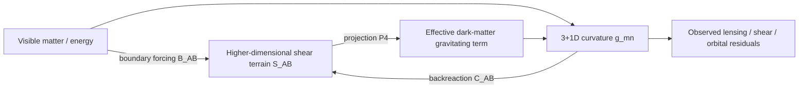
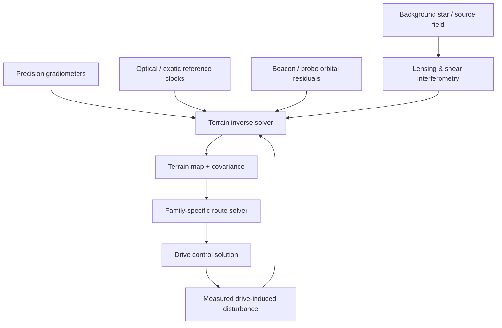

# Black Light Dark-Matter Gravitational Terrain Model

**Status:** authoritative cosmological/engineering premise for Black Light transit mathematics, adopted by author directive on 2026-09-09 and subordinate only to later explicit setting canon that deliberately revises it.

**Purpose:** define the shared higher-dimensional gravitational terrain used by Black Light propulsion/transit mathematics so that distance, route quality, space-folding burden, navigation uncertainty, and Path-level improvements arise from explicit geometry rather than arbitrary speed multipliers.

**Canon boundary:** the premise that higher-dimensional gravitational shear bands form underlying universal terrain and are both partly causal of, and partly manifested through, the phenomena interpreted in 3+1D as dark matter and gravitational lensing/shear is `CONFIRMED` by author directive. The exact tensor formalism, numerical coefficients, inversion algorithms, and engineering estimators in this document are `DERIVED` or `PROPOSED` unless separately promoted.

---

## 1. Canonical premise

Black Light treats the universe as possessing a gravitational structure richer than the directly visible 3+1-dimensional distribution of baryonic matter.

The setting premise is:

> **Dark matter is partly the projected cause and partly the projected effect of higher-dimensional gravitational shear structure. These higher-dimensional shear bands, ridges, channels, saddles, knots, and basins form the underlying universal terrain through which advanced transit mathematics operates.**

Ordinary observers infer this terrain indirectly through excess gravitational attraction, lensing, weak-lensing shear, mass-model residuals, anomalous orbital behavior, timing distortions, and other gravitational observables. Advanced civilizations may reconstruct more of the terrain than a purely 3+1D mass model reveals.

The model is deliberately reciprocal rather than one-way. Higher-dimensional shear projects into effective 3+1D gravitating structure; the resulting 3+1D curvature contributes back to the higher-dimensional configuration. Therefore the terrain is not a static invisible road map. It is a coupled field whose geometry evolves with mass distribution, motion, energetic events, and its own higher-dimensional dynamics.

---

## 2. Shared mathematical representation

Let ordinary spacetime be \(M_4\) with metric \(g_{\mu\nu}\). Let the larger transit-relevant manifold be \(\mathcal M_N\), \(N\ge4\), with coordinates \(X^A\) and metric \(G_{AB}\).

Define the higher-dimensional gravitational terrain field

\[
\mathcal S_{AB}(X,t),
\]

where \(\mathcal S_{AB}\) represents the local shear/strain structure of the transit-relevant higher-dimensional geometry. It is not asserted to be literal ordinary matter.

A projection operator \(\mathcal P_4\) maps the higher-dimensional terrain into an effective 3+1D stress-energy contribution:

\[
T^{DM,eff}_{\mu\nu}=\mathcal P_4[\mathcal S_{AB},G_{AB}].
\]

The 3+1D gravitational field therefore obeys the setting-level effective relation

\[
G_{\mu\nu}+\Lambda g_{\mu\nu}
=\frac{8\pi G}{c^4}
\left(T^{visible}_{\mu\nu}+T^{DM,eff}_{\mu\nu}\right).
\]

`DERIVED:` this is an explanatory bookkeeping relation, not a claim that Black Light has fixed a unique real-world dark-matter theory.

The 3+1D metric then produces observable gravitational lensing, shear, orbital deviations, and timing effects. Write the observational map abstractly as

\[
\mathcal O_{grav}=\mathcal L[g_{\mu\nu},\partial g,\partial^2 g].
\]

The higher-dimensional terrain is also affected by ordinary curvature and mass-energy. A minimal self-consistent model is

\[
\mathcal S_{AB}=\mathcal S^{(0)}_{AB}
+\kappa_{v}\,\mathcal B_{AB}[T^{visible}]
+\kappa_{g}\,\mathcal C_{AB}[g_{\mu\nu}]
+\delta\mathcal S_{AB},
\]

where \(\mathcal S^{(0)}\) is background terrain, \(\mathcal B\) and \(\mathcal C\) are projection/backreaction operators, and \(\delta\mathcal S\) contains dynamic higher-dimensional disturbances. The coupling constants and operator forms are `PROPOSED` until calibrated by setting data.

This gives the causal loop:



---

## 3. Terrain quantities used by transit systems

A useful local terrain state is

\[
\mathbf T(x,t)=
\{\rho_{DM}^{eff},\;\nabla\Phi_{eff},\;H(\Phi_{eff}),\;\mathcal S,\;\nabla\mathcal S,\;\dot{\mathcal S},\;\mathcal K,\;\mathcal A\},
\]

where:

- \(\rho_{DM}^{eff}\) is inferred effective dark-matter density;
- \(\Phi_{eff}\) is the combined gravitational potential used by lower-order navigation;
- \(H(\Phi_{eff})\) is its Hessian/tidal structure;
- \(\mathcal S\) is reconstructed higher-dimensional shear;
- \(\nabla\mathcal S\) is terrain gradient;
- \(\dot{\mathcal S}\) is terrain evolution;
- \(\mathcal K\) describes curvature/topological hazard;
- \(\mathcal A\) describes family-specific accessibility/coupling.

The terrain is interpreted geometrically:

- **ridges**: high-gradient or high-curvature regions costly or dangerous to cross;
- **channels/valleys**: regions where a family can obtain greater route gain or lower field burden;
- **saddles**: transition regions useful for changing gravitational or manifold branch;
- **knots**: persistent intersections or concentration regions useful for anchors/gates but potentially hazardous;
- **shear bands**: elongated directional structures whose orientation and phase can strongly favor or disfavor transit;
- **void basins**: weakly structured regions that may be simple for ordinary motion yet poor for terrain-assisted FTL families.

These terms are mathematical/navigation categories, not proof that every culture uses the same words.

---

## 4. Terrain reconstruction from observable gravity

Primitive transit civilizations do not directly solve \(\mathcal S_{AB}\). They infer it from 3+1D observables.

Let observation vector

\[
\mathbf y=\{\gamma_{lens},\kappa_{lens},\mathbf a_{res},\Delta t_{clock},\mathcal G_{ij},\ldots\}
\]

contain lensing shear, convergence, residual accelerations, timing shifts, gradiometry, and other measurements. A terrain estimate is

\[
\hat{\mathcal S}=\arg\min_{\mathcal S}
\left[
(\mathbf y-\mathcal F(\mathcal S))^T
W
(\mathbf y-\mathcal F(\mathcal S))
+\lambda_R\,\mathcal R(\mathcal S)
\right].
\]

`DERIVED:` \(\mathcal F\) is the forward model from terrain to observables and \(\mathcal R\) a regularization/physical-admissibility term.

Uncertainty must be retained:

\[
\Sigma_{terrain}\approx
\left(J_F^T W J_F+\lambda_R H_R\right)^{-1}.
\]

A transit route is therefore never merely `distance = X`. It is `distance under a terrain estimate with a stated epoch and covariance`.

---

## 5. Shared route mathematics

Let \(D_0\) be ordinary spatial/geodesic separation. For each transit family \(f\), define an effective route quantity

\[
D_f=\inf_{\Gamma\in\mathcal A_f}
\int_\Gamma
w_f\big(\mathbf T,\Theta_f,S_v\big)\,ds,
\]

where \(\Theta_f\) is drive state and \(S_v\) vessel state. The family-specific weight \(w_f\) can reward favorable terrain and penalize hostile terrain.

Define route gain

\[
\chi_f=\frac{D_0}{D_f}.
\]

For discontinuous mechanisms, \(D_f\) is a generalized transition cost rather than literal traversed meters. The field `distanceModelType` must remain explicit.

A generalized transit burden is

\[
B_f(\Gamma)=
\int_\Gamma
\left[
C_{base,f}
+C_{shear,f}(\mathcal S)
+C_{grad,f}(\nabla\mathcal S)
+C_{topo,f}(\mathcal K)
+C_{unc,f}(\Sigma_{terrain})
\right]ds.
\]

Higher Path levels can increase range by finding lower-burden \(\Gamma\), reducing uncertainty, manipulating a broader set of terrain modes, or physically surviving stronger terrain—not merely by increasing source energy.

---

## 6. Cross-Path terrain-mathematics progression

This progression is cross-cutting. It does not replace the confirmed family-specific P0-P6 implementation names.

| Transit Path | Terrain mathematics capability | Dominant upgrade causes | Engineering consequence |
|---|---|---|---|
| P0 | local scalar gravity/lensing approximation; fixed surveyed solution | primitive mathematics, monumental structure, raw energy | one narrow certified geometry or route; little ability to infer hidden terrain |
| P1 | local vector gradient and first shear estimate | better sensing, field control, timing | actively follows one local feature rather than relying entirely on a precomputed path |
| P2 | closed 3D volumetric reconstruction around full payload | tomography, materials, whole-effect structure, distributed sensing | complete vessel can be certified against local terrain instead of point-mass approximation |
| P3 | time-dependent route/endpoint prediction beyond immediate sensor volume | better solvers, reference clocks, remote observations, higher control bandwidth | interstellar-equivalent solutions become possible because terrain evolution is forecast rather than assumed static |
| P4 | multi-feature/multisystem terrain graph with dynamic re-routing | distributed control, large model libraries, fleet infrastructure | routine operation through heterogeneous terrain and around disturbed regions |
| P5 | inverse reconstruction of weakly observed higher-dimensional terrain from lensing, gravity residuals, and historical route data | probabilistic mathematics, far-field sensing, Q/exotic references, improved field efficiency | hidden ridges and deep channels become usable in planning; distance rises without proportionate power increase |
| P6 | continuously updated self-consistent higher-dimensional terrain model including projection/backreaction and local drive disturbance | adaptive mathematics, postmaterial/high-end materials, massive control bandwidth, self-calibration | route and field geometry are re-solved in real time; transient channels and self-created distortions can be exploited safely |

This table formalizes why mature systems can outperform huge primitive drives: the machine is not merely stronger; it is solving and controlling a more accurate universe.

---

## 7. Family coupling to the dark-matter shear terrain

### 7.1 Metric Compression Envelope

The metric family directly changes local \(g_{\mu\nu}\), but external terrain changes the burden of doing so. Define

\[
g^{eff}_{\mu\nu}=g^{visible}_{\mu\nu}+g^{DM}_{\mu\nu}+h^{drive}_{\mu\nu}.
\]

The optimizer chooses \(h^{drive}\) to achieve route gain while minimizing gradient/horizon/energy penalties:

\[
\Theta_M^*=\arg\min_{\Theta_M}
\left[B_{field}+\lambda_gP_{grad}+\lambda_hP_{horizon}+\lambda_TP_{terrain}\right].
\]

A favorable shear channel can reduce the additional metric deformation the ship must supply; an adverse ridge can increase it. P5/P6 metric systems therefore gain enormously from predictive terrain models even without a proportionate reactor increase.

### 7.2 Gravitational-Plane Skimmer

This family is the most direct terrain user. Replace a visible-mass-only potential with

\[
\Phi_{eff}=\Phi_{visible}+\Phi_{DM}^{eff}.
\]

The route functional becomes

\[
\Gamma_g^*=\arg\min_\Gamma
\int_\Gamma
\left[
w_0+w_1\|\nabla\Phi_{eff}\|+w_2\|H(\Phi_{eff})\|+w_3H_R(\mathcal S)+w_4C_{switch}
\right]ds.
\]

Primitive systems follow only mapped local equipotentials. Mature systems infer unobserved higher-dimensional ridges/channels and rewrite the route continuously.

### 7.3 Hyperspatial Slipstream Shear

The Q-boundary shear is coupled to the gravitational terrain rather than assumed independent:

\[
\mathcal S_Q=\mathcal S_Q^{(0)}+\alpha_Q\,\mathcal C_Q[\mathcal S_{AB}].
\]

The effective route is

\[
D_S=\int_\Gamma
\sigma_Q(\mathcal S_Q,\dot{\mathcal S}_Q,u_Q,a)\,ds.
\]

Thus Q-weather partly reflects deeper universal shear. Mature slipstream systems predict how large-scale gravitational terrain steers, strengthens, forks, or disrupts usable shear bands.

### 7.4 Q-Lattice Phase Translation

Terrain modifies edge cost and address stability in the Q-state graph:

\[
C_Q(\pi)=\sum_{(i,j)\in\pi}
\left[
w_d\ell_{ij}+w_\phi\epsilon_\phi+w_\tau\epsilon_\tau+w_TP_T(\mathcal S_{ij})+w_oP_{occ}+w_sP_{state}\right].
\]

A mathematically mature system can choose phase routes whose nodes remain stable under the surrounding shear terrain rather than minimizing address count alone.

### 7.5 N-Dimensional Manifold Drive

For this family the terrain is not merely an external modifier; it is part of the actual transit geometry:

\[
\Gamma_N^*=\arg\min_\Gamma
\int_\Gamma\sqrt{G_{AB}(\mathcal S)\,dX^A dX^B}.
\]

The route gain is

\[
\chi_N=\frac{D_0}{L_N(\Gamma_N^*)}.
\]

Higher Path stages successively discover usable dimensions, better embeddings, lower-cost valleys, and safer return maps. A primitive manifold drive solves one rigid slice. A mature system treats the higher-dimensional shear field as navigable geography.

### 7.6 Discrete Fold-Jump

The confirmed mechanism creates temporary topological adjacency. The terrain controls how difficult that adjacency is to establish.

Let origin and destination neighborhoods be \(U_A,U_B\). A fold operator \(\mathcal F_\Theta\) seeks

\[
d_{\mathcal F_\Theta(\mathcal M)}(U_A,U_B)\rightarrow d_{cross}\ll D_0.
\]

Define fold burden

\[
B_F=K_F\,M^\alpha V^\beta
\left(1+\lambda_s\Delta\mathcal S_{AB}^2+\lambda_k\Delta\mathcal K^2+\lambda_uU_{endpoint}\right),
\]

with coefficients `PROPOSED`. Endpoints lying on compatible shear terrain require less correction than endpoints separated by severe terrain mismatch.

The existing toroidal closed-control-volume interpretation remains `DERIVED`; this terrain model does **not** promote a universal \(T^3\) topology claim. A toroidal emitter/control geometry can be a machinery solution while the topological operation remains defined more generally.

### 7.7 Anchored Wormhole / Gate Transit

Gate siting and throat support depend on terrain:

\[
B_G=B_{throat}\,C_{anchor}(\mathcal S_A,\mathcal S_B)\,C_{sync}\,C_{flow}.
\]

Shear knots, saddles, or persistent low-drift terrain may make superior anchor sites. High-gradient regions raise station-keeping and throat-stability burden. Mature networks become maps of gravitational terrain as much as political geography.

### 7.8 Quantum Phase Displacement

The terrain enters primarily through reference stability and compatible-state evolution:

\[
J_P=w_sD_B^2+w_oP_{occupation}+w_rP_{reference}(\mathcal S)+w_cP_{conservation}+w_iP_{identity}.
\]

A destination reference embedded in rapidly changing shear terrain ages faster as a valid solution. Mature systems model the terrain-dependent reference drift explicitly.

### 7.9 Relativistic Inertial Torch

The inertial torch does not exploit space folding. It still navigates through the same physical gravitational environment:

\[
\frac{D u^\mu}{d\tau}=a^\mu_{thrust},
\]

with geodesic/trajectory prediction based on the effective gravitational field including the projected dark-matter terrain. It receives navigation and hazard benefits from better terrain maps, but no FTL route-gain term.

---

## 8. Terrain-aware Path upgrade accounting

Every family Path-stage record should identify which terrain term improved. Allowed terrain upgrade causes include:

- `OBSERVATION_DEPTH` — more of the terrain is measured rather than inferred;
- `INVERSE_MODEL_QUALITY` — better reconstruction from lensing/gravity residuals;
- `TEMPORAL_FORECAST` — longer valid terrain epoch prediction;
- `DIMENSIONAL_RESOLUTION` — additional higher-dimensional modes become distinguishable;
- `ROUTE_OPTIMIZATION` — solver finds better channels/saddles/anchors;
- `FIELD_TERRAIN_COUPLING` — drive can physically exploit or oppose a larger range of terrain states;
- `TERRAIN_DISTURBANCE_COMPENSATION` — drive corrects for its own perturbation of the terrain;
- `UNCERTAINTY_REDUCTION` — lower covariance permits longer routes under the same safety rule.

A capability increase is invalidly explained if it cites only `ENERGY` while the confirmed Path breakthrough clearly requires improved navigation, topology, field control, materials, or mathematics.

---

## 9. Navigation certificate extension

Every mathematically detailed transit solution should be able to emit:

```json
{
  "terrainModel": {
    "modelId": "blacklight.cosmology.dark-matter-shear-terrain.v1",
    "epoch": null,
    "status": "MIXED",
    "ordinaryGravityModel": null,
    "effectiveDarkMatterModel": null,
    "higherDimensionalShearModel": null,
    "terrainCovariance": null,
    "observations": [],
    "inferenceMethod": null,
    "routeFeatures": [],
    "driveInducedPerturbation": null,
    "provenance": []
  }
}
```

The solution certificate must record the model epoch because a route solved against an obsolete terrain state can be mathematically precise and physically wrong.

---

## 10. Practical survey and navigation equipment manual

### 10.1 Gravitational Terrain Survey Package

`DERIVED:` a generic high-end survey installation needs several distinct observation classes because no single sensor directly reveals the complete higher-dimensional terrain.



A practical technician does not service “the dark matter sensor.” The package contains calibrated instruments whose combined observations constrain the terrain model.

### 10.2 Pre-route survey procedure

Unless superseded by manufacturer doctrine:

1. authenticate reference clocks, beacon ephemerides, and observation epoch;
2. acquire background-source/lensing field and reject contaminated optical solutions;
3. acquire local gravimetry and gradient tensor;
4. compare observed accelerations with visible-mass prediction;
5. update the effective dark-matter projection model;
6. solve or update higher-dimensional shear posterior and covariance;
7. identify ridges, channels, saddles, knots, and temporal disturbances relevant to the selected family;
8. solve the family route against both mean terrain and uncertainty envelope;
9. simulate drive-induced perturbation and recovery;
10. reject the route if the required field solution depends on unbounded or stale terrain state.

### 10.3 Technician alarms

- `TERRAIN_EPOCH_EXPIRED`: route model older than family/manufacturer validity window;
- `LENSING_MODEL_RESIDUAL`: observed shear no longer agrees with projected model;
- `RIDGE_FORECAST_DIVERGENCE`: predicted and observed gradient structure diverge;
- `DIMENSIONAL_ALIAS`: more than one higher-dimensional terrain solution fits the observations within tolerance;
- `SELF_PERTURBATION_UNBOUNDED`: drive model cannot close the feedback loop including its own field disturbance;
- `ANCHOR_DRIFT`: gate/fold/reference node no longer occupies certified terrain state;
- `COVARIANCE_LIMIT`: route remains mathematically solvable but uncertainty exceeds safe commit authority.

---

## 11. Educational explanation

### Crew explanation

Space is not treated as empty, featureless distance. Mass and the deeper gravitational structure of the universe make it more like terrain. Much of what ordinary astronomy calls dark matter is the 3+1D gravitational footprint of that deeper terrain. Different FTL drives exploit different parts of the map.

### Technician explanation

Your route computer is not merely finding coordinates. It is reconstructing the local terrain from lensing, gravity, timing, beacons, and family-specific sensors. If those observations stop agreeing, the route solution is stale even if the destination coordinate has not changed.

### Engineer explanation

The transit operator acts on a family-specific state, but the admissible solution set is conditioned on \(\mathcal S_{AB}\) and its covariance. Increased capability can therefore arise from improved inverse reconstruction, longer prediction horizon, greater controllable terrain-mode bandwidth, lower self-perturbation, or improved materials that tolerate stronger gradients.

### Generator/API explanation

No FTL result should use distance alone. A reproducible result needs ordinary separation, family effective-route quantity, terrain model ID, model epoch, terrain covariance, route-feature classification, Path mathematical capability, physical upgrade drivers, and provenance.

---

## 12. Canon safeguards

1. Do not equate Black Light dark matter with any one current real-world dark-matter candidate particle unless a later setting source does so.
2. Do not claim all observed dark matter is exclusively higher-dimensional shear; the canonical premise is **partly cause and partly effect**, allowing additional components or interpretations.
3. Do not treat gravitational lensing as merely an illusion. The projected terrain creates real 3+1D gravitational effects.
4. Do not assume terrain is static. Mass motion, energetic events, higher-dimensional evolution, and advanced drive operation may alter it.
5. Do not make every drive use terrain identically. The terrain is shared environment; the operator remains family-specific.
6. Do not convert `better terrain map` into unlimited range. Structure, field strength, materials, energy, recovery, payload coverage, and family-specific constraints remain binding.
7. Do not infer chronology violation from higher-dimensional routes or FTL geometry.
8. The Fold-Jump toroidal control-volume model remains `DERIVED` and is not silently promoted to a universal topological identity.
9. Numerical coupling constants, dimensional count, terrain spectra, and universal route-gain coefficients remain `UNRESOLVED`/`PROPOSED` until explicitly established.

---

## 13. Integration contract

This terrain model is a shared input to:

- `docs/blacklight/BLACK_LIGHT_FTL_MATHEMATICAL_TRANSIT_MODELS.md` for family mathematics and Path progression;
- `docs/blacklight/PROPULSION_TRANSIT_GENERATOR_REFERENCE.md` for route-generation behavior;
- `docs/blacklight/BLACK_LIGHT_FTL_ENGINEERING_FIELD_MANUAL.md` for technician/engineering interpretation;
- `data/exo-vessel/ftl-mathematical-model-registry.json` for equation-set resolution;
- `data/exo-vessel/propulsion-transit-registry.json` for authority/source discovery;
- future navigation, stellar-cartography, gate-siting, route-planning, signature, and intelligence APIs.

The terrain layer does not replace any drive equation. It supplies the common background state against which each family solves its own operator.

---

## 14. Origin ledger

`CONFIRMED AUTHOR DIRECTIVE — 2026-09-09:` dark matter is to be treated in Black Light calculations as partly the cause and partly the effect of the gravitational lensing and gravitational shearing lines observed in interstellar space, with the corresponding gravitational shear bands in theoretical higher dimensions forming the underlying universal terrain.

`DERIVED IN THIS DOCUMENT:` the projection/backreaction loop, tensor notation, terrain-state vector, inverse reconstruction model, shared route functional, family coupling equations, survey procedure, alarm vocabulary, and cross-Path terrain-mathematics ladder.

`PROPOSED/UNCALIBRATED:` numerical coupling constants, weighting matrices, exact higher-dimensional count, thresholds, route cost coefficients, and quantitative terrain spectra.

Once this file is committed on authoritative `main`, the author-directed premise is repository authority. The derived mathematics remain visibly subordinate to that premise and to any later explicit named canon.