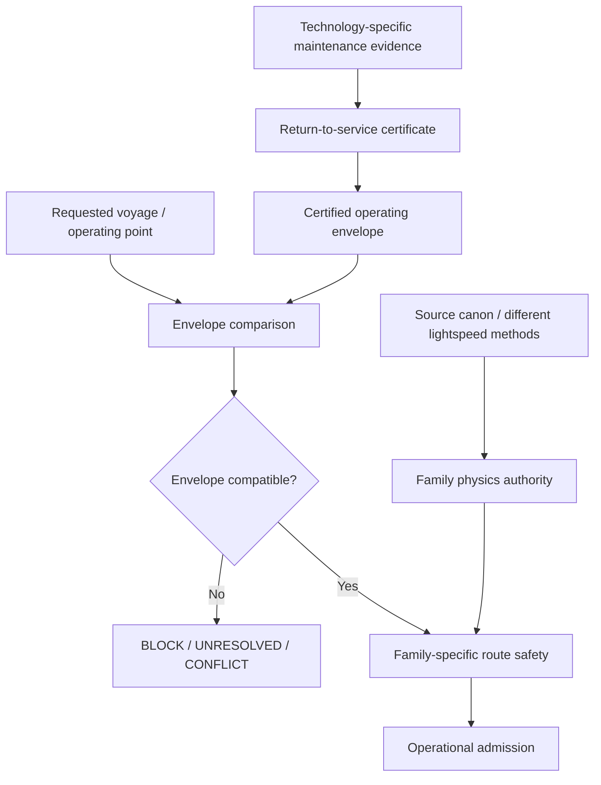
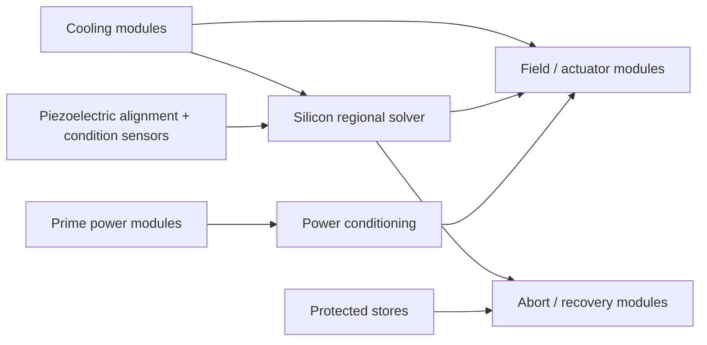
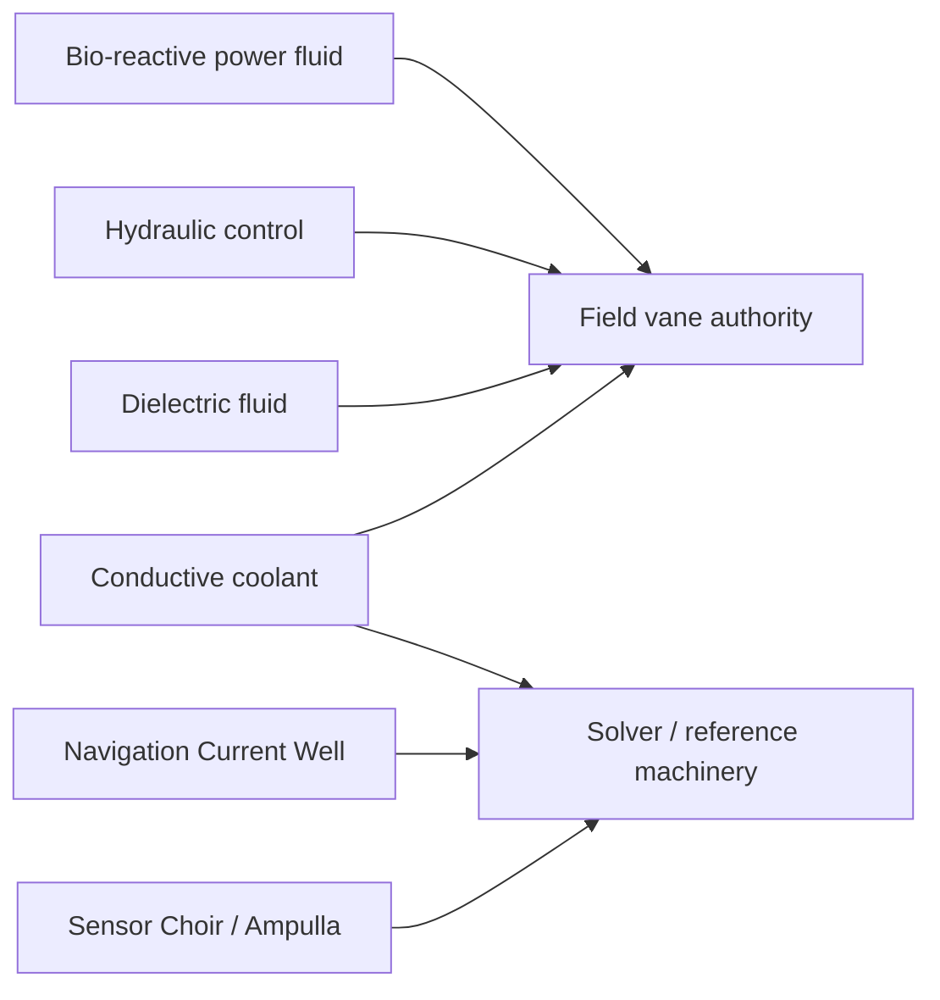

# Black Light FTL Certified Operating Envelope Manual

**Status:** derived engineering authority subordinate to consolidated propulsion/transit family physics and source-specific canon.  
**Design-intent source:** *The different lightspeed methods*.  
**Purpose:** define how a repaired or certified propulsion/transit installation expresses the physical region in which that certification remains valid, and how route admission compares a requested operating point against it.

---

## 1. Why a certificate needs an envelope

A statement such as **CERTIFIED** is incomplete unless it also answers: certified for what load, what power demand, what thermal state, what latency, what vessel configuration, what acceleration, and what environmental burden?

A post-refit drive can be healthy at one operating point and unsafe at another. A coolant train may comfortably reject heat during low-power cruise but saturate during emergency field collapse. A replacement command module may be fast enough for ordinary maneuvering but too slow for a high-gradient shear-lane abort. A field system may be aligned for the vessel mass at certification and become invalid after large cargo, armor, external tanks, or structural refit changes.

The rule is therefore:

\[
\boxed{\text{serviceable}\neq\text{unbounded capability}}
\]

and:

\[
\boxed{\text{CERTIFIED}\Rightarrow\text{certified inside a defined operating envelope}.}
\]

---

## 2. Authority placement

The envelope check is not a replacement for route physics. It is an installation-compatibility gate before or beside family-specific route certification.

---

## 3. Scalar interval model

For one physical variable \(x\), let the certified interval be

\[
X_c=[L_c,U_c]
\]

and the requested operating interval be

\[
X_r=[L_r,U_r].
\]

The request is fully inside the certificate only when

\[
\boxed{L_r\ge L_c\quad\land\quad U_r\le U_c.}
\]

A point request \(x_r\) is represented as

\[
L_r=U_r=x_r.
\]

The signed absolute margin is

\[
\boxed{m=\min(L_r-L_c,\ U_c-U_r).}
\]

If \(m<0\), some part of the requested range lies outside the certified range and the dimension blocks operation.

When \(U_c>L_c\), a scale-free diagnostic margin is

\[
\boxed{\mu=\frac{m}{U_c-L_c}.}
\]

No universal warning threshold is assumed. A certificate may define an explicit `advisoryMarginFraction`; only then may an entirely in-envelope request be marked `CONDITIONAL` because it is near a certified boundary.

### 3.1 Why overlap is not enough

Suppose a thermal system is certified over:

\[
T_c\in[260,340]\ \mathrm{K}
\]

but the requested transient is:

\[
T_r\in[330,355]\ \mathrm{K}.
\]

The two intervals overlap, but the request includes an uncertified state from 340 K to 355 K. Therefore:

\[
\boxed{X_r\cap X_c\neq\emptyset\not\Rightarrow X_r\subseteq X_c.}
\]

The result is `BLOCK`, not `MARGINAL`.

---

## 4. Coupled constraints

Many limits are not separable. Power and cooling, acceleration and payload, or multiple simultaneously active field sectors may share a common constraint.

A linear coupled constraint can be written:

\[
\boxed{\mathbf a^T\mathbf x\le b.}
\]

For interval-valued requested variables \(x_i\in[L_i,U_i]\), a conservative worst-case bound is

\[
\boxed{
\max_{\mathbf x}\mathbf a^T\mathbf x
=\sum_i\max(a_iL_i,a_iU_i).
}
\]

Certification requires

\[
\sum_i\max(a_iL_i,a_iU_i)\le b.
\]

This is useful for constraints such as:

- converter output plus protected-bus recharge load;
- coolant demand from solver, field-former, and recovery modules;
- payload mass versus acceleration;
- simultaneous field-sector authority;
- radiator capacity versus internally generated heat;
- actuator duty cycle versus thermal limit.

The runtime must not evaluate a coupled inequality when one of its required variables is absent. Missing terms remain `UNRESOLVED`; they are not replaced by zero.

---

## 5. Power and protected recovery envelope

For available prime power \(P_a\) and requested operating load \(P_L\), ordinary sustained operation requires the applicable certified power constraint to contain that demand.

Emergency recovery additionally needs protected energy and peak delivery capability.

If the protected store contains usable energy \(E_b\) and generation is below emergency demand,

\[
P_d=\max(0,P_L-P_a),
\]

then for \(P_d>0\),

\[
\boxed{t_{hold}=\frac{E_b}{P_d}.}
\]

A recovery sequence requiring \(t_{int}\) must satisfy

\[
\boxed{t_{hold}\ge t_{int}.}
\]

But energy sufficiency is still not instantaneous-power sufficiency. The critical path also requires

\[
\boxed{P_{available}(t)\ge P_{required}(t)}
\]

through the relevant intervention interval.

A certificate should therefore distinguish:

| Quantity | What it proves |
|---|---|
| prime input power | sustained installation supply |
| protected power | emergency instantaneous delivery |
| protected energy | emergency duration |
| converter/bus limit | transfer capability |
| recharge limit | post-event restoration burden |

---

## 6. Thermal envelope

For a short lumped thermal transient,

\[
C_{th}\frac{dT}{dt}=P_{heat}-P_{reject}.
\]

For approximately constant terms over the interval,

\[
\boxed{T(t)=T_0+\frac{P_{heat}-P_{reject}}{C_{th}}t.}
\]

A certified thermal envelope may constrain one or more of:

- initial component temperature;
- maximum component temperature;
- heat generation;
- heat rejection;
- coolant flow;
- coolant inlet temperature;
- thermal-soak duration;
- radiator/environmental rejection conditions.

The lumped model should not be extrapolated through phase change, severe spatial hot spots, changing flow regime, nonlinear radiative dominance, or strongly temperature-dependent material behavior without a more appropriate model.

---

## 7. Timing envelope

The installation intervention chain remains

\[
t_{int}=t_{sensor}+t_{solver}+t_{decision}+t_{command}+t_{actuate}+t_{exit}+t_{clear}+t_{margin}.
\]

A certificate can therefore bound individual stages or the total intervention time.

For interval-valued stages,

\[
t_i\in[l_i,u_i],
\]

then without assuming independence,

\[
\boxed{t_{int}\in\left[\sum_i l_i,\sum_i u_i\right].}
\]

If a refit changes path propagation from certified \(\tau_0\) to current \(\tau_c\), only excess delay is charged:

\[
\boxed{\Delta\tau=\max(0,\tau_c-\tau_0).}
\]

The operating envelope should constrain timing where a route family depends on emergency intervention or precommit prediction.

---

## 8. Mass, geometry, acceleration, and structural state

A vessel refit can invalidate transit certification without touching the drive itself.

Relevant changes include:

- vessel mass;
- protected mass inside a field or transit volume;
- center-of-mass displacement;
- principal inertia changes;
- external appendages;
- cargo outside the original protected geometry;
- structural modifications affecting field-former datums;
- allowable linear acceleration;
- allowable angular rate.

A basic load relationship remains

\[
\boxed{F=ma.}
\]

For rotation,

\[
\boxed{\boldsymbol\tau=\mathbf I\boldsymbol\alpha+\boldsymbol\omega\times(\mathbf I\boldsymbol\omega)}.
\]

The envelope need not invent a universal FTL coupling to mass. It records only the mass/geometry/load range for which the actual installation has evidence.

---

## 9. Environmental envelope versus route physics

An installation certificate may include environmental bounds such as tidal gradient, ambient plasma burden, thermal sink condition, or sensor-noise environment. These answer:

> Can the installed machinery remain inside its certified physical operating state here?

They do **not** answer:

> Is this route safe for this FTL family?

Therefore:

\[
\boxed{\text{installation environmental envelope}\neq\text{route-family hazard model}.}
\]

A drive may tolerate the local thermal/plasma/gravity environment and still face a family-specific shear fork, topology failure, endpoint-occupancy problem, Q-boundary, or emergence exclusion.

---

## 10. Family-specific interpretation

### Continuous projected-progress families

Where the family authority defines projected route progress \(v_p\), timing remains:

\[
M_T=\frac{D_B}{v_p}-t_{int}.
\]

The operating envelope may bound the installed system's admissible projected-progress demand, field authority, power, thermal state, and timing. It must not reinterpret \(v_p\) as local hull velocity.

### PRECOMMIT families

Use

\[
\boxed{M_T=t_{prediction}-t_{int}}.
\]

The operating envelope may bound prediction horizon, solver latency, reference quality, power, field state, and recovery capability. No fake along-route FTL speed is required.

### Wormhole / gate systems

The appropriate envelope may constrain:

- mouth admission power;
- synchronization/reference error;
- aperture or throat control authority;
- admission mass/geometry;
- exit machinery state;
- clearance/recovery capacity.

Again, free-flight velocity is not required.

---

## 11. Ar'nock embodiment

The default Ar'nock engineering basis remains solid-state electromechanical and highly modular.

An Ar'nock envelope should therefore commonly refer to module-level and installation-level quantities such as converter power, bus limits, silicon-control latency, piezoelectric alignment state, thermal load, coolant flow, protected reserves, actuator/field authority, mass/configuration, and post-refit calibration.

Bioprinting is not the default source of propulsion, computation, control, or repair evidence.

---

## 12. Zwlei Mur'rek embodiment

Mur'rek certification can describe the same abstract safety questions through very different machinery.

Possible envelope dimensions include fluid delivery rate, hydraulic pressure, vane authority, dielectric condition, coolant flow, reference stability, sensor response, protected recovery reserve, and structural/alignment state.

The source phrase **gravitic slipstream** remains source wording and does not select a consolidated FTL family.

---

## 13. Failure taxonomy

| Code | Meaning |
|---|---|
| `OE-BOUND-MISSING` | required certified or requested bound absent |
| `OE-INTERVAL-MALFORMED` | lower bound exceeds upper bound |
| `OE-UNIT-MISMATCH` | comparison attempted without explicit normalization |
| `OE-OUTSIDE-BAND` | request extends outside certified interval |
| `OE-COUPLED-EXCEEDED` | conservative coupled inequality fails |
| `OE-COUPLED-UNRESOLVED` | a required coupled variable is absent |
| `OE-ADVISORY-MARGIN` | request is inside but near an authority-defined boundary |
| `OE-PROVENANCE-GAP` | bound exists without trustworthy origin/status |
| `OE-CANON-LEAK` | technology or species identity used to invent FTL family |
| `OE-ROUTE-CONFLATION` | installation environmental limit treated as route-safety proof |

---

## 14. Practical procedure OE-01

1. Identify the installation and current configuration.
2. Retrieve the current maintenance/return-to-service certificate.
3. Retrieve the associated operating-envelope certificate.
4. Verify certificate identity, revision, service ancestry, and applicability to the installed modules.
5. Construct the requested operating point as explicit bounded quantities.
6. Normalize units before comparison; never silently convert unknown unit systems.
7. Test every required scalar interval for complete containment.
8. Evaluate every applicable coupled constraint conservatively.
9. Record absolute and normalized margins.
10. If any required term is missing, stop at `UNRESOLVED`.
11. If any interval or coupled constraint is exceeded, return `BLOCK`.
12. If all constraints pass, continue to family-specific route safety.
13. Preserve both envelope evidence and route evidence in the admission packet.

---

## 15. Worked example: power and thermal coupling

Assume a refitted installation is certified for:

\[
P_{drive}\in[0,18]\ \mathrm{MW}
\]

and coolant heat transport represented over this operating region by a coupled conservative inequality

\[
0.70P_{drive}+P_{aux}\le 15\ \mathrm{MW}.
\]

A requested voyage asks for

\[
P_{drive}\in[14,16]\ \mathrm{MW},
\qquad
P_{aux}\in[2,3]\ \mathrm{MW}.
\]

The scalar power request fits inside the certified drive-power interval.

But the worst-case coupled thermal demand is

\[
0.70(16)+3=14.2\ \mathrm{MW}.
\]

Therefore the coupled constraint passes with

\[
15-14.2=0.8\ \mathrm{MW}
\]

of modeled margin.

If the requested drive interval instead extended to 19 MW, scalar containment would fail even if a lower-power point in the request remained safe. The voyage request must be narrowed or the installation recertified.

---

## 16. Worked example: timing boundary

A continuous projected-progress installation is certified for:

\[
t_{int}\le 0.820\ \mathrm{s}.
\]

After a refit, bounded intervention timing is

\[
t_{int}\in[0.742,0.811]\ \mathrm{s}.
\]

This remains inside the certified timing envelope. If the certificate defines an advisory boundary at the outer 5% of its allowed span, the request may be marked `CONDITIONAL`; without that explicit advisory rule, the runtime does not invent one.

If the upper bound becomes

\[
0.836\ \mathrm{s},
\]

then the request is outside certification and blocks before favorable route geometry can rescue it.

---

## 17. Educational progression

**Transit Safety Engineering 770 — Certified Operating Envelopes and Multivariable Admission** should teach:

- dimensional analysis and unit discipline;
- interval arithmetic;
- conservative worst-case evaluation;
- coupled constraints;
- power versus energy;
- thermal transients;
- control/intervention timing;
- load, mass, and geometry effects;
- provenance and uncertainty;
- distinction between machinery compatibility and route-family safety;
- species-specific machinery embodiments without family inference.

A successful student should be able to explain why a ship can be perfectly repaired, correctly calibrated, and still be prohibited from attempting a particular voyage.

---

## 18. Generator rules

Generated Black Light propulsion/transit material should:

- distinguish nominal capability from certified operating envelope;
- generate explicit units and bound provenance;
- avoid universal numerical limits where canon is silent;
- preserve unknown bounds as unknown;
- never accept interval overlap as full compatibility;
- separate scalar constraints from coupled constraints;
- distinguish power from energy and machinery thermal capacity from environmental route hazards;
- preserve family-specific semantics;
- preserve race/technology embodiment differences;
- route all final operational claims through both envelope compatibility and family-specific route safety.

The concise rule for generators is:

\[
\boxed{
\text{operational admission}
=\text{maintenance-valid}
\land\text{inside certified envelope}
\land\text{route-safe}
}
\]

with unresolved evidence remaining unresolved rather than being converted into optimism.
