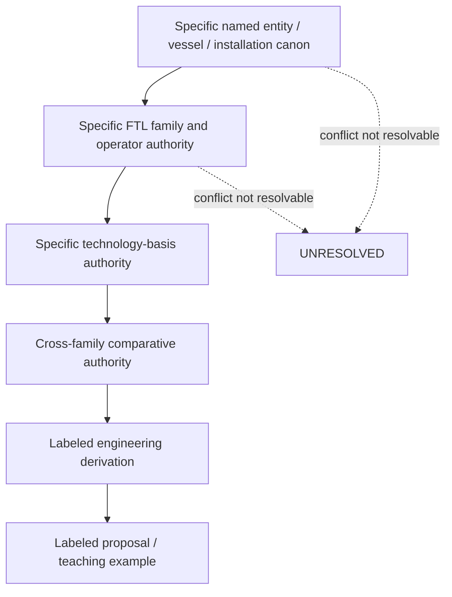
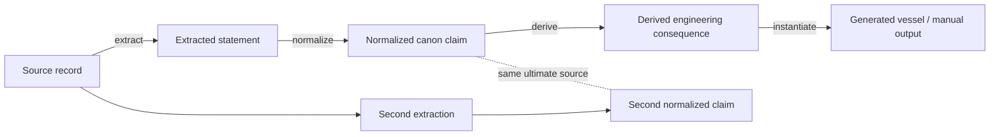
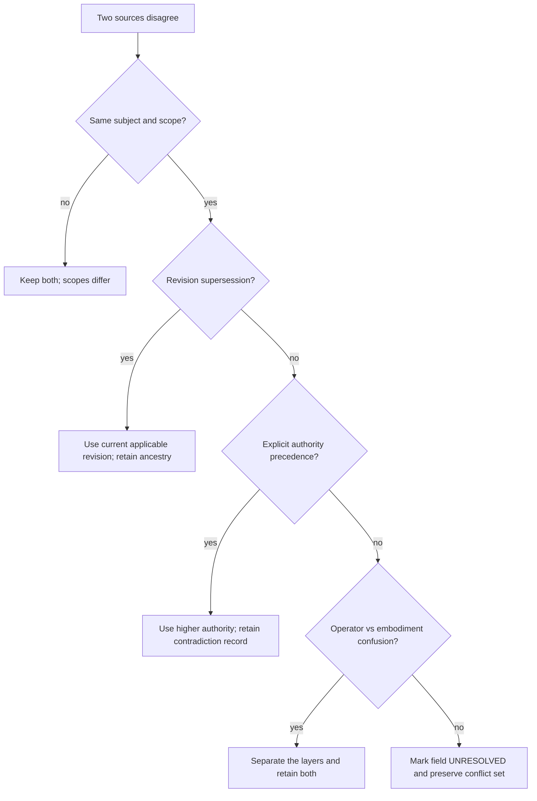
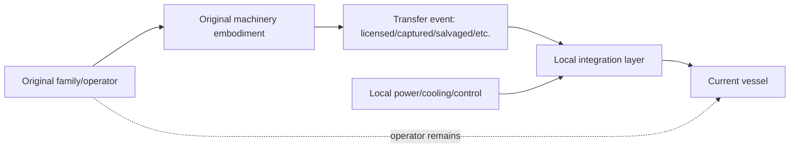

# Black Light FTL Civilization Engineering Doctrine

**Status:** MIXED — authority-preserving integration doctrine with labeled derived engineering models.

**Primary authority:** `docs/blacklight/BLACK_LIGHT_PROPULSION_TRANSIT_AUTHORITY.md`

**Supporting authorities:** `data/exo-vessel/ftl-cross-family-integration-registry.json`, `data/exo-stellar-sector/civilization-authority-registry.json`, the family-specific technical volumes, and the technology-basis authority.

**Requested source document:** *The different lightspeed methods*, Google Drive file `1e0Xp71EFubBZgXWjjvPxAqPoJIZNwqS6nu1-r7Kil7Y`.

This document answers a narrow but important question: once the setting has several distinct faster-than-light operators and several distinct technology bases, when may the generator say that a particular civilization, race, manufacturer, vessel, fleet, or installation actually uses one of them?

The answer is deliberately conservative. Engineering resemblance is not historical evidence. A crystal-built Fold-Jump machine is not proof that every crystalline civilization invented Fold-Jump. A biological Slipstream coupler is not proof that the species operating it originated the family. A captured Gate control plant does not become indigenous merely because a new owner rewires its controls.

The doctrine exists to make civilization-specific engineering richer without allowing flavor generation to overwrite canon.

---

## 1. Three questions that must never be collapsed

Every civilization-specific transit description must keep three layers distinct:

\[
\boxed{
\text{operator physics}
\neq
\text{machinery embodiment}
\neq
\text{historical ownership}
}
\]

**Operator physics** answers what the family actually does: deform a metric, couple to a gravitational plane, adhere to a Q-boundary, translate between lattice states, traverse an N-manifold, create temporary adjacency, maintain a wormhole throat, or perform nonlocal state displacement.

**Machinery embodiment** answers how a particular technological tradition generates, senses, powers, controls, cools, supports, and services that operator.

**Historical ownership** answers who invented it, who manufactures it, who commonly uses it, who licensed it, who captured it, and when those events occurred.

The first layer comes from family authority. The second may often be derived from confirmed technology-basis and installation facts. The third requires explicit historical or entity-specific authority.

A generator that merges these layers will eventually manufacture setting history by accident.

---

## 2. Authority precedence



The diagram is an authority ordering, not a claim that a named entity may rewrite physical law casually. If a named source says a vessel carries a Fold-Jump drive, that establishes the vessel-to-family binding. The Fold-Jump family authority still determines what Fold-Jump means unless the named source explicitly establishes a genuine variant and that variant is admitted into the authority chain.

Specific canon therefore outranks generic assumptions, while family physics remains protected from accidental mutation.

---

## 3. Claim admission

An externally asserted claim should be represented as a provenance-bearing object rather than plain prose.

A useful logical form is:

\[
A(c)=
S(c)
\land
\neg H(c)
\land
L(c),
\]

where:

- \(S(c)\) means the source ancestry materially supports claim \(c\),
- \(H(c)\) means a higher-precedence authority materially contradicts it,
- \(L(c)\) means every transformation after source extraction is labeled.

Only when \(A(c)=1\) should a named binding be emitted as admitted authority.

For an entity-to-family relation, the generator should retain at least:

```json
{
  "claim_id": "...",
  "subject": "named entity id",
  "predicate": "uses-ftl-family",
  "object": "family id",
  "status": "CONFIRMED",
  "authority_rank": "named-entity-canon",
  "source_ancestry": ["source id / revision / locator"],
  "transformation": "direct-normalization",
  "contradictions": [],
  "scope": "named entity only"
}
```

A field with no admissible source remains `UNRESOLVED`. The system is not defective because it does not know an inventor's name. It is defective if it quietly invents one and later treats the invention as evidence.

---

## 4. Provenance is a graph, not a footnote

The provenance model is:

\[
G_P=(V,E),
\]

where each vertex is a source or claim node and each directed edge records a transformation.



The dashed relationship is important. Two normalized records do not become independent evidence merely because they are stored in separate files when both descend from the same source.

The required origin chain is:

\[
\boxed{
\text{source}
\rightarrow
\text{extraction}
\rightarrow
\text{normalized canon claim}
\rightarrow
\text{derived engineering consequence}
\rightarrow
\text{generated output}
}
\]

Every transition should say what happened. Typical edge labels include `extraction`, `normalization`, `derivation`, `proposal`, `inheritance`, `scope restriction`, and `contradiction`.

### 4.1 Provenance completeness

For editorial auditing, define:

\[
C_P=
\frac{N_{\rm claims\ with\ source+status+transform}}
{N_{\rm externally\ asserted\ claims}}.
\]

This is `DERIVED` and purely an editorial quality metric. It is not an in-world scientific quantity.

For a published generated technical record, the target is:

\[
C_P=1.
\]

That does not mean every claim is confirmed. It means every externally asserted claim exposes where it came from, what status it has, and how it changed between source and output.

---

## 5. Contradictions are records, not inconveniences

For a claim \(c\), define the conflict set:

\[
\mathcal K(c)=
\{s_i\mid s_i\text{ supports a materially incompatible value of }c\}.
\]

A contradiction resolver should proceed in this order:

1. Confirm that the records refer to the same subject and scope.
2. Determine whether one record is superseded by a later revision.
3. Apply explicit authority precedence.
4. Determine whether the apparent conflict is actually operator-versus-embodiment language.
5. If equal or top authority still conflicts, preserve the alternatives and mark the contested field `UNRESOLVED`.

It must not average two categorical claims, count files as votes, or select the claim that produces a more convenient generator result.

### Provenance dispute decision tree



---

## 6. Compositional engineering model

A civilization-specific realization of family \(f\) by entity/context \(e\) can be represented as:

\[
\mathcal R_{e,f}
=
\mathcal O_f
+
\mathcal B_e
+
\mathcal I_e
+
\mathcal C_e.
\]

Here:

- \(\mathcal O_f\) is the family operator and invariant physical action.
- \(\mathcal B_e\) is the technology-basis embodiment.
- \(\mathcal I_e\) is the actual installation geometry, power, thermal, structural, sensor, and service context.
- \(\mathcal C_e\) contains civilization/manufacturer practices only when supported by canon.

The operator projection must satisfy:

\[
\boxed{
\Pi_{\rm operator}(\mathcal R_{e,f})=\mathcal O_f
}
\]

unless a higher authority explicitly establishes a genuinely different physical mechanism.

This is the most important machinery safeguard in this volume. An aquatic implementation can replace dry busbars with pressure-native electrochemical or hydraulic carriers. A mineral implementation can replace fabricated antenna grids with prestressed crystalline photonic structures. A postmaterial implementation can distribute control across field-mediated nodes. None of these changes permits a Fold-Jump machine to become a Slipstream machine merely because the visual or control embodiment changed.

---

## 7. What civilization or manufacturer practice may legitimately change

| Engineering domain | May vary by civilization/manufacturer | Must remain family-bound unless higher canon says otherwise |
|---|---|---|
| Power | source, conversion, storage, bus topology, redundancy, reserve custody | event/hold/recovery requirements of the operator |
| Navigation | UI, estimator architecture, sensor carrier, crew automation | required observables and family-specific proof problem |
| Control | actuator carrier, control hierarchy, software/biological/distributed implementation | commit boundaries, admissibility vetoes, recovery semantics |
| Structure | materials, load paths, active compensation, modularity | protected-volume/field/coverage requirements |
| Thermal | coolant, radiators, phase-change media, heat sinks | actual waste-energy burden and safe limits |
| Maintenance | access philosophy, LRUs, cultivated repair, crystal retuning, self-reconfiguration | diagnostic obligation to prove restored physical behavior |
| Signature | shielding, timing, duty cycle, heat management, emissions discipline | operator-required transient/field/wake/topology phenomena |
| Infrastructure | beacon design, yards, traffic control, gate architecture, calibration standards | family-required infrastructure where established |
| Failure response | alarm philosophy, redundancy, crew doctrine, automatic protection | confirmed family failure mechanisms and hard vetoes |

A civilization may therefore feel technologically distinctive without receiving a different set of physical laws.

---

## 8. Technology-basis translation without ownership inference

The operative basis identifiers remain:

- `TERRESTRIAL_ELECTROMECHANICAL`
- `AQUATIC_ELECTROCHEMICAL_HYDRAULIC`
- `CRYOGENIC_AMMONIA_HALOCARBON`
- `GAS_GIANT_FLUIDIC_ELECTROSTATIC`
- `BIOLOGICAL_SYMBIOTIC`
- `MINERAL_PIEZOELECTRIC_PHOTONIC`
- `FIELD_MEDIATED_POSTMATERIAL`

These may determine how an engineering effect is embodied. They do not establish race, civilization, manufacturer, inventor, date, historical first use, or prevalence.

### Generic worked example

Suppose an installation is confirmed to use `MINERAL_PIEZOELECTRIC_PHOTONIC` technology and confirmed to carry a Metric Compression Envelope. No source identifies the civilization or manufacturer.

Allowed derived description:

> **DERIVED:** The metric field-former may plausibly use prestressed crystalline resonators, distributed photonic timing paths, and piezoelectric trim structures to create and correct the same metric deformation operator.

Blocked description:

> **Not admissible:** “The Crystal Confederacy invented metric drives and almost universally uses them.”

Nothing in the premises establishes that civilization, invention history, or prevalence.

The correct attribution fields remain:

```json
{
  "family": {"value":"metric-envelope","status":"CONFIRMED"},
  "technology_basis": {"value":"MINERAL_PIEZOELECTRIC_PHOTONIC","status":"CONFIRMED"},
  "machinery_embodiment": {"status":"DERIVED"},
  "manufacturer": {"value":null,"status":"UNRESOLVED"},
  "civilization": {"value":null,"status":"UNRESOLVED"},
  "inventor": {"value":null,"status":"UNRESOLVED"},
  "first_use_date": {"value":null,"status":"UNRESOLVED"}
}
```

This is more useful than guessing because later canon can fill the empty relationships without requiring a cleanup of fabricated history.

---

## 9. Foreign, captured, licensed, salvaged, and reverse-engineered systems

A foreign drive has at least two histories:

1. the history of the physical system and its originating design tradition;
2. the history of its current custody, modification, maintenance, and integration.

Those histories may diverge dramatically.



Local engineers may replace power conditioners, cooling loops, control consoles, authentication roots, sensor interfaces, mounting structures, software, biological symbionts, field-former sectors, or service access. Those changes can produce a system whose practical maintenance culture is mostly local while the operator and original invention provenance remain foreign.

### 9.1 Reverse engineering

Reverse engineering creates new provenance edges. It does not erase the parent.

A lawful record can say:

- the local manufacturer reproduced a field-former geometry from captured hardware;
- the local control system is an independently developed replacement;
- the original prime mover remains poorly understood;
- the resulting hybrid installation has new failure modes;
- local production began at a confirmed date, if a source says so.

It cannot say the local manufacturer invented the underlying FTL family unless an authority explicitly supports that claim.

---

## 10. Multi-origin and refitted vessels

Treat major subsystems as separately provenance-bearing:

```text
VESSEL
├── FTL prime mover ........ origin A
├── FTL field/cage system .. origin A/B retrofit
├── reactor ................ origin C
├── power conditioning ..... local replacement
├── navigation computer .... origin D
├── gravimetry/Q sensors ... mixed
├── reference clock ........ local
├── thermal system ......... original hull system
├── recovery reserve ....... shared with reactor bus
└── command integration .... current custodian
```

A single vessel can therefore contain multiple confirmed engineering traditions.

This becomes especially important after decades of refits. “Built by manufacturer X” is not equivalent to “every currently installed system was designed by manufacturer X.”

Generator records should preserve subsystem origin and current integration separately.

---

## 11. Common-mode dependence

A secondary FTL system is not truly independent simply because it uses another transit family.

If both drives share the same reactor, clock, navigation reference, cooling trunk, sensor mast, command computer, structural spine, authentication root, or recovery-energy store, a failure in that shared support can disable both.

A simple `DERIVED` dependency indicator is:

\[
\eta_c=
\frac{N_{\rm critical\ shared}}
{N_{\rm critical\ total}}.
\]

This is not a universal reliability probability. It is an architectural indicator for identifying whether apparent redundancy is actually common-mode coupled.

### Example

A vessel carries a Metric primary drive and Fold-Jump emergency drive. Both use separate prime movers, but both depend on the same gravimetry array, reference clock, power-conditioning trunk, and protected recovery battery.

The vessel does **not** possess four independent safety layers just because it has two drive names. A gravimetry reference poisoning event may invalidate both families' navigation proof chains at once.

---

## 12. Power doctrine

Civilization-specific engineering may alter the machinery used to provide power, but family-specific power semantics remain intact.

Useful installation-level accounting is:

\[
\mathcal P_{e,f}=
\{
P/E_{\rm source},
P/E_{\rm condition},
P/E_{\rm prime},
P/E_{\rm sense},
P/E_{\rm compute},
P/E_{\rm control},
P/E_{\rm thermal},
E_{\rm protected\ recovery}
\}_{e,f}.
\]

The local engineering culture may decide that recovery reserve is held in a dedicated flywheel, superconducting loop, chemical pressure accumulator, biological reserve organ, crystal strain bank, or field-mediated storage node.

What it may not do is rename ordinary discretionary energy as “recovery reserve” and then spend it without preserving the family-specific safe-exit requirement.

---

## 13. Navigation and control doctrine

A civilization may operate the same family very differently.

One culture may require three independent human officers to authorize a Fold-Jump commit. Another may use distributed machine consensus. A biological vessel may experience candidate topology solutions as neural sensory states. A postmaterial craft may continuously prove route admissibility through field-distributed computation.

These are meaningful cultural and machinery differences.

The invariant is that the system still must solve the family-specific problem. Fold-Jump must establish an admissible endpoint volume before commit. Slipstream must forecast boundary/weather state and retain detach authority. N-Manifold must preserve a viable return map. Gate systems must authenticate and synchronize mouths. Phase Displacement must prove target-state and continuity requirements.

A different user interface is not a waiver from physics.

---

## 14. Maintenance doctrine

Maintenance has two proof obligations:

\[
\text{restored machinery state}
\land
\text{restored family behavior}.
\]

Replacing a failed component proves only the first unless the relevant family behavior is re-certified.

A civilization-specific manual may legitimately define:

- what constitutes a replaceable unit;
- whether field formers are repaired, regrown, retuned, or replaced;
- whether calibration is centralized or sectional;
- which tools technicians carry;
- how many independent witnesses are required;
- how service records are authenticated;
- which signature baseline is considered acceptable;
- whether a ship can operate under a restricted envelope after partial repair.

The return-to-service proof should still validate the family-specific end effect.

---

## 15. Signature doctrine

Manufacturing practice and operating culture may redistribute a signature without deleting confirmed operator phenomena.

For a particular realization:

\[
\mathbf S_{e,f}
=
\mathbf S_{operator,f}
+
\Delta\mathbf S_{basis,e}
+
\Delta\mathbf S_{installation,e}
+
\Delta\mathbf S_{doctrine,e}.
\]

This permits useful distinctions such as quiet superconducting conditioning but a strong topology transient, biologically diffuse control emissions but a distinctive thermal recovery phase, or a heavily shielded gate controller attached to an unmistakably persistent aperture.

A stealth-oriented civilization may reduce several channels substantially. It cannot make an operator-defined topology event cease to exist merely because a generated culture has a stealth trait.

---

## 16. Failure doctrine

A realization inherits family failures and adds embodiment failures:

\[
\mathcal F_{e,f}
=
\mathcal F_f
\cup
\mathcal F_{basis,e}
\cup
\mathcal F_{integration,e}
\cup
\mathcal F_{common,e}.
\]

Examples of embodiment additions include superconducting quench, hydraulic cavitation, crystal fracture/dephasing, neural control seizure, electrostatic membrane collapse, corrupted field-node consensus, or incompatible retrofit timing.

These do not replace Fold endpoint covariance, Slipstream adhesion loss, Gate throat instability, N-Manifold return-map corruption, or other confirmed family failures.

When an accident is generated, the root-cause record should say which layer failed.

---

## 17. Infrastructure doctrine

Infrastructure itself has provenance.

A beacon may be built by one polity, use a navigation protocol from another, be maintained by a commercial operator, and serve vessels using several families. A Gate mouth may retain original throat machinery while its traffic-control plant, authentication system, and thermal yard are later replacements.

The generator should therefore distinguish:

- physical FTL infrastructure;
- navigation/reference infrastructure;
- calibration infrastructure;
- industrial maintenance infrastructure;
- traffic-control infrastructure;
- authentication/identity infrastructure;
- current operator/custodian;
- original designer/manufacturer where confirmed.

“Operated by” is not automatically “invented by.”

---

## 18. Scaling doctrine

Civilization and manufacturer quality can improve coefficients without erasing the variables that make a family scale badly.

Represent a realization as:

\[
\mathcal B_{e,f}
=
F_f(
L,V,A,N_c,B_s,\tau,S,\mathcal E,\text{Path};\theta_e
),
\]

where \(\theta_e\) contains embodiment-specific coefficients such as material strength, clock quality, sensor sensitivity, cooling performance, fabrication tolerance, field-former efficiency, and control latency.

A technologically excellent civilization may therefore build a smaller or more reliable machine at the same performance point. It does not gain permission to replace a nonlinear family law with a linear one unless higher canon establishes that breakthrough.

---

# Practical Equipment Manual Series

## CA-01 — Canon Binding Audit

**Purpose:** Determine whether an entity-to-technology statement may be emitted as canon.

1. Identify the exact subject: race, polity, civilization, manufacturer, vessel, installation, or subsystem.
2. Identify the exact proposed relation: uses, owns, invented, manufactured, licensed, captured, operates, or commonly deploys.
3. Locate the source ancestor establishing that relation.
4. Record source revision/commit and locator.
5. Normalize the claim without broadening its scope.
6. Check higher-precedence sources for contradiction.
7. Check whether multiple apparent confirmations share one source ancestor.
8. Assign status.
9. If the relation is not established, emit `UNRESOLVED` rather than a plausible guess.
10. Only then allow downstream engineering derivation.

**Failure condition:** A named ownership/history statement exists in output but cannot be traced to an admitted claim.

---

## CA-02 — Foreign Drive Integration

**Purpose:** Install or evaluate a drive whose originating engineering tradition differs from the host vessel.

**Before energization:**

- identify family/operator from source or physical diagnostic evidence;
- separate confirmed origin from current custody;
- inventory unknown or modified modules;
- map power, cooling, clock, reference, sensor, command, structure, and recovery dependencies;
- establish whether local replacement parts change calibration assumptions;
- build a family-specific restricted test envelope;
- preserve original identifiers and provenance marks.

**Do not:** translate unfamiliar controls into familiar terminology and then infer that the underlying operator is familiar.

**Return criterion:** the host integration must demonstrate the same family-specific safety and recovery invariants as an indigenous installation would require.

---

## CA-03 — Manufacturer Substitution / Line-Replaceable Unit Change

A replacement unit may be mechanically or logically compatible while altering latency, thermal behavior, signature, calibration, field symmetry, reference noise, or failure propagation.

After substitution:

\[
\Delta\theta
=
\theta_{new}-\theta_{certified}
\]

must be assessed against the family model rather than against connector fit alone.

A part that bolts in is not necessarily a part that preserves the certified transit envelope.

---

## CA-04 — Provenance Dispute

When two records disagree:

- freeze promotion of the contested field;
- retain both source records;
- establish subject/scope identity;
- compare revisions;
- apply authority precedence;
- inspect shared ancestry;
- separate operator and embodiment claims;
- document the contradiction set;
- resolve only when evidence warrants it.

If not resolved, mark the field `UNRESOLVED` and continue with bounded engineering outputs that do not depend on choosing a side.

---

## CA-05 — Return to Service After Refit

A major refit requires more than component self-test.

Required evidence should include:

- post-refit geometry survey;
- subsystem provenance inventory;
- clock/reference integrity;
- sensor calibration ancestry;
- whole-vessel coverage where applicable;
- load-path and thermal validation;
- power/recovery reserve proof;
- family-specific low-energy or bounded test;
- failure-isolation exercise;
- post-refit signature baseline;
- explicit restricted operating envelope for unresolved deviations.

The final certificate should name unresolved limitations. Silence is not certification.

---

## CA-06 — Captured or Unknown-Origin Drive Intake

Treat an unknown drive as an evidence problem before treating it as a prize.

**Phase 1: Quarantine** — isolate power, data, control, biological, field, and network paths.

**Phase 2: Observe** — passive spectroscopy, gravimetry, Q-state sensing, topology monitoring, thermal mapping, materials analysis, clock/reference discovery.

**Phase 3: Classify** — determine whether evidence supports a known family operator. Do not classify by visual resemblance alone.

**Phase 4: Bound** — establish what remains unknown: origin, manufacturer, operating limits, recovery semantics, authentication requirements, hidden dependencies.

**Phase 5: Test** — proceed from passive to low-energy reversible experiments before irreversible or topology-changing events.

**Phase 6: Integrate** — only after family safety invariants and common-mode dependencies are understood well enough to define a restricted service envelope.

An `UNKNOWN-ORIGIN` label is a valid technical state.

---

# Educational Text I — Undergraduate Engineering

## Why the machine does not tell you who invented it

Engineering students routinely encounter artifacts whose physical principles are obvious while their historical provenance is not. A turbine reveals thermodynamics and manufacturing practice; it does not necessarily reveal the inventor, owner, or legal license chain.

FTL machinery is no different.

If a machine creates a temporary topological adjacency between two protected volumes, the operator evidence may identify Fold-Jump. If its field formers are living tissue, the machinery may identify a biological technology basis. Neither observation establishes which species invented Fold-Jump.

The three questions must be answered with three evidence chains.

### Exercise

A derelict vessel contains a crystalline N-Manifold machine. Its navigation computer was manufactured by a known commercial polity, but the manifold core has no surviving maker marks.

What may you conclude?

**Answer:** You may conclude only what the evidence actually supports: N-Manifold family if the operator is adequately established; mineral/crystalline embodiment if that is supported; the named polity as manufacturer of the navigation computer. The manifold-core manufacturer and original civilization remain unresolved.

---

# Educational Text II — Advanced Systems Integration

## Evidence-correlated redundancy

Suppose a ship has three target-reference services:

\[
r_1,r_2,r_3.
\]

A naive controller may assume three confirmations imply high confidence. If all three are ultimately derived from the same damaged beacon \(b\), however,

\[
Anc(r_1)=Anc(r_2)=Anc(r_3)=\{b\},
\]

then the three services are correlated descendants of one evidence root.

The correct architecture tracks ancestry and seeks an independent source \(r_4\) with:

\[
Anc(r_4)\cap Anc(r_1)=\varnothing
\]

for the critical reference path, where operationally possible.

The same principle applies to historical canon. Three wiki records generated from one design memo do not constitute three independent confirmations of an inventor.

---

# Educational Text III — Provenance-Aware Control

A mature technical generator should treat authority state as part of its control state.

Let:

\[
x_p=[x_{physics},x_{installation},x_{provenance},x_{uncertainty}].
\]

A candidate description or generated engineering choice is admissible only when both the physical and provenance constraints are satisfied:

\[
g_{physics}(x_p)\le0,
\]

\[
g_{authority}(x_p)\le0.
\]

This sounds editorial, but it has practical consequences. If a vessel's origin determines what replacement parts, calibration tables, or authentication keys are valid, provenance uncertainty becomes a real maintenance and safety uncertainty.

The lore system and engineering system should therefore not be separate piles of text. They should exchange bounded, status-bearing facts.

---

# Research and Thesis Program

The following are `PROPOSED` research-document classes. They do not establish historical authors, institutions, dates, or inventions.

### Thesis proposal: Provenance-preserving subsystem inference

Investigate algorithms that infer machinery embodiment from observed installation facts while proving that no generated result exceeds the authority of its source ancestry.

### Thesis proposal: Common-mode dependency discovery in mixed-family vessels

Develop graph methods for discovering hidden shared dependencies among physically distinct FTL systems.

### Thesis proposal: Cross-cultural calibration translation

Study how two engineering traditions can express the same family observables through different sensor carriers, units, data structures, or biological perceptual channels without losing invariant physical meaning.

### Thesis proposal: Contradiction-preserving technical synthesis

Develop technical-document generators that can remain useful when equal-authority sources disagree, rather than forcing premature resolution.

### Patent-class proposal: Provenance-tagged replacement unit

A replaceable subsystem carries machine-readable calibration ancestry, family applicability, transformation history, and service-envelope effects. **Inventor/date/civilization: UNRESOLVED.**

### Patent-class proposal: Independent authority-root monitor

A safety device identifies when multiple navigation or engineering confirmations descend from one evidence root and refuses to treat them as independent. **Inventor/date/civilization: UNRESOLVED.**

---

# Generator Contract

The canonical resolver surface for this layer is:

```text
resolveCivilizationEngineeringDoctrine(context)
```

Suggested input:

```json
{
  "authoritySnapshot": "required",
  "civilizationId": null,
  "raceId": null,
  "manufacturerId": null,
  "vesselId": null,
  "installationId": null,
  "familyId": null,
  "technologyBasisId": null,
  "installationContext": {},
  "requestedDetail": "engineering|manual|history|all",
  "evidenceMode": "AUTHORITY_ONLY|LABELED_DERIVATION|LABELED_PROPOSAL"
}
```

Required output classes:

```json
{
  "confirmedBindings": [],
  "confirmedEntityTraits": [],
  "derivedEmbodiments": [],
  "unresolvedAttributions": [],
  "contradictions": [],
  "provenanceGraph": {"nodes":[],"edges":[]},
  "operatorInvariantChecks": [],
  "machineryDoctrine": {},
  "powerDoctrine": {},
  "navigationControlDoctrine": {},
  "maintenanceDoctrine": {},
  "signatureDoctrine": {},
  "failureDoctrine": {},
  "infrastructureDoctrine": {},
  "scalingDoctrine": {},
  "canonWarnings": [],
  "generationTrace": []
}
```

## Mode behavior

`AUTHORITY_ONLY` may emit named bindings only where admitted authority supports them.

`LABELED_DERIVATION` may combine confirmed operator, technology-basis, installation, and entity facts into engineering consequences, but every such consequence remains `DERIVED` and retains ancestry.

`LABELED_PROPOSAL` may propose machinery, manuals, teaching cases, patent classes, retrofit solutions, or unresolved alternatives. Proposed material cannot promote itself to canon merely by being saved, rendered, or generated repeatedly.

---

# Canon Safeguard Checklist

Before publishing a civilization-specific FTL record, verify all of the following:

- The FTL family is sourced or explicitly unresolved.
- The technology basis is sourced or explicitly labeled as derived/proposed.
- Named ownership is not inferred from machinery style.
- Named manufacturer is not inferred from race or civilization.
- Inventor and date are not invented to make a technical history read smoothly.
- Refit/current custody is separate from origin.
- Shared evidence ancestry is visible.
- Equal-authority contradictions remain visible when unresolved.
- The family operator has not been mutated by flavor text.
- Family-specific gravity, safety, commit, recovery, signature, scaling, and infrastructure constraints remain active.
- Training accidents and patent examples retain their declared status.
- Generated vessel authority is scoped to the generated vessel unless a higher authority explicitly generalizes it.

---

# Integration Result

This doctrine permits the Black Light corpus to become substantially more civilization-specific without becoming less trustworthy.

A future named civilization record can now say not merely that a polity “has FTL,” but exactly which family is confirmed, which machinery basis is confirmed, what portions of the installation are derived engineering consequences, which manufacturer or historical relationships are actually sourced, which parts were captured or refitted, what common-mode dependencies the integration creates, and which facts remain unresolved.

That is the correct foundation for the next stage of detailed alien engineering histories. Richness comes from preserving differences and evidence, not from filling every blank.
