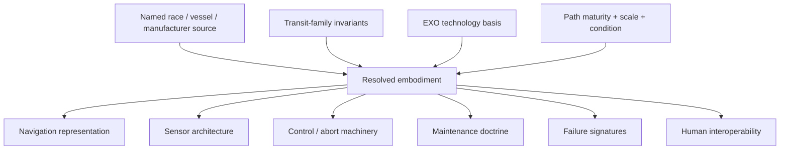
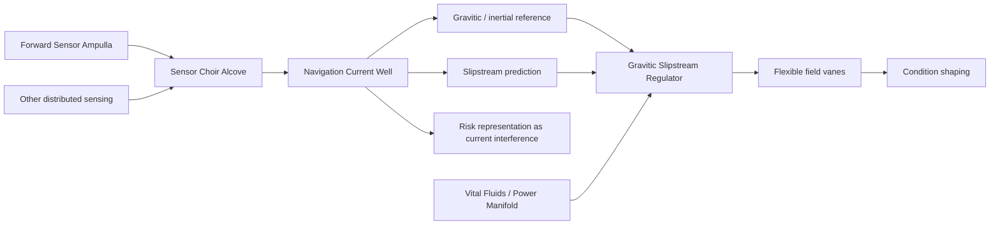

# Black Light FTL Control, Navigation & Maintenance Embodiment Manual

**Status:** `MIXED` — established authority integration plus explicitly labeled `DERIVED` and `PROPOSED` engineering models.  
**Primary authority:** `docs/blacklight/BLACK_LIGHT_PROPULSION_TRANSIT_AUTHORITY.md`  
**Technology-basis authority:** `EXO_OPERATIVE_TECHNOLOGY_BASIS.md`  
**Machine-readable companion:** `data/exo-vessel/ftl-control-embodiment-registry.json`  
**Runtime:** `blacklight-exo-ftl-control-embodiment-runtime.js`  
**Design-intent source:** Google Drive document **The different lightspeed methods**, document ID `1e0Xp71EFubBZgXWjjvPxAqPoJIZNwqS6nu1-r7Kil7Y`, revision `ANLCKQllC5h6dLaX5H1RpK8aUFVWsi-IV7gbMHUd0Qq7mIe5uGsLFi5_Hrsr8B6dl8t_ezB0fTSygxrnIBtifAHW79bgSbswp1zF3NaEil0`.

---

## 1. Purpose

Black Light now has a substantially developed body of transit-family physics, environmental penalties, route certification, safety lookahead, recovery reserve, event replay, forensic identification, and named-vessel engineering. The next failure mode is subtler: allowing all of those systems to emerge through the same terrestrial console, sensor rack, maintenance checklist, alarm panel, and service doctrine.

That would preserve equations while erasing civilization.

This manual establishes the opposite rule:

\[
\boxed{
\text{same safety requirement}
\neq
\text{same machinery embodiment}
}
\]

A Mur'rek Current Well, an Ar'nock cultivated neural control organ, a human tactical plot, a mineral-photonic resonance chamber, and a gas-giant pressure-logic navigation volume may all satisfy equivalent information requirements while being physically, cognitively, and operationally dissimilar.

The invariant requirement is the information and authority needed to survive transit. The embodiment is species, manufacturer, environment, body-plan, industrial-history, and technology-basis dependent.

---

## 2. Authority boundary

Authority resolves in this order:

1. named race/species, manufacturer, vessel, installation, and technology sources;
2. consolidated propulsion/transit authority;
3. explicit family/operator physics;
4. EXO operative technology-basis doctrine;
5. live implementation behavior within its documented scope;
6. registry and schema contracts;
7. labeled engineering derivation;
8. labeled proposals.

A generic embodiment rule may fill a visual or maintenance gap. It may not overwrite a named source.



The runtime must retain provenance for every layer.

---

## 3. The five safety channels that cannot disappear

Regardless of civilization, interface philosophy, or species senses, five safety channels remain mandatory:

| Channel | Engineering meaning | Typical failure consequence |
|---|---|---|
| Gravity/environment | Relevant potential, gradient, shear, curvature, boundary state and route environment | route deformation, fork, excessive drive penalty, invalid transit solution |
| Calculation uncertainty | Covariance, endpoint/state uncertainty, clock/reference uncertainty | false precision, wrong endpoint, wrong lane, invalid commit |
| Actionable lookahead | Enough future state to detect, decide, act, exit and clear | hazard discovered after physical escape is no longer possible |
| Protected recovery | Reserved unwind/recoupling/detachment/rejection/closure/reconciliation capacity | nominal performance consumes the last survival path |
| Hazard observability | Required hazards seen directly or by independent guard channel | sensor silence misread as safety |

The native UI may represent these as numbers, currents, tones, colors, tissue tension, resonant modes, pressure layers, or a spatial field. The generator must not delete them merely because the species would not use a human dashboard.

Define the abstract certification state:

\[
\mathbf C=
[
G,
U,
L,
R,
O
]^T
\]

where:

- \(G\): gravity/environment authority;
- \(U\): bounded uncertainty;
- \(L\): actionable lookahead;
- \(R\): protected recovery;
- \(O\): hazard observability.

Certification remains conjunctive:

\[
C_{\rm route}=G\land U\land L\land R\land O.
\]

No civilization gets to average away a failed axis.

---

## 4. Representation versus physics

A civilization's interface is a mapping:

\[
\mathcal I_s:
\mathbf X_{physical}
\rightarrow
\mathbf P_s
\]

where \(\mathbf X_{physical}\) is the relevant physical/navigation state and \(\mathbf P_s\) is the perceptual/control representation used by species or industrial culture \(s\).

A human tactical console might map a gravity gradient to a vector field and numeric confidence ellipse. A Mur'rek Current Well may map the same engineering content into current speed, depth, interference, and flow topology. An Ar'nock interface may encode urgency through vibration modes and cultivated neural state.

The mapping can be unfamiliar without being arbitrary.

A valid representation must preserve decision-relevant information:

\[
I(\mathbf X_{hazard};\mathbf P_s)
\ge
I_{min,safety}.
\]

This is a `PROPOSED` information-theoretic expression of an established engineering rule: cultural representation may change; the information necessary for safe action may not disappear.

---

## 5. Technology-basis embodiments

### 5.1 Terrestrial electromechanical-industrial

The human reference basis favors orthographic plots, numeric route certificates, covariance overlays, explicit annunciators, electronic flight computers, physically isolated safety interlocks, replaceable sensor packages, and procedural maintenance.

Typical control chain:

```text
sensor array
   ↓
digital fusion
   ↓
route solver
   ↓
operator / automation decision
   ↓
field controller
   ↓
prime mover / field machinery

independent guard sensors
   ↓
safety interlock
   ↓
emergency de-transit path
```

The important feature is not that this is familiar. It is that independent guard channels remain physically and logically distinct from ordinary optimization.

### 5.2 Aquatic electrochemical-hydraulic

Wet machinery can express navigation as flow topology, pressure gradients, current fields, acoustic volumes, or immersed optical projections. Pressure and chemistry are not merely life-support concerns: they may directly set actuator authority and sensor calibration.

A representative readiness vector is:

\[
\mathbf R_W=[P_h,\chi,\Omega,\Gamma_g,S_a,R_e]^T
\]

where hydraulic pressure, chemistry, osmolality, gravimetric reference, acoustic reference, and emergency reserve are separate constraints.

A clean route solution with unstable ionic reference is not certified.

### 5.3 Cryogenic ammonia-halocarbon

Here the navigation system's calibration state is inseparable from thermal history. Superconductive loops, photonic metrology, contraction-sensitive references, phase-change actuators, and vacuum-jacketed service systems make temperature a geometry variable.

A useful `PROPOSED` alignment budget is:

\[
\epsilon_{align}=
\epsilon_0+\alpha_L\Delta L+\alpha_T\Delta T+\alpha_q Q_{cycle}.
\]

The route may be mathematically valid but mechanically uncertified after an uncontrolled warmup.

### 5.4 Gas-giant fluidic-electrostatic

A high-pressure civilization may navigate through pressure layers, buoyancy corridors, charge fields, turbulence maps, and acoustic structure. Control may be distributed through pressure logic, electrostatic actuation, flexible membranes, and tension networks.

Its bridge need not be a room full of screens. It may be a pressure-balanced volume whose wall tension, acoustic response, and floating reference elements are themselves instruments.

### 5.5 Biological-symbiotic

Biological machinery must be treated as machinery: measurable state, calibration, failure modes, resource requirements, and certification boundaries.

Useful state:

\[
\mathbf R_B=
[E_u,M_r,N_s,G_e,I_m,R_g]^T
\]

with usable energy, metabolic reserve, neural synchronization, geometry error, immune state, and regeneration debt.

The governing rule is:

\[
\boxed{\text{healed}\neq\text{recertified}}
\]

Regrowth can restore continuity while changing geometry, timing, sensitivity, or coupling.

### 5.6 Mineral piezoelectric-photonic

A mineral-photonic civilization may treat resonance purity, preload, axis alignment, flaw maps, and optical phase as ordinary service quantities.

A route-control panel may be a resonant cavity or photonic interference volume rather than a display.

A `PROPOSED` condition metric is:

\[
Q_c=Q_0(1-D_f)(1-E_a)(1-C_o)
\]

where flaw damage, axis error, and optical contamination reduce effective control quality.

### 5.7 Field-mediated adaptive

Adaptive matter and field-mediated control can hide mechanical complexity, but not eliminate certification.

The dangerous assumption is:

\[
\text{self-configuring}\Rightarrow\text{self-certifying}.
\]

That implication is false.

A safe adaptive system still needs independently trusted reference state, hostile-state resistance, protected rollback energy, fallback geometry, and a way to prove that the adaptive controller has not corrupted the same metrology used to validate itself.

---

## 6. Named profile: Zwlei Mur'rek

### 6.1 Confirmed machinery

The named Mur'rek source confirms:

- a Navigation Current Well;
- moving-current course solutions;
- vector, gravity and transit-risk encoding through speed, depth and interference;
- gravitic reference, slipstream prediction and inertial control;
- a Sensor Choir Alcove;
- electromagnetic, gravitic, chemical, acoustic and exotic sensor fusion;
- a Forward Sensor Ampulla;
- a Gravitic Slipstream Regulator;
- flexible field vanes immersed in dielectric fluid;
- a Vital Fluids / Power Manifold;
- conductive coolant, bio-reactive power fluids, nutrient media and hydraulic control pressure;
- asymmetric vane response capable of rotating the local inertial frame;
- dangerous fluid mixing capable of creating corrosive electrically active foam.

The exact consolidated transit family remains `UNRESOLVED`.

### 6.2 Native control embodiment



The Current Well should therefore not be regenerated as a screen displaying a disguised human navball. Its moving current is the interface.

### 6.3 Sensor independence problem

Multiple Mur'rek displays can agree while sharing one upstream fusion root.

If display states \(D_1,D_2,D_3\) all descend from Current Well fusion node \(F\), then:

\[
P(D_1,D_2,D_3|F)\neq
P(D_1|F)P(D_2|F)P(D_3|F)
\]

for safety-independence purposes.

The generator must count independent ancestry, not visible display count.

### 6.4 Maintenance doctrine

Mur'rek maintenance should include:

- dielectric-fluid chemistry;
- vane geometry and symmetry;
- bio-reactive power-fluid condition;
- coolant state;
- hydraulic control pressure;
- nutrient-media condition;
- Current Well gravitic-reference ancestry;
- Sensor Choir common-cause analysis;
- ampulla integrity;
- post-repair recertification.

A wet-system casualty can therefore remove safe transit authority even with abundant stored energy.

---

## 7. Named profile: Ar'nock

### 7.1 Confirmed boundary

Current Ar'nock sources establish biological instruction-driven fabrication, cultivated neural computation, flexible/vibration-based interfaces, nonhuman ergonomic assumptions, elongated segmented limbs, and an atmosphere with acidic/unfamiliar traces.

They do **not** establish a transit family.

Therefore:

\[
F_{Ar'nock}=\mathrm{UNRESOLVED}.
\]

### 7.2 Derived control architecture

A family-neutral Ar'nock implementation may plausibly use:

- cultivated neural fusion;
- vibration/acoustic status and command channels;
- distributed regional ganglia;
- flexible control surfaces sized for segmented reach;
- bioelectric, ionic, optical or other source-compatible internal carriers;
- biological isolation for failed regions;
- service through feeding, grafting, surgery, cleaning, culture care and immune management.

These are `DERIVED` consequences of recovered ancestry, not named Ar'nock FTL hardware.

### 7.3 Translation layer

Human salvage teams may require:

```text
Ar'nock native state
      ↓
non-destructive sensing
      ↓
translation model
      ↓
human-readable display
      ↓
operator decision
```

The human translation is not allowed to become the authoritative machine state.

If the translation says **green** while the native vibration/neural pattern remains unresolved, the correct state is unresolved.

---

## 8. Family requirements remain mechanism-specific

Technology basis changes embodiment, not physics.

Examples:

- Gravitational-Plane still needs gravity-gradient, shear-fork, focal-node and recoupling information.
- Hyperspatial Slipstream still needs boundary adhesion/detachment, shear/wake and correspondence state.
- Q-Lattice still needs address, epoch, reference ancestry and rejection authority.
- N-Manifold still needs embedding, return-map condition and recovery path.
- Fold still needs endpoint covariance, exclusion/occupancy state and closure proof.
- Gate systems still need throat geometry, synchronization, flow/tidal state and closure reserve.
- Phase Displacement still needs whole-object coverage, destination authenticity and reconciliation.

An aquatic manufacturer may show Q-state through flow. A mineral-photonic manufacturer may show it through resonance. Neither gets to omit it.

---

## 9. Abort machinery

Abortability is a machine, not a checkbox.

\[
T_{abort}\ge
 t_{detect}+t_{validate}+t_{command}+t_{actuate}+t_{decay}+t_{margin}.
\]

Every embodiment therefore needs:

1. a hazard observation path;
2. a decision path;
3. command transport;
4. an actuator or state-change mechanism;
5. sufficient reserved energy/resource;
6. a physical decay/exit process;
7. a final margin.

Species-specific embodiments may differ radically:

| Basis | Example abort machinery |
|---|---|
| Terrestrial | independent emergency bus + hard interlock + field dump |
| Aquatic | isolated pressure accumulator + fast hydraulic release manifold |
| Cryogenic | quench-safe state dump + stored cold reserve |
| Gas giant | pressure-logic guard + reserve buoyancy/field-collapse cells |
| Biological | neural gate + vascular isolation + metabolic shutdown |
| Mineral | detuned sacrificial resonator + preload release |
| Adaptive field | independent reference anchor + rollback energy escrow |

These are generic `DERIVED` embodiments unless a named source establishes a specific implementation.

---

## 10. Maintenance as certification

Transit maintenance is not merely component replacement. It is evidence that the machine still satisfies the conditions under which a route solution was certified.

Define a maintenance certification vector:

\[
\mathbf M_c=
[
M_g,
M_s,
M_c,
M_a,
M_r,
M_e
]^T
\]

for geometry, sensing, control, actuation, recovery and environment/service condition.

A useful rule is:

\[
C_{maint}=\bigwedge_i(M_i\ge M_{i,min}).
\]

A repair can improve one dimension while invalidating another. Replacing a vane may restore actuation but change geometry. Regrowing tissue may restore continuity but change timing. Replacing a crystal may restore resonance but alter axis alignment.

---

## 11. Scaling behavior

Control architecture should not scale linearly with vessel mass.

A `PROPOSED` complexity burden is:

\[
B_C=
\alpha_V\left(\frac{V_p}{V_0}\right)^{p}
+\alpha_L\left(\frac{L}{L_0}\right)^{q}
+\alpha_A N_A
+\alpha_S N_S
+\alpha_R N_R
+\alpha_E E_b.
\]

Where:

- \(V_p\): protected transit volume;
- \(L\): installation span;
- \(N_A\): actuator regions;
- \(N_S\): independent sensor ancestries;
- \(N_R\): recovery segments;
- \(E_b\): service-environment burden.

Large vessels should therefore gain regional controllers, local sensor ancestry, sectional recovery authority, and distributed maintenance domains rather than simply enlarging a single bridge console and engine room.

### 11.1 Coordination latency

For distributed systems:

\[
\Pi_c=\frac{L}{v_c t_r}
\]

where \(v_c\) is effective control propagation speed and \(t_r\) the response requirement.

As \(\Pi_c\) grows, the generator should prefer local autonomous safety controllers and sectional abort authority.

---

## 12. Signature consequences

Control and maintenance architecture affects signature.

A richer signature vector is:

\[
\mathbf S=
[
S_{EM},S_{thermal},S_{grav},S_{acoustic},S_{chem},S_{optical},S_{bio},S_{wake}
]^T.
\]

Examples:

- wet hydraulic control can create acoustic and chemical signatures;
- cryogenic systems can suppress some thermal channels while making cooldown events conspicuous;
- biological machinery can emit metabolic, chemical and acoustic signatures;
- mineral-photonic systems can have low conventional EM noise but strong coherent optical/phononic signatures;
- adaptive field systems may reduce ordinary hardware emissions while producing field/reference signatures.

Low signature is never equivalent to zero signature.

---

## 13. Practical equipment procedures

### CNM-01 — Native Interface Identification

**Purpose:** determine whether an unfamiliar control surface is a display, actuator, sensor, reference, or maintenance organ before interacting with it.

1. Record untouched geometry and environmental state.
2. Identify physical carriers: light, vibration, fluid motion, pressure, field, chemical state, tissue activity or electrical potential.
3. Trace upstream and downstream connections.
4. Determine whether the object generates information, transforms information, or commands hardware.
5. Do not energize solely to learn its purpose when a passive trace is possible.
6. Record confidence and provenance separately from interpretation.

**Pass condition:** role classification is source-backed or explicitly labeled derived.

### CNM-02 — Sensor Ancestry Audit

1. Enumerate visible indicators.
2. Trace each to its sensing root.
3. Group displays sharing calibration, fusion, timing or physical transducers.
4. Count independent roots, not displays.
5. Verify at least one independent guard path for catastrophic hazards.

\[
N_{independent}\le N_{display}.
\]

Equality must be proven, never assumed.

### CNM-03 — Abort Path Proof

1. Identify hazard detector.
2. Identify validation path.
3. Identify command carrier.
4. Identify abort actuator.
5. Identify reserved energy/resource.
6. Measure or bound response and decay times.
7. Confirm the path remains functional after loss of the nominal controller.

No step may be satisfied by narrative description alone in a live engineering certificate.

### CNM-04 — Wet-System Transit Maintenance

Applicable to aquatic and Mur'rek-style wet machinery.

1. Sample dielectric/working media without cross-contamination.
2. Verify pressure and hydraulic reserve.
3. Check galvanic/ionic reference state.
4. Inspect active surfaces for fouling or geometry change.
5. Recalibrate gravitic/inertial references.
6. Re-certify the abort path before high-authority operation.

### CNM-05 — Biological Control Recertification

1. Record pre-repair geometry and neural timing.
2. Perform husbandry, grafting or repair.
3. Record post-repair geometry.
4. Re-measure sensor and actuator response.
5. Test isolation boundaries.
6. Re-establish calibration lineage.
7. Issue a new certificate rather than editing the old one.

### CNM-06 — Resonant/Photonic Alignment Audit

1. Map crystal axes and preload.
2. inspect flaw propagation;
3. measure optical contamination;
4. sweep operational modes at low authority;
5. verify independent guard resonator/path;
6. recertify after thermal cycling or component replacement.

### CNM-07 — Alien-to-Human Translation Verification

1. Preserve native state recording.
2. Generate translated representation.
3. Compare multiple known test states.
4. mark unmapped native symbols/modes explicitly;
5. prohibit translation from converting `UNRESOLVED` into safe/default values;
6. retain source packet with every human-facing display/export.

### CNM-08 — Scale-Up Review

Before applying a control architecture to a larger hull:

1. recompute protected volume and installation span;
2. count actuator regions;
3. count independent sensor roots;
4. identify coordination latency;
5. segment recovery authority;
6. expand maintenance access and service-environment isolation;
7. reject simple mass-linear scaling unless independently justified.

---

## 14. Educational text: Transit Control Engineering 210

### Learning objectives

A student completing this module should be able to:

- separate transit-family physics from civilization-specific embodiment;
- identify the five invariant safety channels;
- distinguish display redundancy from sensor independence;
- design an abort path through unfamiliar carriers;
- explain why maintenance is part of certification;
- preserve uncertainty during alien-to-human translation;
- identify when scale requires distributed control.

### Exercise A

A vessel has four bridge displays showing identical gravity-shear warnings. All four receive data from one sensor-fusion node fed by one gravimeter cluster.

**Question:** how many independent gravity hazard roots exist?

**Answer:** one, unless another independently calibrated sensing root can be demonstrated.

### Exercise B

A biological drive controller regrows after damage and resumes ordinary status signalling.

**Question:** is it transit-certified?

**Answer:** no. Geometry, timing, response, sensing and isolation must be revalidated.

### Exercise C

A Mur'rek Current Well is translated into a human display showing a green route.

The native current pattern includes an interference structure the translation model marks `UNKNOWN`.

**Question:** may the route be certified green?

**Answer:** no. Translation cannot collapse unresolved native state into a safe default.

---

## 15. Advanced course: Transit Control Engineering 610

### Module 1 — Cross-cultural observability

Study information-preserving mappings between physical hazard state and species-native perceptual representation.

### Module 2 — Common-cause sensing

Model shared calibration, timing, fusion and environmental ancestry.

### Module 3 — Recovery escrow

Design resource reservation so nominal optimization cannot consume final abort authority.

### Module 4 — Distributed control under scale

Analyze propagation delay, actuator segmentation, sectional damage, and local autonomous safety.

### Module 5 — Maintenance provenance

Treat calibration, repair, biological regrowth, thermal cycling and component replacement as event-sourced certification history.

---

## 16. Research and thesis directions

The following are `PROPOSED` research directions, not setting-history claims:

1. **Information-preserving alien interface translation** — quantify how much hazard information is lost when translating species-native controls into human abstractions.
2. **Common-cause ancestry estimation** — infer shared upstream sensing roots from correlated errors and timing structure.
3. **Biological geometry drift after regeneration** — model field-system recertification burden following tissue regrowth.
4. **Distributed abort authority in capital ships** — determine optimal regional reserve topology under battle damage.
5. **Pressure-logic transit control** — investigate high-pressure fluidic control systems for catastrophic-hazard response.
6. **Resonant safety channels** — develop independent photonic/phononic guard systems immune to primary controller failure.
7. **Adaptive-system self-verification limits** — formalize when a self-configuring controller cannot safely certify its own state.

---

## 17. Proposed patent-class developments

All entries in this section are `PROPOSED` and may not be retroactively assigned to any civilization without a source.

### 17.1 Independent Hazard Ancestry Tagger

Embeds sensor-source ancestry into every safety datum so visually redundant outputs cannot masquerade as independent sensing.

### 17.2 Recovery Authority Escrow Coupler

Physically prevents nominal control from consuming the energy, pressure, metabolic reserve, stored cold, resonant authority or field-state reserve assigned to emergency exit.

### 17.3 Native-State Translation Capsule

Pairs every human-readable alien-system representation with a lossless or minimally transformed native-state packet and confidence ledger.

### 17.4 Regrowth Geometry Certification Mesh

Measures post-regeneration geometry, response timing and coupling relative to the last certified biological-machine state.

### 17.5 Cross-Basis Transit Service Adapter

A conversion-bay architecture that terminates alien service carriers and presents isolated human-compatible power/data/environment interfaces without pretending direct compatibility.

---

## 18. API contract

The runtime resolver is:

`resolveFTLControlEmbodiment(context)`

Inputs include:

- `technologyBasis`;
- `namedProfile`;
- `transitFamily`;
- `pathLevel`;
- `vesselScale`;
- `condition`;
- `manufacturerContext`;
- `authorityMode`.

The result includes:

- resolved technology basis;
- named-profile authority state;
- transit-family provenance;
- navigation representation;
- sensor architecture;
- control architecture;
- abort embodiment;
- maintenance doctrine;
- failure signatures;
- service environment;
- human interoperability;
- scaling guidance;
- provenance;
- canon warnings.

If a named profile has an unresolved family and the caller deliberately supplies one, the association is marked `MIXED` and `hypotheticalAssociation=true`.

That is particularly important for Ar'nock and Mur'rek material.

---

## 19. Generator safeguards

The generator must obey all of the following:

- Never turn technology basis into transit-family assignment.
- Never turn interface vocabulary into operator identification.
- Never make every alien bridge a recolored human dashboard.
- Never collapse shared sensor ancestry into false redundancy.
- Never average a missing safety channel into an acceptable total score.
- Never interpret self-healing, self-configuring or self-repairing machinery as automatically recertified.
- Never replace native state with translated state.
- Never treat service environment as cosmetic flavor.
- Never scale one controller or organ linearly when coordination delay and sectional failure require segmentation.
- Never let generic embodiment overwrite named-source hardware.

---

## 20. Closing engineering rule

The believable Black Light corpus does not arise because every civilization discovers different laws of physics.

It arises because civilizations encounter the same unforgiving physical requirements through different bodies, environments, materials, senses, histories, maintenance cultures and industrial lineages.

A transit system must still know where it is, what gravity is doing, how uncertain its solution is, whether danger can be seen in time, whether an exit still exists, and whether the machine can physically execute that exit.

Everything about **how** it knows those things may be alien.

That difference is now an engineering requirement rather than decoration.
