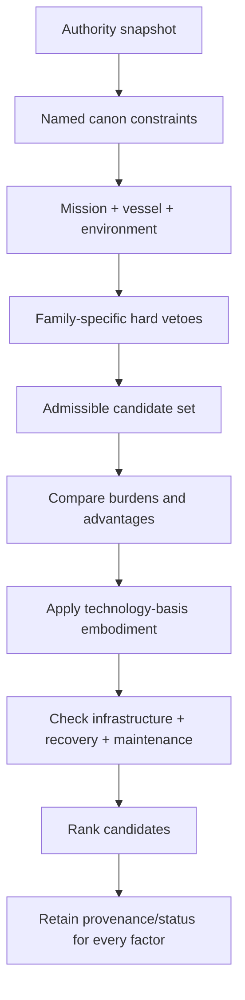
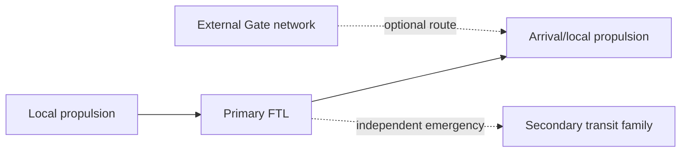
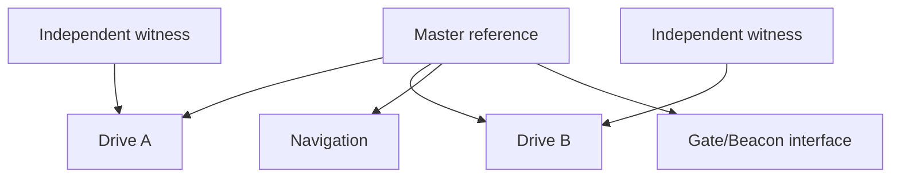

# Black Light FTL Cross-Family Integration Manual

**Status:** `MIXED` comparative engineering authority.  
**Primary authority:** `docs/blacklight/BLACK_LIGHT_PROPULSION_TRANSIT_AUTHORITY.md`.  
**Source anchor:** Google Drive document **The different lightspeed methods**, document ID `1e0Xp71EFubBZgXWjjvPxAqPoJIZNwqS6nu1-r7Kil7Y`.  
**Purpose:** compare established transit families without flattening their operators, inventing universal coefficients, or manufacturing race/manufacturer ownership.

---

## 1. What this layer does

The family volumes answer **how a particular drive works**. This manual answers a different question:

> Given a vessel, mission, environment, infrastructure state, technology basis, and known authority, which established transit families are admissible, what are their comparative engineering burdens, and what evidence permits choosing between them?

The answer is not a universal league table. A family may be superior on one route and unusable on another. The resolver therefore follows:



A family rejected by a hard safety or canon veto is not rescued by a favorable average score.

---

## 2. Authority discipline

The source order in the consolidated Propulsion & Transit Authority remains controlling. Specific named race, organization, manufacturer, vessel, installation, or technology canon outranks this manual. This manual does not establish that any race invented, owns, commonly uses, or prefers a particular drive unless a higher source says so.

Status vocabulary remains:

- `CONFIRMED`: directly recovered authority or current runtime behavior within scope.
- `DERIVED`: engineering consequence constrained by confirmed parents.
- `PROPOSED`: useful extension not independently established.
- `UNRESOLVED`: not recoverable or not yet established.
- `MIXED`: contains multiple statuses and must preserve field-level labels.

The comparative matrices below are mostly `DERIVED`. They summarize engineering consequences of established operators and family manuals. They are not setting-wide measured constants.

---

## 3. Family comparison matrix

| Family | Physical action | Relative infrastructure | Post-commit correction | Characteristic proof burden | Characteristic failure |
|---|---|---:|---|---|---|
| Metric Compression | local 4D metric deformation | low-moderate | high | field geometry, causal horizon, structure | asymmetry / recovery deficit |
| Gravitational-Plane | geodesic/shear-plane transit | low-moderate | moderate-high | terrain prediction and branch choice | shear fork / differential coupling |
| Slipstream Shear | Q-boundary-layer coupling | low-moderate | moderate | adhesion, Q-weather, exit correspondence | adhesion loss / boundary weather |
| Q-Lattice | indexed quantized Q-state translation | moderate | low | address, epoch, coverage | alias / epoch miss |
| N-Manifold | higher-dimensional geodesic + return projection | low-moderate | moderate | embedding, hidden obstacle inference, return map | topology/axis/return corruption |
| Fold-Jump | temporary topological adjacency | low-moderate | very low | endpoint covariance, occupancy, topology | bad endpoint / bifurcation |
| Wormhole Gate | maintained multiply connected topology | very high | route fixed by network | paired-mouth state, throat, chronology, traffic | desync / throat / network cascade |
| Phase Displacement | macroscopic nonlocal state mapping | moderate | very low | target compatibility, continuity invariants, provenance | alias / continuity / reconciliation |

### Interpretation

The matrix describes burden, not superiority. A Gate network may dominate scheduled freight between developed systems while being useless to an expedition whose destination has no mouth. Fold-Jump can be attractive for discrete long-baseline transfer but gives up meaningful post-commit steering. Metric systems may offer flexible continuous correction but pay continuously for field authority, sensing, structure, and recovery. Gravitational-Plane drives exploit natural terrain but inherit route dependence and terrain uncertainty.

---

## 4. Gravity tolerance is family-specific

The source document requires all methods to interact differently with gravity and gravitational lensing/shear conditions. The integration layer therefore forbids a single universal `gravityPenalty` scalar from deciding every family.

A common environmental state may be represented as

\[
\mathcal E_g = \{\Phi,\nabla\Phi,H(\Phi),R,\mathcal S,\Sigma_g\},
\]

but each family consumes different parts of it.

For Metric systems, gradients, curvature, tides, field symmetry and structural loading matter directly. For Gravitational-Plane systems, the same environment may contain usable route geometry and dangerous branch structure at once. For Slipstream, gravity can alter Q-boundary weather and exit correspondence. For Q-Lattice, gravity primarily contributes to address and reference uncertainty. For N-Manifold, it affects embedding and return-map conditioning. For Fold-Jump, it conditions topology candidates and endpoint covariance. For Gate systems, it affects anchor geometry, mouth state and chronology-safe operation. For Phase Displacement, it contributes to target-state uncertainty and compatibility.

Therefore:

\[
C_g^{(f)} = F_f(\mathcal E_g,\text{Path},\text{T-tier},\text{vessel},\text{installation})
\]

with a different function \(F_f\) for each family.

`DERIVED`: the formal notation is an integration model. The family-specific distinction is required by confirmed authority.

---

## 5. Cross-family safety envelope

A useful generalization of the source document's forward-sensing requirement is:

\[
H_f \geq \sum_i t_i^{(f)} + t_{margin}^{(f)}
\]

where \(H_f\) is the family-specific decision horizon and the time terms are the physically relevant detection, authentication, inference, solving, command, field/state transition, exit, re-embedding, recoupling, or recovery delays.

This is intentionally abstract. The family volumes instantiate it differently.

Examples:

- Metric: detect + solve + command + field + exit.
- Gravitational-Plane: detect + solve + command + recouple + exit.
- Slipstream: detect + forecast + solve + command + detach + exit.
- Q-Lattice: detect + authenticate + solve + commit/reject + recovery across valid epochs.
- N-Manifold: detect + infer + solve + command + re-embed + return.
- Fold-Jump: detect + authenticate + solve + cross-check + command + field **before commit**.
- Gate: detect + authenticate + synchronize + schedule + field + abort.
- Phase Displacement: detect + authenticate + model + cross-check + command + state preparation + recovery.

A generator that reports one generic `emergencyStopDistance` for every family has lost mechanism identity.

---

## 6. Comparative power and reserve doctrine

A cross-family generator may expose a normalized engineering decomposition:

\[
\mathcal P_f = \{P/E_{init},P/E_{hold},P/E_{sense},P/E_{compute},P/E_{control},P/E_{thermal},E_{recovery}\}_f,
\]

but it must not imply identical physics.

The invariant engineering rule is:

\[
R_f > 0 \quad \text{for every admitted transit event},
\]

where \(R_f\) is the family-specific protected recovery margin.

Examples include field unwind reserve, detach reserve, closure reserve, gate stabilization reserve, state reconciliation reserve, return-map recovery authority, or address rejection margin.

A schedule optimizer may spend discretionary energy. It may not spend protected recovery authority merely because a route score improves.

---

## 7. Scaling behavior

Drive scaling is not `power = k * mass`.

For a vessel with characteristic length \(L\), protected volume \(V\), effect-active area \(A\), distributed control count \(N_c\), sensor baseline \(B_s\), timing span \(\tau\), and structural demand \(S\), a generic engineering burden can be expressed as

\[
\mathcal B_f = F_f(L,V,A,N_c,B_s,\tau,S,\mathcal E,\text{Path}).
\]

Different families emphasize different terms.

### Metric

Large protected volumes, distributed field formation, timing span and structural asymmetry become dominant.

### Gravitational-Plane

Sensor baseline, sectional coupling and differential structural response grow in importance.

### Slipstream

Whole-hull adhesion coverage, timing coherence, boundary curvature and detach authority dominate.

### Q-Lattice

Protected-state coverage, epoch-clock coherence and state-buffer burden dominate.

### N-Manifold

Embedding coverage, active dimensionality, tomography and return-map conditioning dominate.

### Fold-Jump

Protected-volume boundary geometry, endpoint covariance and closure authority dominate.

### Gate

The ship may carry little transit machinery; scale moves into aperture cross-section, anchor plant, throat stabilization and traffic scheduling.

### Phase Displacement

Whole-object state coverage, invariant verification, target modeling and reconciliation burden dominate.

---

## 8. Infrastructure dependence

Infrastructure must modify specific burdens rather than grant magical bonuses.

| Infrastructure | Can legitimately improve | Cannot establish |
|---|---|---|
| gravimetric observatory | environmental covariance, terrain forecast | race ownership or guaranteed safe route |
| Q-weather station | slipstream forecast | universal Q stability |
| authenticated beacon | address/target/reference certainty | safe occupied endpoint |
| manifold survey array | hidden-obstacle/return-map model | perfect higher-dimensional knowledge |
| fold endpoint survey | endpoint covariance and exclusion confidence | post-commit steering |
| gate complex | repeatable aperture/network throughput | shipboard Gate capability |
| phase reference network | target-state and provenance quality | metaphysical identity proof |
| maintenance depot | calibration, repair, spare/recovery readiness | mechanism interoperability |

The generator must retain infrastructure freshness, source ancestry and uncertainty.

---

## 9. Signature comparison

Signature is a vector rather than a single stealth number:

\[
\mathbf S_f =
[S_{EM},S_{thermal},S_{grav},S_Q,S_{topology},S_{neutrino},S_{wake},S_{traffic},S_{recovery}]_f.
\]

Not every component applies to every family. Unknown components remain unknown.

A family may be quiet during cruise yet loud at commit or exit. Gate infrastructure may be continuously observable while an individual vessel crossing it emits relatively little dedicated drive signature. Slipstream wake history may expose traffic even after the ship has departed. Fold topology formation may produce a short high-information transient. Phase Displacement may concentrate signature into preparation, target lock, event and reconciliation.

The API should therefore return signature phases:

```json
{
  "pre_transit": {},
  "commit_or_entry": {},
  "cruise_or_maintained_state": {},
  "exit_or_recovery": {},
  "persistent_infrastructure": {}
}
```

---

## 10. Failure survivability model

Failure severity cannot be inferred solely from failure probability. The integration layer separates:

\[
R_{risk}=P_{fail}\times C_{consequence}\times X_{recoverability},
\]

where \(X_{recoverability}\) increases as recovery options diminish.

A family with a rare but nearly unrecoverable post-commit failure can rank worse for crewed transport than a family with more frequent but controllable precommit aborts.

Useful dimensions are:

| Dimension | Question |
|---|---|
| locality | does failure remain in one subsystem/sector or affect the whole transit state? |
| reversibility | can the installation safely return to a known state? |
| observability | is the defect detectable before commitment? |
| warning horizon | how much decision time exists? |
| dependency spread | can shared power/reference/cooling propagate failure? |
| externality | can failure harm infrastructure, traffic or remote endpoint? |

Gate network cascades and shared reference poisoning deserve special treatment because the failure may extend beyond one vessel.

---

## 11. Mixed-drive installations

Mixed installations are allowed only when their relationship is explicit.

Valid patterns include:



A vessel can use Gate infrastructure and still carry a separate shipboard drive. A vessel can carry an independent emergency transit family if mass, power, geometry, references and canon permit it. Two mechanisms may share cooling or power conditioning if their physical embodiments permit it.

But shared support introduces common-mode risk. If two nominally independent drives use one clock root, one sensor fusion model, one cooling loop or one authority database, their apparent redundancy can be false.

Define common-mode fraction

\[
\eta_c=\frac{N_{critical\ shared}}{N_{critical\ total}}.
\]

This is a `DERIVED` diagnostic, not a canon constant. High \(\eta_c\) should reduce claimed redundancy.

Forbidden shortcuts include:

- adding performance numbers from two drives;
- treating all Q-related mechanisms as interoperable;
- giving Fold-Jump Metric-style steering after commit;
- treating a Gate-compatible ship as a mobile Gate;
- using shared power architecture as proof of shared physics;
- assigning a race a hybrid simply because its technology basis could embody both.

---

## 12. Technology-basis translation

The seven operative bases remain end-effect translations, not cosmetic skins:

1. `TERRESTRIAL_ELECTROMECHANICAL`
2. `AQUATIC_ELECTROCHEMICAL_HYDRAULIC`
3. `CRYOGENIC_AMMONIA_HALOCARBON`
4. `GAS_GIANT_FLUIDIC_ELECTROSTATIC`
5. `BIOLOGICAL_SYMBIOTIC`
6. `MINERAL_PIEZOELECTRIC_PHOTONIC`
7. `FIELD_MEDIATED_POSTMATERIAL`

For each family, the generator must resolve at least:

```text
carrier -> structure -> sensing -> control -> service method
        -> thermal/recovery -> failure vocabulary -> signature embodiment
```

The same end effect can therefore produce radically different machinery.

A biological Fold installation may use grown topology-bearing tissue and distributed neural covariance sensing; a crystalline Fold installation may use prestressed resonant aperture structures; a terrestrial implementation may use precision rings, gravimetric arrays and superconducting distribution. None of those descriptions establishes which civilization actually owns the system.

---

## 13. Practical operator manual: selecting a transit mode

### CF-01 Mission planning

Before route selection, record:

1. authority snapshot and date/revision;
2. known installed/available transit families;
3. vessel geometry and current configuration;
4. Path maturity and shared T-tier;
5. departure, route and arrival environment;
6. infrastructure availability and freshness;
7. recovery reserve and maintenance state;
8. mission priority: time, stealth, throughput, autonomy, survivability, or infrastructure independence.

Run family-specific hard vetoes before ranking.

### CF-02 When the fastest candidate is not selected

Operators must expect the resolver to reject or down-rank nominal speed when:

- environmental uncertainty consumes safety horizon;
- endpoint/target evidence is not independent;
- whole-vessel coverage is incomplete;
- recovery reserve is insufficient;
- destination occupancy cannot be excluded;
- required gate/beacon/survey infrastructure is absent or stale;
- structural or thermal margins fail;
- the route would cross a family-specific commit boundary without adequate proof.

### CF-03 Emergency reroute

Do not translate another family's emergency procedure by vocabulary substitution. The resolver must invoke the installed family's actual recovery semantics.

Examples: Metric unwind is not Slipstream detachment. Slipstream detachment is not Gravitational-Plane recoupling. N-Manifold re-embedding is not Q-Lattice reject. Fold precommit abort is not postcommit steering. Gate throat closure is not vessel braking. Phase reconciliation is not ordinary navigation correction.

---

## 14. Practical maintenance manual: common support systems

### CF-M01 Shared clock/reference audit

If more than one transit system uses a common time/reference root, document the dependency graph.



A single master reference without independent witnesses creates a common-mode provenance failure.

### CF-M02 Shared power and cooling

A shared bus or heat sink must expose:

- maximum simultaneous transient;
- protected recovery allocation per family;
- isolation boundaries;
- thermal recovery time;
- failure propagation direction;
- manual isolation path.

Do not claim secondary-drive redundancy when primary-drive failure can starve its recovery reserve.

### CF-M03 Baseline signatures

Maintain family- and phase-specific signature baselines. Drift can reveal field-former imbalance, coupling loss, address-lock inefficiency, topology ringing, anchor wear, or reconciliation burden before a hard fault occurs.

Return-to-service requires evidence tied to the failed causal class, not merely a successful idle self-test.

---

## 15. Engineering education: why one scalar score is wrong

A first-year mistake is to define

\[
Q=w_vv+w_pp-w_cc
\]

and declare the highest-scoring FTL family best.

The problem is that safety constraints are not preferences. If Fold endpoint occupancy is unresolved, no positive speed weight should compensate. If a Gate mouth violates chronology protection, traffic demand is irrelevant. If Phase continuity proof fails, target proximity does not matter.

The correct structure is constrained optimization:

\[
\min_x J_f(x)
\]

subject to

\[
g_{f,k}(x)\le 0\quad \forall k
\]

and

\[
h_{f,j}(x)=0\quad \forall j.
\]

Only the feasible set may be ranked.

This distinction is central to the generator contract.

---

## 16. Advanced engineering: multi-objective Pareto selection

For admissible candidates define a vector

\[
\mathbf y_f=
[t_{route},E_{event},\sigma_{risk},S_{detect},C_{maint},I_{depend},R_{margin}].
\]

No single candidate necessarily minimizes every component. The resolver may expose the Pareto set:

\[
\mathcal P=\{f:\nexists g\text{ that dominates }f\}.
\]

This is useful when mission doctrine must choose between speed, independence, signature, maintenance and survivability.

The resolver should explain the trade rather than conceal it behind an opaque composite number.

---

## 17. Worked educational example

**Scenario:** a large exploration cruiser must reach an unsurveyed system. No Gate mouth exists. Remote gravimetry is moderate quality; Q-weather is poorly known; a nearby Fold endpoint has stale survey data; manifold observations are incomplete.

A valid resolver may conclude:

- Gate: hard veto — destination infrastructure absent.
- Fold: provisional veto — endpoint occupancy/covariance evidence stale.
- Slipstream: admissible only with large forecast uncertainty penalty.
- Gravitational-Plane: admissible if reconstructed terrain offers a stable route.
- Metric: admissible if structural/field margins pass.
- N-Manifold: admissible only if return-map conditioning and hidden-obstacle inference pass.
- Q-Lattice: depends on valid target addressing/epoch infrastructure.
- Phase Displacement: depends on target-state evidence and continuity/reference certification.

No result in that list assigns a race or manufacturer, and no family is universally declared fastest.

---

## 18. Generator/API contract

Recommended API:

```ts
resolveFtlCrossFamilyCandidates({
  authoritySnapshot,
  mission,
  vessel,
  environment,
  technologyBasis,
  pathLevel,
  sharedTier,
  infrastructure,
  constraints,
  mode
})
```

Return:

```json
{
  "candidates": [],
  "vetoes": [],
  "ranking": [],
  "selected": null,
  "provenance": {},
  "warnings": []
}
```

Each comparison factor should carry:

```json
{
  "value": "...",
  "status": "CONFIRMED|DERIVED|PROPOSED|UNRESOLVED",
  "source_ids": [],
  "parent_claims": [],
  "resolver_rule": "..."
}
```

### Selection modes

`AUTHORITY_ONLY`: do not fill gaps.

`LABELED_DERIVATION`: derive only when sufficient confirmed parents exist; preserve the rule and parent chain.

`LABELED_PROPOSAL`: may construct useful alternatives but cannot overwrite or masquerade as canon.

---

## 19. Provenance safeguards

The cross-family layer adds these explicit protections:

- Named canon always outranks default comparative assumptions.
- Ordinal labels such as `LOW`, `MODERATE`, or `VERY_HIGH` are derived comparative descriptors, not universal physical constants.
- Multiple observations sharing one root source do not count as independent confirmation.
- Infrastructure state carries freshness and ancestry.
- Technology basis changes embodiment, not ownership.
- Runtime prevalence does not become lore prevalence.
- A sample accident does not become history.
- A patent-class development example does not acquire an inventor, date, nation, species or manufacturer unless sourced.
- Family-specific hard vetoes are never averaged into a global score.
- Generated instance authority remains scoped to that instance and must retain authority snapshot, generator version, resolver decisions, scale coordinates and seed/provenance.

---

## 20. Canon-safe origin and historical depth

The technical corpus should feel old enough to have disciplines, schools, manuals, arguments and generations of refinements without inventing unsupported setting history.

The safe pattern is:

```text
CONFIRMED operator
    -> DERIVED research problem
        -> DERIVED instrument class
            -> PROPOSED teaching example / patent class
                -> UNRESOLVED inventor, date, institution, civilization
```

For example, Fold-Jump canon supports a long research tradition in endpoint covariance, finite protected volumes, occupancy exclusion and topology selection. That does not authorize naming the first civilization to solve those problems.

Likewise, Gate canon supports industrial disciplines in throat geometry, synchronization, traffic flux, chronology protection and anchor maintenance. It does not authorize manufacturing a historical gate-builder culture.

This distinction allows deep readable origin material while keeping authority honest.

---

## 21. Cross-family technical curriculum

### Introductory course: Comparative Transit Engineering I

Students learn mechanism identity, three scale coordinates, environment-specific burdens, hard-veto logic, and why equal travel times do not imply equal engineering.

### Advanced course: Transit Control and Recovery

Students compare continuous-control systems, discrete commit systems, infrastructure-mediated transit, return-map systems and state-mapping systems. Laboratory exercises require diagnosing the correct abort/recovery doctrine from telemetry without being told the family name.

### Graduate seminar: Provenance-Constrained Transit Design

Students receive partial race/manufacturer records and must design an installation without filling historical gaps. Marks are deducted for every unsupported ownership, inventor, performance constant or cultural claim.

### Maintainer certification

Technicians must demonstrate isolation of shared-support common-mode failures, family-specific signature interpretation, recovery-reserve verification and evidence-backed return to service.

---

## 22. Comparative design chart for authors and generators

| If the narrative/design emphasizes... | Examine first | But verify before selection |
|---|---|---|
| continuous maneuvering freedom | Metric, Gravitational-Plane | gravity/terrain/field margins |
| environmental riding | Gravitational-Plane, Slipstream | terrain/Q-weather predictability |
| discrete indexed transfer | Q-Lattice | address/epoch/coverage proof |
| deep geometric shortcuts | N-Manifold | return map/hidden obstacle risk |
| hard discrete jump | Fold-Jump | endpoint covariance/occupancy |
| industrial corridor economy | Gate | infrastructure, traffic, synchronization |
| nonlocal state transfer | Phase Displacement | target/continuity/provenance |

This is a design prompt, not a canon assignment table.

---

## 23. Completion state and next integration target

This manual provides the missing cross-family comparison and selection authority above the standalone family volumes while remaining subordinate to the consolidated Propulsion & Transit Authority.

The next coherent expansion is **race- and civilization-specific transit doctrine only where surviving canon exists**: recover actual named engineering traditions, manufacturers, vessels, operational practices and historical constraints; bind them to the family/basis models; and leave everything else explicitly unresolved. A second useful direction is runtime integration of this registry into the EXO generator so hard family vetoes and provenance-bearing comparison factors become executable rather than documentation-only.
