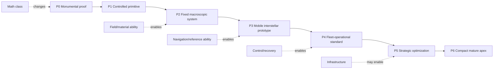
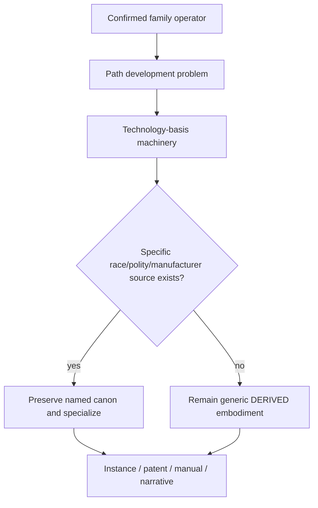

# Black Light FTL Development Lineage Manual

**Status:** subordinate engineering, historical-development, education, maintenance, and generator reference.  
**Primary authority:** `docs/blacklight/BLACK_LIGHT_PROPULSION_TRANSIT_AUTHORITY.md`.  
**Machine-readable source:** `data/exo-vessel/ftl-development-lineage-registry.json`.  
**Legacy design source:** Google Drive document **“The different lightspeed methods”**, file ID `1e0Xp71EFubBZgXWjjvPxAqPoJIZNwqS6nu1-r7Kil7Y`, retrieved revision `ANLCKQllC5h6dLaX5H1RpK8aUFVWsi-IV7gbMHUd0Qq7mIe5uGsLFi5_Hrsr8B6dl8t_ezB0fTSygxrnIBtifAHW79bgSbswp1zF3NaEil0`.

The legacy source explicitly requires different drive families to have different gravity coefficients, efficiency-loss behavior, miscalculation hazards, safety sensing, de-transit behavior, mathematical underlays, educational material, design documentation, thesis-level treatments, and alien patent-style incremental developments. This manual converts that requirement into a coherent development-history layer without pretending that newly reconstructed mathematics or patent histories are recovered canon.

Canon labels are mandatory. `CONFIRMED` identifies surviving authority. `DERIVED` is a constrained consequence. `PROPOSED` is an extension awaiting adoption. `MIXED` contains fields of different status. A race, polity, manufacturer, named vessel, or named installation may only receive a specific development lineage where higher authority supports that attribution.

---

## 1. Development is a change in solvable physics, not a speed multiplier

Every historical step must be expressible as

\[
\boxed{
\mathcal M_n
\rightarrow
\mathcal M_{n+1}
\rightarrow
\mathcal H_{n+1}
\rightarrow
\Delta\Lambda
\rightarrow
\Delta R
}
\]

where `M` is the mathematical class the civilization can solve, `H` is the machinery that can physically realize the new solution, `Λ` is the set of limiting terms, and `R` is the resulting operational envelope.

The common upgrade state remains

\[
U=(M,F,A,S,E,N,D,C,R,I)
\]

for mathematics, field control, active materials, structure, energy, navigation, distribution, control bandwidth, recovery, and infrastructure.

A valid higher-tier statement therefore looks like:

> P4 Fold-Jump gains additional reachable destinations because it can rank multiple endpoint-adjacency solutions under covariance and occupancy constraints, enabled by redundant topology solvers, better gravimetry and sectional field hardware.

An invalid statement is:

> P4 Fold-Jump has twice the range because it is P4.

---

## 2. Historical-development diagram



The exact physical machinery differs by technology basis. A terrestrial P3 Fold-Jump may use aperture rings, topology waveguides and optical clocks; a mineral P3 implementation may use prestressed crystal domains and photonic defect timing; a biological one may use field-bearing organs and cultivated sensory ganglia. Those are different embodiments of the same development problem.

---

## 3. Metric Compression Envelope: from perturbation to adaptive spacetime control

The primitive mathematical problem is merely to demonstrate

\[
\gamma_{ij}^{eff}=\gamma_{ij}+h_{ij},\qquad \|h\|\ll 1.
\]

P0 therefore needs only a stable measurable perturbation. P1 learns to make that perturbation directional. P2 closes the field around a moving three-dimensional payload. P3 adds causal-horizon constraints. P4 solves many field sectors continuously. P5 jointly optimizes field geometry and route through gravitational terrain. P6 performs receding-horizon adaptive re-solving in a compact package.

The useful route quantity remains

\[
D_{eff}=\int_\Gamma\sqrt{\gamma^{eff}_{ij}dx^idx^j}
\]

and the engineering goal is not simply to maximize `D0/Deff`; it is to minimize `Deff` while retaining field closure, structural margin, recoverability and a valid sensing/exit horizon.

### Practical equipment manual: P3 metric sector certification

1. Isolate one field sector and confirm no unintended cross-feed from adjacent emitters.
2. Verify timing references against at least two independent clocks or basis-equivalent references.
3. Sweep emitter phase through the certified low-energy calibration band and measure geometric response.
4. Compare predicted and measured hull strain; unexplained residuals invalidate the sector.
5. Exercise recovery sinks before high-energy spool.
6. Rejoin the sector only after closure simulation passes with the actual current vessel mass distribution.

A better emitter material can raise field authority; it cannot repair an incorrect tensor solution. A better solver can choose a more efficient tensor solution; it cannot exceed the field material's sustainable stress. Both mathematics and machinery must advance.

---

## 4. Gravitational-Plane Skimmer: the universe becomes the road

This family develops by learning progressively more of the existing gravitational landscape rather than overpowering it.

A useful route functional is

\[
J_g(\Gamma)=\int_\Gamma\left[1+a_g\chi_g+a_t\chi_t+a_u u_r+a_f p_{fork}\right]ds.
\]

P0 measures one fixed rail. P1 follows a local equipotential sheet. P2 solves moving multi-body barycentric geometry. P3 extends into weak interstellar shear/lensing planes. P4 treats candidate planes and forks as a route graph. P5 infers useful structure through incomplete mass maps. P6 continuously rewrites the geodesic plan as observations arrive.

The historical breakthrough at P3 is therefore primarily **instrumental and mathematical**: the civilization finally has gravimetry, clocks, baseline length and signal processing capable of seeing weak interstellar curvature far enough ahead to survive it.

### Fork mathematics

For branch probabilities `p_i`, define

\[
A_f=1-\max_i p_i.
\]

If the remaining time to the branch is

\[
t_f \le t_{detect}+t_{solve}+t_{command}+t_{field}+t_{exit},
\]

and ambiguity remains above the certified drive threshold, the correct action is emergency de-transit. No amount of crew confidence overrides that inequality.

### Technician note

A plane-skimmer that suddenly requires much more power may not have a failing power plant. It may be attempting to maintain coupling to a route whose underlying gradient solution has become poor. Diagnose geometry before replacing machinery.

---

## 5. Slipstream Shear: learning to remain attached to a moving boundary

The central state is

\[
X_Q=(q,\dot q,\phi_Q,v_{phase},A_{adhesion}).
\]

P0 observes boundary shear. P1 briefly matches small probes. P2 stabilizes a captive tunnel. P3 predicts a moving natural boundary well enough to carry a ship. P4 distributes adhesion control across the vessel. P5 forecasts Q-weather and selects routes strategically. P6 jointly estimates boundary state, adhesion and exit correspondence in real time.

The key historical pattern is that propulsion, navigation and meteorology converge into one discipline. Better field strength cannot compensate indefinitely for bad phase prediction; stronger adhesion can actually make a late emergency exit harder if the recovery system has not improved with it.

### Maintenance card: unexpected adhesion loss

Check, in order: local phase-reference disagreement; phase-skin continuity; Q-weather sensor disagreement; adhesion-actuator response; wake-damper reserve. If several adjacent regions lose adhesion simultaneously, assume a common boundary-state or reference error before assuming simultaneous hardware failure.

---

## 6. Q-Lattice Translation: from discovering addresses to navigating a graph of states

Represent the address space as

\[
\mathcal G_Q=(V_Q,E_Q)
\]

with a planned translation sequence

\[
P_Q=(q_0,q_1,\dots,q_n).
\]

P0 discovers stable addresses. P1 moves simple states between adjacent cells. P2 extends protected-state coverage to macroscopic payloads. P3 authenticates remote addresses and epochs through beacons. P4 searches multi-hop graphs autonomously. P5 optimizes network paths under uncertainty and trust. P6 performs compact continuous anti-alias estimation.

The major mechanical developments therefore cluster around clocks, phase cages, reference storage, anti-alias sensors and trusted infrastructure. The major mathematical developments cluster around graph reachability, epoch synchronization, uncertainty propagation and state-coverage proofs.

### Operator rule

Never substitute a spatial coordinate for an address. A destination that is geometrically correct but Q-address/epoch incorrect is not a near miss; it is the wrong translation target.

---

## 7. N-Dimensional Manifold: learning which shortcuts actually return home

The route length is

\[
D_N=\int_{\Gamma_N}\sqrt{g_{AB}dX^AdX^B},
\]

but the route is invalid unless the return projection remains acceptable:

\[
R_{return}:X_N\rightarrow x_{3+1}.
\]

P0 detects extra-dimensional structure. P1 enters one additional controlled axis. P2 carries macroscopic payloads through captive solutions. P3 solves moving shipboard origin and remote return. P4 searches several dimensional axes. P5 optimizes long-baseline routes jointly with gravity and return conditioning. P6 performs compact multi-axis optimization.

A central education point is that **shorter is not always better**. If route `A` has half the higher-dimensional length of route `B` but a badly conditioned return map, route `B` is the superior engineering solution.

A simple conditioning penalty can be represented as

\[
J_N=D_N+\lambda\,\kappa(R_{return}),
\]

where `κ` is a return-map condition measure and `λ` represents the civilization's certified tolerance policy.

---

## 8. Fold-Jump: the history of making two places adjacent

The family relation is

\[
G_F=\frac{d_M(A,B)}{d_{M'}(A,B)}.
\]

P0 proves microscopic adjacency. P1 maintains a finite cargo volume. P2 solves paired fixed endpoints. P3 places the origin machinery aboard a moving ship. P4 computes and ranks multiple remote adjacency solutions. P5 solves long-baseline endpoints under gravity/reference covariance. P6 continuously improves the solution until the last safe commit instant.

```text
P0                 P2                     P3-P6
LAB A ~ LAB B      GATE A === GATE B      SHIP A ~~~~~~~~~ DESTINATION B
fixed/fixed         fixed/fixed            moving/fixed-or-unprepared
microscopic         macroscopic            autonomous remote adjacency
```

The toroidal closed-boundary model previously discussed remains `DERIVED` unless a named implementation source confirms that exact geometry. The invariant is the topological adjacency function, not a mandatory torus-shaped machine.

### Practical commit checklist

Before `COMMIT`, certify origin-volume closure, destination occupancy exclusion, endpoint covariance, gravimetric distortion, reference authentication, recovery reserve, and topology-waveguide health. After `COMMIT`, the operator does not pretend to steer through ordinary space; control authority becomes execution monitoring and recovery.

### Example patent lineage (`DERIVED`)

- **Closed Fold-Volume Boundary Cage:** converts microscopic adjacency into finite protected-volume topology.
- **Paired Endpoint Authentication System:** makes long-range fixed folds repeatable and prevents correspondence substitution.
- **Moving-Origin Topology Solver:** permits shipboard Fold-Jump by continuously updating the origin boundary before commit.
- **Adaptive Precommit Adjacency Optimizer:** ranks multiple solutions under gravity, occupancy and reference covariance until the final safe commit instant.

These patent titles describe plausible historical inventions; they are not automatically setting-canon corporations, dates or inventors.

---

## 9. Wormhole / Gate Transit: from throat experiment to transportation civilization

The strategic equation is often

\[
t_{total}=t_{approach}+t_{queue}+t_{sync}+t_{aperture}+t_{departure}
\]

rather than a ship velocity.

P0 creates microscopic throats. P1 stabilizes finite cargo apertures. P2 synchronizes separated mouths. P3 solves high-throughput stellar-scale traffic. P4 turns individual gates into networks. P5 stabilizes deep strategic baselines. P6 makes the aperture itself adaptively self-stabilizing.

The most important technological breakthroughs can therefore occur off the ship: chronology-safe clocks, throat materials, traffic scheduling, reserve power, deep-space anchors, mouth-state telemetry and standardization.

### Gate engineering chart

| Failure observation | Likely domain | First diagnostic |
|---|---|---|
| throat radius oscillation | field/structure | sector phase and support stiffness |
| repeated synchronization refusal | references/navigation | mouth clocks and authenticated state |
| increasing queue despite healthy throat | infrastructure | scheduling and asymmetric traffic model |
| thermal recovery saturation | energy/recovery | mass-flow profile and dump plant |
| one mouth stable, one unstable | local environment | gravity/tidal conditions at unstable mouth |

---

## 10. Phase Displacement: from state transfer to identity-safe nonlocal transit

The mathematical object is not primarily path length but a map

\[
J:\Psi_A\rightarrow\Psi_B
\]

subject to compatibility and continuity invariants `C_k`:

\[
C_k(\Psi_A,\Psi_B)\le \epsilon_k.
\]

P0 transfers simple prepared states. P1 scales payload complexity. P2 formalizes macroscopic continuity constraints. P3 authenticates remote beacon-coupled target states. P4 infers viable unprepared targets. P5 operates over strategic baselines with imperfect observations. P6 continuously validates identity/continuity constraints until commit.

Its development history therefore depends heavily on sensing, state representation, reference provenance and error theory. Increasing energy without improving state knowledge merely allows a civilization to make larger mistakes faster.

---

## 11. Cross-family development comparison

| Family | P0 problem | P3 breakthrough | P5 strategic improvement | P6 mature constraint |
|---|---|---|---|---|
| Metric | measurable metric perturbation | causal-horizon-safe mobile envelope | joint route/field optimization | compact adaptive tensor control |
| Gravitic | detect/couple one rail | interstellar weak-shear navigation | infer routes under incomplete mass knowledge | adaptive geodesic rewriting |
| Slipstream | observe Q shear | mobile boundary prediction/adhesion | Q-weather strategic routing | compact joint boundary estimator |
| Q-Lattice | discover addresses | authenticated remote address/epoch | trusted network optimization | compact anti-alias state solving |
| N-Manifold | detect extra axes | moving origin + remote return | long-baseline geodesic/return optimization | compact multi-axis control |
| Fold-Jump | microscopic adjacency | moving-origin remote adjacency | gravity-conditioned long-fold solution | compact adaptive precommit solving |
| Gate | microscopic throat | high-throughput stellar complex | deep strategic throat | self-stabilizing aperture network |
| Phase | simple nonlocal mapping | vessel-scale authenticated target | long-baseline uncertain-state solution | compact identity-safe solving |

This table is useful for generator QA. If two families produce the same development story with nouns swapped, the output is wrong.

---

## 12. Race-, polity-, and manufacturer-specific history

Historical specialization resolves only after family and technology basis:



A generator may say that a biological civilization's P4 Fold-Jump plausibly improved by growing redundant topology-sensing ganglia and overlapping field organs if those are supported by its operative technology basis. It may not claim that a specific biological race invented Fold-Jump at a particular date, or even possesses Fold-Jump at all, unless a higher-authority source says so.

Manufacturer progression can be represented as a delta against the Path baseline:

\[
U_{maker}=U_{path}+\Delta U_{maker}
\]

but `ΔU_maker` must have provenance. A manufacturer famous for materials may improve `A` and `S`; a navigation house may improve `N` and `C`; neither automatically changes the underlying family mathematics.

---

## 13. Educational corpus architecture

Every mature family should eventually support five document levels.

**Level I — public primer.** What physical quantity the drive manipulates, what it visibly does, and why it is not interchangeable with other FTL.

**Level II — operator school.** Go/no-go logic, route interpretation, spool/commit/exit phases, signature recognition and emergency doctrine.

**Level III — maintainer qualification.** Eight-block machinery architecture, test equipment, tolerances, common failures, condition reporting and recertification.

**Level IV — engineering degree.** Mathematical operator, numerical methods, materials, field geometry, structural integration, sensing, controls, uncertainty and scaling.

**Level V — research/thesis corpus.** Unsolved mathematical problems, proof obligations, competing formulations, experimental results, patent history and civilization-specific schools of thought.

The generator should be able to render the same authoritative installation at any of these five reading levels without changing the facts.

---

## 14. Generator contract

A development-lineage request should resolve at minimum:

```json
{
  "family": "fold-jump",
  "path": "P4",
  "technologyBasis": "MINERAL_PIEZOELECTRIC_PHOTONIC",
  "specialization": null,
  "view": "maintenance-manual",
  "provenanceMode": "LABELED_DERIVATION"
}
```

The response must then provide:

1. the confirmed family operator and Path implementation name;
2. the mathematical ability newly available at that Path;
3. the physical enabler that makes the mathematics realizable;
4. the technology-basis embodiment;
5. changed distance/range/route behavior without arbitrary multipliers;
6. changed safety horizon, abort doctrine and failure anatomy;
7. maintenance and signature consequences;
8. any race/manufacturer specialization only when sourced;
9. field-level provenance labels.

No renderer may promote repeated generated material into `CONFIRMED` canon.

---

## 15. Provenance and origin discipline

The source chain for this manual is:

```text
specific named canon, where present
        ↓
BLACK_LIGHT_PROPULSION_TRANSIT_AUTHORITY.md
        ↓
recovered FTL archive + live Path implementation names
        ↓
The different lightspeed methods (legacy design requirements)
        ↓
mathematical/calibration/causality/environment registries
        ↓
family × technology-basis embodiment registry
        ↓
THIS development-lineage manual + machine registry
        ↓
generated educational/patent/manual views
```

The first three layers can contain `CONFIRMED` facts. The later layers are deliberately constrained engineering reconstruction. Their purpose is to make Black Light technology feel as though generations of mathematicians, mechanics, materials scientists, navigators, technicians, institutions and manufacturers have worked on it without falsely rewriting surviving canon.

---

## 16. Minimum acceptance test for future additions

A future FTL upgrade is incomplete unless a reviewer can answer all of these questions from the record: **What changed mathematically? What changed physically? Which limiting term moved? Why did distance, route availability or transit time improve? What new failure became possible? What old failure became easier to detect or survive? What maintenance practice changed? What signature changed? What source makes the claim authoritative, derived or proposed?**

If those answers are absent, the upgrade is flavor text rather than engineering history.
