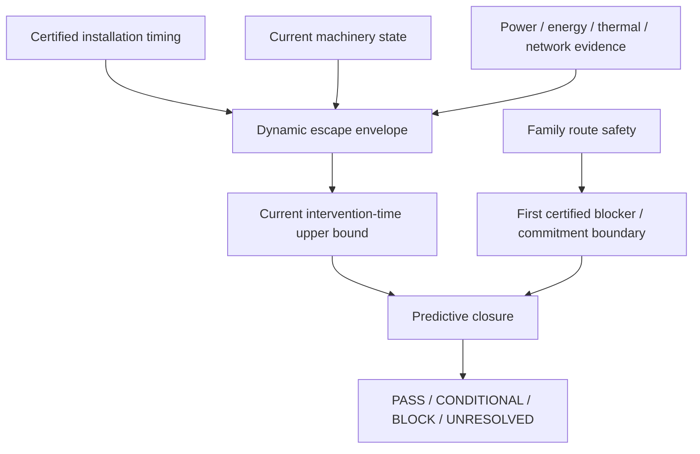
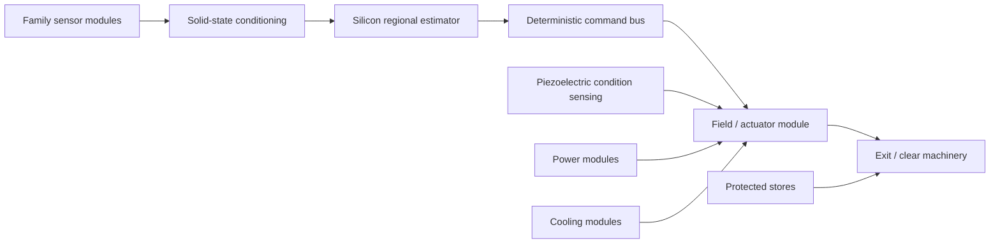
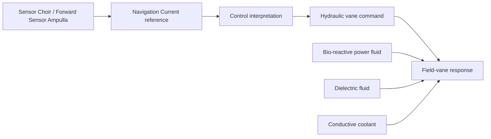

# Black Light FTL Dynamic Escape Envelope and Degraded-Response Engineering Manual

**Status:** derived engineering authority supporting the consolidated propulsion/transit authority.  
**Design-intent source:** *The different lightspeed methods*, Google Doc `1e0Xp71EFubBZgXWjjvPxAqPoJIZNwqS6nu1-r7Kil7Y`, revision `ANLCKQllC5h6dLaX5H1RpK8aUFVWsi-IV7gbMHUd0Qq7mIe5uGsLFi5_Hrsr8B6dl8t_ezB0fTSygxrnIBtifAHW79bgSbswp1zF3NaEil0`.  
**Primary machine authority:** `data/exo-vessel/ftl-dynamic-escape-envelope-registry.json`.  
**Runtime:** `blacklight-exo-ftl-dynamic-escape-envelope-runtime.js`.

---

## 1. Why a dynamic escape envelope exists

A certified ship may possess a documented emergency intervention time, but that number is only valid for the installation state that was certified. Battle damage, bus rerouting, converter loss, thermal saturation, reduced hydraulic pressure, field-vane impairment, shifted mass properties, or degraded actuator authority can increase the time required to complete the same emergency sequence.

The central rule is therefore:

\[
\boxed{t_{\mathrm{int,certified}}\neq t_{\mathrm{int,current}}\ \text{under arbitrary degraded state}}
\]

A current response certificate must be derived from physical evidence, not from a generic damage percentage.

The dynamic escape envelope answers:

> Given the ship as it exists now, how long can the complete emergency intervention actually take, and do protected power and thermal reserves remain sufficient for that response?

It does **not** decide where the route becomes unsafe. Route safety owns blocker geometry and family physics. It does **not** decide which family a species uses. Family authority owns that identity.

---

## 2. Authority separation

This separation prevents three common errors:

1. favorable route geometry being used to excuse a damaged ship;
2. healthy machinery being used to erase a route hazard;
3. technology or species identity being used to invent a transit family.

---

## 3. Intervention chain

The installation-level intervention chain remains:

\[
t_{\mathrm{int}}
=
t_{\mathrm{sensor}}
+t_{\mathrm{solver}}
+t_{\mathrm{decision}}
+t_{\mathrm{command}}
+t_{\mathrm{actuate}}
+t_{\mathrm{exit}}
+t_{\mathrm{clear}}
+t_{\mathrm{margin}}.
\]

For bounded stages:

\[
t_i\in[l_i,u_i],
\]

the conservative response burden is:

\[
\boxed{t_{\mathrm{int}}^{+}=\sum_i u_i}.
\]

A degraded-state model may increase a stage upper bound when physical evidence demands it. It may not reduce a certified stage below its baseline merely because a calculation produces a smaller theoretical number. Faster performance requires its own recertification evidence.

---

## 4. Network-path degradation

If the certified command path delay is \(\tau_0\) and damage or isolation forces a current path delay \(\tau_p\), only the excess delay should be charged against a baseline already containing \(\tau_0\):

\[
\boxed{\Delta\tau=\max(0,\tau_p-\tau_0)}.
\]

For a service path containing edges \(e\):

\[
\tau_p=\sum_{e\in p}\tau_e.
\]

The command-stage upper bound becomes:

\[
\boxed{t_{\mathrm{command,current}}^{+}
=
t_{\mathrm{command,certified}}^{+}+\Delta\tau}.
\]

This preserves the existing rule:

\[
\boxed{\text{reachable}\neq\text{timely}\neq\text{certified}}.
\]

---

## 5. Energy-limited field or actuator ramp

If an emergency field transition requires energy \(E_r\), and the net power actually available to that transition is \(P_n>0\), then a lower physical bound on completion time is:

\[
\boxed{t_r\ge\frac{E_r}{P_n}}.
\]

This is not a universal model of FTL field formation. It is an engineering constraint applicable only when the family-specific machinery authority establishes that an energy transfer of \(E_r\) through a power-limited channel is part of the exit sequence.

If \(P_n\le0\) while \(E_r>0\), that response path cannot complete under the stated state.

---

## 6. Force-limited translational response

For an ordinary approximately constant-force maneuver requiring velocity change \(\Delta v\):

\[
F\Delta t=m\Delta v,
\]

so:

\[
\boxed{t_{F}\ge\frac{m\Delta v}{F_{\mathrm{available}}}}.
\]

This model is directly relevant to Inertial Torch emergency avoidance and may be relevant to any family whose safe exit requires a known post-transition translational impulse.

It must not be used to manufacture an ordinary-space force model for a family whose exit mechanics are fundamentally field/topology based.

### 6.1 Braking closure

For constant usable deceleration \(a\), braking distance remains:

\[
d_{\mathrm{stop}}=\frac{v^2}{2a}.
\]

Including response latency:

\[
\boxed{d_{\mathrm{req}}^{+}=v^{+}t_{\mathrm{int}}^{+}+\frac{(v^{+})^2}{2a^{-}}}.
\]

The response delay therefore consumes real distance before braking begins.

---

## 7. Torque-limited rotational response

For an approximately constant torque and a required angular-velocity change \(\Delta\omega\):

\[
\tau\Delta t=I\Delta\omega,
\]

thus:

\[
\boxed{t_{\tau}\ge\frac{I\Delta\omega}{\tau_{\mathrm{available}}}}.
\]

This is useful where an exit, vane, emitter array, gate throat assembly, or post-transit vehicle must physically reorient.

A changed inertia tensor after cargo shift or refit can therefore alter an emergency response time even if the actuator hardware itself is unchanged.

---

## 8. Slew-limited control state

Many field, vane, valve, phase-reference, emitter, and power-converter systems are better represented by a maximum state-change rate than by force.

For required state change \(\Delta q\) and available slew rate \(\dot q_{\max}>0\):

\[
\boxed{t_q\ge\frac{|\Delta q|}{\dot q_{\max}}}.
\]

Examples include:

- field-former amplitude ramp;
- phase-reference retuning;
- hydraulic vane-angle change;
- aperture-control movement;
- converter output ramp;
- controlled detachment from a shear interface.

The variable \(q\) must retain the units and physical meaning defined by its machinery authority.

---

## 9. Protected-energy hold time

Let emergency load be \(P_L\), protected generation during the event be \(P_a\), and protected stored energy be \(E_b\).

The deficit is:

\[
P_d=\max(0,P_L-P_a).
\]

If \(P_d>0\):

\[
\boxed{t_{\mathrm{energy}}=\frac{E_b}{P_d}}.
\]

If:

\[
t_{\mathrm{energy}}<t_{\mathrm{int}}^{+},
\]

then the protected store cannot sustain the complete certified intervention.

Stored energy and peak power remain independent questions. A battery can contain enough joules and still be unable to provide the required watts through surviving converters and conductors.

---

## 10. Thermal hold time

For a short transient where a lumped model is valid:

\[
C_{th}\frac{dT}{dt}=P_{heat}-P_{reject}.
\]

For approximately constant terms and positive net heating:

\[
\boxed{t_{\mathrm{thermal}}
=\frac{C_{th}(T_{limit}-T_0)}{P_{heat}-P_{reject}}}.
\]

If \(P_{heat}\le P_{reject}\), this simple model does not impose a finite heating deadline.

If:

\[
t_{\mathrm{thermal}}<t_{\mathrm{int}}^{+},
\]

the installation cannot thermally sustain the complete intervention under the stated assumptions.

This approximation must not be extended through phase change, major flow-regime shifts, severe spatial hot spots, strongly temperature-dependent properties, or nonlinear radiative dominance without a stronger model.

---

## 11. Limiting reserve horizon

When both finite energy and thermal holds exist:

\[
\boxed{t_{\mathrm{hold,min}}=\min(t_{\mathrm{energy}},t_{\mathrm{thermal}})}.
\]

The reserve margin is:

\[
\boxed{M_R=t_{\mathrm{hold,min}}-t_{\mathrm{int}}^{+}}.
\]

Then:

- \(M_R<0\): block;
- \(M_R\ge0\): reserve is physically sufficient under the stated model;
- a conditional/advisory state may be used only when an explicit authority supplies the advisory margin.

No universal percentage reserve is invented.

---

## 12. Dynamic escape envelope

The dynamic escape envelope is the set of current physical states for which every required stage remains executable and every required reserve remains sufficient.

A useful abstract statement is:

\[
\mathcal E_{escape}
=
\{\mathbf x:\ t_i^{+}(\mathbf x)\ \text{is bounded for all required }i,
\ t_{hold,j}(\mathbf x)\ge t_{int}^{+}(\mathbf x)\ \forall j\}.
\]

The current vessel state \(\mathbf x_c\) is escape-capable only when:

\[
\boxed{\mathbf x_c\in\mathcal E_{escape}}.
\]

The runtime does not attempt to solve an arbitrary nonlinear envelope automatically. It evaluates supported physically declared constraints and preserves unresolved dimensions rather than manufacturing a smooth fictional surface.

---

## 13. Coupling to route-predictive closure

For a continuous projected-progress family, route authority supplies the conservative first-blocker distance \(D_B^{-}\). Predictive authority supplies a conservative upper progress rate \(v_p^{+}\) and prediction horizon \(H_P^{-}\).

Blocker encounter time is:

\[
t_B^{-}=\frac{D_B^{-}}{v_p^{+}}.
\]

Available response time is:

\[
\boxed{t_{available}^{-}=\min(H_P^{-},t_B^{-})}.
\]

The dynamic escape envelope supplies the current response burden:

\[
\boxed{M_T=t_{available}^{-}-t_{int,current}^{+}}.
\]

A ship that could escape when freshly certified may become unable to escape after losing a power converter or being forced onto a slower command path.

---

## 14. PRECOMMIT systems

Q-Lattice, N-Manifold, Fold Jump and Phase Displacement retain commitment semantics.

The dynamic escape authority supplies only \(t_{int,current}^{+}\). The family authority supplies the commitment deadline \(t_C^{-}\):

\[
\boxed{t_{available}^{-}=\min(H_P^{-},t_C^{-})}.
\]

No projected hull velocity is invented.

---

## 15. Wormhole/Gate systems

For portal systems, machinery response can include:

- rejecting admission;
- de-energizing or constricting an aperture;
- detaching a vessel from an admission fixture;
- closing a throat;
- switching to a protected synchronization/reference chain;
- clearing the mouth volume.

The family authority supplies admission and closure horizons. Dynamic escape supplies present machinery response burden.

---

## 16. Ar'nock degraded-response embodiment

The corrected Ar'nock baseline remains solid-state/electromechanical, silicon-computational, modular, ruggedized, and strongly piezoelectric.

A useful Ar'nock damaged-state investigation asks:

- Has a command route become longer?
- Has converter current/power authority fallen?
- Has piezoelectric alignment evidence changed?
- Has actuator slew rate changed?
- Has coolant rejection capacity fallen?
- Has module replacement changed calibration or timing?
- Has vessel mass/inertia changed after refit or damage control?

A module may still function nominally while the full emergency sequence has become slower than its original certificate.

Bioprinting remains a secondary support technology and is not inserted into ordinary command, compute, field-control or power-response models without a narrower source.

---

## 17. Zwlei Mur'rek degraded-response embodiment

Mur'rek machinery reaches the same abstract engineering questions through different equipment.

Relevant degraded-state measurements can include:

- hydraulic pressure and flow;
- field-vane travel or slew rate;
- vane symmetry;
- power-fluid delivery;
- dielectric-fluid state;
- coolant flow and heat rejection;
- Navigation Current reference agreement;
- Sensor Choir timing and quality.

The source term **gravitic slipstream** remains source terminology. It does not identify either the consolidated `gravitational-plane` or `slipstream-shear` family without a separate authority.

---

## 18. Failure taxonomy

| Code | Meaning |
|---|---|
| `DEE-TIMING-BASELINE` | required certified stage timing unavailable |
| `DEE-NETWORK-LATE` | surviving command route adds material excess delay |
| `DEE-POWER-RAMP` | required field/actuator energy cannot be transferred in the available time |
| `DEE-FORCE-AUTHORITY` | required translational impulse exceeds available force/time |
| `DEE-TORQUE-AUTHORITY` | required rotational impulse exceeds available torque/time |
| `DEE-SLEW-AUTHORITY` | required machinery state change exceeds current slew authority |
| `DEE-ENERGY-HOLD` | protected stored energy cannot sustain the response |
| `DEE-THERMAL-HOLD` | thermal reserve expires before response completes |
| `DEE-MODEL-UNKNOWN` | requested response model is unsupported or lacks authority |
| `DEE-PROVENANCE` | timing or machinery state lacks traceable evidence |
| `DEE-CANON-LEAK` | species/machinery identity was used to infer family physics |

---

## 19. Practical procedure DEE-01

1. Freeze the current installation configuration and capture service/refit provenance.
2. Retrieve the last certified intervention-stage timing.
3. Identify all rerouted command/data/power/cooling paths.
4. Measure or bound current path delays.
5. Identify the family-specific emergency action: detach, ramp down, field collapse, reject admission, reorient, brake, close, clear, or another sourced response.
6. Select only physically applicable response models.
7. Measure current force, torque, slew, power, energy and thermal capacity as required.
8. Compute a conservative upper bound for each affected stage.
9. Keep unaffected certified stages at their certified upper bounds.
10. Sum stage upper bounds to obtain \(t_{int,current}^{+}\).
11. Compute protected-energy and thermal hold horizons where required.
12. Block if any required physical path is impossible or if a hold horizon expires before intervention completes.
13. Send the resulting intervention bound to predictive route closure.
14. Preserve the complete source packets and equations used.
15. Do not promote a simulation-only result into operational admission.

---

## 20. Worked example: rerouted Ar'nock command and reduced field power

Suppose an Ar'nock installation has certified command time:

\[
t_{command,0}=0.300\ ms.
\]

Certified propagation inside that value was:

\[
\tau_0=40\ \mu s.
\]

Battle isolation forces a surviving route with:

\[
\tau_p=115\ \mu s.
\]

Thus:

\[
\Delta\tau=75\ \mu s,
\]

and:

\[
t_{command,current}=0.375\ ms.
\]

The exit field requires a documented transfer of:

\[
E_r=18\ MJ.
\]

Current protected net power to that hardware is:

\[
P_n=3\ MW.
\]

Therefore:

\[
t_{exit,power}\ge\frac{18\times10^6}{3\times10^6}=6\ s.
\]

If the certified exit-stage upper bound was 4.5 s, the dynamic upper bound becomes 6 s, not 4.5 s.

If all other stage upper bounds sum to 2.2 s:

\[
t_{int,current}^{+}=8.2\ s.
\]

If the first conservative blocker is reachable in only 7.6 s:

\[
M_T=7.6-8.2=-0.6\ s,
\]

and the vessel must be blocked from that transit state.

The route did not change. The ship did.

---

## 21. Worked example: energy reserve versus peak power

Suppose protected storage contains:

\[
E_b=90\ MJ,
\]

emergency load is:

\[
P_L=8\ MW,
\]

and surviving protected generation is:

\[
P_a=5\ MW.
\]

Then:

\[
P_d=3\ MW
\]

and:

\[
t_{energy}=30\ s.
\]

If intervention is 12 s, the energy quantity is sufficient.

But if the surviving converter path can deliver only 6 MW while an 8 MW stage is physically required, the response may still fail despite the 30 s energy hold. Joules and watts are not interchangeable certificates.

---

## 22. Worked example: thermal reserve

Let:

\[
C_{th}=4.0\times10^6\ J/K,
\]

\[
T_0=315\ K,
\qquad
T_{limit}=330\ K,
\]

\[
P_{heat}=7.0\ MW,
\qquad
P_{reject}=4.0\ MW.
\]

Then:

\[
t_{thermal}
=
\frac{4.0\times10^6(15)}{3.0\times10^6}
=20\ s.
\]

A 17 s emergency sequence remains inside this simplified short-transient limit; a 23 s sequence does not.

---

## 23. Generator requirements

Generated dynamic escape packets must:

- preserve family identity rather than infer it;
- preserve the certified baseline timing source;
- record current-state evidence separately from baseline certification;
- name the physical model used by each derived stage;
- retain units in source records even where normalized runtime fields are SI;
- keep missing required evidence unresolved;
- never replace missing force, power, thermal, torque or slew evidence with technology-tier defaults;
- never use race identity as a numerical response multiplier;
- preserve simulation-only status;
- provide enough provenance for another engineer to reproduce the bound.

---

## 24. Educational progression

### Transit Safety Engineering 101

Understand why emergency transit safety is a timing problem as well as a route problem.

### Transit Safety Engineering 320

Analyze sectional power, cooling, data and command paths and distinguish connectivity from timing.

### Transit Safety Engineering 540

Derive force-, torque-, slew-, power- and thermal-limited response bounds.

### Transit Safety Engineering 780

Combine route blocker geometry with predictive horizons.

### Transit Safety Engineering 790 — Dynamic Escape Envelopes and Degraded Response

Students must be able to:

1. reconstruct a certified intervention chain;
2. identify the physical source of degraded response;
3. select a justified equation rather than a heuristic penalty;
4. derive conservative current stage bounds;
5. calculate energy and thermal hold horizons;
6. preserve family semantics;
7. integrate current response burden into predictive closure;
8. distinguish operational evidence from simulation;
9. document enough provenance to support recertification.

---

## 25. Canon safeguards

\[
\boxed{\text{damage percentage}\not\Rightarrow\text{timing multiplier}}
\]

\[
\boxed{\text{technology tier}\not\Rightarrow\text{universal response multiplier}}
\]

\[
\boxed{\text{stored energy}\not\Rightarrow\text{sufficient peak power}}
\]

\[
\boxed{\text{surviving path}\not\Rightarrow\text{timely path}}
\]

\[
\boxed{\text{healthy machinery}\not\Rightarrow\text{safe route}}
\]

\[
\boxed{\text{route blocker}\not\Rightarrow\text{ship can escape it}}
\]

\[
\boxed{\text{species identity}\not\Rightarrow\text{FTL family}}
\]

These safeguards are mandatory in generators, manuals and generated prose.

---

## 26. Provenance close-out

A complete dynamic escape record should identify:

- baseline certificate ID and revision;
- installation identity;
- family authority if resolved;
- technology-basis authority;
- service/refit state;
- measurement timestamps where relevant;
- command/path topology used;
- power and reserve sources;
- thermal model and validity range;
- every stage model and its input evidence;
- current intervention upper bound;
- limiting constraint;
- simulation or operational status;
- downstream predictive-closure packet.

The objective is not merely to produce a number. The objective is to make the number auditable.