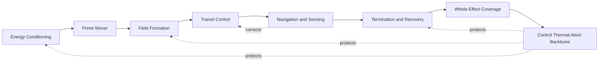
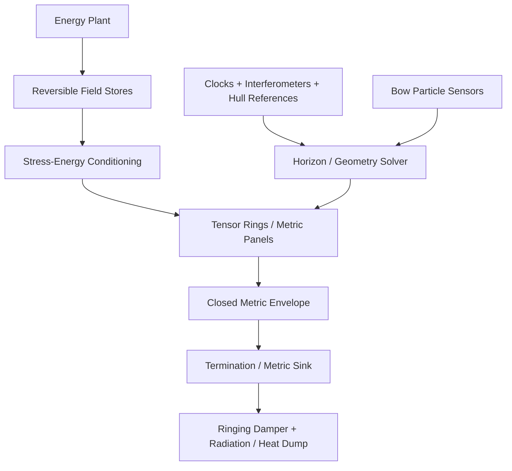
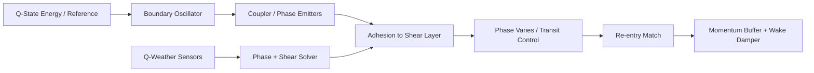
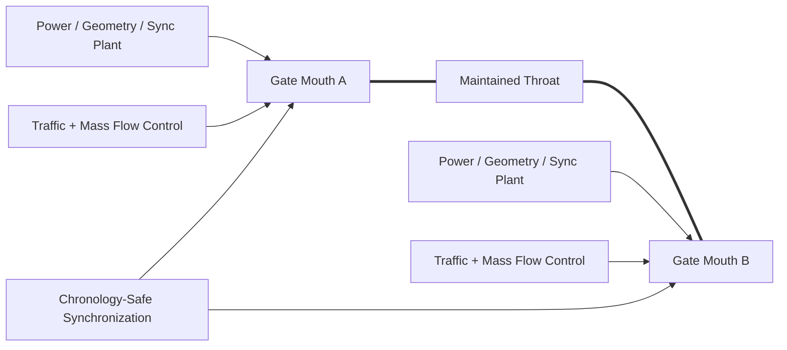
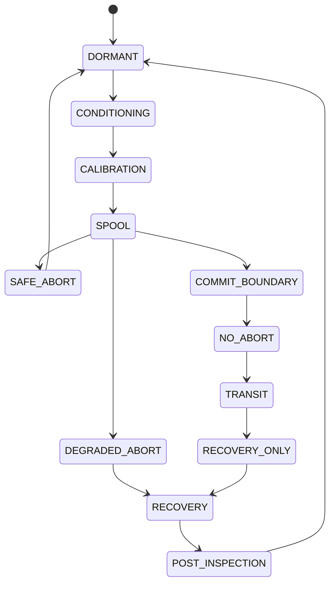
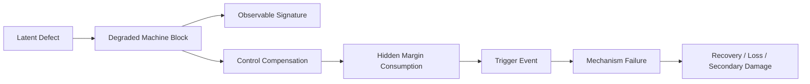
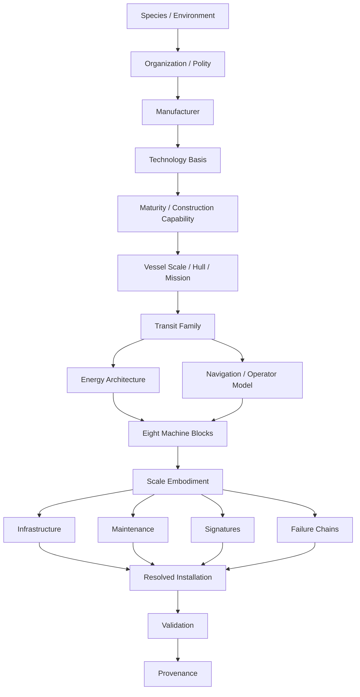

# Black Light FTL Engineering Field Manual

**Status:** subordinate technical, educational, and operational reference.

**Authority:** this manual implements and explains `docs/blacklight/BLACK_LIGHT_PROPULSION_TRANSIT_AUTHORITY.md`. It does not supersede race/species, organization, manufacturer, or named-technology canon. If this manual and the Propulsion & Transit Authority disagree, the Authority wins. If a specific surviving race/manufacturer source disagrees with either, the specific source wins.

**Canon labels used here:**

- `CONFIRMED` — directly recovered from surviving repository authority.
- `DERIVED` — engineering consequence constrained by confirmed canon.
- `PROPOSED` — coherent implementation aid not independently established as canon.
- `UNRESOLVED` — source, constant, procedure, or implementation remains unrecovered.

**Primary source chain:**

1. `docs/blacklight/BLACK_LIGHT_PROPULSION_TRANSIT_AUTHORITY.md`
2. `docs/blacklight/FTL_ENGINEERING_CATALOG_WORKING.md`
3. `docs/blacklight/FTL_TECHNOLOGY_BASIS_INTEGRATION_WORKING.md`
4. `data/exo-vessel/technology-basis-registry.json`
5. `data/exo-vessel/engineering-registry.json`
6. surviving race/species, polity, manufacturer, and named-system records

The current EXO technology-basis registry confirms seven operative machinery languages: `TERRESTRIAL_ELECTROMECHANICAL`, `AQUATIC_ELECTROCHEMICAL_HYDRAULIC`, `CRYOGENIC_AMMONIA_HALOCARBON`, `GAS_GIANT_FLUIDIC_ELECTROSTATIC`, `BIOLOGICAL_SYMBIOTIC`, `MINERAL_PIEZOELECTRIC_PHOTONIC`, and `FIELD_MEDIATED_POSTMATERIAL`. The EXO engineering registry separately defines P0–P6 conventional/relativistic propulsion bands. Those P0–P6 propulsion bands are not to be reinterpreted as FTL tiers.

---

## 1. What an FTL installation actually is

A Black Light FTL drive is not one machine. It is an **installation** whose parts collectively create, shape, navigate, sustain, terminate, and recover from a non-ordinary transit state.

The confirmed universal machine chain is:



The chain is functional rather than visual. A terrestrial vessel may embody it as banks, rings, buses, cryostats, computers, frame members, and sensor heads. A biological vessel may embody the same functions as metabolic organs, conductive tissues, mineralized field structures, vascular heat transport, sensory ganglia, and regenerative boundary tissue. A mineral vessel may use preloaded crystal domains, optical defect channels, phononic resonators, stress-distribution frames, and annealing structures. A postmaterial vessel may realize most of the chain as persistent field architecture supported by authenticated anchor matter.

A generator therefore must never ask only, “Which FTL drive does this ship have?” It must ask, “How does this civilization physically realize every necessary end effect of that drive?”

---

## 2. Confirmed transit families and engineering identity

| Family | Archive key | Confirmed physical action | What the engineer is fundamentally controlling |
|---|---|---|---|
| Metric Compression Envelope | `metric-envelope` | local metric deformation | geometry, envelope closure, horizon behavior, stored/radiative effects |
| Gravitational-Plane Skimmer | `gravitic-plane` | geodesic-plane transit with gradient correction | local mass geometry, plane adherence, gradients, emergence vector |
| Hyperspatial Slipstream Shear | `slipstream-shear` | Q-space boundary-layer coupling | boundary adhesion, shear state, Q-weather, phase velocity |
| Q-Lattice Phase Translation | `q-lattice` | indexed Q-state translation | address, phase epoch, lattice integrity, anti-alias state |
| N-Dimensional Manifold Drive | `n-manifold` | higher-dimensional geodesic projected into 3+1D | embedding, selected axes, topology, return map |
| Discrete Fold-Jump Drive | `fold-jump` | temporary topological adjacency | endpoint geometry, exclusion volume, adjacency solution, commit state |
| Anchored Wormhole / Gate Transit | `wormhole-gate` | maintained multiply connected topology | throat geometry, mouths, synchronization, flow, chronology-safe state |
| Quantum Phase Displacement | `phase-displacement` | macroscopic nonlocal state displacement | target-state compatibility, reference identity, continuity, exclusion |
| Relativistic Inertial Torch | `inertial-torch` | continuous causal acceleration | reaction/field propulsion; retained as precursor, not true FTL |

The family name says **what physical action is being attempted**. It does not dictate what the machine looks like.

---

## 3. Drive burden and scaling mathematics

The archive supplies vessel scale bands but does not establish one universal canonical energy equation for all FTL. Quantitative formulas below are therefore `PROPOSED` engineering estimators unless explicitly promoted later.

### 3.1 Installation burden

Define a non-dimensional engineering burden index:

\[
B = K_f\left(\frac{M}{M_0}\right)^{\alpha_f}
\left(\frac{V_p}{V_0}\right)^{\beta_f}
C_g C_e C_d C_r
\]

where:

- \(K_f\) is the transit-family burden coefficient;
- \(M\) is translated mass;
- \(V_p\) is protected/effected volume;
- \(C_g\) is a geometry penalty;
- \(C_e\) is an environmental penalty;
- \(C_d\) is a damage/degradation penalty;
- \(C_r\) is a reference/navigation uncertainty penalty;
- \(M_0,V_0\) are calibration references;
- \(\alpha_f,\beta_f\) are family-specific scaling exponents not yet canonical.

This is deliberately a **burden** equation rather than a literal energy law. It lets a generator reason about what must grow as a ship grows without falsely claiming recovered numerical physics.

### 3.2 Coverage margin

For any drive that must enclose a payload in a valid effect:

\[
\mu_c = \frac{V_{valid}-V_{required}}{V_{required}}
\]

A positive \(\mu_c\) means the valid effect exceeds the required payload envelope. A negative value means some portion of the vessel, appendage, cargo, or projected mass state lies outside certification.

A practical generator status can be:

- `GREEN` if \(\mu_c\) exceeds manufacturer reserve;
- `AMBER` if positive but below preferred reserve;
- `RED` if \(\mu_c < 0\).

Thresholds are manufacturer- and family-specific and remain `UNRESOLVED` unless a source provides them.

### 3.3 Recovery margin

\[
\mu_r = \frac{E_{recovery,reserve}}{E_{recovery,required}}
\]

This does not imply that all recovery is purely energetic. `E` here may be a generalized recovery resource transformed into comparable engineering units: stored electrical/field energy, metabolic reserve, phase-change capacity, Q-state condensate, mechanical strain capacity, or authenticated state reserve.

The central rule is simple: a vessel that can enter an exotic state but cannot guarantee exit is not operationally complete.

### 3.4 Navigation covariance

Let the solved terminal state be represented by vector \(x\) and its uncertainty covariance by \(\Sigma_x\). A generic confidence measure can be built from a family-specific weighting matrix \(W\):

\[
C_{nav}=\exp\left[-\frac{1}{2}\operatorname{tr}(W\Sigma_x)\right]
\]

The exact state vector varies by family. Fold-jump may weight endpoint position, local curvature, destination occupancy, and relative velocity. Slipstream may weight normal-space correspondence, Q-phase velocity, adhesion, and boundary shear. Manifold systems may weight embedding and return-map validity more heavily than ordinary Cartesian position.

### 3.5 Tidal/mechanical safety

A generic relativistic check uses geodesic deviation:

\[
\frac{D^2\xi^\mu}{D\tau^2}=-R^\mu{}_{\nu\alpha\beta}u^\nu\xi^\alpha u^\beta
\]

For generator purposes, the important output is not the tensor itself but the predicted **differential acceleration across the protected structure** and whether it lies inside hull, crew, cargo, tissue, crystal, or field tolerances.

---

## 4. Physical installation anatomy by technology basis

### 4.1 Terrestrial electromechanical

**DERIVED from confirmed basis semantics.**

Typical visible installation: separated machinery spaces, structural frames, high-energy buses, cryogenic or thermal-control trunks, replaceable field modules, sensor arrays, control cabinets, isolation hardware, pressure vessels, superconducting or metamaterial assemblies, service corridors, and emergency dump systems.

A metric-envelope installation may use distributed tensor-emitter rings or panels connected to reversible field stores and protected high-current buses. A fold-jump installation may concentrate massive aperture rings around a certified volume. A Q-lattice system may look less like an engine and more like a shielded phase-reference laboratory wrapped around a projector array.

Maintenance culture favors measurement, component serial tracking, replacement, calibration, insulation testing, coolant purity, quench protection, connector integrity, structural alignment, and controlled software/configuration authority.

### 4.2 Aquatic electrochemical-hydraulic

**DERIVED.**

The engineering assumption is not “electronics underwater.” The inhabited and machinery working medium is integrated into the design. Pressure, ionic concentration, electrochemistry, dissolved gases, wet superconductive surfaces, hydraulic state, and chemistry may themselves carry power and control information.

A field-forming structure may be a pressure-balanced immersed manifold whose geometry changes by controlled fluid displacement. Energy buffering may be electrochemical and hydraulic rather than capacitor-like. A navigator may read gradients through distributed wet sensors rather than isolated dry cabinets.

Service actions include chemistry sampling, ion balance, contamination removal, dissolved-gas management, seal inspection, cavitation characterization, pressure cycling, microbial/fouling control where relevant, and galvanic compatibility.

### 4.3 Cryogenic ammonia-halocarbon

**DERIVED.**

A cryogenic civilization may build the installation around cold dimensional stability, superconductivity, controlled contraction, phase-change heat buffering, photonic timing, and solvent-compatible machinery.

This technology basis changes the question from “how do we cool the FTL drive?” to “which operating geometry exists only while the drive is cold?” Structural alignment may intentionally become correct at operating temperature rather than room-temperature fabrication temperature.

A warm drive can therefore be physically intact and still be grossly misaligned.

Maintenance emphasizes contamination exclusion, controlled warmup/cooldown, seal chemistry, contraction maps, superconductive transition monitoring, solvent purity, phase-change buffer condition, and optical timing paths.

### 4.4 Gas-giant fluidic-electrostatic

**DERIVED.**

Typical machinery is distributed across membranes, tension webs, charged skins, pressure cells, ionic/electrostatic flow structures, buoyant equipment bodies, and acoustic/fluidic logic. A “ring” may be a maintained toroidal pressure/current pattern rather than a machined metal torus.

Field geometry can be changed by altering membrane tension, charge distribution, pressure, and flow topology. This makes structural mechanics, electrostatics, and control inseparable.

Maintenance emphasizes leak localization, membrane patching, charge bleed, acoustic timing, pressure equalization, flow contamination, tension mapping, and electrostatic discharge paths.

### 4.5 Biological symbiotic

**DERIVED.**

A biological FTL installation is a living subsystem, not a conventional drive hidden in flesh. Its machine blocks may map to specialized organs:

```mermaid
flowchart LR
    A[Metabolic / Symbiont Energy Organs] --> B[Exotic-State Induction Organ]
    B --> C[Field-Bearing Dermis / Mineralized Rings]
    C --> D[Neural / Hormonal Transit Regulation]
    D --> E[Sensory Ganglia / Bonded Navigator]
    E --> F[Quench / Reintegration Tissue]
    F --> G[Whole-Hull Living Boundary]
    G --> H[Vascular Cooling / Immune / Abort Reflex]
```



Large vessels do not merely possess a larger “warp organ.” Scaling may require branching circulation, multiple synchronized induction lobes, redundant sensory clusters, distributed field-bearing dermis, repair stem zones, larger symbiont populations, or growth around structural load paths.

Maintenance is clinical and ecological: nutrition, endocrine balance, microbiome/symbiont state, imaging, biopsy, grafting, infection control, scar management, mineral balance, regeneration, sleep/recovery cycles, neural synchronization, and behavioral stress.

### 4.6 Mineral piezoelectric-photonic

**DERIVED.**

The installation may consist of pressure-grown crystal masses with controlled axes, embedded optical defect channels, phononic resonators, preload frames, strain-transfer interfaces, and domain-boundary control.

Power may enter as strain, polarization, thermal gradients, optical energy, or coupled field energy. Control may be performed by stress patterns and light rather than electromechanical actuators.

The functional equivalent of calibration becomes a resonance map. Damage is not only “cracked/not cracked”; tiny flaws, domain inversion, preload loss, defect migration, and optical contamination can alter global behavior.

Maintenance uses flaw tomography, polarized/phase imaging, preload measurement, controlled annealing, surface regrowth, domain reorientation where permitted, resonance sweeps, and optical-channel cleaning.

### 4.7 Field-mediated postmaterial

**DERIVED.**

The mature installation is predominantly a persistent engineered state supported by material anchors, authenticated references, reserve matter, and fallback structures. Its visible hardware may be sparse, but this does not mean the system is simple or invulnerable.

Its principal service burden is epistemic and state-based: prove that the present field is the intended field; prove its references have not drifted; prove its authorized topology and control state; prove fallback matter can reconstruct a known-safe configuration.

Maintenance includes reference authentication, coherence measurement, topology comparison, hostile-state detection, anchor replacement, fallback simulation, reserve inventory, state rollback tests, and safe-model re-instantiation.

---

## 5. Family-specific equipment maps

The following maps combine `CONFIRMED` archive machinery with `DERIVED` functional interpretation.

### 5.1 Metric Compression Envelope

**Confirmed machinery examples:** vacuum cells, reversible field stores, protected buses, Casimir lattices, Q-condensate cells, stress-energy containment, tensor emitter rings, stress waveguides, active supports, printed metric panels, optical clocks, interferometers, hull-strain references, plasma mirrors, radiation stores, bow-particle sensors, reversible metric sinks, ringing dampers, horizon solvers, cryogenic loops, passive dumps.



**Engineer’s core variables — DERIVED:** envelope closure error, gradient across protected volume, horizon proximity, bow accumulation, structural strain, local metric perturbation, stored recovery burden.

**Scaling:** larger hulls require greater field-surface area and increasingly segmented emitter control. Capital vessels should generally favor distributed sectors and local compensation because hull flex, moving cargo, battle damage, and internal reconfiguration make one idealized rigid envelope unrealistic.

**Signature expectation — DERIVED:** pre-entry field-energy buildup and clock/interferometric anomalies; active gravitational/optical distortion; termination radiation/field ringing; thermal recovery load afterward.

### 5.2 Gravitational-Plane Skimmer

**Confirmed machinery examples:** bidirectional reactive stores, superconducting buses, mass-gradient resonators, tensor cells, containment rings, distributed gravitic tiles, local buffers, active reference frames, inertial nodes, atom interferometers, optical clocks, gradiometers, geodesic solvers, certified ephemerides, transition coils, field shutters, compensation frames, timing systems, cooling, heat stores, passive release elements.

Core operating concept: the ship does not demand arbitrary straight-line transit. It finds and rides a useful geometric condition associated with gravitational/equipotential structure.

**DERIVED control errors:** plane-normal displacement, gradient overload, barycentric-model residual, ridge probability, compensation demand, emergence-vector covariance.

A skimmer’s “route map” therefore looks more like a dynamic gravitational weather chart than a highway map.

### 5.3 Hyperspatial Slipstream Shear

**Confirmed machinery examples:** Q-condensate stores, vacuum cells, phase references, Q-resonators, boundary oscillators, containment shells, phase emitters, Q-waveguides, geometry mounts, adhesion coils, phase vanes, Q-weather interferometers, forward probes, wake samplers, momentum buffers, field shutters, printed phase skin, local reference tiles, phase solvers, timing links, coolant loops, wake dampers.



The operator is principally maintaining **adhesion and correspondence**, not simply selecting velocity.

### 5.4 Q-Lattice Phase Translation

**Confirmed machinery examples:** Q-condensate stores, phase references, reversible buffers, quantum tomography, optical clocks, protected state memory, optical/quantum address solvers, immutable route stores, Q-projector coils, state-coupling plates, residual detectors, Q-waveguides, lattice resonators, defect-correction cells, state amplifiers, normal-space projectors, phase shields, synchronized boundary clocks, continuity samplers, immutable logs, quarantine locks.

The central engineering object is an authenticated destination **address + epoch**, not merely a coordinate.

**DERIVED simplified state key:**

\[
A_Q = \{q_1,q_2,\ldots,q_n,t_\phi,R\}
\]

where \(q_i\) are resolved lattice indices, \(t_\phi\) is phase epoch, and \(R\) is the authenticated reference context.

An aliasing error may be tiny in ordinary coordinate space yet catastrophic in lattice state.

### 5.5 N-Dimensional Manifold Drive

**Confirmed machinery examples:** Q-condensate and vacuum cells, axis references, multi-axis interferometers, topology sensors, deployable probes, axis resonators, topology metamaterials, gradient cells, quantum geodesic solvers, topology libraries, clocks, multi-axis field coils, geodesic vanes, projection rings, orientation references, topology clamps, embedding panels, topological seals, phase bridges, topology monitors, timing links, coolant loops, passive return elements.

A useful `PROPOSED` abstraction is to solve a geodesic \(\gamma\) in an accessible manifold \(\mathcal{M}_N\):

\[
\gamma^* = \arg\min_{\gamma \in \mathcal{A}} \int_\gamma ds_N
\]

subject to valid origin embedding, allowed dimensional axes, hull coherence constraints, topology exclusions, and a certified return projection into 3+1D.

The difficult part is not merely finding a shorter route. It is proving the vessel can enter and leave the chosen embedding intact.

### 5.6 Discrete Fold-Jump Drive

**Confirmed machinery examples:** vacuum cells, metric-tension stores, reversible converters, precision ranging, gravimetry, authenticated beacons, topological solvers, optical clocks, immutable geometry stores, metric aperture rings, topology waveguides, active supports, high-toughness recoil framing, occupancy lidar, field probes, independent abort logic, closed fold-volume panels, boundary references, isolation mounts, metric sinks, ringing dampers, heat stores, coolant loops.

A `PROPOSED` solution vector can be represented as:

\[
J=J(x_o,u_o,x_d,u_d,\mathcal{G}_o,\mathcal{G}_d,O_d,M,V_p,t)
\]

where \(\mathcal{G}\) summarizes local geometry, \(O_d\) destination occupancy state, \(M\) translated mass, and \(V_p\) protected volume.

Fold-jump is operationally distinguished by its commitment boundary. After the topology solution is committed, “steering” is generally not the correct mental model.

### 5.7 Anchored Wormhole / Gate Transit

The ship is not required to carry the full strategic transit apparatus. Extreme machinery may reside in the gatework.



The strategic consequences are infrastructure-rich: gate siting, customs, throughput limits, scheduling, interdiction, sabotage, political monopoly, stranded systems, convoy timing, and alternate-route planning.

### 5.8 Quantum Phase Displacement

The vessel is treated as a macroscopic state requiring a compatible nonlocal target.

**DERIVED validation set:** target occupancy, reference authenticity, conservation bookkeeping, biological phase compatibility, mutable software state, continuity record, residual-state detection, duplicate-state exclusion, quarantine status.

This family should produce the most rigorous provenance and continuity logging of the shipboard methods because identity and terminal state are directly entangled with the engineering problem.

---

## 6. Operating manual — universal certification cycle

The following is a `DERIVED` generic procedure. A surviving manufacturer procedure always overrides it.

### Phase 0 — authority check

Before touching the machine, identify the exact installation, manufacturer, transit family, technology basis, maturity, current configuration, last certified state, software/biological/crystalline reference revision, and source authority.

No operator should apply a generic fold procedure to a manufacturer-specific slipstream unit simply because both are colloquially called “jump drives.”

### Phase 1 — dormant inspection

Confirm:

- complete effect coverage geometry;
- no unlogged hull, cargo, appendage, tissue, crystal, field-node, or pressure-boundary changes;
- energy and recovery reserve;
- working-medium condition;
- navigation and time/phase references;
- route/destination authority;
- thermal capacity;
- isolation and abort chain;
- current maintenance status;
- no unresolved latent-failure indication.

### Phase 2 — basis conditioning

Terrestrial systems energize, cool, align, and bring field hardware to reference state. Aquatic systems equalize chemistry and pressure and validate wet control paths. Cryogenic systems descend through certified thermal plateaus and contraction checkpoints. Gas-giant systems establish pressure, tension, charge, and flow topology. Biological systems establish metabolic, neural, endocrine, vascular, symbiont, and field-bearing tissue readiness. Mineral systems establish preload, optical-path integrity, domain alignment, and resonance. Postmaterial systems authenticate state, topology, anchors, reserves, and rollback condition.

### Phase 3 — actual-vessel characterization

Do not use blueprint mass and geometry if the actual ship can be measured. Reconcile current mass distribution, cargo, tanks, crew, embarked craft, open or deployed structures, hull deformation, damage, temporary repairs, thermal state, and external field environment.

The FTL solution is for the ship that exists **now**.

### Phase 4 — route/reference solution

Each family must solve its real state variables. For example:

- metric: field geometry, route perturbations, horizon/radiation conditions;
- gravitic: mass model, plane, ridges, gradient, emergence vector;
- slipstream: Q-weather, shear, adhesion, correspondence;
- Q-lattice: address, phase epoch, reference authenticity;
- manifold: axes, embedding, topology, geodesic, return map;
- fold: endpoint geometry, occupancy, relative state, adjacency;
- gate: mouth identity, throat, synchronization, throughput;
- displacement: compatible state, occupancy, continuity, conservation.

### Phase 5 — low-power proof

Where mechanism permits, excite the installation below commitment and compare observed response with the certified model. The exact form may be a field symmetry check, pressure response, biological reflex, resonant mode, optical phase return, Q-response, or authenticated state transition.

### Phase 6 — spool

Raise stored energy/state and effect formation toward operational condition. Continuously re-evaluate coverage, navigation confidence, recovery margin, control synchronization, and basis health.

### Phase 7 — commit decision

A valid commit decision requires independent satisfaction of:

\[
V = C_{coverage} \land C_{navigation} \land C_{mechanism} \land C_{basis} \land C_{recovery} \land C_{exclusion}
\]

where each predicate is resolved by the actual family/manufacturer. The formula is logical, not a claim that all civilizations use Boolean computers.

### Phase 8 — transit

Monitor the mechanism’s actual control variables. Generic “drive power percentage” is insufficient.

### Phase 9 — termination/recovery

Recover ordinary operating state while explicitly disposing of or reconciling stored field energy, momentum mismatch, structural recoil, radiation, wake, topological ringing, phase residuals, thermal load, metabolic debt, lattice strain, or state drift as applicable.

### Phase 10 — post-transit certification

Record expected versus actual terminal state. Preserve event logs and immutable references. Run basis-specific inspection. Quarantine any unexplained residual. Recertify before repeated strategic transit.

---

## 7. Abort-state manual

Every generated drive must expose a state machine similar to:



The names are shared vocabulary; exact transitions are family-specific. A fold system may cross `COMMIT_BOUNDARY` abruptly. A metric envelope may retain controlled termination during much of transit. A gate user may have no meaningful shipboard abort after entering the throat, while the gate complex may retain flow-control and emergency throat-management actions.

The generator must therefore provide `abortState`, `availableActions`, `forbiddenActions`, and `expectedConsequences`, not merely `canAbort=true/false`.

---

## 8. Maintenance manuals by basis

### 8.1 Terrestrial electromechanical

**Inspection:** insulation resistance; bus integrity; cryostat pressure/vacuum; coolant purity; field-module alignment; connector torque/locking; structural frame strain; clock/reference calibration; quench detectors; emergency dump path.

**Latent-failure clues:** increasing quench frequency, asymmetric field response, unexplained thermal rise, repeated timing correction, insulation partial discharge, alignment drift, vibration harmonics, intermittent sensor disagreement.

**Depot-only work:** replacement or re-registration of primary field rings; opening high-energy containment; recalibration against strategic references; destructive inspection of protected buses.

### 8.2 Aquatic electrochemical-hydraulic

**Inspection:** working-fluid chemistry; ion gradients; dissolved gases; pressure-cell integrity; cavitation margin; wet-mate interface condition; fouling; seal chemistry; valve timing; galvanic state.

**Latent-failure clues:** gas nucleation, pressure oscillation, ionic drift, electrode discoloration, biofilm/fouling change, slow manifold response, unexpected local heating, acoustic change.

### 8.3 Cryogenic ammonia-halocarbon

**Inspection:** contaminant concentration; thermal plateau behavior; contraction reference; superconductive margin; phase-change stores; photonic timing; seal elasticity at operating temperature; vacuum jacket integrity.

**Latent-failure clues:** increased cooldown time, asymmetric contraction, unexpected transition to resistive state, frost/contaminant deposition, phase-store early exhaustion, timing drift during temperature change.

### 8.4 Gas-giant fluidic-electrostatic

**Inspection:** membrane tension; pressure differential; charge map; ion density; acoustic timing; buoyancy-cell state; web attachment; discharge paths; flow topology.

**Latent-failure clues:** singing/beat frequencies, charge hot spots, creep in membrane shape, pressure lag, local eddies, repeated corona events, anomalous acoustic damping.

### 8.5 Biological symbiotic

**Inspection:** metabolic reserve; circulation; electrolyte balance; symbiont population; immune markers; endocrine state; tissue conductivity; field-organ imaging; neural synchronization; regenerative reserve.

**Latent-failure clues:** local necrosis, scar formation, behavioral avoidance of spool state, abnormal hormone spikes, sensory desynchronization, reduced regeneration, fever/thermal asymmetry, mineral depletion, arrhythmic field response.

**Critical rule:** a living drive cannot be treated as disposable machinery without regard to whether setting canon recognizes it as animal, symbiont, organ, crew member, citizen, engineered tissue, or another legal/personhood class. The generator must carry that provenance instead of assuming ownership semantics.

### 8.6 Mineral piezoelectric-photonic

**Inspection:** crack map; crystallographic axis; preload; domain orientation; resonant modes; optical defect channels; inclusion growth; interface strain; thermal history.

**Latent-failure clues:** spectral line broadening, modal splitting, polarization drift, crack-tip fluorescence, preload relaxation, unexpected phononic coupling, optical scattering.

### 8.7 Field-mediated postmaterial

**Inspection:** reference signatures; topology hash/state identity; coherence reserve; anchor presence; authorization graph; rollback image; reserve matter; hostile or anomalous state deltas.

**Latent-failure clues:** repeated self-correction, state divergence after low-energy operation, unauthorized topology, loss of reference consensus, reconstruction consuming excess reserve, anchor churn.

---

## 9. Failure-chain model

Failures should be generated as causal chains, not isolated random events.



Example, mineral slipstream drive (`DERIVED`):

`microcrack -> modal detuning -> phase-control correction increases -> preload margin falls -> strong Q-weather excursion -> adhesion controller saturates -> shear adhesion loss -> emergency re-entry -> wake shock + lattice fracture growth`.

Example, biological metric drive (`DERIVED`):

`localized infection -> field-bearing tissue inflammation -> envelope asymmetry compensation -> increased metabolic demand -> reserve depletion -> high-curvature maneuver -> recovery tissue fails to quench coherently -> metric ringing + systemic shock`.

A good generator can explain every step and cite which steps are confirmed, derived, or proposed.

---

## 10. Signature model for sensors and intelligence

For each operational phase, emit channel-specific signatures:

| Phase | Physical question |
|---|---|
| Pre-entry / spool | What changes before transit and how early can another observer know? |
| Active transit | What remains observable while the vessel is in its transit state? |
| Emergence | What pulse, distortion, wake, field, radiation, or environmental event marks arrival? |
| Aftermath | What persistent trace remains on ship, route, gate, environment, tissue, crystal, or field? |

A signature object should contain:

```json
{
  "phase": "pre-entry",
  "channel": "gravitational",
  "origin": "machineChain.fieldFormation",
  "geometry": "distributed-annular",
  "strengthClass": "generator-resolved",
  "duration": "generator-resolved",
  "detectability": {
    "sensorClass": "generator-resolved",
    "rangeClass": "generator-resolved",
    "confidence": "generator-resolved"
  },
  "persistence": "none|transient|residual",
  "canonStatus": "CONFIRMED|DERIVED|PROPOSED"
}
```

Signatures should be causally linked to machinery. A biological installation may have chemical, thermal, acoustic, or electrophysiological pre-spool signatures. A mineral drive may exhibit resonant and optical changes. Postmaterial systems may create reference/coherence anomalies rather than conveniently having “no signature.”

---

## 11. Infrastructure manual

Confirmed infrastructure classes are self-contained ship drive, beacon-assisted navigation, prepared transit corridor, paired mobile/orbital gates, and fixed stellar gateworks.

Infrastructure changes the equation solved by the vessel.

### Self-contained

The ship carries sensing, references, energy conditioning, effect formation, recovery, and enough uncertainty margin to operate without a prepared external network.

### Beacon-assisted

External references reduce navigation uncertainty and may permit lower onboard reference mass, faster solution, longer range, improved accuracy, or safer recovery. Beacon authentication becomes a security-critical system.

### Prepared corridor

A corridor can reduce environmental variance or supply known-good reference conditions. It produces geography: surveys, route maintenance, corridor drift, chokepoints, detours, interdiction, sovereignty, customs, and traffic control.

### Paired mobile/orbital gates

Transit power and topology are partly or mostly externalized into infrastructure. Ships become clients of the network. Gate throughput, aperture size, synchronization, queueing, and strategic protection matter as much as ship drive rating.

### Fixed stellar gatework

The archive permits direct stellar power/mass taps at appropriate gate levels. A fixed gatework is therefore closer to a major transportation megaproject than to a large ship engine.

---

## 12. Educational text

### 12.1 Deckhand / passenger explanation

FTL does not mean “the engines push harder than light.” Different Black Light systems cheat distance in different ways. Some reshape nearby geometry, some ride unusual gravitational or Q-space conditions, some make two locations temporarily adjacent, some use maintained gates, and some move the ship between compatible states. The ship still needs enormous machinery because creating the transit state is only half the problem. It must also keep every part of the vessel inside the effect, know where it is going, and get everything back into an ordinary safe state at the end.

### 12.2 Technician explanation

Think in eight blocks. If a drive cannot show you how it gets energy, creates the physical effect, shapes it, controls it, senses/navigates it, terminates it, covers the whole payload, and protects/synchronizes the installation, then the description is incomplete. Most failures begin before the spectacular part: a bad reference, a cooling problem, a small crystal flaw, a chemical drift, a scarred organ, or a mismeasured cargo mass eats margin until the transit mechanism encounters a condition it can no longer compensate for.

### 12.3 Engineer explanation

Model the drive as a constrained transformation:

\[
S_1 = \mathcal{T}(S_0,E,R,\theta)
\]

where \(S_0\) is the measured vessel state, \(E\) the environment, \(R\) the authenticated reference/navigation state, and \(\theta\) the solved control parameter set. An installation is valid only if the machine can measure those inputs, bound uncertainty, generate a safe \(\theta\), physically realize the transformation, detect deviation, preserve the protected payload, and recover to an admissible \(S_1\).

### 12.4 Designer / writer explanation

Never start by writing “alien warp core.” Start with the species’ environment and technological language. Then choose the transit family. Ask what physical end effects must occur. Translate those end effects into that civilization’s materials, senses, power carriers, fabrication methods, service culture, failure modes, and social organization. Two ships may both use metric compression and yet be immediately recognizable as products of entirely different civilizations.

### 12.5 Generator/API explanation

The text description is a **view** of structured engineering state. The technical sheet, GM description, maintenance manual, classroom lesson, intelligence estimate, and narrative prose should all be rendered from the same resolved installation record. Do not independently regenerate lore for each view.

---

## 13. Generator resolution contract



Canonical precedence:

`named canon > species/race > organization > manufacturer > technology basis > maturity > vessel/mission > transit-family defaults > DERIVED engineering > PROPOSED extension`

A lower-precedence rule may specialize a higher-precedence rule but must not silently contradict it.

---

## 14. Machine-readable installation record

The following is a `PROPOSED` schema shape aligned with the Authority’s API contract.

```json
{
  "schemaVersion": "0.2-proposed",
  "authoritySnapshot": {
    "repository": "mrcalzon02/HB-TTRPG-tools",
    "branch": "main",
    "sourceCommit": "<sha>",
    "authorityDocument": "docs/blacklight/BLACK_LIGHT_PROPULSION_TRANSIT_AUTHORITY.md",
    "generatorVersion": "<version>",
    "seed": "<seed>"
  },
  "identity": {
    "speciesId": "<id>",
    "organizationId": "<id>",
    "manufacturerId": "<id>",
    "technologyBasis": "<registry id>",
    "hybridBasis": []
  },
  "vessel": {
    "scaleClass": "<archive scale>",
    "massKg": 0,
    "protectedVolumeM3": 0,
    "mission": "<role>",
    "hullState": "<state>"
  },
  "transit": {
    "family": "<archive key>",
    "pathImplementation": "<name>",
    "infrastructureClass": "<class>",
    "energyArchitecture": "<resolved>"
  },
  "machineChain": {
    "energyConditioning": {},
    "primeMover": {},
    "fieldFormation": {},
    "transitControl": {},
    "navigationSensing": {},
    "terminationRecovery": {},
    "wholeEffectCoverage": {},
    "backbone": {}
  },
  "operatingState": {
    "state": "DORMANT|CONDITIONING|CALIBRATION|SPOOL|COMMIT_BOUNDARY|TRANSIT|RECOVERY|POST_INSPECTION",
    "abortState": "SAFE_ABORT|DEGRADED_ABORT|NO_ABORT|RECOVERY_ONLY",
    "coverageMargin": null,
    "navigationConfidence": null,
    "recoveryMargin": null
  },
  "maintenance": {
    "basisProcedure": "<resolved>",
    "inspectionInterval": "<resolved>",
    "eventTriggeredChecks": [],
    "latentFailureIndicators": []
  },
  "signatures": [],
  "failureChains": [],
  "infrastructure": {},
  "interoperability": {},
  "validation": {
    "status": "VALID|DEGRADED|REJECTED|REQUIRES_CANON_AUTHORITY",
    "canonComposition": "CONFIRMED|DERIVED|PROPOSED|MIXED",
    "warnings": [],
    "unresolved": []
  },
  "provenance": []
}
```

---

## 15. Provenance grammar

Every nontrivial generated property should be able to answer “Why is this here?”

A provenance entry should record:

```json
{
  "field": "machineChain.fieldFormation.embodiment",
  "value": "segmented pressure-grown resonant lattice",
  "canonStatus": "DERIVED",
  "sourcePath": "data/exo-vessel/technology-basis-registry.json",
  "sourceRevision": "<commit sha>",
  "resolverRule": "basis.MINERAL_PIEZOELECTRIC_PHOTONIC.fieldFormation",
  "parentInputs": [
    "identity.technologyBasis",
    "transit.family",
    "vessel.scaleClass"
  ],
  "explanation": "Mineral basis requires stress/photonic machinery language; vessel scale requires segmented rather than monolithic coverage.",
  "supersedes": null
}
```

Recommended provenance statuses:

- `SOURCE_DIRECT` — copied directly from authoritative source.
- `SOURCE_SPECIALIZED` — authoritative rule specialized by a lower-level authoritative source.
- `DERIVED_CONSTRAINT` — inferred because multiple confirmed constraints force or strongly bound the result.
- `PROPOSED_FILL` — generated to fill a known gap.
- `UNRESOLVED` — insufficient authority to produce a safe value.

The textual canon label remains `CONFIRMED|DERIVED|PROPOSED|UNRESOLVED`; the provenance status explains **how** the value entered the record.

---

## 16. Canon safeguards

1. Do not invent missing race/manufacturer names to make output feel complete.
2. Do not silently convert terrestrial machinery into alien machinery by noun substitution.
3. Do not convert P0–P6 conventional propulsion bands into FTL maturity.
4. Do not infer chronology violation, time travel, historical alteration, or duplicate timelines merely because a transit solution is superluminal or exotic.
5. Do not treat a generated installation as setting-wide canon.
6. Do not erase source-specific social, biological, legal, ritual, industrial, or maintenance implications merely to normalize API output.
7. Do not claim a numerical constant is canonical if it originated as a mathematical analogy or design estimator.
8. Do not let a text renderer overwrite the structured generator state from which it was rendered.
9. Do not hide uncertainty. Emit `UNRESOLVED` and a reason when authority is missing.
10. Do not allow interoperability to mean connector-shape compatibility alone. Power, information/reference semantics, structure, cooling/working medium, atmosphere/environment, access, safety, and control authority all require compatibility or explicit conversion.

---

## 17. Readability views from one resolved machine

A single installation record should support these renderers without contradiction:

| View | Purpose | Primary data emphasized |
|---|---|---|
| Technical data sheet | compact engineering reference | family, basis, scale, machine blocks, margins, interfaces |
| Operator checklist | safe routine use | state transitions, hold points, abort boundaries, warnings |
| Maintenance manual | keep installation serviceable | inspections, consumables, calibration, latent failures, depot work |
| Classroom text | teach concepts | physical action, why each subsystem exists, comparisons |
| Intelligence profile | detect and identify | signatures, spool cues, infrastructure, likely failure/weakness |
| Narrative description | fiction/RPG presentation | visible machinery, sounds, smells, behavior, crew practice |
| Provenance report | audit canon/generation | source paths, commits, resolver rules, uncertainty |

This is the preferred architecture for future tooling: **one machine, many views**, not many independent lore generators.

---

## 18. Example resolved installation — explicitly PROPOSED

The following is not race canon. It exists only to demonstrate how the resolver should combine confirmed family and basis rules.

**Inputs:** `MINERAL_PIEZOELECTRIC_PHOTONIC` + `slipstream-shear` + cruiser scale + self-contained infrastructure.

**Derived installation:** a segmented pressure-grown resonant lattice is distributed through structural bays around the hull. Preload frames keep crystallographic axes inside operational tolerance. Photonic defect channels carry timing/reference state. Q-resonant domains perform boundary coupling, while separate stress-controlled vanes tune adhesion and phase response. Forward Q-weather sensors feed a solver whose corrections are expressed as controlled strain and optical phase changes. Termination energy is absorbed through sacrificial elastic modes and thermal-gradient stores before controlled annealing returns the lattice to its certified map.

**Derived maintenance:** pre-transit flaw tomography, preload map, optical-channel cleanliness, modal sweep, domain-orientation check; post-transit comparison of resonance map to the signed reference plus crack-tip inspection.

**Derived failure chain:** microcrack -> modal splitting -> controller raises compensating strain -> preload reserve falls -> Q-weather excursion -> adhesion error -> emergency re-entry -> wake impulse -> crack growth.

**Canon composition:** transit family `CONFIRMED`; technology basis `CONFIRMED`; specific embodiment `DERIVED`; exact dimensions, thresholds, energy, and manufacturer procedure `UNRESOLVED`.

This is the standard expected of procedural generation: the output is rich, but every rich detail carries its origin and authority state.

---

## 19. Expansion backlog

The next highest-value refinements are:

- recover race-specific and manufacturer-specific named FTL implementations and attach exact provenance;
- formalize the installation object as a JSON Schema under `data/schemas/`;
- build per-family compatibility matrices against all seven technology bases;
- calibrate non-canon burden/scaling estimators using recovered construction/path records without mislabeling them as physics constants;
- add worked examples for every technology-basis × transit-family pairing that is permitted by canon;
- add manufacturer-specific operator and depot manuals only where source authority supports them;
- add sensor/intelligence renderers from the same signature records;
- formalize infrastructure route records for beacon networks, prepared corridors, gates, throughput, authentication, and political control;
- recover or permanently retire the historical missing `EXO_OPERATIVE_TECHNOLOGY_BASIS.md` reference if source history cannot provide it.

---

## 20. Origin note

This field manual was created as a **subordinate expansion** of the established Black Light Propulsion & Transit Authority after reconciling the live `main` repository authority. It deliberately preserves the Authority’s separation between conventional propulsion and FTL, its confirmed FTL family names, its seven current EXO technology bases, its eight-block machine chain, and its canon/provenance safeguards. Mathematical material introduced here is marked `PROPOSED` unless already present as a supporting analogy in the authority chain.

The manual is intended to become progressively more source-specific over time: wherever surviving race, polity, manufacturer, vessel, or named-system records are recovered, generic `DERIVED` sections should be narrowed or replaced by traceable source-specific procedure rather than layered over indefinitely.