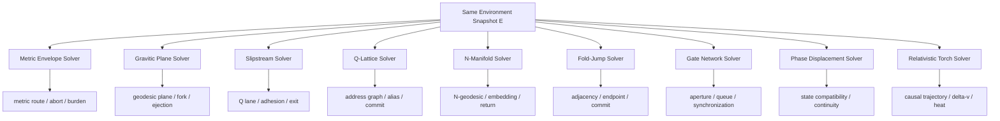
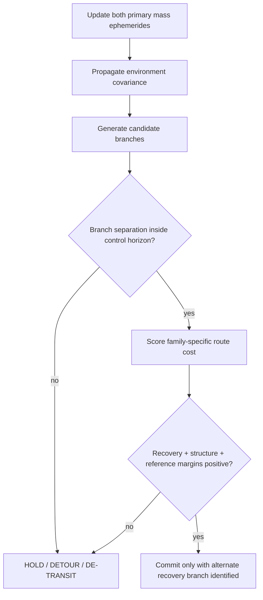

# Black Light FTL Environment Regression Manual

**Status:** subordinate engineering, validation, educational, and operator reference.  
**Primary authority:** `docs/blacklight/BLACK_LIGHT_PROPULSION_TRANSIT_AUTHORITY.md`.  
**Machine-readable companion:** `data/exo-vessel/ftl-environment-regression-registry.json`.  
**Supporting mathematics:** `data/exo-vessel/ftl-calibration-registry.json`, `data/exo-vessel/ftl-upgrade-causality-registry.json`, and `data/exo-vessel/ftl-solved-case-registry.json`.  
**Design source:** *The different lightspeed methods* — legacy design source; exact repository path remains `UNRESOLVED` in the current authority chain.

Canon labels follow the consolidated authority: `CONFIRMED`, `DERIVED`, `PROPOSED`, and `UNRESOLVED`.

This manual does not establish new canonical speeds, ranges, dates, races, manufacturers, or numerical constants. It defines a reproducible way to prove that Black Light transit systems remain mathematically and mechanically different when placed in the same environment.

---

## 1. Why environmental regression exists

The central requirement inherited from *The different lightspeed methods* is that different superluminal/transit methods must not collapse into the same fictional machine with different names. Gravity, shear, topology, route uncertainty, endpoint quality, infrastructure, material limits, and calculation errors must affect each mechanism according to what that mechanism actually manipulates.

The regression suite therefore asks one question repeatedly:

> Given exactly the same origin, destination, vessel, local universe, and available infrastructure, does each transit family solve the problem its own way?

A correct result may be faster, slower, longer, shorter, safer, more dangerous, infrastructure-dependent, temporarily unavailable, or completely `NO_GO`. The generator is explicitly permitted to fail to find a route when the physical and mathematical conditions do not support one.

---

## 2. Shared environment state

The common environment state is `DERIVED` as:

\[
E=\{\Phi,\nabla\Phi,\|R\|,\mathcal{T},Q,\nabla Q,\Sigma_{ref},\rho_{occ},I\}.
\]

Where:

- \(\Phi\) — gravitational potential/reference depth;
- \(\nabla\Phi\) — gravity gradient;
- \(\|R\|\) — curvature severity, normalized for generator comparison;
- \(\mathcal{T}\) — tidal/shear severity across the protected volume;
- \(Q\) and \(\nabla Q\) — Q-state and Q-weather/boundary variability where applicable;
- \(\Sigma_{ref}\) — navigation/reference covariance;
- \(\rho_{occ}\) — occupancy/exclusion burden;
- \(I\) — infrastructure state: beacons, prepared corridors, paired anchors, gateworks, traffic control, and reference services.

These quantities are **inputs**, not a universal score.



The test fails if those nine outputs are merely the same route multiplied by nine different speed constants.

---

## 3. Family mathematics under identical environmental inputs

### 3.1 Metric Compression Envelope

The Metric system minimizes the burden of an **engineered metric**. Its useful distance is not the normal-space line length but the path length under the manipulated spatial metric:

\[
D_M=\int_{\Gamma}\sqrt{\gamma^{eff}_{ij}\,dx^i dx^j},
\qquad
G_M=\frac{D_0}{D_M}.
\]

External curvature and tides consume field authority because the drive must superpose its desired geometry onto a non-flat background. A useful `DERIVED` route objective is:

\[
J_M[\Gamma]=\int_{\Gamma}
\left(
B_{field}+w_g\chi_g+w_t\chi_t+w_u u_r+w_h H
\right)ds,
\]

where \(H\) is a horizon/causal-control penalty. The coefficients remain `PROPOSED`.

**Upgrade interpretation:** primitive systems solve a small or static perturbation. Better tiers improve the mathematical class of metric solution that can be kept closed around a moving hull. Material science raises field-wall and structural limits; distributed emitters raise spatial resolution; faster sensors/control raise solution bandwidth; better energy conversion increases sustainable deformation; better mathematics reduces wasted deformation and selects lower-cost gravitational terrain.

A P5 ship can therefore gain range without a proportionate increase in raw energy because it avoids spending field authority fighting bad geometry.

### 3.2 Gravitational-Plane Skimmer

The Skimmer does not impose the same geometry. It searches for naturally favorable geodesic/equipotential structures:

\[
\Gamma_g^*=\arg\min_{\Gamma}
\int_{\Gamma}
\left[
1+a_g C_g+a_t\chi_t+a_u u_r+a_f p_{fork}
\right]ds.
\]

Here the gravity term is **signed/structured**, not simply a penalty. Broad, smooth gradients may lower effective route cost because they provide a better plane. Sharp ridges, unstable saddles, differential gradient, or unresolved branches increase cost and may force ejection.

This is one of the most important regression tests in the project:

\[
\frac{\partial J_M}{\partial \chi_g}>0
\quad\text{may coexist with}\quad
\frac{\partial J_g}{\partial C_g}<0
\]

for a favorable smooth gravity structure. In plain language: the same star can make Metric travel harder and Gravitic travel easier.

### 3.3 Hyperspatial Slipstream Shear

Slipstream solves a moving boundary-flow problem:

\[
D_S=\int_{\Gamma}\sigma_Q(x,t,u_Q,a)\,ds,
\qquad
G_S=\frac{D_0}{D_S}.
\]

The safe solution additionally requires adhesion and a recoverable normal-space correspondence:

\[
A_S \propto
\frac{(a-a_{crit})b_c(1+\mu_r)}{(1+u_r)(1+p_{fork})(1+q_w)}.
\]

`PROPOSED` coefficients and thresholds are omitted intentionally. Severe Q-weather can make a geometrically excellent route unusable because the lane splits faster than the controller can establish where its exits correspond in ordinary space.

### 3.4 Q-Lattice Phase Translation

Q-Lattice is a graph/address problem rather than a continuous path-length problem:

\[
C_Q(\pi)=\sum_k
\left[c_k+a_\phi e_{\phi,k}+a_\tau e_{\tau,k}+a_oP_{occ,k}+a_u u_{r,k}\right].
\]

The selected route is:

\[
\pi^*=\arg\min_\pi C_Q(\pi).
\]

A longer normal-space route represented by a reliable chain of addresses can beat a short route represented by ambiguous Q cells. Higher tiers improve clocks, state memory, tomography, defect correction, epoch prediction, and autonomous address construction. More field power cannot repair a false destination address.

### 3.5 N-Dimensional Manifold Drive

The Manifold drive solves a geodesic in the accessible higher-dimensional metric:

\[
D_N=\min_{\Gamma_N}\int_{\Gamma_N}
\sqrt{g_{AB}\,dX^A dX^B}.
\]

The shortest candidate is not automatically usable. The embedding \(\iota:M_{3+1}\rightarrow M_N\) and return map \(\pi:M_N\rightarrow M_{3+1}\) must remain well-conditioned:

\[
\kappa_{return}=\left\|D\pi\right\|\left\|(D\pi)^{-1}\right\|.
\]

A route with a slightly greater \(D_N\) may be preferred when it sharply lowers \(\kappa_{return}\), tidal distortion, or projection uncertainty. Higher tiers improve the number of controllable axes, topology sensing, solver dimensionality, projection rings, clamps, structural field support, and recovery-map redundancy.

### 3.6 Discrete Fold-Jump

Fold-Jump changes endpoint topology rather than traversing the original separation:

\[
\mathcal{F}:M^3\rightarrow M'^3,
\qquad
d_{M'}(A,B)\ll d_M(A,B).
\]

Its geometric gain is:

\[
G_F=\frac{d_M(A,B)}{d_{M'}(A,B)}.
\]

But `G_F` alone is not a safety measure. A viable solution additionally requires authenticated endpoints, empty protected volumes, sufficient structure/recoil margin, adequate recovery authority, and low topology-branch ambiguity:

\[
A_F=F(u_r,\rho_{occ},p_{fork},\mu_s,\mu_r,\chi_g).
\]

The exact form remains `DERIVED/PROPOSED` rather than canon. Once adjacency is committed, route steering is no longer meaningful. This is why better Fold systems gain strategic reach through **better endpoint mathematics, topology control, structural materials, metrology, field conditioning, and recovery**, not merely by “jumping faster.”

### 3.7 Anchored Wormhole / Gate Transit

A mature gate network moves the optimization problem out of the ship:

\[
T_{gate}=T_{approach}+T_{queue}+T_{sync}+T_{cross}+T_{depart}.
\]

The gate itself solves maintained aperture geometry, throat stability, mouth synchronization, mass-flow limits, and chronology-safe state. Higher maturity may improve aperture diameter, field efficiency, stabilization authority, throughput, scheduling, self-correction, and allowable asymmetry. None of those is correctly represented as a shipboard FTL velocity multiplier.

### 3.8 Quantum Phase Displacement

Phase Displacement treats the destination as a compatible state target:

\[
C_\Phi=
w_s(1-S)+w_oP_{occ}+w_c(1-C)+w_r(1-R)+w_mM_{mut}.
\]

Here \(S\) is state compatibility, \(C\) continuity confidence, \(R\) reference authenticity, and \(M_{mut}\) mutable-state burden. Ordinary distance can be almost irrelevant compared with whether the target state is valid, unoccupied, authenticated, and compatible with the vessel and its occupants.

### 3.9 Relativistic Inertial Torch

The Torch is retained as the non-FTL control case. It must never inherit exotic distance manipulation. Its travel remains a causal trajectory governed by thrust, mass, exhaust velocity, power, thermal rejection, and relativistic kinematics:

\[
\gamma=\frac{1}{\sqrt{1-v^2/c^2}},
\qquad
E_k=(\gamma-1)mc^2.
\]

Its regression value is extremely important: if a supposed FTL environment term changes the Torch despite having no ordinary-space physical coupling, the implementation has leaked a generic FTL penalty into the wrong family.

---

## 4. Regression environments

| Fixture | Main stressor | Families that should react most strongly | What must not happen |
|---|---|---|---|
| Deep interstellar flat space | weak landmarks/reference | Fold, Q-Lattice, Phase; Gravitic has weak roads | automatic “easy FTL” merely because gravity is low |
| Close stellar passage | curvature + tides | Metric, Gravitic, Manifold, Torch | identical gravity penalty across all families |
| Binary saddle/fork | moving branches | Gravitic, Metric, Slipstream, Manifold | ignoring fork probability or time-dependent geometry |
| Compact-object neighborhood | extreme curvature/tides | most physical-geometry families | forcing a safe solution at every tier |
| Dense fleet/artificial gravity | occupancy + moving perturbations | Fold, Phase, Gate, Metric/Gravitic control | treating occupancy as a universal speed penalty |
| Severe Q-weather | Q shear/phase instability | Slipstream, Q-Lattice | penalizing unrelated drives without source-backed coupling |
| Reference-poor frontier | covariance/authenticity | Fold, Q-Lattice, Phase | converting lack of knowledge into free random jumps |
| Prepared beacon corridor | low reference error | discrete/reference-heavy families | beacons magically increasing hull strength or field power |
| Stellar gate corridor | queue/sync/throughput | Gate | describing gate performance as ship cruise velocity |

---

## 5. Tier progression is a change in solvable mathematics

Every P0→P6 transition must answer all five parts:

\[
\boxed{
\text{old solvable model}
\rightarrow
\text{new solvable model}
\rightarrow
\text{physical enabler}
\rightarrow
\text{changed limit}
\rightarrow
\text{observable gain}
}
\]

A valid technology improvement can originate in several places at once:

\[
U=(M,F,A,S,E,N,D,C,R,I)
\]

where the upgrade coordinates are mathematical method, field manipulation, active materials, structure, energy, navigation/reference quality, drive scale/distribution, control bandwidth, recovery, and infrastructure.

### Primitive tiers

At primitive maturity the mathematics is usually low-dimensional, static, surveyed, or narrowly parameterized. Hardware is large because poor material performance, low field density, slow control, and limited mathematical models require enormous margins. The drive may work only in a test volume, along one rail, between one pair of anchors, inside one captive corridor, or against one precomputed field geometry.

### Middle tiers

Operational systems learn to close the solution around a moving macroscopic vessel. The crucial gains are often not raw energy. They are boundary closure, moving-frame mathematics, dynamic state estimation, multiple candidate solutions, reliable termination, higher sensor bandwidth, distributed field structures, and materials able to survive repeated cycling.

### Strategic tiers

Strategic drives stop treating the environment as a disturbance discovered after entry. They predict it. Route optimization becomes part of the drive mathematics. Better gravimetry, Q-weather sensing, topology libraries, reference networks, state tomography, higher-dimensional solvers, and receding-horizon control convert previously unusable space into navigable space.

### Apex tiers

The mature apex continuously re-solves the transit condition while it operates where the mechanism allows continuous correction. Discrete systems instead continuously improve the solution **until commit** and improve recovery, validation, or rapid repeatability afterward. No generic “continuous steering” should be added to Fold, Q-Lattice, or Phase Displacement merely to make P6 resemble continuous drives.

---

## 6. Scaling: why a larger drive is not merely a stronger drive

For field/enclosure families, a non-canonical engineering burden model remains useful:

\[
B_f=K_f
\left(\frac{M}{M_0}\right)^{\alpha_f}
\left(\frac{V_p}{V_0}\right)^{\beta_f}
C_gC_eC_dC_r.
\]

A larger installation can improve performance by adding emitter area, resonant volume, aperture diameter, state-tomography capacity, field sectors, energy buffers, heat capacity, recovery stores, reference baselines, or redundant solvers. Which of these matters depends on the family and technology basis.

A large terrestrial Metric drive may use multiple tensor-emitter sectors and massive structural foundations. A biological equivalent may grow distributed field-bearing tissues and redundant sensory ganglia. A mineral equivalent may gain coherent aperture through segmented resonant crystal domains. A postmaterial implementation may expand authenticated field volume and fallback anchor matter. **Scale changes embodiment; it does not erase technological identity.**

---

## 7. Practical operator card — binary saddle / fork

**Applicability:** Metric Envelope, Gravitic Plane, Manifold, and any drive whose solution branches under changing external geometry. Procedures are `DERIVED` unless superseded by specific manufacturer doctrine.



**Technician watch items:** clock disagreement, gravimeter residuals, unexpected field-sector asymmetry, transition-coil duty cycle, topology-sensor disagreement, rapidly widening endpoint covariance.

**Abort principle:** do not wait for a fork to become visually or locally obvious. The useful abort horizon is the time remaining before branch ambiguity becomes dynamically irreversible for that family.

---

## 8. Practical operator card — severe Q-weather

**Slipstream:** continuously track lane shear, adhesion, phase velocity, normal-space correspondence, and every currently valid exit window. If projected adhesion or correspondence crosses its limit before the next certified release window, detach at the current safe window rather than attempting to outrun the storm.

**Q-Lattice:** do not interpret “storm” as turbulence encountered during a conventional flight. Recalculate address/epoch covariance and alias probability. If the destination or any intermediate cell becomes multiply plausible, hold before transition. More field strength does not make an ambiguous address correct.

**Other families:** apply a Q-weather penalty only where surviving authority defines a physical coupling. Generic generator code must not spread the Slipstream/Q-Lattice hazard model to every FTL mechanism.

---

## 9. Practical operator card — compact-object exclusion

A drive may possess enough nominal energy to initiate and still be unable to recover safely.

Before entry, evaluate at minimum:

\[
\mu_c=\frac{V_{valid}-V_{required}}{V_{required}},
\qquad
\mu_r=\frac{R_{available}-R_{required}}{R_{required}},
\]

plus structural reserve \(\mu_s\), control bandwidth \(b_c\), tidal load, curvature severity, reference covariance, and family-specific commit conditions.

A candidate is `NO_GO` when no solution preserves all required positive margins. Do not solve a negative recovery margin by reducing a narrative safety factor after the fact.

**Post-abort inspection:** field supports, recoil/transition structures, clocks/references, topology/phase sensors, recovery stores, heat/radiation sinks, biological or mineral analogues of those systems, and immutable event logs.

---

## 10. Practical operator card — reference-poor frontier

Reference quality is a physical engineering input for several Black Light drives.

For a state vector \(x\) propagated through a nonlinear transition model \(f\):

\[
\Sigma_{out}\approx J_f\Sigma_{in}J_f^T+Q_{model}.
\]

A mature system improves frontier reach by reducing \(\Sigma_{in}\), improving \(J_f\), reducing model uncertainty \(Q_{model}\), adding independent measurements, or creating trustworthy infrastructure. It does **not** merely decide to tolerate worse coordinates.

**Fold:** no authenticated empty endpoint, no jump.  
**Q-Lattice:** no unique address/epoch, no translation.  
**Phase Displacement:** no compatible authenticated target state, no displacement.  
**Gravitic:** may partially bootstrap reference from observable mass geometry.  
**Torch:** can still fly causally using inertial/celestial methods, though with poorer navigation efficiency.

---

## 11. Practical operator card — gate corridor

Gate operations treat transit as infrastructure management.

**Before aperture assignment:** verify mouth identity, chronology-safe synchronization, destination aperture state, permitted mass/geometry, approach vector, traffic separation, and compatibility of vessel environment/structure with the gate.

**Before throat entry:** confirm the allocated slot still exists. Queue delay is not merely administrative; changing mass flow and aperture conditions can invalidate an earlier solution.

**Abort:** before entry, the gate may hold, close, or reject. After throat entry, recovery belongs to the throat-control architecture. Shipboard Fold, Metric, or Slipstream emergency procedures must not automatically seize gate topology control.

---

## 12. Environment-driven signatures

Signatures are expected to change with environmental burden.

| Mechanism | Benign environment | Stressed environment |
|---|---|---|
| Metric | regular spool geometry, modest recovery transient | asymmetric sector modulation, stronger gravitational precursor, larger ringing/dump |
| Gravitic | smooth coupling corrections | rapid transition-coil activity, ejection precursor, differential structural response |
| Slipstream | stable Q wake | rapidly modulated wake, adhesion excursions, abnormal exit precursor |
| Q-Lattice | clean indexed transition | prolonged anti-alias activity, repeated tomography, aborted spool |
| Manifold | stable axis/projection sequence | axis switching, clamp load, projection-correction transients |
| Fold | repeatable aperture spool | extended endpoint metrology, asymmetric recoil/ringing risk |
| Gate | persistent controlled aperture | synchronization activity, throat correction, traffic hold/closure |
| Phase | stable tomography and transition | prolonged state interrogation, quarantine/residual scans |
| Torch | ordinary plume/thermal signature | prolonged maneuver burns, high heat/radiation load |

These outputs are valuable to intelligence systems because they expose **why** a drive is struggling. A long Fold spool in frontier space implies something different from a long Slipstream spool in a Q-storm.

---

## 13. Failure chains must retain mechanism and environment

A valid failure chain has at least four stages:

\[
\text{environmental disturbance}
\rightarrow
\text{measured/hidden state error}
\rightarrow
\text{family-specific machinery response}
\rightarrow
\text{transit consequence}.
\]

Example — Gravitic binary fork:

`unmodeled companion mass -> wrong gradient covariance -> plane graph chooses false branch -> transition coils saturate -> plane loss/ejection`.

Example — Slipstream Q storm:

`rapid shear split -> wake probes underresolve fork -> adhesion controller follows obsolete lane -> phase-velocity error grows -> emergency release outside preferred correspondence window`.

Example — Fold in dense fleet:

`late traffic incursion -> destination exclusion confidence falls -> independent occupancy interlock blocks topology commit`.

The third example is a **successful safety response**, not a malfunction. A generator must distinguish equipment failure from equipment correctly refusing an unsafe transit.

---

## 14. Maintenance follows the cause of uncertainty

Environmental stress should produce targeted maintenance rather than a generic “FTL service required” flag.

High curvature/tides drive inspection of structural foundations, field sectors, clamps, recoil frames, inertial references, and protected-volume closure. Severe Q-weather drives phase-reference re-zeroing, coupler stress inspection, wake-sampler validation, defect correction, and Q-sensitive working-media checks. Frontier operations drive clock/reference calibration, immutable route-store audits, sensor baseline verification, probe servicing, and provenance checks. Dense traffic drives occupancy-sensor proof tests and synchronization/latency checks. Gate operations drive aperture tomography, anchor alignment, timing, throughput sensors, traffic interlocks, and interface certification.

Technology basis transforms these tasks physically. “Inspect structural foundation” may mean ultrasonic frame inspection for terrestrial electromechanical machinery, tissue imaging for a biological field organ, resonant crack mapping for a mineral installation, membrane/tension mapping for gas-giant machinery, or authenticated state comparison for postmaterial structures.

---

## 15. Generator/API contract

The generator should return both the environment and the family-specific interpretation of that environment:

```json
{
  "environmentSnapshot": {
    "id": "ENV-BINARY-SADDLE",
    "state": {
      "chi_g": 0.46,
      "chi_t": 0.39,
      "u_r": 0.11,
      "p_fork": 0.48,
      "i_a": 0.17
    },
    "status": "PROPOSED_FIXTURE"
  },
  "solution": {
    "family": "gravitic-plane",
    "tier": "P4",
    "optimizationTarget": "weighted moving-plane graph",
    "selectedRoute": "SADDLE_BRANCH_B",
    "rejectedRoutes": [
      {
        "route": "DIRECT_BRANCH_A",
        "reasonTerms": ["p_fork", "chi_t"]
      }
    ],
    "decision": "TRANSIT_ALLOWED",
    "abortState": "REROUTE_AVAILABLE",
    "provenance": []
  }
}
```

The same environment may legitimately return `DETOUR`, `HOLD`, `INFRASTRUCTURE_REQUIRED`, or `NO_GO` for another family.

### Required provenance for a numerical result

```json
{
  "field": "solution.routeCost",
  "value": 1.42,
  "status": "PROPOSED",
  "equationStatus": "DERIVED",
  "modelSource": "data/exo-vessel/ftl-calibration-registry.json",
  "environmentSource": "data/exo-vessel/ftl-environment-regression-registry.json",
  "authoritySource": "docs/blacklight/BLACK_LIGHT_PROPULSION_TRANSIT_AUTHORITY.md",
  "designSource": "The different lightspeed methods",
  "designSourcePathStatus": "UNRESOLVED",
  "parentInputs": ["chi_g", "chi_t", "u_r", "p_fork", "tier"],
  "notes": "Fixture result; does not establish canonical performance."
}
```

---

## 16. Canon safeguards

The regression layer obeys six non-negotiable safeguards.

**First:** a regression fixture never overrides named race, polity, manufacturer, vessel, drive, or historical canon.

**Second:** a mathematical explanation marked `DERIVED` may explain confirmed behavior but may not silently create a new confirmed capability.

**Third:** `PROPOSED` constants stay proposed even after thousands of generated ships reuse them.

**Fourth:** missing evidence remains `UNRESOLVED`. The exact repository path of *The different lightspeed methods* remains unresolved in the current authority chain; the source identity is preserved without inventing a path.

**Fifth:** chronology violation is not inferred from FTL. Any route whose mathematics appears chronology-sensitive returns an authority warning unless explicit canon authorizes the effect.

**Sixth:** a generator is allowed to say **no**. A universe with mathematical limits becomes incoherent if every requested trip is guaranteed a successful solution.

---

## 17. Educational text — five levels of understanding

### Passenger

Different drives do not all “go faster than light” in the same way. One reshapes distance. One rides gravity. One catches a moving Q-current. One changes addresses. One takes a higher-dimensional shortcut. One folds two places together. One uses a permanent gate. One changes the ship's state from here to there. One, the Torch, simply flies extremely fast through ordinary space.

### Crew operator

The environment can help one drive and hurt another. Your job is not to watch one FTL speed gauge. Your job is to know which condition your drive requires and recognize when that condition is disappearing.

### Technician

A route problem eventually becomes a machine problem. Bad curvature appears as field-sector load. Bad Q-weather appears as adhesion/reference instability. Bad topology appears as solver branch risk and recoil asymmetry. Bad endpoint certainty appears as longer ranging/tomography cycles and interlocks refusing commit.

### Engineer

Treat transit as constrained optimization over a family-specific operator. The same environment vector enters different objective functions. Tier progression expands the class of solvable operators and the domain in which hardware can physically realize them. Performance therefore emerges from mathematical capability **and** machinery capability.

### Generator/API designer

Never store only `distance`, `speed`, and `driveType`. Preserve the environment snapshot, family operator, selected/rejected solutions, changed terms, margins, commit/abort state, technology-basis embodiment, and provenance. Otherwise the generator cannot explain why a ship can make a trip, why another cannot, or which upgrade would change the answer.

---

## 18. Regression acceptance tests

An implementation passes this layer only if all of the following remain true:

1. A favorable broad stellar gradient can improve a Gravitic route while making a Metric solution more expensive.
2. Severe Q-weather strongly affects Slipstream and Q-Lattice without automatically penalizing unrelated mechanisms.
3. Weak endpoint/reference authority can prevent Fold, Q-Lattice, or Phase Displacement from committing even when enough energy is available.
4. Occupancy can invalidate an endpoint or gate slot without becoming a universal drive-efficiency term.
5. Compact-object conditions can produce `NO_GO` rather than an arbitrarily downgraded speed.
6. Beacon infrastructure improves the terms it physically supplies—reference, timing, route knowledge, authentication—and does not magically strengthen structures or create power.
7. Gate networks optimize throughput, synchronization, approach, queueing, and aperture health rather than shipboard cruise velocity.
8. The Inertial Torch retains ordinary-space causal mechanics under every fixture.
9. Every P0→P6 performance improvement can identify the mathematical capability that changed and the physical development that made it possible.
10. Every family retains its own commit and abort semantics.

---

## 19. Origin and provenance note

This manual is a **derived integration document**, not a recovered historical source. It exists because the consolidated Black Light authority, the recovered FTL archive, the mathematical calibration work, the solved transit cases, and *The different lightspeed methods* collectively require a stronger test than prose consistency.

The source design idea preserved from *The different lightspeed methods* is particularly important: transit methods must encounter gravity, topology, shear, miscalculation, safety sensing, emergency de-transit, and increasing mathematical sophistication in ways specific to their mechanism. This manual turns that requirement into testable engineering behavior without claiming that the illustrative equations or normalized fixture constants were themselves present in the legacy source.

Future race/manufacturer annexes should reuse these environment fixtures as tests, but their specific canon may narrow, extend, or replace any `DERIVED` interpretation. That is the intended authority direction: **source canon constrains models; models do not manufacture source canon.**
