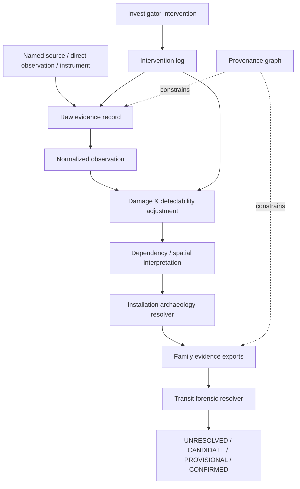
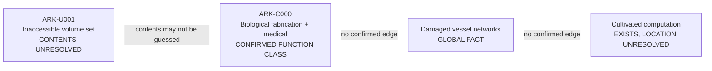
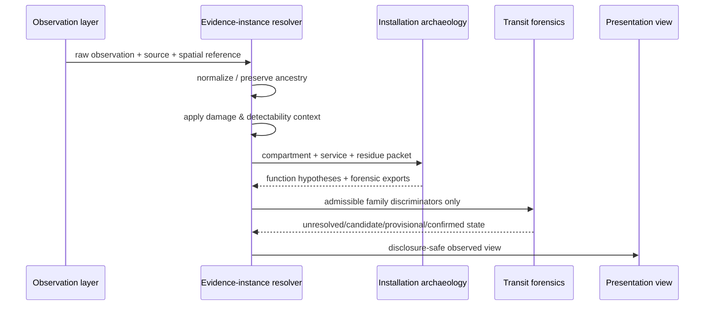

# Black Light FTL Evidence Instance Field Manual

**Status:** `MIXED` — practical evidence-capture, exploration, and forensic-handoff authority derived from confirmed propulsion/transit physics, the installation-archaeology registry, the forensic-identification registry, and named Ar'nock foundation records.  
**Primary design source:** Google Drive document **The different lightspeed methods**, document ID `1e0Xp71EFubBZgXWjjvPxAqPoJIZNwqS6nu1-r7Kil7Y`, revision `ANLCKQllC5h6dLaX5H1RpK8aUFVWsi-IV7gbMHUd0Qq7mIe5uGsLFi5_Hrsr8B6dl8t_ezB0fTSygxrnIBtifAHW79bgSbswp1zF3NaEil0`.  
**Machine-readable companion:** `data/exo-vessel/ftl-evidence-instance-registry.json`.  
**Validation contract:** `data/schemas/exo-vessel-ftl-evidence-instance.schema.json`.  
**Parent authorities:** `docs/blacklight/BLACK_LIGHT_PROPULSION_TRANSIT_AUTHORITY.md`, `data/exo-vessel/ftl-installation-archaeology-registry.json`, `docs/blacklight/BLACK_LIGHT_FTL_INSTALLATION_ARCHAEOLOGY_FIELD_MANUAL.md`, `data/exo-vessel/ftl-forensic-identification-registry.json`, and named vessel/species records in `data/blacklight-continuum/wiki/foundation-lore.json`.

---

## 1. Purpose

The propulsion/transit corpus already knows how a suspected installation should be investigated and how family-level evidence should be evaluated. What it previously lacked was the durable object between those two systems: the **evidence instance**.

An evidence instance is the case record for one investigated vessel, gate, wreck, test article, laboratory, shipyard installation, or recovered component cluster. It stores what was actually observed, where it was observed, how reliable and survivable the evidence is, what interventions have altered it, how translated telemetry descends from its source, and what may safely be exported to the higher-level archaeology and forensic resolvers.

Its central rule is:

\[
\boxed{\text{record first} \rightarrow \text{interpret second} \rightarrow \text{classify last}}
\]

A useful technical corpus must permit investigators to be wrong, revise a hypothesis, discover that two apparent data sources share one ancestor, or learn that a missing component was simply destroyed. The evidence record therefore preserves raw observations even when later interpretations change.

This manual does **not** assign the Ar'nock derelict an FTL family.

---

## 2. Authority and claim discipline

Every externally asserted technical statement in an evidence instance has four separate questions:

1. **What was observed?**
2. **What source or instrument established it?**
3. **What transformation produced the current wording or measurement?**
4. **What authority status does the resulting claim possess?**

The corpus uses the standard status vocabulary:

| Status | Meaning in an evidence instance |
|---|---|
| `CONFIRMED` | A named source or admitted observation directly establishes the claim within scope. |
| `DERIVED` | The claim is an engineering consequence of confirmed parents and retains the derivation path. |
| `PROPOSED` | A useful working hypothesis, test plan, reconstruction, or example not independently established. |
| `UNRESOLVED` | The available evidence does not currently determine the value. |
| `MIXED` | The object contains claims with more than one status and preserves field-level provenance. |

The following implication is forbidden:

\[
\text{plausible machinery layout}
\not\Rightarrow
\text{historical installation fact}.
\]

Similarly:

\[
\text{family-compatible evidence}
\not\Rightarrow
\text{family confirmation}.
\]

The family resolver alone is responsible for promotion under the standards defined by the forensic-identification authority.

---

## 3. Evidence-instance architecture

The evidence instance sits between raw exploration and the two higher-level resolvers.



The evidence instance owns observations, compartment-locality records, service edges, telemetry fragments, unknown volumes, and intervention history. It does not own family truth.

---

## 4. The observation record

A normalized observation has the conceptual form

\[
O_i=\{x_i,c_i,s_i,R_i,D_i,P_i,S_i,A_i\},
\]

where:

- \(x_i\) is the statement or measured result,
- \(c_i\) is the evidence channel,
- \(s_i\) is spatial reference,
- \(R_i\) is source/instrument reliability,
- \(D_i\) is damage-adjusted detectability,
- \(P_i\) is provenance independence,
- \(S_i\) is spatial specificity,
- \(A_i\) is ancestry and transform history.

A derived working weight is

\[
W_i=R_iD_iP_iS_i.
\]

This is **not** probability that the observation is canonically true. It is a forensic weighting term for a specific investigation.

### 4.1 Why the factors remain separate

A single confidence percentage hides the reason evidence is weak.

An intact sensor may be highly reliable but spatially nonspecific. A residue may be spatially precise but badly degraded. A translated alarm may be semantically clear but share the same corrupted clock ancestor as three other apparently independent alarms.

Keeping the factors separate lets later investigators update the right term instead of rewriting history.

---

## 5. Evidence channels

The installation-archaeology authority already separates the principal channels. Evidence instances retain that separation.

| Channel | Typical contents | Common misuse |
|---|---|---|
| Geometry | boundaries, clearances, rings, cavities, carried volumes | naming function from shape alone |
| Structural load | reinforcement, fatigue, mounting reactions | assuming high load means propulsion |
| Power distribution | bus topology, buffers, isolation, reserve | equating highest power draw with prime mover |
| Thermal/cooling | sinks, loops, radiators, phase-change stores | treating heat capacity as drive output |
| Fluidic/nutrient | biological feed, reactants, hydraulic media | treating biological service as species ownership proof |
| Data/control | command paths, controller clusters | counting duplicated displays as independent evidence |
| Timing/reference | clocks, epoch networks, reference roots | ignoring common timing ancestry |
| Field residual | metric, gravitic, Q-state, topology, EM | treating a broad residue as family-exclusive |
| Gravimetry | gradient response, tidal history, local field mapping | using one gravity scalar for all families |
| Q-state | address, shear, boundary, state effects | collapsing all Q-related phenomena together |
| Topology | adjacency, throat, closure, topology change | calling every annular machine a gate |
| Vibration/acoustic | resonance, structural carrier modes | confusing control carrier with drive physics |
| Chemical/biological | metabolites, tissue state, reactive media | selecting a family from biological construction |
| Maintenance access | tool paths, replaceable units, growth seams | treating service layout as historical naming |
| Archive/telemetry | route, alarm, maintenance, configuration data | trusting translation without ancestry |
| Damage pattern | fractures, burns, denaturation, regrowth | assuming every scar came from the initiating failure |
| External interface | apertures, anchors, docking, emitters | inferring missing external infrastructure |
| Wake/deposit | post-transit residue or corridor trace | converting one transient into universal signature |

---

## 6. Compartment and locality records

A compartment record exists only when a source or observation establishes a spatial volume. The record begins with a neutral identifier.

```text
ARK-C000
ARK-C001
ARK-C002
...
```

A functional label is attached separately with its own status.

This matters because labels are extremely sticky in generated prose. Once a room is called “the Fold chamber,” later descriptions tend to treat Fold as settled fact even when the original label was only a guess.

The safe pattern is:

```text
Compartment: ARK-C014
Observed geometry: annular cavity, incomplete circumference
Observed services: high-capacity power + isolated timing trunks
Observed residue: unresolved topology-sensitive transient
Functional hypothesis: field-forming machinery [DERIVED]
Family assignment: UNRESOLVED
```

The unsafe pattern is:

```text
Fold Drive Chamber
```

unless a higher authority has actually established that name and function.

---

## 7. Known Ar'nock case initialization

The current Ar'nock case can safely initialize only a small number of facts from the foundation archive.

The operatives awakened in a **biological fabrication and medical compartment**. The vessel also contains biological printers, medical systems, cultivated computation, environmental controls, storage, fabrication feedstock, damaged networks, and inaccessible compartments. The archive does not establish where all of these systems are located relative to each other.

Therefore the seed record admits `ARK-C000` for the confirmed awakening compartment but does not invent a deck map around it.



A dotted line in this diagram explicitly means **relationship not yet established**, not a real service connection.

---

## 8. Service-network evidence

A transit installation is a multiplex network, not merely a floor plan.

Let

\[
G_I=(V,E_S,E_P,E_T,E_F,E_D,E_C,E_M,\ldots)
\]

represent structural, power, thermal, fluidic/nutrient, field, data, clock/reference, maintenance, and other layers.

A service edge should record:

- origin and destination;
- edge type;
- directionality;
- capacity class where observed;
- survival state;
- whether it is directly observed, traced, derived, proposed, or unknown;
- provenance.

A derived continuity measure can be written

\[
Q_e=O_eS_eT_e,
\]

where \(O_e\) is observation confidence, \(S_e\) is the estimated surviving fraction, and \(T_e\) is trace completeness.

This prevents a half-destroyed conduit from being treated as a fully proven dependency merely because both ends are visible.

### 8.1 No adjacency shortcut

Physical adjacency does not prove a service connection.

\[
\text{adjacent rooms}\not\Rightarrow\text{shared power}\not\Rightarrow\text{shared timing}\not\Rightarrow\text{shared field}.
\]

Conversely, a distributed alien installation may couple physically distant compartments through dedicated timing or field carriers.

---

## 9. Unknown volumes

Unknown space is a first-class data type.

An inaccessible compartment contributes uncertainty. It does not automatically contain the component required by whichever hypothesis is currently fashionable.

The correct rule is:

\[
U\Rightarrow\Delta H>0,
\]

not

\[
U\Rightarrow H_f.
\]

In words: unknown volume can increase hypothesis uncertainty, but it does not support a particular family.

### 9.1 Negative evidence inside unknown space

If a volume has not been observed, the absence of an expected marker inside it has no evidentiary force.

This is particularly important for damaged vessels, because a missing component may have been removed, destroyed, depressurized, detached, or rendered chemically unrecognizable.

---

## 10. Damage-adjusted absence

Negative evidence is admissible only when the investigation could reasonably have detected the missing marker.

Use the derived quantity

\[
A^- = I\,V\,S\,(1-D),
\]

where:

- \(I\) = instrument capability,
- \(V\) = observed-volume coverage,
- \(S\) = expected marker survivability,
- \(D\) = destructive damage fraction.

A low \(A^-\) means “not seen” is weak evidence.

### Example

Suppose a candidate family would normally leave a distributed field-former around the hull. If forty percent of the hull is physically absent and another thirty percent cannot be accessed, failure to find that field-former is not a strong contradiction.

If the entire intact hull has been mapped with an instrument known to detect the expected structure and nothing appears, the negative evidence becomes much stronger.

---

## 11. Damage stratigraphy and biological regrowth

Ar'nock machinery makes temporal ordering especially important.

A wreck may contain:

1. normal operational wear;
2. maintenance modifications;
3. the initiating casualty;
4. secondary structural or thermal damage;
5. abandonment decay;
6. biological necrosis;
7. autonomous repair;
8. regrowth;
9. scavenging;
10. investigator intervention.

These layers cannot safely be collapsed into “current condition.”

A regrown biological conduit may restore flow through a different path than the original network. A healed field-bearing membrane may be alive but no longer retain the geometry of its last certified transit configuration.

Thus:

\[
\boxed{\text{biological viability}\neq\text{calibration validity}}
\]

and

\[
\boxed{\text{healed geometry}\neq\text{historical geometry}}.
\]

---

## 12. Telemetry and translation ancestry

Alien telemetry is often more dangerous epistemically than a broken machine because translated text sounds authoritative.

Every fragment must preserve:

- source node;
- raw content or raw-signal reference;
- translation state;
- clock state;
- semantic context;
- derivative ancestry;
- uncertainty;
- status.

A translated noun that resembles “gate,” “fold,” “phase,” “lane,” or “jump” does not independently identify the physical operator.

### 12.1 Translation confidence

A useful derived model is

\[
C_{tr}=C_{lex}C_{sem}C_{clock}C_{context}.
\]

The multiplicative form encodes a practical truth: excellent lexical translation does not rescue a fragment whose clock association or technical context is unknown.

### 12.2 Independent evidence and copied records

If four displays all reproduce one controller's fault code, they are one source lineage.

A conservative independence factor is

\[
P_o\approx\frac{1}{n_a},
\]

for \(n_a\) observations sharing one ultimate ancestor, until a more appropriate correlation model is available.

This is deliberately conservative and remains `DERIVED`.

---

## 13. Family-likelihood vectors

Evidence records may contain a family-likelihood vector, but a blank vector is valid and often preferable.

A biological printer is real evidence about the vessel. It has essentially no legitimate family-discriminating content by itself.

The correct record is therefore:

```json
"familyLikelihoodVector": {}
```

rather than manufacturing equal probabilities across eight families.

Only observations that actually constrain the operator should export family-discriminating values.

---

## 14. Gravity evidence

The design source specifically requires transit systems to react differently to gravity, gravitational lensing/shear structures, high-gravity volumes, path errors, and safety margins.

Therefore gravity observations must preserve the actual measured environmental quantities where possible rather than collapsing them into `gravityPenalty = 0.7`.

A family-independent local environmental state can be represented schematically as

\[
\mathcal E_g=\{\Phi,\nabla\Phi,H(\Phi),R,\mathcal S,\Sigma_g\}.
\]

The family interpretation is deferred:

\[
C_g^{(f)}=F_f(\mathcal E_g,\text{Path},\text{installation},\text{condition}).
\]

A gravimetric record is evidence. The family-specific cost is interpretation.

---

## 15. Practical manual EI-01 — establish the case record

**Purpose:** create an evidence instance before naming propulsion spaces.

1. Assign a stable subject ID.
2. Capture the current authority snapshot and source revision.
3. Record every known named-source fact with exact source ancestry.
4. Create compartment IDs only for established spatial volumes.
5. Create unknown-volume records for inaccessible or destroyed regions.
6. Initialize service edges as empty unless observed or sourced.
7. Record the current family state explicitly, including `UNRESOLVED`.
8. Freeze the seed snapshot before investigator intervention.

**Acceptance:** the case can be reconstructed without requiring conversational memory.

---

## 16. Practical manual EI-02 — compartment intake

**Purpose:** admit a newly explored compartment without leaking conclusions.

Record:

- geometry;
- access path;
- pressure/environment;
- damage;
- machinery objects;
- structural interfaces;
- visible service interfaces;
- residues;
- archives;
- instrument coverage;
- unknown boundaries.

Do not name the compartment after a family unless the name is itself recovered evidence.

### Minimal safe label

`ARK-C017 — elongated machinery volume; function unresolved`

### Unsafe label

`ARK-C017 — manifold engine room`

unless operator evidence has already earned that conclusion.

---

## 17. Practical manual EI-03 — service trace admission

**Purpose:** convert a conduit or carrier trace into a graph edge.

For each trace:

1. establish both endpoints if possible;
2. identify the carrier class without assuming purpose;
3. measure directionality or bidirectionality;
4. estimate surviving continuity;
5. record breaks, bypasses, repair growth, or splices;
6. record the observation method;
7. mark the edge as `OBSERVED`, `TRACED`, `DERIVED`, `PROPOSED`, or `UNKNOWN`;
8. attach provenance.

An edge can be useful even if its purpose remains unresolved.

---

## 18. Practical manual EI-04 — telemetry fragment intake

**Purpose:** keep alien records from outrunning physical evidence.

1. preserve raw source;
2. identify source node and storage medium;
3. record checksum or integrity state where available;
4. determine clock quality independently from language translation;
5. preserve literal translation separately from technical interpretation;
6. attach every derivative translation to the same source ancestor;
7. export operator terminology only when physical context supports it.

A translation such as “boundary refusal” should remain “boundary refusal” until engineering evidence establishes what boundary is meant.

---

## 19. Practical manual EI-05 — intervention logging

**Purpose:** prevent investigation from rewriting the crime scene.

Before cutting, moving, powering, flushing, repairing, stimulating, healing, regrowing, or reconnecting a component:

1. create an intervention ID;
2. capture pre-intervention geometry and residue state;
3. identify expected evidence impact;
4. record whether the action is reversible;
5. define abort limits;
6. execute the intervention;
7. capture post-intervention state;
8. mark later observations as descendants of the intervention.

An intervention is never erased from provenance simply because it succeeded.

---

## 20. Practical manual EI-06 — family export review

**Purpose:** send only legitimate discriminators to the forensic resolver.

For each candidate export ask:

1. Does this observation constrain operator physics, or only machinery embodiment?
2. Is the spatial reference established?
3. Has damage altered detectability?
4. Is the source genuinely independent?
5. Is translation ancestry preserved?
6. Does the statement contain an accidental family label?
7. Are competing explanations recorded?

Then export

\[
E_f=\{c,x,W_o,p,s,d,L_f,K\}
\]

where \(L_f\) is the family-likelihood vector and \(K\) the contradiction set.

The export itself cannot promote the family.

---

## 21. Practical manual EI-07 — progressive disclosure

**Purpose:** support play without spoiling engineering conclusions.

The evidence system should produce at least two views:

### Investigator / GM engineering view

May contain:

- candidate family rankings;
- contradiction sets;
- hidden provenance conflicts;
- recommended discriminatory tests;
- unpromoted functional hypotheses.

### Player-facing observed view

May contain:

- visible machinery;
- measured residues;
- translated fragments already earned;
- observed damage;
- neutral room labels;
- uncertainty.

It must not reveal a family simply because the resolver privately ranks it highest.

---

## 22. Practical manual EI-08 — post-repair recertification

**Purpose:** keep repaired alien technology from inheriting stale evidence.

After structural repair, biological healing, service reconnection, controller replacement, or geometry change:

1. close the old configuration snapshot;
2. open a new configuration epoch;
3. re-measure compartment geometry;
4. retrace affected service edges;
5. reacquire field/residue baselines;
6. revalidate clock/reference ancestry;
7. recompute damage-adjusted detectability;
8. invalidate family exports that depended on superseded geometry or topology;
9. run family-specific certification only after the evidence layer is internally coherent.

---

## 23. Survey completeness

A compartment can be well surveyed without its function being known.

A derived survey-completeness metric is

\[
C_c=\frac{\sum_kw_kq_k}{\sum_kw_k},
\]

where \(q_k\) represents completeness for geometry, service mapping, residue sampling, archive recovery, damage characterization, access coverage, and other selected domains.

This number answers:

> “How much of this compartment have we actually characterized?”

It does **not** answer:

> “How sure are we that this is the drive room?”

Those are different questions and must stay different in UI and API output.

---

## 24. Equipment manual — evidence workstation

A practical exploration team should possess functional equivalents of the following tools. Names are `DERIVED` equipment classes, not recovered Ar'nock product names.

| Equipment | Primary function | Typical failure risk |
|---|---|---|
| Geometry mapper | maps boundaries and interfaces | reflective/field-active surfaces distort range |
| Multiplex service tracer | separates service layers | cross-coupling produces false continuity |
| Residual field spectrometer | records field-state residues | active sampling can disturb weak remnants |
| Load-path imager | reconstructs force transfer | severe structural loss erases path history |
| Biological viability scanner | maps living/dormant/necrotic machinery | viability may be mistaken for function |
| Archive ancestry recorder | preserves source/translation lineage | copied data may appear independent |
| Clock/reference analyzer | reconstructs time ancestry | offset and corruption can be conflated |
| Reversible stimulus controller | applies bounded low-authority tests | unknown thresholds may be nonlinear |
| Contamination logger | records investigator-induced change | failure to log creates false historical evidence |

---

## 25. Training chart — evidence versus interpretation

| Observation | Safe interpretation | Unsafe leap |
|---|---|---|
| Large annular biological structure | field/aperture/structural function unresolved | “wormhole gate” |
| Distributed synchronized nodes | timing/reference network plausible | “Q-Lattice confirmed” |
| Hull-wide membrane | whole-vessel coverage role plausible | “Slipstream drive” |
| Paired massive cavities | paired machinery deserves investigation | “Fold endpoints” |
| Exotic topology residue | topology-changing process occurred | “Fold rather than Gate” without discriminator |
| Q-related state residual | Q-domain interaction occurred | “Phase Displacement” |
| Extensive gravimetry | gravity is operationally important | “Gravitational-Plane Skimmer” |
| Biological neural control | Ar'nock-compatible machinery basis | any specific family |

---

## 26. Worked training packet — first new sealed compartment

This example is `PROPOSED` training material and **not** a claim about the actual derelict.

Suppose investigators open `ARK-C012` after completing a pre-entry survey.

They observe:

- an elongated chamber forty meters long;
- no readable historical label;
- three surviving high-capacity service trunks;
- one trunk is power, one is nutrient/fluidic, and one remains unidentified;
- a ring of biological structures occupies the forward third;
- the structures are dormant rather than necrotic;
- one localized field residue is measurable;
- a data node repeats an untranslated fault packet.

The correct evidence record does **not** say “FTL chamber.”

It says:

```text
ARK-C012
geometry: observed
annular structure: observed
power trunk: traced
nutrient trunk: traced
third trunk: unresolved carrier
field residue: observed, family interpretation pending
fault packet: one source ancestor, translation pending
functional hypotheses: field-forming / energy-conditioning / unknown
family: unresolved
```

If later spectroscopy reveals a topology-sensitive transient, the observation is appended. It does not overwrite the initial residue record.

If later translation calls the ring a term approximately meaning “closure organ,” that translation is another evidence lineage. It strengthens some hypotheses only after operator physics, clock state, and technical context are checked.

---

## 27. Education text — why databases need uncertainty

Introductory engineering students often expect technical databases to contain answers. Forensic databases often need to contain **structured non-answers**.

`null`, `UNRESOLVED`, an empty likelihood vector, and an explicit unknown volume are not missing work when the evidence genuinely does not establish the value. They are correct outputs.

The alternative is epistemic corruption: a generator fills a blank because a screen looks nicer, later documentation reads that generated value, and eventually the fiction forgets that nobody ever established it.

Thus the evidence instance treats uncertainty as preserved information.

---

## 28. Advanced education — evidence correlation

The simplest forensic models assume observations are independent. Wreck archaeology violates that assumption constantly.

Several sensors may use one timing bus. Several archives may mirror one controller. Several translated logs may descend from one corrupted record. Several residues may all be consequences of one secondary explosion rather than separate drive events.

A more complete support model should therefore use an evidence covariance matrix \(\Sigma_E\):

\[
S_f\propto \mathbf l_f^T\Sigma_E^{-1}\mathbf e.
\]

This is a `PROPOSED` mathematical direction, not a recovered Black Light physical law. It exists to prevent correlated evidence from receiving accidental multiplicative weight.

Where \(\Sigma_E\) cannot be estimated, provenance groups remain the safer practical control.

---

## 29. Advanced education — test selection

The archaeology manual defines information-gain-aware testing. The evidence layer adds a persistence requirement: a test is not valuable unless its possible outcomes can be represented without destroying the ancestry needed to interpret them.

A test utility may be written

\[
U_T=\frac{IG(T)\,P_{capture}}{1+\lambda_hH_T+\lambda_dD_T+\lambda_cC_T},
\]

where \(P_{capture}\) is the probability that the experiment's meaningful result can actually be recorded with adequate timing, spatial resolution, and provenance.

A dramatic test with poor capture instrumentation is bad science even if it is physically safe.

---

## 30. Research and thesis directions

The corpus can support generations of technical education without inventing unsourced historical canon. Appropriate `PROPOSED` research directions include:

- Bayesian and covariance-aware family classification under severe wreck damage;
- reconstruction of original service topology from regrown biological networks;
- clock-ancestry recovery in distributed alien neural computers;
- passive field-residue tomography with minimal disturbance;
- distinguishing topology-changing machinery from topologically passive containment structures;
- estimating pre-casualty whole-vessel coverage from partial structural remains;
- translation systems that preserve technical ambiguity instead of forcing familiar nouns;
- information-gain planning under evidence-destruction constraints;
- cryptographic provenance for multi-team xenotechnology investigation;
- progressive player disclosure from a privileged GM engineering state.

These are educational/research directions. They do not establish who performed them in-setting.

---

## 31. Patent-style development examples

The following are `PROPOSED` patent classes for worldbuilding and technical education. They may be used as anonymous technological-development examples unless a later source assigns an inventor.

### 31.1 Non-perturbative residual field imager

Claims a measurement method that samples weak post-transit field structure below a defined disturbance threshold and stores the pre-sample baseline beside every measurement.

### 31.2 Provenance-locked translation workstation

Claims a translation system in which every technical term retains links to raw signal, lexicon revision, semantic context, clock source, translator model, and human correction history.

### 31.3 Biological network historical-topology estimator

Claims a method for distinguishing original conduits from post-damage regrowth by combining growth morphology, scar chronology, material age, and surviving endpoint geometry.

### 31.4 Multi-layer service continuity tracer

Claims a synchronized survey method that distinguishes electrical, thermal, fluidic, nutrient, timing, data, and field-bearing paths even when they share one physical biological carrier.

---

## 32. API contract

The evidence-instance resolver is:

`resolveTransitEvidenceInstance(context)`

### Inputs

- `subjectAuthoritySnapshot`
- `newObservations`
- `compartmentUpdates`
- `serviceTraceUpdates`
- `telemetryFragments`
- `instrumentCapabilities`
- `damageModel`
- `interventions`
- `authorityMode`

### Outputs

- `normalizedEvidenceInstance`
- `archaeologyPacket`
- `forensicEvidenceExports`
- `unknownVolumes`
- `provenanceGraph`
- `contaminationWarnings`
- `disclosureView`
- `canonWarnings`

### Authority modes

`AUTHORITY_ONLY` admits no invented gap-filling.

`LABELED_DERIVATION` may add engineering consequences when their parents and transform are explicit.

`LABELED_PROPOSAL` may add bounded test plans, reconstructions, example machinery, or educational material, but the proposal cannot silently become subject history.

`familyAutoSelection` is permanently `false` at this layer.

---

## 33. Resolver sequence



---

## 34. Generation rules

A generator using this evidence layer must obey the following behavior.

It may generate a stable neutral identifier for a newly observed compartment. It may generate measurement uncertainty appropriate to an instrument or scenario. It may generate a `DERIVED` functional hypothesis from geometry and services. It may generate a `PROPOSED` low-authority test.

It may not generate an observation merely because that observation would resolve the story faster.

It may not insert a missing Fold boundary former, Gate mouth anchor, Slipstream membrane, Q-Lattice clock mesh, N-Manifold return-map core, Metric field ring, Gravitational-Plane coupling structure, or Phase state cage into an unexplored compartment as if investigators had found it.

It may not promote a drive family because a family-specific field manual contains a convenient description matching the room aesthetic.

---

## 35. Signature capture

A broad transit evidence vector can retain the dimensions

\[
\mathbf S=
[S_{EM},S_{thermal},S_g,S_Q,S_{topology},S_{bio},S_{chem},S_{vib},S_{wake},S_{recovery}].
\]

The evidence layer stores what the instruments measure. Family manuals determine how those channels should be interpreted.

The distinction prevents a circular failure in which a “Fold detector” reports “Fold” because it was configured only with Fold templates.

---

## 36. Scaling evidence

Machinery scale should be recovered through measurable geometry and load rather than guessed from vessel mass alone.

Useful evidence includes:

- protected or enclosed volume;
- field-bearing surface area;
- timing span;
- distributed node count;
- aperture diameter;
- structural reaction area;
- cooling capacity;
- buffer/reserve volume;
- service-trunk capacity;
- solver/computation distribution.

A generic derived evidence descriptor is

\[
\mathcal B=[L,V,A,N_c,B_s,\tau,S,\mathcal E],
\]

but no universal mapping from \(\mathcal B\) to drive family or performance is allowed.

---

## 37. Maintenance archaeology

Maintenance features are valuable evidence because they often reveal what designers expected to fail.

Look for:

- bypass routes;
- replaceable or regrowable sections;
- isolated reserve stores;
- alignment references;
- calibration fixtures;
- access clearances;
- sacrificial structures;
- contamination barriers;
- emergency separation boundaries;
- redundant timing/reference paths.

Even then, maintenance architecture identifies service philosophy more readily than family ownership.

---

## 38. Safety and emergency evidence

The design source requires increasingly capable safety systems as transit technology matures. Evidence instances therefore capture safety machinery as its own class rather than treating it as decoration.

Potential observations include:

- independent abort power;
- forward hazard sensing;
- alternate clock/reference roots;
- reserve field formers;
- emergency de-transit or decoupling structures;
- automated rejection logs;
- fault voting;
- physically isolated recovery machinery.

The absence of one expected safety system is not automatically contradictory unless damage-adjusted detectability is high.

---

## 39. Canon safeguards

The following rules are mandatory:

1. The Ar'nock derelict FTL family remains `UNRESOLVED` until higher authority or forensic promotion establishes otherwise.
2. Biological machinery does not identify an FTL family.
3. Q-MAP is not Quantum Phase Displacement unless explicit canon connects them.
4. Unknown volume is uncertainty, not positive evidence.
5. Room adjacency does not create service edges.
6. Repeated displays sharing one ancestor do not become independent confirmations.
7. Translated technical vocabulary does not outrank operator evidence.
8. Damage must be considered before absence becomes contradiction.
9. Investigator intervention remains in evidence ancestry permanently.
10. Biological healing does not imply calibration validity or restoration of historical geometry.
11. Generated coefficients remain derived scenario values unless canon separately adopts them.
12. Player-facing prose cannot reveal an unearned family conclusion.
13. Machinery counts, deck positions, Path levels, T-tiers, range, speed, manufacturer, inventor, dates, and mission history remain unresolved where the source does not establish them.
14. Raw observations are preserved when interpretations are superseded.
15. Family promotion remains outside this resolver.

---

## 40. Current Ar'nock case state

At this revision the correct engineering state remains:

\[
\boxed{\text{AR'Nock DERELICT FTL FAMILY = UNRESOLVED}}
\]

The evidence instance now has a safe starting record rather than an empty gap. It knows that `ARK-C000` is the confirmed biological fabrication and medical compartment in which the operatives awakened; that damaged networks, cultivated computation, environmental systems, storage, feedstock, and inaccessible compartments exist; that exact spatial relationships are not established; and that no readable vessel identity or complete history is presently available.

That is enough to begin a rigorous investigation without deciding its result in advance.

The next valid evidence comes from play, scenario-authorized observation, or a newly recovered higher-authority source. When such evidence arrives, it can now be admitted, weighted, traced, displayed, and exported without corrupting the canon chain.