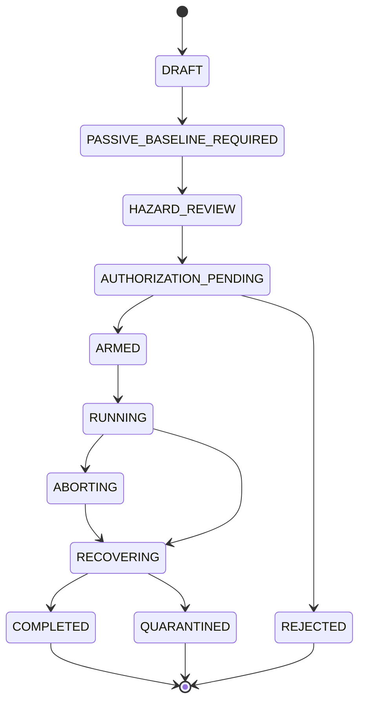

# Black Light FTL Exploration Event & Test Program Field Manual

**Status:** `MIXED` — confirmed family/operator boundaries and source doctrine; derived experimental-engineering framework; proposed instructional and patent-style examples.  
**Role:** authoritative subordinate manual for live exploration events, controlled propulsion/transit testing, hazard/abort envelopes, event replay, and evidence-preserving test execution.  
**Upstream authority:** `docs/blacklight/BLACK_LIGHT_PROPULSION_TRANSIT_AUTHORITY.md`.  
**Machine-readable companion:** `data/exo-vessel/ftl-exploration-event-test-program-registry.json`.  
**Schema:** `data/schemas/exo-vessel-ftl-exploration-event-test-program.schema.json`.  
**Measurement authority:** `data/exo-vessel/ftl-measurement-instrumentation-registry.json`.  
**Evidence authority:** `data/exo-vessel/ftl-evidence-instance-registry.json`.  
**Design source:** Google Drive document **The different lightspeed methods**, document ID `1e0Xp71EFubBZgXWjjvPxAqPoJIZNwqS6nu1-r7Kil7Y`, revision `ANLCKQllC5h6dLaX5H1RpK8aUFVWsi-IV7gbMHUd0Qq7mIe5uGsLFi5_Hrsr8B6dl8t_ezB0fTSygxrnIBtifAHW79bgSbswp1zF3NaEil0`.

---

## 1. Why this manual exists

Black Light already has family physics, machinery doctrine, environmental/gravity treatment, measurement instrumentation, evidence instances, installation archaeology, and forensic classification. What remained missing was the layer that answers a harder operational question:

> **What exactly happened when an investigator touched, powered, calibrated, cut, repaired, stimulated, translated, or tested the machine?**

Without that layer, a technically excellent evidence model still has a provenance hole. A post-test residue can be mistaken for a pre-accident residue. A calibration change can be mistaken for a physical change. A saturated safety channel can be mistaken for a safe channel. A later reconstruction can silently overwrite the observation that existed when the decision was made.

This manual treats every meaningful interaction with a transit installation as an event in an append-only engineering history.

The governing sequence is:

```text
AUTHORITY SNAPSHOT
        ↓
PASSIVE BASELINE
        ↓
TEST QUESTION
        ↓
HAZARD / ABORT PROOF
        ↓
AUTHORIZED ENVELOPE
        ↓
EXECUTION EVENTS
        ↓
POST-TEST RECOVERY
        ↓
PRE/POST COMPARISON
        ↓
EVIDENCE EXPORT
        ↓
FORENSIC INTERPRETATION
```

The event system does not choose the transit family. It documents the experiment well enough that a downstream resolver may eventually distinguish families without inventing evidence.

---

## 2. Authority firewall

Three claims must remain separate:

1. **The transit family has some confirmed physical operator.**
2. **A test is engineered to discriminate or characterize some operator.**
3. **The tested installation actually uses that operator.**

Only the first is family canon by default. The second is experimental design. The third requires evidence or named source authority.

Therefore:

\[
\boxed{\text{test target} \neq \text{family assignment}}
\]

A Fold-oriented diagnostic performed on an unknown derelict does not make the derelict a Fold vessel.

A Q-domain sensor reading does not make it a Phase Displacement vessel.

A biological response to a low-authority stimulus does not establish that the species invented the system.

---

## 3. Event sourcing as engineering chain of custody

The case history is represented as an ordered event sequence:

\[
\mathcal E = \{E_0,E_1,\ldots,E_n\}.
\]

A reconstructed case state is:

\[
S_{n+1}=F(S_n,E_n,A_n),
\]

where:

- \(S_n\) is the case state before event \(n\);
- \(E_n\) is the immutable event payload;
- \(A_n\) is the authority/provenance snapshot that governed interpretation at that time.

A later correction does not rewrite \(E_n\). It appends a superseding event.

```text
E-014 raw acquisition
   ↓
E-015 calibration binding
   ↓
E-016 first interpretation
   ↓
E-027 later calibration defect discovered
   ↓
E-028 interpretation superseded
```

The historical fact that engineers once saw the earlier interpretation remains part of the record. That fact may matter when reconstructing why they made a later decision.

---

## 4. Event integrity

A suitable derived event-chain integrity mechanism is:

\[
h_n=H(h_{n-1}\parallel \operatorname{canon}(E_n)).
\]

This is not exotic physics. It is ordinary provenance discipline.

Its purpose is to detect:

- silent deletion;
- silent reordering;
- silent mutation;
- substitution of a different event payload;
- accidental replay from the wrong history.

Cryptographic details are implementation choices and are not setting canon unless a named system establishes them.

---

## 5. Event classes

The standard event vocabulary includes:

| Event class | Meaning |
|---|---|
| `CASE_INITIALIZED` | authority snapshot and epoch zero established |
| `PASSIVE_BASELINE_STARTED` | untouched measurement interval opened |
| `PASSIVE_BASELINE_COMPLETED` | baseline sealed for later comparison |
| `INSTRUMENT_CALIBRATED` | an exact instrument instance receives a calibration state |
| `REFERENCE_SYNCHRONIZED` | clock/reference ancestry changes |
| `ACCESS_CHANGED` | a sealed, occluded, or inaccessible volume changes state |
| `SAMPLE_COLLECTED` | material removed or captured |
| `SERVICE_TRACE_PERFORMED` | continuity test performed |
| `ARCHIVE_READ` | stored signal/data accessed |
| `TRANSLATION_PERFORMED` | interpretation transform applied |
| `TEST_PLANNED` | candidate controlled experiment recorded |
| `TEST_AUTHORIZED` | bounded envelope admitted |
| `TEST_STARTED` | actual stimulation begins |
| `TEST_CHECKPOINT` | intermediate state recorded |
| `TEST_ABORT_REQUESTED` | abort threshold or command registered |
| `TEST_ABORTED` | active test terminated early |
| `TEST_COMPLETED` | planned stimulation ended |
| `RECOVERY_STARTED` | restoration/reconciliation begins |
| `RECOVERY_COMPLETED` | recovery criteria met |
| `REPAIR_OR_REGROWTH` | installation itself changes |
| `EVIDENCE_EXPORTED` | packets admitted downstream |
| `EVENT_SUPERSEDED` | interpretation/metadata corrected without erasing history |

The vocabulary is deliberately operational rather than narrative.

---

## 6. Epochs

An epoch is a bounded interval during which the installation, instrumentation, calibration, reference state, and evidence contamination state are treated as materially stable for comparison.

A new epoch is normally required after:

- energization;
- cutting;
- opening a sealed volume;
- atmosphere exchange;
- coolant/nutrient injection;
- field excitation;
- biological regrowth;
- structural repair;
- clock replacement;
- synchronization to a new reference;
- sensor replacement;
- software or decoder change that alters raw-to-normalized transformation;
- destructive sampling.

```text
EPOCH 0  untouched derelict baseline
   ↓ access breach
EPOCH 1  atmosphere and contamination changed
   ↓ bounded energization
EPOCH 2  field / thermal state changed
   ↓ biological repair
EPOCH 3  geometry and metabolic state changed
```

A post-regrowth measurement cannot be silently backdated into Epoch 0.

---

## 7. Test planning as constrained information gathering

A useful derived utility function is:

\[
U_T=
\frac{IG(T)}
{1+\lambda_hH_T+\lambda_cC_T+\lambda_sS_T+\lambda_dD_T+\lambda_rR_T}.
\]

Where:

- \(IG(T)\): expected information gain;
- \(H_T\): personnel/system hazard;
- \(C_T\): evidence contamination cost;
- \(S_T\): emitted signature cost;
- \(D_T\): destructive cost;
- \(R_T\): recovery burden.

The \(\lambda\) terms are scenario weights, not universal physical constants.

The point is not that every Black Light engineer literally uses this exact equation. The point is that **information is not free**.

A spectacular test that destroys the only intact alien field-former may be scientifically worse than a slower passive program.

---

## 8. Test lifecycle



A system can be physically quiet and still remain `RECOVERING` or `QUARANTINED`.

`TEST_COMPLETED` is not the same thing as `RETURN_TO_SERVICE`.

---

## 9. Required test-plan content

A properly admitted plan records at minimum:

| Field | Question answered |
|---|---|
| test ID | which exact experiment? |
| case/subject | on what installation? |
| question | what uncertainty is being reduced? |
| hypotheses affected | which interpretations change if response is seen? |
| expected observables | what should actually move? |
| instrument plan | how is it measured? |
| baseline references | what is the untouched comparison state? |
| stimulus envelope | what may the controller command? |
| hazard envelope | which limits must never be crossed? |
| hard abort conditions | what ends the test immediately? |
| recovery plan | how is the installation returned to an admissible state? |
| protected reserve | what energy/control authority is untouchable? |
| contamination forecast | what evidence may be overwritten? |
| signature forecast | what may outsiders detect? |
| authority mode | `AUTHORITY_ONLY`, `LABELED_DERIVATION`, or `LABELED_PROPOSAL` |
| provenance plan | how does every observation remain traceable? |

If a plan cannot explain how it stops, it is not ready to explain what it measures.

---

## 10. Hazard vector

Transit testing crosses multiple physical domains, so hazard should not collapse into one scalar too early.

A useful representation is:

\[
\mathbf h=
[
H_p,
H_s,
H_t,
H_f,
H_g,
H_{top},
H_r,
H_b,
H_c,
H_e,
H_{sig},
H_i
]^T
\]

representing personnel, structural, thermal, field, gravitational, topological, reference, biological, contamination, evidence-loss, signature, and infrastructure hazards.

A derived risk aggregation is:

\[
R_T=\sum_i P_iC_iX_i.
\]

Here \(X_i\) represents exposure and recoverability.

An unknown \(P_i\) is not zero.

---

## 11. Unknown-family test safety

An unknown derelict presents a special problem: the very test intended to identify the drive might excite a mechanism whose hazard model is still unknown.

The safe active envelope should therefore be constrained by all still-admissible families.

If \(\mathcal A_f\) is the supported safe active-test set for family hypothesis \(f\), then before family identification:

\[
\mathcal A_{unknown}
\subseteq
\bigcap_{f\in F_{admissible}}\mathcal A_f.
\]

If that intersection is empty, the correct active-test authority is empty.

The investigation returns to passive observation, archive recovery, access improvement, or external infrastructure.

---

## 12. Abort reachability

A transit test is not safe merely because a shutdown command exists.

The question is whether the system can still reach an acceptable state after the command is issued.

Let \(A(t)\) denote the set of states from which shutdown plus passive decay/recovery can remain within hard limits.

Then the test controller must remain inside the verified abort-reachable set.

The minimum useful abort horizon is:

\[
T_{abort}
\ge
 t_{detect}
+t_{validate}
+t_{command}
+t_{actuate}
+t_{decay}
+t_{margin}.
\]

A technology whose hazardous state can grow faster than this chain can respond cannot be safely tested at that authority level.

This implements the design-source principle that more advanced transit machinery demands correspondingly more advanced safety sensing and earlier detection.

---

## 13. Observability is part of safety

A hard limit cannot be guarded by a channel that is no longer trustworthy.

Therefore:

\[
\boxed{
\text{guard-channel loss}
\Rightarrow
\text{abort condition}
}
\]

unless a validated independent channel remains.

Guard loss includes:

- saturation;
- clipping;
- aliasing;
- reference desynchronization;
- sensor damage;
- registration loss;
- bandwidth overrun;
- software/decoder failure;
- biological sensor incoherence.

This is distinct from the guarded physical quantity actually crossing its limit.

---

## 14. Protected recovery reserve

Transit systems frequently require energy, field authority, topology control, reference continuity, or state-reconciliation capacity specifically to stop safely.

The reserve is therefore protected:

\[
R_{protected}>0.
\]

And:

\[
R_{available,test}
=
R_{total}-R_{protected}.
\]

The experiment optimizer cannot spend the final unwind, detachment, closure, recoupling, return-map, rejection, or reconciliation capacity merely to obtain a cleaner signal.

---

## 15. Pre/post comparison

The simplest comparison,

\[
\Delta y=y_{post}-y_{pre},
\]

is often wrong because the world changes even without the test.

A better derived model is:

\[
\Delta y=
y_{post}-M(y_{pre},\Delta t,\mathcal E),
\]

where \(M\) estimates expected passive evolution under elapsed time and environment \(\mathcal E\).

Examples include:

- cooling;
- radioactive or exotic-field decay where applicable;
- biological metabolism;
- corrosion;
- regrowth;
- ambient gravity change;
- reference drift;
- orbital motion;
- network background traffic.

The test is not automatically the cause of every difference between epochs.

---

## 16. Comparison covariance

When pre- and post-test estimates share calibration or processing ancestry, their errors are correlated.

A useful covariance treatment is:

\[
\Sigma_{\Delta}
=
\Sigma_{post}
+J_M\Sigma_{pre}J_M^T
-2\,\operatorname{Cov}(post,M(pre)).
\]

Ignoring the covariance term can make a weak difference appear artificially precise.

This is particularly dangerous when both states depend on:

- one damaged clock;
- one spatial registration frame;
- one translation model;
- one gravimetric baseline;
- one common interferometer reference;
- one reconstructed alien calibration table.

---

## 17. Null results

A null response is not automatically evidence against a hypothesis.

Before accepting a null, verify:

\[
\text{stimulus reached target}
\land
\text{response in bandwidth}
\land
\text{response in dynamic range}
\land
\text{resolution sufficient}
\land
\text{expected marker survived}.
\]

If any term is unresolved, the result remains unresolved or weak.

---

## 18. Gravity-sensitive testing

The design source requires the transit families to react differently to gravitational environment and high-gravity proximity.

Therefore every active test that might couple to route geometry or exotic fields binds an environmental gravity packet containing, where measurable:

\[
\mathcal E_g=
\{\Phi,\nabla\Phi,H(\Phi),\dot{\nabla\Phi},\Sigma_g\}.
\]

The family-specific response remains:

\[
C_g^{(f)}=F_f(\mathcal E_g,\text{Path},\text{installation}).
\]

There is no universal `gravityPenalty` coefficient.

Likewise there is no universal safe radius from stars or planets unless a named system establishes one.

---

## 19. Family-specific active-test safeguards

### 19.1 Metric Compression Envelope

Guard:

- local metric strain;
- curvature/tidal loading;
- field symmetry;
- protected-volume coverage;
- unwind reserve.

A metric experiment must account for field decay/unwind time. “Power off” is not necessarily “geometry normal.”

High gravitational distortion can increase required control authority and model error without a universal coefficient.

### 19.2 Gravitational-Plane Skimmer

Guard:

- gravity tensor;
- evolving shear structure;
- bifurcation/fork geometry;
- coupling load;
- recoupling authority.

A shear fork is a family-defining danger because a vessel can be subjected to divergent gravitational route geometry.

A test that cannot detect the fork before its own coupling response time is inadmissible.

### 19.3 Slipstream Shear

Guard:

- boundary adhesion;
- whole-hull coupling coverage;
- Q-weather proxy where available;
- detachment margin;
- wake/residue contamination.

Any stronger coupling requires a verified path back to detached ordinary-space state.

### 19.4 Q-Lattice Translation

Guard:

- address authenticity;
- epoch alignment;
- clock/reference ancestry;
- state-index ambiguity;
- rejection/recovery authority.

A beautifully stable signal attached to the wrong address is not safe.

### 19.5 N-Manifold Drive

Guard:

- route-state inference;
- embedding validity;
- higher-dimensional model residual;
- return-map conditioning;
- re-embedding reserve.

A route discovery without a return proof is not a successful test plan.

### 19.6 Fold-Jump

Guard:

- whole protected-volume topology;
- endpoint covariance;
- occupancy exclusion;
- topology-solution stability;
- hard commit boundary;
- closure/recovery reserve.

Exploratory tests remain precommit unless the entire family-specific proof chain is complete.

### 19.7 Anchored Wormhole / Gate

Guard:

- paired-mouth synchronization;
- throat margin;
- anchoring;
- mass flux;
- chronology protection;
- closure reserve.

One mouth cannot certify the state of the pair by inference alone.

### 19.8 Quantum Phase Displacement

Guard:

- whole-object state coverage;
- target-state compatibility;
- target authorization;
- continuity invariants;
- target occupancy;
- reconciliation reserve.

Passing engineering continuity tests must never be rewritten as metaphysical proof of identity.

---

## 20. Technology-basis embodiments

The event/test layer is intentionally mechanism-neutral but not machinery-neutral.

The established operative technology bases can implement the same experimental functions differently.

| Basis | Example test/control embodiment | Maintenance consequence |
|---|---|---|
| terrestrial/mechanical | isolated sensor racks, fiber/clock buses, breaker-style abort channels | calibration, connector, bus, coolant, actuator service |
| aquatic/pressure-adapted | pressure-balanced sensor bladders, fluidic field interfaces, distributed acoustic timing | pressure seal and fluid chemistry are calibration variables |
| cryogenic | superconductive sensing loops, cryogenic references, low-noise field monitors | temperature excursion can invalidate calibration ancestry |
| gas-giant/aerostat | membrane arrays, tensioned distributed sensors, electrostatic timing nodes | geometry and tension state enter registration uncertainty |
| biological | cultivated sensory tissue, neural integration organs, metabolic actuator limits | healing changes geometry and may require recertification |
| mineral/crystalline | resonant lattice sensors, prestressed reference crystals, structural metrology | fracture and stress history can alter reference response |
| field-mediated/postmaterial | distributed coherent nodes and programmable reference fields | reference coherence itself becomes a service dependency |

These embodiments are `DERIVED` unless a named source establishes them.

They do not establish race ownership.

---

## 21. Living-machine test doctrine

Biological systems make intervention history unusually important.

A living transit organ may:

- metabolize away a residue;
- scar;
- regrow;
- reroute circulation;
- restore function with changed geometry;
- change neural connectivity;
- reject an implanted test lead;
- alter local chemistry after sampling.

Therefore:

\[
\boxed{\text{healed}\neq\text{same geometry}\neq\text{recertified}}
\]

A successful healing event produces a new epoch.

---

## 22. Race- and manufacturer-specific doctrine

Specific named civilization, race, manufacturer, vessel, or installation authority may define:

- preferred safety margins;
- instrument architecture;
- control style;
- maintenance organization;
- acceptable test philosophy;
- independent abort doctrine;
- service intervals;
- proprietary reference formats;
- training vocabulary;
- signature-management practice.

But this manual cannot invent those details merely because the generic framework has a slot for them.

Where no source exists, the correct value is `UNRESOLVED`, or a clearly labeled derived/proposed implementation when the selected authority mode permits it.

---

## 23. Control architecture

A safe active test separates at least four authorities where practical:

```text
               TEST SUPERVISOR
                     |
              authorized envelope
                     v
  OBSERVATION ---> TEST CONTROLLER ---> STIMULUS
       |                 |
       |                 v
       |            local limiters
       |                 |
       +----> HARD ABORT LOGIC <---- independent guards
                         |
                         v
                    RECOVERY PATH
```

The optimizer may choose *within* the envelope.

The abort system protects the envelope.

The test controller does not get to redefine the envelope because the data look interesting.

---

## 24. Independent abort channels

A dangerous common-mode design is:

```text
same sensor
   ↓
same clock
   ↓
same processor
   ├── says test is safe
   └── decides whether to abort
```

A stronger design is:

```text
PRIMARY ESTIMATOR -------------------> test control

INDEPENDENT GUARD SENSOR ---> hard abort path
        separate reference
        separate threshold logic
```

Complete physical independence is not always possible, especially on alien wrecks, but shared ancestry must be explicit.

---

## 25. Power architecture

Test power should be decomposed into:

\[
P_{test}=P_{stim}+P_{sense}+P_{control}+P_{thermal}+P_{support}.
\]

Recovery capacity is separate:

\[
E_{recovery,protected}>0.
\]

Observation power should be isolated where possible so that a prime-mover transient does not simultaneously corrupt the instruments needed to interpret it.

If the test causes a bus brownout, the event record must distinguish:

- commanded stimulus;
- measured delivered stimulus;
- instrument power quality;
- resulting physical response.

The command waveform is not evidence that the machinery received that waveform.

---

## 26. Navigation/reference dependencies

A test involving routes, endpoints, addresses, gates, topology, or nonlocal targets must bind its reference inputs explicitly.

Examples include:

- ephemeris revision;
- clock root;
- gravity map epoch;
- destination survey;
- Q-address authority;
- gate-pair state;
- beacon identity;
- target-state model;
- local geometry registration.

A reference may be precise and still be stale.

A reference may be internally consistent and still descend from one corrupted source.

---

## 27. Maintenance and recertification

The following changes normally invalidate at least part of a test certificate:

- sensor replacement;
- cable/service rerouting;
- clock source change;
- calibration change;
- software/decoder update;
- hull or field-former geometry change;
- tissue regrowth;
- coolant/nutrient chemistry change;
- power-conditioning replacement;
- repair to the independent abort path.

A recertification need not repeat every historical test. It must repeat enough to prove that the changed dependency still satisfies its required invariant.

---

## 28. Signature cost

Active tests can reveal the investigator or overwrite the evidence being sought.

A family-aware signature vector may include:

\[
\mathbf S=
[
S_{EM},
S_{thermal},
S_g,
S_Q,
S_{topology},
S_{bio},
S_{chem},
S_{wake},
S_{traffic},
S_{recovery}
]^T.
\]

The test plan records expected signature channels and observation geometry.

A clandestine salvage team may rationally prefer a lower-information passive test over a bright active pulse.

---

## 29. Scaling

Testing burden is not simply proportional to vessel mass.

A useful derived abstraction is:

\[
B_{test}=F(V,A,N_s,N_r,N_h,BW,\tau,\mathcal E),
\]

where:

- \(V\): effect volume;
- \(A\): relevant boundary/coverage area;
- \(N_s\): sensor/service nodes;
- \(N_r\): independent references;
- \(N_h\): hard hazard dimensions;
- \(BW\): transient bandwidth;
- \(\tau\): response/decay timescales;
- \(\mathcal E\): environment.

A huge gate complex can demand more synchronization and causal tracing than a compact shipboard drive even if its average energy density is lower.

A biological whole-hull field organ can require more spatial recertification after repair than a compact mechanical prime mover.

---

## 30. Replay

A complete event log supports deterministic replay of engineering state.

Given:

- initial authority snapshot;
- initial evidence state;
- event sequence;
- resolver version;
- persisted non-deterministic inference outputs;
- deterministic seeds where used;

replay should reconstruct the same state.

```text
E0 -> E1 -> E2 -> E3 -> CURRENT STATE
             \
              \-- superseding interpretation event later
```

A replay engine is not allowed to call a newer model and silently reinterpret an old raw packet differently unless that reinterpretation is itself appended as a new event.

---

## 31. Counterfactual planning branches

Engineers need to ask “what if we energize this node?” without pretending they actually did it.

Therefore planning branches are marked `SANDBOX`.

```text
AUTHORITATIVE HISTORY
E0 -> E1 -> E2
            |
            +---- SANDBOX: simulated test A
            |
            +---- SANDBOX: simulated test B
```

A sandbox branch can inform a future real test plan.

It cannot be merged into evidence without a real execution event.

---

## 32. Narrative disclosure control

The event system also protects narrative integrity.

At Epoch 3, if the engineering state says:

```text
candidate families: fold-jump, wormhole-gate
unknown: transit prime mover function
```

then player-facing output may describe:

- paired annular structures;
- a damaged timing network;
- topology-like interferometric residue;
- high-capacity field power routes.

It may not label the room “the Fold chamber” merely because a later Epoch 10 test eventually proves Fold-Jump.

Replay must respect knowledge available at the replayed epoch.

---

## 33. Practical Manual ET-01 — Immutable Event Ledger Initialization

### Purpose

Establish a case history before intervention.

### Preconditions

- subject identified as far as authority permits;
- authority snapshot captured;
- current time/reference roots recorded;
- current accessibility state recorded.

### Procedure

1. Assign `caseId` and `subjectId`.
2. Bind the current authority snapshot.
3. Create `EPOCH-0`.
4. Record initial spatial frame and uncertainty.
5. Record clock/reference ancestry.
6. Record investigator equipment inventory without treating it as subject equipment.
7. Start passive baseline events.
8. Seal the initial event hash/state.

### Failure conditions

- no reliable clock ancestry;
- subject identity conflated with speculative classification;
- intervention occurred before baseline and was not logged.

### Output

A replayable Epoch-0 case state.

---

## 34. Practical Manual ET-02 — Transit Test Plan Admission

### Purpose

Determine whether a proposed active test deserves to exist.

### Procedure

1. State the uncertainty to be reduced.
2. Identify which hypotheses the test can distinguish.
3. List expected measurable responses.
4. Prove instrument capability and calibration.
5. Capture passive baseline references.
6. Define exact stimulus envelope.
7. Enumerate hazard dimensions.
8. Define hard abort thresholds and guard channels.
9. Calculate/estimate abort latency.
10. Protect recovery reserve.
11. Estimate contamination and signature cost.
12. Reject tests whose discriminating value does not justify their irreversible cost.
13. Enter `TEST_AUTHORIZED` only after the envelope is explicit.

### Common rejection reasons

- cannot prove safe shutdown;
- family uncertainty leaves no safe common active envelope;
- expected response is below measurement resolution;
- active test would destroy unique passive evidence;
- recovery state cannot be verified.

---

## 35. Practical Manual ET-03 — Abort Envelope Certification

### Purpose

Prove that an active test can stop soon enough.

### Required timing chain

\[
T_{abort}
=t_d+t_v+t_c+t_a+t_x+t_m.
\]

Where detection, validation, command, actuation, decay, and margin are separately recorded.

### Procedure

1. Identify hard physical limits.
2. Identify guard sensor for each limit.
3. Identify guard sensor ancestry and independent fallback.
4. Measure or bound detection latency.
5. Measure command/actuator latency.
6. Bound physical decay/unwind time.
7. Verify protected recovery reserve.
8. Compare total abort horizon with worst credible test-state growth.
9. Reduce authorized stimulus until reachability is demonstrated.
10. Reject if no useful safe envelope remains.

---

## 36. Practical Manual ET-04 — Instrument Instance Calibration Record

### Purpose

Bind a measurement to the exact thing that measured it.

### Record

- instrument instance ID;
- class;
- physical location;
- orientation/registration;
- serial/genetic/crystalline/reference identity where meaningful;
- clock ancestry;
- calibration source;
- zero/gain/bandwidth/dynamic range;
- known damage;
- repair history;
- software/decoder version;
- calibration epoch;
- uncertainty components.

If a living sensory organ heals during the investigation, it becomes a new calibration state even if its name remains unchanged.

---

## 37. Practical Manual ET-05 — Pre/Post State Comparison

### Purpose

Determine what the test actually changed.

### Procedure

1. Select pre-test packets from the correct baseline epoch.
2. Select post-test packets after known recovery interval.
3. Model expected passive evolution.
4. Bind environmental differences.
5. Track shared calibration/reference ancestry.
6. Compute or qualitatively assess covariance.
7. Separate test-correlated change from unrelated drift.
8. Mark unresolved causal alternatives.
9. Export only the comparison claims supported by the evidence.

### Prohibited shortcut

`post != pre` does not mean `test caused difference`.

---

## 38. Practical Manual ET-06 — Test Abort and Recovery

### Purpose

Capture the entire failure-response chain rather than recording only “test aborted.”

### Record

```text
initiating condition
        ↓
detection channel
        ↓
threshold validation
        ↓
abort request
        ↓
controller response
        ↓
actuator response
        ↓
physical decay / detachment / unwind / closure
        ↓
protected reserve consumed
        ↓
residual state
        ↓
recovery verification
```

A delayed abort may reveal more about the control system than the original test did.

---

## 39. Practical Manual ET-07 — Replay and Supersession Audit

### Purpose

Verify that the current engineering picture can be reconstructed from recorded history.

### Procedure

1. Start from the original case snapshot.
2. Replay immutable events in order.
3. Apply supersession events only at their historical positions.
4. Verify event-chain integrity.
5. Compare reconstructed state with current persisted state.
6. Identify missing, reordered, or silently edited records.
7. Verify that downstream evidence references valid event/epoch IDs.
8. Verify that player-facing historical views do not leak later knowledge.

---

## 40. Practical Manual ET-08 — Forensic Export Gate

### Purpose

Prevent live test artifacts from entering the family classifier without context.

An export packet must retain:

- event ID;
- epoch;
- raw observation ancestry;
- instrument instance;
- calibration state;
- reference ancestry;
- damage context;
- intervention context;
- pre/post comparison status;
- covariance group;
- detectability limits;
- current canon status.

The forensic resolver receives evidence, not an experimenter's preferred answer.

---

## 41. Worked example — unknown biological transit machinery

**Status:** `PROPOSED` teaching example. It is not Ar'nock historical canon.

Investigators find a biologically fabricated chamber with a dense timing network and annular tissue geometry.

### Epoch 0

Passive measurements show:

```text
annular living tissue                    detected
shared timing network                    detected
weak topology/metric phase residual      unresolved
large power route                         detected
family identity                           unresolved
```

A naive team wants to inject power because the geometry “looks Fold-like.”

The proper system rejects that reasoning.

### Candidate safe test

A sub-threshold timing stimulus is proposed with no prime-mover power.

Expected information:

- whether timing network is coherent;
- whether tissue responds as one distributed control organ;
- whether reference ancestry branches locally.

It does **not** attempt a fold.

### Hazard review

The test has low thermal and field hazard, but some evidence-contamination risk because neural/timing tissue may rewrite state.

The plan therefore captures a full raw baseline before stimulation.

### Result

The timing tissue phase-locks across the chamber, but no family-discriminating topology response is above resolution.

Correct conclusion:

```text
CONFIRMED/DERIVED observation:
coherent distributed timing response exists.

UNRESOLVED:
FTL family.
```

Incorrect conclusion:

```text
"Fold controller confirmed."
```

---

## 42. Worked example — gravitational-plane fork safety

**Status:** `PROPOSED` teaching example.

A known Gravitational-Plane test article is being certified near a complex multi-body gravity environment.

The route predictor finds two comparable shear continuations.

The decision variable is not merely route efficiency.

Define a fork-separation state:

\[
\Delta g_f(t)=\|g_1(t)-g_2(t)\|.
\]

A test guard monitors both the growth of \(\Delta g_f\) and the vessel's coupling authority.

If the predicted time to a destructive divergence falls below the verified recoupling horizon, the test aborts before the plane split becomes dynamically dominant.

This directly implements the source doctrine that gravitational-plane systems can be exceptionally sensitive to bifurcated shear geometry.

No universal numeric fork threshold is canonized.

---

## 43. Worked example — silent saturation accident

**Status:** `PROPOSED` teaching accident.

A field test uses one interferometric channel both to estimate effect magnitude and to guard the abort threshold.

As stimulus rises, the channel saturates.

Because the normalized display freezes at its last valid value, the controller interprets the flat signal as stable behavior.

The actual field continues increasing.

The lesson is:

\[
\boxed{\text{loss of observability} \neq \text{stable state}}
\]

Modern derived procedure therefore treats guard-channel saturation as an abort event unless an independent valid guard remains.

---

## 44. Educational curriculum — introductory

### Course: Transit Experimental Practice I

Core topics:

- observation versus intervention;
- event and epoch concepts;
- chain of custody;
- calibration ancestry;
- dynamic range and saturation;
- hard versus soft limits;
- shutdown versus recovery;
- family-specific gravity sensitivity;
- unknown-family test discipline.

### Laboratory exercises

1. Reconstruct a damaged event history from superseding records.
2. Identify correlated sensors sharing one clock.
3. Design a passive test that distinguishes geometry from function.
4. Build an abort timing budget.
5. Determine whether a null result is actually informative.

---

## 45. Educational curriculum — advanced

### Course: Safe Identification of Exotic Transit Systems

Topics include:

- partially observed nonlinear state estimation;
- robust experiment design;
- reachability and viability kernels;
- multi-objective information gain;
- causal inference across intervention epochs;
- covariance propagation;
- distributed clocks and reference ancestry;
- evidence-preserving control;
- family-uncertain active testing;
- replayable provenance systems.

A final project should require students to design a test program that **refuses** at least one tempting experiment because the evidence cannot support safe execution.

---

## 46. Thesis and research directions

The following are `DERIVED` or `PROPOSED` research programs, not setting-historical facts:

### 46.1 Abort-envelope reachability for metric systems

Develop robust bounds for systems whose field decay remains coupled to changing environmental curvature.

### 46.2 Shear-fork forecast horizons

Estimate how far ahead Gravitational-Plane safety systems must resolve evolving multi-body gradient bifurcations.

### 46.3 Evidence destruction as an optimization cost

Formalize the value of unique passive residue and incorporate its expected destruction into test scheduling.

### 46.4 Common-mode reference failure

Develop graph-theoretic metrics for apparently redundant sensor arrays that secretly share one clock, archive, calibration, or controller.

### 46.5 Biological recertification after regrowth

Determine which geometrical, neural, field, and metabolic invariants must be re-established after living transit machinery heals.

### 46.6 Safe adaptive family discrimination

Construct experiment policies that reduce a candidate-family set while guaranteeing that no step exceeds the common safe envelope of all remaining hypotheses.

---

## 47. Patent-style development concepts

These are explicitly `PROPOSED` examples.

### Reference-Ancestry-Isolated Abort Controller

A hard-abort system whose guard sensor, clock, power path, and decision logic are independently rooted from the primary experiment estimator.

### Evidence-Preserving Low-Authority Excitation Sequencer

A controller that chooses the smallest stimulus expected to produce discriminating information while maintaining an explicit contamination budget.

### Epoch-Sealed Field Recorder

A recorder that seals raw pre-intervention channels, calibration state, reference ancestry, and geometry registration before active testing can begin.

### Biological Geometry Recertification Lattice

A distributed metrology system intended to detect whether regrowth changed a living field-former's calibrated geometry even when gross function appears restored.

None of these concepts are assigned to a civilization or manufacturer without source support.

---

## 48. Generator semantics

The generator must distinguish:

```text
planned test
simulated test
authorized test
executed test
aborted test
completed stimulation
completed recovery
returned to service
```

These states are not synonyms.

It must also distinguish:

```text
question under test
family hypothesis
family classification
named-source canon
```

A generated document may say:

> “The team planned a Fold-discriminating topology test.”

It may not conclude:

> “The vessel had a Fold drive.”

unless the authoritative evidence state already supports that classification.

---

## 49. API contract

### Planner

```text
planTransitExplorationTest(context)
```

Inputs:

```text
authoritySnapshot
caseState
evidenceInstance
candidateFamilies
instrumentInstances
question
missionConstraints
authorityMode
```

Outputs:

```text
admissionState
testPlan
hazardEnvelope
abortEnvelope
instrumentPlan
expectedInformationGain
contaminationForecast
signatureForecast
canonWarnings
```

### Event application

```text
applyTransitExplorationEvent(context, event)
```

Outputs:

```text
eventRecord
newEpoch
stateMutation
observationPackets
abortState
recoveryState
provenanceUpdates
canonWarnings
```

### Replay

```text
replayTransitExplorationCase(context)
```

Outputs:

```text
reconstructedCaseState
eventIntegrityWarnings
supersessionMap
authoritySnapshotHistory
evidenceInstanceState
```

### Comparison

```text
compareTransitTestEpochs(context, preEpoch, postEpoch)
```

### Export

```text
exportTransitEvidencePackets(context)
```

Mandatory invariant:

```text
familyAutoSelection = false
```

---

## 50. Example event

```json
{
  "eventId": "EVT-0042",
  "caseId": "CASE-UNKNOWN-001",
  "subjectId": "UNKNOWN-INSTALLATION-001",
  "eventType": "TEST_CHECKPOINT",
  "epochBefore": "EPOCH-2",
  "epochAfter": "EPOCH-2",
  "timeReference": "local-independent-clock-A",
  "spatialReference": "compartment-C17",
  "actorOrController": "bounded-test-controller-01",
  "instrumentRefs": ["interferometer-01", "guard-gravimeter-02"],
  "inputRefs": ["TEST-0007", "BASELINE-0007"],
  "rawOutcome": "guard channel valid; weak coherent residual observed; response below family-discriminating threshold",
  "stateMutation": "none beyond authorized reversible excitation",
  "provenanceGroup": "PG-TEST-0007",
  "status": "DERIVED"
}
```

This event does not carry a family assignment.

---

## 51. Example test-plan display

```text
TEST ID        TEST-0007
QUESTION       Does node C17 participate in the timing/control network?
FAMILY RESULT  Not evaluated by this layer
STIMULUS       timing-only, no prime-mover power
BASELINE       valid / sealed
GUARD CHANNELS gravimetric, thermal, timing-coherence
ABORT HORIZON  certified for authorized envelope
RECOVERY       passive return + verification
CONTAMINATION  low but non-zero; neural state may change
STATUS         ARMED
```

The display must permit expansion into full provenance.

---

## 52. Failure reporting

“Test overload” is not an adequate root cause.

A useful event-oriented failure report separates:

1. initiating physical cause;
2. prediction/model error;
3. detection performance;
4. reference/calibration state;
5. command decision;
6. actuator response;
7. abort response;
8. recovery response;
9. evidence contamination;
10. remaining uncertainty.

A failure can therefore reveal that the prime mover behaved correctly while the guard sensor saturated, or that the abort command was correct but the field decay was slower than the model predicted.

---

## 53. Infrastructure models

### Field salvage

Expected characteristics:

- limited external power;
- shorter sensor baselines;
- incomplete access;
- weak containment;
- conservative active envelope;
- high evidentiary value of untouched residues.

### Dedicated test range

Expected capabilities:

- exclusion volume;
- isolated power;
- independent reference clocks;
- long-baseline sensors;
- remote shutdown;
- casualty containment;
- recovery assets;
- environmental characterization.

### Gate or station complex

May additionally require:

- traffic isolation;
- paired-site coordination;
- infrastructure authority;
- mass-flux scheduling;
- remote anchor state;
- chronology protection where applicable.

Infrastructure improves what can safely be proven. It does not change unsourced canon.

---

## 54. Provenance chain

Every admitted test-derived claim should be traceable through:

```text
SOURCE AUTHORITY SNAPSHOT
          ↓
TEST QUESTION / AUTHORIZATION
          ↓
INSTRUMENT INSTANCE + CALIBRATION
          ↓
IMMUTABLE EXECUTION EVENT
          ↓
RAW OBSERVATION PACKET
          ↓
NORMALIZATION / COMPARISON
          ↓
EVIDENCE-INSTANCE ADMISSION
          ↓
FORENSIC INTERPRETATION
```

Skipping a layer should be visible, not silently repaired by prose.

---

## 55. Independence and duplicated evidence

Multiple event records do not imply multiple independent observations.

The following can create common ancestry:

- one physical sensor feeding several displays;
- one clock feeding several instruments;
- one calibration table used by several arrays;
- one archive copied into several databases;
- one translation model applied to several excerpts;
- one field event leaving several correlated residues;
- one controller generating several telemetry channels.

The event ledger records multiplicity.

The provenance graph determines independence.

---

## 56. Canon promotion

This manual can generate plausible technical depth indefinitely without converting that depth into setting history.

The safe ladder is:

```text
CONFIRMED source/operator
        ↓
DERIVED engineering requirement
        ↓
DERIVED test procedure
        ↓
PROPOSED teaching accident / patent / thesis
        ↓
UNRESOLVED inventor / civilization / date unless sourced
```

A generated accident does not become historical because several manuals refer to it.

A proposed patent does not become a named manufacturer's product because a module generator emitted it.

---

## 57. Canon safeguards

1. Preserve named and published canon over generator output.
2. Keep unresolved transit families unresolved until evidence or higher authority establishes them.
3. Do not infer race ownership from machinery basis or interface aesthetics.
4. Do not equate a family-oriented test with family identification.
5. Do not infer absence from a saturated, clipped, damaged, uncalibrated, aliased, or out-of-coverage sensor.
6. Do not merge pre- and post-intervention evidence as if simultaneous.
7. Do not consume protected recovery reserve for additional information gain.
8. Do not invent universal gravity coefficients, safe radii, abort times, route constants, or failure probabilities.
9. Do not count copied or shared-source observations as independent confirmations.
10. Do not rewrite raw historical events because a later interpretation improved.
11. Do not let sandbox simulations enter the authoritative event chain as executed history.
12. Do not reveal later hidden information in earlier replay/narrative epochs.
13. Do not report stimulation completion as recovery completion.
14. Do not report recovery completion as return-to-service certification unless required invariants were actually reverified.
15. Do not turn derived textbooks, thesis topics, patents, diagrams, or teaching accidents into historical canon.

---

## 58. Integration position

This layer sits between measurement capability and evidence interpretation:

```text
PROPULSION / TRANSIT AUTHORITY
            ↓
FAMILY TECHNICAL VOLUMES
            ↓
ENVIRONMENT / GRAVITY MODELS
            ↓
MEASUREMENT & INSTRUMENTATION
            ↓
EXPLORATION EVENT / TEST PROGRAM   ← this manual
            ↓
EVIDENCE INSTANCE
            ↓
INSTALLATION ARCHAEOLOGY
            ↓
FORENSIC FAMILY IDENTIFICATION
            ↓
GENERATOR / NARRATIVE PRESENTATION
```

It repairs the authority-chain gap between “an instrument can measure this” and “this observation exists in the case record.”

---

## 59. Engineering principle

The central rule is simple:

> **A transit experiment is not merely a way to obtain an answer. It is an event that changes the machine, the evidence, the risk state, and sometimes the investigator's ability to ask the next question.**

A believable interstellar engineering corpus therefore records not only what scientists eventually learned, but how they learned it, what they risked, what they changed by looking, what they could still undo, and which claims remained uncertain even after generations of better instruments.
