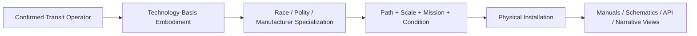
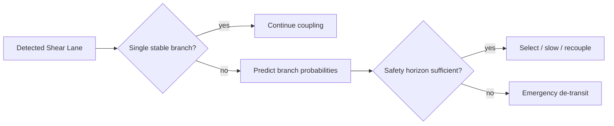

# Black Light FTL Family × Technology-Basis Engineering Atlas

**Status:** subordinate engineering, education, maintenance, and generator reference.  
**Authority:** `BLACK_LIGHT_PROPULSION_TRANSIT_AUTHORITY.md` remains the integration authority. Specific surviving race/manufacturer/named-system canon outranks this document. Basis-specific embodiments below are `DERIVED` unless independently sourced.  
**Machine-readable source:** `data/exo-vessel/ftl-family-basis-embodiment-registry.json`.  
**Legacy design source:** Google Drive document **“The different lightspeed methods”**, current retrieved revision `ANLCKQllC5h6dLaX5H1RpK8aUFVWsi-IV7gbMHUd0Qq7mIe5uGsLFi5_Hrsr8B6dl8t_ezB0fTSygxrnIBtifAHW79bgSbswp1zF3NaEil0`.

---

## 1. The governing separation

Every Black Light transit installation has four distinct layers:



The first layer answers **what happens to space, topology, state, or trajectory**. The second answers **what the machinery is made of and how it works physically**. The third answers **whose engineering tradition shaped it**. The fourth determines how mature, large, redundant, safe, and mission-specific the installation has become.

A biological Fold-Jump and a terrestrial Fold-Jump therefore solve the same topological adjacency problem, but they do not possess the same machine halls, control buses, maintenance tools, signatures, or failure anatomy.

---

## 2. Universal response equation

For a family solution `R_family` evaluated against environment `E`, Path/tier `P`, and vessel state `V`, the realized machine can be represented as

\[
R_{instance}=T_{basis}\left(T_{race}\left(R_{family}(E,P,V)\right),S,C\right)
\]

where `S` is scale and `C` is condition/degradation.

The practical upgrade vector remains

\[
U=(M,F,A,S,E,N,D,C,R,I)
\]

for mathematical sophistication, field control, active materials, structure, energy, navigation, drive distribution, control bandwidth, recovery, and infrastructure.

A higher tier is valid only when at least one changed term in `U` explains a changed mathematical or physical limit.

---

## 3. The eight true FTL operators

| Family | Mathematical object manipulated | Primary solved quantity |
|---|---|---|
| Metric Envelope | effective local metric `γ_eff` | reduced proper route length under safe closure |
| Gravitational-Plane Skimmer | existing geodesic/equipotential structure | minimum-cost gravitational route |
| Slipstream Shear | Q-boundary flow/adhesion state | attainable displacement while maintaining phase match |
| Q-Lattice Translation | discrete address/epoch graph | valid cell sequence / state address |
| N-Manifold | higher-dimensional metric `g_AB` | shorter admissible geodesic plus valid return map |
| Fold-Jump | topology between endpoint volumes | temporary adjacency with certified endpoint exclusion |
| Wormhole/Gate | maintained multiply connected topology | stable throat, synchronized mouths, throughput |
| Phase Displacement | macroscopic state map `J` | compatible target state preserving required continuity |

These are not interchangeable speed equations.

---

## 4. Metric Compression Envelope

### Mathematics

\[
D_{eff}=\int_{\Gamma}\sqrt{\gamma^{eff}_{ij}dx^idx^j},
\qquad
G_M=\frac{D_0}{D_{eff}}
\]

The machine must generate a closed field whose effective spatial metric reduces the solved route while preserving admissible conditions inside the protected volume.

### Embodiment comparison

```text
TERRESTRIAL       AQUATIC            BIOLOGICAL          MINERAL             POSTMATERIAL
rings/tiles  ->   wet membranes  ->  field dermis  ->    crystal domains -> persistent field
cryostats         pressure cells     vascular cooling    prestress lattice   anchor matter
optical clocks    wet optics         sensory ganglia     photonic defects    tomography
```

The **operator does not change**. What changes is how curvature is produced and controlled.

### Practical operator rule

Before spool, certify coverage margin

\[
\mu_c=\frac{V_{valid}-V_{required}}{V_{required}}>\mu_{manufacturer}
\]

and verify that the navigation/control horizon exceeds the worst-case exit requirement.

A biological engineer examines perfusion and scar continuity across the field-bearing dermis. A mineral engineer performs a modal sweep and crack map. A terrestrial engineer verifies coil sectors, clocks, cryogenic state, and active mounts. These are different maintenance procedures for the same family physics.

---

## 5. Gravitational-Plane Skimmer

### Mathematics

A useful derived route functional is

\[
\Gamma^*=\arg\min_{\Gamma}\int_{\Gamma}
\left(1+a_g\chi_g+a_t\chi_t+a_u u_r+a_f p_{fork}\right)ds.
\]

Unlike a Metric Envelope, a favorable gravity structure may **lower** transit cost. This implements the legacy requirement that gravitational lensing/shear planes can become usable terrain for one technology while remaining a distortion hazard to another.

### Fork danger

If competing branches have probabilities `p_i`, define ambiguity

\[
A_f=1-\max_i(p_i).
\]

A fork becomes unsafe when ambiguity remains high while remaining time-to-fork falls beneath sensor, solve, command, field-response, and de-transit time.



A gas-giant implementation may execute those corrections through charged flexible membranes; a biological system through regional gravity organs; a mineral system through strain-sensitive crystal arrays.

---

## 6. Slipstream Shear

The route is a **boundary-state problem**, not merely a spatial line. The relevant engineering state can be represented as

\[
X_Q=(q,\dot q,\phi_Q,v_{phase},A_{adhesion})
\]

with safe operation requiring bounded phase error and positive adhesion margin.

The legacy document's safety principle applies directly: sensor reach must extend far enough into predicted Q-weather that the vessel can detect a dangerous boundary change and leave the shear before its current transit state carries it into that event.

Terrestrial machinery uses Q resonators, phase vanes and printed skins. Aquatic machinery uses immersed active membranes. Biological ships grow Q-sensitive dermis and regional adhesion organs. Mineral ships use resonant phase crystals. Postmaterial systems maintain programmable Q boundary fields directly.

---

## 7. Q-Lattice Translation

Q-Lattice is naturally represented as a discrete directed graph

\[
\mathcal G_Q=(V_Q,E_Q),
\]

with a route

\[
P_Q=(q_0,q_1,\ldots,q_n)
\]

valid only if each address, phase epoch, transition, and protected-state coverage constraint is valid.

Higher tiers therefore improve by solving larger address graphs, reducing epoch uncertainty, improving anti-alias discrimination, strengthening state coverage, and increasing trusted route memory—not simply by multiplying velocity.

A technician's first question after an anomaly is not “was the engine hot?” but “did the executed address and epoch equal the certified address and epoch?”

---

## 8. N-Dimensional Manifold Drive

\[
D_N=\int_{\Gamma_N}\sqrt{g_{AB}dX^A dX^B}
\]

subject to

\[
\Pi(\Gamma_N)\rightarrow \Gamma_{3+1},
\qquad
R_{return}:X_N\rightarrow x_{3+1}
\]

being valid and stable.

The drive's technological progression therefore comes from gaining access to more useful dimensional axes, solving more complex geodesics, maintaining a more precise embedding, and certifying return maps under changing gravity and vessel state.

A failure can occur even if the higher-dimensional route is short: a mathematically cheap path with an ill-conditioned return projection is not an acceptable transit solution.

---

## 9. Fold-Jump

### Core topology

\[
G_F=\frac{d_M(A,B)}{d_{M'}(A,B)}.
\]

The drive does not need to accelerate through `d_M(A,B)`. It temporarily modifies topology so the manipulated separation `d_M'(A,B)` becomes very small.

```text
NORMAL SPACE
A ------------------------------------------------ B
                 large separation

FOLD SOLUTION
         ╭──────── closed origin volume ───────╮
         │                 SHIP                │
         ╰────────────────┬────────────────────╯
                          │ temporary adjacency
                          │
         ╭────────────────┴────────────────────╮
         │       certified destination volume  │
         ╰─────────────────────────────────────╯
```

The previously discussed toroidal closed-boundary interpretation remains `DERIVED` unless a direct surviving source establishes that exact geometry for a named implementation.

### Commit doctrine

Fold-Jump must expose a hard commit boundary. Before it:

`SAFE_ABORT -> DEGRADED_ABORT -> COMMIT`

After it:

`NO_STEERING -> TOPOLOGY_EXECUTION -> RECOVERY_ONLY`

This is why endpoint occupancy, ranging, gravimetry and reference authentication matter so much more than “course correction.”

---

## 10. Wormhole / Gate Transit

For gate transit, effective strategic time is better represented as

\[
t_{total}=t_{approach}+t_{queue}+t_{sync}+t_{aperture}+t_{departure}
\]

than as a ship velocity.

Technology improvements therefore include larger stable throat radius, greater asymmetric mass-flow tolerance, higher synchronization precision, better thermal/recovery plant, parallel scheduling, and stronger chronology-safe control.

Gate civilizations can consequently produce ordinary ships whose strategic mobility depends on extraordinary infrastructure.

---

## 11. Quantum Phase Displacement

Represent the transit as

\[
J:(x^\mu,p^\mu,\Psi,I)\rightarrow(x'^\mu,p'^\mu,\Psi',I').
\]

`I` explicitly carries continuity/identity state where required.

A target is acceptable only if occupancy, conservation, reference authenticity, mutable software state, biological state, and continuity rules all pass. Better technology improves state tomography, reference certainty, protected-state dimensionality, exclusion sensing and recovery from residual states.

For biological vessels this is particularly important: “the ship” includes changing neural, metabolic, microbial and symbiotic state unless canon specifies otherwise.

---

## 12. Safety horizon shared framework

The legacy document states that more advanced transit requires correspondingly more advanced safety sensing. A useful derived requirement is

\[
L_{safe}\ge v_{eff}
(t_{detect}+t_{solve}+t_{command}+t_{field}+t_{exit})+D_{margin}.
\]

Define

\[
H_s=\frac{L_{sensor}}{L_{safe}}.
\]

`H_s > 1` means the sensor/response chain has positive look-ahead margin under the assumed event. It does **not** imply perfect safety.

Higher Path technology can improve `H_s` by increasing sensor reach, reducing solver latency, distributing controllers, strengthening field response, shortening de-transit time, or enlarging conservative margins.

---

## 13. Practical equipment manuals by machinery language

### Terrestrial electromechanical

Cold inspection: verify electrical isolation, superconductive/field state, clock agreement, emitter alignment, structural mounts, coolant reserve, navigation references and recovery dumps. After transit, compare predicted and measured field/current histories and inspect sectors showing abnormal phase or thermal excursion.

### Aquatic electrochemical-hydraulic

Sample working chemistry before calibration. Measure dissolved gas, density, ionic reference potential and pressure stability. Pressure-cycle active surfaces at low field. After transit, inspect for cavitation erosion, fouling, membrane creep and chemistry shifts that can move the field geometry even when electrical diagnostics appear normal.

### Cryogenic ammonia-halocarbon

Treat temperature as geometry. Confirm contraction references, fluid purity, superconductive margins and latent-heat reserve. Any unmodeled warm region is both a thermal problem and a possible alignment/reference problem.

### Gas-giant fluidic-electrostatic

Measure membrane tension, pressure gradients, charge distribution and acoustic timing before route certification. Do not extrapolate rigid-frame assumptions onto a flexible vessel: the control system must know the actual instantaneous shape of the field-bearing surface.

### Biological symbiotic

Establish metabolic and neural baseline, assay electrolytes/hormonal state, image active organs, map scar/necrotic regions, verify perfusion and test low-power coherence. Maintenance is medicine, husbandry and engineering simultaneously.

### Mineral piezoelectric-photonic

Map cracks and inclusions, measure preload and modal spectrum, verify optical defect channels and crystallographic axes, then perform low-amplitude resonance tests. A small defect can be more important than bulk structural strength because it can change phase or reference state.

### Field-mediated postmaterial

Authenticate state references, compare current topology to a signed known-safe model, measure coherence reserve, simulate fallback reconstruction and isolate unauthorized state changes. Advanced does not mean maintenance-free; maintenance moves from replacement toward state validation and recovery authority.

---

## 14. Generator implementation rule

The generator should expose, independently:

```json
{
  "family": {"value":"fold-jump","status":"CONFIRMED","source":"..."},
  "technologyBasis": {"value":"MINERAL_PIEZOELECTRIC_PHOTONIC","status":"CONFIRMED|DERIVED","source":"..."},
  "familyBasisEmbodiment": {"value":"prestressed aperture crystal domains","status":"DERIVED","rule":"family-basis-v1"},
  "raceOverride": {"value":null,"status":"UNRESOLVED"},
  "pathUpgrade": {
    "changedTerms":["mathematics","navigation","activeMaterials"],
    "effect":"lower endpoint covariance and greater certified fold volume",
    "status":"DERIVED"
  }
}
```

A generated description may sound authoritative stylistically, but its provenance status must remain machine-visible.

---

## 15. Educational progression

A student should learn the corpus in this order:

**Introductory:** distinguish ordinary propulsion from nonlocal transit and learn what physical object each family manipulates.

**Technician:** learn the eight machine-chain functions, startup/abort/recovery states, signatures and basis-specific service methods.

**Engineer:** solve the family equations, propagate uncertainty, calculate margins and map mathematical requirements onto physical machinery.

**Design engineer:** modify one term in the upgrade vector and prove how the new material, structure, solver or field system enlarges a real operating envelope.

**Research/patent level:** present prior-art limitation, new mathematical or mechanical method, apparatus embodiment, measurable improvement, new failure modes and validation procedure. Alien patent filings should read as incremental engineering history, not retroactive lore dumps.

---

## 16. Patent-style development template

Each future incremental technology record should contain:

1. prior Path implementation and limiting equation/constraint;
2. observed operational failure or inefficiency;
3. proposed mathematical advance;
4. physical machinery enabling that advance;
5. material/structural/manufacturing change;
6. resulting changed parameter or bound;
7. new sensor/control requirement;
8. maintenance consequences;
9. signature changes;
10. new or shifted failure modes;
11. test apparatus and acceptance criteria;
12. provenance and canon status.

This directly serves the legacy design goal of making Black Light technology appear to have generations of documented scientific development rather than appearing fully formed at the top tier.

---

## 17. Canon safeguards

- A technology basis does not determine a race's FTL family.
- A family operator cannot be changed merely to make a basis embodiment convenient.
- Numerical coefficients invented for testing remain `PROPOSED` until adopted.
- Mathematical expressions filling archive gaps remain `DERIVED` unless independently confirmed.
- Specific race/manufacturer/named-system sources override generic basis embodiment.
- Generated vessel records never silently become setting-wide canon.
- Safety improves by increasing margins and reducing uncertainty; no family becomes perfectly safe.
- Gravity, Q-weather, occupancy and reference quality remain family-dependent environmental inputs, not one universal FTL difficulty statistic.

This atlas is therefore a view over the same authority stack used by the generator, not a separate lore authority.