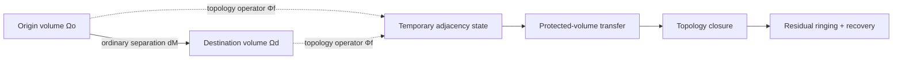
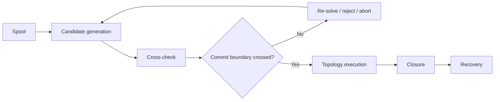

# Black Light FTL Technical Volume — Discrete Fold-Jump Drive

**Status:** canonical subordinate engineering volume.  
**Family:** `fold-jump` — Discrete Fold-Jump Drive.  
**Primary authority:** `docs/blacklight/BLACK_LIGHT_PROPULSION_TRANSIT_AUTHORITY.md`.  
**Recovered lineage:** `data/exo-vessel/ftl-development-lineage-registry.json`.  
**Machine-readable companion:** `data/exo-vessel/ftl-fold-jump-technical-volume.json`.  
**Schema:** `data/schemas/exo-vessel-ftl-fold-jump-technical-volume.schema.json`.  
**Legacy design source:** Google Drive document **The different lightspeed methods**, ID `1e0Xp71EFubBZgXWjjvPxAqPoJIZNwqS6nu1-r7Kil7Y`, revision `ANLCKQllC5h6dLaX5H1RpK8aUFVWsi-IV7gbMHUd0Qq7mIe5uGsLFi5_Hrsr8B6dl8t_ezB0fTSygxrnIBtifAHW79bgSbswp1zF3NaEil0`.

## 1. Authority and canon discipline

The recovered physical action is **temporary topological adjacency**: a certified origin volume and destination volume are made adjacent long enough for the protected vessel state to transfer. This is not ordinary travel along an intermediate path and must not be rewritten as generic warp, hyperspace cruising, or teleportation.

The recovered operating character is equally important: once topology execution crosses the commit boundary, meaningful navigation correction is negligible. Fold safety therefore lives disproportionately **before commit**. Better technology increases the quality of endpoint prediction, candidate rejection, field shaping, structural authority, last-safe-commit timing, closure control, and recovery. It does not create arbitrary postcommit steering.

`CONFIRMED` marks recovered family behavior or implementation names. `DERIVED` marks engineering consequences constrained by that behavior. `PROPOSED` marks coefficients, thresholds, historical records, or mathematical closures not independently established. `UNRESOLVED` remains unresolved.

No technology-basis embodiment in this document establishes race ownership, inventor identity, manufacturer history, prevalence, or date of discovery.

---

## 2. Physical picture

A fold event is easiest to understand as a temporary transformation of adjacency relations.



The manipulated state may be written schematically as

\[
\mathcal T_f=\{\Omega_o,\Omega_d,\Phi_f,\Gamma_f,\tau_c\}
\]

where `Ωo` is the origin protected volume, `Ωd` is the destination protected volume, `Φf` is the topology-changing operator, `Γf` is the boundary/support configuration, and `τc` is the commit interval.

Ordinary-space separation remains

\[
d_M(A,B),
\]

while the manipulated topology admits an effective adjacency separation

\[
d_{M'}(A,B).
\]

A useful derived comparison is

\[
G_F=\frac{d_M(A,B)}{d_{M'}(A,B)}.
\]

`G_F` is **not a speed multiplier**. It measures how much ordinary separation is bypassed by the selected topology solution.

---

## 3. The fold solver

A mature fold drive does not seek the candidate with the smallest manipulated separation at any cost. It searches an admissible candidate set and ranks solutions against multiple engineering burdens:

\[
J_F=
 w_d d_{M'}
+w_c C_{cov}
+w_o C_{occ}
+w_g C_{grav}
+w_u C_{unc}
+w_r C_{rec}.
\]

The terms represent manipulated separation, coverage burden, occupancy/exclusion burden, gravity-conditioned topology burden, uncertainty, and recovery cost.

A candidate is not necessarily legal merely because `J_F` is numerically small. Hard vetoes sit outside the weighted objective.

### 3.1 Hard veto conditions

A fold candidate is rejected before ranking when any of the following applies:

- confirmed occupied destination volume intersects the protected arrival geometry;
- protected-volume coverage is incomplete;
- endpoint references fail authentication;
- required structural authority exceeds available margin;
- recovery reserve falls below certified closure/recovery requirement;
- the last safe commit instant has passed before independent proof closes.

These vetoes are engineering boundaries, not penalties that can be bought away with more power.

---

## 4. Endpoint covariance

A fold drive does not merely need an estimated destination coordinate. It needs a bounded probability distribution over the complete arrival volume and the environmental state that can deform the topology solution.

A derived covariance model is

\[
\Sigma_{end}
=
J_x\Sigma_{nav}J_x^T
+\Sigma_{grav}
+\Sigma_{ref}
+\Sigma_{model}.
\]

The components represent propagated navigation uncertainty, gravitational-model uncertainty, reference uncertainty, and topology-model uncertainty.

This gives the system a physically meaningful reason to refuse a long jump despite sufficient reactor energy: the endpoint confidence volume may have become too large to certify.

### 4.1 Why gravity matters

The legacy source establishes that all FTL families become more difficult around strong or distorted gravity, but by different coefficients and mechanisms. For Fold-Jump, the derived interpretation is that gravity changes the topology solution and the mapping between predicted and admissible endpoint geometry.

A useful burden term is

\[
C_{grav}
= a_\Phi |\Phi|
+a_g\|\nabla\Phi\|
+a_T\|T_{ij}\|
+a_U U_g,
\]

where `U_g` is gravity-model uncertainty. The coefficients remain `PROPOSED` unless adopted elsewhere.

A powerful nearby gravity source can therefore hurt a fold in several ways at once: it can raise field authority required to impose the adjacency, enlarge endpoint covariance, increase structural differential loading, and shorten the time available to detect a bad solution.

---

## 5. Occupancy exclusion

The destination is a **volume**, not a point.

A derived occupancy test is

\[
E_{occ}=\int_{\Omega_d}\rho_{occ}(x)w(x)\,dV.
\]

For generator purposes, confirmed intersection between the arrival protected volume and prohibited matter is a hard veto. A low average density does not legalize a single solid obstruction inside a critical portion of the destination geometry.

The exclusion model should include:

- inhabited or occupied structures;
- other vessels and traffic reservations;
- atmospheres, terrain, rings, debris or dense particulate fields when incompatible with emergence;
- dynamic motion during the full endpoint uncertainty window;
- uncertainty expansion around poorly observed objects.

Administrative clearance is not physical proof of emptiness.

---

## 6. Commit-boundary mathematics

Fold-Jump differs from continuously steerable families because control authority changes discontinuously at commit.



Before commit, the system may continue to update endpoint state, reject candidates, alter field geometry, or dump the spool into recovery sinks.

After commit, the machine does **not** pretend the vessel is steering through an intermediate route. Its valid actions are topology completion, sector isolation where the architecture permits it, closure management, and recovery.

The precommit safety requirement is therefore

\[
T_{precommit}\ge
 t_{detect}
+t_{auth}
+t_{solve}
+t_{crosscheck}
+t_{command}
+t_{field}
+t_{margin}.
\]

Higher Path maturity pushes the last safe commit instant later by improving sensors, solvers, field response, references, and recovery. It never makes the margin infinite.

---

## 7. P0–P6 development lineage

The recovered names below are preserved exactly.

| Path | Recovered implementation | Development meaning |
|---|---|---|
| P0 | Adjacency Test Monolith | proves microscopic temporary adjacency |
| P1 | Cargo Fold Chamber | extends adjacency to a finite protected cargo volume |
| P2 | Orbital Fold Gate | solves paired separated prepared endpoints |
| P3 | Capital Fold-Jump Core | makes the origin volume mobile and shipboard |
| P4 | Fleet Fold Drive | generates and ranks multiple admissible solutions |
| P5 | Strategic Long-Fold Engine | conditions long-baseline folds on gravity/reference covariance |
| P6 | Compact Tactical Fold Core | continuously re-solves compact candidate topologies until the last safe commit instant |

The progression is causal:

```text
microscopic adjacency
        ↓
finite protected volume
        ↓
paired distant endpoints
        ↓
moving shipboard origin
        ↓
multiple candidate topologies
        ↓
long-baseline gravity-conditioned solving
        ↓
compact continuous precommit optimization
```

Range gains arise because later systems can keep valid topology solutions under worse endpoint conditioning, not because the Path number is inserted into an arbitrary speed multiplier.

---

## 8. Whole-vessel machinery

A Fold-Jump installation is not one reactor-connected box. The complete machine spans the ship.

```text
       LONG-BASELINE NAV / GRAVIMETRY
    <-------------------------------->

  [REF] [REF] [REF] [REF] [REF] [REF]
      \    |     |     |     |   /
   +================================+
   || Fold boundary / coverage skin ||
   || sectional topology waveguides ||
   +================================+
                  ||
          topology prime mover
                  ||
       energy conditioning/buffer
                  ||
       PROTECTED RECOVERY RESERVE
                  ||
        closure + ringing sinks
```

### 8.1 Energy conditioning

The conditioning plant accumulates event energy, shapes delivery, isolates primary buses from fold transients, and protects closure reserve.

### 8.2 Topology prime mover

The prime mover establishes the exotic/topological state needed for temporary adjacency. Its physical embodiment varies by technology basis.

### 8.3 Fold boundary formation

The boundary system defines the protected origin volume. Appendages, external modules, repaired structure, docking hardware and temporary equipment must be included explicitly or excluded before flight.

### 8.4 Transit control

The control system shapes candidate topology before commit and coordinates the selected solution through execution.

### 8.5 Navigation and sensing

This system combines astrometry, gravimetry, authenticated references, destination occupancy sensing, traffic state and model provenance.

### 8.6 Termination and recovery

Closure machinery collapses the temporary topology and absorbs residual ringing. It is co-equal with the prime mover in mature designs.

### 8.7 Whole-effect coverage

Coverage is evaluated by worst local margin, not a vessel average.

### 8.8 Independent backbone

Timing, structural health, thermal rejection and abort authority must not all share the same failure domain as the primary fold controller.

---

## 9. Power and reserve doctrine

A useful event decomposition is

\[
E_{event}=
E_{nucleate}
+E_{shape}
+E_{hold}
+E_{close}
+E_{ring}
+E_{reserve}.
\]

The last term is protected. A navigator cannot spend closure/recovery reserve to extend nominal range.

Longer range does not require a single linear energy multiplier. Event burden also depends on endpoint conditioning, protected volume, gravity environment, field-authority margin, topology complexity and recovery requirements.

---

## 10. Scaling behavior

Fold scaling is strongly non-linear.

Larger vessels increase boundary area, protected volume, structural span, sensor/reference distribution, timing distance, waveguide complexity and closure energy. Irregular geometry can be more difficult than a larger but simpler hull.

Multiple fold cores are not automatically additive. A multi-core design must declare whether the cores are:

- coherent sectors of one boundary;
- redundant independent channels;
- staged topology machines;
- specialized origin/destination shaping systems.

Without such authority, `two cores = twice the range` is invalid.

---

## 11. Navigation and control sequence

A mature fold resolver follows this order:

1. snapshot authority and provenance;
2. propagate destination state to the projected commit/emergence window;
3. reconstruct local and destination gravity state;
4. construct exclusion geometry;
5. certify the ship protected volume;
6. generate multiple topology candidates;
7. reject hard-veto candidates;
8. rank survivors by topology burden, covariance and recovery cost;
9. cross-check independent reference chains;
10. preserve recovery reserve;
11. arm commit;
12. continue re-solving until the last safe commit instant;
13. cross commit only with a still-valid certified solution.

---

## 12. Practical equipment manual

### FJ-01 — Pre-Fold Certification

**Purpose:** prove that a legal fold candidate exists before commit.

**Procedure:**

1. Verify authority snapshot, generator version, navigation references and current vessel configuration.
2. Confirm all external appendages and temporary modules are represented in the protected-volume model.
3. Cross-check endpoint coordinates through at least the installed independent reference channels.
4. Refresh destination gravity and occupancy state.
5. Generate the candidate set.
6. Reject any candidate whose confidence volume intersects exclusion geometry.
7. Confirm structural fold-boundary margin.
8. Confirm closure and ringing-damper capacity.
9. Lock the recovery reserve against route optimization.
10. Arm commit only after all flight-critical channels agree.

### FJ-02 — Endpoint Covariance Growth

**Indication:** endpoint uncertainty rises during spool.

**Action:** freeze any attempt to extend range; isolate the source of covariance growth; refresh gravimetry and references; regenerate candidates; reject solutions whose confidence volumes now intersect prohibited geometry; abort the spool if the remaining precommit horizon is insufficient.

### FJ-03 — Controlled Precommit Abort

1. Inhibit topology nucleation.
2. Dump shaped field energy into the recovery path.
3. Keep boundary coverage active until residual gradients fall below service limits.
4. Record the final candidate set and exact rejection reason.
5. Do not classify a successful abort as a drive failure; classify the initiating fault separately.

### FJ-04 — Post-Fold Recovery

1. Confirm ordinary-space topology has restored.
2. Reconcile actual endpoint with predicted covariance.
3. Measure ringing decay spectrum.
4. Survey structural strain and waveguide sectors.
5. Check closure sinks and thermal reserve.
6. Quarantine the drive if closure residuals exceed certification limits.

---

## 13. Maintenance doctrine

### FJ-M11 — Topology Waveguide Geometry Certification

Survey waveguide microgeometry and alignment against the certified reference state. Trend drift by sector instead of waiting for a whole-drive failure.

### FJ-M12 — Endpoint Reference Audit

Clock, astrometric, gravimetric and infrastructure references are audited independently. Contradictory references are not averaged into one comforting confidence value.

### FJ-M13 — Ringing Damper Test

Inject a bounded diagnostic impulse and compare decay spectrum, phase and thermal deposition against baseline.

### FJ-M14 — Coverage Continuity Test

Exercise the full protected-volume boundary with docking structures, deployed equipment, repair patches and service-configured geometry represented exactly.

---

## 14. Signature model

A fold event has several potentially observable phases:

\[
S_F(t)=
S_{spool}
+S_{adj}
+S_{grav}
+S_{close}
+S_{ring}
+S_{thermal}.
\]

Advanced technology may reduce duration, parasitic ringing or thermal waste. It does not automatically eliminate the intrinsic topology event.

A stealth claim requires separate authority.

---

## 15. Failure anatomy

A Fold-Jump accident should not be reduced to “drive overload.” Useful causal classes include:

**Endpoint covariance exceedance.** The arrival confidence volume became too large to certify.

**Occupancy conflict.** A dynamic or previously unresolved object entered the protected destination volume.

**Coverage discontinuity.** Part of the intended payload fell outside the certified topology boundary.

**Topology-solution bifurcation.** Multiple endpoint solutions remained comparably plausible too close to commit.

**Premature commit.** Control crossed the topology boundary before independent certification completed.

**Closure-ringing overload.** The fold completed but residual topology energy exceeded damping authority.

**Reference poisoning.** Stale or corrupted data appeared sufficiently trustworthy to bias endpoint solving.

**Gravity-conditioning error.** An unmodeled mass distribution changed the admissible topology.

Each incident record should identify the initiating defect, failed safeguard, consequence, recovery action and provenance of the evidence used in the finding.

---

## 16. Training accident — PROPOSED educational case

A P4 vessel spools for an unprepared destination using three candidate endpoint solutions. One reference feed is stale after a traffic-control handoff. The stale feed does not by itself create a dangerous endpoint; the fault becomes dangerous because the resolver incorrectly treats correlated observations as independent and shrinks covariance too aggressively.

A maintenance patch on an external sensor boom also slightly changes the certified protected-volume envelope. The boom remains physically covered, but the old model is still active in the topology solver.

Thirty milliseconds before the last safe commit instant, a fresh local gravimetric solution increases the probability of the second topology candidate. The correct behavior is to reject the entire candidate set and abort because the proof chain no longer closes before commit.

This case is useful because neither reactor power nor “pilot skill” is the primary cause. The accident chain is provenance error → covariance underestimation → stale configuration geometry → late topology bifurcation → commit-pressure hazard.

---

## 17. Infrastructure

**Endpoint beacons** reduce authenticated endpoint uncertainty but cannot legalize occupied volume.

**Deep gravimetry networks** improve long-baseline gravity reconstruction but cannot guarantee rapidly changing local conditions.

**Fold calibration ranges** provide surveyed test volumes for waveguide, closure and ringing certification.

**Traffic exclusion services** coordinate reserved arrival volumes, but administrative reservation remains subordinate to direct physical sensing and uncertainty modeling.

Infrastructure reduces uncertainty or operating burden. It does not manufacture missing shipboard field authority.

---

## 18. Technology-basis embodiments

These are `DERIVED` embodiments of the same family action.

| Technology basis | Fold machinery language | Maintenance emphasis |
|---|---|---|
| terrestrial electromechanical | aperture rings, superconducting buses, distributed gravimeters, digital topology solvers | alignment, insulation, clocks, coolant, structural survey |
| aquatic electrochemical-hydraulic | pressure-balanced fold membranes, wet photonics, ionic buffers, hydraulic geometry actuators | fouling, osmolality, pressure balance, wet-reference calibration |
| cryogenic ammonia-halocarbon | superconductive topology loops, cryogenic reference cavities, phase-change recovery reservoirs | quench history, contraction, cooldown symmetry, cryofluid purity |
| gas-giant fluidic-electrostatic | tensioned field membranes, electrostatic topology nodes, pressure-logic synchronization | membrane tension, charge leakage, stratification, acoustic timing |
| biological-symbiotic | cultivated field-bearing tissue, neural topology organs, vascular buffers, regenerative boundary tissue | perfusion, tissue coherence, immune balance, graft integrity |
| mineral piezoelectric-photonic | prestressed crystal aperture volumes, photonic references, piezoelectric geometry control | lattice flaws, crystal-axis alignment, optical cleanliness, preload |
| field-mediated adaptive | distributed coherent topology nodes, programmable boundaries, authenticated reference meshes | coherence, reference trust, fallback geometry, hostile-state resistance |

Comparable topology does not imply comparable machinery.

---

## 19. Educational text

### 19.1 Undergraduate explanation

The most common beginner mistake is to ask, “How fast does a fold drive go?” A fold drive is better understood by asking, “What two bounded regions can this machine safely prove may be made adjacent?”

Range is therefore partly a **proof problem**. If two regions are poorly observed, embedded in difficult gravity, crowded by traffic, or supported by weak references, a larger reactor may not help. The machine may possess enough field energy to execute a topology change but lack enough information to prove that the result is safe.

### 19.2 Advanced engineering lecture

The mature fold problem is a constrained optimization under uncertain endpoint geometry and a discontinuous control boundary. The engineer is not optimizing only `d_M'`. They are minimizing a topology objective over a candidate set while preserving hard exclusion, field-authority, structure and recovery constraints.

The commit boundary makes receding-horizon control unusually valuable. Every additional valid observation before commit can change the preferred topology, but every millisecond spent solving also consumes remaining abort time.

This creates a natural inequality:

\[
\Delta V_{information}(t) > \Delta C_{delay}(t)
\]

for continued re-solving to be rational. The exact functions are `PROPOSED`; the tradeoff is a `DERIVED` engineering consequence of the recovered hard-commit behavior.

### 19.3 Thesis directions

Suitable in-universe research programs include gravity-conditioned topology selection, robust endpoint covariance under correlated reference errors, minimum-energy fold closure, irregular protected-volume optimization, distributed ringing suppression, adversarial reference authentication, and formal last-safe-commit proofs.

Patent-style invention records may be generated for these developments, but inventor, institution, polity, species and date remain `UNRESOLVED` unless separately sourced.

---

## 20. Generator and API contract

A Fold-Jump generator call should expose at minimum:

```json
{
  "family": "fold-jump",
  "path": "P4",
  "sharedTier": "T4",
  "technologyBasis": "MINERAL_PIEZOELECTRIC_PHOTONIC",
  "protectedVolume": "resolved vessel geometry reference",
  "endpointObservationSet": "provenance-bearing references",
  "gravityModel": "current resolved environment",
  "occupancyModel": "current exclusion geometry",
  "recoveryState": "available protected reserve",
  "mode": "LABELED_DERIVATION"
}
```

Expected outputs include candidate topology set, selected and rejected candidate reasons, endpoint covariance, occupancy verdict, protected-volume coverage, commit margin, energy/recovery budget, signature forecast, maintenance flags and field-level provenance.

### 20.1 Hard generator guards

The generator must never:

- infer race or manufacturer ownership from technology basis;
- turn fold distance reduction into a generic speed multiplier;
- invent meaningful steering after the recovered commit boundary;
- average an occupied endpoint into acceptability;
- spend protected recovery reserve for nominal range;
- treat repeated generated lore as confirmation;
- assign historical inventors or patent holders without recovered authority;
- hide covariance, source disagreement or unresolved provenance to make a route pass.

---

## 21. Provenance matrix

| Claim class | Status |
|---|---|
| Discrete Fold-Jump family name and temporary-adjacency action | CONFIRMED |
| P0–P6 implementation names | CONFIRMED |
| hard commit / negligible meaningful postcommit correction | CONFIRMED within recovered lineage scope |
| legacy requirement for gravity-sensitive error, efficiency and finite safety margin | CONFIRMED design requirement |
| covariance decomposition, route objective, occupancy integral | DERIVED |
| eight-block machinery decomposition | DERIVED from consolidated transit authority |
| practical procedures and failure taxonomy | DERIVED |
| technology-basis embodiments | DERIVED |
| numerical coefficients and certification thresholds | PROPOSED unless separately adopted |
| inventors, dates, race ownership, manufacturer ownership, prevalence | UNRESOLVED unless separately recovered |

---

## 22. Compact engineering chart

| Question | Fold-Jump answer |
|---|---|
| What moves? | protected bounded vessel volume |
| What changes? | temporary topology / adjacency relation |
| What chiefly limits range? | solvable stable adjacency under endpoint, gravity, field, structural and recovery constraints |
| Can the ship steer after commit? | not meaningfully under recovered family behavior |
| What is the critical safety phase? | precommit sensing, proof, candidate rejection and abort |
| What makes advanced systems better? | mathematics, references, sensing, field media, structural authority, compactness, recovery and later last-safe-commit timing |
| What does infrastructure improve? | endpoint knowledge, gravimetry, certification and traffic exclusion |
| What remains intrinsic? | topology event, commit boundary, closure/recovery burden and nonzero uncertainty |

## 23. Closing rule

Fold-Jump becomes believable when range, safety and machine maturity emerge from the quality of the solved topology problem rather than from a single fictional velocity statistic. The drive must know **where the whole ship is, where the whole ship will emerge, what occupies that volume, how gravity perturbs the solution, whether the machinery can impose the required topology, and whether enough reserve remains to close it safely**—all before the final instant at which changing its mind is still physically possible.
