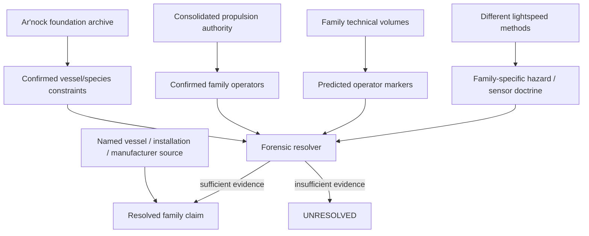
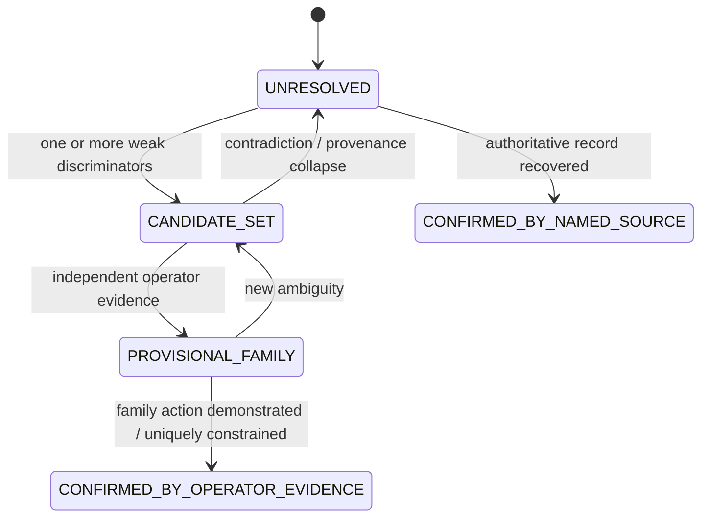
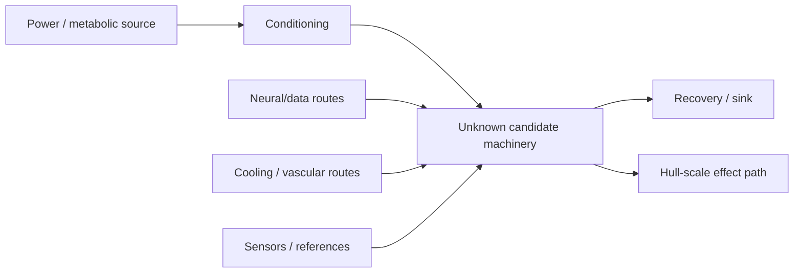
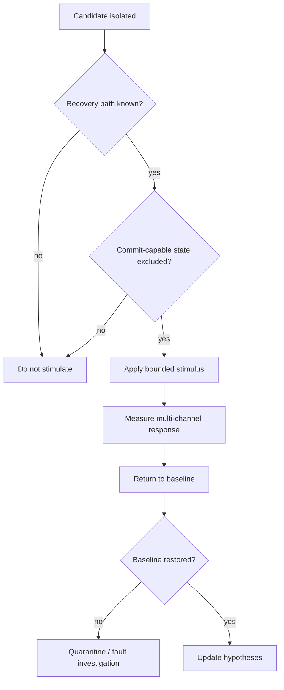
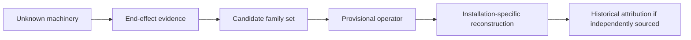

# Black Light FTL Forensic Transit Identification Manual

**Status:** `MIXED` — confirmed family physics and confirmed Ar'nock derelict observations combined with a `DERIVED` forensic discrimination framework.  
**Authority:** subordinate to `BLACK_LIGHT_PROPULSION_TRANSIT_AUTHORITY.md`, named vessel/species/manufacturer sources, all family-specific technical volumes, `ARNOCK_PROPULSION_TRANSIT_ENGINEERING_PROFILE.md`, and `ARNOCK_FTL_FAMILY_EMBODIMENT_FIELD_MANUAL.md`.  
**Machine-readable companion:** `data/exo-vessel/ftl-forensic-identification-registry.json`.  
**Design source:** Google Drive document *The different lightspeed methods*, document `1e0Xp71EFubBZgXWjjvPxAqPoJIZNwqS6nu1-r7Kil7Y`, revision `ANLCKQllC5h6dLaX5H1RpK8aUFVWsi-IV7gbMHUd0Qq7mIe5uGsLFi5_Hrsr8B6dl8t_ezB0fTSygxrnIBtifAHW79bgSbswp1zF3NaEil0`.

---

## 1. Purpose

The Ar'nock derelict is a damaged alien vessel, not a multiple-choice question whose correct drive family must already be hidden in the prose.

The recovered archive confirms that the ship has biological printers, medical systems, cultivated computation, environmental controls, storage, fabrication feedstock, damaged networks, inaccessible compartments, and nonhuman ergonomic assumptions. It does **not** name a surviving propulsion/transit family, manufacturer, Path level, shared T-tier, transit performance envelope, or historical lineage.

This manual supplies the missing engineering discipline between `unknown alien machinery` and `a defensible family identification`. It is deliberately capable of returning **UNRESOLVED**.

The governing rule is:

\[
\boxed{\text{family identification follows measured operator evidence, not aesthetic resemblance}}
\]

A ring is not automatically a gate. A Q-state sensor is not automatically Q-Lattice. Biological machinery is not automatically Phase Displacement. Cultivated neural computation is not evidence of any one transit family.

---

## 2. Authority chain



The resolver may specialize a known source. It may not reverse the arrow and make its own generated output into a source.

---

## 3. What is actually known about the Ar'nock derelict

### `CONFIRMED`

- It is an unidentified Ar'nock vessel stranded in deep space.
- Its readable name, registry, destination, and complete historical explanation have not survived in immediately accessible form.
- It contains biological fabrication, medical systems, cultivated computation, environmental machinery, storage, feedstock, damaged networks, and inaccessible compartments.
- Its architecture reflects nonhuman ergonomic and sensory assumptions.
- Its systems are damaged enough that absence of a visible component is not automatically evidence that the component never existed.

### `UNRESOLVED`

- FTL family.
- Native versus purchased/captured/refitted transit machinery.
- Manufacturer.
- Transit Path.
- Shared T-tier.
- Operational range.
- Normal transit signature.
- Cause of marooning.
- Whether the surviving transit installation is complete enough to operate.

The last point matters. A forensic system must be able to identify a destroyed drive without assuming the remaining vessel can still perform the drive's physical action.

---

## 4. The evidence object

Every observation is stored as:

\[
E_i=\{o_i,c_i,r_i,d_i,p_i,s_i\}
\]

where \(o_i\) is the observation, \(c_i\) the evidence channel, \(r_i\) reliability, \(d_i\) detectability under present damage/instrument conditions, \(p_i\) provenance independence, and \(s_i\) canon status.

A useful derived weight is:

\[
w_i=r_i d_i p_i.
\]

This weight is **not** a truth probability. It is bookkeeping for how strongly an observation is allowed to influence a forensic ranking.

### 4.1 Evidence channels

| Channel | Typical observation |
|---|---|
| Geometry | rings, hull bands, apertures, cage volumes, long-baseline arrays |
| Field residual | persistent deformation, boundary effects, stored field state |
| Gravimetry | gradient, tidal, curvature, or coupling response |
| Q-state | boundary state, address resonance, discrete epoch behavior |
| Topology | adjacency, throat, embedding, return-map evidence |
| Timing | clock meshes, epoch references, paired synchronization |
| Thermal | heat sinks, recovery debt, localized dissipation |
| Power | charging topology, reserve paths, pulse/hold distinction |
| Chemical/biological | metabolic feed, tissue state, chemical control |
| Vibration/acoustic | Ar'nock control/diagnostic carrier |
| Data/telemetry | route logs, state vectors, abort records |
| Structural load | distributed stress path associated with drive action |
| Wake/deposit | persistent post-transit environmental disturbance |
| Infrastructure interface | beacon, paired mouth, corridor, external anchor dependency |
| Damage pattern | failure propagation consistent with family machinery |
| Archive record | translated labels, route descriptions, maintenance records |

No channel is sufficient by itself merely because it sounds exotic.

---

## 5. Provenance independence

A recurring failure in alien forensics is counting copies.

If five displays are reading one damaged sensor, there is one sensor lineage. If three translated manuals descend from one corrupt archive page, there is one documentary lineage. If two models use the same clock, ephemeris, and calibration table, they are not independent because their source code was written separately.

For evidence group \(g\), define an independence factor:

\[
p_i=\frac{1}{n_g^\alpha},\qquad 0<\alpha\le1
\]

as a useful `PROPOSED` anti-double-counting model. The exact coefficient is not canon. The rule is.

---

## 6. Negative evidence under damage

“Nothing was detected” is meaningful only when the system could have detected it.

Define:

\[
N_i=A_i D_i C_i
\]

where \(A_i\) is instrument availability, \(D_i\) marker detectability in the current state, and \(C_i\) coverage of the relevant volume/time window.

Only when \(N_i\) is sufficiently high may absence become meaningful contradiction evidence.

A destroyed forward sensor array cannot falsify Gravitational-Plane travel by failing to recover long-baseline gravimetry. A ruptured gate aperture cannot be rejected because the intact throat is no longer present.

---

# Part I — Family fingerprints

## 7. Metric Compression Envelope

Metric systems should ultimately leave evidence tied to local metric deformation, field geometry around a protected vessel volume, gravity/tidal compensation, and controlled unwind.

Strong discriminators include measured metric/curvature deformation linked directly to machinery operation, distributed field geometry enclosing the vessel rather than merely producing thrust, and recovery systems whose state corresponds to envelope unwind rather than generic heat rejection.

Weak evidence includes gravity sensors, annular field emitters, high power, and distributed structural reinforcement. All four occur elsewhere.

### Diagnostic experiment — `DERIVED`

Apply a subcritical, spatially bounded stimulus to an isolated candidate field-former while measuring synchronized local curvature, structural strain, thermal response, and surrounding field state. The test must remain below any transition threshold capable of forming a complete transit envelope.

---

## 8. Gravitational-Plane Skimmer

The family uses gravitational/shear terrain rather than merely enduring gravity as a perturbation.

Strong discriminators are route records explicitly keyed to gravitational focal structures, gradients, shear branches, or equipotential geometry; coupling machinery whose commanded state changes predictably with measured external gravitational terrain; and structural load distribution that tracks branch/coupling geometry rather than a self-generated symmetric envelope.

A useful branch ambiguity measure remains:

\[
A_f=1-\max_i p_i.
\]

The forensic clue is not the equation itself; it is machinery and telemetry organized around branch selection, recoupling, and differential load.

---

## 9. Hyperspatial Slipstream Shear

Slipstream should reveal Q-boundary acquisition, adhesion, forecasting, and controlled detachment.

Strong discriminators include measurable Q-boundary response attached to sectional hull coupling; surviving records of Q-weather, shear state, wake history, or detach authority; and a distributed system whose principal reserve is clearly associated with losing boundary adhesion safely.

The dangerous false friend is any distributed field skin. Metric, Q-Lattice, and other systems can also surround the vessel.

---

## 10. Q-Lattice Phase Translation

Q-Lattice is discrete, indexed, and epoch-sensitive.

Strong discriminators include repeatable locking onto distinct Q addresses rather than a continuum; synchronized epoch references tied directly to admissible translations; alias-rejection logic where multiple candidate addresses are explicitly distinguished; and beacon or reference data forming a discrete translation graph.

The diagnostic question is whether the machinery treats destination choice as a valid address/epoch state, or merely uses clocks and Q sensors in support of another operator.

---

## 11. N-Dimensional Manifold Drive

The strongest evidence is paired route and return-map machinery.

Strong discriminators include navigation state explicitly containing additional active axes; separate re-embedding or return-map certification; axis/parity controls; and persistent hidden-obstacle inference not explainable in ordinary three-dimensional geometry.

For return map \(R\):

\[
\kappa_R=\|J_R\|\,\|J_R^{-1}\|.
\]

Finding a tensor in a data file does not prove N-Manifold travel. Finding hardware and operational records whose failure criterion is return-map conditioning is much stronger.

---

## 12. Discrete Fold-Jump Drive

Fold is temporary adjacency between finite certified volumes.

Strong discriminators include origin/destination finite-volume solutions, endpoint covariance and occupancy exclusion, hard precommit logic, closure and topology-ringing recovery, and evidence that meaningful steering ends at commit.

For destination occupancy:

\[
E_{\rm occ}=\int_{\Omega_d}\rho_{\rm occ}(x)w(x)dV.
\]

A record that spends enormous effort proving a destination volume empty before a short topological event is far more diagnostic than the presence of a ring.

---

## 13. Anchored Wormhole / Gate Transit

Gate transit maintains multiply connected topology between mouths.

Strong discriminators are persistent throat/aperture geometry, explicit remote-mouth state, paired synchronization, anchor machinery, mass-flux scheduling, and chronology-protection logic.

A gate is infrastructure-dominated. If the supposed gate core has no plausible paired-mouth reference or anchor relationship, classification remains weak.

---

## 14. Quantum Phase Displacement

Phase Displacement maps a protected macroscopic state into a compatible nonlocal target state.

Strong discriminators are macroscopic state mapping that is part of transit rather than fabrication or medicine, continuity-invariant certification, target-state compatibility solving, and post-arrival reconciliation specifically tied to the displacement event.

### Canon safeguard: Q-MAP

Q-MAP is a confirmed Black Light deployment process in the campaign archive. The archive does **not** establish that Q-MAP and Quantum Phase Displacement are the same technology.

Therefore:

\[
\boxed{\text{Q-MAP evidence}\not\Rightarrow\text{Phase Displacement evidence}}
\]

unless a higher-authority source explicitly connects them.

---

## 15. Relativistic Inertial Torch as control hypothesis

The investigation must preserve the possibility that the derelict's surviving propulsion evidence is not true FTL.

Strong evidence for causal momentum exchange includes reaction mass, beam interaction, plasma exhaust, or another continuous thrust mechanism sufficient to explain observed motion.

This control hypothesis prevents investigators from calling every unfamiliar high-energy propulsion organ an FTL device.

---

# Part II — Classification mathematics

## 16. Family support

For family \(f\):

\[
S_f=\sum_i w_i\ell_{if}-\sum_j w_jc_{jf}
\]

where \(\ell_{if}\) is support from marker \(i\) and \(c_{jf}\) is contradiction strength.

A normalized engineering ranking may be displayed as:

\[
P_f^*=\frac{e^{S_f}}{\sum_ke^{S_k}}.
\]

`P*` is not historical truth probability. It answers only: given this resolver and these observations, which currently admissible family hypothesis best explains the evidence?

---

## 17. Classification states



The state can move backward. That is a feature, not an embarrassment.

---

## 18. Promotion standard

Without a direct higher-authority named record, promotion to `PROVISIONAL_FAMILY` requires at least two provenance-independent family-discriminating evidence groups that survive damage analysis, detectability review, competing-family comparison, provenance ancestry audit, and physical-operator consistency.

A direct named installation record can outrank this threshold, but the record itself must survive authenticity and scope review.

---

## 19. Information-gain test selection

Unsafe curiosity is not engineering.

For candidate test \(T\):

\[
IG(T)=H(F|E)-\mathbb E_o[H(F|E,o)].
\]

A practical test utility may be represented as:

\[
U_T=\frac{IG(T)}{1+\lambda_hH_T+\lambda_rR_T+\lambda_dD_T}
\]

where hazard, resource cost, and irreversible-damage risk penalize information gain. Coefficients are `PROPOSED`; the test-selection principle is `DERIVED`.

---

# Part III — Ar'nock derelict field procedure

## 20. FI-01 Passive transit survey

**Objective:** identify operator evidence without energizing unknown machinery.

1. Freeze all automatic wake-up routines affecting unexplained high-energy systems.
2. Record current vessel power, thermal, chemical, neural, vibratory, gravitational, Q-state, topology, and structural baselines.
3. Map inaccessible-volume boundaries before attempting entry.
4. Identify long-baseline arrays and whether their data paths converge on navigation or transit-scale machinery.
5. Record persistent field residuals over time.
6. Compare observations against all eight families plus the inertial control.
7. Preserve evidence ancestry.

No family assignment is permitted merely from geometry.

---

## 21. FI-02 Route and dependency mapping

Unknown machinery should first be understood as a network.



Trace power, cooling, nutrient/chemical supply, data, timing, structural, field/effect, and recovery paths.

A candidate that connects to a tiny local chamber is not automatically a ship-scale transit prime mover.

---

## 22. FI-03 Archive recovery

Translation must preserve uncertainty.

For every recovered symbol or operational sequence, store:

```text
raw record
translation candidate
translation confidence
context
source location
damage state
translator/model version
dependent claims
```

Do not translate an unknown Ar'nock term directly to “warp,” “gate,” “jump,” or another familiar family word because the surrounding machinery resembles it.

Prefer functional translations such as `remote paired state` rather than `gate mouth` until the physics earn the noun.

---

## 23. FI-04 Low-authority stimulation

This procedure is allowed only after isolation and reversibility are established.



A test that cannot prove it can return to baseline is not low-authority.

---

## 24. FI-05 Family-specific confirmation

Once a leading hypothesis exists, the confirmation test must target the operator itself.

- Metric: bounded measurable metric deformation.
- Gravitational-Plane: controlled coupling change correlated with external gravitational terrain.
- Slipstream: subcritical Q-boundary adhesion response.
- Q-Lattice: discrete address/epoch lock without translation commit.
- N-Manifold: controlled extra-axis solution with independent return-map behavior.
- Fold: subcritical origin/destination adjacency precursor with closure proof.
- Gate: authenticated remote-mouth/throat relationship without opening traffic state.
- Phase Displacement: bounded state-map/target compatibility operation that cannot perform macroscopic displacement.

A family-specific test is not permission to attempt a jump.

---

## 25. FI-06 Damage-causality reconstruction

If transit machinery is destroyed, classify the wreckage by dependency and failure propagation.

For each damaged zone determine what supplied it, what it supplied, whether damage propagated inward or outward, whether protective isolation fired, whether recovery machinery discharged, whether structural loads match a family-specific failure mode, and whether signatures are primary effects or secondary damage.

A ruptured ring surrounded by thermal damage might be a prime mover, a recovery sink, an ordinary power converter, or nothing related to transit.

---

# Part IV — Practical equipment manual

## 26. Forensic instrument set

These are `DERIVED` functional equipment classes, not recovered Ar'nock product names.

| Instrument | Function |
|---|---|
| Multi-channel passive field recorder | simultaneous EM, gravitational, Q-state, topology, thermal, vibratory observation |
| Route/dependency tracer | maps power, fluid, neural/data, timing, structural, and recovery paths |
| Geometry scanner | reconstructs inaccessible machinery volumes and whole-hull relationships |
| Clock/reference ancestry analyzer | identifies shared timing and calibration roots |
| Translation provenance workstation | keeps raw Ar'nock records linked to every interpreted term |
| Low-authority stimulus controller | bounded reversible excitation with independent shutdown |
| Residual-state monitor | verifies return to pre-test baseline |
| Damage-causality mapper | reconstructs failure propagation and protective actions |

The independent shutdown for the stimulus controller must not depend entirely on the unknown machinery being tested.

---

## 27. Equipment calibration rule

A forensic device is not trusted because it reports a number.

For instrument \(k\):

\[
C_k=C_{\rm reference}\land C_{\rm range}\land C_{\rm environment}\land C_{\rm timestamp}\land C_{\rm provenance}.
\]

If any term fails, the measurement remains usable only with an explicit degraded-status annotation.

---

## 28. Practical equipment sheet — passive field recorder

**Normal configuration:** synchronized independent clocks; raw-channel retention; no automatic family labels; sensor saturation flags; damage-zone position; environmental chemistry state; calibration ancestry.

**Forbidden shortcut:** do not configure the display to convert a raw Q-state anomaly directly into `Q-LATTICE DETECTED`.

The instrument reports the anomaly. The resolver interprets it.

---

# Part V — Education

## 29. First-year lesson: shape is not function

Three pieces of equipment can all be rings: a Fold field-forming structure, a Gate aperture component, and a completely ordinary pressure or structural ring.

The physical operator decides classification. A ring only constrains geometry.

---

## 30. Second-year lesson: evidence has ancestry

Suppose four consoles report the same route state.

If all four derive from one damaged cultivated neural sensor, the evidence graph is:

```text
sensor A
 ├─ console 1
 ├─ console 2
 ├─ console 3
 └─ console 4
```

This is one observation lineage, not four.

---

## 31. Advanced lesson: classification under destruction

Let \(Z\) be the intact machine state and \(D\) the damage process. The investigator observes:

\[
Y=D(Z)+\epsilon.
\]

Inference therefore requires both a family model and a damage model:

\[
P(Z,F|Y)\propto P(Y|Z,D)P(Z|F)P(F).
\]

This is a `DERIVED` Bayesian teaching model. It is not a canonical statement that Ar'nock engineers themselves used Bayesian inference.

The practical point is simpler: a destroyed system should not be compared directly against an intact reference photograph and rejected because pieces are missing.

---

## 32. Graduate exercise: distinguish Fold from Gate

Both can contain large annular structures and topological machinery.

Evidence favoring Fold includes finite destination-volume solving, hard precommit, closure ringing, and no persistent remote mouth.

Evidence favoring Gate includes paired remote state, anchor control, sustained throat geometry, traffic mass-flux management, and chronology protection.

The decisive question is not which ring looks more like a gate. It is which physical operator the system is organized to maintain.

---

# Part VI — Generator/API integration

## 33. API contract

```text
resolveTransitForensics({
  subject,
  observations,
  damageModel,
  instrumentCapabilities,
  sourceSnapshot,
  authorityMode
})
```

Returns:

```text
classificationState
admissibleHypotheses
rankedHypotheses
contradictions
evidenceGroups
negativeEvidenceValidity
nextDiscriminatingTests
hazardWarnings
provenanceGraph
canonWarnings
```

The default authority mode for a campaign derelict investigation should be `AUTHORITY_ONLY` for historical assertions and `LABELED_DERIVATION` for engineering inference.

---

## 34. Example unresolved result

```json
{
  "subjectKey": "arnock-derelict",
  "classificationState": "UNRESOLVED",
  "bestHypothesis": null,
  "familyAssignmentAllowed": false,
  "reason": "No surviving observation currently demonstrates a family-specific physical operator.",
  "nextTest": "Passive residual-field and topology survey."
}
```

That result is useful. It tells the campaign generator, GM tool, technical manual, and narrative renderer not to leak a family answer the evidence has not earned.

---

## 35. Narrative disclosure control

Every narrative description should be generated from the same forensic state.

If the state says `CANDIDATE_SET = [fold-jump, wormhole-gate]`, the narrative may describe an annular biological structure, damaged topology-control tissue, and remote-state references of uncertain interpretation.

It may not casually say `the Fold drive chamber` unless Fold has actually crossed the promotion threshold.

This keeps player-facing discovery synchronized with engineering truth.

---

## 36. Progressive discovery ladder



Family classification and historical ownership remain separate.

A recovered Fold installation aboard an Ar'nock ship does not, by itself, prove the Ar'nock invented Fold.

---

# Part VII — Signatures and failure archaeology

## 37. Signature vector

For forensic work use:

\[
\mathbf S=[S_{\rm EM},S_{\rm th},S_g,S_Q,S_{\rm top},S_{\rm bio},S_{\rm chem},S_{\rm vib},S_{\rm wake},S_{\rm rec}].
\]

The family determines which channels are structurally diagnostic. Ar'nock embodiment adds biological, chemical, and vibratory channels.

No single scalar “FTL signature strength” is sufficient.

---

## 38. Failure archaeology vector

Represent damage as:

\[
\mathbf D=[D_{\rm initiation},D_{\rm propagation},D_{\rm isolation},D_{\rm recovery},D_{\rm residual}].
\]

A family hypothesis must explain not only what machinery exists but how its failure moved through the vessel.

That turns wreckage into evidence rather than scenery.

---

## 39. Worked training case — not canon

**Status:** `PROPOSED TRAINING EXAMPLE`.

Investigators recover a damaged annular structure, paired timing channels, a large recovery bank, no surviving remote-mouth record, endpoint-volume occupancy maps, abrupt commit/no-return control states, and closure oscillation in residual telemetry.

Fold-Jump becomes a strong provisional hypothesis because the evidence converges on finite-volume endpoint proof, hard commit, and closure recovery.

The annular shape contributed almost nothing to that conclusion.

---

# Part VIII — Infrastructure and scaling

## 40. Infrastructure inference

Infrastructure dependency is itself evidence, but only when observed.

Possible recovered relationships include beacon tables, corridor maps, paired-mouth references, Q-weather observatories, gravimetric survey catalogs, endpoint exclusion maps, return-map atlases, and state-compatibility repositories.

Do not infer the infrastructure merely because a family normally benefits from it. A ship can be damaged, isolated, or operating in degraded mode.

---

## 41. Scale inference

Machine scale constrains hypotheses but rarely identifies them uniquely.

A useful forensic scale descriptor is:

\[
\Lambda=[L,V,A,N_s,B_c,R_v]
\]

where length, active volume, active area, sensor baseline, control-node count, and recovery volume are recorded separately.

This prevents `large machinery = gate` reasoning.

---

# Part IX — Canon safeguards

## 42. Hard rules

1. Do not assign the Ar'nock derelict a family from species aesthetics.
2. Do not equate Q-MAP with Phase Displacement.
3. Do not count generated family embodiments as recovered evidence.
4. Do not count copied observations as independent evidence.
5. Do not use absent evidence without a detectability proof.
6. Do not erase damage as a cause of missing markers.
7. Do not energize unknown machinery beyond a reversible state for classification.
8. Do not invent manufacturer, inventor, Path, T-tier, performance, or historical dates.
9. Do not collapse all FTL families into a generic signature or hazard score.
10. Preserve `UNRESOLVED` whenever the operator evidence is insufficient.

---

## 43. Relationship to *The different lightspeed methods*

The source document asks for transit systems whose miscalculation, gravity sensitivity, safety instrumentation, emergency behavior, and mathematical treatment are genuinely different.

Forensics must therefore discriminate those same differences.

If every family produced the same “FTL radiation,” used the same emergency stop model, and failed the same way, the archaeological problem would be trivial and the family engineering would be cosmetic.

Instead, the investigative corpus now treats the drive's defining physics as the strongest evidence: gravity-terrain following for the Skimmer; Q-boundary adhesion for Slipstream; discrete address/epoch behavior for Q-Lattice; embedding/return maps for N-Manifold; adjacency/endpoint proof for Fold; maintained paired topology for Gate; state compatibility/continuity for Phase Displacement; and local metric deformation for Metric.

This makes the source document's demand for distinct physics useful not only during operation, but centuries later when somebody is trying to determine what the wreckage once did.

---

## 44. Current Ar'nock derelict conclusion

The correct current family classification is:

\[
\boxed{\text{UNRESOLVED}}
\]

The corpus now knows how to investigate that unknown without cheating.

The next admissible work is installation archaeology: populate actual observations as campaign exploration exposes compartments, telemetry, field residues, route records, and machinery relationships. Until those observations exist in canon, the resolver must not manufacture them.
