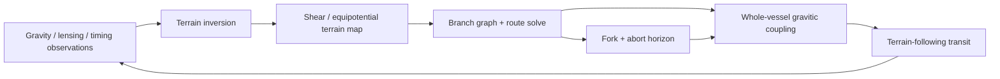
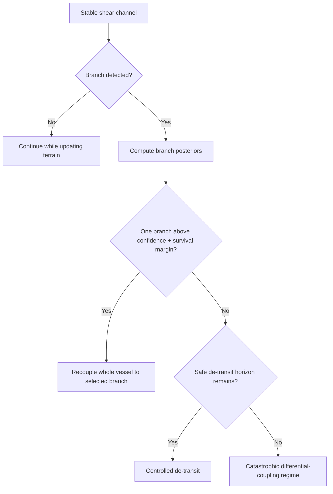

# Black Light FTL Technical Volume — Gravitational-Plane Skimmer

**Status:** `MIXED` technical authority. Confirmed family identity and Path implementation names are preserved from the Black Light propulsion/transit authority. The adopted higher-dimensional gravitational-terrain premise is confirmed by its own authority document. Equations, estimators, procedures, equipment layouts, training examples, and generalized technology-basis embodiments below are `DERIVED` unless explicitly marked otherwise. Numerical coefficients and thresholds are `PROPOSED` until calibrated or separately adopted.

**Primary authority:** `docs/blacklight/BLACK_LIGHT_PROPULSION_TRANSIT_AUTHORITY.md`  
**Terrain authority:** `docs/blacklight/BLACK_LIGHT_DARK_MATTER_GRAVITATIONAL_TERRAIN.md`  
**Legacy design source:** Google Drive document **“The different lightspeed methods”**, file `1e0Xp71EFubBZgXWjjvPxAqPoJIZNwqS6nu1-r7Kil7Y`, revision `ANLCKQllC5h6dLaX5H1RpK8aUFVWsi-IV7gbMHUd0Qq7mIe5uGsLFi5_Hrsr8B6dl8t_ezB0fTSygxrnIBtifAHW79bgSbswp1zF3NaEil0`.

---

## 1. What this drive actually does

The Gravitational-Plane Skimmer is not a warp drive with gravity-themed vocabulary. It is a terrain-following transit system.

The family couples a vessel to favorable gravitational/equipotential geometry and, at higher maturity, to reconstructed higher-dimensional shear terrain. Its engineering problem is therefore not simply:

> How much energy can we spend to go faster?

It is closer to:

> What gravitational route exists, how certain are we that it exists at the relevant epoch, can the entire vessel remain coupled to one branch of that route, and can we detect and escape a developing fork before differential coupling tears the vessel apart?

The confirmed family action is **4D geodesic-plane transit with higher-order gradient correction**. The newer dark-matter gravitational-terrain authority adds a setting premise: higher-dimensional shear bands, ridges, channels, saddles, knots, and basins project partly into the phenomena observed as dark-matter gravity and lensing. Mature skimmers exploit that terrain directly or infer it from ordinary gravitational observations.



The crucial engineering distinction is that gravity can be both **road** and **hazard**. A broad smooth gradient may reduce route burden. A nearby steep Hessian, rapidly changing shear, or unresolved branch fork may make the same region unusable.

---

## 2. Terrain state and navigation mathematics

Let the effective gravitational potential be

\[
\Phi_{eff}=\Phi_{visible}+\Phi_{DM}^{eff},
\]

where the second term is the effective projection of the confirmed higher-dimensional gravitational terrain premise. The exact real-space inversion remains `DERIVED`.

For engineering use, define the local transit terrain state

\[
\mathbf T_g=
\{\Phi_{eff},\nabla\Phi_{eff},H(\Phi_{eff}),\mathcal S_{AB},\nabla\mathcal S_{AB},\dot{\mathcal S}_{AB},\mathcal K,\Sigma_{terrain}\}.
\]

Here:

- \(\nabla\Phi_{eff}\) gives local gradient direction and magnitude;
- \(H(\Phi_{eff})\) is the tidal Hessian, important because a smooth acceleration and a differential acceleration are not the same engineering load;
- \(\mathcal S_{AB}\) is reconstructed higher-dimensional shear terrain;
- \(\mathcal K\) represents branch/topological hazard;
- \(\Sigma_{terrain}\) retains uncertainty instead of pretending a reconstructed route is exact.

A route is selected through a family-specific functional:

\[
\Gamma_g^*=\arg\min_{\Gamma}
\int_\Gamma
\left[
 w_0+w_gC_{grad}+w_tC_{tidal}+w_sC_{shear}+w_uC_{unc}+w_fC_{fork}+w_xC_{switch}
\right]ds.
\]

The terms deliberately do different jobs. `C_grad` can reward a favorable usable gradient or penalize an adverse one. `C_tidal` penalizes differential gravitational loading. `C_shear` evaluates alignment with reconstructed higher-dimensional terrain. `C_unc` prices uncertain knowledge. `C_fork` prices branch ambiguity and predicted branch divergence. `C_switch` represents the real cost of leaving one coupled plane and acquiring another.

Define a generalized route cost \(D_g\) from the minimizing solution, and a derived route gain

\[
\chi_g=\frac{D_0}{D_g}.
\]

This is **not a velocity multiplier**. It is a comparison between ordinary separation and the family-specific cost of the admissible terrain route.

### 2.1 Why stronger gravity is not automatically better

Suppose a gradient component looks favorable. The local benefit may increase approximately with an alignment score

\[
A_g = \hat v\cdot \widehat{-\nabla\Phi_{eff}},
\]

but tidal cost grows with the Hessian norm

\[
C_{tidal}\propto \|H(\Phi_{eff})\|.
\]

A region can therefore satisfy

\[
A_g>0
\]

while simultaneously becoming less usable because

\[
\|H(\Phi_{eff})\|\rightarrow \text{certification limit}.
\]

That is why skimmers do not simply dive toward stars for free acceleration. Near severe gravity volumes, gradients become steep, terrain evolves rapidly, reference errors become dangerous, and the cost of maintaining coherent whole-vessel coupling can become prohibitive.

---

## 3. Fork mathematics: the characteristic catastrophic hazard

The legacy design source specifically describes gravitational shear lanes that can divide, placing the vessel in danger of being pulled toward incompatible branches. This volume makes that hazard explicit.

Suppose the branch solver produces posterior probabilities

\[
P(B_i|Y)=p_i,
\]

for candidate branches \(B_i\) given observations \(Y\). Define fork ambiguity

\[
A_f=1-\max_i(p_i).
\]

Low \(A_f\) means one branch clearly dominates. High \(A_f\) means the sensor/solver stack cannot confidently determine which physical continuation the vessel is entering.

Ambiguity alone is not enough to define danger. Two nearly coincident branches are initially less dangerous than two rapidly separating ones. Let

\[
D_{branch}(t)=\|x_1(t)-x_2(t)\|,
\]

and define divergence rate

\[
V_{fork}=\frac{dD_{branch}}{dt}.
\]

A useful `DERIVED` fork hazard index is

\[
H_f=A_f
\left(1+\alpha_v\frac{V_{fork}}{V_*}\right)
\left(1+\alpha_t\frac{\|H(\Phi_{eff})\|}{H_*}\right)
\left(1+\alpha_uU_{terrain}\right),
\]

where normalization constants are `PROPOSED` calibration parameters.

The system must act before remaining decision time falls below the physical recoupling/de-transit requirement:

\[
t_{remain} > t_{detect}+t_{solve}+t_{command}+t_{recouple}+t_{exit}+t_{margin}.
\]

If that inequality fails, an otherwise mathematically preferred branch is no longer operationally admissible.



The defining catastrophic chain is not “navigation error.” It is:

\[
\text{unresolved fork}
\rightarrow
\text{inconsistent sector coupling}
\rightarrow
\text{differential acceleration}
\rightarrow
\text{structural load divergence}
\rightarrow
\text{loss of whole-vessel solution}.
\]

---

## 4. Safety horizon and emergency de-transit

The original design requirement ties higher transit capability to more capable safety sensing and redundancy. For the skimmer, sensing must see not only objects but **terrain evolution**.

Use the common safety condition

\[
L_{sensor}\ge
v_{eff}
(t_{detect}+t_{solve}+t_{command}+t_{recouple}+t_{exit})
+D_{margin}.
\]

The additional `recouple` term is especially important for this family. A skimmer may survive a developing fork not by instantly dropping to ordinary space, but by transferring the entire vessel from one gravitational branch to another. That operation takes finite time, field authority, structural margin, and energy reserve.

Define

\[
H_s=\frac{L_{sensor}}{L_{safe}}.
\]

`H_s > 1` means positive modeled safety margin. It does not mean perfect safety. Unknown mass, fast transient terrain, sensor occlusion, corrupted timing references, or simultaneous equipment faults can consume the margin.

### Operator rule

**Never command a route whose apparent terrain advantage requires consuming the branch-recognition or de-transit horizon needed to survive the next unresolved feature.**

---

## 5. Whole-vessel coupling and structural engineering

A gravitic skimmer is especially hostile to simplistic “drive core in the engine room” layouts. The danger is differential response across the vessel.

If fore and aft coupling sectors experience accelerations \(a_f\) and \(a_a\), a crude differential load term is

\[
\Delta a = a_f-a_a.
\]

For characteristic longitudinal mass distribution \(m(x)\), the induced structural load scales approximately with

\[
F_{diff}\sim\int m(x)\Delta a(x)\,dx.
\]

The generator should therefore require distributed coupling geometry and structural load paths that are physically related to the vessel’s protected volume.

Use the general structural margin

\[
\mu_s=1-\max_x\left(\frac{\sigma_{eq}(x)}{\sigma_{allow}(x)}\right).
\]

A route is invalid when \(\mu_s\le0\), even if navigation mathematics and prime power say transit is possible.

This becomes particularly important during branch transfer. A nominal route may keep coupling nearly symmetric, while recoupling can temporarily place one vessel section on a new gradient before another. Higher-Path systems improve not only by calculating better branches but by shortening and controlling that dangerous transition.

---

## 6. Eight-block machinery embodiment

The family uses the common Black Light eight-block transit machine, but every block takes gravitic-specific form.

| Block | Gravitational-Plane function |
|---|---|
| Energy conditioning | supplies continuous coupling, branch-transfer impulse, sensors, computation, and protected de-transit reserve |
| Prime mover | establishes controllable coupling between vessel and selected gravitational/shear terrain mode |
| Field formation | distributes that coupling around/through the complete protected vessel volume |
| Transit control | maintains branch solution, allocates coupling authority, and executes recoupling |
| Navigation & sensing | reconstructs gravity/shear terrain from gradiometry, lensing, clocks, references, and historical models |
| Termination & recovery | decouples from terrain without leaving vessel sections on incompatible solutions |
| Whole-effect coverage | prevents appendages, tanks, external structures, or remote machinery from following different acceleration fields |
| Backbone | carries timing, structural load, thermal transport, sensor fusion, branch voting, interlocks, and abort command |

A representative terrestrial arrangement might look like:

```text
    [forward gravimetric baseline]
        o----o----o----o
             | sensors
   =================================  <- dorsal coupling rail
   |  solver | reference | reserve |
   |         VESSEL CORE            |
   =================================  <- ventral coupling rail
        o----o----o----o
     [aft comparison baseline]

  lateral coupling sectors complete a closed
  whole-vessel response volume; the diagram is
  functional, not a canonical hull arrangement.
```

`DERIVED:` the exact hardware depends on operative technology basis and any higher race/manufacturer source.

---

## 7. Path development: why each generation improves

The recovered progression is preserved exactly in naming while the causal explanation below remains `MIXED`.

### P0 — Gravitational Rail Monolith

The earliest system does not “navigate” in the mature sense. It follows one fixed, exhaustively surveyed gravitational corridor. Mathematics can approximate a scalar potential and known route; machinery is monumental because poor sensing and field control are compensated by structure, energy, and pre-survey.

The meaningful advance is **repeatability**, not range.

### P1 — Equipotential Skim Array

Vector gradiometry and faster steering allow the machine to remain attached to a changing local equipotential feature. The system now closes a feedback loop:

\[
\text{measure gradient}\rightarrow\text{estimate tangent}\rightarrow\text{steer coupling}\rightarrow\text{remeasure}.
\]

This reduces dependence on a fixed external rail.

### P2 — Barycentric Plane Rider

The mathematical problem expands from one dominant body to multiple moving masses. The vessel must reconstruct a volumetric tidal field and maintain coupling across its full physical extent.

This is the generation where structural engineering becomes inseparable from navigation.

### P3 — Interstellar Plane Skimmer

The machine now predicts terrain beyond immediate local sensing and carries a branch solution through interstellar conditions. Long-baseline clocks, remote observations, redundant route solvers, and dedicated de-transit reserve become necessary because the relevant route evolves during transit.

This is the first system where the legacy design source’s “safety sensors read as far ahead as the jump technology” principle becomes an explicit engineering limiter.

### P4 — Multi-Plane Transit Drive

The route is no longer one line. It becomes a graph

\[
G=(V,E),
\]

whose vertices represent branch features or switching regions and whose edges carry cost, confidence, time dependence, and structural/recoupling burden.

The drive can intentionally leave one favorable plane for another rather than treating every branch as an emergency.

### P5 — Deep-Gradient Skimmer

The major advance is inverse reconstruction. Weak lensing, timing residuals, historical route observations, and gravitational anomalies are combined to infer terrain not directly mapped by visible matter.

The machine therefore obtains greater strategic range without requiring a proportional increase in prime power. It discovers lower-cost paths that earlier mathematics could not see.

### P6 — Adaptive Geodesic Drive

The mature machine continuously co-solves terrain, branch probabilities, vessel-created disturbance, structure, sensing horizon, and recoupling options as one receding-horizon control problem.

Conceptually:

\[
\Gamma^*(t+\Delta t)=
\arg\min_{\Gamma}
J_g\left(\Gamma|\hat{\mathbf T}_g(t+\Delta t),\Sigma(t+\Delta t),S_v(t+\Delta t)\right).
\]

It does not become omniscient. It simply updates the best defensible route faster, with better data, better materials, more distributed control, and greater recovery authority.

---

## 8. Scaling behavior

Gravitic machinery scales in competing directions.

A longer ship may gain a better gravimetric baseline, improving gradient discrimination roughly with baseline length \(L_b\). But structural and timing errors also grow. A simplified sensor relation is

\[
\sigma_{grad}\sim
\sqrt{\sigma_{sensor}^2+\sigma_{clock}^2+\sigma_{geometry}^2}/L_b.
\]

At first, increasing \(L_b\) helps. Eventually flexure, synchronization error, calibration drift, and differential loading can dominate.

Larger vessels also present greater whole-effect volume and larger branch-transfer inertia. This produces a useful setting result: **a huge P3 vessel is not necessarily a better skimmer than a compact P5 vessel**. The mature installation may have less raw machinery but vastly superior terrain reconstruction, coupling density, structural materials, and recoupling speed.

Multiple gravitic drives must not be summed as `N × speed`. They may be:

- coherent sectors of one whole-vessel coupling system;
- redundant couplers;
- branch-transfer auxiliaries;
- separate drives serving detachable sections;
- or incompatible systems that cannot operate simultaneously.

The generator must resolve which architecture applies.

---

## 9. Technology-basis embodiments

These are `DERIVED` machinery translations, not race assignments.

### Terrestrial mechanical

Long-baseline gravimeters and optical/lensing sensors feed precision clocked electronic or photonic solvers. Field/coupling rails or plates distribute response through structural trusses. Service culture emphasizes sensor alignment, connector integrity, clock agreement, sector phase, strain telemetry, and reserve power.

### Aquatic fluidic

Distributed pressure-qualified gradient membranes and wet photonics replace dry instrument racks. Fluid paths may carry timing or actuation information, making pressure transients and cavitation a navigation-quality issue rather than merely a plumbing issue. Structural shells distribute coupling loads through pressure-balanced geometry.

### Cryogenic superconducting

Persistent-current coupling structures and ultra-stable cryogenic sensing produce excellent low-noise terrain measurement, but quench behavior becomes central to abort doctrine. A local quench can create coupling asymmetry faster than ordinary thermal damage would suggest.

### Gas-giant buoyant

Large physical size can produce enormous sensor baselines without rigid terrestrial-style hulls. Flexible distributed coupling structures must compensate for atmospheric motion and tension-dominant load paths. Convective cooling is strong, while geometry stability may be comparatively difficult.

### Biological symbiotic

Gradient sensing may be performed by cultivated organs distributed through the vessel body, with branch probabilities represented by neural voting populations rather than conventional digital processors. Compliant field-bearing tissue can tolerate some differential deformation, but injury, metabolic exhaustion, neural disagreement, and regenerative state become legitimate engineering variables. This does not assign the family to any particular species.

### Mineral crystalline

Resonant crystalline gradiometers and coherent lattice coupling volumes provide high geometric stability. Branch sensing may be optical/acoustic through defect networks. Prestress and fracture-domain propagation become primary maintenance concerns.

### Postmaterial distributed

The installation may exist as distributed reference/coupling nodes performing continuous terrain tomography and authenticated executable branch proofs. “Repair” may mean excluding corrupted nodes and reconstructing a valid coherent set, but continuity and fallback-state safeguards remain physical engineering problems rather than magic.

---

## 10. Practical equipment manual — pre-transit certification

A skimmer crew certifies **route knowledge and physical ability to follow it** separately.

### 10.1 Terrain-source verification

Confirm the terrain solution’s epoch. Verify mass ephemerides, lensing references, clock references, and inferred higher-dimensional components. If independent observations disagree beyond accepted covariance, downgrade route confidence rather than averaging the disagreement away.

### 10.2 Branch graph

Compute the primary branch and at least one alternate or de-transit solution. Mark all known saddles, knots, forks, high-Hessian regions, and reference-poor segments.

### 10.3 Whole-effect check

Verify all coupling sectors. Confirm appendages and deployed equipment lie inside the certified whole-effect solution. A sensor mast that remains physically outside the protected response geometry can become a structural weapon against its own ship.

### 10.4 Structural check

Calculate expected nominal and branch-transfer loads. Require positive \(\mu_s\) under both. The minimum margin, not the average hull stress, governs certification.

### 10.5 Horizon check

Confirm

\[
L_{sensor}>L_{safe}.
\]

Use the slowest credible combined detect/solve/command/recouple/exit chain, not laboratory average latency.

### 10.6 Recovery reserve

Reserve power and coupling authority sufficient for one worst-case certified transfer or de-transit event. Do not allocate that reserve to improve nominal route gain.

---

## 11. Practical equipment manual — fork response

When a fork is detected:

1. Stop nonessential optimization. Route quality is now secondary to maintaining one coherent vessel solution.
2. Recompute branch posteriors from independent sensor subsets. A single bad sensor family must not dominate branch selection.
3. Measure predicted branch divergence and tidal-load growth.
4. Reject any branch whose recoupling completion time exceeds remaining safe horizon.
5. If one branch remains above confidence and structural thresholds, transfer coupling in the certified sectional sequence.
6. If no branch remains admissible and ordinary-space exit remains safe, de-transit.
7. If neither branch transfer nor de-transit remains inside horizon, the event has entered the catastrophic regime; emergency systems should maximize structural coherence and preserve evidence rather than falsely reporting a recoverable navigation state.

The reason for sectional recoupling is simple: switching every coupling element simultaneously can create uncontrolled transient disagreement. But switching too slowly can place different hull sections on different diverging branches. Each installation therefore has a certified transfer cadence tied to structure and control bandwidth.

---

## 12. Maintenance manual

### Turnaround checks

Verify gradiometer agreement, timing/reference coherence, coupling-sector symmetry, branch-voter disagreement handling, de-transit reserve, and strain-sensor zero.

### Periodic checks

Survey physical sensor baseline geometry. Recalibrate gradient and Hessian reconstruction. Exercise sectional recoupling under simulated branch divergence. Inspect field/coupling material drift. Load-test structural transfer paths. Compare the terrain solver against independent astronomical observations rather than only its own historical predictions.

### Diagnostic order

Use the following causal order unless evidence points elsewhere:

```text
reference / ephemeris
      ↓
gravity / lensing sensor disagreement
      ↓
terrain inversion
      ↓
branch classification / route solver
      ↓
coupling-sector control
      ↓
structural geometry
      ↓
energy / recovery
      ↓
prime-mover defect
```

This order prevents technicians from replacing coupling hardware to “fix” a route error actually caused by stale stellar mass data.

### Return to service

A repaired drive must reproduce the same certified terrain reconstruction, branch classification, coupling symmetry, structural margin, safety horizon, and emergency de-transit result on independent test geometry. Passing an idle hardware self-test is not sufficient.

---

## 13. Signature model

The family’s unavoidable signature derives from interaction with gravitational/shear terrain. Technology basis changes how that interaction is carried and leaked but does not erase it automatically.

A useful conceptual signature vector is

\[
\mathbf S_g=
\{S_{grav},S_{shear},S_{control},S_{thermal},S_{recouple},S_{reference}\}.
\]

Precommit activity may reveal wide-baseline gravimetric surveying, clock synchronization, reserve charging, and coupling-sector excitation. During transit, an observer may detect gravitational/shear disturbances and corrective sidebands. Branch transfer creates a characteristic transient because coupling authority is redistributed. Termination produces decoupling and ordinary-reference reacquisition signatures.

A sophisticated installation can reduce some emissions, but stealth must arise from actual sensor physics, field control, materials, geometry, or operating doctrine. “Higher technology = invisible” is not an accepted generator rule.

---

## 14. Failure taxonomy

Gravitic failures should be classified by causal layer.

| Failure class | Typical evidence | Wrong generic label |
|---|---|---|
| terrain-source error | ephemeris/reference disagreement | navigation glitch |
| hidden-mass inversion error | observations valid, terrain estimate wrong | bad luck |
| fork classification error | posterior/voter inconsistency | pilot error |
| late divergence detection | sensor horizon consumed before action | drive overload |
| coupling desynchronization | sector residuals separate | engine fault |
| differential structural overload | strain follows sector asymmetry | hull weakness |
| recoupling latency | correct branch chosen too late | route error |
| reserve depletion | recovery command valid but unavailable | power fluctuation |
| hostile termination | de-transit succeeds into unsafe gravity terrain | successful abort |

### Training accident: the attractive false branch

`DERIVED training case — not historical canon.`

A P4 Multi-Plane Transit Drive approaches a mapped saddle. Updated weak-lensing observations suggest a lower-cost branch than the archived route. The route optimizer raises its posterior rapidly, but one long-baseline timing reference has accumulated an unnoticed epoch offset.

The erroneous branch appears smoother because the inversion displaces a higher-dimensional terrain knot. The vessel begins sectional recoupling. Forward sectors acquire the new branch while aft sectors remain on the old solution. Independent local gradiometers then disagree with the far-field reconstruction.

A correct accident board does not write “unexpected gravitational turbulence.” It reconstructs the causal chain:

\[
\text{clock epoch error}
\rightarrow
\text{terrain knot misplaced}
\rightarrow
\text{false branch posterior}
\rightarrow
\text{partial recoupling}
\rightarrow
\text{differential load spike}.
\]

The safety lesson is that redundancy only helps when sensors are genuinely independent and disagreement is allowed to veto an attractive route.

---

## 15. Educational text — why the Skimmer is not a hyperlane railroad

At low Path levels it may look like a railroad because the ship can use only a few mapped gravitational features. That is an engineering limitation, not necessarily a property of the universe.

A P0 installation knows one road. A P1 can follow a bend in that road. A P2 understands several large bodies shaping the road. A P3 predicts where the road will be beyond what it can see immediately. A P4 treats roads as a branch network. A P5 infers roads that visible matter alone does not reveal. A P6 continuously reconstructs the terrain while traveling through it.

Thus technological progress changes what counts as an available route.

This explains why range can increase even when reactor output changes modestly:

\[
\text{better observations}
+\text{better inverse mathematics}
+\text{better covariance handling}
+\text{faster coupling control}
\Rightarrow
\text{more admissible terrain}
\Rightarrow
\text{greater usable range}.
\]

---

## 16. Engineering lecture — route uncertainty as a physical cost

A route estimate without covariance is incomplete. If terrain reconstruction is

\[
\hat{\mathcal S}=\arg\min_{\mathcal S}
\left[(y-F(\mathcal S))^TW(y-F(\mathcal S))+\lambda_RR(\mathcal S)\right],
\]

then an approximate covariance may be represented by

\[
\Sigma_{terrain}\approx
(J_F^TWJ_F+\lambda_RH_R)^{-1}.
\]

A mature route solver carries this uncertainty forward rather than generating one aesthetically clean line. Two routes with equal nominal cost are not equal if one passes through poorly constrained terrain.

A `DERIVED` risk-aware term can therefore be

\[
C_{unc}=\operatorname{tr}(W_u\Sigma_{terrain}),
\]

or a more targeted projected uncertainty along the branch tangent. The exact estimator is implementation-dependent and not setting canon.

The conceptual point is canonical-safe: **better knowledge of gravity is itself propulsion technology for this family**.

---

## 17. Generator integration contract

A generated Gravitational-Plane installation should receive at minimum:

```json
{
  "family": "gravitic-plane",
  "path": "P4",
  "technologyBasis": "TERRESTRIAL_MECHANICAL",
  "terrainEpoch": "source-defined",
  "visibleGravitySources": "authority-resolved",
  "terrainCovariance": "resolver-derived",
  "vesselGeometry": "instance-resolved",
  "powerAndRecovery": "instance-resolved",
  "missionRoute": "instance-resolved"
}
```

The resolver should return route cost/gain, selected and alternate branches, branch confidence, fork ambiguity, tidal/shear burden, coupling layout, structural margin, sensing/recoupling horizon, reserve allocation, signatures, maintenance burden, failure risks, and field-level provenance.

It must not:

- substitute Metric, Fold, Manifold, Slipstream, Q-Lattice, Gate, or Phase mathematics;
- infer race or manufacturer ownership from technology basis;
- turn `DERIVED` equations or `PROPOSED` thresholds into confirmed canon;
- reduce a fork to a generic speed penalty;
- claim stronger gravity is universally beneficial;
- permit a route that fails sensing, whole-vessel coupling, structure, or de-transit certification;
- overwrite a named source value because the generic runtime has a simpler representation.

---

## 18. Provenance and origin safeguards

The following are `CONFIRMED` within their declared source scopes:

- the Gravitational-Plane Skimmer family identity and action;
- its recovered P0–P6 implementation names;
- the setting premise that higher-dimensional gravitational shear terrain is both partly causal of and partly manifested through dark-matter/lensing phenomena;
- the requirement that FTL families respond differently to gravitational conditions;
- the design requirement that safety sensing and emergency de-transit sophistication rise with technological capability while never becoming perfectly safe.

The following remain `DERIVED` unless separately promoted:

- the exact route functional;
- fork ambiguity and divergence equations;
- structural and safety-margin formulations;
- equipment layouts;
- maintenance procedures;
- technology-basis embodiments;
- educational derivations and training accident.

The following remain `PROPOSED` until calibrated:

- numerical coefficients;
- normalization constants;
- certification thresholds;
- absolute sensor ranges;
- exact branch-probability cutoffs;
- exact energy/efficiency constants.

Inventor names, patent dates, manufacturers, race ownership, famous disasters, historical schools, and named institutions remain `UNRESOLVED` unless recovered from higher authority. A believable technical corpus may contain explicitly fictionalized training material, but repetition cannot promote that material into history.

---

## 19. Compact engineering chart

| Question | P0–P1 answer | P2–P3 answer | P4 | P5–P6 answer |
|---|---|---|---|---|
| What terrain is known? | one surveyed feature | multi-body / predicted features | branch graph | inferred higher-dimensional terrain |
| How is route chosen? | fixed/local tangent | predicted continuous branch | graph optimization | probabilistic receding-horizon solve |
| Main safety problem | losing known rail | forecast error | fork transfer | hidden/transient terrain |
| Main machine burden | huge fixed structure | whole-vessel sensing/coupling | fast sectional control | inference + adaptive coupling |
| Why range improves | can follow route at all | predicts farther | switches intelligently | discovers better routes |
| Why failure remains possible | crude sensing | stale prediction | branch ambiguity | model uncertainty + finite reaction time |

---

## 20. Technical-volume conclusion

The Gravitational-Plane Skimmer becomes most coherent when treated as an instrument for **understanding and riding the universe’s gravitational terrain**.

Its technological history is therefore inseparable from astronomy, gravimetry, lensing science, inverse mathematics, timing standards, structural engineering, distributed field control, and emergency recovery. Better reactors help, but a civilization that merely pours more power into an inaccurate terrain solution eventually reaches a wall imposed by branch uncertainty, tidal structure, sensor horizon, and whole-vessel coherence.

That is the core family principle:

\[
\boxed{
\text{usable gravitic performance}
\sim
\text{terrain knowledge}
\times
\text{coupling authority}
\times
\text{structural coherence}
\times
\text{safety horizon}
}
\]

No factor is infinite. No safety system is perfect. And the same gravitational landscape that gives the ship its road can, when misunderstood, become the mechanism that destroys it.
