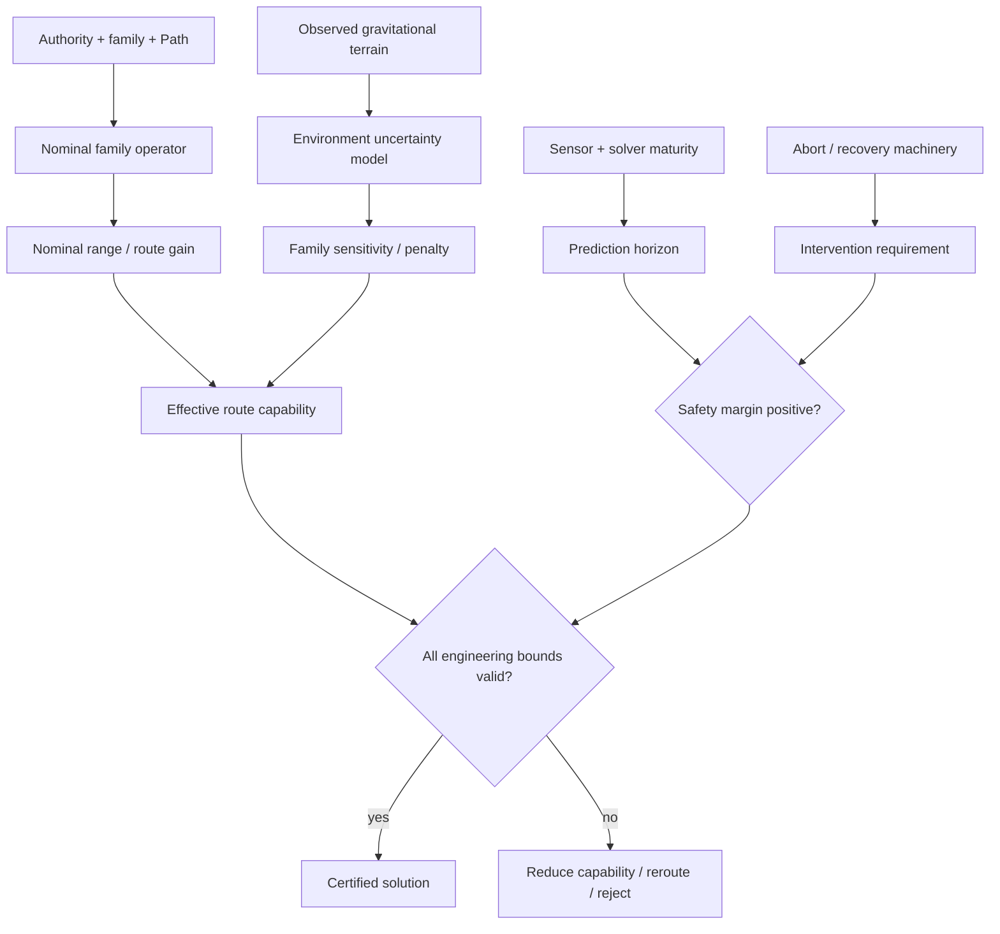

# Black Light FTL Gravity, Safety & Efficiency Models

**Status:** subordinate mathematical/engineering reference.  
**Authority:** subordinate to `BLACK_LIGHT_PROPULSION_TRANSIT_AUTHORITY.md`, surviving named race/manufacturer canon, current runtime FTL definitions, and `BLACK_LIGHT_FTL_MATHEMATICAL_TRANSIT_MODELS.md`.  
**Source impetus:** Google Drive document **“The different lightspeed methods”**, document id `1e0Xp71EFubBZgXWjjvPxAqPoJIZNwqS6nu1-r7Kil7Y`, observed revision `ANLCKQllC5h6dLaX5H1RpK8aUFVWsi-IV7gbMHUd0Qq7mIe5uGsLFi5_Hrsr8B6dl8t_ezB0fTSygxrnIBtifAHW79bgSbswp1zF3NaEil0`.  
**Canon discipline:** the Drive document establishes design requirements for gravity sensitivity, shear/lensing-plane behavior, efficiency loss, safety sensing, bifurcation hazards, emergency de-transit and technology-scaled safety margins. The explicit equations and uncalibrated coefficients in this file are `DERIVED` or `PROPOSED` unless a surviving source separately fixes them.

---

## 1. Design requirement recovered from “The different lightspeed methods”

The source requires the nine transit methods to have **different** failure, miscalculation and efficiency responses to gravitational terrain. Near large gravity wells, local spacetime distortion makes the target transit deformation harder to calculate and harder to impose. The source further distinguishes interstellar gravitational shear/lensing planes, especially route systems that deliberately exploit them, and requires transit safety sensors and emergency de-transit capability to improve with the drive technology itself.

This produces five mandatory generator concepts:

1. **gravity-field penalty** — the same nominal drive performs differently in different curvature/gradient environments;
2. **family sensitivity** — each transit method has its own coefficients and dangerous observables;
3. **route-topology hazard** — a fork or bifurcation can become a destructive incompatibility rather than merely a navigational inconvenience;
4. **look-ahead safety horizon** — sensing/prediction must extend far enough ahead of the transit state to permit meaningful avoidance or de-transit;
5. **maturity-scaled safety** — higher Path stages gain not just speed/range but better prediction, redundancy, intervention distance and recovery options.

The design goal is not to claim experimentally verified FTL physics. It is to make the fictional systems mathematically coherent, internally reproducible and mechanically consequential.

---

# 2. Shared gravitational terrain model

Let the ordinary-space gravitational environment be represented by a potential-like scalar \(\Phi\), acceleration field \(\mathbf g=-\nabla\Phi\), tidal tensor

\[
\mathsf T_{ij}=\partial_i\partial_j\Phi,
\]

and, where relativistic curvature matters, Riemann tensor \(R^\mu{}_{\nu\alpha\beta}\).

A route sample at position \(x\) therefore carries environment state

\[
\mathcal E_g(x,t)=\{\Phi,\nabla\Phi,\nabla\nabla\Phi,R,\dot R,\rho_{model},\Sigma_{mass}\}.
\]

`DERIVED:` \(\Sigma_{mass}\) is uncertainty in the modeled visible + inferred mass distribution. It is essential because an unmodeled mass concentration can be more dangerous than a large but well-characterized star.

## 2.1 Normalized gravity severity

Define a dimensionless local severity index

\[
G(x)=w_\Phi\left|\frac{\Phi}{\Phi_*}\right|
+w_g\frac{\|\nabla\Phi\|}{g_*}
+w_T\frac{\|\mathsf T\|}{T_*}
+w_R\frac{\|R\|}{R_*}
+w_U U_m,
\]

where \(U_m\) is normalized mass-model uncertainty. Reference scales and weights are `PROPOSED` calibration quantities.

This deliberately distinguishes **being deep in a well** from **crossing a steep gradient**, **experiencing high tidal curvature**, and **not knowing the terrain accurately**.

## 2.2 Family-specific environmental penalty

For drive family \(f\), define

\[
P_f(x)=a_fG+b_fG^2+c_fG^{n_f}+d_fU_m+e_fB_f,
\]

where \(B_f\) is any family-specific boundary/topology hazard term.

Then environment efficiency is

\[
\eta_{g,f}=\exp[-P_f].
\]

This gives the required behavior: the closer a drive operates to an environment it handles poorly, the faster usable efficiency collapses. It also permits different drives to have very different tolerance curves without inventing a single universal FTL constant.

The source requirement that the cost of imposing additional spacetime distortion near already-distorted regions rises very rapidly is represented by the nonlinear \(G^2\) or \(G^{n_f}\) terms.

## 2.3 Effective capability under terrain

Let nominal family route gain from the base mathematical model be \(\chi_{f,0}\). Then

\[
\chi_{f,eff}=1+(\chi_{f,0}-1)\eta_{g,f}\eta_{nav,f}\eta_{field,f}\eta_{struct,f}.
\]

For nominal maximum range \(R_{f,0}\):

\[
R_{f,eff}=R_{f,0}\eta_{g,f}^{\alpha_R}\eta_{nav,f}^{\beta_R}\eta_{recovery,f}^{\gamma_R}.
\]

For nominal source burden \(B_{0}\):

\[
B_{source}=\frac{B_0}{\eta_{impl}\eta_{g,f}}.
\]

Thus gravity can simultaneously reduce safe range and increase energy burden. A solver may still find a formal route while engineering certification rejects it because the source burden, structural stress or recovery reserve crosses limits.

---

# 3. Gravity exclusion radius is a consequence, not a magic sphere

The setting should not use one arbitrary “no jump within N kilometers of a planet” rule for every drive.

For family \(f\), define the admissible operating set

\[
\Omega_f=\{x:\eta_{g,f}(x)\ge\eta_{min,f},\;U_f(x)\le U_{max,f},\;M_{safe,f}(x)>0\}.
\]

The apparent **proficiency radius** around a body is the boundary of \(\Omega_f\), not a universal fixed distance.

For a simple spherical-body educational approximation,

\[
\Phi(r)=-\frac{GM}{r},\qquad
\|\mathbf g\|=\frac{GM}{r^2},\qquad
\|\mathsf T\|\sim\frac{GM}{r^3}.
\]

Substitution into \(G(r)\) naturally produces a family-specific exclusion radius \(r_{min,f}\) when an admissibility threshold is crossed.

More advanced Path stages can reduce \(r_{min,f}\) by improving model accuracy, field control, structure, recovery, or material tolerance. They do **not** make gravity cease to exist.

---

# 4. Gravitational shear/lensing planes and transit lanes

The Drive source specifically requires interstellar gravitational shear/lensing planes to matter to transit.

Define a local preferred-direction field from the eigenvectors of the tidal tensor:

\[
\mathsf T\mathbf e_k=\lambda_k\mathbf e_k.
\]

A **shear plane/lane** is represented as a continuous region in which one or more eigendirections and gradients remain inside family-specific admissibility bounds.

For a lane-following route \(\Gamma\), define

\[
C_{lane}(\Gamma)=\int_\Gamma
\left[
q_1|\kappa|+q_2|\dot{\lambda}|+q_3U_m+q_4C_{fork}+q_5C_{body}
\right]ds.
\]

Here \(\kappa\) is lane curvature, \(\dot\lambda\) change in the relevant tidal eigenvalue, \(C_{fork}\) bifurcation cost and \(C_{body}\) proximity penalty.

The safe route minimizes a combined travel + hazard functional rather than ordinary distance alone:

\[
\Gamma^*=\arg\min_\Gamma\left[D_f(\Gamma)+\lambda_H C_{lane}(\Gamma)\right].
\]

This gives Black Light routes real geography. A longer ordinary-space route may be faster and safer because it follows a cleaner gravitational solution surface.

---

# 5. Lane bifurcation and catastrophic split hazard

A fork becomes dangerous when the drive field is simultaneously coupled to incompatible route branches.

Let the two strongest admissible branch states be \(\mathbf b_1,\mathbf b_2\). Define branch separation

\[
\Delta_b=\arccos\left(\frac{\mathbf b_1\cdot\mathbf b_2}{\|\mathbf b_1\|\|\mathbf b_2\|}\right)
\]

and coupling fractions \(c_1,c_2\).

A `DERIVED` bifurcation stress index is

\[
H_{fork}=c_1c_2\,\sin^2(\Delta_b/2)\,K_f\,Q_f,
\]

where \(K_f\) is family coupling strength and \(Q_f\) is current transit intensity.

For the Gravitational-Plane Skimmer, large \(H_{fork}\) means different portions of the maintained skim state are being driven toward incompatible geodesic planes. For a sufficiently coupled vessel this is a **structural/field-integrity catastrophe**, matching the source requirement that a lane fork can pull the transiting ship in incompatible directions.

The drive must never silently “choose whichever fork is faster” after \(H_{fork}\) crosses the family safety threshold.

---

# 6. Sensor look-ahead and emergency intervention mathematics

Safety depends on detecting a hazard early enough to act.

Define prediction/look-ahead horizon

\[
H_s=v_{proj}\,t_{predict},
\]

where \(v_{proj}\) is the normal-space projected progress rate relevant to the drive—not necessarily local hull velocity.

Define required intervention distance

\[
D_{int}=D_{detect}+D_{decide}+D_{field}+D_{detransit}+D_{clear},
\]

or in time form

\[
t_{int}=t_{sensor}+t_{solver}+t_{decision}+t_{field-response}+t_{exit}+t_{margin}.
\]

Safety margin is

\[
M_H=H_s-v_{proj}t_{int}.
\]

`M_H > 0` means the hazard is predicted with enough projected distance/time to complete the selected intervention. `M_H <= 0` means detection may be informational but not actionable.

## 6.1 Detection probability

For hazard class \(h\),

\[
P_{detect}=1-\exp[-Q_{sensor}S_hT_{obs}],
\]

where \(Q_{sensor}\) is sensor quality, \(S_h\) hazard observability and \(T_{obs}\) effective observation interval. This is `PROPOSED`, useful as an RPG/generator mapping rather than a universal law.

## 6.2 Maturity-scaled redundancy

Let independent detection channels have miss probabilities \(p_i\). Then with genuinely independent channels,

\[
P_{miss,total}=\prod_i p_i.
\]

Correlated failure must instead use an explicit common-cause term; the generator must not fake safety by multiplying ten copies of the same sensor.

A mature P6 installation should therefore gain safety by **diverse sensing physics, predictive mathematics, longer horizon, lower response latency, redundant control paths and better recovery authority**, not just by adding more boxes labeled sensor.

---

# 7. Family-specific gravity sensitivity map

The coefficients below are qualitative until calibrated. They identify **which terms should dominate**, not numerical canon.

| Family | Primary gravity sensitivity | Secondary sensitivity | Characteristic near-well failure |
|---|---|---|---|
| Metric Compression Envelope | background curvature + tidal gradient | field closure / horizon geometry | imposed metric cannot maintain safe closed envelope; burden rises sharply |
| Gravitational-Plane Skimmer | gradient/eigenstructure itself | lane forks + hidden mass | plane loss, bifurcation, ejection, incompatible gradient loading |
| Hyperspatial Slipstream Shear | normal/Q correspondence distortion | Q-weather coupling | adhesion/exit correspondence drift near distorted normal-space mapping |
| Q-Lattice Translation | address/epoch solution perturbation | destination-state uncertainty | aliasing or reference-cell misidentification; route rejected |
| N-Manifold Drive | embedding/return-map deformation | higher-dimensional topology uncertainty | valid shortcut loses safe projection or return-map conditioning |
| Fold-Jump | endpoint geometry + exclusion-volume covariance | topology solver conditioning | adjacency solution becomes too costly/uncertain; occupied/misaligned endpoint risk |
| Wormhole/Gate | mouth tidal environment + throat stability | synchronization/throughput | aperture shear, throat asymmetry, station load growth |
| Phase Displacement | destination-state compatibility | reference authenticity / local field state | target-state admissibility collapses; residual/occupation risk rises |
| Inertial Torch | no exotic-route penalty | ordinary gravity/navigation/propulsive cost | trajectory/energy changes, not FTL field collapse |

---

# 8. Per-family mathematical environmental modifiers

## 8.1 Metric Compression Envelope

Use effective metric

\[
g_{\mu\nu}^{eff}=g_{\mu\nu}^{env}+h_{\mu\nu}^{drive}.
\]

The solver does not create \(h\) in flat empty abstraction; it must solve against the existing \(g^{env}\). Define distortion mismatch

\[
\epsilon_M=\|\mathcal C(g^{env}+h)-\mathcal C_{target}\|,
\]

where \(\mathcal C\) represents the controlled curvature/closure observables.

P0-P2 mainly gain from solving a larger closed boundary accurately. P3 gains explicit horizon-aware mathematics. P4 gains multi-sector compensation. P5-P6 gain predictive environmental optimization and rapid adaptive control. Near major wells, the dominant improvement is reduced \(\epsilon_M\), not immunity to curvature.

## 8.2 Gravitational-Plane Skimmer

The environment is the road. Define route benefit \(L_g\) from favorable eigenstructure and route hazard \(H_g\):

\[
D_g=\int_\Gamma\frac{1+H_g}{1+L_g}\,ds.
\]

Primitive skimmers require a single surveyed plane. Later stages solve multi-body barycentric planes, then interstellar saddles, dynamic plane sequences, hidden-mass probability, and finally receding-horizon adaptive geodesics.

Its high sensitivity to lane geometry is not a defect in implementation; it is the price of exploiting naturally favorable gravitational structure.

## 8.3 Slipstream Shear

Let normal-to-Q correspondence Jacobian be

\[
J_Q=\frac{\partial \pi_Q}{\partial q}.
\]

Gravity affects safe transit by changing correspondence conditioning. Define

\[
\kappa_Q=\|J_Q\|\|J_Q^{-1}\|.
\]

Large \(\kappa_Q\) means small Q-state errors produce large normal-space exit errors. Higher Paths improve Q-weather prediction, correspondence measurement and adhesion control, thereby allowing routes through more distorted regions without pretending the distortion disappeared.

## 8.4 Q-Lattice Translation

Let phase-cell address residual be

\[
r_Q=(\Delta a,\Delta\phi,\Delta\tau,\Delta E_{env}).
\]

Gravity primarily enters through the environment/reference component and epoch synchronization. Safe translation requires

\[
r_Q^TWr_Q\le J_{max}.
\]

Higher stages reduce address covariance, improve remote authentication, add alternate graph routes and eventually correct mutable/damaged payload state.

## 8.5 N-Dimensional Manifold

The environment perturbs the accessible higher-dimensional metric

\[
g^{(N)}_{AB}=g^{(N)}_{AB,0}+\delta g^{(N)}_{AB}(\mathcal E_g).
\]

Define return-map condition number \(\kappa_\pi\). The route is rejected when the shorter geodesic produces a return projection too sensitive to small environmental error.

P0-P2 know only narrow fixed embeddings. P3 makes the solver mobile. P4 adds multi-axis adaptation. P5 extrapolates manifold continuation beyond direct sensing. P6 maintains valid return under degraded axes and moving terrain.

## 8.6 Fold-Jump

Endpoint covariance is central. Let remote destination volume be \(V_B\) with uncertainty ellipsoid from \(\Sigma_B\). Define clearance margin

\[
M_{clear}=d(\partial V_B,O)-k_\sigma\sqrt{\lambda_{max}(\Sigma_B)}.
\]

The fold is admissible only if \(M_{clear}>0\) and topology residuals remain below threshold.

Near gravity wells, propagated endpoint covariance and required field burden rise. The resulting “cannot jump here” radius is a solved safety boundary, not a lore-only prohibition.

## 8.7 Wormhole / Gate

For a throat with radius \(r_0\), define external tidal loading term

\[
L_T\sim r_0\|\mathsf T_{env}\|.
\]

Aperture stability margin is

\[
M_W=S_{throat}-L_T-L_{flow}-L_{sync}.
\]

Large fixed gates can compensate with structure, energy and active control; this is precisely why gate siting becomes infrastructure engineering and strategic geography.

## 8.8 Quantum Phase Displacement

Let admissible destination state set be \(\mathcal S_B(E)\). Transit requires target state

\[
\Psi_B\in\mathcal S_B(E).
\]

Gravity/environmental fields alter \(\mathcal S_B\) and the reference transform. Define compatibility score

\[
C_\Psi=1-d_{state}(\Psi_{target},\mathcal S_B).
\]

Higher stages improve state tomography, target reference authentication, occupation exclusion, continuity bookkeeping and correction of mutable living/software state.

## 8.9 Relativistic Inertial Torch

The torch does not receive an exotic gravity-efficiency term. It uses ordinary trajectory dynamics,

\[
\frac{d^2\mathbf x}{dt^2}=\mathbf a_{prop}+\mathbf g(\mathbf x,t),
\]

plus relativistic corrections at high speed. This is an important baseline: a torch may pay extra delta-v near a body, but its propulsion mechanism does not fail because it cannot impose an exotic geometry.

---

# 9. Safety/efficiency Path ladder

Every family’s P0-P6 progression must now map **both transit capability and environmental competence**.

| Path | Environment model | Sensor horizon | Field intervention | Typical safety character |
|---|---|---|---|---|
| P0 | static/local/pre-surveyed | short; fixed instruments | abort before test commitment | one known safe geometry; tiny operating envelope |
| P1 | local dynamic first derivatives | local route segment | basic automatic shutdown/de-couple | repeatable demonstration under controlled environment |
| P2 | full local multi-body/field model | route-scale | controlled termination in defined states | operational fixed/captive system |
| P3 | mobile long-baseline model | beyond immediate transit segment | shipboard emergency de-transit where family permits | independent vessel operation begins |
| P4 | multi-sector probabilistic environment | multiple intervention windows ahead | redundant family-specific escape/recovery modes | fleet operational safety doctrine |
| P5 | predictive hidden-terrain / remote inference | strategic look-ahead | preemptive reroute, shunt, alternate topology/address where mechanism permits | unknown terrain becomes quantifiable rather than automatically prohibitive |
| P6 | continuously adaptive probabilistic field solution | as far as useful hazard observability permits | rapid autonomous re-solve + layered recovery | very large safety margin, never absolute safety |

The important point is **not** that a P6 sensor sees infinitely far. It sees far enough, models well enough and responds quickly enough that its intervention horizon remains ahead of its hazard horizon for far more circumstances.

---

# 10. Miscalculation and efficiency-loss model

The Drive source explicitly requests different miscalculation efficiency loss by method.

Define nominal solution \(\Theta_f^*\), actual environment \(E\), measured environment \(\hat E\), and model error

\[
\delta E=E-\hat E.
\]

First-order output error is

\[
\delta y_f\approx J_{f,E}\delta E+J_{f,\Theta}\delta\Theta,
\]

where the Jacobians are family specific.

Define miscalculation amplification

\[
A_f=\|J_{f,E}\|.
\]

Then a convenient efficiency-loss term is

\[
\eta_{calc,f}=\exp[-k_f A_f^2\operatorname{tr}(\Sigma_E)].
\]

This captures a crucial distinction: two drives can have the same sensor uncertainty but one can be much more sensitive to it because its underlying operator has a larger environmental Jacobian.

Higher Path mathematics improves capability by:

- reducing \(\Sigma_E\) through better sensing;
- reducing \(A_f\) through more robust mathematical formulations;
- improving field bandwidth so \(\delta\Theta\) is corrected sooner;
- enlarging structural/material bounds so the same error is survivable;
- increasing recovery authority so a bad solution is exited rather than completed;
- finding a different route whose Jacobian is better conditioned.

---

# 11. Mechanical upgrades must map to mathematical terms

Every generated upgrade should carry `changedTerms` and `physicalCause`.

Examples:

| Physical development | Mathematical effect |
|---|---|
| stronger aperture ring | raises allowable boundary stress / lowers geometry deformation under load |
| lower-loss active material | raises \(\eta_{field}\), permits stronger controlled state before thermal/material limit |
| better timing lattice | lowers phase/timing covariance |
| larger drive | enlarges valid coverage or aperture while lowering local stress density |
| distributed emitters | increases controllable spatial modes and reduces residual \(\epsilon\) |
| better gravimetry | lowers \(\Sigma_E\) and extends actionable look-ahead |
| improved solver | finds lower-cost solution and lowers model residual / condition number |
| stronger hull/load paths | increases survivable gradient and bifurcation/recoil margin |
| better recovery sink | raises \(M_{recovery}\), shortens safe cycle time |
| predictive hidden-mass model | lowers catastrophic unknown-terrain probability |
| alternate reference beacons | lowers endpoint/address covariance and common-mode spoof/error risk |

An upgrade that does not change an equation term, an admissibility bound, an uncertainty term, a physical limit or a recovery condition is descriptive flavor rather than engineering progression.

---

# 12. Route safety certificate

A transit solution should emit a terrain/safety block:

```json
{
  "gravityEnvironment": {
    "epoch": "<time/reference>",
    "severityIndex": null,
    "potential": null,
    "gradientNorm": null,
    "tidalNorm": null,
    "curvatureNorm": null,
    "massModelUncertainty": null,
    "hiddenMassProbability": null
  },
  "familyResponse": {
    "gravityEfficiency": null,
    "calculationEfficiency": null,
    "miscalculationAmplification": null,
    "effectiveRange": null,
    "effectiveRouteGain": null,
    "sourceBurdenMultiplier": null
  },
  "routeTerrain": {
    "shearLaneUsed": false,
    "laneCost": null,
    "forkHazard": null,
    "forkBranches": [],
    "bodyProximityHazards": []
  },
  "safetyHorizon": {
    "predictionDistance": null,
    "interventionDistance": null,
    "margin": null,
    "detectionProbability": null,
    "commonCauseSensorRisk": null
  },
  "emergency": {
    "state": "SAFE_ABORT|DEGRADED_ABORT|COMMIT_BOUNDARY|NO_ABORT|RECOVERY_ONLY",
    "availableResponses": [],
    "minimumLeadTime": null
  },
  "status": "ADMISSIBLE|MARGINAL|REJECTED|UNRESOLVED",
  "provenance": []
}
```

The ordinary user can see “safe / marginal / unsafe.” Engineering and API views retain the mathematical reasons.

---

# 13. Practical navigator manual — gravitational terrain

**This procedure is `DERIVED` unless a race/manufacturer manual supersedes it.**

### 13.1 Before solution

Load current ephemerides, field maps, inferred-mass model, route beacons and the family-specific hazard model. Confirm timestamps. A perfect old map is a bad current map when large bodies, fleet concentrations, artificial fields or poorly modeled masses have moved.

### 13.2 Build environmental covariance

Do not collapse disagreement between sensors into an average and call it confidence. Record covariance and common-mode uncertainty. Where visible-mass models and gravitational observations disagree, increase hidden-mass probability rather than forcing the visible model to fit.

### 13.3 Solve at least two route classes

Solve minimum-burden and maximum-margin alternatives where the mechanism permits. The shortest or fastest nominal route is not necessarily the safest or lowest-energy route through distorted terrain.

### 13.4 Inspect discontinuities

Search for shear-lane forks, steep tidal eigenvalue changes, topology conditioning changes, Q-correspondence singularities, endpoint covariance growth and emergence exclusion shrinkage.

### 13.5 Verify intervention horizon

Confirm \(M_H>0\) for the worst credible hazard detectable on the route. If the drive’s projected progress outruns its actionable prediction horizon, reduce route gain/speed, choose a safer route or reject transit.

### 13.6 Commit

Commit only after route state, machinery state, environment epoch, recovery capacity and family-specific abort boundary agree. “The computer accepted it” is not a source of authority if the computer’s environmental inputs are stale or unresolved.

### 13.7 During transit

Continuously compare predicted and observed terrain. When residual growth exceeds the Path/manufacturer envelope, execute the family-specific response: re-solve, change plane, shed slipstream adhesion, divert lattice route, adjust manifold axes, abort pre-fold, gate-throttle, terminate displacement attempt, or continue to recovery-only if commit semantics prohibit interruption.

---

# 14. Educational course spine

The Drive source requests a full educational corpus around all nine methods. This file establishes the course sequence rather than generating nine disconnected essays.

### Course 101 — Why “distance” is not one quantity

Teach ordinary proper/geodesic distance, effective route distance, topological adjacency, state-space distance and equivalent speed.

### Course 201 — Gravitational terrain

Teach potential, gradient, tidal tensor, curvature, barycentric frames, mass-model uncertainty and why empty interstellar space is not mathematically featureless.

### Course 301 — Transit operators

One module each for metric, gravitic, slipstream, lattice, manifold, fold, throat/gate, displacement and relativistic torch.

### Course 401 — Numerical solution and uncertainty

Teach residuals, covariance, Jacobians, conditioning, admissibility, route optimization, prediction horizons and common-mode sensor failure.

### Course 501 — Machine realization

Map equations into the seven operative technology bases: electromechanical, aquatic hydraulic/electrochemical, cryogenic, gas-giant fluidic/electrostatic, biological, mineral photonic/piezoelectric and field-mediated postmaterial.

### Course 601 — Failure and recovery

Teach how a mathematical failure becomes a physical failure and why different operators require different abort semantics.

### Course 701 — Historical development

For every P0-P6 Path, explain which mathematical assumption was removed, which measurement became possible, which material/structure could finally hold it, and which old failure mode ceased to dominate.

### Course 801 — Design thesis

Students must derive an installation from source authority, produce its solution certificate, machinery chain, environmental safety proof, operator procedure, maintenance procedure and provenance record.

---

# 15. In-universe publication families

Future corpus generation should derive from the same authority record and may emit:

- introductory crew pamphlets;
- technician qualification manuals;
- navigation school texts;
- graduate mathematical treatises;
- engineering design standards;
- manufacturer service bulletins;
- accident-investigation reports;
- scientific papers proposing improved solution methods;
- alien-cultural equivalents of patents describing incremental improvements;
- fleet safety circulars;
- gate authority siting standards;
- historical retrospectives comparing primitive and modern Path stages.

These are **views over one model**, not independent lore generators. A patent claiming a lower fold endpoint covariance must point to the same changed mathematical terms that the generator uses to improve the corresponding installation.

---

# 16. Provenance contract for scientific-development history

Incremental scientific development should be representable as

```text
source observation
  -> mathematical problem statement
    -> proposed model/operator change
      -> experiment or prototype Path stage
        -> measured/claimed capability change
          -> machinery/material requirement
            -> safety consequence
              -> later standardization
```

A generated “patent” or thesis should therefore include:

```json
{
  "documentType": "PATENT|THESIS|MANUAL|STANDARD|ACCIDENT_REPORT",
  "culture": "<authority id>",
  "eraOrPath": "<resolved>",
  "transitFamily": "<family>",
  "problem": "<identified limitation>",
  "changedTerms": [],
  "mechanicalEnablers": [],
  "claimedImprovement": {},
  "tradeoffs": [],
  "newFailureModes": [],
  "supersedes": [],
  "sourceStatus": "CONFIRMED|DERIVED|PROPOSED|MIXED",
  "provenance": []
}
```

This permits believable generations of development without pretending every generated historical detail was pre-existing canon.

---

# 17. Canon safeguards

1. “The different lightspeed methods” is a source of **design intent and required behavior**, not automatic proof of exact numerical constants.
2. The nine recovered transit families retain their established operator identities.
3. Gravity penalties must be family specific; no universal jump-radius constant may silently replace them.
4. A stronger reactor cannot by itself erase a mathematical conditioning or endpoint-covariance failure.
5. Higher Path safety is increased margin, not invulnerability.
6. Sensor redundancy must account for common-mode failure.
7. Equivalent speed remains a presentation quantity for nonlocal systems.
8. A gravitational lane is not automatically safe because it is naturally occurring.
9. Hidden/unmodeled mass must increase uncertainty rather than being ignored.
10. Chronology behavior remains forbidden without explicit canon authority.
11. Race/manufacturer-specific constants and procedures may override these derived generic forms when surviving authority is recovered.
12. Every numeric coefficient introduced for gameplay must be labeled as calibration/gameplay unless backed by source authority.

---

# 18. Integration target

This model is intended to feed the same propulsion/transit engineering record as `BLACK_LIGHT_FTL_MATHEMATICAL_TRANSIT_MODELS.md`. The mathematical drive model supplies the nominal operator and Path capability; this document supplies the environmental perturbation, safety-horizon and efficiency-loss layer.

The resulting calculation order is:



The next implementation step is to assign stable runtime/schema identifiers for the environmental terms and attach family-specific calibration tables only after they can be reconciled with gameplay scale, existing runtime ranges and surviving race/manufacturer source records.