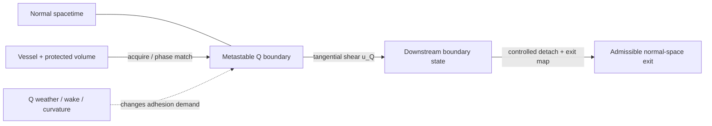
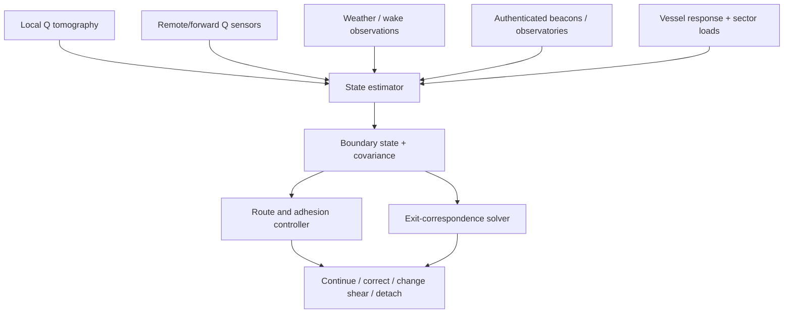
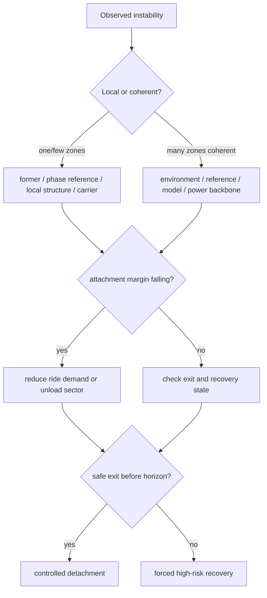
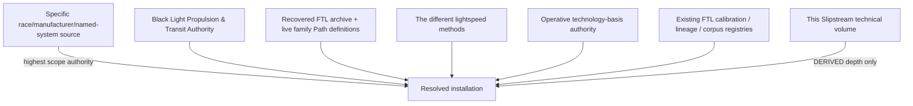

# Black Light FTL Technical Volume — Hyperspatial Slipstream Shear

**Family key:** `slipstream-shear`  
**Confirmed family action:** Q-space boundary-layer coupling; a protected vessel rides a metastable shear adjacent to normal spacetime.  
**Authority:** subordinate to `BLACK_LIGHT_PROPULSION_TRANSIT_AUTHORITY.md`, specific surviving race/manufacturer/named-system canon, the recovered FTL archive, and current live family definitions.  
**Legacy design source:** *The different lightspeed methods*, Google Drive document `1e0Xp71EFubBZgXWjjvPxAqPoJIZNwqS6nu1-r7Kil7Y`, revision `ANLCKQllC5h6dLaX5H1RpK8aUFVWsi-IV7gbMHUd0Qq7mIe5uGsLFi5_Hrsr8B6dl8t_ezB0fTSygxrnIBtifAHW79bgSbswp1zF3NaEil0`.  
**Canon discipline:** recovered names/actions are `CONFIRMED`; mathematical formalization and generic engineering consequences below are `DERIVED` unless separately sourced; example thresholds, incidents, institutions and unsourced history remain `PROPOSED` or `UNRESOLVED`.

---

## 1. What a Slipstream drive actually does

A Hyperspatial Slipstream Shear drive is not a gravitational hyperlane drive and it is not a discrete Q-Lattice translator. The consolidated authority establishes three distinct operators:

| Family | What is acted on | Operational question |
|---|---|---|
| Gravitational-Plane Skimmer | naturally curved gravitational/equipotential geometry | Which gravitational road can the vessel safely follow? |
| **Hyperspatial Slipstream Shear** | metastable Q-space boundary-layer shear adjacent to ordinary spacetime | Which moving boundary can the vessel attach to, remain phase-matched with, and safely leave? |
| Q-Lattice Phase Translation | indexed quantized Q addresses and epochs | Which discrete address transition is valid for the protected state? |

The legacy *different lightspeed methods* note describes “hyperlane methods” constrained to gravitational shear planes from focal node to focal node. In the reconciled authority that behavior belongs to the **Gravitational-Plane** family. Slipstream instead follows the independently recovered Q-boundary action. This volume keeps the two separate rather than allowing similar travel-language to overwrite their confirmed mechanics.

A useful engineering analogy is a vessel riding a moving interface between two fluids, except the “interface” is a metastable state boundary in the setting’s Q-domain and the ship must maintain a controlled field/phase relationship to it. The analogy ends there: the drive does not literally surf a material fluid.



The essential engineering problem is therefore not merely “go fast.” It is:

1. detect and characterize a usable boundary;
2. acquire it without losing protected-volume coherence;
3. match the vessel’s effective phase/transport state to its local shear;
4. maintain positive attachment margin while the boundary changes;
5. predict disturbances farther ahead than the physical abort horizon;
6. continuously preserve at least one admissible exit state;
7. detach and recover without allowing the transition itself to destroy the vessel.

---

## 2. Derived mathematical model

### 2.1 Boundary geometry

For engineering purposes, represent a usable local Q-boundary as a level surface

\[
\Sigma_Q(t)=\{x\mid q(x,t)=q_c\}.
\]

The local boundary normal is

\[
\mathbf n_Q=\frac{\nabla q}{\|\nabla q\|},
\]

and the tangential transport/shear velocity is represented by \(\mathbf u_Q\). The control system also cares about boundary curvature \(K_Q\), shear-gradient tensor \(S_Q\), temporal drift, recent wake state \(W_Q\), and the covariance attached to all of those estimates.

A compact state description is

\[
X_Q(t)=\{q,\nabla q,K_Q,S_Q,\dot S_Q,\mathbf u_Q,W_Q,\Sigma_{Q,env}\}.
\]

This representation is `DERIVED`. The Q-boundary/shear physical action itself is recovered authority.

### 2.2 Adhesion margin

Let \(A_{available}\) be the instantaneous attachment authority the installed machinery can produce and let \(A_{required}\) be the amount required by current boundary state, relative phase velocity, vessel geometry and disturbances:

\[
\mu_A=A_{available}-A_{required}(Q,\nabla Q,K_Q,S_Q,v_{rel},G_v,D).
\]

The normalized margin is

\[
m_A=\frac{\mu_A}{\max(A_{available},\epsilon)}.
\]

A route segment with

\[
\mu_A\le 0
\]

is not a valid planned ride. The machinery may physically remain attached for a transient after the estimate crosses zero, depending on lag and stored field state, but that is a failure progression rather than usable rated operation.

This distinction matters because **a faster shear can require more attachment authority**. Maximum local transport rate and maximum safe operational transport rate are not the same thing.

### 2.3 Route optimization

A mature Slipstream navigator minimizes a route functional of the form

\[
\Gamma^*=\arg\min_\Gamma
\int_\Gamma
\left[
\frac{w_t}{v_{adv}}
+w_a C_{adh}
+w_w C_{weather}
+w_k C_{curv}
+w_u C_{unc}
+w_e C_{exit}
+w_r C_{recovery}
+w_x C_{crossing}
\right]ds.
\]

Here:

- \(v_{adv}\) is usable tangential boundary advection after phase-match losses;
- \(C_{adh}\) prices attachment demand and shrinking margin;
- \(C_{weather}\) prices predicted boundary instability;
- \(C_{curv}\) prices local boundary curvature and hull-conformity burden;
- \(C_{unc}\) prices model and sensor uncertainty;
- \(C_{exit}\) prices poor normal-space exit correspondence;
- \(C_{recovery}\) protects the energy/thermal/field reserve required to get out;
- \(C_{crossing}\) prices wake intersections, discontinuities and competing shear bands.

No canonical numeric values for the weights are asserted here. They are resolver coefficients and remain `PROPOSED` until a setting source adopts them.

### 2.4 Q-weather forecast

A ship cannot operate safely by measuring only the boundary immediately touching its hull. A forecast model estimates

\[
\hat X_Q(t+\tau)=F_Q(X_Q(t),O_{remote},O_{local},M_Q,\tau)
\]

with forecast covariance

\[
\Sigma_Q(t+\tau).
\]

A healthy model should normally become less certain as the unobserved horizon grows. Higher Path maturity can enlarge the useful horizon through better sensing, richer models, faster assimilation and better control authority; it cannot legitimately set uncertainty to zero.

An important diagnostic quantity is the forecast innovation

\[
r_Q(t)=X_{measured}(t)-\hat X_Q(t).
\]

Repeated coherent innovation means the model is wrong even if the vessel has not yet lost attachment. Operators should treat that as an approaching safety problem, not congratulate the controller for successfully correcting it.

### 2.5 Exit correspondence

Detachment is a mapping problem. Let

\[
E_{exit}:X_{attached}\rightarrow X_{normal}
\]

map the boundary-attached vessel state to a candidate normal-space state. A candidate exit carries at least position, velocity, orientation, phase state, protected-volume continuity, local occupancy, reference uncertainty, structural load and recovery requirement.

A candidate exit is admissible only if it is physically representable and satisfies the installation’s certified uncertainty, occupancy, structural, thermal and recovery bounds.

This gives Slipstream a key behavioral distinction from Fold-Jump: the ship has meaningful transit-state control and can often choose *when* to detach, but it is not free to select an arbitrary point in normal spacetime. It must possess a valid correspondence from its current boundary state.

### 2.6 Safety horizon

The legacy source explicitly requires safety sensing and emergency de-transit capability to grow with transit performance. For Slipstream the useful derived relation is

\[
L_{sensor}\ge
v_{eff}
(t_{detect}+t_{forecast}+t_{solve}+t_{command}+t_{detach}+t_{exit})
+D_{margin}.
\]

This equation says something stronger than “better drives have better sensors.” If usable transport rate rises while sensing, forecasting, decision, detachment and exit execution do not improve, the **available safety margin shrinks**.

Define

\[
H_S=\frac{L_{sensor}}
{v_{eff}(t_{detect}+t_{forecast}+t_{solve}+t_{command}+t_{detach}+t_{exit})+D_{margin}}.
\]

A derived engineering convention is that \(H_S>1\) represents positive horizon margin under the modeled condition. That does not assert a setting-wide certified threshold or guarantee survival.

---

## 3. Why gravity still matters

The legacy design note establishes that all major transit methods lose tolerance near large gravitational distortions, but at different rates and for different reasons. Slipstream is not exempt merely because its primary operator is a Q-boundary.

For this family gravity can enter the problem indirectly by changing local boundary geometry, exit correspondence, reference quality, required field authority, and the cost of maintaining the artificial distortion/coupling state close to already-distorted spacetime. A practical resolver may therefore include a gravity-conditioned contribution to \(A_{required}\), \(C_{curv}\), or \(C_{exit}\) rather than copying the Gravitational-Plane drive’s route equation.

The crucial canon-safe rule is:

> **Do not turn every environmental effect into the same generic “gravity penalty.”**

A Gravitational-Plane Skimmer can benefit from a well-behaved natural gravitational road. A Slipstream vessel can encounter the same region and see a difficult Q-boundary or exit map. A Metric system may instead pay increased field-deformation burden. The universe is shared; the operators are different.

---

## 4. P0–P6 development lineage

The recovered implementation names are preserved exactly. The technical explanations below deepen their causal development rather than replacing them.

| Path | Recovered implementation | Newly solvable problem | Physical development that makes it useful |
|---|---|---|---|
| P0 | Boundary-Shear Observatory | Identify repeatable Q-boundary states and measure local shear. | Fixed resonators, sacrificial probes, stationary references. |
| P1 | Q-Boundary Probe Launcher | Hold phase match long enough to translate an instrument package and drop it out predictably. | Fast phase vanes, expendable adhesion coils, timed dropout. |
| P2 | Captive Slipstream Tunnel | Maintain a bounded artificial shear segment around macroscopic payloads. | Fixed tunnel emitters, boundary skins, endpoint reference arrays, large recovery hardware. |
| P3 | Shipboard Slipstream Coupler | Predict moving boundary flow and calculate a normal-space exit from a moving ship. | Shipwide phase skin, Q-weather sensing, distributed formers, recovery dampers. |
| P4 | Operational Shear Drive | Regulate attachment margin across independently observable hull zones. | Distributed controllers, redundant references, sectional isolation and recovery. |
| P5 | Strategic Slipstream Drive | Optimize an entire route through forecast Q-weather and competing shear bands. | Long-look sensing, ensemble prediction, higher attachment authority, larger reserve. |
| P6 | Compact Wake-Riding Drive | Co-solve boundary, wake, adhesion, vessel state and exit/recovery continuously. | Dense smart field materials, compact recovery, self-calibrating tomography, high-bandwidth reference mesh. |

The progression can be summarized as

\[
\boxed{
\text{boundary observation}
\rightarrow\text{phase match}
\rightarrow\text{macroscopic containment}
\rightarrow\text{autonomous prediction/exit}
\rightarrow\text{sectional control}
\rightarrow\text{strategic forecast routing}
\rightarrow\text{continuous adaptive co-solve}
}
\]

Nothing in that chain requires an arbitrary “P5 = eight times faster” rule. Higher performance emerges because increasingly difficult boundary states become observable, predictable, controllable and recoverable.

---

## 5. The actual shipboard machine

### 5.1 Eight-block embodiment


**Energy conditioning.** Provides the fast transient required to acquire a boundary, the continuing energy needed for attachment corrections, and a physically isolated reserve for detachment and recovery. The reserve is part of route validity rather than spare hotel power.

**Q-boundary coupler / prime mover.** Produces the controlled interaction that excites or attaches the vessel to the usable Q-boundary. Its material form changes radically by technology basis.

**Phase/adhesion skin.** Forms the coherent protected region around the complete required vessel volume. A machine confined to the engine room cannot plausibly protect an uncovered bow, external array or drive boom unless a higher-authority design establishes another coverage mechanism.

**Distributed shear controller.** Regulates local attachment margin, phase mismatch, curvature response and sector load. At mature levels it must know *where* the drive is becoming unhealthy, not only that a global gauge is declining.

**Q tomography, navigation and exit solver.** Observes local/forward boundary state, predicts Q-weather, integrates infrastructure data, authenticates references and keeps candidate normal-space exits alive.

**Detachment/recovery system.** Reduces attachment, controls phase transition, absorbs transition energy, rejects impossible exits and settles the vessel into an admissible normal-space state.

**Whole-vessel coverage.** Includes field surfaces, reference distribution and structural load paths necessary to make the vessel behave as one protected payload.

**Timing/thermal/abort backbone.** Carries trusted clocks/references, health information, heat removal and independent emergency commands. It must remain sufficiently functional under local drive faults to execute a controlled exit.

### 5.2 Simplified hull layout

```text
                  FORWARD Q-SENSOR BASELINE
          <-------------------------------------->

       [Q]   [Q]   [Q]   [Q]   [Q]   [Q]   [Q]
        |     |     |     |     |     |     |
     +================================================+
     || A1 || A2 || A3 ||  VESSEL  || A4 || A5 || A6||   <- phase/adhesion zones
     +================================================+
        \_________________||___________________/
                          ||
                 [boundary coupler]
                          ||
              [conditioning / buffer]
                          ||
           [ISOLATED DETACHMENT RESERVE]
                          ||
                 [recovery / sinks]

     Q = Q-state / phase sensing node
     A = independently observed adhesion sector
```

A species may build this as metal rings, membranes, tissues, crystal volumes or distributed postmaterial nodes. The functional geometry remains: observe ahead, cover the vessel, control locally, and retain independent exit authority.

---

## 6. Power and energy behavior

A useful accounting identity is

\[
P_{total}=P_{acquire}+P_{hold}+P_{correct}+P_{sense}+P_{compute}+P_{thermal}+P_{reserve-charge}.
\]

These terms need not peak at the same time. Boundary acquisition can be a large transient. A quiet, favorable shear may require relatively modest holding power while a turbulent boundary consumes large correction power. Emergency detachment can demand a rapid reserve discharge even when the nominal ride was energy-efficient.

The operator therefore monitors **reserve after projected exit**, not simply present reactor percentage:

\[
E_{post-exit}=E_{stored}-E_{projected\ ride}-E_{detach}-E_{settle}.
\]

A route whose expected remaining reserve cannot meet certified detachment and recovery demand is rejected even when the drive could physically continue riding.

Favorable natural or residual shear can reduce the amount of active correction required. It does not mean the ship extracts unlimited free power from the boundary, nor does a beacon or wake magically strengthen undersized field formers.

---

## 7. Navigation and control

### 7.1 Sensor fusion

A mature navigator does not ask a single detector “is the lane safe?” It estimates a state from independent observations:



Contradictory observations increase covariance. They are not averaged until the contradiction vanishes from the display.

### 7.2 Control objective

At every control horizon the system attempts to maintain:

\[
\mu_{A,i}>0\quad \forall\ \text{required sectors }i,
\]

bounded phase error,

\[
|\Delta\phi_i|<\Delta\phi_{allow,i},
\]

acceptable structural/thermal load, and at least one admissible exit.

The last condition is easy to neglect. A ship can be stably attached to a boundary and still be in mortal danger if every physically reachable exit is becoming invalid faster than a new one can be found.

### 7.3 Wake riding

The recovered P6 name **Compact Wake-Riding Drive** confirms that wake use belongs to the family’s mature development vocabulary. It does not establish that every wake is beneficial.

A preceding transit can leave a coherent residual Q disturbance. If its state is measured and compatible, that wake may reduce acquisition burden or make a useful shear easier to track. It can also carry turbulence, decay unpredictably, intersect another wake, reveal traffic history, or excite controller/structural resonance.

Accordingly a wake receives a state and covariance rather than a universal bonus:

\[
W_Q=\{A_w,\tau_w,\mathbf d_w,S_w,\Sigma_w\}.
\]

A generator may derive a benefit only after comparing the wake against the vessel’s own phase, geometry, control bandwidth and recovery limits.

---

## 8. Practical equipment manual

### Procedure SS-01 — Pre-transit certification

**Purpose:** establish that the proposed boundary ride is mathematically and physically executable before acquisition.

1. Authenticate current route, Q-weather and exit-reference records. Preserve source IDs/revisions in the transit record.
2. Run a phase-skin continuity survey over all required hull zones, including recent repair seams and deployed external structures.
3. Compare adhesion-former transfer functions against their last certified baselines. Flag coherent all-sector drift separately from isolated sector drift.
4. Build candidate boundary routes. Rank by travel utility **and** attachment, forecast, curvature, uncertainty, exit and recovery burden.
5. Demonstrate at least one planned exit and one earlier emergency detachment state.
6. Reserve detachment/recovery energy and thermal capacity before route commitment; mark it unavailable to ordinary schedule recovery.
7. Verify forward sensing horizon against current projected transport rate.
8. Permit boundary acquisition only when navigation, machinery control and recovery logic independently return an admissible state.

**Do not dispatch** because nominal shear velocity is attractive while adhesion or exit margin is marginal.

### Procedure SS-02 — Q-weather deterioration in transit

1. Compare measured boundary state with the forecast ensemble. Track innovation and covariance trend.
2. If local corrections are increasing but the estimator predicts no environmental change, treat the model/reference chain as suspect.
3. Reduce commanded use of the fastest shear band if doing so restores forward safety horizon or adhesion margin.
4. Recompute every candidate exit after a material change in boundary curvature, wake state or route reference.
5. Move load from an unhealthy adhesion sector only if neighboring sectors possess certified spare authority and structural coverage remains valid.
6. If the projected first-safe-exit time approaches the physical detach/exit horizon, command early detachment. Do not use the remaining margin to preserve schedule.

### Procedure SS-03 — Emergency controlled detachment

```text
DETECT HAZARD
     |
     v
VALID EXIT AVAILABLE? ---- no ----> Earlier / alternate exit search
     | yes                              |
     v                                  | none before horizon
FREEZE NONESSENTIAL OPTIMIZATION        v
     |                              FORCED HIGH-RISK
     v                               DETACHMENT MODE
UNLOAD FAILED SECTOR
     |
     v
REDUCE PHASE-VELOCITY ERROR
     |
     v
DETACH BOUNDARY
     |
     v
VERIFY NORMAL-SPACE OCCUPANCY
     |
     v
SETTLE / ABSORB TRANSITION ENERGY
     |
     v
ISOLATE FAULT + POST-TRANSIT INSPECTION
```

Immediate removal of all drive power is not assumed to be a safe detachment method. If stored field state and boundary coupling persist for finite time, uncontrolled power loss can remove control before it removes attachment.

### Procedure SS-M12 — Rising correction-energy diagnostic

**Symptom:** route remains attached, measured shear speed is normal, but correction energy per unit transit rises.

Check in this order:

- Is the rise coherent across all sectors? If yes, compare environment model, reference calibration and Q-weather forecast before condemning hardware.
- Is the rise localized? Inspect the affected former, local phase reference, field-active carrier, hull geometry and thermal condition.
- Did it begin after a hull repair or external configuration change? Re-run full geometry/coverage calibration.
- Does it correlate with a preceding vessel’s wake? Test wake-model error, controller bandwidth and structural resonance independently.
- Does exit mapping remain stable? If not, treat the event as broader state-estimation/reference degradation rather than an adhesion-only fault.

**Return-to-service requirement:** reproduce or bound the failed quantity, repair the authoritative cause, re-calibrate, and pass acquisition–hold–detach–recovery without using emergency reserve.

---

## 9. Failure anatomy

A useful failure tree is:



Principal derived failure classes are:

| Failure | Root physical/mathematical problem | Typical progression |
|---|---|---|
| Adhesion deficit | required coupling exceeds available authority | margin erosion → correction saturation → local detachment → cascade |
| Phase runaway | vessel/field ceases to match usable shear | phase error → asymmetric load → exit degradation → uncontrolled dropout |
| Q-weather front | boundary changes outside forecast/control horizon | model innovation → correction burden → horizon loss → early detach |
| Boundary-curvature pinch | local boundary shape cannot be conformed around protected volume | sector compression → differential load → coverage intrusion |
| Wake resonance | residual wake drives controller/structural modes | oscillatory correction → heating/fatigue → sensor/control degradation |
| Exit-correspondence loss | no reachable exit satisfies uncertainty/occupancy/recovery constraints | rejected exits → reserve consumption → horizon exhaustion |
| Reference corruption | timing/boundary/destination reference is biased or aliased | coherent wrong estimate → wrong route/control/exit decision |
| Recovery exhaustion | reserve intended for detachment has been consumed | shrinking exit set → delayed abort → damaging forced transition |

An accident report should **never stop at “drive overload.”** That phrase describes an observed condition. Root cause belongs to a more useful class: environment/model, references, mathematics, field/material authority, structure, controller latency, power, thermal state, recovery or infrastructure.

---

## 10. Scaling behavior

Slipstream machinery does not scale simply with ship mass.

A useful qualitative burden model is

\[
B_S=f(A_{skin},V_{protected},L_{max},K_{required},N_{zones},L_{sensor},E_{reserve},Q_{thermal},L_{timing}).
\]

A larger vessel usually increases phase-skin area, maximum synchronization distance, the number of independently useful control zones, structural differential load and the boundary curvature/conformity problem around complex geometry. It can also carry a larger sensor baseline, better heat sinks and larger reserve stores. Consequently “bigger” can improve some terms while worsening others.

Multiple installed drive units are likewise not simple multipliers. The generator must classify them as one of the following engineering relationships: coherent distributed sectors, redundant channels, staged acquisition/hold machinery, or separately isolated transit installations. Only then can it resolve their combined capacity and failure behavior.

P6 compactness is therefore interpreted as **higher capability density**—better field-active materials, tomography, estimation, control and recovery per unit machinery—rather than permission to remove the hull-wide phase/coverage system.

---

## 11. Infrastructure

Slipstream infrastructure can improve what the ship knows and how cleanly it enters or leaves a boundary without turning infrastructure into magical engine power.

| Infrastructure | Legitimate benefit | What it cannot do |
|---|---|---|
| Q-weather observatory | extends remote observations; reduces forecast covariance | guarantee future boundary stability |
| Surveyed slip corridor | supplies route/wake/exit history | override contradictory current measurements |
| Phase/reference beacon | improves timing, localization, authenticated exit reference | make an occupied or impossible exit valid |
| Boundary acquisition station | provides fixed high-authority entry/captive shear machinery | replace shipboard survival/recovery needs for an autonomous voyage |
| Wake traffic service | maps recent wakes, decay and crossing hazards | make every wake safe or beneficial |

Infrastructure therefore modifies specific terms in the route model. It does not receive an unexplained generic “+25% speed” modifier.

---

## 12. Signature and detection model

Slipstream transit naturally creates a family-specific Q signature. A qualitative decomposition is

\[
\mathcal S_{Slip}=
\mathcal S_{acquire}
+\mathcal S_{wake}
+\mathcal S_{correction}
+\mathcal S_{exit}
+\mathcal S_{recovery}.
\]

A mature drive can reduce wasteful excitation and correction bursts while still leaving an intrinsic boundary disturbance. A clean P6 machine is not automatically stealthy.

Forensic observations may infer route direction, wake decay, approximate protected scale, correction cadence, or repeated operating habits. They may **not** infer a race or manufacturer merely because a generic technology basis could construct that sort of machinery. Attribution needs an independently sourced signature fingerprint.

---

## 13. Technology-basis embodiments

The same operator can be built through radically different material traditions.

| Operative basis | Derived Slipstream embodiment |
|---|---|
| Terrestrial/mechanical | phased rings or hull plates, precision clocks, replaceable sensor apertures, digital sector controllers and engineered recovery sinks |
| Aquatic/pressure-native | resonant pressure membranes, wet photonic timing, fluid-compatible field surfaces, distributed hydroacoustic/Q sensing, chemistry-sensitive service procedures |
| Cryogenic/superconducting | superconducting phase loops, very-low-noise interferometry, quench-isolated sectors, cryogenic timing and cold energy/recovery buffers |
| Gas-giant/aerostat | large flexible resonator webs, long-baseline atmospheric arrays, deformable field membranes and highly sectional control |
| Biological/symbiotic | cultivated field-bearing tissues, Q-sensitive ganglia, distributed neural phase coordination, regenerative attachment organs and metabolic/chemical recovery stores |
| Mineral/crystalline | coherent lattice shells, defect-engineered Q resonators, optical/phononic timing, prestressed structural coupling and re-annealing/replacement maintenance |
| Postmaterial/distributed | coherent field nodes, executable control proofs, dense self-observation, dynamically reassigned adhesion zones and authenticated recovery-state reconstruction |

Every row above is `DERIVED` unless a specific species or named technology source confirms it. **Technology basis is not ownership.** A biological civilization is not automatically a Slipstream civilization, and a recovered Slipstream-using race is not automatically biological.

---

## 14. Training text — Why the fastest shear is often the wrong shear

An undergraduate mistake is to imagine a Q-boundary map as a highway map with a speed written on every road. The engineer’s map is closer to a weather map, structural-load chart and emergency-landing chart superimposed.

Consider two candidate bands. Band A has higher \(v_{adv}\) but requires 88% of available attachment authority and its forecast covariance grows rapidly after the first third of the route. Band B is slower but uses 55% of authority, has multiple well-characterized exit correspondences and passes a mature observation corridor. Those percentages are illustrative `PROPOSED` teaching numbers, not canonical thresholds.

If the route solver minimizes only travel time, it chooses A. If it includes adhesion, uncertainty, exit and recovery burden, B may be the rational strategic route. This is exactly the kind of distinction required by the original design instruction: technology level changes not just maximum performance but how much unsafe geometry a civilization can detect, predict, reject and recover from.

A more advanced civilization may later make A usable by increasing field authority, extending Q-weather forecast, reducing estimator covariance, improving sector control and adding better exit/recovery hardware. The route becomes faster **because several previously binding constraints moved**, not because the civilization acquired an arbitrary numerical bonus.

---

## 15. Advanced engineering lecture — stability and controllability

Let local sector state be

\[
x_i=[\Delta\phi_i,\mu_{A,i},T_i,\sigma_i,e_i]^T,
\]

where \(\Delta\phi_i\) is phase mismatch, \(\mu_{A,i}\) attachment margin, \(T_i\) thermal state, \(\sigma_i\) structural/load state and \(e_i\) local estimator error. A local linearization around a planned ride state can be written

\[
\dot x=A_Qx+B_Qu+Gw,
\]

where \(u\) is available control action and \(w\) contains boundary disturbances/model error.

A high nominal attachment capability does not guarantee useful operation. The pair \((A_Q,B_Q)\) must remain sufficiently controllable over the relevant time horizon, the estimator must observe the modes that can become dangerous, and actuator/communication latency must remain below the growth time of the unstable disturbance.

This gives a physical meaning to “better control bandwidth.” A P4+ distributed drive is safer not because its software is generically smarter, but because local unstable modes can be detected and countered before they become coherent whole-vessel detachment.

When boundary/weather dynamics become nonlinear or rapidly time varying, the P5/P6 controller becomes naturally describable as constrained model-predictive control: forecast candidate boundary states, solve a finite horizon, execute the first admissible correction, assimilate the next observation, and solve again.

---

## 16. Training accident — SS-TX-04 (PROPOSED educational exemplar)

**Status:** `PROPOSED` training case. This is not a claim that a named historical vessel existed.

A P4 training vessel enters a familiar surveyed corridor shortly after a heavier vessel. The route database marks the corridor stable. Local Q sensing agrees at acquisition, but the forward model underestimates the persistence of the preceding wake.

The first symptom is a repeating correction burst in two forward adhesion sectors. The global attachment display remains comfortably positive, so the watch initially interprets the event as harmless controller activity. The bursts then begin to phase-lock with a structural mode in an external forward boom. Local heating rises, sensor residuals increase, and the exit solver’s covariance expands because the most valuable forward sensor baseline is now vibrating outside its calibrated geometry.

The causal chain is therefore:

```text
stale wake-decay assumption
        -> underestimated wake persistence
        -> oscillatory sector correction
        -> structural resonance
        -> forward-sensor geometry error
        -> state-estimator covariance growth
        -> fewer admissible exits
        -> shrinking safety horizon
```

The correct response is not “increase drive power.” Higher correction authority can feed the resonance. The safe response is to recognize the coherent innovation, reduce shear demand, unload the affected zones within coverage limits, switch to independent sensing, and detach while a good exit still exists.

The lesson is deliberately multi-system: **navigation data, structure, sensors, control and recovery are all part of the FTL drive.**

---

## 17. Maintainer qualification questions

A qualified Slipstream maintainer should be able to explain, without resorting to “the drive is more advanced,” why:

- a faster boundary band can reduce effective route capability;
- coherent all-sector correction drift points first toward model/reference/environment causes while isolated drift points first toward local machinery;
- an apparently healthy attachment system can still require immediate abort when exit correspondence collapses;
- replacing a damaged phase-skin section requires geometry and timing recertification, not merely pressure/leak/continuity testing;
- a larger ship may need more sectional control even if its total available drive power scales faster than its mass;
- infrastructure improves particular sensor/reference/acquisition terms rather than directly rewriting the physical capacity of the ship;
- wake riding can reduce acquisition burden while increasing resonance, forecast and signature risk;
- loss of the primary power plant does not necessarily mean the field vanishes quickly enough to make an uncontrolled blackout safe.

---

## 18. Generator and API contract

A family resolver should accept at least:

```json
{
  "family": "slipstream-shear",
  "path": "P4",
  "sharedTier": "runtime-resolved T-tier",
  "technologyBasis": "operative-basis-key",
  "vessel": {
    "geometry": "authoritative-or-generated-reference",
    "condition": "current-condition-reference"
  },
  "environment": {
    "qBoundaryState": "observed-or-derived-state",
    "qWeather": "forecast-with-covariance",
    "gravity": "local-context",
    "references": "authenticated-source-set"
  },
  "infrastructure": ["optional-authority-backed-aids"],
  "mode": "AUTHORITY_ONLY"
}
```

A resolved response should not merely return `speed`. It should return:

```json
{
  "implementation": "Operational Shear Drive",
  "solution": {
    "selectedBoundary": "candidate-id",
    "route": "boundary-route-description",
    "exitSet": ["admissible-exit-id"]
  },
  "margins": {
    "adhesion": "value + provenance/status",
    "safetyHorizon": "value + provenance/status",
    "recovery": "value + provenance/status",
    "uncertainty": "covariance/grade + provenance/status"
  },
  "machinery": "eight-block technology-basis embodiment",
  "warnings": ["authority conflicts", "rejected assumptions"],
  "provenance": "complete source/status chain"
}
```

The API guardrails are mandatory:

1. Do not merge `slipstream-shear` with `gravitic-plane` because both can be described informally as following a lane.
2. Do not merge Slipstream with Q-Lattice because both use Q-domain vocabulary.
3. Do not turn route gain into a family-neutral speed multiplier.
4. Do not let favorable shear erase attachment, uncertainty, exit or recovery requirements.
5. Do not infer race/manufacturer/inventor/ownership from technology basis.
6. Do not promote derived equations or proposed teaching values into setting-wide canon through repeated generation.
7. Preserve explicit unknowns in `AUTHORITY_ONLY` mode.
8. Record rule, parents and status for every derived field in derivation modes.

---

## 19. Provenance and origin record

The source chain for this volume is intentionally visible:



### Confirmed inheritance

The following are inherited as setting/project authority rather than invented by this volume:

- `slipstream-shear` / **Hyperspatial Slipstream Shear** as a distinct transit family;
- Q-space boundary-layer coupling as its physical action;
- the seven recovered Path implementation names from Boundary-Shear Observatory through Compact Wake-Riding Drive;
- the project-wide requirement that transit methods interact differently with gravity and miscalculation/efficiency loss;
- the project-wide requirement that more capable drives need more capable safety sensing, redundancy and emergency de-transit;
- the project-wide intent to build realistic mathematical, educational, thesis, design and patent-like technical depth.

### Derived additions

This volume derives the level-surface boundary model, attachment-margin formalism, route functional, Q-weather state-estimation model, exit-correspondence model, detailed machinery decomposition, operating/maintenance doctrine, failure taxonomy, scaling model and technology-basis embodiments as constrained explanations of the confirmed family.

### Proposed/unresolved material

No canonical numeric Q constants, universal safety thresholds, inventor, first-use date, race ownership, manufacturer lineage or historical accident is asserted here. The training accident is explicitly a proposed educational exemplar.

---

## 20. Compact engineering reference chart

| Question | Slipstream answer |
|---|---|
| What moves the vessel? | Controlled attachment to a metastable Q-boundary shear. |
| What is the core mathematical object? | Time-dependent boundary state, shear field, attachment margin and exit correspondence. |
| What makes a route fast? | Favorable usable tangential shear, subject to attachment and exit constraints. |
| What makes it unsafe? | Low attachment margin, rapid Q-weather, excessive curvature, uncertain references/exits, wake interactions, insufficient recovery. |
| Why do sensors scale with speed? | The ship must forecast a dangerous boundary state before the physical detect–solve–command–detach–exit horizon closes. |
| What physically scales with vessel size? | phase-skin/coverage area, sectional control count, timing distance, load paths, sensor baseline, reserve and heat rejection. |
| What does infrastructure help? | observation, forecast, authenticated reference, acquisition and traffic/wake knowledge. |
| What is the characteristic signature? | boundary excitation, coherent Q wake, correction modulation and exit/recovery transient. |
| What is the characteristic catastrophic failure? | loss of controlled attachment or exit solvability faster than recovery can execute. |
| What is *not* established? | canonical inventor, owner race, manufacturer lineage, universal Q constants or numerical safety thresholds. |

---

## 21. Development rule for future extensions

Every future Slipstream improvement should be explainable as a causal chain:

\[
\boxed{
\text{newly solvable boundary problem}
\rightarrow
\text{physical enabling technology}
\rightarrow
\text{changed limiting term}
\rightarrow
\text{measurable operational gain}
}
\]

Examples include longer forecast horizon reducing weather uncertainty, better field-active materials increasing attachment authority, more local control zones preventing cascade, stronger recovery hardware enlarging the admissible exit set, and improved Q tomography allowing use of boundary structures that older systems could not safely distinguish.

If an extension cannot identify what problem became solvable, what machine made it solvable, and which physical limit moved, it is not yet a sufficiently grounded Black Light technology development.
