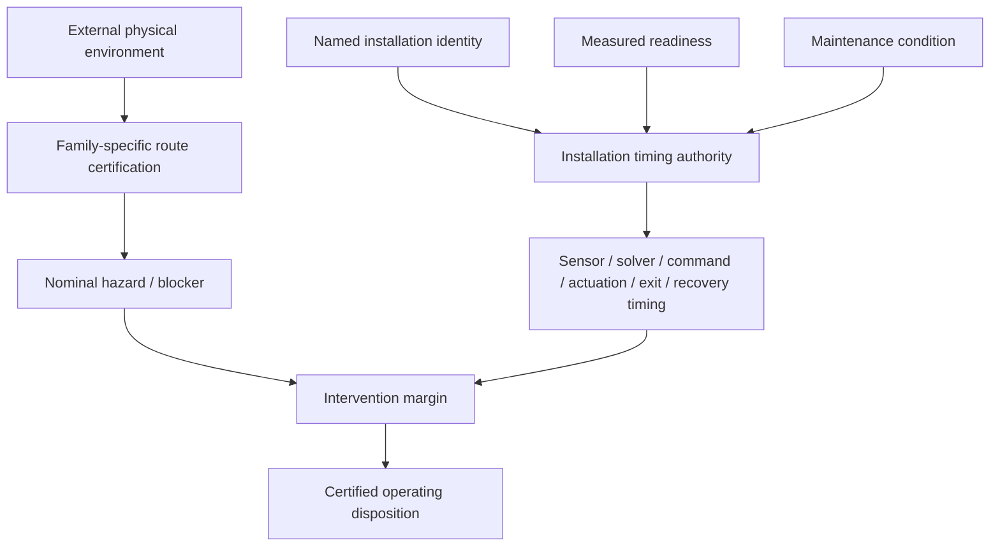

# Black Light FTL Installation Safety Timing & Maintenance Manual

**Status:** MIXED engineering authority. Physical timing algebra is engineering mathematics; family behavior remains subordinate to the consolidated propulsion/transit authority; named Ar'nock and Mur'rek facts retain their source-local status.

**Design-intent source:** *The different lightspeed methods*, document `1e0Xp71EFubBZgXWjjvPxAqPoJIZNwqS6nu1-r7Kil7Y`, revision `ANLCKQllC5h6dLaX5H1RpK8aUFVWsi-IV7gbMHUd0Qq7mIe5uGsLFi5_Hrsr8B6dl8t_ezB0fTSygxrnIBtifAHW79bgSbswp1zF3NaEil0`.

## 1. Purpose

Black Light transit safety cannot stop at a family equation and a route map. A ship survives only if its actual installation can detect a developing condition, construct a trustworthy solution, decide, transmit the decision, actuate the mechanism, leave the dangerous state, clear the local interaction region, and retain enough protected recovery authority to stabilize afterward.

This manual converts that engineering fact into a provenance-bearing installation model.

It deliberately does **not** declare that a named alien installation has canonical latencies when its source never gives them.

The authority split is:



The external universe does not become safer because a ship has better maintenance. The ship becomes better able to respond to the universe it encounters.

## 2. Intervention-time decomposition

The baseline intervention time is

\[
t_{\mathrm{int},0}
=
t_{\mathrm{sensor}}
+t_{\mathrm{solver}}
+t_{\mathrm{decision}}
+t_{\mathrm{command}}
+t_{\mathrm{actuate}}
+t_{\mathrm{exit}}
+t_{\mathrm{clear}}
+t_{\mathrm{margin}}.
\]

Each term is physically distinct.

| Term | Meaning | Typical machinery question |
|---|---|---|
| \(t_{sensor}\) | detection and measurement latency | Is the sensor physically healthy and observing the correct quantity? |
| \(t_{solver}\) | state estimation and route/hazard solution | Is the computation converged and is its covariance acceptable? |
| \(t_{decision}\) | controller or crew arbitration | Is the decision path available and permitted? |
| \(t_{command}\) | command distribution | Can the command reach all required sections? |
| \(t_{actuate}\) | prime mover / field / vane response | Does the machinery produce the commanded state? |
| \(t_{exit}\) | time to leave the transit state | Can the family-specific operator disengage safely? |
| \(t_{clear}\) | physical clearance / recoupling | Is the vessel genuinely clear rather than merely commanded clear? |
| \(t_{margin}\) | protected uncertainty margin | Is reserve being preserved rather than spent as performance? |

Collapsing these into one arbitrary “reaction time” hides the failure mode.

## 3. Readiness variables

For installation channel \(i\), define readiness

\[
0 < r_i \le 1.
\]

A measured readiness below or equal to zero is not interpreted as an enormous finite delay. It means the required channel is unavailable.

For a timing-bearing channel:

\[
t_i
=
t_{i,0}\frac{m_i}{\max(r_i,\epsilon)},
\]

where \(m_i\ge1\) is a maintenance-degradation multiplier.

The model is intentionally conservative. Readiness measurement may worsen or preserve a baseline. A named installation receives a better-than-baseline timing factor only if a source or explicitly labeled calibration establishes that capability.

### 3.1 Prediction horizon

Prediction is different from latency. Better sensor/reference/navigation state extends reliable warning horizon:

\[
t_{\mathrm{prediction}}
=
t_{\mathrm{prediction},0}
\frac{r_s r_n r_r}{m_p}.
\]

Here \(r_s\), \(r_n\), and \(r_r\) are sensor, navigation, and reference readiness.

The equation should not be read as a universal law of cognition. It is a bounded engineering model for a certification runtime.

## 4. Continuous-family intervention margin

Where a continuous family has a legitimate projected route-progress rate \(v_p\), and the conservative blocker is distance \(D_B\) ahead,

\[
M_T
=
\frac{D_B}{v_p}-t_{\mathrm{int}}.
\]

Equivalently,

\[
M_D=D_B-v_p t_{\mathrm{int}}.
\]

Positive margin is required for clean modeled clearance:

\[
M_T>0.
\]

The semantic safeguard remains absolute:

\[
v_p>c
\not\Rightarrow
v_{\mathrm{hull,local}}>c.
\]

Projected route progress is not automatically local hull velocity.

## 5. PRECOMMIT families

Q-Lattice, Fold Jump, and Phase Displacement retain precommit timing semantics.

Their appropriate margin is

\[
M_T=t_{\mathrm{prediction}}-t_{\mathrm{int}}.
\]

No intermediate local superluminal velocity is invented simply to reuse a continuous-route equation.

## 6. Control-span scaling

Large installations create a second timing burden even when individual components are fast.

Define

\[
\Pi_c=\frac{L_c}{v_c\tau_r},
\]

where:

- \(L_c\) is the span over which coordinated control is required;
- \(v_c\) is effective control-information propagation speed in the installed carrier;
- \(\tau_r\) is the required reaction interval.

As \(\Pi_c\) rises, centralized control becomes progressively less credible. Large vessels therefore tend toward regional sensors, sectional abort authority, distributed recovery stores, and independently isolatable machinery.

This is not merely a software architecture choice. It is a finite-propagation problem.

## 7. Recovery reserve

Protected recovery authority is not spare performance.

A simple installation mapping is

\[
R_{\mathrm{protected,eff}}
=
R_{\mathrm{protected},0}r_{\mathrm{recovery}}.
\]

The reserve can therefore degrade because of damaged storage, unavailable coolant, depleted metabolic support, disconnected field sections, failed hydraulic pressure, or other technology-specific mechanisms.

The certification rule remains:

\[
R_{\mathrm{protected,eff}}
\ge
R_{\mathrm{required}}.
\]

A drive with excellent nominal output but inadequate recovery reserve is not certified by this model.

## 8. Technology embodiments

### 8.1 Terrestrial electromechanical

A terrestrial installation may implement the chain as separate gradiometers, clocks, navigation computers, safety PLCs, field controllers, high-energy switching, actuator buses, emergency dump networks, coolant circuits, and reserve-energy stores.

Common measurable readiness quantities include oscillator stability, bus latency, solver convergence, actuator slew, breaker performance, coolant flow, capacitor or flywheel reserve, structural alignment, and sensor calibration covariance.

### 8.2 Biological / symbiotic

A biological implementation can satisfy the same engineering requirements without resembling a terrestrial rack.

Sensor readiness may be tissue viability and sensory coherence. Solver readiness may be cultivated neural synchrony. Command transmission may be neural, ionic, acoustic, optical, chemical, or mixed. Actuation may depend on metabolically active field organs. Recovery may require energy reserve **and** restoration of biological state.

The mathematics is shared; the machinery is not.

### 8.3 Aquatic electrochemical / hydraulic

An aquatic installation may use conductive fluid, dielectric working media, pressure networks, electrochemical reference structures, deformable field surfaces, and current-topology displays.

Timing is then coupled to fluid condition. A hydraulic control path with entrained gas or contamination may be slower even when electrical power is ample.

### 8.4 Mineral-photonic

A mineral-photonic installation may encode timing authority in resonant cavities, crystal domains, optical phase networks, piezoelectric actuation, or polarization-state control. Failure may appear as linewidth broadening, mode hopping, cracked lattice orientation, or thermal phase drift.

### 8.5 Gas-giant volumetric

A gas-giant technology may distribute sensing and control through pressure layers, charged aerosols, plasma structures, or electrostatic volumetric references. “Command latency” can therefore be a three-dimensional propagation problem rather than a wire-length problem.

## 9. Ar'nock application

The current Ar'nock record establishes machinery ancestry but not canonical transit performance.

Confirmed or strongly constrained evidence includes cultivated neural computation, biological fabrication, vibration-based interfaces, and distributed biological/symbiotic implementation pressure.

It does **not** establish:

- transit family;
- canonical sensor latency;
- solver latency;
- actuation latency;
- exit time;
- recovery reserve;
- universal Ar'nock performance coefficient.

Therefore the correct timing result from Ar'nock identity alone is **UNRESOLVED**.

### 9.1 Ar'nock readiness model

A useful family-neutral readiness vector is

\[
\mathbf R_A=
[r_s,r_n,r_r,r_{neural},r_{metabolic},r_{vascular},r_{isolation},r_{structural}]^T.
\]

A larger damaged biological installation may also require a coordination penalty of the form

\[
\Pi_A
=
\frac{L}{v_c t_r}(1+\sigma_f+\sigma_i),
\]

where \(\sigma_f\) measures flex/damage disturbance and \(\sigma_i\) biological-state inhomogeneity.

These are derived engineering tools, not recovered Ar'nock equations.

## 10. Zwlei Mur'rek application

The Mur'rek source provides much stronger installation-specific machinery evidence while still leaving consolidated FTL-family identity unresolved.

Confirmed machinery includes:

- Gravitic Slipstream Regulator;
- flexible field vanes immersed in dielectric fluid;
- Navigation Current Well;
- Forward Sensor Ampulla;
- Sensor Choir Alcove;
- bio-reactive power fluids;
- conductive coolant;
- nutrient media;
- hydraulic control pressure;
- command arbitration and isolation;
- asymmetric-vane failure capable of rotating the local inertial frame.

These facts are enough to determine **which condition variables matter**.

They are not enough to invent absolute seconds.

### 10.1 Mur'rek readiness vector

\[
\mathbf R_M=
[
 m_{vane},
 m_{dielectric},
 m_{power},
 m_{cool},
 m_{hyd},
 m_{sensor},
 m_{grav},
 m_{nav},
 m_{struct}
]^T.
\]

A conservative admission relation remains:

\[
A_{op}=\bigwedge_i(m_i>0).
\]

### 10.2 Vane asymmetry

Define weighted response error

\[
\epsilon_v
=
\|\mathbf u_{commanded}-\mathbf u_{observed}\|_W.
\]

Increasing \(\epsilon_v\) should worsen actuator and reference readiness before it is treated merely as an efficiency loss.

The source-established reason is severe: asymmetric vane response can rotate the local inertial frame.

### 10.3 Sensor loss and lookahead

Loss of the Forward Sensor Ampulla or part of the Sensor Choir should primarily reduce

\[
r_{sensor},\quad r_{navigation},\quad t_{prediction},
\]

rather than magically lowering drive output.

This gives battle damage a physically coherent effect: the same machinery may still energize, but the route envelope shrinks because reliable warning and state estimation collapse.

### 10.4 Fluid degradation

Dielectric contamination, conductive-coolant failure, nutrient loss, hydraulic-pressure loss, and bio-reactive power-fluid contamination affect different channels.

They should not be collapsed into a single “drive health” percentage.

A useful power/media readiness floor is

\[
R_P=
\min
\left(
\frac{P_{bio}}{P_{req}},
\frac{Q_{cool}}{Q_{req}},
\frac{H_{hyd}}{H_{req}},
\frac{N_{met}}{N_{req}}
\right).
\]

If hydraulic authority is the minimum, adding electrical energy does not repair the actuator timing problem.

## 11. Signature consequences

Maintenance degradation changes observability as well as safety.

A generic signature vector is

\[
\mathbf S=
[S_{EM},S_{thermal},S_{grav},S_{chem},S_{acoustic},S_{exotic},S_{wake},S_{bio}]^T.
\]

Examples:

| Failure | Timing effect | Signature effect |
|---|---|---|
| degraded coolant | slower permitted recovery, possible thermal block | larger thermal plume |
| vane asymmetry | longer/unsafe actuation | asymmetric gravitic or inertial disturbance |
| sensor loss | shorter prediction horizon | may reduce active emissions but worsen route knowledge |
| hydraulic leak | slower actuator response | acoustic/chemical evidence |
| neural desynchronization | solver/decision uncertainty | biological/metabolic anomaly |
| damaged field segmentation | slower clear/exit behavior | irregular field or wake structure |

A quieter vessel is not automatically a safer vessel.

## 12. Maintenance model

Maintenance should be recorded as channel-specific evidence.

A component can be repaired yet remain uncertified.

The general chain is:

```text
repair
  ↓
functional test
  ↓
calibration
  ↓
latency / authority measurement
  ↓
readiness update
  ↓
route recertification
```

“Working” and “certified for transit” are different states.

## 13. Practical equipment procedures

### IST-01 — Timing-chain baseline

1. Place the installation in a non-transit test state.
2. Verify reference-frame and clock identity.
3. Inject a known sensor stimulus.
4. Measure detection timestamp.
5. Measure solver convergence timestamp.
6. Measure decision/arbitration completion.
7. Measure command arrival at each required section.
8. Exercise actuator at low authority.
9. Measure achieved state versus command.
10. Store the timing packet with calibration provenance.

### IST-02 — Sensor-lookahead certification

1. Verify sensor health and pointing/coverage.
2. Verify navigation/reference covariance.
3. Run a known moving-source solution.
4. Compare prediction against held-back truth data.
5. Determine the horizon before uncertainty exceeds the active route criterion.
6. Record the measured horizon; do not extrapolate beyond it.

### IST-03 — Distributed command audit

1. Identify the longest safety-critical command path.
2. Measure propagation to each sectional controller.
3. Compare sectional timestamps.
4. Calculate \(\Pi_c\).
5. If the reaction requirement is shorter than verified coordination, reduce authority or sectionalize control.

### IST-04 — Recovery reserve proof

1. Isolate advertised performance reserve from protected recovery reserve.
2. Measure available protected energy/working medium/state authority.
3. Simulate or perform the permitted low-energy exit sequence.
4. Measure actual recovery consumption.
5. Include damaged-section isolation burden.
6. Reject certification if protected reserve falls below requirement.

### IST-05 — Mur'rek regulator inspection

1. Sample dielectric fluid independently from power/coolant media.
2. Inspect vane geometry and compliance.
3. Verify hydraulic pressure.
4. Calibrate inertial and gravitic references.
5. Compare commanded and observed vane vectors.
6. Verify Navigation Current Well against independent sensor solution.
7. Exercise isolation before increasing authority.
8. Record each readiness channel independently.

### IST-06 — Ar'nock cultivated-controller assessment

1. Establish organism/machinery viability without assuming human instrumentation semantics.
2. Map vibration/acoustic and cultivated-neural signal paths.
3. Identify regional isolation boundaries.
4. Measure propagation and response empirically.
5. Record tissue/metabolic state separately from family behavior.
6. Leave absolute transit timing and family assignment unresolved unless recovered evidence establishes them.

### IST-07 — Post-repair recertification

1. Preserve the pre-repair timing packet.
2. Record replaced, regrown, realigned, flushed, or recalibrated components.
3. Repeat only the affected channel tests plus shared-reference tests.
4. Compare against previous covariance and latency.
5. Do not restore the old certificate merely because nominal function returned.

### IST-08 — Derelict survey

1. Assume isolated subsystems may remain energized.
2. Acquire passive EM, thermal, chemical, gravitic, acoustic, exotic and biological baselines.
3. Map stored energy and pressure.
4. Identify timing-critical sensor/control paths before energization.
5. Treat archived settings as historical evidence, not current calibration.
6. Preserve source terminology and unresolved family identity.

## 14. Failure taxonomy

`IST-NO-IDENTITY` — no applicable installation identity can be established.

`IST-UNRESOLVED-NAMED` — a named installation is known but its numeric timing authority is unresolved.

`IST-READINESS-ZERO` — a required readiness channel is unavailable.

`IST-MAINT-PENALTY` — measured degradation increases intervention time.

`IST-REFERENCE-DIVERGENCE` — inertial/gravitic/reference channels disagree beyond certified bounds.

`IST-SENSOR-HORIZON` — reliable prediction horizon is shorter than intervention requirement.

`IST-ACTUATOR-ASYMMETRY` — commanded and observed actuator states diverge.

`IST-RECOVERY-RESERVE` — protected recovery authority is insufficient.

`IST-PRECOMMIT-VELOCITY-FABRICATION` — a nonlocal/precommit family was given a fictitious intermediate velocity.

`IST-FAMILY-PROMOTION` — machinery terminology or race identity was incorrectly used to select a transit family.

`IST-PROVENANCE-LOSS` — adjusted timing lacks baseline values or source ancestry.

## 15. Generator rules

A generator should first resolve family independently, then machinery identity, then route physics, then measured condition.

```text
family authority
     ↓
physical route authority
     ↓
identity / machinery authority
     ↓
measured readiness + maintenance
     ↓
installation timing packet
     ↓
family certification
```

Never reverse the first and third steps.

“Gravitic” in a component name does not select Gravitational Plane.

“Slipstream” in a local alien term does not select Slipstream/Shear.

Biological construction does not select a family.

A named race does not carry universal timing coefficients unless its authoritative sources actually establish them.

## 16. API contract

Resolver:

`resolveFTLInstallationSafetyTiming(context)`

Inputs:

- `baselineTiming`
- `baselineRecovery`
- `family`
- `namedTechnologyId`
- `vesselId`
- `installationId`
- `manufacturerId`
- `raceId`
- `readiness`
- `maintenancePenalty`
- `provenance`

Outputs preserve:

- status;
- baseline-derived timing state;
- adjusted recovery state;
- selected record;
- readiness vector;
- applied factors;
- warnings;
- provenance.

## 17. Educational sequence

### Transit Safety Engineering 690 — Installation Timing, Degradation, and Recovery Authority

Students should be able to:

1. decompose total intervention time;
2. distinguish prediction horizon from response latency;
3. model readiness without fabricating positive performance;
4. explain why large control span matters;
5. preserve PRECOMMIT semantics;
6. reconstruct technology-specific machinery without changing the underlying mathematics;
7. separate named-source facts from derived timing models;
8. explain why repaired machinery still requires recertification;
9. track reserve authority independently from nominal performance;
10. defend an `UNRESOLVED` answer when source evidence does not support a number.

## 18. Research progression

The next higher-fidelity work should proceed in this order:

```text
channel-specific measured readiness
        ↓
installation-specific empirical latency distributions
        ↓
correlated sensor / solver / actuator failure models
        ↓
sectional control-span models
        ↓
thermal and recovery-state coupling
        ↓
family-specific exit dynamics
        ↓
named manufacturer / refit calibration histories
```

No later stage should retroactively turn an earlier proposal into historical canon.

## 19. Canon safeguards

The following statements are mandatory:

- external gravitational physics is independent of species identity;
- installation readiness changes response capability, not the external universe;
- Ar'nock transit family and canonical timing remain unresolved;
- Mur'rek consolidated family and absolute timing remain unresolved;
- measured deterioration can worsen timing without requiring invented canon;
- a source-established improvement may be represented only with explicit provenance;
- protected recovery reserve cannot be spent to make nominal performance look better;
- PRECOMMIT families remain precommit;
- operator terminology is not a normalized family assignment;
- every timing adjustment must retain its baseline and provenance.
