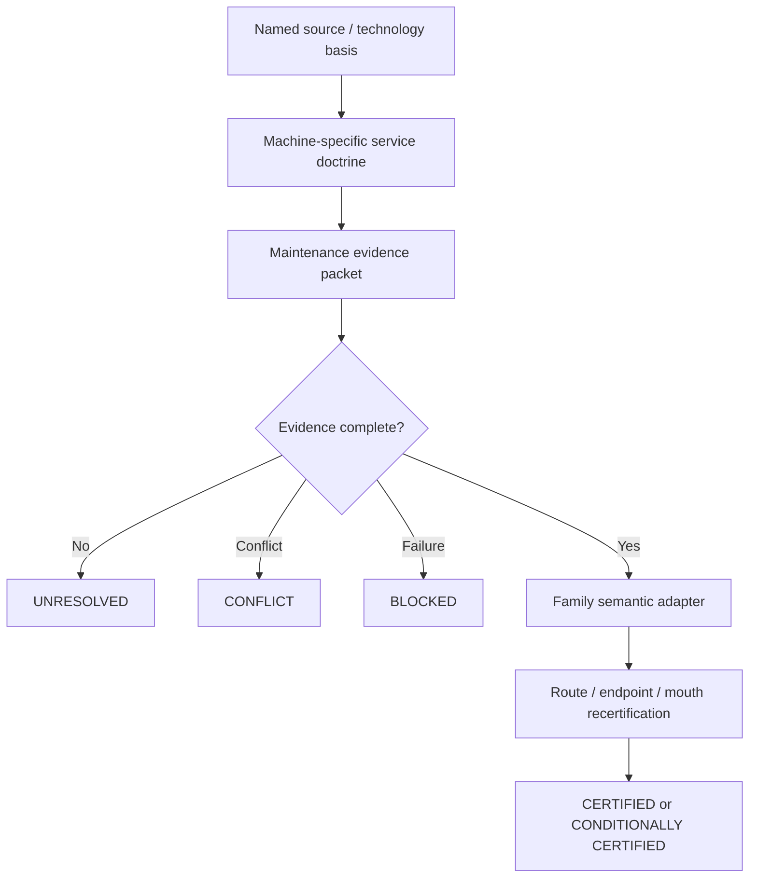
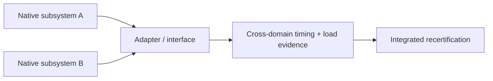

# Black Light FTL Maintenance Evidence and Return-to-Service Manual

**Status:** derived cross-civilization engineering manual subordinate to `BLACK_LIGHT_PROPULSION_TRANSIT_AUTHORITY.md` and to all narrower named race, manufacturer, vessel, installation, and technology authorities.  
**Design-intent source:** *The different lightspeed methods*.  
**Purpose:** define a common evidence grammar for maintaining, repairing, refitting, salvaging, and recertifying propulsion/transit machinery without forcing different civilizations to share the same tools, materials, service boundaries, or machine architecture.

---

## 1. Governing principle

A transit installation may be built from terrestrial boards and buses, Ar'nock integrated solid-state modules, Zwlei Mur'rek field vanes and reactive fluids, mineral-photonic resonators, biological machinery, or a hybrid salvage stack. The **questions required for safe return to service** can still be comparable even when the machines answering those questions are radically different.

\[
\boxed{\text{same certification question}\neq\text{same machine}}
\]

The common contract therefore standardizes **evidence classes**, not hardware.



The machinery-specific service doctrine remains authoritative for how evidence is acquired. The cross-civilization packet is authoritative only for how that evidence is **organized and interpreted** within propulsion/transit certification.

---

## 2. Authority and provenance

The resolution order is:

1. named installation, vessel, manufacturer, species, named technology, and surviving maintenance record;
2. `BLACK_LIGHT_PROPULSION_TRANSIT_AUTHORITY.md`;
3. recovered family physics and live family semantics;
4. civilization/technology-basis engineering authority;
5. this maintenance-evidence contract;
6. labeled derived engineering controls;
7. labeled proposals and simulation-only defaults.

A lower layer may never erase a higher-authority contradiction merely because its output is numerically convenient.

### 2.1 Evidence status vocabulary

| Status | Meaning |
|---|---|
| `PASS` | required evidence positively satisfies its acceptance criterion |
| `CONDITIONAL` | evidence supports only a narrower operating envelope |
| `FAIL` | a required criterion is violated |
| `UNRESOLVED` | evidence is absent or insufficient |
| `CONFLICT` | equal-authority evidence disagrees |
| `NOT_APPLICABLE` | the evidence class genuinely does not apply |
| `SIMULATION_ONLY` | generated scenario evidence, never setting canon |

The system-level disposition uses:

`CERTIFIED`, `CONDITIONALLY_CERTIFIED`, `BLOCKED`, `UNRESOLVED`, `CONFLICT`, or `SIMULATION_ONLY`.

Unknown is not pass.

---

## 3. The eleven evidence classes

### 3.1 Identity

The service packet must identify the actual installation being certified. At minimum this means installation identity; where available it should also preserve vessel, manufacturer, species, named technology, hardware revision, software/logic revision, refit identity, and calibration ancestry.

A replacement that fits mechanically but has unknown logic or calibration identity remains unresolved.

### 3.2 Interface

Evidence must cover the interfaces relevant to that technology basis:

- mechanical datums and load transfer;
- electrical or field-power connection;
- thermal contact and cooling;
- fluid/hydraulic/pneumatic service;
- data, control, timing, and reference paths;
- environmental or pressure boundary;
- biological or metabolic support where explicitly applicable.

\[
\boxed{\text{physical fit}\not\Rightarrow\text{functional compatibility}}
\]

### 3.3 Static health

Static health means the system passes non-transient checks appropriate to its machinery. Examples include continuity, insulation resistance, fluid containment, zero-load actuator position, resting resonance, pressure integrity, sensor zero, or biological baseline viability.

Static health is useful but insufficient.

### 3.4 Dynamic health

Dynamic health requires representative operating demand. A drive controller that works on a bench but overheats under load has not passed. A Mur'rek vane that moves unloaded but loses hydraulic authority under field load has not passed. An Ar'nock module whose timing drifts during thermal soak has not passed.

### 3.5 Calibration

Calibration evidence includes whatever the installation uses to establish measurement and control truth:

- timing/reference state;
- alignment and geometry;
- sensor scale factors/biases;
- actuator response;
- solver revision and calibration constants;
- field or fluid reference state;
- cross-covariance status where multiple measurements are fused.

Missing calibration is not zero error.

### 3.6 Timing

The generic intervention chain remains:

\[
t_{int}=t_{sensor}+t_{solver}+t_{decision}+t_{command}+t_{actuate}+t_{exit}+t_{clear}+t_{margin}.
\]

For bounded nonnegative stage intervals:

\[
T_{int}=\left[\sum_i t_{i,lower},\ \sum_i t_{i,upper}\right].
\]

This interval construction is valid without assuming statistical independence. If a stage is unknown, the upper intervention bound is unresolved rather than treating the stage as zero.

### 3.7 Protected power and energy reserve

Stored energy and instantaneous power are different constraints.

Define the conservative protected energy margin:

\[
M_E=E_{available,protected,lower}-E_{required,upper}.
\]

A positive energy margin is necessary but not sufficient. Throughout the safety-critical interval:

\[
P_{available,lower}(t)\ge P_{required,upper}(t).
\]

A system can therefore contain enough total energy while still being incapable of delivering the required peak power.

For a constant power deficit with protected buffer energy \(E_b\):

\[
t_{hold}=\frac{E_b}{P_L-P_a},\qquad P_L>P_a.
\]

If \(t_{hold}<t_{int}\), the protected store cannot sustain the complete intervention sequence.

### 3.8 Thermal reserve

For a short lumped transient:

\[
C_{th}\frac{dT}{dt}=P_{heat}-P_{reject}.
\]

With approximately constant terms:

\[
T(t)=T_0+\frac{P_{heat}-P_{reject}}{C_{th}}t.
\]

A simple conservative thermal margin is:

\[
M_T^{thermal}=T_{limit}-T(t_{int}).
\]

The lumped model is not universal. Phase change, strongly temperature-dependent heat capacity, active-control transitions, changing coolant flow, radiative nonlinearities, or spatial hot spots require a more detailed model.

### 3.9 Sectional topology

Large vessels and distributed installations cannot be reduced to a single health number. Required services must physically reach each consumer.

For a directed service graph \(G=(V,E)\), the availability of path \(p\) can be represented deterministically as:

\[
A_p=\min\left(A_{source},\min_{e\in p}A_e\right).
\]

The strongest surviving service path is:

\[
A_s=\max_p A_p.
\]

Propagation delay remains:

\[
\tau_p=\sum_{e\in p}\tau_e.
\]

Reachability and timeliness are separate.

\[
\boxed{\text{reachable}\neq\text{timely}\neq\text{certified}}
\]

### 3.10 Family-specific evidence

Maintenance evidence does not replace family physics. It hands a trusted or bounded machine state to the family-specific certification layer.

### 3.11 Provenance

Every accepted claim should retain source, scope, revision/epoch, evidence class, and status. Refit records preserve original machinery ancestry rather than rewriting it under the current operator.

---

## 4. Family semantic adapters

### 4.1 Continuous projected-progress families

Metric-envelope, gravitational-plane, slipstream-shear, n-manifold, and inertial-torch use continuous projected-progress semantics in the consolidated authority.

If \(D_B\) is conservative remaining blocker distance and \(v_p\) is projected route progress speed:

\[
M_T=\frac{D_B}{v_p}-t_{int}.
\]

Equivalently:

\[
M_D=D_B-v_pt_{int}.
\]

The meaning of \(v_p\) is critical:

\[
\boxed{v_p>c\not\Rightarrow\text{local hull velocity}>c}.
\]

For uncertain nonnegative progress \(v_p\in[v_l,v_u]\) and intervention time \(T\in[T_l,T_u]\):

\[
D_{int}\in[v_lT_l,\ v_uT_u].
\]

The conservative blocker comparison uses the upper intervention distance.

If progress varies materially during the intervention:

\[
D_{int}=\int_{t_0}^{t_0+T}v_p(t)\,dt,
\]

with a conservative upper bound based on the admissible \(v_{p,max}(t)\).

### 4.2 PRECOMMIT endpoint families

Q-lattice, fold-jump, and phase-displacement are endpoint/precommit families.

Use:

\[
M_T=t_{prediction}-t_{int}.
\]

Do **not** invent an along-route intervention distance or a local FTL velocity merely to make the mathematics resemble continuous transit.

### 4.3 Anchored portal family

Wormhole-gate certification concerns:

- entry-mouth condition;
- synchronization/reference agreement;
- aperture/throat stability;
- admission timing;
- exit-mouth condition;
- clearance;
- recovery reserve.

There is no need to invent a free-flight velocity between mouths.

---

## 5. Technology-basis embodiments

### 5.1 Terrestrial electromechanical

Typical evidence may come from PCB/module electrical characterization, firmware identity, bus timing, calibrated sensors, mechanical alignment, thermal soak, current/voltage waveforms, and protected electrical stores.

The existence of component-level repair practices does not make them universal.

### 5.2 Ar'nock solid-state modular

Current authoritative Ar'nock general technology is solid-state electromechanical, silicon-computational, highly modular, ruggedized, and strongly piezoelectric.

Typical service evidence therefore includes:

- module identity and ancestry;
- electrical characterization of complete functional modules;
- piezoelectric impedance/resonance evidence;
- datum and alignment verification;
- bus/timing/protocol evidence;
- thermal soak and interface heating;
- module-level replacement and recertification.

Bioprinting belongs principally to feedstock, medicine, environmental support, and life support unless a narrower source establishes a biological exception.

### 5.3 Zwlei Mur'rek fluid/vane machinery

Mur'rek machinery can require evidence from:

- field-vane symmetry;
- dielectric-fluid condition;
- hydraulic authority;
- bio-reactive power-fluid state;
- conductive coolant flow;
- Navigation Current reference agreement;
- Forward Sensor Ampulla and Sensor Choir evidence;
- isolation and recovery machinery.

The phrase **gravitic slipstream** remains a named-technology description, not an automatic family assignment.

\[
\text{gravitic slipstream}\not\Rightarrow\texttt{gravitational-plane}
\]

\[
\text{gravitic slipstream}\not\Rightarrow\texttt{slipstream-shear}.
\]

### 5.4 Mineral piezo-photonic

Possible evidence includes resonant linewidth, polarization/domain state, optical phase/reference integrity, fracture mapping, thermal drift, and crystal-domain alignment. Coefficients remain installation-specific unless sourced.

### 5.5 Biological/symbiotic exception

Where a specific source genuinely establishes biological machinery, relevant evidence may include tissue health, signaling latency, metabolic reserve, transport/perfusion, biochemical isolation, and control-state reproducibility.

Biological evidence is not selected merely because a species is alien.

### 5.6 Gas-giant volumetric systems

A volumetric installation may express machinery state through pressure fields, electrostatic confinement, distributed timing, stratification, flow, and volumetric reference consistency rather than discrete racks or modules.

### 5.7 Hybrid and salvage installations

For a hybrid installation, retain each subsystem's original machinery ancestry and add adapter evidence explicitly.



Operator identity does not erase original manufacturer or species ancestry.

---

## 6. Failure taxonomy

Recommended maintenance-evidence failures:

| Code | Meaning |
|---|---|
| `MEC-ID-UNKNOWN` | installation/module identity unresolved |
| `MEC-INTERFACE-UNVERIFIED` | one or more required interfaces lack acceptance evidence |
| `MEC-STATIC-FAIL` | static health criterion failed |
| `MEC-DYNAMIC-FAIL` | representative load test failed |
| `MEC-CAL-UNKNOWN` | calibration state unresolved |
| `MEC-TIMING-UNBOUNDED` | one or more intervention stages lack usable bounds |
| `MEC-POWER-ENERGY` | protected energy insufficient |
| `MEC-POWER-PEAK` | peak delivery insufficient despite stored energy |
| `MEC-THERMAL-MARGIN` | thermal limit reached or crossed during required sequence |
| `MEC-TOPOLOGY-DISCONNECTED` | required service path absent |
| `MEC-TOPOLOGY-LATE` | service path exists but latency exceeds certified timing |
| `MEC-FAMILY-UNKNOWN` | family-specific recertification required but family identity unresolved |
| `MEC-PROVENANCE-GAP` | conclusion cannot be traced to sufficient evidence |
| `MEC-CANON-LEAK` | proposed/simulation material incorrectly promoted to canon |

---

## 7. Practical field procedure MEC-01

### Step 1 — Freeze evidence before disturbance

Capture fault state, telemetry, references, active configuration, module identities, temperatures, pressures, bus state, fluid condition, timing, and alarms before cycling or reseating machinery where safe to do so.

### Step 2 — Resolve identity and service authority

Determine the narrowest applicable service source: installation, vessel, manufacturer, named technology, species, technology basis, or generic contract.

### Step 3 — Establish the service boundary

Identify which elements are field replaceable, bay-serviceable, depot-serviceable, foundry/remanufacture only, or unknown.

### Step 4 — Verify interfaces

Inspect every interface actually required by the subsystem. Do not stop at the failed module itself; a replacement can be healthy while its power, cooling, command, timing, hydraulic, dielectric, or structural dependency remains damaged.

### Step 5 — Perform static evidence tests

Use technology-appropriate static checks.

### Step 6 — Perform dynamic evidence tests

Exercise representative load, timing, thermal, flow, pressure, field, actuation, or biological demand.

### Step 7 — Re-establish calibration

Restore identity-linked calibration and independently verify reference state.

### Step 8 — Recompute safety timing and reserves

Re-evaluate intervention timing, protected energy, peak power, thermal margin, and sectional topology.

### Step 9 — Run family-specific recertification

Only after family identity is independently resolved.

### Step 10 — Record disposition and provenance

Return `CERTIFIED`, `CONDITIONALLY_CERTIFIED`, `BLOCKED`, `UNRESOLVED`, `CONFLICT`, or `SIMULATION_ONLY` with reasons and source links.

---

## 8. Worked example: power reserve is not peak power

Suppose a repaired installation has:

\[
E_{available,protected,lower}=48\,MJ
\]

and:

\[
E_{required,upper}=31\,MJ.
\]

Then:

\[
M_E=17\,MJ>0.
\]

But the emergency field-collapse stage requires:

\[
P_{required,upper}=9.2\,MW
\]

while the protected converter path can guarantee only:

\[
P_{available,lower}=7.8\,MW.
\]

The system is **blocked**, despite positive total energy margin.

---

## 9. Worked example: thermal recertification

Take:

\[
C_{th}=5.0\times10^6\,J/K,
\quad P_{heat}=3.0\,MW,
\quad P_{reject}=1.5\,MW,
\]

\[
T_0=340\,K,
\quad T_{limit}=355\,K,
\quad t=30\,s.
\]

Then:

\[
\Delta T=\frac{1.5\times10^6}{5.0\times10^6}(30)=9\,K,
\]

so:

\[
T(30)=349\,K
\]

and:

\[
M_T^{thermal}=6\,K.
\]

That is a positive short-transient margin under the stated assumptions, not a universal certification for every duty cycle.

---

## 10. Generator contract

A generated maintenance packet should follow:

```text
named identity / authority
        ↓
technology basis
        ↓
service-event description
        ↓
11 evidence classes
        ↓
timing + reserve calculations
        ↓
family semantic adapter
        ↓
certification disposition
        ↓
provenance-bearing output
```

Generation rules:

1. resolve technology basis before choosing tools or maintenance vocabulary;
2. resolve FTL family independently from species and machinery style;
3. preserve baseline and post-service states separately;
4. keep unknowns unresolved;
5. keep bounds and units explicit;
6. never use machinery signature alone as family proof;
7. never allow self-test success to substitute for route/endpoint/mouth certification;
8. never promote simulation defaults to canon;
9. retain manufacturer, refit, and subsystem ancestry in hybrid systems;
10. preserve the distinction between energy, peak power, thermal capacity, control authority, and sensing evidence.

---

## 11. Educational text — Transit Safety Engineering 740

### Course title

**Transit Safety Engineering 740 — Cross-Civilization Maintenance Evidence and Return-to-Service Certification**

### Learning objectives

A qualified student should be able to:

- distinguish machinery embodiment from certification semantics;
- construct an evidence packet without inventing missing values;
- calculate bounded intervention time;
- distinguish energy sufficiency from peak-power sufficiency;
- use a short thermal transient model within its validity domain;
- trace sectional reachability and latency;
- apply continuous, PRECOMMIT, and portal family semantics correctly;
- preserve species/manufacturer/refit provenance;
- explain why a repaired subsystem can work locally but remain uncertified for transit.

### Examination principle

A correct answer that hides an unknown behind a convenient zero is incorrect.

A correct answer that replaces alien machinery with terrestrial nouns is incomplete.

A correct answer that preserves uncertainty, provenance, and family semantics is engineering.

---

## 12. Canon safeguards

\[
\boxed{\text{maintenance evidence}\neq\text{FTL family identity}}
\]

\[
\boxed{\text{machine health}\neq\text{route safety}}
\]

\[
\boxed{\text{stored energy}\neq\text{deliverable peak power}}
\]

\[
\boxed{\text{reachable service path}\neq\text{timely service path}}
\]

\[
\boxed{\text{unknown evidence}\neq\text{passing evidence}}
\]

\[
\boxed{\text{same mathematics}\neq\text{same machine}}
\]

These rules are the central purpose of this contract.
