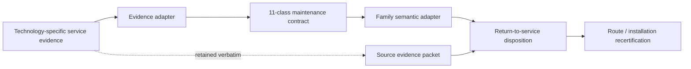
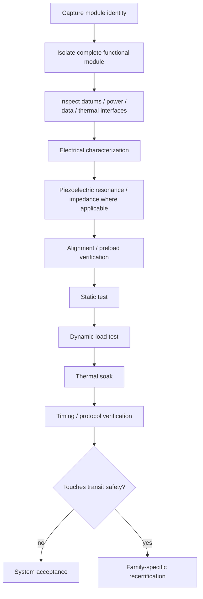
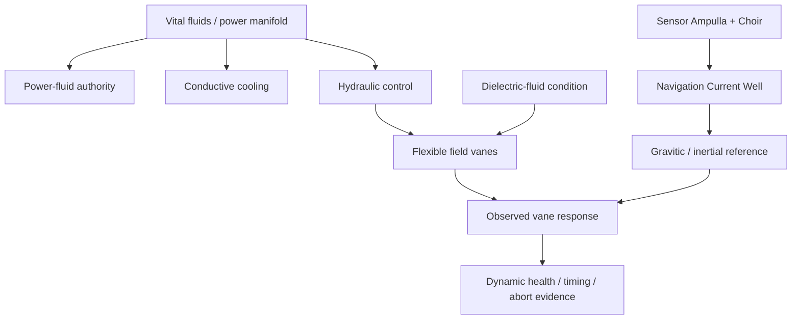

# Black Light FTL Maintenance Evidence Integration and Recertification Manual

**Status:** derived engineering integration manual.  
**Authority:** subordinate to `BLACK_LIGHT_PROPULSION_TRANSIT_AUTHORITY.md`, named race/vessel/installation sources, and the governing family physics.  
**Design-intent source:** *The different lightspeed methods*, current Drive revision `ANLCKQllC5h6dLaX5H1RpK8aUFVWsi-IV7gbMHUd0Qq7mIe5uGsLFi5_Hrsr8B6dl8t_ezB0fTSygxrnIBtifAHW79bgSbswp1zF3NaEil0`.  
**Purpose:** connect species/technology-specific service practice to the common maintenance evidence contract without turning unlike machines into cosmetic variants of one engineering culture.

---

## 1. Governing rule

The certification questions may be shared. The machinery is not.

\[
\boxed{\text{same certification question}\neq\text{same machine}}
\]

A Human electrical technician, an Ar'nock modular-systems technician, and a Mur'rek fluid-vane maintainer may all need to establish identity, dynamic health, calibration, timing, protected reserve, sectional reachability, and family-specific safety. They should not use the same tools, service boundaries, failure language, or assumptions.

The integration layer therefore performs **semantic translation**, not machinery normalization.

The original source packet is retained so a later forensic reader can reconstruct why a conclusion was reached.

---

## 2. Eleven common evidence classes

The common contract asks for:

| Class | Engineering question |
|---|---|
| `IDENTITY` | What installation/module/revision/refit is actually being certified? |
| `INTERFACE` | Are mechanical, power, data, fluid, thermal and reference interfaces correct? |
| `STATIC_HEALTH` | Does the system pass non-transient inspection? |
| `DYNAMIC_HEALTH` | Does it remain within limits under representative load? |
| `CALIBRATION` | Are measurement, timing, alignment and reference states traceable? |
| `TIMING` | Is the entire safety intervention chain still bounded? |
| `POWER_RESERVE` | Can protected energy **and peak power** support the emergency sequence? |
| `THERMAL_RESERVE` | Can the complete emergency sequence remain below thermal limits? |
| `SECTIONAL_TOPOLOGY` | Do required services still reach consumers with sufficient readiness and latency? |
| `FAMILY_SPECIFIC` | Are the selected family's actual transit-safety requirements satisfied? |
| `PROVENANCE` | Can every conclusion be traced to source or measurement authority? |

Unknown evidence is not failed evidence, but neither is it passing evidence.

\[
\boxed{\text{unknown}\neq\text{fail}\neq\text{pass}}
\]

---

## 3. Evidence adapter architecture

The runtime entry point is:

`resolveIntegratedFTLMaintenanceEvidence(context)`

The current adapters are:

| Adapter | Machinery basis | Source authority |
|---|---|---|
| `arnock-solid-state-modular` | modular solid-state electromechanical, silicon compute, piezoelectric diagnostics | Ar'nock maintenance/fabrication authority |
| `zwlei-murrek-fluid-vane` | fluidic-field machinery, flexible vanes, dielectric medium, hydraulic control, bio-reactive power fluid | named Mur'rek engineering authority |
| `generic` | caller-provided technology basis | caller provenance |

The adapter is not authorized to choose an FTL family.

\[
\boxed{F_{transit}\perp\text{technology-basis selection unless explicit authority links them}}
\]

That is a semantic firewall, not a statistical independence claim.

---

## 4. Ar'nock evidence embodiment

Ar'nock general machinery is solid-state/electromechanical, heavily modular, silicon-computational, ruggedized, and piezoelectric. Biotechnology is secondary support technology unless a narrower source establishes an exception.

A typical service chain is:

A physically compatible replacement is not automatically a certified replacement.

\[
\boxed{\text{physical fit}\not\Rightarrow\text{functional equivalence}}
\]

\[
\boxed{\text{functional equivalence}\not\Rightarrow\text{calibration equivalence}}
\]

### 4.1 Resonance diagnostics

For a simple mode:

\[
f_n=\frac{1}{2\pi}\sqrt{\frac{k}{m}}
\]

and approximately:

\[
Q\approx\frac{f_0}{\Delta f}.
\]

For small perturbations:

\[
\frac{\Delta f}{f}\approx\frac{1}{2}\left(\frac{\Delta k}{k}-\frac{\Delta m}{m}\right).
\]

A resonance shift therefore indicates changed effective stiffness, mass, damping, or boundary condition. It does **not** uniquely identify the fault mechanism.

---

## 5. Mur'rek evidence embodiment

The Mur'rek installation is source-confirmed as a **bio-reactive gravitic slipstream system** with flexible field vanes immersed in dielectric fluid, a Navigation Current Well, vital-fluid/power distribution, sensor ampulla, sensor choir, hydraulic authority, and isolation/lockout machinery.

The integration layer maps that machinery into common evidence classes without rewriting it as terrestrial electronics.

A useful vane-response diagnostic remains:

\[
\epsilon_v=\left\|\mathbf u_{commanded}-\mathbf u_{observed}\right\|_W.
\]

This is an engineering asymmetry metric, not a universal canon coefficient. Abort thresholds remain installation-specific unless sourced.

The terminology firewall is absolute:

\[
\boxed{\text{“gravitic slipstream”}\not\Rightarrow\texttt{gravitational-plane}}
\]

and

\[
\boxed{\text{“gravitic slipstream”}\not\Rightarrow\texttt{slipstream-shear}}.
\]

The source phrase can guide discrimination tests. It cannot settle the family attribution by itself.

---

## 6. Timing integration

The maintenance contract uses the complete intervention chain:

\[
t_{int}=t_{sensor}+t_{solver}+t_{decision}+t_{command}+t_{actuate}+t_{exit}+t_{clear}+t_{margin}.
\]

When each stage has a deterministic conservative interval

\[
t_i\in[l_i,u_i],
\]

then without an independence assumption:

\[
\boxed{T_{int}\in\left[\sum_i l_i,\sum_i u_i\right]}.
\]

That is the preferred default when cross-covariance between stage delays is unknown.

If a fully specified joint covariance matrix \(\Sigma_t\) exists, a statistical model may additionally use

\[
\operatorname{Var}(T_{int})=\mathbf 1^T\Sigma_t\mathbf 1,
\]

but a Gaussian confidence bound is permissible only when the distributional assumption is itself justified and recorded.

### 6.1 Reroute latency after repair

Where a certified propagation delay \(\tau_0\) exists and the repaired system now has delay \(\tau_c\), charge only the excess delay:

\[
\Delta\tau=\max(0,\tau_c-\tau_0).
\]

Do not add \(\tau_c\) in full if \(\tau_0\) was already included in the certified baseline.

---

## 7. Power and energy are separate certificates

Protected energy margin is:

\[
M_E=E_{available,protected,lower}-E_{required,upper}.
\]

A positive value is necessary but not sufficient. The power path must also satisfy:

\[
P_{available,lower}(t)\ge P_{required,upper}(t)
\]

through every safety-critical interval.

If generation is temporarily below load and protected storage supplies the difference:

\[
P_d=\max(0,P_L-P_a)
\]

and, for constant positive deficit,

\[
t_{hold}=\frac{E_b}{P_L-P_a}.
\]

A system is not safe merely because \(E_b\) is large. Bus, converter, hydraulic, fluidic, or field-delivery limits may prevent the stored energy from reaching the load quickly enough.

---

## 8. Thermal reserve

For short intervals where a lumped model is adequate:

\[
C_{th}\frac{dT}{dt}=P_{heat}-P_{reject}.
\]

If the terms are approximately constant:

\[
T(t)=T_0+\frac{P_{heat}-P_{reject}}{C_{th}}t.
\]

This approximation should be rejected or conservatively bounded when important effects include phase change, strongly nonlinear radiation, spatial hot spots, flow-regime changes, active cooling transitions, or strongly temperature-dependent heat capacity.

For a conservative adiabatic short-duration bound with positive heat rejection ignored:

\[
\Delta T\le\frac{E_{loss}}{C_{th}},
\]

provided \(C_{th}\) is a valid lower bound over the relevant temperature range.

---

## 9. Sectional infrastructure

A service path \(p\) has bottleneck support:

\[
A_p=\min\left(A_{source},\min_{e\in p}A_e\right),
\]

and the best surviving service route is:

\[
A_s=\max_p A_p.
\]

Propagation delay is independently:

\[
\tau_p=\sum_{e\in p}\tau_e.
\]

Hence:

\[
\boxed{\text{reachable}\neq\text{timely}\neq\text{certified}}.
\]

A repaired installation may regain electrical or fluid connectivity yet remain uncertified because the surviving path adds too much latency or lacks sufficient capacity.

---

## 10. Family semantic adapters

### Continuous projected-progress families

Metric-envelope, gravitational-plane, slipstream-shear, n-manifold, and inertial-torch use projected-progress timing where applicable:

\[
M_T=\frac{D_B}{v_p}-t_{int}.
\]

The symbol \(v_p\) is projected route progress. It does not assert local hull speed above \(c\).

If \(v_p\in[v_l,v_u]\) and \(T\in[T_l,T_u]\), both nonnegative:

\[
D_{int}\in[v_lT_l,v_uT_u].
\]

If projected progress varies materially with time:

\[
D_{int}=\int_{t_0}^{t_0+T}v_p(t)\,dt.
\]

### PRECOMMIT endpoint families

Q-lattice, fold-jump, and phase-displacement use:

\[
M_T=t_{prediction}-t_{int}.
\]

There is no invented along-route emergency distance.

### Anchored portal family

Wormhole/gate systems certify mouth state, synchronization, admission, throat/aperture condition, exit, clearance, and recovery. They do not inherit a free-flight hull velocity merely to fit the continuous-family formula.

---

## 11. Gravity remains external physics

Maintenance degradation changes how well a vessel measures, predicts, controls, exits, and recovers. It does **not** change the external gravitational field.

For point-mass weak-field modeling:

\[
\Phi(\mathbf x,t)=-\sum_a\frac{GM_a}{|\mathbf x-\mathbf r_a(t)|}
\]

and

\[
\mathbf g(\mathbf x,t)=-\sum_aGM_a\frac{\mathbf x-\mathbf r_a(t)}{|\mathbf x-\mathbf r_a(t)|^3}.
\]

The tidal tensor remains:

\[
T_{jk}=\sum_a\frac{GM_a}{r_a^3}(3n_jn_k-\delta_{jk}).
\]

A damaged sensor can increase uncertainty in estimates of these quantities. It cannot physically weaken the source mass.

That distinction is essential to the design intent in *The different lightspeed methods*: family-specific gravity sensitivity is a property of the transit operator interacting with an external spacetime environment, while maintenance condition governs the vessel's ability to observe and safely respond to that environment.

---

## 12. Signature doctrine

Maintenance evidence can produce observable signatures, but signatures do not automatically identify transit family.

| Technology basis | Representative maintenance signatures |
|---|---|
| Human electromechanical | bus ripple, converter harmonics, pump vibration, thermal hot spots, timing traffic |
| Ar'nock modular solid-state | module thermal pattern, piezoelectric test sweeps, bus/reference traffic, alignment actuation |
| Mur'rek fluid-vane | hydraulic transients, dielectric circulation, coolant chemistry, gravitic modulation, vane asymmetry |
| mineral/piezo-photonic | resonance sweeps, polarization changes, optical reference traffic, fracture emissions |
| biological exception | metabolic/chemical shifts, perfusion demand, tissue-control latency |

\[
\boxed{\text{maintenance signature}\not\Rightarrow\text{FTL family identity}}.
\]

---

## 13. Failure taxonomy

`MEI-ADAPTER-UNKNOWN` — requested technology adapter is unavailable or unresolved.  
`MEI-IDENTITY-GAP` — source installation/module identity cannot be established.  
`MEI-INTERFACE-GAP` — service interfaces are insufficiently characterized.  
`MEI-TIMING-UNBOUNDED` — one or more safety stages lack conservative latency bounds.  
`MEI-POWER-ENERGY` — protected energy margin is nonpositive.  
`MEI-POWER-PEAK` — instantaneous protected delivery is insufficient.  
`MEI-THERMAL-MARGIN` — emergency sequence crosses thermal limit.  
`MEI-TOPOLOGY-DISCONNECTED` — required service path does not reach the consumer.  
`MEI-TOPOLOGY-LATE` — a surviving path exceeds certified response timing.  
`MEI-FAMILY-UNRESOLVED` — transit recertification is required but family identity is not independently established.  
`MEI-FAMILY-PROMOTION` — species, terminology, tooling, or signature was incorrectly used to choose family.  
`MEI-ANCESTRY-LOSS` — adapter flattened or discarded source machinery/refit ancestry.  
`MEI-CANON-LEAK` — derived/proposed/simulation evidence was presented as confirmed canon.

---

## 14. Practical procedure MEI-01: repaired installation return to service

1. Freeze installation identity, hardware/software revision, refit ancestry, and calibration epoch.
2. Resolve the correct technology adapter from explicit technology authority, not species stereotype.
3. Preserve the complete technology-specific service packet.
4. Populate the eleven common evidence classes.
5. Bound every intervention-time stage; unresolved latency stays unresolved.
6. Verify protected energy margin and peak delivery separately.
7. Verify thermal survival through the complete emergency sequence.
8. Verify sectional reachability **and** propagation latency.
9. Resolve transit family independently from technology basis.
10. Apply the correct continuous, PRECOMMIT, or portal semantic adapter.
11. Run family-specific recertification.
12. Record `CERTIFIED`, `CONDITIONALLY_CERTIFIED`, `BLOCKED`, `UNRESOLVED`, `CONFLICT`, or `SIMULATION_ONLY` with reasons.
13. Store the source packet, normalized packet, calibration data, measurements, unresolved fields, and authority revisions together.

---

## 15. Worked example: Ar'nock replacement compute module

A replacement regional solver module passes electrical characterization, static self-test, dynamic load test, piezoelectric mount survey, and thermal soak. Its command path is measured 70 microseconds slower than the certified baseline.

The correct conclusion is not simply “module accepted.”

The added command contribution is:

\[
\Delta t_{command}=70\ \mu s.
\]

If the prior worst-case intervention time was 0.480 s:

\[
t_{int,new}=0.480070\ s.
\]

For a continuous projected-progress route with blocker distance 240,000 km and projected progress 400,000 km/s:

\[
\frac{D_B}{v_p}=0.600\ s
\]

so:

\[
M_T=0.600-0.480070=0.119930\ s.
\]

The installation retains positive timing margin **for that route and those certified bounds**. That does not promote the Ar'nock to any particular transit family; the example assumes a family was independently resolved for the worked calculation.

---

## 16. Worked example: Mur'rek vane service

Suppose a repaired vane sector has normalized command vector \(\mathbf u_c\) and observed vector \(\mathbf u_o\). Define:

\[
\epsilon_v=\|\mathbf u_c-\mathbf u_o\|_W.
\]

A small value supports dynamic-health evidence. It does not by itself certify:

- dielectric-fluid breakdown margin;
- hydraulic reserve;
- sensor lookahead;
- protected recovery power;
- gravitic-reference calibration;
- actual consolidated transit family.

The integrated packet therefore preserves separate evidence fields rather than reducing the regulator to a single “health percentage.”

---

## 17. Educational progression

### Transit Safety Engineering 750 — Machinery-Specific Evidence Translation

Students should be able to:

- separate certification semantics from machinery embodiment;
- construct evidence packets without erasing technology ancestry;
- explain why Ar'nock module practice and Mur'rek fluid-vane practice answer similar safety questions through different equipment;
- perform bounded timing, power, thermal, and sectional calculations;
- identify when evidence is unresolved rather than failed;
- prevent family attribution from leaking out of terminology or signatures;
- preserve source, calibration, refit, and measurement provenance.

Suggested laboratory exercises:

1. Translate a terrestrial electrical service report into the eleven-class contract.
2. Translate an Ar'nock module-exchange packet without introducing biological computation.
3. Translate a Mur'rek vane/fluid inspection without selecting a family from the phrase “gravitic slipstream.”
4. Compare a positive-energy/insufficient-peak-power case.
5. Recalculate intervention margin after a sectional command reroute.
6. Audit an intentionally poisoned packet in which unknown latency was replaced with zero.

---

## 18. Generator rules

Generators using this authority must:

- resolve technology basis before selecting service vocabulary;
- preserve technology-specific evidence as a first-class source packet;
- map into the common evidence contract only after source evidence is retained;
- keep power, energy, thermal reserve, topology, timing, and family evidence distinct;
- avoid numerical coefficients not provided by source or explicit engineering controls;
- label mathematical extrapolations `DERIVED` or `PROPOSED`;
- refuse certification when required evidence remains unresolved;
- refuse family inference from species, repair tools, component morphology, or signatures;
- preserve Ar'nock solid-state/modular canon and Mur'rek named-source fluid/vane canon independently;
- carry the *The different lightspeed methods* source revision with the integration authority so future source edits can be detected.

The objective is not a universal alien maintenance manual. It is a universal **evidence grammar** capable of representing genuinely different maintenance traditions without flattening them.
