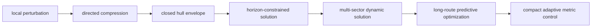
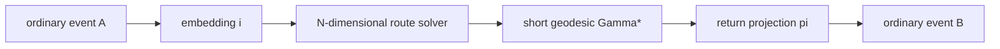
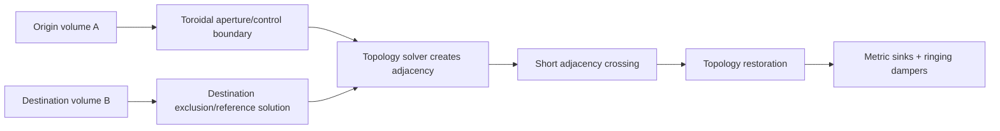
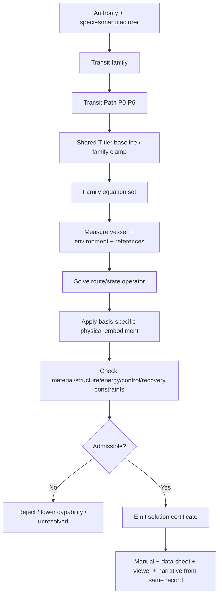

# Black Light FTL Mathematical Transit Models

**Status:** subordinate mathematical engineering contract for Black Light propulsion/transit generation.  
**Authority:** subordinate to `docs/blacklight/BLACK_LIGHT_PROPULSION_TRANSIT_AUTHORITY.md`, surviving named race/species/manufacturer/installation canon, and the recovered/live FTL mechanism and Path definitions.  
**Purpose:** give every transit family and every Transit Path P0-P6 stage an explicit mathematical object, distance/transit model, uncertainty model, and identifiable engineering reason for improvement.  
**Critical canon rule:** the recovered family actions, Path names, runtime speed/range envelopes, breakthroughs, and live Path-to-T-tier behavior are `CONFIRMED`. The formal equations below are `DERIVED` engineering models chosen to represent those confirmed actions unless an equation is specifically identified as ordinary real physics. Numerical calibration constants not present in source are `PROPOSED` and MUST NOT be presented as recovered setting constants.

---

## 1. Origin and provenance

This document formalizes, rather than replaces, the current transit authority chain.

| Source | Scope used here | Status |
|---|---|---|
| `docs/blacklight/BLACK_LIGHT_PROPULSION_TRANSIT_AUTHORITY.md` | domain boundaries, canon order, three scale coordinates, family identities, machinery/provenance rules | `CONFIRMED` authority |
| `docs/blacklight/FTL_ENGINEERING_CATALOG_WORKING.md` | recovered FTL archive, mechanism descriptions, Path archaeology, construction doctrine | `CONFIRMED` where explicitly recovered; otherwise retains source label |
| `blacklight-exo-ftl-physics-definitions.js` | live T0-T8 envelopes, family windows, constraints, hurdles, failures | `CONFIRMED` current runtime |
| `blacklight-exo-ftl-path-level-paths-physical.js` | inertial, metric, gravitic P0-P6 names/speed/range/breakthroughs | `CONFIRMED` current runtime |
| `blacklight-exo-ftl-path-level-paths-dimensional.js` | slipstream, Q-lattice, N-manifold P0-P6 definitions | `CONFIRMED` current runtime |
| `blacklight-exo-ftl-path-level-paths-discrete.js` | fold, wormhole/gate, phase-displacement P0-P6 definitions | `CONFIRMED` current runtime |
| `blacklight-exo-ftl-path-level-runtime.js` | `STAGE_TO_TIER = [0,1,2,3,4,6,8]` coupling | `CONFIRMED` current runtime |
| `EXO_OPERATIVE_TECHNOLOGY_BASIS.md` + technology-basis registry | physical implementation language by species/environment/organization/manufacturer | `CONFIRMED` operative authority |
| this document | explicit mathematical representation and upgrade-cause mapping | `DERIVED` unless labelled otherwise |

The equations are therefore **authoritative for generator explanation and mathematical bookkeeping once adopted by a generator version**, but they are not evidence that an in-universe culture uses human tensor notation or that the setting historically specified these exact equations.

---

## 2. Mathematical contract for every drive

Every generated transit installation MUST be able to answer six mathematical questions.

1. **What space is being acted on?** Ordinary spacetime, a metric field, a gravitational/equipotential solution surface, a Q-boundary, a discrete phase lattice, an N-dimensional manifold, a topological identification, a gate throat, or a quantum/state space.
2. **What operator changes the route?** Continuous deformation, constrained geodesic selection, boundary coupling, discrete translation, projection through extra dimensions, topological adjacency, maintained throat, state displacement, or ordinary acceleration.
3. **What quantity replaces ordinary separation?** An effective geodesic length, weighted route cost, lattice path length, adjacency separation, throat proper length, state-space distance, or ordinary traversed distance.
4. **What controls error?** Solver residuals, covariance, field closure, address error, embedding error, topology error, reference mismatch, destination occupation, or ordinary navigation error.
5. **What physically improves at the next Path stage?** Mathematics/solver, field control, material science, structure, energy system, navigation/reference quality, drive scale/distribution, control bandwidth, or recovery.
6. **How does that improvement alter capability?** Greater effective-distance reduction, higher allowable local/field state, longer stable route, lower energy burden, smaller uncertainty, shorter spool/recovery, greater payload coverage, or smaller machinery.

A Path stage is mathematically incomplete if it merely says `more advanced`, `more powerful`, or `faster` without identifying which term or constraint changed.

---

## 3. Shared notation

Let ordinary-space departure and arrival events be \(A\) and \(B\). Let the ordinary reference separation be

\[
D_0(A,B)=\inf_{\Gamma\in\mathcal A_0}\int_\Gamma \sqrt{\gamma_{ij}\,dx^i dx^j}.
\]

For a transit family \(f\), define the family-specific effective route quantity

\[
D_f=\mathcal L_f(A,B;\Theta_f,E,S),
\]

where \(\Theta_f\) is the solved drive/control state, \(E\) the environment/reference state, and \(S\) the vessel/payload state.

The **geometric or route gain** is

\[
\chi_f=\frac{D_0}{D_f}.
\]

For discontinuous systems, \(D_f\) may approach a boundary-crossing or state-transition cost rather than a literal spatial length. The generator must therefore retain `distanceModelType` rather than pretending all families have the same notion of distance.

Total mission transit time is

\[
t_{\rm total}=t_{\rm solve}+t_{\rm spool}+t_{\rm active}+t_{\rm terminate}+t_{\rm recover}.
\]

The familiar equivalent speed displayed by the current runtime is a comparison quantity:

\[
v_{\rm eq}=\frac{D_0}{t_{\rm total}},
\]

not necessarily the local velocity of the hull. For fold, gate, lattice, and displacement systems this distinction is mandatory.

### 3.1 Engineering efficiency

A useful `PROPOSED` hardware-efficiency decomposition is

\[
\eta_{\rm impl}=\eta_{\rm source}\eta_{\rm conditioning}\eta_{\rm coupling}\eta_{\rm geometry}\eta_{\rm control}\eta_{\rm recovery},
\]

with required source burden

\[
B_{\rm source}=\frac{B_{\rm mechanism}}{\eta_{\rm impl}}.
\]

`B` is deliberately a mechanism burden, not automatically joules. A higher Path can improve range without raising gross power if improved geometry, solver quality, materials, or field coupling increases \(\eta_{\rm impl}\).

### 3.2 Error and covariance

For solved state vector \(\Theta\) and residual vector \(r(\Theta)\), define a generic solution cost

\[
J(\Theta)=r^TWr+\lambda_C P_C+\lambda_R P_R+\lambda_H P_H,
\]

where the penalty terms represent coverage, recovery, and hazard violations. The exact weighting is `PROPOSED`.

Navigation/reference uncertainty remains explicit as covariance \(\Sigma\). A family-specific endpoint or state uncertainty can be propagated in the usual local approximation:

\[
\Sigma_{out}\approx J_T\Sigma_{in}J_T^T+\Sigma_{model},
\]

where \(J_T\) is the Jacobian of the solved transformation. More advanced mathematics can therefore increase range simply by lowering model error and allowing the same safety threshold to be satisfied farther away.

---

## 4. Path progression is an upgrade vector, not a magic number

Define the `PROPOSED` normalized upgrade vector for Path stage \(p\):

\[
\mathbf U_p=(M,F,A,S,E,N,D,C,R),
\]

where:

- \(M\): mathematical model / solver sophistication;
- \(F\): field or exotic-state control fidelity;
- \(A\): active-material capability;
- \(S\): structure, alignment, load-path and containment capability;
- \(E\): energy density, conditioning and conversion efficiency;
- \(N\): navigation, sensing, reference and prediction quality;
- \(D\): drive scale, distribution and miniaturization capability;
- \(C\): control bandwidth, synchronization and redundancy;
- \(R\): termination, damping, recovery and abort capability.

A stage transition is

\[
\Delta\mathbf U_p=\mathbf U_{p+1}-\mathbf U_p.
\]

The generator must record the non-zero **upgrade drivers** responsible for each Path breakthrough. No family is required to improve all nine axes at every stage.

The current runtime retains the confirmed baseline coupling:

| Transit Path | Shared capability baseline |
|---|---|
| P0 | T0 |
| P1 | T1 |
| P2 | T2 |
| P3 | T3 |
| P4 | T4 |
| P5 | T6 |
| P6 | T8 |

Family windows may clamp the shared tier. These are runtime capability coordinates; they do not replace the family mathematics below.

---

# 5. Metric Compression Envelope

**Confirmed action:** 4D local metric deformation around a protected volume.

### 5.1 Mathematical model — `DERIVED`

Represent the controlled metric as

\[
g^{(p)}_{\mu\nu}=g^{(0)}_{\mu\nu}+h^{(p)}_{\mu\nu}(x,t),
\]

where the Path stage determines which components, gradients, boundary modes, and feedback terms can be controlled. A useful Alcubierre-like comparison remains

\[
ds^2=-c^2dt^2+[dx-v_s f(r_s)dt]^2+dy^2+dz^2,
\]

but Black Light family constraints outrank that analogy.

Define effective route length through the controlled spatial metric

\[
D_M=\int_\Gamma\sqrt{\gamma^{eff}_{ij}dx^idx^j},\qquad
\chi_M=\frac{D_0}{D_M}.
\]

A more capable drive can increase \(\chi_M\), decrease harmful derivatives \(\partial_i h_{\mu\nu}\), or both. Thus a higher tier need not mean merely stronger curvature; it can mean **more useful curvature per unit field stress**.

A practical field-smoothness penalty is

\[
P_{grad}=\int_{V_{wall}}\|\nabla h\|^2dV,
\]

and a tidal constraint follows the ordinary geodesic-deviation form

\[
\frac{D^2\xi^\mu}{D\tau^2}=-R^\mu{}_{\nu\alpha\beta}u^\nu\xi^\alpha u^\beta.
\]

### 5.2 Path mathematics and engineering progression

| Path | Confirmed runtime speed / range | Mathematical development | Principal physical upgrade | Why capability improves |
|---|---|---|---|---|
| P0 Metric Stress-Test Monolith | 0.0005–0.01 c; 0.5–8 AU | solve small \(h_{\mu\nu}\) perturbations in a narrow fixed corridor | monumental emitters, rigid alignment, grid energy | only low-amplitude/local metric terms can be held inside gradient limits |
| P1 Inertial Relief Envelope | 0.01–0.15 c; 4–120 AU | add controlled longitudinal compression and inertial-relief terms while preserving internal signaling | improved field symmetry, timing, active supports | larger \(\chi_M\) with less payload acceleration and lower control-latency penalty |
| P2 Subluminal Compression Bubble | 0.15–0.8 c; 30–1,200 AU | solve a closed 3D boundary-value problem around the entire moving hull | complete envelope closure, bow-radiation handling, better materials | full vehicle becomes admissible payload; boundary residuals and leakage fall |
| P3 First Causal-Horizon Envelope | 0.8–5 c; 200–20,000 AU | include horizon constraints in the solver and reject solutions that trap control/termination authority | higher field density, horizon sensing, faster control | feasible solution set crosses equivalent-light-speed boundary without losing a recoverable exit |
| P4 Operational Warp Envelope | 5–500 c; 5,000–1,000,000 AU | multi-sector tensor solution compensates hull flex, cargo motion and external perturbation | distributed emitters, fleet-grade sensors, thermal handling | lower model residual under real vessel dynamics enables routine long solutions |
| P5 Strategic Metric Drive | 500–100,000 c; 200,000–50,000,000 AU | time-dependent route optimization minimizes field burden across heterogeneous gravity terrain | Q-condensate energy, predictive gravity model, high-order correction | route can remain within gradient/horizon limits for much longer spatial baselines |
| P6 Compact Dynamic Metric Engine | 100,000–8,500,000 c; 10,000,000–4,200,000,000 AU | closed-loop adaptive \(h_{\mu\nu}(x,t)\) solution continuously re-optimizes geometry | miniaturized field sectors, self-calibration, rapid sensing/recovery | much higher useful \(\chi_M\) per machinery volume with rapid correction and cycling |



---

# 6. Gravitational-Plane Skimmer

**Confirmed action:** 4D geodesic-plane transit with higher-order gravitational-gradient correction.

### 6.1 Mathematical model — `DERIVED`

Let \(\Phi(x,t)\) be the modeled gravitational potential and \(R\) the relevant curvature information. The drive chooses a route by minimizing a family-specific skim functional rather than Euclidean distance:

\[
\Gamma_g^*=\arg\min_{\Gamma}\int_\Gamma
\left[w_0+w_1\|\nabla\Phi\|+w_2\|\nabla\nabla\Phi\|+w_3H_R+w_4C_{switch}\right]ds.
\]

\(H_R\) is a curvature/ridge hazard term and \(C_{switch}\) the cost of changing admissible planes. Weights are `PROPOSED`; the concept of route dependence on gravity geometry is confirmed.

Define a local skim gain \(\lambda_g(x,t)>0\) and effective transit measure

\[
D_g=\int_{\Gamma_g^*}\frac{ds}{\lambda_g(x,t)},\qquad
\chi_g=\frac{D_0}{D_g}.
\]

Higher stages improve the modeled potential, higher derivatives, moving-mass forecast, admissible-plane transitions, and real-time re-solving.

### 6.2 Path progression

| Path | Confirmed runtime speed / range | Mathematical development | Principal physical upgrade | Capability gain |
|---|---|---|---|---|
| P0 Gravitational Rail Monolith | 0.0004–0.008 c; 1–20 AU | one fixed precomputed equipotential trajectory | fixed mass-manipulation rail and surveyed corridor | efficient travel only where one known solution exists |
| P1 Equipotential Skim Array | 0.008–0.12 c; 10–250 AU | continuously solve local equipotential adherence | better gradient sensing and lift control | vehicle can remain on a moving surface instead of ballistic launch only |
| P2 Barycentric Plane Rider | 0.12–1.5 c; 80–4,000 AU | multi-body barycentric potential model and plane-transition solution | atom interferometry, ephemerides, transition control | system-scale routing and controlled switching between dominant gravity frames |
| P3 Interstellar Plane Skimmer | 1.5–50 c; 1,000–180,000 AU | include stellar saddles and long-baseline curvature prediction | vacuum-cell power, higher precision references | superluminal-equivalent interstellar skim along certified solutions |
| P4 Multi-Plane Transit Drive | 50–5,000 c; 50,000–5,000,000 AU | solve a changing sequence of admissible planes as a dynamic optimization problem | distributed sensors/control and fleet route models | handles complex multi-system routes rather than one plane |
| P5 Deep-Gradient Skimmer | 5,000–250,000 c; 1,000,000–100,000,000 AU | add probabilistic hidden-mass inference and far-field gradient prediction | Q-condensate, remote/proxy sensing, larger model libraries | fewer catastrophic unknown-ridge encounters, permitting much longer routes |
| P6 Adaptive Geodesic Drive | 250,000–850,000 c; 50,000,000–420,000,000 AU | receding-horizon geodesic optimizer rewrites route in real time | high-bandwidth gravimetry, adaptive field tiles | route remains valid through moving N-body terrain and deliberate perturbation |

---

# 7. Hyperspatial Slipstream Shear

**Confirmed action:** coupling to a metastable Q-space boundary layer adjacent to normal spacetime.

### 7.1 Mathematical model — `DERIVED`

Let \(q(x,t)\) describe the local Q-boundary state, \(u_Q\) its shear/flow state, and \(a(x,t)\in[0,1]\) boundary adhesion. Define a normal-space correspondence map

\[
\pi_Q:Q_{boundary}\rightarrow M^{3+1}.
\]

A useful effective distance model is

\[
D_S=\int_\Gamma \sigma_Q(x,t,u_Q,a)\,ds,
\qquad 0<\sigma_Q,
\]

where low \(\sigma_Q\) represents a favorable shear carrying the vessel across a large normal-space projection for little boundary-path evolution.

Adhesion failure can be represented by margin

\[
\mu_a=a-a_{crit}(q,\dot q,\text{hull state}).
\]

The mature mathematical problem is not merely finding a fast stream; it is predicting a time-varying coupled boundary while keeping \(\mu_a>0\) and preserving a valid exit correspondence.

### 7.2 Path progression

| Path | Confirmed runtime speed / range | Mathematical development | Principal physical upgrade | Capability gain |
|---|---|---|---|---|
| P0 Boundary-Shear Observatory | 0.001–0.02 c; 0.5–10 AU | detect/fit a local \(q,u_Q\) boundary model | fixed observatory and shear generation | short experimental lane only |
| P1 Q-Boundary Probe Launcher | 0.02–0.4 c; 6–180 AU | solve one payload adhesion trajectory against measured shear | phase control and probe coupling | prepared payload can stay attached without uncontrolled polarization |
| P2 Captive Slipstream Tunnel | 0.4–3 c; 60–5,000 AU | forecast a bounded corridor \(q(x,t)\) with controlled entry/exit surfaces | repeatable tunnel hardware, stronger containment | scheduled superluminal-equivalent corridor becomes possible |
| P3 Shipboard Slipstream Coupler | 3–300 c; 1,000–250,000 AU | moving-origin boundary solution plus phase-velocity matching at exit | mobile coupler, onboard Q sensing | ship no longer depends on fixed tunnel generator |
| P4 Operational Shear Drive | 300–20,000 c; 50,000–8,000,000 AU | stochastic Q-weather model and traffic/wake separation | fleet sensors, Q-condensate, standardized wake control | routine bidirectional routes through changing conditions |
| P5 Strategic Slipstream Drive | 20,000–850,000 c; 1,000,000–420,000,000 AU | long-horizon directional shear optimization with storm evolution | predictive Q sensing and high-endurance field control | strategic routes remain viable across heterogeneous boundary states |
| P6 Compact Wake-Riding Drive | 850,000–8,500,000 c; 50,000,000–4,200,000,000 AU | rapid local inference reconstructs usable shear from wakes and transient streams | miniaturized sensing/polarization control | small craft exploit ephemeral high-gain paths with short decision cycles |

---

# 8. Q-Lattice Phase Translation

**Confirmed action:** indexed quantized translation through Q-state cells.

### 8.1 Mathematical model — `DERIVED`

Represent the accessible Q-lattice as a graph

\[
\mathcal G_Q=(V_Q,E_Q),
\]

where each vertex is an addressable phase cell \(q_i=(a_i,\phi_i,\tau_i)\) containing address, phase and epoch state. A route is a sequence \(\pi=(q_0,q_1,\dots,q_n)\).

Define weighted translation cost

\[
C_Q(\pi)=\sum_{(i,j)\in\pi}
\left[w_d\ell_{ij}+w_\phi\epsilon_{\phi,ij}+w_\tau\epsilon_{\tau,ij}+w_oP_{occ,ij}+w_sP_{state,ij}\right].
\]

The solved route is

\[
\pi^*=\arg\min_{\pi\in\mathcal P}C_Q(\pi).
\]

The spatial range may become enormous while the number of translated phase transitions remains modest. Improvement therefore comes from addressability, epoch synchronization, coherence, state coverage, routing, and error correction rather than greater local velocity.

### 8.2 Path progression

| Path | Confirmed runtime speed / range | Mathematical development | Principal physical upgrade | Capability gain |
|---|---|---|---|---|
| P0 Q-Cell Addressing Monolith | 0.005–0.05 c; 0.01–1 AU | identify adjacent stable cells and one-step address transform | fixed references and laboratory projectors | tiny prepared masses move between nearby phase addresses |
| P1 Molecular Phase Conveyor | 0.05–1 c; 0.5–30 AU | preserve bonded-state invariants across the cell transform | better tomography and coherence control | complex matter survives translation |
| P2 Macroscopic Lattice Translator | 1–100 c; 10–2,000 AU | solve one coherent address/state map for a complete macroscopic payload | larger projector coverage and defect correction | cargo/vehicles move without partial-state loss |
| P3 Beacon-Indexed Jump Array | 100–10,000 c; 500–250,000 AU | authenticated remote address + relativistic phase-epoch synchronization | beacons, immutable route stores, better clocks | true interstellar jumps become repeatable |
| P4 Autonomous Q-Lattice Drive | 10,000–1,000,000 c; 50,000–50,000,000 AU | onboard graph search, anti-alias scoring and local reference validation | mobile address solver and reference hardware | independent ships use surveyed lattice routes |
| P5 Strategic Phase Network | 1,000,000–100,000,000 c; 5,000,000–5,000,000,000 AU | network-scale dynamic routing across millions of addresses/epochs | large key/reference infrastructure and Q-condensate | strategic throughput and alternate-path routing grow enormously |
| P6 Compact State-Translation Core | 100,000,000–850,000,000 c; 500,000,000–420,000,000,000 AU | high-order error correction handles mutable minds, damaged structures and temporary state forks | compact tomography, self-correction and identity bookkeeping | extreme range and compactness without discarding state complexity |

---

# 9. N-Dimensional Manifold Drive

**Confirmed action:** solve a shorter N-dimensional geodesic and project the vessel back into 3+1 dimensions.

### 9.1 Mathematical model — `DERIVED`

Let the accessible manifold be \((\mathcal M^N,g^{(N)}_{AB})\), with embedding

\[
i:M^{3+1}\hookrightarrow \mathcal M^N
\]

and return projection

\[
\pi:\mathcal M^N\rightarrow M^{3+1}.
\]

The drive solves

\[
\Gamma_N^*=\arg\min_{\Gamma\in\mathcal A_N}
\int_\Gamma\sqrt{g^{(N)}_{AB}dX^AdX^B},
\]

subject to

\[
\pi(\Gamma_N(0))=A,\qquad \pi(\Gamma_N(1))=B,
\]

plus embedding, orientation, identity and topology constraints.

The gain is

\[
\chi_N=\frac{D_0}{L_N(\Gamma_N^*)}.
\]

Adding usable dimensions increases possible shortcuts but also expands the solution space and the number of failure modes. Advancement is therefore a race between geometric opportunity and solver/sensor uncertainty.

### 9.2 Path progression

| Path | Confirmed runtime speed / range | Mathematical development | Principal physical upgrade | Capability gain |
|---|---|---|---|---|
| P0 Dimensional Topology Observatory | 0.001–0.03 c; 0.1–4 AU | fit local extra-dimensional curvature and one tiny shortcut | monumental topology sensors/test volume | only laboratory-scale admissible manifold routes |
| P1 Five-Axis Test Volume | 0.03–0.7 c; 2–100 AU | maintain embedding through one additional spatial axis | axis references, resonators, orientation control | payload can leave/re-enter ordinary projection intact |
| P2 Captive Manifold Transit Array | 0.7–10 c; 30–5,000 AU | solve a fixed macroscopic geodesic plus certified return map | topology metamaterials and larger projection rings | scheduled system/short interstellar routes become possible |
| P3 Shipboard N-Manifold Drive | 10–1,000 c; 1,000–500,000 AU | solve embedding, geodesic and return map from a moving vessel | onboard quantum geodesic solver and field coils | independent interstellar routing |
| P4 Adaptive Higher-Dimensional Drive | 1,000–100,000 c; 100,000–50,000,000 AU | multi-axis route solution re-optimizes around changing obstacles | more active axes, topology sensors, faster control | routine fleet movement through complex manifold terrain |
| P5 Deep-Range Manifold Engine | 100,000–10,000,000 c; 10,000,000–5,000,000,000 AU | probabilistic manifold continuation beyond direct sensor horizon | predictive libraries, probes, long-range references | cluster-scale routes become certifiable |
| P6 Compact Multi-Axis Drive | 10,000,000–850,000,000 c; 1,000,000,000–420,000,000,000 AU | robust constrained optimization preserves return map despite damage and axis loss | miniaturized stabilizers, redundant axes, self-healing control | high-dimensional mobility survives compact packaging and degraded states |



---

# 10. Discrete Fold-Jump Drive

**Confirmed action:** temporary topological adjacency between origin and destination volumes; little meaningful correction after commit.

### 10.1 Mathematical model — `DERIVED`

Let ordinary space have topology/manifold state \(\mathcal M\) and ordinary separation \(d_\mathcal M(A,B)\). The fold system constructs a temporary controlled state

\[
\mathcal F_{\Theta}:\mathcal M\rightarrow\mathcal M_{\Theta}
\]

such that

\[
d_{\mathcal M_\Theta}(A,B)\ll d_\mathcal M(A,B).
\]

Define adjacency gain

\[
\chi_F=\frac{d_\mathcal M(A,B)}{d_{\mathcal M_\Theta}(A,B)}.
\]

The ship does not need to traverse the original distance after a valid adjacency is formed. Total response time is therefore dominated by solution and field preparation at lower Paths:

\[
t_F=t_{solve}+t_{verify}+t_{spool}+t_{adjacency}+t_{cross}+t_{restore}+t_{ringdown}.
\]

A destination solution is admissible only if the origin and destination exclusion volumes remain valid under propagated uncertainty:

\[
P_{safe}=P(V_A\cap O=\varnothing,\;V_B\cap O=\varnothing\mid\Sigma_A,\Sigma_B,\Sigma_{env})\ge P_{min}.
\]

`P_min` is `PROPOSED`/manufacturer-specific.

### 10.2 Toroidal control geometry — `DERIVED`, not recovered verbatim canon

The recovered Fold machinery includes metric aperture rings, topology waveguides, closed fold-volume panels, active supports, metric sinks and ringing dampers. A toroidal control geometry is mathematically coherent with those components, but the archive has not yet been shown to state that exact geometry explicitly.

A physical torus surface is \(T^2=S^1\times S^1\), parameterized by

\[
x=(R+r\cos\theta)\cos\phi,
\]
\[
y=(R+r\cos\theta)\sin\phi,
\]
\[
z=r\sin\theta.
\]

A **three-dimensional toroidal field volume** surrounding that surface is more accurately modeled as a solid/thickened torus such as \(D^2\times S^1\), not automatically as the mathematically distinct three-torus \(T^3=S^1\times S^1\times S^1\). The generator should therefore say `toroidal 3D control volume` unless a future source explicitly establishes a \(T^3\) topology.



### 10.3 Path progression

| Path | Confirmed runtime speed / range | Mathematical development | Principal physical upgrade | Capability gain |
|---|---|---|---|---|
| P0 Adjacency Test Monolith | 0.01–0.1 c; 0.001–0.2 AU | solve one nearby two-volume identification with severe symmetry/exclusion constraints | monumental rings, fixed geometry, long charge | proves stable adjacency but only for tiny prepared volumes |
| P1 Cargo Fold Chamber | 0.1–2 c; 0.05–5 AU | enlarge certified boundary while preserving bijective payload mapping | stronger aperture structure, better field panels, antimatter | meaningful planetary-distance cargo folds |
| P2 Orbital Fold Gate | 2–100 c; 1–500 AU | maintain destination volume solution through passage time and repeated cycles | occupancy lidar, better beacons, recoil framing | large cargo/vehicle system logistics become repeatable |
| P3 Capital Fold-Jump Core | 100–10,000 c; 100–100,000 AU | move full topology solver, energy bank and exclusion model aboard vessel | shipboard precision gravimetry, singularity-scale storage | independent nearby-star jumps |
| P4 Fleet Fold Drive | 10,000–1,000,000 c; 10,000–10,000,000 AU | minimize endpoint covariance, spool time and recoil residual while deconflicting neighboring folds | standardized emitters, field sinks, distributed timing | routine fleet use and emergency response |
| P5 Strategic Long-Fold Engine | 1,000,000–50,000,000 c; 1,000,000–1,000,000,000 AU | solve adjacency across time-varying gravitational terrain and propagate endpoint uncertainty over long baselines | Q-condensate, predictive environment model, stronger waveguides | stable strategic folds across many systems/clusters |
| P6 Compact Tactical Fold Core | 50,000,000–850,000,000 c; 100,000,000–420,000,000,000 AU | fast robust solver searches admissible topology modes and certifies empty volume under short-notice conditions | compact high-density storage, rapid ringdown, autonomous verification | enormous fold gain with tactical cycle time and small machinery |

The key progression is therefore not `more fold`. It is increasingly sophisticated control of **which topology is created, how large and irregular a volume it encloses, how uncertain the remote boundary may be, how much residual metric stress remains, and how quickly the system can solve/cycle safely**.

---

# 11. Anchored Wormhole / Gate Transit

**Confirmed action:** maintained multiply connected spacetime topology between established mouths/anchors.

### 11.1 Mathematical model — `DERIVED` analogy

A Morris-Thorne-like reference metric is useful for engineering vocabulary:

\[
ds^2=-e^{2\Phi(r)}c^2dt^2+\frac{dr^2}{1-b(r)/r}+r^2d\Omega^2,
\]

with throat conditions

\[
b(r_0)=r_0,\qquad b'(r_0)<1.
\]

The proper radial distance is

\[
\ell(r)=\pm\int_{r_0}^{r}\frac{dr'}{\sqrt{1-b(r')/r'}}.
\]

The network route cost is not ordinary separation but

\[
D_G=D_{approach}+L_{throat}+D_{departure}+C_{queue}+C_{transfer},
\]

where queue/transfer terms may dominate operational time even when \(L_{throat}\) is tiny.

Throughput can be represented abstractly as

\[
\dot M_{max}=f(r_0,\mu_{stability},\mu_{energy},\mu_{shear},\Delta t_{mouth}),
\]

with no canonical coefficients yet established.

### 11.2 Path progression

| Path | Confirmed runtime speed / range | Mathematical development | Principal physical upgrade | Capability gain |
|---|---|---|---|---|
| P0 Microscopic Throat Foundry | 0.001–0.05 c; 0.00001–0.01 AU | solve microscopic throat satisfying local stability conditions | huge stationary power plant, tiny throat control | energy/information/sample passage only |
| P1 Cargo Aperture Gate | 0.05–1 c; 0.001–1 AU | enlarge \(r_0\) while modeling asymmetric mass flow | stronger aperture support and antimatter conditioning | standardized cargo can pass predictably |
| P2 Orbital Paired Gate | 1–100 c; 0.1–1,000 AU | continuously synchronize two macroscopic mouths and control flow balance | star-fed power, orbital anchors, traffic control | vehicle-scale interplanetary transit |
| P3 Stellar Gate Complex | 100–10,000 c; 100–1,000,000 AU | solve stable stellar-distance mouth pair with independent navigation and defensive perturbations | massive anchor structure, redundant throat control | routine interstellar connection |
| P4 Corridor Gate Network | 10,000–1,000,000 c; 100,000–100,000,000 AU | graph/network optimizer coordinates many throats, schedules, flow and fault isolation | network control, distributed synchronization | civilization-scale route network rather than isolated pair |
| P5 Strategic Deep Gate | 1,000,000–100,000,000 c; 100,000,000–10,000,000,000 AU | long-baseline synchronization and controlled mouth relocation with chronology constraints | Q-condensate, massive reserves, deeper reference systems | distant cluster links and massive throughput |
| P6 Self-Stabilizing Gate Lattice | 100,000,000–850,000,000 c; 10,000,000,000–420,000,000,000 AU | coupled control automatically rebalances throat geometry, mass flow, timing and damaged nodes | distributed adaptive lattice and autonomous isolation | resilient near-continuous network service despite disturbances |

---

# 12. Quantum Phase Displacement

**Confirmed action:** macroscopic state displacement across a nonlocal quantum basis.

### 12.1 Mathematical model — `DERIVED`

For pure-state analogy, state-space separation can be represented with Fubini-Study angle

\[
D_{FS}(\psi_o,\psi_t)=\arccos |\langle\psi_o|\psi_t\rangle|.
\]

For realistic mixed macroscopic states, a density-matrix fidelity \(F(\rho_o,\rho_t)\) and Bures-like distance are more appropriate:

\[
D_B(\rho_o,\rho_t)=\sqrt{2\left(1-\sqrt{F(\rho_o,\rho_t)}\right)}.
\]

The engineering solution minimizes a composite state mismatch:

\[
J_P=w_sD_B^2+w_oP_{occupation}+w_rP_{reference}+w_cP_{conservation}+w_iP_{identity}.
\]

All weights are `PROPOSED`. The confirmed engineering point is that destination compatibility, occupation, reference quality, continuity, mutable software, and living state are part of the transit problem.

### 12.2 Path progression

| Path | Confirmed runtime speed / range | Mathematical development | Principal physical upgrade | Capability gain |
|---|---|---|---|---|
| P0 Quantum State Conveyor | 0.005–0.1 c; 0.0001–0.1 AU | solve small prepared state mapping between adjacent compatible configurations | laboratory references and simple-state control | information/energy/tiny samples only |
| P1 Gram-to-Tonne Displacement Vault | 0.1–1 c; 0.01–5 AU | preserve ordinary material invariants over far larger state dimension | better tomography and vacuum-cell control | industrial material transfer |
| P2 Macroscopic Phase Chamber | 1–100 c; 0.5–1,000 AU | enforce one complete macroscopic mapping with residual/duplicate-state checks | full-volume phase control and quarantine logic | cargo/vehicles displace without ordinary traversal |
| P3 Beacon-Coupled Vessel Displacement | 100–10,000 c; 100–100,000 AU | remote authenticated target state plus continuity ledger | beacon references, Q-condensate, legal/identity records | vessel-scale interstellar jump capability |
| P4 Autonomous Phase Drive | 10,000–1,000,000 c; 10,000–10,000,000 AU | onboard state analysis continuously evaluates destination compatibility | autonomous tomography, mobile references | independent interstellar operation |
| P5 Strategic Nonlocal Transit Core | 1,000,000–100,000,000 c; 1,000,000–1,000,000,000 AU | scalable state decomposition/recomposition handles populations/fleets and long reference chains | strategic reference infrastructure, large coherence reserve | fleet/population displacement across strategic distances |
| P6 Compact Identity-Preserving Displacer | 100,000,000–850,000,000 c; 100,000,000–420,000,000,000 AU | fault-tolerant state solver preserves identity/continuity under mutable onboard state and damage | compact error correction, self-validation, high-density coherence | small craft gain extreme nonlocal reach without simplifying occupants into static cargo |

---

# 13. Relativistic Inertial Torch — causal baseline

**Confirmed action:** ordinary continuous causal propulsion; no space folding.

Unlike the exotic families, the mathematical model can use standard special relativity directly.

\[
\gamma=\frac{1}{\sqrt{1-v^2/c^2}}.
\]

For constant proper acceleration \(a\):

\[
x(\tau)=\frac{c^2}{a}\left[\cosh\left(\frac{a\tau}{c}\right)-1\right],
\]

\[
t(\tau)=\frac{c}{a}\sinh\left(\frac{a\tau}{c}\right).
\]

Using rapidity \(\eta=\operatorname{artanh}(v/c)\), an idealized relativistic rocket relation can be written

\[
\Delta\eta=\frac{v_e}{c}\ln\left(\frac{m_0}{m_1}\right),\qquad
v=c\tanh(\Delta\eta).
\]

### 13.1 Path progression

| Path | Confirmed runtime speed / range | Mathematical/mechanical development | Capability gain |
|---|---|---|---|
| P0 Beamed Reaction Launch Monolith | 0.0003–0.003 c; 1–12 AU | external launcher supplies momentum; mission is precomputed ballistic/limited correction | high-speed probes/cargo without carrying full accelerator |
| P1 Fusion-Pulse Acceleration Spine | 0.003–0.03 c; 8–80 AU | sustained fusion pulse sequence and thermal/structural integration | days-long acceleration rather than one launch impulse |
| P2 Antimatter-Catalyzed Torch Array | 0.03–0.15 c; 30–600 AU | higher effective exhaust velocity and energy density; explicit braking reserve | practical rapid system transit/near-star precursor |
| P3 Relativistic Courier Torch | 0.15–0.5 c; 200–5,000 AU | ship carries acceleration, shielding, braking and relativistic navigation | independent crewed relativistic missions |
| P4 Fleet Inertial Torch | 0.5–0.9 c; 1,000–30,000 AU | fleet-standard debris forecast, relativistic reference handling and crew survival | routine strategic courier/interceptor use |
| P5 Near-Light Strategic Torch | 0.9–0.985 c; 8,000–250,000 AU | extreme shielding/thermal control and clock/frame solution | near-light interstellar operations become sustainable |
| P6 Asymptotic Relativistic Drive | 0.985–0.995 c; 50,000–1,200,000 AU | autonomous hazard prediction and field-assisted shielding approach practical light barrier | mature causal limit; never removes the need to cross every kilometer |

The asymptote is physically important: greater energy produces diminishing coordinate-speed gain as \(v\to c\). This makes the Inertial Torch the clean comparison showing why exotic families gain strategic distance by changing the route mathematics rather than only adding kinetic energy.

---

# 14. Technology basis changes the implementation coefficients, not the operator identity

The mechanism equation is family authority. The technology basis determines **how the boundary conditions and control variables are physically produced**.

For generator purposes, write

\[
\Theta_f=\mathcal R_f(\Theta_{math},\Theta_{basis},\Theta_{manufacturer},\Theta_{scale},\Theta_{condition}).
\]

Thus two civilizations may solve the same family operator while having almost no interchangeable equipment.

| Technology basis | Typical mathematical variables physically realized through | Dominant efficiency/degradation terms |
|---|---|---|
| Terrestrial electromechanical | coil currents, stored fields, cryogenic states, actuator geometry, electronic/photonic timing | conductor loss, quench, alignment, timing jitter, thermal rejection |
| Aquatic electrochemical-hydraulic | ionic gradients, pressure fields, wet superconductive surfaces, hydraulic phase/control states | chemistry drift, cavitation, fouling, dissolved gas, seal leakage |
| Cryogenic ammonia-halocarbon | superconductive phase state, contraction geometry, cryofluid flow, optical timing | warm contamination, contraction error, phase transition, seal/fluid purity |
| Gas-giant fluidic-electrostatic | membrane tension, pressure gradient, charge density, acoustic/fluidic phase | membrane modes, pressure imbalance, discharge, resonance corruption |
| Biological symbiotic | membrane potential, metabolic state, neural phase, vascular flow, grown field tissues/mineral inclusions | metabolic debt, infection, scarring, neural desynchronization, regeneration reserve |
| Mineral piezoelectric-photonic | stress tensor, polarization, lattice mode, photonic phase, crystallographic axis | cracks, domain inversion, preload loss, optical defects, modal detuning |
| Field-mediated postmaterial | persistent field state, authenticated reference state, adaptive anchor topology | coherence loss, reference drift, hostile state injection, fallback reserve |

A Path upgrade may therefore arise from **the same mathematical breakthrough through different physical causes**. A terrestrial P5 metric drive may improve \(h_{\mu\nu}\) control through distributed tensor emitters and better cryogenic buses; a mineral implementation may improve it through larger coherent crystal domains and lower modal defect density; a biological one may improve it through more distributed field-bearing tissue and faster neural/local control. The geometry target remains the same family geometry.

---

# 15. Structural and scale coupling

The mathematical model must include the real object being translated rather than an ideal hull drawing.

Let required effect coverage be region \(V_R(S)\) and valid field region be \(V_F(\Theta)\). Define coverage margin

\[
\mu_C=\frac{\operatorname{Vol}(V_F\cap V_R)-\operatorname{Vol}(V_R)}{\operatorname{Vol}(V_R)}.
\]

Equivalently, implementations may retain the simpler diagnostic ratio

\[
M_C=\frac{V_{valid}}{V_{required}}.
\]

A larger drive does not automatically produce greater range. It may instead be required merely to keep \(\mu_C\ge0\) as translated mass, surface area, appendages, cargo, flexible hull state, or battle damage increase.

A useful uncalibrated burden form is

\[
B_f=K_f\left(\frac{M}{M_0}\right)^{\alpha_f}
\left(\frac{V_R}{V_0}\right)^{\beta_f}
C_{shape}C_{environment}C_{damage}C_{uncertainty}.
\]

Path improvements may reduce any correction factor by better materials, distributed control, stronger structures, better sensing, or better mathematics. That is the formal reason a mature compact drive can outperform a primitive monumental one.

---

# 16. Energy and mathematical efficiency

Energy growth is only one upgrade mechanism. For a given family, define useful route gain per source burden as the `PROPOSED` comparison metric

\[
\mathcal E_f=\frac{D_0-D_f}{B_{source}}.
\]

For discontinuous systems where \(D_f\) is not a physical length, use a normalized route-reduction utility \(U_D\) instead:

\[
\mathcal E_f^*=\frac{U_D}{B_{source}}.
\]

A Path can improve \(\mathcal E\) through:

- better field geometry, lowering wasted field volume;
- better materials, allowing stronger gradients or higher stored field state without failure;
- better structure, holding geometry/alignment under recoil and hull motion;
- better solvers, finding lower-burden admissible solutions;
- better navigation, reducing uncertainty reserve and rejected solutions;
- distributed control, correcting local perturbations before they grow;
- better recovery, reclaiming or safely disposing of field energy rather than treating every cycle as sacrificial;
- larger installation, if scale increases aperture/coverage or lowers local stress;
- miniaturization, when mature materials/control maintain the same operator with less machine mass.

This explicitly prevents `higher tier = arbitrarily more reactor output` from becoming the default generator explanation.

---

# 17. Practical mathematical solution certificate

Every generated transit should be able to emit a technician/engineer-readable **solution certificate** from the same structured record.

```json
{
  "equationSetId": "blacklight.ftl.fold-jump.v1",
  "family": "fold-jump",
  "pathLevel": "p4",
  "sharedCapabilityTier": "t4",
  "distanceModelType": "topological-adjacency",
  "ordinarySeparation": {"value": null, "unit": "AU"},
  "effectiveRouteQuantity": {"symbol": "d_Mtheta", "value": null, "unit": "m"},
  "equivalentTransitSpeed": {"value": null, "unit": "c"},
  "solver": {
    "modelClass": "two-volume topological identification",
    "residualNorm": null,
    "endpointCovariance": null,
    "environmentEpoch": null
  },
  "margins": {
    "coverage": null,
    "navigation": null,
    "recovery": null,
    "structural": null,
    "energy": null
  },
  "upgradeDrivers": ["MATHEMATICS", "NAVIGATION", "FIELD_CONTROL", "RECOVERY"],
  "canonStatus": "MIXED",
  "provenance": []
}
```

A bridge view may reduce this to `solution valid / invalid`. The engineering view must retain the inputs, residuals, margins and source status that produced that statement.

### 17.1 Pre-commit mathematics checklist

The operator/manual view should answer:

- Is the current equation set appropriate to the selected family and Path?
- Are all measured state variables newer than the maximum permitted reference age?
- Does the route solver converge to an admissible solution rather than merely a numerical minimum?
- Are field/coverage constraints satisfied by the **current** hull and cargo state?
- Is endpoint/route covariance below the family/manufacturer threshold?
- Does the selected Path have enough structural, energy and recovery margin to physically realize the solution?
- Has the family-specific no-abort/commit boundary been identified?
- Does any candidate solution imply chronology behavior not authorized by source canon? If so, reject with `REQUIRES_CANON_AUTHORITY`.

---

# 18. Generator/API mathematical record

The propulsion/transit engineering annex should expose the following additive structure:

```json
{
  "mathematicalModel": {
    "equationSetId": "<stable id>",
    "status": "DERIVED",
    "operatorClass": "<metric|geodesic|boundary|lattice|manifold|topological|throat|state|relativistic>",
    "actedSpace": "<description>",
    "distanceModelType": "<type>",
    "distanceFunctional": "<formula id or symbolic expression>",
    "transitTimeModel": "<formula id or symbolic expression>",
    "stateVariables": [],
    "constraints": [],
    "uncertaintyModel": {},
    "efficiencyModel": {},
    "provenance": []
  },
  "pathMathematicalProgression": [
    {
      "pathLevel": "p0",
      "implementationName": "<confirmed runtime name>",
      "confirmedSpeedC": [0, 0],
      "confirmedRangeAU": [0, 0],
      "mathematicalCapability": "<derived explanation>",
      "upgradeDrivers": ["MATHEMATICS", "FIELD_CONTROL"],
      "changedTerms": ["<term id>"],
      "capabilityDelta": {
        "routeGain": "<direction or formula>",
        "range": "<direction>",
        "equivalentSpeed": "<direction>",
        "uncertainty": "<direction>",
        "energyBurden": "<direction/contextual>",
        "recovery": "<direction/contextual>",
        "machineScale": "<direction/contextual>"
      },
      "status": "MIXED",
      "provenance": []
    }
  ]
}
```

The stage record is `MIXED` because the name/speed/range/breakthrough may be `CONFIRMED` while the explanatory equation mapping is `DERIVED` and any coefficients remain `PROPOSED`.

---

# 19. Educational model: what improves when a drive improves?

A useful training explanation is:

> Primitive drives usually know **one way** to make their effect work. Mature drives know a much larger space of valid solutions, can measure the world well enough to choose among them, have materials and structures that can physically hold the selected solution, can feed it energy efficiently, and can recover from it without destroying the machine.

For a technician, the Path ladder can be read as five questions:

1. **Can we solve it?** Mathematical model and navigation.
2. **Can we form it?** Field-generation machinery and materials.
3. **Can we hold it around this ship?** Structure, coverage and distributed control.
4. **Can we feed and recover it?** Energy, thermal/state handling and damping.
5. **Can we do it again under real conditions?** Automation, error correction, maintenance, redundancy and miniaturization.

This is why a later-stage drive can go farther without simply being a larger reactor. The later machine is exploiting the same family action with a better solution, better field shape, lower waste, stronger active material, better reference data, lower uncertainty, faster correction, and more complete recovery.

---

# 20. Provenance and canon safeguards

Every mathematical field must retain its origin/status independently.

A typical provenance chain is:

```text
CONFIRMED family action
    -> CONFIRMED Path stage + runtime speed/range/breakthrough
        -> DERIVED equation/operator representation
            -> DERIVED changed-term explanation
                -> PROPOSED coefficient/calibration, if needed
                    -> generated instance result with source snapshot
```

The following are prohibited:

- presenting a derived equation as a recovered alien formula;
- using a numeric runtime speed/range envelope as proof of a universal physical constant;
- inventing a race-specific transit family because a technology basis could implement it;
- merging Transit Path P0-P6, shared T0-T8, and conventional propulsion P0-P6;
- allowing gross energy alone to advance a Path when the source breakthrough is mathematical, structural, navigational, material, control, or recovery-related;
- treating a physical toroidal control volume as a confirmed \(T^3\) topology without source evidence;
- treating equivalent speed as local hull velocity for discontinuous/nonlocal transit;
- allowing an FTL solution to imply time travel or chronology violation without explicit canon authority;
- hiding solver covariance, unresolved inputs, or failed constraints behind a single polished `range` number.

---

# 21. Required next implementation behavior

The generator should ultimately resolve transit in this order:



Each Path definition should eventually carry stable identifiers for `equationSetId`, `upgradeDrivers`, and `changedTerms`. The existing confirmed speed/range arrays remain where they currently live until the runtime is deliberately migrated; this mathematical layer explains them and provides a future machine-readable bridge without silently replacing the live source.