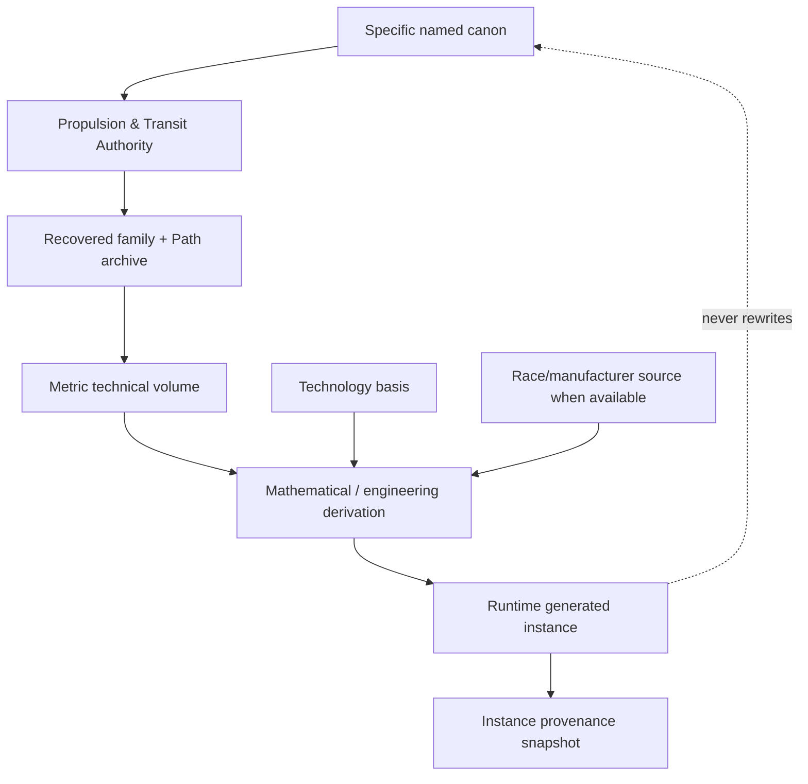

# Black Light FTL Technical Volume: Metric Compression Envelope

**Status:** subordinate family-specific engineering, educational, operational, maintenance, mathematical, and generator reference.  
**Primary authority:** `docs/blacklight/BLACK_LIGHT_PROPULSION_TRANSIT_AUTHORITY.md`.  
**Machine-readable companion:** `data/exo-vessel/ftl-metric-compression-technical-volume.json`.  
**Schema:** `data/schemas/exo-vessel-ftl-metric-technical-volume.schema.json`.  
**Legacy design source:** Google Drive document **“The different lightspeed methods”**, file ID `1e0Xp71EFubBZgXWjjvPxAqPoJIZNwqS6nu1-r7Kil7Y`, revision `ANLCKQllC5h6dLaX5H1RpK8aUFVWsi-IV7gbMHUd0Qq7mIe5uGsLFi5_Hrsr8B6dl8t_ezB0fTSygxrnIBtifAHW79bgSbswp1zF3NaEil0`.

`CONFIRMED` means directly recovered authority within scope. `DERIVED` means an engineering or mathematical consequence constrained by authority. `PROPOSED` means a useful extension awaiting adoption. `UNRESOLVED` means the available authority does not establish the fact. No equation, diagram, training incident, inventor, manufacturer, date, or race assignment becomes setting canon simply because it appears in this volume.

---

## 1. Family identity

The Metric Compression Envelope is a **4D local metric deformation system**. It modifies the effective geometry around a protected vessel volume rather than making remote regions topologically adjacent, entering a higher-dimensional shortcut, riding a Q-boundary, translating between indexed lattice states, traversing a maintained gate throat, or displacing the vessel by nonlocal state correspondence.

That distinction is the first and most important generator invariant.

```text
Metric Compression

ordinary geometry:
A ----------------------------------------------------------- B

controlled moving local geometry:
                 contracted forward interval
A ---------------------> [ VESSEL ] <--------------------- B
                          protected
                          local volume
                 expanded / recovered aft interval
```

The useful operational quantity is therefore not simply `speed`. The drive asks whether a finite moving volume can be surrounded by a controlled deformation whose external effective distance is reduced while the vessel interior remains within acceptable local conditions.

The recovered family progression is:

```text
P0  Metric Stress-Test Monolith
P1  Inertial Relief Envelope
P2  Subluminal Compression Bubble
P3  First Causal-Horizon Envelope
P4  Operational Warp Envelope
P5  Strategic Metric Drive
P6  Compact Dynamic Metric Engine
```

Those implementation names are `CONFIRMED` within the recovered Path authority. The mathematical underlay below is `DERIVED` unless otherwise marked.

---

# 2. Mathematical model

## 2.1 Effective metric and protected volume

Let ordinary spatial geometry on a route be described by a spatial metric `gamma_ij`. Let the drive generate a bounded time-dependent deformation `h_ij(x,t)` around a protected moving region `Omega(t)`:

\[
\gamma^{eff}_{ij}(x,t)=\gamma_{ij}(x,t)+h_{ij}(x,t).
\]

The effective path length along route `Gamma` is

\[
D_{eff}(\Gamma)=\int_\Gamma
\sqrt{\gamma^{eff}_{ij}\,dx^i dx^j}.
\]

Define ordinary route length

\[
D_0(\Gamma)=\int_\Gamma
\sqrt{\gamma_{ij}\,dx^i dx^j},
\]

and a derived route-gain ratio

\[
G_M=\frac{D_0}{D_{eff}}.
\]

`G_M` is **not** itself a canonical velocity multiplier. It is a statement about the relationship between ordinary and drive-modified route geometry under a given model and environment.

A drive therefore does not receive a higher rating merely because it can produce a larger instantaneous deformation. It must produce a **usable deformation history** from origin to destination.

---

## 2.2 Constrained route objective

A mature Metric drive should not minimize `D_eff` alone. A representative derived objective is

\[
J_M=
D_{eff}
+\lambda_h H_{causal}
+\lambda_g B_g
+\lambda_t B_t
+\lambda_s B_s
+\lambda_u U_{ref}
+\lambda_r B_r.
\]

Where:

- `H_causal` = causal-horizon and forward-control burden,
- `B_g` = gravity/curvature burden,
- `B_t` = tidal and gradient burden,
- `B_s` = structural/field-support burden,
- `U_ref` = navigation/reference uncertainty,
- `B_r` = termination/recovery burden.

The weighting coefficients are `PROPOSED` until calibrated.

The important engineering consequence is already useful without fixed coefficients: **the geometrically shortest effective route can be the wrong route** if it creates excessive curvature, controller burden, field asymmetry, structural loading, or insufficient abort margin.

---

## 2.3 Gravity burden

The legacy design source requires all transit methods to degrade near large gravity wells, while allowing different families to possess different tolerance and efficiency-loss curves. For Metric Compression, gravity is especially relevant because the drive is attempting to impose an additional controlled geometry on a background geometry that may already be strongly curved.

A useful derived burden integral is

\[
B_g=
\frac{1}{V_\Omega}
\int_\Omega
\left[
 a_\Phi\frac{|\Phi|}{\Phi_*}
+a_g\frac{|\nabla\Phi|}{g_*}
+a_R\frac{\|R\|}{R_*}
\right]dV.
\]

Here `Phi` is gravitational potential, `grad Phi` captures local gradient, and `R` denotes an appropriate curvature measure. `Phi_*`, `g_*`, `R_*`, and the coefficients are calibration scales and remain `PROPOSED`.

The qualitative rule is more important than the constants:

\[
\frac{\partial E_{field}}{\partial B_g}>0.
\]

As background curvature burden rises, the energy, control, structural, and solution cost of achieving the same effective deformation rises. Eventually a certified installation reaches a regime where increasing power no longer solves the problem because another constraint—field authority, structural loading, controller bandwidth, horizon validity, or recovery—fails first.

This is how the system naturally produces **gravity exclusion zones** without needing an arbitrary game-only prohibition.

---

## 2.4 Tidal and shear burden

A nearly uniform gravitational field and a rapidly changing field are not equivalent engineering environments.

Define a tidal tensor approximation

\[
T_{ij}=\partial_i\partial_j\Phi.
\]

A derived tidal burden can be represented as

\[
B_t=\frac{1}{V_\Omega}
\int_\Omega
\frac{\|T\|}{T_*}\,dV.
\]

This matters because different portions of the protected envelope may require different deformation authority at the same moment. High tidal burden drives field-sector asymmetry and therefore structural and control cost.

A P0 or P1 installation may require extremely uniform laboratory geometry. A P4 or P5 installation can tolerate a more complicated environment because it has better sensors, more field sectors, better solvers, stronger materials, and better structural load redistribution—not because gravity has ceased to matter.

---

## 2.5 Structural margin

The drive acts through machinery mounted on a vessel whose field sectors, support structures, power trunks, thermal paths, and hull experience asymmetric loads.

Define a simplified structural margin

\[
\mu_s=1-\max_x\left(\frac{\sigma_{eq}(x)}{\sigma_{allow}(x)}\right).
\]

If

\[
\mu_s\le0,
\]

the route is not admissible regardless of available reactor power.

This gives structural technology a direct mathematical effect on transit performance. Stronger materials, better load-path design, distributed emitters, active structural compensation, and improved field symmetry can increase usable range or gravity tolerance even with the same prime mover.

---

## 2.6 Safety horizon

The legacy source explicitly requires more advanced transit systems to possess safety sensing and emergency de-transit capability that reaches far enough ahead of the vessel's effective motion.

The common derived inequality is

\[
L_{sensor}\ge
v_{eff}
(t_{detect}+t_{solve}+t_{command}+t_{field}+t_{exit})
+D_{margin}.
\]

Define

\[
L_{safe}=v_{eff}
(t_{detect}+t_{solve}+t_{command}+t_{field}+t_{exit})
+D_{margin},
\]

and

\[
H_s=\frac{L_{sensor}}{L_{safe}}.
\]

`H_s>1` indicates positive modeled lookahead margin. It does not mean perfect safety.

A powerful but slow-thinking drive can therefore be **less safe** than a lower-output drive. If a new field system doubles effective transit performance but sensing, solving, command propagation, field response, and termination remain unchanged, the safety horizon contracts in operational terms.

This is one of the central reasons Path advancement must include sensing and control technology.

---

# 3. Why the seven Path levels improve

## P0 — Metric Stress-Test Monolith

The primitive system can solve only small, approximately static perturbations inside a tightly surveyed volume. The apparatus is physically enormous because the civilization does not yet possess compact field materials, high-rate control, or algorithms capable of maintaining a moving deformation.

**Mathematics:** local perturbative solutions around known boundary conditions.

**Machinery:** massive fixed field supports, laboratory metrology frame, low-bandwidth synchronized sources, external power plant.

**What actually improves:** proof that controlled metric deformation is repeatable and measurable.

**Principal failure:** measured deformation disagrees with model because the apparatus, timing, background gravity, or field-former geometry is not known accurately enough.

---

## P1 — Inertial Relief Envelope

The first major improvement is not “FTL.” It is the ability to make the deformation directional and to hold a finite protected volume inside it.

**Mathematics:** anisotropic forward/backward field solutions replace nearly symmetric laboratory perturbations.

**Mechanical advance:** improved emitter symmetry, stronger field-active material, faster timing distribution, better metrology.

**Moved limits:** directionality, volume, field efficiency, internal load reduction.

At this level, the civilization has learned that a mathematically possible field can still be an awful machine. Hysteresis, emitter mismatch, thermal drift, and mechanical tolerances can waste much of the theoretical deformation authority.

---

## P2 — Subluminal Compression Bubble

The decisive advance is **moving closed-volume control**.

The drive must repeatedly solve

\[
\partial_t\Omega(t)
\]

while maintaining acceptable boundary residuals around the moving ship.

A useful closure residual is

\[
\epsilon_\Omega=
\frac{1}{A_\Omega}
\int_{\partial\Omega}
|F_{target}-F_{actual}|\,dA.
\]

Operational movement is allowed only while

\[
\epsilon_\Omega<\epsilon_{max}.
\]

The threshold is installation-specific and remains unresolved without a named source.

**Enablers:** distributed field sectors, vessel-scale timing network, structural load redistribution, better sensors, dedicated reserve power.

**Moved limits:** mobility, field continuity, integrated vessel operation.

---

## P3 — First Causal-Horizon Envelope

This is where the engineering problem becomes qualitatively harder. The solver must now account for the fact that the drive's own effective motion can threaten the ability of information, field control, and emergency termination to remain useful.

The P3 transition therefore requires more than stronger field generation. It requires:

```text
forward sensing
      +
route prediction
      +
redundant solving
      +
fast field-sector response
      +
reserved termination authority
      =
first operational supra-light envelope
```

The primitive P3 ship is expected to have large exclusion zones, conservative routes, long charge/solution cycles, and harsh abort criteria.

---

## P4 — Operational Warp Envelope

P4 becomes genuinely fleet useful because the field stops behaving like one monolithic bubble and becomes a **dynamically controlled set of coupled sectors**.

Represent sector authority as vector

\[
\mathbf f=(f_1,f_2,\ldots,f_n).
\]

The controller solves

\[
\mathbf f^*=\arg\min_{\mathbf f}J_M
\]

subject to closure, structural, thermal, energy, and horizon constraints.

If the forward-port sector encounters greater background curvature than the aft-starboard sector, the system need not overdrive the entire envelope equally. It can redistribute authority where the geometry requires it.

This increases gravity tolerance and efficiency because **control resolution improves**.

---

## P5 — Strategic Metric Drive

The P5 advance is primarily a change in **optimization horizon**.

Earlier drives solve the immediate field well enough to keep moving. The strategic drive solves an entire predicted route through changing gravity terrain.

Instead of

\[
\max G_M(t),
\]

it seeks

\[
\min_{\Gamma,h_{ij}(t)}
\int_{t_0}^{t_1}
J_M(t)\,dt.
\]

This is why a P5 ship may deliberately command less instantaneous compression near a difficult star, take a longer ordinary-space arc, and still arrive sooner or with dramatically less energy and risk.

**Enablers:** long-baseline gravimetry, predictive mass-field models, dense solver fabrics, stronger field-support materials, improved energy conditioning, larger recovery reserve.

**Moved limits:** strategic range, energy per effective distance, route flexibility, gravity avoidance, fault tolerance.

---

## P6 — Compact Dynamic Metric Engine

P6 closes the loop between navigation, field control, structure, recovery, and prediction.

The controller behaves like a constrained receding-horizon optimizer:

\[
X_{t+1}=F(X_t,u_t,E_t),
\]

where `X_t` includes field state, vessel loads, thermal state, reference covariance, recovery state, and current route estimate; `u_t` is the field-control action; and `E_t` is the measured environment.

At each step it re-solves

\[
\min_{u_{t:t+N}}\sum_{k=t}^{t+N}J_M(X_k,u_k,E_k)
\]

subject to hard safety constraints.

The mature engine is compact not because physics became free, but because centuries of development have reduced dead mass, field-material loss, timing overhead, structural penalty, control latency, and reserve overhead while improving prediction and self-calibration.

---

# 4. Machinery anatomy

A Metric installation resolves through eight functional blocks.


### Energy conditioning

The drive must distinguish **transit energy** from **recovery energy**. Recovery reserve is not ordinary spare capacity. It is protected authority dedicated to bringing the field back toward a survivable ordinary geometry after a fault or commanded termination.

### Metric prime mover

The prime mover is the physical subsystem that establishes the controllable spacetime-stress condition. Its exact implementation depends on technology basis and named canon. This volume does not force terrestrial coil language onto non-terrestrial systems.

### Field formation

Field-forming elements must be physically distributed around or through the protected volume. A single decorative “warp core” cannot explain vessel-wide tensor control unless a higher source establishes a remote field-distribution mechanism.

### Transit control

The controller allocates deformation authority among field sectors, enforces closure, rejects unsafe route solutions, and keeps the termination solution current.

### Navigation and sensing

The sensor suite must estimate the background gravitational environment **ahead of the effective motion**, not merely know the ship's ordinary inertial position.

### Termination and recovery

A safe exit is an engineered sequence. The field cannot simply disappear without concern for residual geometry, vessel loading, sector timing, and reference reacquisition.

### Whole-effect coverage

The protected volume must contain every component that cannot tolerate being partially outside the field solution. Large booms, cargo extensions, docked craft, rotating structures, or damaged hull projections therefore matter.

### Backbone

Timing, thermal transport, structural load paths, abort distribution, and safety interlocks bind the machine together. A drive with enormous field authority but poor timing distribution can be unusable.

---

# 5. Scaling behavior

Metric systems scale in several different dimensions at once.

Let a characteristic protected-envelope length be `L`, protected volume `V~L^3`, and field-forming area `A~L^2` for a geometrically similar vessel.

A naive model might assume power scales only with volume. That is insufficient. Larger installations also suffer from:

\[
\text{timing skew} \propto L,
\]

\[
\text{structural span burden} \uparrow L,
\]

\[
\text{field-former area} \propto L^2,
\]

and potentially

\[
\text{stored field energy} \sim f(h_{ij},V,B_g),
\]

where the exact exponent is intentionally unresolved until calibration.

This gives the generator several legitimate reasons why a capital ship may need a physically larger and more distributed drive than a courier even if both possess the same Path maturity.

It also explains why a later compact strategic drive can be revolutionary: compactness may result from stronger field materials, denser control sectors, better structural integration, lower hysteresis, faster timing, better energy conditioning, and superior mathematics simultaneously.

---

# 6. Technology-basis embodiments

The **same Metric mathematics** can exist in radically different machines.

| Basis | Likely derived embodiment | Primary service concern |
|---|---|---|
| Terrestrial mechanical | rings, field plates, coils, structural trusses, photonic/electronic timing | alignment, insulation, cooling, connector/timing drift |
| Aquatic fluidic | pressure-qualified field membranes, wet photonics, shell-integrated emitters | cavitation, fluid chemistry, membrane delamination |
| Cryogenic superconducting | persistent-current sectors, cryogenic metrology, low-loss buses | quench, thermal contamination, cooldown/requalification |
| Gas-giant buoyant | huge distributed buoyant field structures and flexible load webs | atmospheric shear, buoyancy trim, flexible timing baselines |
| Biological symbiotic | cultivated field-bearing tissues, neural timing trunks, regenerative support organs | tissue viability, neural synchronization, scar/remodeling effects |
| Mineral crystalline | coherent lattice volumes, controlled defects, prestressed resonant supports | fracture domains, defect migration, resonance drift |
| Postmaterial distributed | coherent distributed nodes, executable control proofs, reconstructed field meshes | coherence loss, identity/reference faults, fallback reconstruction |

All of these translations are `DERIVED`. None implies that a named race possesses Metric technology.

---

# 7. Practical operator manual

## 7.1 Pre-transit certification

The operator must obtain positive status in seven independent areas:

1. **Route solution:** ordinary and effective route solutions agree on origin, destination, and reference epoch.
2. **Gravity model:** local and forward gravity/curvature estimates lie inside the certified model domain.
3. **Protected-volume closure:** all required vessel geometry is inside the modeled field envelope.
4. **Structure:** field-induced load cases retain positive margin.
5. **Field authority:** no required sector is already near saturation before commit.
6. **Safety horizon:** sensing, solving, command, field response, and termination satisfy required lookahead.
7. **Recovery reserve:** protected termination authority remains unavailable to ordinary performance commands.

A performance request that causes any one of these to fail is rejected.

## 7.2 Transit watch

During transit, monitor trends rather than single alarms:

```text
route residual
     |
     +----> gravity-model residual
     |
     +----> field-sector authority
     |
     +----> structural asymmetry
     |
     +----> safety horizon
     |
     +----> recovery reserve
```

A slowly rising route residual combined with stable field hardware suggests the environment model may be aging. A simultaneous rise in one sector's demanded authority and local structural load suggests genuine asymmetric geometry or a field-former fault.

## 7.3 Gravity approach

Never hold effective gain constant merely because the destination is near.

As `B_g` and `B_t` rise, the certified action may be:

- reduce deformation,
- change route,
- begin early termination,
- transition to conventional propulsion,
- or declare the region unavailable to that installation.

The exact exclusion radius depends on drive maturity, vessel scale, environment, and named-system authority.

## 7.4 Abort doctrine

A proper abort is **not** “switch the drive off.”

The generic derived sequence is:

```text
freeze new performance increase
        -> preserve reference state
        -> rebalance sectors toward termination geometry
        -> spend recovery reserve
        -> reduce effective gain
        -> collapse deformation in certified order
        -> reacquire ordinary geometry/reference
        -> inspect residual field and structure
```

Named installations may differ.

---

# 8. Maintainer manual

## 8.1 Symptom: one sector consistently demands excess authority

Do not immediately replace the field-forming element.

Isolation order:

```text
reference / gravimetry
        |
        v
commanded tensor target
        |
        v
timing distribution ----> sector controller
        |                     |
        v                     v
field former -----------> local structure
        |                     |
        v                     v
material state ---------> power delivery
```

The same symptom can result from bad environmental reconstruction, timing skew, controller bias, material hysteresis, physical misalignment, structural deformation, or power-delivery droop.

## 8.2 Symptom: route works in deep space but fails near stars

Possible causes include:

- gravimetric model bandwidth insufficient for background curvature,
- field-former authority insufficient under elevated burden,
- structural margin exhausted by asymmetric field loading,
- horizon solution becoming invalid before termination can complete,
- active material heating/hysteresis increasing with demanded field strength.

A larger reactor fixes only the subset caused by insufficient usable power.

## 8.3 Return-to-service test

A repaired installation must reproduce a certified low-gain test envelope repeatedly while meeting all of the following:

\[
\epsilon_\Omega<\epsilon_{max},
\]

\[
\mu_s>\mu_{min},
\]

\[
H_s>H_{min},
\]

and recovery reserve must remain above its certification floor.

Do not return a drive to service because one field-strength measurement looks normal.

---

# 9. Signature model

Metric transit should leave signatures that emerge from both **family physics** and **machinery embodiment**.

A generic signature state can be written

\[
S=S_{metric}+S_{power}+S_{control}+S_{thermal}+S_{structure}.
\]

`S_metric` is the family-specific disturbance associated with controlled local geometry. The remaining terms depend strongly on implementation.

A cryogenic installation may produce obvious pre-transit thermal conditioning and quench signatures. A biological system may expose metabolic and vibrational sidebands instead of conventional electrical switching. A mineral system may show coherent resonant modes. The carrier changes; the underlying requirement to create and control a metric deformation does not.

This prevents the generator from assigning identical sensor signatures to every species while also preventing “stealth by vocabulary substitution.”

---

# 10. Failure anatomy

A Metric drive incident should be reconstructed through an explicit chain.

## 10.1 Route-model failure

\[
\text{bad gravity estimate}
\rightarrow
\text{wrong tensor demand}
\rightarrow
\text{sector saturation}
\rightarrow
\text{closure residual growth}
\rightarrow
\text{structural asymmetry}
\rightarrow
\text{abort}
\]

## 10.2 Control failure

\[
\text{timing skew}
\rightarrow
\text{sector phase error}
\rightarrow
\text{deformation asymmetry}
\rightarrow
\text{route + structure residual}
\rightarrow
\text{recovery demand}
\]

## 10.3 Structural failure

\[
\text{support damage}
\rightarrow
\text{field-former displacement}
\rightarrow
\text{incorrect field geometry}
\rightarrow
\text{controller compensation}
\rightarrow
\text{authority exhaustion}
\rightarrow
\text{termination}
\]

## 10.4 Catastrophic horizon failure

The most dangerous class occurs when the drive detects an invalid future state **after** the physical termination horizon has already been consumed.

\[
L_{sensor}<L_{safe}.
\]

At that point the failure is not simply “the crew reacted too late.” The machine did not possess enough sensing, solving, actuation, and recovery reach for the commanded effective performance.

---

# 11. Accident-investigation training exemplar

**Status:** `PROPOSED TRAINING EXEMPLAR`; not confirmed history.

A P4-class Metric vessel enters a route segment whose predicted stellar mass distribution was built from stale survey data. A previously negligible companion body has shifted enough to create a stronger-than-predicted local gradient. The navigation solution remains within its nominal positional tolerance, so no immediate route alarm appears.

Field sector 3 begins requesting increasing authority. The controller compensates correctly. Structural load in the same quadrant rises. The operator interprets the change as a field-former calibration issue because the vessel has previously experienced mild sector drift.

The key investigation question is not whether the operator chose the wrong menu item. It is why the system allowed a plausible environmental-model failure to masquerade as a hardware drift condition.

The board reconstructs:

\[
\text{stale mass model}
\rightarrow
\text{underpredicted curvature}
\rightarrow
\text{sector-3 demand increase}
\rightarrow
\text{structural asymmetry}
\rightarrow
\text{reduced abort margin}.
\]

Corrective actions may include:

- better provenance display for mass-field data,
- automated cross-check between sector demand and gravimetry residual,
- revised hard limits on simultaneous structural and field-authority trends,
- improved forward gravimetry,
- or more conservative route validation.

“Use a stronger drive” is not a root-cause correction.

---

# 12. Educational track

## Public primer

Teach one idea: Metric transit changes the geometry the vessel must cross; it does not simply push the ship faster through unchanged space.

## Operator school

Teach route validity, gravity burden, protected-volume closure, field-sector authority, safety horizon, and abort discipline.

## Maintainer qualification

Teach fault isolation between references, timing, field-forming hardware, active materials, structure, power, and recovery.

## Engineering degree

Teach differential geometry sufficient to understand effective metrics, numerical field solving, constrained optimization, structural mechanics, control theory, metrology, thermal engineering, and fault-tolerant systems.

## Research curriculum

Research questions include:

- can better tensor parameterizations reduce solver cost without reducing safety?
- can field-former topology reduce structural asymmetry near moderate gravity gradients?
- can route optimization trade small increases in `D_eff` for large reductions in energy and abort burden?
- can improved gravimetric covariance models expand the certified operating region without increasing raw field authority?
- can recovery fields be co-designed with transit fields without creating common-mode failure?

---

# 13. Patent-class development records

These are `DERIVED` technology-development forms, not setting-history claims.

## Patent class M-01 — sectorized field authority

**Prior limitation:** one global deformation command forced the entire field to follow the worst local requirement.

**Advance:** divide field formation into independently driven but mathematically coupled sectors.

**Equation moved:** replace scalar field authority `f` with vector `f_i` and optimize under closure constraints.

**Physical enabler:** faster timing, distributed controllers, more numerous field-forming elements, stronger local support structure.

**Result:** lower wasted authority and greater tolerance for asymmetric background geometry.

**Inventor:** `UNRESOLVED`.

## Patent class M-02 — covariance-aware forward gravimetry

**Prior limitation:** route solver consumed point estimates of mass/curvature as though they were exact.

**Advance:** propagate environmental uncertainty into route and abort cost.

\[
J'_M=J_M+\lambda_uU_{ref}.
\]

**Physical enabler:** longer sensor baselines, better clocks, reference fusion, higher solver density.

**Result:** earlier rejection of brittle high-gain routes.

**Inventor:** `UNRESOLVED`.

## Patent class M-03 — protected recovery reserve

**Prior limitation:** maximum transit commands could consume the same power/field authority required for safe termination.

**Advance:** reserve and isolate termination authority.

**Physical enabler:** separated storage, control paths, field sectors, and interlocks.

**Result:** stronger guarantee that a drive capable of entering a state retains machinery authority to leave it.

**Inventor:** `UNRESOLVED`.

## Patent class M-04 — receding-horizon metric control

**Prior limitation:** route and field solutions were periodically recomputed as separate tasks.

**Advance:** continuously co-optimize route, field geometry, structure, sensing horizon, and recovery.

**Physical enabler:** fault-tolerant solver mesh, dense field sectors, self-calibrating metrology, high-bandwidth control.

**Result:** P6-style adaptive efficiency and compactness.

**Inventor:** `UNRESOLVED`.

---

# 14. Generator contract

A Metric installation generator must accept at least:

```text
family = metric-envelope
Transit Path P0-P6
shared T-tier when runtime-resolved
technology basis
vessel geometry + protected volume
mass + structural load paths
power + dedicated recovery reserve
environment gravity / curvature / tidal state
reference quality and age
mission route
condition state
authority snapshot
```

It should return:

```text
ordinary route distance D0
effective metric distance D_eff
route gain G_M
gravity burden B_g
tidal burden B_t
field-sector solution
structural margin mu_s
sensor / abort horizon H_s
energy + recovery allocation
technology-basis machinery embodiment
precommit / transit / termination procedures
signature expectations
maintenance burdens
failure chains
provenance and canon status for every non-confirmed field
```

### Hard guards

The generator must not:

- substitute Fold-Jump adjacency mathematics,
- substitute N-Manifold geodesics,
- substitute Slipstream/Q-Lattice state-route logic,
- infer a species or manufacturer from technology basis,
- convert Path levels into unexplained speed multipliers,
- promote coefficients or example values to canon,
- allow performance commands that violate sensing, structural, field, energy, or recovery constraints,
- or silently normalize a higher-authority named installation to match generic runtime behavior.

---

# 15. API example

```json
{
  "request": {
    "family": "metric-envelope",
    "path": "P4",
    "technology_basis": "TERRESTRIAL_MECHANICAL",
    "vessel": {
      "protected_volume_m3": 185000,
      "characteristic_length_m": 142
    },
    "environment": {
      "gravity_model": "resolved-instance-reference",
      "reference_epoch": "required",
      "reference_status": "DERIVED"
    },
    "mode": "LABELED_DERIVATION"
  },
  "response": {
    "family_action": "4D local metric deformation",
    "family_action_status": "CONFIRMED",
    "effective_distance_model": "metric-line-integral",
    "effective_distance_model_status": "DERIVED",
    "route_solution": {
      "status": "DERIVED",
      "ordinary_distance": "runtime-calculated",
      "effective_distance": "runtime-calculated",
      "gravity_burden": "runtime-calculated",
      "structural_margin": "runtime-calculated",
      "safety_horizon": "runtime-calculated"
    },
    "attribution": {
      "race": "UNRESOLVED",
      "manufacturer": "UNRESOLVED"
    }
  }
}
```

The numerical values belong to the generated instance. They do not become universal setting constants.

---

# 16. Provenance and canon safeguards

This volume deliberately separates four kinds of statement.

**Recovered family facts**—the family identity, the basic physical action, and recovered Path implementation names—remain `CONFIRMED` within their source scope.

**Engineering mathematics**—effective-distance integrals, route objectives, burden terms, closure residuals, structural margins, and safety-horizon equations—are `DERIVED` models designed to make the family internally coherent and computationally usable.

**Calibration constants** are `PROPOSED` until adopted. A number that happens to produce a desirable RPG result cannot silently become a law of nature.

**Historical attribution** remains `UNRESOLVED` unless a higher source names an inventor, institution, race, manufacturer, date, ship, or accident.

The intended authority flow is therefore:



Repeated generation does not promote derived material. Repeated documentation does not turn a training exemplar into history. Technology basis does not establish ownership. A more detailed explanation does not outrank the source it explains.

---

# 17. Summary engineering principle

The Metric Compression Envelope improves through a coupled chain:

\[
\boxed{
\text{better geometry}
+\text{better sensing}
+\text{better field materials}
+\text{better structure}
+\text{better control}
+\text{better energy conditioning}
+\text{better recovery}
\Rightarrow
\text{a larger mathematically admissible transit envelope}
}
\]

That larger envelope may manifest as more effective distance reduction, longer range, lower energy cost, smaller machinery, greater gravity tolerance, faster safe termination, or higher reliability. None of those gains should be granted without identifying which mathematical or physical limit moved.

That is the governing standard for future Metric Compression additions.
