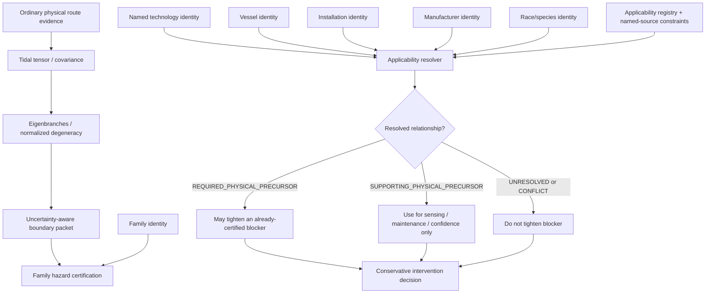

# Black Light FTL Named-Identity Applicability Handoff Manual

**Status:** `MIXED` — runtime integration authority, source-constrained race/technology engineering guidance, and explicitly labeled derived mathematics.  
**Design-intent source:** Google Drive document **The different lightspeed methods**, document ID `1e0Xp71EFubBZgXWjjvPxAqPoJIZNwqS6nu1-r7Kil7Y`, verified revision `ANLCKQllC5h6dLaX5H1RpK8aUFVWsi-IV7gbMHUd0Qq7mIe5uGsLFi5_Hrsr8B6dl8t_ezB0fTSygxrnIBtifAHW79bgSbswp1zF3NaEil0`.  
**Primary machine authorities:** `data/exo-vessel/ftl-route-safety-integration.json`, `data/exo-vessel/ftl-topology-hazard-applicability-registry.json`, `blacklight-exo-ftl-route-safety-runtime.js`, and `blacklight-exo-ftl-family-segment-certification-runtime.js`.  
**Named-source constraints:** `ARNOCK_PROPULSION_TRANSIT_ENGINEERING_PROFILE.md` and `ZWLEI_MURREK_PROPULSION_TRANSIT_ENGINEERING_MANUAL.md`.

---

## 1. Purpose

Black Light now has enough physical route machinery that the question is no longer merely whether a route contains difficult gravitational geometry. The certification system can track moving gravitating sources, propagate covariance, calculate the tidal tensor, follow its eigenbranches, localize operational degeneracy boundaries, estimate uncertainty around those boundaries, and carry an earliest plausible boundary into intervention calculations.

The remaining problem is epistemic rather than numerical:

> **When does that ordinary physical precursor actually apply to the fictional hazard of this particular drive, vessel, manufacturer, species implementation, or installation?**

This manual defines the identity handoff that answers that question without allowing names, species, archaeological guesses, or evocative machinery terminology to become unearned FTL canon.

The governing source requires different transit methods to have different gravity sensitivities, different failure modes, different predictive sensor packages, and different emergency de-transit systems. It specifically establishes catastrophic gravitational-shear forks as a danger for the gravitational-plane style of travel, while also requiring increasingly sophisticated but never perfect safety margins.

The identity system exists so those rules can become more specific over generations of technology without rewriting the underlying family every time a named machine is discovered.

---

## 2. Authority pipeline



The important separation is:

\[
\boxed{
\text{identity context}
\neq
\text{family identity}
}
\]

Identity selects a more specific applicability rule **after** the family and hazard have independent authority. It does not choose the family.

---

## 3. Precedence model

The current resolver precedence is:

\[
\boxed{
I > V > T > M > R > F
}
\]

where:

- \(I\) = specific installation;
- \(V\) = specific vessel;
- \(T\) = named technology;
- \(M\) = manufacturer;
- \(R\) = race/species implementation;
- \(F\) = generic family.

This is not a statement that installations are more scientifically correct than families. It is a statement about scope specificity.

A documented refit on one vessel can legitimately override a manufacturer-wide assumption for that vessel. A manufacturer-specific sensor/abort implementation can legitimately override a race-wide norm. A race-wide embodiment can legitimately override only generic machinery assumptions that the source actually establishes.

Equal-precedence contradiction is not averaged:

\[
A_1\neq A_2,
\quad
P(A_1)=P(A_2)
\Rightarrow
\boxed{\mathrm{CONFLICT}}
\]

The resolver refuses to guess.

---

## 4. Route-safety handoff contract

The physical-path adapter now forwards the following fields unchanged into family-segment certification:

| Field | Meaning | May select family? |
|---|---|---:|
| `namedTechnologyId` | named drive or transit-technology lineage | No |
| `vesselId` | named vessel or stable vessel record | No |
| `installationId` | specific installed drive/system | No |
| `raceId` | species/civilization implementation context | No |
| `manufacturerId` | maker or engineering lineage | No |
| `topologyHazardKey` | already-selected fictional hazard | No |
| `topologyHazardApplicabilityResolution` | pre-resolved provenance packet | No |
| `canonicalResolutionRequired` | whether canonical applicability is mandatory | No |
| `topologyApplicabilitySimulationOverride` | explicitly non-canonical test override | No |

The previous raw boolean applicability control is no longer the route-safety handoff.

The runtime invariant is:

\[
\boxed{
\texttt{topologyBoundaryAppliesToFirstBlocker}
\not\equiv
\text{authority}
}
\]

A caller may state identity. The applicability authority decides what that identity means.

---

## 5. Physical mathematics remains unchanged

Identity does not alter ordinary gravity.

For gravitating sources \(a\), the weak-field potential remains

\[
\Phi(\mathbf r,t)
=
-\sum_a\frac{GM_a}{|\mathbf r-\mathbf r_a(t)|}.
\]

The gravitational acceleration remains

\[
\mathbf g(\mathbf r,t)
=
-\sum_a GM_a
\frac{\mathbf r-\mathbf r_a(t)}{|\mathbf r-\mathbf r_a(t)|^3}.
\]

The tidal tensor remains the Hessian of the potential in the adopted weak-field model:

\[
T_{ij}
=
\sum_a\frac{GM_a}{R_a^3}
\left(3n_i n_j-\delta_{ij}\right).
\]

Its principal modes satisfy

\[
T\hat{\mathbf e}_k=\lambda_k\hat{\mathbf e}_k.
\]

The current operational branch-separation quantity remains

\[
\gamma_{ij}
=
\frac{|\lambda_i-\lambda_j|}
{\max(|\lambda_i|,|\lambda_j|,\|T\|_F,\epsilon)}.
\]

Identity determines whether that physical state is relevant to a named fictional hazard. It does not modify \(G\), mass, source position, the tensor, or the eigenvalues.

---

## 6. Required versus supporting precursor relationships

The applicability registry distinguishes two positive relationships.

### 6.1 `REQUIRED_PHYSICAL_PRECURSOR`

This means the fictional hazard, as currently defined, requires the physical precursor in question.

For hazard \(H\) and physical precursor \(P\):

\[
H\Rightarrow P.
\]

It does **not** mean:

\[
P\Rightarrow H.
\]

That asymmetry is critical.

For an already-certified blocker beginning at fraction \(f_B\), and an uncertainty-aware early physical boundary \(f_{\rm early}\), a required relationship permits:

\[
 f_{B,\mathrm{eff}}
 =
 \min(f_B,f_{\rm early}).
\]

It still cannot create a blocker if the fictional hazard was never independently certified.

### 6.2 `SUPPORTING_PHYSICAL_PRECURSOR`

This means the physical evidence is useful for sensors, diagnostics, maintenance, prediction, or confidence, but does not generically authorize blocker movement.

Thus:

\[
f_{B,\mathrm{eff}}=f_B
\]

unless a more specific source establishes a stronger relationship.

---

## 7. Ar'nock source constraint

The current Ar'nock propulsion/transit profile is unusually valuable precisely because it says what is **not** known.

Confirmed or source-constrained material supports:

- biological instruction-driven fabrication;
- cultivated neural computation;
- vibration/acoustic interface pressure;
- nonhuman maintenance ergonomics;
- a derived biological-symbiotic machinery basis;
- chemically and biologically distinct service boundaries.

The same source explicitly leaves the Ar'nock transit family unresolved.

Therefore:

\[
\boxed{
R_{\rm Ar'nock}
\not\Rightarrow
F_{\rm transit}
}
\]

and consequently no race-scoped topology-hazard applicability record is currently justified.

### 7.1 What Ar'nock identity *may* change

Once a family is independently supplied by scenario or future canon, Ar'nock identity may shape how the required safety functions are embodied.

A tidal-eigenbranch sensor package might be represented by distributed cultivated sensory tissues rather than terrestrial gradiometer racks. Uncertainty might appear as loss of coherent biological salience rather than an angular covariance cone. Abort authority might be distributed through metabolic gating, neural inhibition, vascular isolation, or sacrificial field-bearing tissue.

Those are embodiment consequences.

They are not family evidence.

---

## 8. Zwlei Mur'rek source constraint

The Mur'rek-class corpus provides substantially more transit-adjacent machinery detail than the current Ar'nock corpus.

The named installation is a:

> **bio-reactive gravitic slipstream system**

with confirmed elements including:

- flexible field vanes immersed in dielectric fluid;
- a Gravitic Slipstream Regulator;
- a Navigation Current Well encoding vector, gravity, and transit risk;
- gravitic reference, slipstream prediction, and inertial control;
- bio-reactive power fluids and conductive coolant;
- organic and multispectral sensing;
- asymmetric-vane failure capable of rotating the local inertial frame.

This is sufficient to build deep machinery, maintenance, sensor, failure, and control models.

It is **not** sufficient to choose between consolidated `gravitational-plane` and `slipstream-shear` families.

The terminology firewall is:

\[
\boxed{
\text{``gravitic slipstream''}
\neq
\texttt{gravitational-plane}
}
\]

and also:

\[
\boxed{
\text{``gravitic slipstream''}
\neq
\texttt{slipstream-shear}
}
\]

until an authority performs that mapping.

### 8.1 Useful Mur'rek mathematics without family promotion

A regulator symmetry diagnostic may be modeled as

\[
\epsilon_v
=
\|\mathbf u_{\rm commanded}-\mathbf u_{\rm observed}\|_W,
\]

where \(W\) weights vane sectors by control significance.

A readiness vector may be written

\[
\mathbf R_M=
[m_{\rm vane},m_{\rm diel},m_{\rm power},m_{\rm cool},m_{\rm hyd},m_{\rm sensor},m_{\rm grav},m_{\rm nav},m_{\rm struct}]^T.
\]

An operational rule can then require

\[
A_{\rm op}
=
\bigwedge_i(m_i>0).
\]

These relations describe the named machinery's engineering state. None identifies the FTL family.

---

## 9. Machinery embodiment matrix

| Technology tradition | Identity evidence presentation | Physical precursor sensing | Abort/recovery embodiment | Maintenance emphasis |
|---|---|---|---|---|
| Terrestrial electromechanical | explicit IDs, certificates, serials | interferometric/gradiometric arrays | hardwired interlocks, contactors, field dump buses | calibration, connectors, clocks, sensor alignment |
| Ar'nock biological-symbiotic | cultivated identity/state, biological authentication | distributed sensory tissue / neural state | metabolic gating, neural isolation, sacrificial tissue | tissue health, feedstock, coherence, contamination |
| Zwlei Mur'rek fluidic-biological | class/installation identity plus fluid/vane state | gravitic reference + Navigation Current Well + sensor choir | vane unload, fluid isolation, hydraulic authority reduction | dielectric chemistry, vane symmetry, fluid segregation |
| Mineral-photonic | crystal lineage / lattice provenance | resonance splitting and polarization geometry | mode quench, lattice isolation, optical dump | lattice strain, resonance linewidth, contamination |
| Gas-giant volumetric | distributed regional identity | pressure/electrostatic field tomography | regional discharge and pressure decoupling | sensor-baseline geometry, pressure chemistry, charge balance |

The equation set can remain common while the machine implementing it is radically different.

---

## 10. Scaling implications

A larger installation creates more opportunities for identity and physical state to diverge across sections.

The established tidal differential scaling remains

\[
\Delta a\sim\|T\|L_v.
\]

Approximate structural tidal stress remains

\[
\sigma_{\rm tidal}\sim\rho\|T\|L_v^2.
\]

Distributed control remains characterized by

\[
\Pi_c
=
\frac{L_c}{v_c\tau_r}.
\]

Named-identity scope becomes increasingly important as \(L_c\) grows. A capital vessel may contain multiple installations or refit generations with different control firmware, sensor suites, field organs, or recovery hardware. A vessel-level rule should not silently erase an installation-specific exception.

For a sectional system with installations \(q\), define a bookkeeping set

\[
\mathcal I=\{I_1,I_2,\ldots,I_n\}.
\]

Certification should resolve applicability per affected installation where the source distinguishes them rather than collapsing all \(I_q\) into one vessel identity.

---

## 11. Power and recovery consequences

Identity-specific applicability does not change how much gravitational potential exists. It can change when a drive is required to reserve power and recovery authority.

For a continuous projected-progress family, the established intervention chain is

\[
t_{\rm int}
=
t_{\rm sensor}+t_{\rm solver}+t_{\rm decision}+t_{\rm command}
+t_{\rm actuate}+t_{\rm exit}+t_{\rm clear}+t_{\rm margin}.
\]

If projected progress speed \(v_p\) is physically meaningful for the family model,

\[
D_{\rm int}=v_p t_{\rm int}.
\]

When a `REQUIRED_PHYSICAL_PRECURSOR` applicability record authorizes the early boundary,

\[
M_D
=
D_{B,\rm eff}-D_{\rm int}.
\]

Named technologies may legitimately have different \(t_{\rm sensor}\), \(t_{\rm actuate}\), or \(t_{\rm exit}\) because their machinery differs. Those parameters require their own source/calibration authority; identity itself is not a numerical coefficient.

For PRECOMMIT families, retain timing authority:

\[
M_T=t_{\rm prediction}-t_{\rm int}.
\]

Do not fabricate a local FTL velocity for a fold, Q-lattice translation, or phase-displacement event merely to reuse continuous equations.

---

## 12. Navigation and sensor doctrine

The governing design source says mature drives look farther ahead because the safety system must detect route-breaking conditions before the vessel reaches them.

A useful decomposition is

\[
\mathcal S
=
\{S_g,S_T,S_{\rm clock},S_{\rm astro},S_{\rm family},S_{\rm local}\},
\]

where ordinary gravity and tidal sensing are distinguished from family-specific observables.

A named technology may improve one channel without improving all of them.

For example, the Mur'rek Forward Sensor Ampulla can be damaged while the Gravitic Slipstream Regulator remains powered. The correct engineering consequence is a reduced admissible operating envelope because lookahead evidence has degraded, not a claim that the drive has lost raw thrust.

A generic confidence functional can be written

\[
C_{\rm nav}
=
F(\Sigma_{\rm astro},\Sigma_T,\sigma_\gamma,
S_{\rm family},A_{\rm abort},\Delta t_{\rm lookahead}),
\]

with the explicit warning that \(F\) is an engineering framework until a family/named technology calibration supplies coefficients.

---

## 13. Signature model

Named machinery affects observables even when the transit operator is unchanged.

Use a multi-channel signature vector rather than a single stealth number:

\[
\mathbf S
=
[S_{\rm EM},S_{\rm thermal},S_{\rm grav},S_{\rm chemical},S_{\rm acoustic},S_{\rm exotic},S_{\rm wake},S_{\rm bio}]^T.
\]

Ar'nock biological implementations may have unusually strong biological/chemical maintenance signatures. Mur'rek systems may expose dielectric-fluid, hydraulic, bio-reactive, acoustic, and gravitic control signatures. Terrestrial machines may concentrate signature in electrical switching, thermal rejection, clocks, and active sensor emissions.

None of those signatures proves family identity unless a source establishes a unique diagnostic relationship.

---

## 14. Failure taxonomy

`IDH-01 — IDENTITY-DROPPED`  
A route-safety adapter fails to forward a known identity field, forcing a generic family result where a specific record should have been considered.

`IDH-02 — BOOLEAN-AUTHORITY`  
A caller boolean is treated as if it were canon applicability evidence.

`IDH-03 — KEYWORD-NORMALIZATION`  
A source term such as *gravitic slipstream* is mapped to a family solely because the words resemble a family name.

`IDH-04 — RACE-FAMILY-PROMOTION`  
Species machinery ancestry is treated as proof of family identity.

`IDH-05 — SCOPE-INVERSION`  
A generic family record overrides a more specific non-conflicting named record.

`IDH-06 — EQUAL-SCOPE-CONFLICT-SUPPRESSION`  
Contradictory equal-precedence records are averaged or selected silently instead of returning `CONFLICT`.

`IDH-07 — PROVENANCE-LOSS`  
The final blocker retains the result but loses the applicability record/source ancestry that authorized it.

`IDH-08 — PHYSICS-CANON-LEAK`  
Ordinary tidal topology is presented as evidence that the fictional FTL lane/hazard itself exists.

---

## 15. Practical field procedures

### IDH-P01 — Identity intake

1. Record the independently established FTL family and hazard.
2. Record named technology, vessel, installation, manufacturer, and race/species IDs only when known.
3. Preserve the source of each identity separately.
4. Do not synthesize missing IDs from display names.
5. Carry all known IDs into route certification.

### IDH-P02 — Applicability resolution

1. Verify physical precursor type.
2. Query applicability using family + hazard + physical evidence.
3. Supply all known identity selectors.
4. Apply the highest-specificity matching record.
5. Return `CONFLICT` for contradictory equal-precedence records.
6. Return `UNRESOLVED` when no canonical record exists.

### IDH-P03 — Ar'nock installation analysis

1. Confirm Ar'nock source identity.
2. Load machinery ancestry and biological-symbiotic constraints.
3. Leave family unresolved unless separately sourced.
4. If a scenario selects a family, label that selection as scenario/caller provenance.
5. Apply Ar'nock embodiment to machinery only.
6. Do not emit race-scoped family hazard applicability without new canon.

### IDH-P04 — Mur'rek regulator analysis

1. Preserve the source term `bio-reactive gravitic slipstream system`.
2. Inspect vane, dielectric, gravitic-reference, fluid, and sensor state.
3. Preserve source-confirmed hazards such as vane asymmetry.
4. Run forensic family discrimination separately.
5. Do not map the installation to `gravitational-plane` or `slipstream-shear` by vocabulary.
6. Only after family authority exists may named applicability be resolved.

### IDH-P05 — Refit recertification

1. Identify changed installation components.
2. Determine whether the refit changes sensing, abort, recovery, or family coupling.
3. Preserve old vessel/manufacturer/race identity separately from the new installation identity.
4. Require a new applicability record if the physical-precursor relationship changed.
5. Recalculate intervention margin from current timing data.

### IDH-P06 — Salvage/hybrid reconstruction

1. Separate original manufacturer, current operator, host vessel, and installed subsystem ancestry.
2. Do not let host race identity overwrite salvaged-drive identity.
3. Preserve unknown fields as unknown.
4. Resolve applicability at the most specific documented scope.
5. Treat incompatible or contradictory evidence as conflict rather than averaging.

### IDH-P07 — Maintenance release

1. Verify the physical sensors required by the applicable precursor relationship.
2. Verify family-specific sensors independently.
3. Verify abort and protected recovery authority.
4. Confirm identity/provenance packet survives the maintenance system export.
5. Refuse release if a required named applicability record is missing or conflicting.

### IDH-P08 — Operator presentation

1. Show family and hazard separately from vessel/species/manufacturer identity.
2. Show applicability source and scope.
3. Show nominal and conservative blocker locations separately.
4. Mark unresolved named-source mappings explicitly.
5. Never display a generic family rule as if it were a recovered named-technology fact.

---

## 16. Educational chart — what identity is allowed to do

| Input fact | Allowed engineering use | Forbidden promotion |
|---|---|---|
| Ar'nock biological fabrication | machinery embodiment, maintenance, interface design | selecting an FTL family |
| Mur'rek flexible field vanes | regulator state/failure/control modeling | declaring gravitational-plane |
| Mur'rek word “slipstream” | source terminology, forensic comparison | declaring slipstream-shear |
| named manufacturer | selecting manufacturer-scoped applicability/calibration when sourced | changing gravity equations |
| specific installation ID | selecting installation-scoped record | creating a hazard absent family certification |
| physical tidal degeneracy | precursor evidence | proving an exotic shear fork exists |

---

## 17. Engineering exercise

Assume a vessel has a separately certified gravitational-plane `shear-fork` blocker at

\[
f_B=0.63.
\]

The physical topology solution gives an earliest plausible normalized-degeneracy boundary at

\[
f_{\rm early}=0.59.
\]

### Case A — generic gravitational-plane family

The current family record is `REQUIRED_PHYSICAL_PRECURSOR`, so:

\[
f_{B,\rm eff}=\min(0.63,0.59)=0.59.
\]

### Case B — named technology has a sourced `NOT_APPLICABLE` installation record

The specific record outranks the family record:

\[
f_{B,\rm eff}=0.63.
\]

The physical topology still exists and remains useful environmental evidence; it simply does not govern that named hazard.

### Case C — named technology terminology is known but family is unresolved

No family certification may be manufactured.

\[
\boxed{\text{family unresolved} \Rightarrow \text{named applicability unresolved}}
\]

This is the current Mur'rek situation.

---

## 18. Training course

### Transit Safety Engineering 680 — Named Technology, Identity Scope, and Applicability Provenance

Students should be able to:

1. distinguish physical evidence from fictional family response;
2. explain installation/vessel/named-technology/manufacturer/race/family precedence;
3. propagate identity context through route-safety APIs without using identity as a family selector;
4. explain why Ar'nock machinery ancestry does not establish an Ar'nock transit family;
5. explain why Mur'rek `gravitic slipstream` terminology remains family-unresolved;
6. calculate nominal versus conservative blocker position only after applicability authority resolves;
7. audit maintenance, salvage, hybrid, and refit cases for provenance loss;
8. identify keyword normalization as a canon failure rather than a convenience.

Suggested laboratory work should include a generic gravitational-plane case, a manufacturer-specific override, a vessel-specific refit, an Ar'nock hypothetical embodiment with externally supplied family, and a Mur'rek forensic case where the correct final answer remains `UNRESOLVED`.

---

## 19. Generator contract

A generator consuming this authority must obey:

```text
resolve family independently
resolve fictional hazard independently
compute physical evidence independently
carry identity context without inferring missing identity
query applicability authority
apply most-specific resolved relationship
preserve source + scope + status
never convert unresolved named-source terminology into family canon
never let physical evidence create the fictional hazard
```

For Ar'nock generation:

```text
race = Ar'nock
machinery ancestry = source-constrained biological/symbiotic
family = UNRESOLVED unless separately supplied
race-level applicability = DO NOT INVENT
```

For Mur'rek generation:

```text
source term = bio-reactive gravitic slipstream system
machinery = source-constrained fluidic / biological / vane regulator
family = UNRESOLVED
named applicability = UNRESOLVED until family mapping is sourced
```

---

## 20. Research and development ladder

The next useful corpus expansions are not arbitrary new drive names. They are evidence-bearing specificity improvements:


Each step can improve safety prediction without changing the underlying physical equations.

High-value future work includes:

- manufacturer-specific sensor lookahead models;
- named drive abort timing and recovery-reserve models;
- installation-level calibration drift histories;
- race-specific interface and maintenance translations;
- archaeological family-discrimination tests;
- provenance-aware patent lineages showing why later generations widen safety margins;
- explicit records for technologies whose physical precursor differs from the generic family baseline.

---

## 21. Proposed patent classes

The following are `PROPOSED`, not canon:

**Multi-Ancestry Transit Certification Capsule** — stores family, manufacturer, installation, host vessel, operator and maintenance provenance without collapsing them into one owner field.

**Scope-Conflict Refusal Interlock** — prevents certification when equal-precedence applicability records disagree.

**Named-Technology Precursor Translator** — maps a technology's own sensor vocabulary into the common physical evidence packet while retaining original terms.

**Refit Applicability Delta Recorder** — records whether a refit changed only machinery embodiment or changed the physical-precursor relationship itself.

**Archaeological Terminology Firewall** — blocks keyword-based family normalization for recovered alien technology until forensic discrimination reaches a supported conclusion.

---

## 22. Canon safeguards

The final rules are deliberately strict:

\[
\boxed{
\text{same species}
\neq
\text{same FTL family}
}

\[
\boxed{
\text{same manufacturer}
\neq
\text{same installation state}
}

\[
\boxed{
\text{source vocabulary}
\neq
\text{normalized family key}
}

\[
\boxed{
\text{physical precursor}
\neq
\text{fictional hazard}
}

\[
\boxed{
\text{missing applicability}
\neq
\text{not applicable}
}

The point of the system is not to make the database reluctant to answer. It is to make every answer capable of showing **why it is allowed to be true**.
