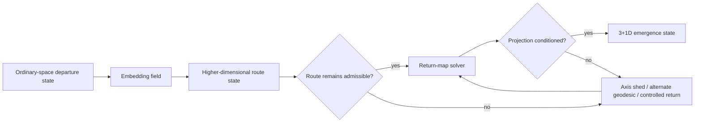
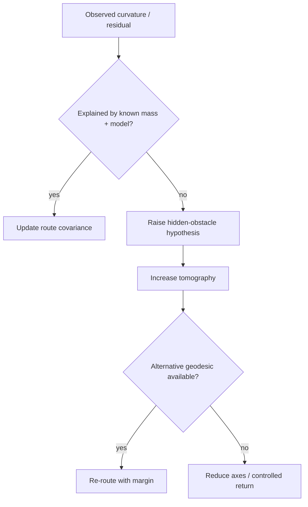

# Black Light FTL N-Dimensional Manifold Technical Volume

**Status:** canonical subordinate technical volume for the `n-manifold` transit family.  
**Primary authority:** `docs/blacklight/BLACK_LIGHT_PROPULSION_TRANSIT_AUTHORITY.md`.  
**Machine-readable companion:** `data/exo-vessel/ftl-n-manifold-technical-volume.json`.  
**Schema:** `data/schemas/exo-vessel-ftl-n-manifold-technical-volume.schema.json`.  
**Legacy design source:** Google Drive document **“The different lightspeed methods”**, file `1e0Xp71EFubBZgXWjjvPxAqPoJIZNwqS6nu1-r7Kil7Y`, revision `ANLCKQllC5h6dLaX5H1RpK8aUFVWsi-IV7gbMHUd0Qq7mIe5uGsLFi5_Hrsr8B6dl8t_ezB0fTSygxrnIBtifAHW79bgSbswp1zF3NaEil0` as reconciled for this volume.  
**Canon discipline:** recovered family action, runtime Path names, breakthroughs, utilities, limits and energy families are `CONFIRMED` within runtime scope. Mathematical realization, machinery detail, procedures and examples introduced here are `DERIVED` unless otherwise marked. Unadopted numerical coefficients are `PROPOSED`. Race ownership, inventors, manufacturers, dates and historical incidents remain `UNRESOLVED` unless a higher authority supplies them.

---

## 1. Why this family is not generic hyperspace

The N-Dimensional Manifold Drive is not a renamed jump drive, slipstream, Q-lattice translation or metric envelope. Its recovered physical action is higher-dimensional geodesic transit whose solution is projected back into ordinary 3+1-dimensional spacetime.

The engineering problem is therefore two coupled problems:

1. find and maintain a shorter admissible route through a higher-dimensional geometry; and
2. preserve a return map that places the vessel back into the intended ordinary-space state with acceptable position, orientation, structure and continuity.

A route can be exceptionally short and still be unusable because its return projection is unstable.



This distinction directly supports the original design requirement that increasingly capable transit machinery also requires increasingly capable sensing, calculation, safety and emergency de-transit systems. A more aggressive route is not useful if the vessel cannot prove where it will come back.

---

## 2. Recovered development spine

The live dimensional Path runtime establishes the following progression and must not be renamed by this volume.

| Path | Confirmed implementation | Confirmed core breakthrough | Confirmed principal limit |
|---|---|---|---|
| P0 | Dimensional Topology Observatory | Measure stable higher-dimensional curvature and move test masses through a controlled local shortcut. | Early routes are centimeters wide in solution space despite massive machinery. |
| P1 | Five-Axis Test Volume | Maintain a payload embedding across one additional spatial axis without orientation loss. | Axis inversion may return payload mirrored, rotated or structurally stressed. |
| P2 | Captive Manifold Transit Array | Create a captive manifold route returning macroscopic objects to the correct projection. | Unseen higher-dimensional obstacles remain a major source of loss. |
| P3 | Shipboard N-Manifold Drive | Carry embedding field, geodesic solver and return map aboard a vessel. | Return-map damage can emerge a ship in an inaccessible gravity well. |
| P4 | Adaptive Higher-Dimensional Drive | Solve changing multi-axis routes in real time around moving gravitational obstacles. | Every additional active dimension sharply increases computation and sensor uncertainty. |
| P5 | Deep-Range Manifold Engine | Extend sensors and predictive models beyond the direct normal-space horizon. | Normal-space neighbors can require unrelated manifold routes. |
| P6 | Compact Multi-Axis Drive | Miniaturize stabilizers while preserving identity, orientation and topology under battle damage. | Compact drives can fail by topology change rather than simply stopping. |

The recovered energy sequence is likewise retained: `fusion-bank`, `antimatter`, `vacuum-cell`, `vacuum-cell`, `q-condensate`, `q-condensate`, `q-condensate`.

The sequence is technologically intelligible as:

\[
\boxed{
\text{observe curvature}
\rightarrow
\text{preserve one added axis}
\rightarrow
\text{return macroscopic payloads}
\rightarrow
\text{carry the solution aboard}
\rightarrow
\text{adapt across multiple axes}
\rightarrow
\text{predict beyond direct horizon}
\rightarrow
\text{miniaturize without losing topology}
}
\]

The Path level is not simply a velocity rating. Each stage changes the class of mathematical problem the civilization can solve and the physical system it can reliably embody.

---

## 3. Derived mathematical foundation

### 3.1 State representation

A useful engineering state is

\[
X_N=\{\mathcal M_N,g_{AB},\Pi,R,\kappa_R,\Sigma_N,\Omega,\chi_g\}.
\]

Here:

- \(\mathcal M_N\) is the locally usable higher-dimensional manifold;
- \(g_{AB}\) is the effective metric over active coordinates;
- \(\Pi\) is the projection relation toward ordinary spacetime;
- \(R\) is the engineered return map;
- \(\kappa_R\) is return-map conditioning;
- \(\Sigma_N\) is route-state uncertainty;
- \(\Omega\) is the protected vessel volume;
- \(\chi_g\) represents gravity-conditioned embedding burden.

This is `DERIVED`, not a claim that Black Light cosmology literally uses one unique differential-geometric formalism everywhere. It is a coherent engineering model constrained by the recovered family behavior.

### 3.2 Higher-dimensional route length

For an admissible curve \(\Gamma\) through the manifold,

\[
D_N(\Gamma)=\int_\Gamma\sqrt{g_{AB}\,dX^A dX^B}.
\]

If \(D_{3+1}\) is the ordinary-space route measure, define a derived route gain

\[
G_N=\frac{D_{3+1}}{D_N}.
\]

**Important:** \(G_N\) is not a universal speed multiplier. It says the chosen admissible route is shorter in the solved manifold geometry. Transit time still depends on entry, embedding, controlled traversal, solver latency, corrections, return and recovery.

### 3.3 Route objective

A practical solver should not minimize distance alone:

\[
\Gamma^*=\arg\min_\Gamma
\int_\Gamma
\left[
 w_l
+w_\kappa C_\kappa
+w_gC_g
+w_uC_u
+w_oC_o
+w_rC_r
+w_xC_x
\right]ds_N.
\]

Where the costs represent route length, return conditioning, gravity coupling, uncertainty, hidden-obstacle risk, recovery burden and topology-change exposure.

A longer route can therefore be preferred because it has a vastly better-conditioned return map.

---

## 4. Return-map mathematics

### 4.1 The actual survival problem

The return map is schematically

\[
R:U_N\rightarrow U_{3+1}.
\]

The desired closure is

\[
R(X_{exit})=x_{target}.
\]

A weighted return residual is

\[
\epsilon_R=\|R(X_{exit})-x_{target}\|_W.
\]

The weighting \(W\) may include position, velocity, orientation, time synchronization, local gravity, clearance volume and vessel-state tolerances.

### 4.2 Conditioning

Let \(J_R\) be the local Jacobian of the return map. A derived conditioning measure is

\[
\kappa_R=\|J_R\|\,\|J_R^{-1}\|.
\]

Large \(\kappa_R\) means a small error in the manifold state can become a large ordinary-space emergence error.

That gives a formal engineering reason for the recovered P3 hazard: a ship can possess enough field authority to traverse the route and still return into an inaccessible gravity well because the return solution degraded.

```text
LOW CONDITION NUMBER
small manifold-state error
          |
          v
small emergence error

HIGH CONDITION NUMBER
small manifold-state error
          |
          v
^^^^^^^^^^^^^^^^^^^^^^^^^
large emergence error
(position / orientation / gravity / stress)
```

### 4.3 Orientation and parity

The P1 axis-inversion hazard implies that the return system must preserve more than position. A return state should carry an orientation/parity invariant, schematically

\[
\eta=\mathrm{sgn}\det(J_{orient}).
\]

A change in the sign or an unresolved parity state is not a cosmetic navigation error. It is evidence that the payload's orientation mapping may not be physically equivalent to the departure state.

This model is `DERIVED`; the existence of the inversion hazard is recovered runtime canon.

---

## 5. Why additional dimensions are expensive

The live runtime explicitly says every additional active dimension sharply increases computation and sensor uncertainty. The volume therefore forbids the generator from using “more axes” as a cost-free progression rule.

A useful conceptual burden model is

\[
C_{axis}\propto \alpha^{n_{active}},\qquad \alpha>1,
\]

with the exact coefficient and exponent `PROPOSED` until separately adopted.

More generally,

\[
\mathcal B_N=f(n_{active},N_{state},N_{obstacle},\Sigma_N,\tau_{solve},B_{control}).
\]

The engineering effect is clear even without fixing numbers:

| More active axes can improve | But can simultaneously worsen |
|---|---|
| route shortening | solver search space |
| obstacle avoidance | sensor inference uncertainty |
| available alternate geodesics | control bandwidth |
| gravity avoidance | return-map conditioning |
| route redundancy | topology classification |

A mature drive wins not by maximizing axes, but by choosing the **minimum sufficient dimensionality** for the route and current damage state.

---

## 6. Gravity interaction

The original “different lightspeed methods” source requires each transit family to have its own relationship to gravity rather than sharing one generic penalty.

For N-Manifold transit, the derived interpretation is that gravity affects:

- the local embedding geometry;
- the apparent shape and cost of candidate higher-dimensional routes;
- the return projection;
- emergence clearance and tidal stress;
- covariance when the mass environment is poorly known.

A schematic burden is

\[
C_g=f(\Phi,\nabla\Phi,H(\Phi),\Sigma_g,R).
\]

Strong gravity therefore does not simply subtract a fixed percentage from “FTL speed.” It changes the geometry being solved and can make a previously conditioned return map unsafe.

This is why a navigation update near a massive body is potentially a drive-state change rather than merely an ephemeris correction.

---

## 7. Hidden higher-dimensional obstacles

P2 canon establishes unseen higher-dimensional obstacles as a major loss source.

A useful Bayesian engineering representation is

\[
p(O_N\mid Z,H,M),
\]

where \(O_N\) is obstacle occupancy, \(Z\) is current sensor evidence, \(H\) is route history, and \(M\) is the current manifold model.

The system should not interpret “no ordinary-space object visible” as “no manifold obstacle exists.” Likewise, unexplained structured residuals are not automatically sensor noise.



A mature system treats uncertainty as a route cost before it becomes a collision.

---

## 8. Whole-vessel machinery embodiment

The N-Manifold installation resolves through the common eight-block transit machine, but with family-specific machinery.

### 8.1 Energy conditioning

The installation needs separate accounting for:

\[
P_{total}=P_{embed}+P_{hold}+P_{sense}+P_{solve}+P_{axis}+P_{struct}+P_{thermal}+P_{reserve-charge}.
\]

The recovery rule is

\[
E_{route}\le E_{stored}-E_{return}-E_{settle}-E_{margin}.
\]

Return reserve is not discretionary propulsion energy.

### 8.2 Manifold prime mover

The prime mover creates or couples the vessel to an admissible embedded state. It must expose at least:

- maximum certified active-axis count;
- local embedding authority;
- spool/acquisition state;
- sectional health;
- allowed topology class.

### 8.3 Embedding field formation

The protected vessel volume must be coherent. A useful coverage criterion is

\[
C_\Omega=\min_{x\in\Omega}c_N(x).
\]

Minimum local coverage governs safety. Average coverage can conceal one uncovered docking boom, damaged frame, radiator or external module.

### 8.4 Transit control

The controller maintains axis set, route, embedding and structural state. It must be able to shed an unsafe dimension only when a certified lower-dimensional continuation or return solution exists.

### 8.5 Navigation and sensing

The sensor system is a manifold-inference suite, not simply a telescope. It fuses ordinary-space gravimetry, local embedding response, higher-dimensional curvature measurements, route history, external references and model uncertainty.

### 8.6 Return-map system

This is a co-equal drive subsystem, not an afterthought. Above primitive captive systems, mature installations should maintain independent or at least independently checkable return solutions.

### 8.7 Whole-effect coverage

Every certified payload region must stay inside the same admissible embedding/orientation frame.

### 8.8 Control / thermal / abort backbone

The abort chain must survive plausible primary-drive faults. Common-mode damage between route control and return control is a major design defect.

```text
                     FORWARD / REMOTE MANIFOLD SENSING
                <------------------------------------>

     [T]------[T]------[T]------[T]------[T]
      |        |        |        |        |
  +=================================================+
  | E1 | E2 | E3 |       VESSEL       | E4 | E5 | E6 |
  +=================================================+
      |        |          |             |
      +--------+------ AXIS CONTROL ----+
                         |
                 MANIFOLD PRIME MOVER
                         |
                 ENERGY CONDITIONING
                         |
             +-----------+-----------+
             |                       |
       ROUTE / SOLVER          RETURN MAP A/B
             |                       |
             +-----------+-----------+
                         |
                ISOLATED RETURN RESERVE
```

---

## 9. Scaling behavior

N-Manifold scaling is non-linear because several burdens grow together:

\[
B_{scale}=f(V_\Omega,A_\Omega,L_{ship},n_{active},N_{sections},\tau_{sync},\Sigma_N,E_{return}).
\]

A larger vessel may have greater power generation but also:

- more protected volume;
- longer synchronization paths;
- more structural flexure;
- more local coverage minima;
- more state variables in the return map;
- more appendages and condition-dependent geometry;
- larger clear-emergence requirements.

A compact vessel gains short timing paths and low protected volume but loses physical separation, redundant return hardware, thermal inventory and damage tolerance.

Multiple drives do not simply add their route gain. Valid multi-drive arrangements include sectional embedding, redundant return systems, staged axis sets, alternate manifold families or coherent distributed control. Their relationship must be explicitly resolved.

---

## 10. Safety horizon

The family-specific lookahead condition is

\[
L_{N,safe}\ge v_{eff}
(t_{detect}+t_{infer}+t_{solve}+t_{command}+t_{reembed}+t_{return})
+D_{margin}.
\]

N-Manifold transit includes an **inference** term because important hazards can be higher-dimensional structures not directly represented by ordinary-space observation.

It also includes **re-embedding/return** rather than a generic “brake” term. A manifold drive may need time to reduce active dimensions, stabilize orientation and condition a return map before ordinary-space emergence is safe.

As the original design source requires, advanced transit therefore implies advanced safety machinery. A faster drive with unchanged sensing and return latency eventually outruns its own safe decision horizon.

---

## 11. Path engineering progression

### P0 — Dimensional Topology Observatory

The laboratory knows that stable higher-dimensional curvature can be measured and can move a test object through a shortcut. Most of the machinery exists because the solution cannot yet be carried.

**Derived physical picture:** monumental fixed field geometry, massive references, sparse dimensional sensors and heavily instrumented recovery volumes.

**Education threshold:** basic topology, differential geometry, precision metrology and controlled test-mass recovery.

### P1 — Five-Axis Test Volume

The key advance is not merely “five dimensions.” It is preservation of orientation across one additional spatial degree of freedom.

Engineering now requires parity monitoring, orientation frames and structural acceptance criteria for return.

### P2 — Captive Manifold Transit Array

The system can move macroscopic objects and return them correctly, but fixed infrastructure still supplies much of the sensing, route survey and destination projection reference.

The hidden-obstacle problem becomes operationally dominant because payload value and route extent are now large enough for model error to matter.

### P3 — Shipboard N-Manifold Drive

The ship carries the embedding field, solver and return map. This is the first point at which an isolated vessel can create a complete transit solution.

The return-map failure canon means navigation, field control and emergency recovery become inseparable from propulsion engineering.

### P4 — Adaptive Higher-Dimensional Drive

The controller can change route and active-axis set as obstacles and gravitational conditions evolve.

The mathematical advance is optimization under uncertainty rather than raw dimensionality.

### P5 — Deep-Range Manifold Engine

The vessel extends its model beyond what direct normal-space sensing can supply. External observatories, historical routes, gravitational inversion and long-baseline references become strategic assets.

Normal-space proximity no longer predicts route convenience. Two adjacent stars can occupy poor manifold relation while distant systems share a much simpler admissible route.

### P6 — Compact Multi-Axis Drive

Miniaturization is only successful when field authority, topology monitoring, return-state integrity and damage response are preserved.

The recovered compact failure mode is particularly important: the drive may fail by **changing topology**, not by producing less output.

That implies a mature compact drive needs rapid topology classification and health-aware axis shedding rather than only conventional overcurrent/overtemperature protection.

---

## 12. Failure anatomy

### 12.1 Axis inversion

**Recovered hazard:** mirrored, rotated or stressed return.

Derived causal chain:

```text
orientation reference drift
        -> parity ambiguity
        -> solver accepts wrong local frame
        -> return map closes position but not orientation
        -> differential structural / biological load
```

### 12.2 Return-map ill-conditioning

The ship's onboard residual can remain small while the emergence error grows because the map is amplifying uncertainty.

**Primary evidence:** rising \(\kappa_R\), disagreement between independent solutions, increasing destination covariance.

### 12.3 Hidden-manifold obstacle

The route meets a higher-dimensional obstruction absent from the ordinary-space map.

This must be distinguished from sensor malfunction. Persistent structured residuals are evidence.

### 12.4 Protected-volume fracture

One local section loses coherent embedding support. Possible outcomes include local stress, orientation discontinuity or incompatible projection state.

### 12.5 Axis-budget overrun

The route solver opens more dimensions than sensors, computers, controllers or structure can certify. Solver latency and covariance can rise faster than the route becomes shorter.

### 12.6 Gravity-conditioned return failure

The local gravity environment differs materially from the route model. The intended emergence remains mathematically defined but no longer falls inside the safe vessel envelope.

### 12.7 Topology-change failure

The drive changes connectivity class. This is not equivalent to an engine shutting off.

A naive controller that keeps sending commands for the old topology can make the event worse because those commands no longer describe the actual embedded state.

### 12.8 Recovery exhaustion

Route correction consumes the reserve required for safe return.

The prevention rule is simple: the route optimizer never owns the full energy inventory.

---

## 13. Practical equipment manual

### NM-01 — Pre-Transit Embedding and Return Certification

**Purpose:** prevent commitment to a route that is short but not safely recoverable.

1. Authenticate the route model, clock/reference state and destination data.
2. Confirm current vessel geometry, including damage, repairs, attached craft and deployables.
3. Survey minimum embedding coverage over the entire certified payload volume.
4. Compute more than one admissible route where Path capability permits.
5. Calculate return-map residual and conditioning for each route.
6. Compare ordinary-space emergence volume against gravity, occupancy and structural limits.
7. Lock return/recovery reserve so route optimization cannot consume it.
8. Verify parity and orientation references.
9. Confirm topology monitor and axis-shed paths.
10. Commit only after route, return and recovery states independently pass.

### NM-02 — Return-Map Divergence in Transit

**Indications:** independent return solutions separate; \(\kappa_R\) rises; emergence covariance grows faster than expected.

1. Freeze discretionary route-performance optimization.
2. Preserve the current valid embedding before attempting correction.
3. Compare primary and independent return solutions.
4. Check reference integrity, sensor residuals, solver state, structure and active-axis health.
5. Determine whether the event is model drift, hardware/reference failure or real topology evolution.
6. Shed an axis only when a certified lower-dimensional continuation/return solution exists.
7. Increase required emergence clearance as covariance grows.
8. Execute controlled return before the certified conditioning limit is crossed.
9. Preserve all raw state for post-transit reconstruction.

### NM-03 — Suspected Higher-Dimensional Obstacle

1. Do not discard unexplained coherent curvature as noise.
2. Raise obstacle probability and widen covariance.
3. Increase manifold tomography and cross-check external/reference data.
4. Reduce route aggressiveness.
5. Prefer a longer known geodesic over a shorter poorly observed one.
6. If no safe bypass exists, reduce axes or initiate controlled return while margin remains.

### NM-04 — Emergency Axis-Inversion Response

1. Do not command a blind return from an unresolved parity state.
2. Stabilize the surviving embedding frame.
3. Compare independent orientation/parity sensors.
4. Isolate the failing reference or sectional controller if determinable.
5. Select a return map with a certified orientation state.
6. Use an enlarged clear emergence volume.
7. Quarantine the installation after return until structural and parity metrology are complete.

### NM-05 — Topology-Change Alarm

1. Freeze commands defined only for the previous topology class.
2. Confirm the alarm using independent topology invariants where available.
3. Preserve minimum embedding support.
4. Reclassify the current connectivity state.
5. Load only a return/axis-shed solution valid for the new topology.
6. If no valid solution exists, conserve return reserve and prioritize stabilization over route completion.

---

## 14. Maintenance manual

### NM-M01 — Return-Map Certification

Inject known synthetic embedding perturbations and verify that independent solvers reconstruct the same 3+1D return state within the certified residual and conditioning envelope.

A failure here is not “software drift” by default. Inspect sensor references, model revision, field-response calibration and structural geometry before assigning cause.

### NM-M02 — Embedding Coverage Survey

Survey the ship in its **current physical configuration**. A historical as-built map is insufficient after hull repair, added armor, replaced radiators, attached cargo structures or battle damage.

### NM-M03 — Axis/Parity Metrology

Verify axis orientation, parity sensors and dimensional reference alignment against an independent standard. Coherent drift across many sections points first toward common references or models; isolated drift points more strongly toward local hardware or structure.

### NM-M04 — Tomography Residual Review

Plot predicted versus observed higher-dimensional curvature response by route segment. Structured residuals become model evidence. Do not erase them through blanket filter widening merely to keep the drive “green.”

### NM-M05 — Topology Monitor Functional Test

Exercise topology-change detection under simulated primary-controller loss. The test is passed only when the abort system identifies the changed topology and refuses stale commands.

### Return-to-service criteria

A damaged or alarmed N-Manifold installation returns to service only after:

- protected-volume coverage is re-certified;
- orientation/parity references agree;
- return-map conditioning is within limits;
- topology monitors pass;
- independent return reserve is available;
- route-model residuals have an explained disposition;
- any structural deformation used by the embedding solver is re-measured.

---

## 15. Signatures and observability

The drive should not be given arbitrary stealth simply because much of the route occupies higher-dimensional geometry.

A derived signature composition is

\[
S_N=f(E_{embed},n_{active},\dot X_N,\kappa_R,\chi_g,C_{corr},E_{return},T_{basis}).
\]

Possible observable components include:

- embedding-onset transients;
- higher-dimensional curvature coupling projected into ordinary spacetime;
- gravity-conditioned disturbances;
- active-axis correction modulation;
- power/thermal emissions;
- emergence impulse or projection ringing.

Different sensors and species may observe different subsets. Technology basis changes the carrier signature but not the underlying family action.

---

## 16. Infrastructure model

### Dimensional Topology Observatory

Improves local manifold models, obstacle priors and route covariance. It cannot prove that all unobserved structure is absent.

### Return-Reference Beacon

Provides authenticated emergence position, time and orientation data. It cannot repair a damaged shipboard return system or make occupied space safe.

### Surveyed Manifold Corridor

Provides historical route solutions and failure records. Unlike a physical lane, it does not imply the route is permanently unchanged.

### Deep-Range Tomography Array

Extends manifold inference beyond direct shipboard observation. It reduces uncertainty rather than eliminating it.

### Recovery Sanctuary

Maintains large clear emergence volumes, redundant references and rescue capability. A vessel must still possess a valid return-map family that can reach it.

Infrastructure can increase safe route availability without becoming magical infrastructure-based speed bonuses.

---

## 17. Technology-basis embodiments

The seven operative technology bases define machinery language, not race ownership.

| Basis | Derived N-Manifold embodiment | Dominant maintenance vocabulary |
|---|---|---|
| TERRESTRIAL_ELECTROMECHANICAL | precision field formers, interferometric dimensional sensors, distributed structural nodes, redundant solver hardware | alignment, clocks, buses, field sectors, reference integrity |
| AQUATIC_ELECTROCHEMICAL_HYDRAULIC | pressure-native membranes, wet electrochemical carriers, hydroacoustic orientation references, fluid-integrated field structures | chemistry, membrane continuity, pressure, cavitation, wet calibration |
| CRYOGENIC_AMMONIA_HALOCARBON | superconducting axis buses, cryogenic coherent formers, low-noise metrology volumes, quench-isolated return nodes | quench state, thermal gradient, coolant purity, coherence |
| GAS_GIANT_FLUIDIC_ELECTROSTATIC | electrostatic/plasma embedding volumes and fluidic controllers integrated with flexible aerostat structure | charge balance, plasma purity, pressure layer, flexural modes |
| BIOLOGICAL_SYMBIOTIC | cultivated field tissues, neural orientation maps, living return-state organs, regenerative coverage membranes | metabolic reserve, tissue coherence, neural latency, scar topology |
| MINERAL_PIEZOELECTRIC_PHOTONIC | coherent prestressed crystal volumes, piezoelectric excitation, photonic metrology, defect-coded return reference | domain coherence, defect map, prestress, optical purity |
| FIELD_MEDIATED_POSTMATERIAL | distributed field nodes carrying authenticated executable topology and return state | coherence graph, consensus, proof integrity, reconstruction reserve |

A biological implementation does not prove that any named biological species possesses N-Manifold transit. The generator must retain the ownership field as `UNRESOLVED` unless recovered canon says otherwise.

---

## 18. Educational text — undergraduate level

### Lesson: Why a shortcut is not enough

Imagine drawing two points on a sheet of paper. The shortest route on the sheet may be long. If the sheet is folded through a third dimension, those points can become closer without either point moving much along the original surface.

The N-Manifold family generalizes that intuition, but a starship creates a harder problem. The vessel is not a mathematical point. It has volume, orientation, internal structure, moving crew, fields and a required destination state.

The drive therefore has to answer three questions:

1. Is there a shorter admissible route?
2. Can the complete vessel remain coherently embedded while following it?
3. Can the vessel be returned to ordinary spacetime in the correct place, orientation and condition?

A student who answers only the first question has not solved a starship transit problem.

### Exercise

Two candidate routes have the following qualitative properties:

| Route | Manifold length | Return conditioning | Obstacle uncertainty |
|---|---:|---:|---:|
| A | very short | poor | high |
| B | moderately short | strong | low |

Explain why a mature operational drive may select B even when A has a much larger theoretical route gain.

**Expected reasoning:** operational performance includes return and survival, not distance alone.

---

## 19. Advanced engineering lecture — receding-horizon manifold navigation

An operational P4+ drive should be modeled as a repeated constrained optimization rather than a single departure calculation.

At control cycle \(k\):

1. estimate manifold state \(\hat X_{N,k}\) and covariance \(\Sigma_{N,k}\);
2. enumerate admissible active-axis sets;
3. generate candidate geodesic segments;
4. propagate return-map conditioning for each candidate;
5. reject candidates violating coverage, obstacle, structural or recovery constraints;
6. rank the survivors;
7. execute only the first bounded control segment;
8. sense again and re-solve.

Schematically,

\[
u_k^*=\arg\min_{u_{k:k+H}}J(X_N,u)
\]

subject to

\[
C_\Omega>C_{min},\quad
\kappa_R<\kappa_{max},\quad
P(O_N)<P_{max},\quad
E_{return}>E_{min}.
\]

The exact thresholds are installation-specific and remain `PROPOSED` unless adopted elsewhere.

The practical virtue of receding-horizon control is that P4–P6 systems do not have to pretend the manifold is perfectly known for an entire strategic journey. They continuously revise the route while preserving a safe return envelope.

---

## 20. Research/thesis directions

These are `PROPOSED` research programs, not historical canon.

### Thesis A — Return-map conditioning under evolving gravitational fields

**Question:** how rapidly does return covariance grow when the local mass model changes during a multi-axis route?

**Deliverable:** a bounded estimator relating gravimetric uncertainty to emergence-volume requirements.

### Thesis B — Minimum sufficient dimensionality

**Question:** when does opening another active dimension reduce total mission risk, and when does it merely increase solver and sensor burden?

**Deliverable:** a decision rule balancing route gain against dimensional-control cost.

### Thesis C — Hidden-obstacle inference from structured residuals

**Question:** can repeated unexplained embedding residuals distinguish true higher-dimensional obstacles from sensor/model defects?

**Deliverable:** falsifiable classifier with explicit false-positive and false-negative accounting.

### Thesis D — Damage-tolerant topology classification

**Question:** how can compact P6 machinery identify a connectivity-class change after battle damage using minimum surviving sensors?

**Deliverable:** degraded-mode topology monitor and authenticated emergency return logic.

---

## 21. Patent-style incremental invention records

These are `DERIVED` patent classes with inventor, civilization, institution and date intentionally `UNRESOLVED`.

### Patent Class NM-PAT-01 — Parity-Preserving Return Frame

**Problem:** early five-axis payloads returned with orientation inversion.

**Mathematical advance:** explicitly track parity/orientation invariants through the return Jacobian.

**Physical enabler:** redundant orientation references and sectional embedding sensors.

**Changed limit:** reduces axis-inversion risk.

**Attribution:** `UNRESOLVED`.

### Patent Class NM-PAT-02 — Condition-Number-Gated Commit Solver

**Problem:** short routes could hide catastrophically unstable return projections.

**Advance:** route commit is rejected when predicted return conditioning exceeds the certified envelope.

**Physical enabler:** faster solvers and independent return-map computation.

**Changed limit:** allows safer exploitation of complex routes without pretending all solutions are equally recoverable.

**Attribution:** `UNRESOLVED`.

### Patent Class NM-PAT-03 — Health-Aware Axis Shedding

**Problem:** damaged multi-axis systems attempted to maintain an axis set they could no longer observe or control.

**Advance:** degrade to a lower-dimensional certified solution while preserving return-map continuity.

**Physical enabler:** sectional field nodes, topology monitors and independent reserve.

**Attribution:** `UNRESOLVED`.

---

## 22. Training accident — clearly PROPOSED

**Status:** `PROPOSED TRAINING CASE`, not a historical Black Light event.

A P4 training vessel selects a five-axis route whose distance solution is excellent. One long-baseline manifold sensor begins producing a small coherent bias. The route solver treats the bias as local calibration drift and continues opening the fifth axis because the calculated route gain remains favorable.

The more important signal is not route length. Independent return solutions begin separating. The conditioning estimate rises while the obstacle posterior develops a structured residual ahead of the vessel.

A poor crew response is to increase field authority and continue because the route itself is still mathematically short.

The correct response is to freeze discretionary optimization, reclassify the residual as a possible higher-dimensional obstacle, compare references, and shed the fifth axis if a conditioned four-axis continuation exists. If it does not, the ship returns while its return-map margin remains adequate.

The training objective is to teach that **more field power cannot repair an epistemic failure in the route model**.

---

## 23. Generator/API contract

A resolved N-Manifold installation should expose at least:

```json
{
  "family": "n-manifold",
  "path": "P4",
  "sharedTier": "T4",
  "implementation": "Adaptive Higher-Dimensional Drive",
  "technologyBasis": "MINERAL_PIEZOELECTRIC_PHOTONIC",
  "activeAxisBudget": {
    "certified": 4,
    "current": 3
  },
  "route": {
    "class": "adaptive-multi-axis",
    "distanceStatus": "DERIVED",
    "uncertaintyStatus": "DERIVED"
  },
  "returnMap": {
    "conditioningStatus": "DERIVED",
    "primaryHealthy": true,
    "independentCrosscheck": true
  },
  "recoveryReserve": {
    "protected": true
  },
  "provenance": {
    "family": "CONFIRMED",
    "implementation": "CONFIRMED",
    "technologyBasisEmbodiment": "DERIVED",
    "raceOwnership": "UNRESOLVED"
  }
}
```

### Required generator inputs

- family and Path;
- shared T-tier where applicable;
- vessel geometry and condition;
- technology basis;
- species/organization/manufacturer authority snapshot;
- power and reserve state;
- gravity/environment model;
- available manifold survey/reference data;
- mission and route intent;
- deterministic seed/provenance snapshot.

### Required generator outputs

- recovered implementation name;
- active-axis budget;
- route class;
- machinery embodiment;
- return-map architecture;
- sensor/navigation model;
- power/recovery model;
- scaling behavior;
- failure envelope;
- maintenance doctrine;
- infrastructure dependencies;
- signatures;
- field-level provenance.

---

## 24. Hard canon safeguards

The resolver must not:

1. infer manifold adjacency from ordinary-space proximity;
2. replace recovered P0–P6 implementation names or runtime breakthroughs;
3. interpret route gain as a universal speed multiplier;
4. average away local protected-volume coverage holes;
5. spend certified return reserve to improve route performance;
6. silently interpret a topology-change failure as ordinary shutdown;
7. infer race ownership or invention from technology basis;
8. convert a `DERIVED` equation into `CONFIRMED` physics through repetition;
9. invent numerical thresholds and present them as setting constants;
10. normalize higher-authority named canon merely because the current runtime cannot represent it;
11. turn a proposed training incident into setting history;
12. claim that advanced sensors make transit perfectly safe.

The final safeguard is inherited directly in spirit from the legacy design source: safety margins can become larger and more sophisticated, but no interlock is perfect.

---

## 25. Provenance and origin map

| Claim | Status | Origin |
|---|---|---|
| N-Dimensional Manifold Drive family and physical action | CONFIRMED | consolidated propulsion/transit authority and recovered archive |
| P0–P6 implementation names | CONFIRMED | live `blacklight-exo-ftl-path-level-paths-dimensional.js` runtime |
| P0–P6 breakthroughs, utilities, limits and energy families | CONFIRMED within runtime scope | same live runtime |
| family-specific gravity/safety requirements | MIXED | legacy “different lightspeed methods” requirement plus derived N-Manifold realization |
| return-map conditioning mathematics | DERIVED | engineering formalization constrained by recovered return-map hazards |
| active-axis burden model | MIXED | runtime confirms rapidly increasing computation/uncertainty; exact mathematical scaling is derived/proposed |
| machinery block details | DERIVED | common eight-block transit authority specialized to N-Manifold action |
| technology-basis embodiments | DERIVED | root operative technology authority and basis registry |
| named race/manufacturer possession | UNRESOLVED unless separately sourced | deliberately not inferred |
| patent inventor/date/institution | UNRESOLVED | deliberately not invented |
| training accident | PROPOSED | educational exemplar only |

---

## 26. Engineering comparison chart

| Engineering question | N-Manifold answer |
|---|---|
| What is manipulated? | admissible higher-dimensional embedding and geodesic route |
| What makes transit useful? | shorter valid manifold path with a stable return projection |
| What is the dominant mathematical danger? | poorly conditioned or topologically invalid return map |
| What is the characteristic navigation danger? | unseen higher-dimensional obstacle / model uncertainty |
| What is the characteristic orientation danger? | axis/parity inversion |
| What limits “more dimensions”? | computation, sensing uncertainty, control bandwidth and topology complexity |
| What does gravity do? | alters embedding/route/return geometry rather than applying one generic speed penalty |
| What does mature infrastructure add? | better tomography, references, route history and recovery volumes |
| What can infrastructure not do? | guarantee a safe route or replace shipboard embedding/return authority |
| What is the P6-specific failure warning? | topology can change instead of the drive simply stopping |

---

## 27. Compact operator doctrine

The N-Manifold operator should remember four rules:

**A shorter route is not automatically a safer route.**

**The return map is part of the drive, not navigation paperwork.**

**More active dimensions are resources with costs, not free performance.**

**An unexplained coherent residual is evidence until proven otherwise.**

That doctrine preserves the family as a distinct engineering system and keeps future generator output aligned with the project’s established canon rather than generic science-fiction vocabulary.
