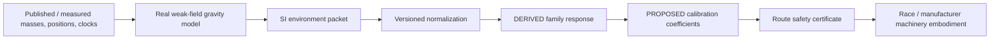
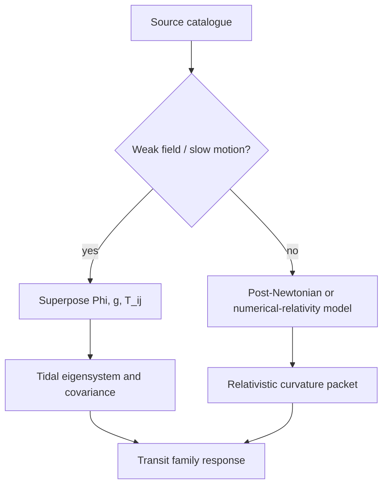

# Black Light FTL Physical Gravity & Curvature Environment Manual

**Status:** `MIXED` — real-physics environmental mathematics plus explicitly `DERIVED` Black Light transit interpretation.  
**Authority:** subordinate to named race/vessel/manufacturer/installation canon and `BLACK_LIGHT_PROPULSION_TRANSIT_AUTHORITY.md`.  
**Design-intent source:** *The different lightspeed methods*, document `1e0Xp71EFubBZgXWjjvPxAqPoJIZNwqS6nu1-r7Kil7Y`, revision `ANLCKQllC5h6dLaX5H1RpK8aUFVWsi-IV7gbMHUd0Qq7mIe5uGsLFi5_Hrsr8B6dl8t_ezB0fTSygxrnIBtifAHW79bgSbswp1zF3NaEil0`.  
**Purpose:** make the gravity/curvature half of Black Light transit engineering dimensionally honest before fictional family-specific coupling, calibration, route certification, machinery embodiment, or gameplay limits are applied.

---

## 1. The boundary this manual protects

The setting requires different transit methods to respond differently to gravity wells, gravitational shear, prediction error, route forks, and imperfect safety systems. That design requirement is confirmed by the source document. What is **not** confirmed is a real-world FTL mechanism, a universal exotic-energy law, or a set of physical constants telling us how an invented drive couples to curvature.

The engineering chain is therefore deliberately split:



The left side can use ordinary physics. The right side is fictional engineering constrained by canon.

> **A physically correct gravity calculation does not make the FTL operator physically demonstrated.**

Likewise:

> **A fictional transit penalty may be internally rigorous without being a law of nature.**

This distinction lets Black Light be mathematically serious without pretending we discovered warp drive by writing a convincing spreadsheet.

---

## 2. Units first: quantities that must not be blended raw

| Quantity | Symbol | SI unit | Meaning |
|---|---:|---:|---|
| gravitational potential difference | `Delta Phi` | m^2 s^-2 | potential-energy change per unit mass in a declared weak-field model |
| dimensionless potential depth | `epsilon_Phi` | 1 | `|Delta Phi| / c^2` |
| coordinate gravitational acceleration | `g` | m s^-2 | local acceleration field in the chosen weak-field frame |
| tidal tensor | `T_ij` | s^-2 | spatial derivative structure of differential gravity |
| tidal eigenvalue | `lambda_i` | s^-2 | stretching/compression rate coefficient along a principal direction |
| Schwarzschild radius | `r_s` | m | compactness reference `2GM/c^2` |
| Kretschmann scalar | `K` | m^-4 | invariant curvature magnitude for the Schwarzschild vacuum solution |
| frame-dragging precession | `Omega_LT` | rad s^-1 | weak-field rotational spacetime precession estimate |
| covariance | `Sigma` | quantity-dependent | uncertainty and correlation of measured/modelled state |

A safety model may eventually combine these into a dimensionless severity score, but it may **not** perform nonsense such as:

\[
G_{bad}=|\Phi|+|\mathbf g|+\|T\|+\sqrt K.
\]

Those terms have different units. The legal structure is instead:

\[
G_{norm}=w_\Phi\frac{|\Delta\Phi|}{\Phi_{ref}}
+w_g\frac{|\mathbf g|}{g_{ref}}
+w_T\frac{\|T\|}{T_{ref}}
+w_R\frac{R_*}{R_{ref}}
+w_U U_m,
\]

where each reference scale is explicit and versioned. The weights and reference scales are **calibration**, not fundamental constants.

This is the required handoff into the existing Black Light family penalty model:

\[
P_f=a_fG_{norm}+b_fG_{norm}^2+c_fG_{norm}^{n_f}+d_fU_m+e_fB_f,
\]

\[
\eta_{g,f}=e^{-P_f}.
\]

The first equation in this section is physically dimensionally valid. The second pair is `DERIVED/PROPOSED` Black Light operator modelling.

---

## 3. Newtonian potential — useful, but reference-dependent

For sufficiently weak fields and slow-moving sources, the point-source potential is

\[
\Phi(\mathbf x)=-\sum_a\frac{GM_a}{r_a},
\qquad
r_a=\|\mathbf x-\mathbf x_a\|.
\]

The zero of Newtonian potential is conventional. For an isolated point-source model, zero at infinity is convenient. For route engineering inside a multi-body system, the more useful quantity is often a potential **difference** relative to the departure reference, barycentric reference, or surveyed route node:

\[
\Delta\Phi=\Phi(\mathbf x)-\Phi(\mathbf x_{ref}).
\]

The dimensionless weak-field scale is

\[
\epsilon_\Phi=\frac{|\Delta\Phi|}{c^2}.
\]

`epsilon_Phi << 1` is one indicator that a weak-field treatment is sensible. It is not the only validity condition.

### 3.1 Why potential matters to transit engineering

Potential affects clock-rate comparisons and energy accounting in ordinary physics. In Black Light it may additionally enter a family response **only because the family model says so**. Metric systems, Q-address systems, fold endpoint solutions, phase-reference systems, and manifold return maps can therefore care about potential for different reasons.

The generator must record the reference used. An unreferenced statement such as “potential = 9e8” is incomplete engineering.

---

## 4. Acceleration is not tide

The weak-field acceleration from point sources is

\[
\mathbf g(\mathbf x)
=-\sum_a GM_a\frac{\mathbf x-\mathbf x_a}{r_a^3}.
\]

This is a coordinate-frame quantity. A freely falling ship can have zero accelerometer reading—zero **proper acceleration**—while still moving through a nonzero gravitational field and experiencing tidal effects.

That distinction matters enormously for Black Light.

A drive should never conclude:

> “crew accelerometers read zero, therefore gravitational danger is zero.”

The crew can be locally weightless while the hull spans a substantial tidal gradient.

---

## 5. Tidal tensor: the relevant local differential gravity

For point masses in the Newtonian weak-field approximation,

\[
T_{ij}
=\sum_a\frac{GM_a}{r_a^3}
\left(3n_i n_j-\delta_{ij}\right),
\]

where

\[
\mathbf n_a=\frac{\mathbf x-\mathbf x_a}{r_a}.
\]

The tensor's eigenvectors give local principal stretching/compression directions. Its eigenvalues quantify the corresponding differential-acceleration coefficients.

A convenient engineering norm is

\[
\|T\|_F=\sqrt{\sum_{ij}T_{ij}^2}.
\]

This norm is useful in a declared local orthonormal frame, but it is not a replacement for a four-dimensional curvature invariant.

### 5.1 Hull-scale differential acceleration

For a small baseline vector `xi`,

\[
\Delta\mathbf a\approx T\,\boldsymbol\xi.
\]

Consequently the characteristic differential acceleration across a vessel of scale `L` is approximately

\[
\Delta a\sim \|T\|L.
\]

A crude structural stress scaling for a uniform member is therefore of order

\[
\sigma_{tidal}\sim \rho\,\|T\|L^2,
\]

where `rho` is an effective structural density. This is a **scaling estimate**, not a substitute for finite-element analysis or an actual load path.

It does, however, capture an important consequence: doubling a vehicle's span can quadruple a tide-driven stress scale even when its drive power is unchanged.

---

## 6. General relativity: geodesic deviation is the deeper statement

Newtonian tides are the weak-field limit of spacetime curvature acting on nearby free-fall trajectories. In general relativity,

\[
\frac{D^2\xi^\mu}{D\tau^2}
=-R^\mu{}_{\nu\alpha\beta}
 u^\nu\xi^\alpha u^\beta.
\]

Here `xi` separates neighboring worldlines, `u` is four-velocity, and `R` is the Riemann curvature tensor.

This is why “gravity” cannot be reduced to one scalar acceleration number. A transit technology that changes or depends on geometry must care about the spatial and temporal structure of curvature, not merely surface-g equivalents.

Black Light's family-specific operators remain fictional. But using curvature, covariance, and geodesic concepts as the environmental boundary is much more physically coherent than assigning arbitrary “gravity points.”

---

## 7. Compactness and the Schwarzschild reference

For a spherical nonrotating mass, the Schwarzschild radius is

\[
r_s=\frac{2GM}{c^2}.
\]

The ratio

\[
\mathcal C^{-1}=\frac r{r_s}
\]

is a useful compactness diagnostic.

Large `r/r_s` generally indicates a weak compactness regime. As `r/r_s` approaches unity, the point-mass Newtonian approximation is no longer an acceptable transit-certification model.

Black Light must not “fix” this by increasing a generic gravity penalty coefficient. The model itself has left its domain of validity.

The correct status is:

`OUTSIDE_MODEL_VALIDITY`

followed by a relativistic field model or route rejection.

---

## 8. Schwarzschild curvature and what may not be summed

For a single Schwarzschild vacuum source, the Kretschmann scalar is

\[
K=R_{\alpha\beta\gamma\delta}R^{\alpha\beta\gamma\delta}
=\frac{48G^2M^2}{c^4r^6}.
\]

Its units are `m^-4`.

The runtime also exposes

\[
R_*=\sqrt K,
\]

with units `m^-2`, as a convenient curvature scale.

However:

\[
K_{multi}\ne\sum_aK_a
\]

in general.

Exact spacetime curvature is nonlinear. The weak-field runtime therefore reports the **maximum individual Schwarzschild-reference K** among sources as a diagnostic. It does not claim that value is the exact multi-body invariant.

This safeguard is particularly important around binaries and compact multiple systems, exactly the environments where the source document expects route safety to become difficult.

---

## 9. Rotating sources and frame dragging

When angular momentum `J` is actually known, a weak-field gyroscope precession estimate is

\[
\boldsymbol\Omega_{LT}
=\frac{G}{c^2r^3}
\left[3\mathbf n(\mathbf J\cdot\mathbf n)-\mathbf J\right].
\]

This is the vector used by the physical environment runtime.

It is optional for a reason. Mass does not determine angular momentum. A missing spin measurement is not permission to invent one.

Thus:

\[
J\;\text{unknown}\Rightarrow\Omega_{LT}\;\text{unresolved},
\]

not zero.

This distinction becomes relevant to high-precision metric, gravitic-plane, clock-reference, and endpoint systems near rapidly rotating bodies.

---

## 10. What can be superposed in the weak-field model

Within the Newtonian weak-field approximation, it is legitimate to add point-source contributions to:

- potential;
- acceleration;
- the Newtonian tidal tensor.

This is because those equations are linear in the potential in that approximation.

It is **not** legitimate to linearly add exact GR curvature invariants and present the result as the exact multi-body spacetime.



---

## 11. Worked physical scale examples

These examples are ordinary physics reference calculations, not FTL limits.

### 11.1 Earth surface reference

Using `M_E = 5.9722e24 kg` and `R_E = 6.371e6 m`:

- `|Phi| ~= 6.2565e7 m^2 s^-2`;
- `epsilon_Phi ~= 6.96e-10`;
- `|g| ~= 9.82 m s^-2`;
- `GM/R^3 ~= 1.54e-6 s^-2`;
- `r_s ~= 8.87e-3 m`;
- `R_E/r_s ~= 7.18e8`;
- Schwarzschild-reference `K ~= 1.41e-44 m^-4`.

A person standing on Earth feels roughly 1 g because the ground supplies proper acceleration. An orbiting person nearby may feel essentially zero proper acceleration while remaining inside nearly the same potential field. This is precisely why the transit model stores potential, acceleration and tides separately.

### 11.2 Solar field at 1 AU

Using `M_Sun = 1.98847e30 kg` and `r = 1 AU = 149597870700 m`:

- `|Phi| ~= 8.8715e8 m^2 s^-2`;
- `epsilon_Phi ~= 9.87e-9`;
- `|g| ~= 5.93e-3 m s^-2`;
- `GM/r^3 ~= 3.96e-14 s^-2`;
- `r_s ~= 2.953 km`;
- `r/r_s ~= 5.07e7`;
- Schwarzschild-reference `K ~= 9.34e-60 m^-4`.

Although the Sun's potential contribution at Earth is deeper in magnitude than Earth's surface potential contribution, its local acceleration and tidal scale at 1 AU are very different. Any model that collapses all three into “gravity strength” before normalization discards useful physics.

---

## 12. The gravitational-plane fork problem

The source document explicitly establishes catastrophic forks in gravitational-shear-plane transit. Ordinary physics does not contain literal FTL lanes, so the lane itself remains fictional. The **environmental geometry used to detect a dangerous change** can nevertheless be physically grounded.

For the gravitic-plane family, define the local tidal eigensystem:

\[
T\mathbf e_i=\lambda_i\mathbf e_i.
\]

The derived route solver can examine:

- eigenvector rotation along the predicted path;
- changes in eigenvalue ordering;
- nearby saddle regions of the multi-body potential;
- divergence between competing route minima;
- covariance of hidden or poorly measured masses;
- time dependence caused by orbital motion.

A useful `DERIVED` branch-instability indicator can be built from the angle between competing route directions and their cost separation, but it must never be described as a known law of nature.

The physical statement is simply that a multi-body gravitational field can have changing saddle/eigenstructure. The fictional statement is that the drive couples strongly enough to that structure for a route bifurcation to destroy the ship.

---

## 13. Uncertainty belongs beside the field, not after it

If source masses and positions are uncertain, then the environment is uncertain.

For state vector `x` and derived environmental vector `y=f(x)`, the local covariance approximation is

\[
\Sigma_y\approx J_f\Sigma_xJ_f^T+\Sigma_{model}.
\]

The covariance should preserve correlations. Three displays derived from the same ephemeris database are not three independent measurements.

The Black Light safety layer already distinguishes mass-model, ephemeris, clock, sensor, registration, model, and common-cause covariance. The physical packet exists to give those uncertainties dimensionally meaningful quantities to act upon.

Missing uncertainty remains `null/UNRESOLVED`, never numerical zero.

---

## 14. Family-by-family physical handoff

| Family | Ordinary-physics environmental inputs | Fictional/derived coupling |
|---|---|---|
| Metric Compression | curvature, tidal tensor, clocks, moving masses | how the controlled metric envelope responds and what stress-energy is required |
| Gravitational-Plane | potential topology, tidal eigensystem, saddles, mass covariance | lane/plane coupling, fork thresholds, decoupling mechanics |
| Slipstream Shear | normal-space gravity, clocks, route ephemerides | Q-boundary correspondence and adhesion |
| Q-Lattice | clocks, ephemerides, endpoint covariance | Q-address lattice and phase translation |
| N-Manifold | ordinary curvature and endpoint geometry | higher-dimensional embedding and return map |
| Fold-Jump | endpoint curvature/tides, occupancy, clocks | temporary topological adjacency |
| Wormhole/Gate | external tides, mouth motion, clocks, mass flux | traversable throat support and exotic stabilization |
| Phase Displacement | target environment, clocks, occupancy, covariance | macroscopic compatible-state displacement |
| Inertial Torch | trajectory, proper acceleration, radiation, collision horizon | none required for ordinary propulsion; this remains the causal reference family |

No generic environmental model is permitted to assign a named race one of these families.

---

## 15. Power and “exponential gravity cost”

The source design intent says the burden rises sharply near strong gravity. That is useful setting doctrine but should not be misrepresented as a known universal FTL energy equation.

The physically accurate approach is:

1. compute the ordinary environment packet;
2. establish whether the approximation itself remains valid;
3. normalize physically unlike terms;
4. apply the chosen fictional family response;
5. calibrate the response with a versioned profile;
6. reject the route if the required burden, error, sensing or recovery envelope fails.

A convenient Black Light response may be exponential,

\[
\eta_{g,f}=e^{-P_f},
\]

but `P_f` is a **derived family model**, not Einstein's field equations.

This manual explicitly forbids prose such as “general relativity proves the drive needs exponentially more power near a star.” General relativity does not prove the fictional drive exists.

---

## 16. Navigation and timing infrastructure

A physically serious transit civilization requires more than an engine.

Minimum infrastructure can include:

- high-quality ephemerides;
- independent mass estimates;
- long-baseline gravimetry;
- precision clock networks;
- inertial reference systems;
- interferometric baseline metrology;
- moving-body prediction;
- occultation and ranging networks;
- local probe constellations;
- covariance-aware route archives;
- independent hazard channels;
- historical model residuals.

A more advanced transit culture can gain enormous practical capability through **better knowledge of the environment** even if its prime mover is unchanged.

This directly satisfies the source document's requirement that advanced safety systems see far enough ahead to protect increasingly capable drives.

---

## 17. Signature and sensor separation

Gravity is not magnetism. Curvature is not plasma density. A strong magnetic field does not automatically mean strong spacetime curvature, and a high-density plasma does not become “gravity interference” merely because it is dangerous to the ship.

The environment dossier should therefore keep separate channels for:

\[
\mathbf E=
[
\Phi,\mathbf g,T,R,
\mathbf B,\mathbf E_{em},n_e,T_{plasma},
F_{rad},\rho_{dust},\ldots
]^T.
\]

A family may depend on several channels simultaneously. The generator must preserve their origin and units until a declared response model combines them.

This makes race-specific sensing meaningful. A species may sense pressure, ion current, vibration, light, neural field proxies or direct gravimetry differently while still observing the same underlying physical hazards.

---

## 18. Maintenance consequences

A transit navigation system can be mechanically healthy and still be uncertifiable because its metrology is stale.

Maintenance therefore includes:

- baseline geometry survey;
- clock calibration;
- sensor bias characterization;
- ephemeris validity;
- reference-frame registration;
- thermal deformation correction;
- mass-map update after cargo or damage;
- covariance review;
- independent-channel ancestry audit;
- recovery-system proof testing.

The operative rule remains:

\[
\boxed{\text{powered}\ne\text{calibrated}\ne\text{certified}.}
\]

Repairing a sensor does not prove its old calibration remains valid.

---

## 19. Practical Equipment Procedure PGC-01 — Source and frame audit

**Objective:** establish what gravitational model is actually being solved.

1. Identify the coordinate/reference frame.
2. Record every mass source used by the solver.
3. Record the provenance and epoch of each mass and position.
4. Record source velocities when slow-motion validity must be proven.
5. Record physical radii for point-mass exterior validity.
6. Record angular momentum only when measured or authoritatively modelled.
7. Identify the potential reference convention.
8. Reject any source silently defaulted from unknown to zero.

**Pass condition:** the environment can be regenerated from the same source epoch and reference definition.

---

## 20. PGC-02 — SI environment packet acquisition

**Objective:** calculate the ordinary weak-field quantities before fictional coupling.

Generate:

- `potentialM2PerS2`;
- `accelerationMPerS2`;
- `accelerationMagnitudeMPerS2`;
- `tidalTensorPerS2`;
- principal tidal eigenvalues;
- `tidalFrobeniusPerS2`;
- `minimumSchwarzschildRadiusRatio`;
- maximum single-source Schwarzschild-reference Kretschmann value;
- dimensionless potential depth;
- optional frame-dragging vector.

Do not normalize them yet. Preserve SI values and provenance.

---

## 21. PGC-03 — Tidal eigensystem route survey

**Objective:** map differential-gravity geometry relevant to long vehicles and gravitic-plane hypotheses.

1. Sample the tidal tensor along the candidate route.
2. Diagonalize it at every sample.
3. Track eigenvalue ordering and eigenvector rotation.
4. Record saddle regions and high-gradient transitions.
5. Propagate mass/ephemeris covariance.
6. Identify locations where route alternatives become statistically indistinguishable.
7. Export the result as environment evidence, not as proof of an FTL lane.

A “fork” is only promoted to a family-specific hazard after the transit-family resolver makes that derived interpretation.

---

## 22. PGC-04 — Model validity audit

**Objective:** refuse false precision.

Check:

\[
\epsilon_\Phi=|\Delta\Phi|/c^2,
\]

source compactness `r/r_s`, source motion `v/c`, and point-mass exterior validity.

If a required validity condition fails, the correct action is not to tune a coefficient until the route looks reasonable. Escalate to post-Newtonian or numerical-relativity treatment, or reject the route.

---

## 23. PGC-05 — Rotating-source supplement

**Objective:** include frame dragging only when the source record supports it.

1. Obtain source angular momentum and provenance.
2. Compute the weak-field precession vector.
3. Compare it against clock/reference and navigation sensitivity.
4. Carry its uncertainty.
5. If `J` is unknown, report frame dragging as unresolved.

Never estimate `J` from mass alone merely to fill a display field.

---

## 24. PGC-06 — Covariance and ancestry audit

**Objective:** prevent duplicated data from masquerading as redundancy.

Trace each environmental term to its measurements and model roots. Mark shared roots. If two gravimeters consume the same failed clock, or three route products descend from one stale mass catalogue, treat that as common-cause ancestry.

The effective information count is not the number of screens.

---

## 25. PGC-07 — Transit-family handoff

**Objective:** cross from real environment physics into fictional drive engineering without losing the boundary.

The handoff packet must contain:

- SI environmental values;
- validity status;
- covariance/uncertainty;
- source epoch;
- reference-frame identity;
- family requested by upstream authority;
- calibration profile identity;
- a statement that family response is `DERIVED/PROPOSED` unless named canon says otherwise.

If the family itself is unresolved, environment calculations do not resolve it.

---

## 26. PGC-08 — Recertification after environmental change

Recertify after material changes to:

- stellar or planetary ephemeris epoch;
- newly detected massive bodies;
- binary orbital solution;
- compact-object mass/spin model;
- local debris mass model when significant;
- clock/reference architecture;
- sensor calibration;
- route geometry;
- drive installation geometry;
- protected recovery system.

A previous certificate is historical evidence. It is not a timeless property of the route.

---

## 27. Technician educational text: three mistakes to eliminate

### Mistake 1: “Zero-g means no gravity.”

No. Free fall produces near-zero proper acceleration. Tides and potential remain.

### Mistake 2: “A big g number means big curvature.”

Not necessarily. Uniform acceleration fields and tidal curvature are different concepts. The scale and geometry matter.

### Mistake 3: “The computer returned twelve decimals, therefore the route is precise.”

No. Numerical precision is not epistemic certainty. If masses, ephemerides, clocks or model assumptions are uncertain, the output must carry that uncertainty.

---

## 28. Transit Environment Physics 201 — instructional sequence

A basic Black Light engineering course should cover:

1. SI units and dimensional analysis;
2. Newtonian potential and acceleration;
3. multi-body reference frames;
4. tidal tensors and eigenvectors;
5. orbital ephemerides;
6. covariance and uncertainty propagation;
7. compactness and weak-field validity;
8. introductory relativity and geodesic deviation;
9. timing networks;
10. transition from physical environment to fictional operator models.

Students should be required to identify which equations are real physics and which are setting models on every examination.

---

## 29. Transit Environment Physics 701 — advanced program

Graduate work should include:

- post-Newtonian multi-body navigation;
- relativistic time-transfer networks;
- numerical curvature estimation;
- uncertainty-aware tidal eigensystems;
- hidden-mass inference;
- gravitational-wave/background perturbation filtering;
- route receding-horizon estimation;
- common-cause sensor analysis;
- field-model validity diagnostics;
- cross-family environmental response identification.

No thesis earns credibility by hiding an invented operator behind real tensor notation.

---

## 30. Research and thesis directions

Useful in-universe research programs include:

**Tidal Fork Prediction Under Ephemeris Uncertainty** — determine when changing multi-body eigensystems become ambiguous enough to invalidate a gravitic-plane route hypothesis.

**Reference-Frame Robust Transit Certification** — derive certificates that remain valid under controlled frame transformations and explicit potential-reference changes.

**Compact-Object Transit Exclusion Surfaces** — replace generic “too close to a black hole” language with family-specific admissibility surfaces generated from relativistic environment models.

**Clock-Network Failure Ancestry in Nonlocal Transit** — quantify how common timing roots contaminate apparently independent Q-lattice, fold, gate and displacement navigation channels.

**Extended-Body Multipole Transit Mapping** — replace point-mass planets/stars with measured `J2`, multipoles and rotating-body models where route precision warrants them.

---

## 31. Proposed patent-class developments

The following are `PROPOSED` in-universe developments, not canon facts.

**Tensor Ancestry Recorder** — binds every displayed tidal/curvature result to the exact mass, ephemeris, clock and sensor roots that produced it.

**Compactness Refusal Interlock** — refuses a weak-field route solve when source compactness or exterior-model assumptions fail rather than extrapolating a calibrated severity curve into nonsense.

**Eigenbranch Predictive Interferometer** — fuses independent gravimetric baselines to forecast rapid rotation or near-degeneracy of a route-relevant tidal eigensystem.

**Reference-Potential Provenance Capsule** — records the zero/reference convention used by every potential-dependent route calculation so two cultures cannot accidentally compare differently referenced potentials as though they were identical measurements.

**Relativistic Model Escalator** — automatically promotes a route from Newtonian to post-Newtonian or numerical-relativity treatment when predefined validity diagnostics are exceeded.

---

## 32. API contract

The executable resolver is:

`BlacklightExoFTLCurvatureEnvironment.resolveFTLCurvatureEnvironment(context)`

Minimum useful input:

```json
{
  "referenceFrame": "system barycentric weak-field frame",
  "fieldPoint": {"x": 0, "y": 0, "z": 0},
  "sources": [
    {
      "sourceId": "primary",
      "massKg": 1.98847e30,
      "positionM": {"x": -149597870700, "y": 0, "z": 0},
      "physicalRadiusM": 695700000,
      "provenanceStatus": "CONFIRMED"
    }
  ]
}
```

Outputs preserve:

- physical metrics;
- source diagnostics;
- model validity;
- uncertainty;
- provenance;
- unresolved frame-dragging state when angular momentum is absent.

The runtime does **not** output a certified FTL speed. That happens only after family response, calibration, observability, lookahead, abort and recovery logic.

---

## 33. Generator safeguards

The generator shall obey all of the following:

1. `null != 0`.
2. Potential requires a reference convention.
3. Coordinate acceleration is not proper acceleration.
4. Acceleration is not tidal loading.
5. Newtonian tides are not the full Riemann tensor.
6. Schwarzschild `K` values are not linearly summable into an exact multi-body invariant.
7. Unknown angular momentum does not imply zero frame dragging.
8. Outside-model-validity is a blocking condition, not a large-but-finite safety score.
9. Unlike dimensions are normalized before combination.
10. Calibration scales retain version/provenance.
11. A physically computed environment does not establish an FTL family.
12. A named race/vessel/manufacturer source overrides generic derived rules within its scope.
13. Real physics labels may not be applied to fictional exotic-field equations merely because the notation is relativistic.
14. Equivalent superluminal speed is a mission-comparison quantity for nonlocal systems, not local hull velocity.
15. Every route certificate must retain the environment epoch and model class that produced it.

---

## 34. Final engineering principle

Black Light can invent transit physics without inventing ordinary physics badly.

The physically defensible sequence is:

\[
\boxed{
\text{measure}
\rightarrow
\text{model ordinary environment}
\rightarrow
\text{prove model validity}
\rightarrow
\text{propagate uncertainty}
\rightarrow
\text{apply fictional family operator}
\rightarrow
\text{calibrate}
\rightarrow
\text{certify}
}
\]

That sequence preserves both sides of the setting: the machinery can be fantastical, while the engineering discipline around it remains recognizable as the product of civilizations that have spent generations trying not to die inside their own inventions.
