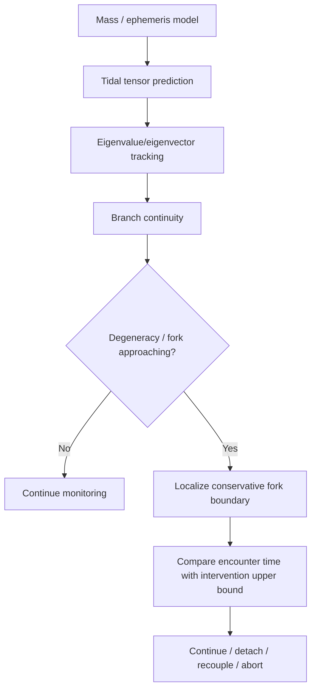
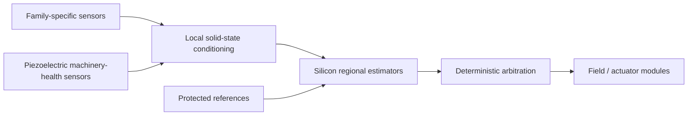

# Black Light FTL Predictive Safety Horizon and Error-Budget Manual

**Status:** supporting engineering authority for predictive route safety.  
**Design source:** *The different lightspeed methods*.  
**Primary rule:** a transit system is not safe merely because it can detect a hazard eventually. It must detect, estimate, decide, command, actuate, exit, clear, and recover **before the modeled hazard becomes unavoidable**, with uncertainty included conservatively.

---

## 1. Why a predictive horizon exists

Every transit family has some point beyond which a route error, topology change, occupied endpoint, shear fork, reference failure, or ordinary collision can no longer be corrected safely. The physical meaning of that point differs by family.

A useful engineering decomposition is:


The route is not operationally safe unless the conservative time still available at the point of recognition is at least as large as the conservative intervention time.

\[
\boxed{M_T=t_{available}^{min}-t_{int}^{max}}
\]

with:

\[
\boxed{M_T<0\Rightarrow BLOCK}
\]

A positive margin is not automatically `CONDITIONAL`. A conditional zone exists only when an applicable authority explicitly supplies an advisory margin.

---

## 2. Intervention time

The established Black Light intervention chain is:

\[
t_{int}=t_{sensor}+t_{solver}+t_{decision}+t_{command}+t_{actuate}+t_{exit}+t_{clear}+t_{margin}.
\]

For bounded stages:

\[
t_i\in[l_i,u_i]
\]

use:

\[
\boxed{t_{int}^{max}=\sum_i u_i}
\]

unless a stronger joint model explicitly exists.

Do **not** reduce the upper bound by assuming independent timing errors. Shared clocks, common power rails, thermal state, network congestion, solver load, common sensors, and damaged service paths can make errors correlated.

If a validated covariance model actually exists:

\[
\operatorname{Var}(t_{int})=\mathbf 1^T\Sigma_t\mathbf 1.
\]

That equation is statistical, not a guaranteed hard bound. Converting it into an engineering coverage band requires an explicit distribution/model statement and coverage factor.

---

## 3. Conservative predictive horizon

Let the nominal lower-bound prediction horizon be \(H_p\), with deterministic lower-side model/calibration uncertainty \(u_p\). Then:

\[
\boxed{H_p^*=\max(0,H_p-u_p)}.
\]

Let the intervention upper bound be \(T_i\), with bounded upper-side uncertainty \(u_i\):

\[
\boxed{T_i^*=T_i+u_i}.
\]

The simplest conservative timing margin is therefore:

\[
\boxed{M_T=H_p^*-T_i^*}.
\]

This is intentionally asymmetric. Uncertainty in available time reduces the claim; uncertainty in required time enlarges the burden.

---

## 4. Continuous projected-progress families

For families where route progress can be meaningfully represented continuously, the hazard may be described by a conservative distance-to-blocker and an upper-bound projected progress rate.

Let:

\[
D_h^*=\max(0,D_h-u_D)
\]

and:

\[
v_p^*=v_p+u_v.
\]

Then the lower-bound time to encounter is:

\[
\boxed{t_{enc}^{min}=\frac{D_h^*}{v_p^*}}
\]

for \(v_p^*>0\).

The conservative available time is:

\[
\boxed{t_{available}^{min}=\min(H_p^*,t_{enc}^{min})}.
\]

This matters because sensor prediction may extend farther than the next known blocker, or the next blocker may be farther away than the trustworthy prediction horizon.

### 4.1 Important semantic safeguard

\(v_p\) is **projected route progress**. It is not automatically local hull velocity and its numerical value exceeding \(c\) does not imply local material motion greater than \(c\).

---

## 5. PRECOMMIT families

Some families effectively commit the transit solution before traversal. Examples include fold-like endpoint selection, Q-lattice addressing, manifold embedding, and phase-reconciliation choices.

For these systems, do not fabricate an along-route local FTL velocity simply to reuse a continuous-motion equation.

Instead:

\[
\boxed{t_{available}^{min}=\min(H_p^*,t_{commit}^{min})}
\]

when a commitment window exists, and:

\[
\boxed{M_T=t_{available}^{min}-t_{int}^{max}}.
\]

A safe PRECOMMIT system must prove that the endpoint/reference/topology prediction remains valid long enough to reject or unwind the commitment before the irreversible point.

---

## 6. Portal and gate systems

A gate does not need a fictional free-flight hull speed. Relevant predictive intervals can include:

- throat/aperture stability forecast;
- mouth synchronization validity;
- admission-state validity;
- closure/rejection horizon;
- destination clearance validity;
- recovery reserve.

Use the minimum conservative interval:

\[
\boxed{
 t_{available}^{min}=\min(H_p^*,t_{admission}^{min},t_{closure}^{min},\ldots)
}
\]

for the intervals actually established by evidence.

---

## 7. Nine-family predictive safety table

| Family | Horizon mode | Core predictive question | Typical blocker |
|---|---|---|---|
| Inertial Torch | Continuous | Can the craft brake/avoid before ordinary collision or thermal/structural limit? | collision-course, reserve loss |
| Metric Compression | Continuous | Can curvature/field degradation be recognized early enough to unwind? | curvature limit, unwind-path loss |
| Gravitational Plane | Continuous | Can a tidal/shear branch change be localized before recoupling becomes impossible? | shear fork, tidal branch failure |
| Slipstream Shear | Continuous | Can boundary/adhesion loss be predicted before safe detachment is lost? | Q-boundary, adhesion loss |
| Q-Lattice | PRECOMMIT | Is the reference/address epoch valid long enough to reject the solution? | reference/address failure |
| N-Manifold | PRECOMMIT | Is the selected embedding/return map stable through commitment? | topology/return-map failure |
| Fold Jump | PRECOMMIT | Is the endpoint state and occupancy forecast trustworthy through closure? | endpoint occupancy/covariance |
| Phase Displacement | PRECOMMIT | Is whole-object reference/reconciliation valid through commitment? | reference/reconciliation failure |
| Wormhole Gate | Portal | Will throat/mouth/admission state remain valid through transfer and closure? | throat/synchronization failure |

---

## 8. Gravity and tidal prediction

For ordinary gravitational modeling, the Newtonian potential is:

\[
\Phi(\mathbf r)=-\sum_j\frac{GM_j}{|\mathbf r-\mathbf r_j|}
\]

within the regime where that approximation is valid.

Acceleration follows:

\[
\mathbf g=-\nabla\Phi.
\]

The tidal tensor is:

\[
T_{ij}=\frac{\partial g_i}{\partial x_j}
=-\frac{\partial^2\Phi}{\partial x_i\partial x_j}.
\]

A shear-fork or eigenbranch problem should therefore be tied to time-varying field/tidal structure and its uncertainty, not to a decorative scalar `gravity danger` value.

For a predicted state vector \(\mathbf x(t)\) with covariance \(\Sigma_x(t)\), first-order propagation through a differentiable measurement/model function \(\mathbf y=f(\mathbf x)\) gives:

\[
\boxed{\Sigma_y\approx J\Sigma_xJ^T}
\]

where:

\[
J=\frac{\partial f}{\partial\mathbf x}.
\]

This is useful when the model and covariance are actually justified. It is not permission to invent a covariance matrix.

---

## 9. Hidden mass and model incompleteness

A probability that an unseen mass exists is not itself a distance-to-hazard bound.

The following implication is prohibited:

\[
P(\text{hidden mass})=p
\not\Rightarrow
D_{safe}=g(p)
\]

unless an explicit physical/model authority defines \(g\).

Useful bounded evidence can instead include:

- an upper bound on unresolved mass in a surveyed volume;
- a lower bound on distance to any unresolved mass above a specified mass threshold;
- a bounded gravitational residual;
- a bounded ephemeris residual;
- a declared survey completeness model.

Unknown model incompleteness remains `UNRESOLVED` when required.

---

## 10. Endpoint occupancy and PRECOMMIT emergence

Fold and related endpoint systems require a particularly strict distinction:

\[
P(\text{occupied})\ll1
\not\Rightarrow
\text{endpoint certified empty}.
\]

An operational endpoint-clearance certificate should identify the sensed/estimated volume, timestamp or epoch, motion model, uncertainty region, stale-data limit, and the geometry that must remain unoccupied.

A useful geometric rule is to dilate the protected emergence volume by bounded position uncertainty rather than treating a nominal centroid as exact.

If \(V_e\) is the nominal emergence volume and \(B_u\) is a bounded uncertainty set, the conservative exclusion region is the Minkowski sum:

\[
\boxed{V_e^*=V_e\oplus B_u}.
\]

No numerical exclusion radius should be invented without an installation/family authority.

---

## 11. Gravitational-plane shear fork

A gravitational-plane installation needs more than `gravity detected`.

Conceptually:



Near a degeneracy, small perturbations may rotate eigenvectors strongly. Therefore branch identity and uncertainty should be treated explicitly rather than assuming a fixed plane normal remains valid.

---

## 12. Slipstream boundary tracking

A slipstream/shear family may require prediction of an admissible boundary, adhesion state, and detachment corridor.

A measured boundary that is reachable but not predictable far enough ahead still fails route safety:

\[
\boxed{\text{observable}\neq\text{actionable in time}}.
\]

If the lower bound on time to adhesion loss is 3.2 s and the intervention upper bound is 3.8 s:

\[
M_T=3.2-3.8=-0.6\,s
\]

and the result is `BLOCK`.

---

## 13. Q-lattice reference horizon

Q-lattice safety is reference/address dominated. The predictive horizon should be the conservative interval during which the reference state, address epoch and rejection path remain valid.

Do not convert reference confidence into ordinary meters unless a family authority explicitly provides that mapping.

Relevant evidence can include:

- reference epoch age;
- drift bound;
- address-validation horizon;
- rejection-path validation;
- synchronized independent references;
- model/version provenance.

---

## 14. N-manifold topology horizon

N-manifold prediction should track whether the embedding and return map remain valid through the precommit interval.

If a topology model has a validity horizon \(H_m\) and the navigation solution has horizon \(H_n\), then:

\[
\boxed{H_p=\min(H_m,H_n)}.
\]

The weaker authority limits the claim.

---

## 15. Phase-displacement reconciliation horizon

Phase systems require whole-object coverage and a valid reconciliation/reference solution. A prediction that covers the core machinery but not the entire protected geometry is not a complete safety certificate.

Changes in cargo, appendages, armor, field geometry, or mass distribution can therefore invalidate a previously acceptable prediction model even when no drive module changed.

---

## 16. Wormhole/gate admission horizon

A gate admission controller should be thought of as validating a time-bounded state:

```text
mouth synchronization
       AND
throat/aperture state
       AND
exit clearance
       AND
closure/rejection ability
       AND
recovery support
```

The shortest valid interval controls the admission horizon.

---

## 17. Scaling with vessel size

Large vessels increase the difficulty of preserving a useful predictive margin because sensing, computation, command propagation and actuation become spatially distributed.

A useful dimensionless control parameter remains:

\[
\Pi_c=\frac{L_c}{v_c\tau_r}
\]

where \(L_c\) is control span, \(v_c\) signal propagation velocity in the installed carrier, and \(\tau_r\) required response time.

As \(\Pi_c\) grows, safe design increasingly favors:

- regional sensing;
- local estimation;
- sectional abort authority;
- deterministic protected links;
- local energy buffers;
- sectional exit machinery;
- bounded failover latency.

A capital ship therefore should not simply be a small drive with every wire multiplied in length.

---

## 18. Ar'nock predictive-safety embodiment

The corrected Ar'nock baseline remains solid-state, electromechanical and modular.



Piezoelectric instrumentation is excellent for structural condition, alignment, vibration, actuator state and resonant references. It does **not** automatically measure gravity, endpoint occupancy, manifold topology or Q-state.

Ar'nock predictive uncertainty can arise from:

- sensor calibration transfer;
- module replacement;
- deterministic bus rerouting;
- clock/reference drift;
- mechanical datum shift;
- field-former alignment;
- thermal state;
- sectional failover latency.

The normal service consequence is that replacing a module can restore nominal function while reducing predictive margin enough to require transit recertification.

---

## 19. Zwlei Mur'rek predictive-safety embodiment

Mur'rek systems use different physical machinery and should retain that difference.

Possible mapped evidence includes:

- Sensor Choir / Forward Sensor Ampulla measurement state;
- Navigation Current reference condition;
- field-vane geometry and response;
- dielectric-fluid state;
- hydraulic response;
- bio-reactive power-fluid condition;
- conductive coolant and recovery support.

The source term **gravitic slipstream** remains source terminology. It does not select either `gravitational-plane` or `slipstream-shear`.

---

## 20. Failure taxonomy

| Code | Meaning |
|---|---|
| `PSH-FAMILY-UNKNOWN` | family required but unresolved |
| `PSH-HORIZON-MISSING` | no conservative prediction lower bound |
| `PSH-INTERVENTION-MISSING` | no conservative intervention upper bound |
| `PSH-LOCALIZATION-MISSING` | continuous hazard distance supplied without a usable progress-rate bound, or vice versa |
| `PSH-NEGATIVE-MARGIN` | available predictive time is shorter than intervention upper bound |
| `PSH-HAZARD-EVIDENCE` | required family hazard evidence absent when explicitly required |
| `PSH-STATISTICS-UNJUSTIFIED` | statistical uncertainty supplied without declared coverage/model semantics |
| `PSH-HIDDEN-MASS-MAPPING` | hidden-mass probability supplied without physical bound mapping |
| `PSH-ENDPOINT-NOT-CLEARED` | endpoint probability presented as clearance without a clearance authority |
| `PSH-CONFLICT` | contradictory or invalid predictive authorities |

---

## 21. Practical procedure PSH-01

**Purpose:** determine whether the predictive safety package gives enough time to execute the certified intervention sequence.

1. Resolve transit family independently.
2. Resolve the family horizon mode: continuous, PRECOMMIT, or portal admission.
3. Obtain the current installation intervention upper bound.
4. Obtain the conservative prediction-horizon lower bound.
5. Apply bounded prediction uncertainty by reducing available horizon.
6. Apply bounded intervention uncertainty by increasing required time.
7. For continuous systems, obtain conservative distance-to-hazard and upper-bound route-progress rate when available.
8. For PRECOMMIT systems, obtain the commitment-window lower bound when applicable.
9. For gate systems, obtain admission-validity and closure/rejection horizons when applicable.
10. Verify family-required hazard evidence if the certification profile requires it.
11. Calculate conservative available time.
12. Calculate \(M_T\).
13. `BLOCK` if \(M_T<0\).
14. `CONDITIONAL` only if an explicit advisory margin exists and \(0\le M_T<M_{adv}\).
15. Preserve raw inputs, uncertainty adjustments, derived bounds, unresolved inputs, warnings and provenance.
16. Pass the result into route admission; do not replace family route certification with this result.

---

## 22. Worked continuous example

Suppose a gravitational-plane vessel has:

\[
D_h=8.0\times10^6\,m,
\qquad
u_D=0.8\times10^6\,m
\]

so:

\[
D_h^*=7.2\times10^6\,m.
\]

Let projected route progress be bounded above by:

\[
v_p=1.50\times10^6\,m/s,
\qquad
u_v=0.10\times10^6\,m/s,
\]

so:

\[
v_p^*=1.60\times10^6\,m/s.
\]

Then:

\[
t_{enc}^{min}=\frac{7.2\times10^6}{1.60\times10^6}=4.5\,s.
\]

Suppose the prediction horizon is:

\[
H_p=5.2\,s,
\qquad
u_p=0.3\,s,
\]

thus:

\[
H_p^*=4.9\,s.
\]

Available time is:

\[
t_{available}^{min}=\min(4.9,4.5)=4.5\,s.
\]

If intervention is:

\[
T_i=4.0\,s,
\qquad
u_i=0.2\,s,
\]

then:

\[
T_i^*=4.2\,s
\]

and:

\[
\boxed{M_T=4.5-4.2=0.3\,s}.
\]

That is a pass unless an applicable authority defines an advisory margin larger than 0.3 s.

---

## 23. Worked PRECOMMIT example

A fold-jump installation has:

\[
H_p^*=11.2\,s
\]

but the endpoint solution becomes committed in:

\[
t_{commit}^{min}=8.6\,s.
\]

The conservative available time is therefore 8.6 s, not 11.2 s.

If:

\[
t_{int}^{max}=9.1\,s,
\]

then:

\[
M_T=8.6-9.1=-0.5\,s
\]

and the transit is blocked even though the sensor prediction itself extends beyond eleven seconds.

---

## 24. Worked gate example

Suppose a gate has:

- prediction horizon lower bound: 30 s;
- admission-state validity lower bound: 18 s;
- closure/rejection horizon lower bound: 21 s;
- intervention upper bound: 16 s.

Then:

\[
t_{available}^{min}=\min(30,18,21)=18\,s
\]

and:

\[
M_T=18-16=2\,s.
\]

Again, the shortest relevant authority controls.

---

## 25. Generator rules

A generator must:

- preserve the independently selected transit family;
- use that family to select predictive-horizon semantics;
- preserve raw bounds and provenance;
- reduce available time for bounded lower-side uncertainty;
- increase required intervention time for bounded upper-side uncertainty;
- never convert standard deviation into a hard bound without explicit coverage semantics;
- never turn hidden-mass probability into a distance without a mapping authority;
- never treat endpoint occupancy probability as certified clearance;
- never use species/race to select family;
- never use machinery-health sensors as exotic route sensors without a source mapping;
- never average a negative timing margin with favorable route scores.

---

## 26. Educational progression

**Transit Safety Engineering 780 — Predictive Horizons and Family Error Budgets**

Students should be able to:

1. distinguish sensor range from actionable prediction horizon;
2. derive conservative timing margins for continuous, PRECOMMIT and portal families;
3. distinguish bounded uncertainty from statistical uncertainty;
4. propagate simple gravitational-state uncertainty with Jacobian methods where justified;
5. explain why hidden-mass probability is not a safety distance;
6. explain why endpoint probability is not clearance certification;
7. identify family-specific hazard evidence;
8. integrate installation timing, predictive horizon and route certification without double-counting nominal latency;
9. preserve provenance and unresolved states;
10. diagnose when better sensors cannot compensate for slow exit machinery, and vice versa.

---

## 27. Closing engineering principle

The useful safety question is not:

> Can the ship see the problem?

It is:

> Can the ship recognize the right problem with enough justified predictive lead time to finish the certified response before physics removes the option to respond?

Therefore:

\[
\boxed{\text{observable}\neq\text{predictable}\neq\text{actionable}\neq\text{certified}.}
\]
