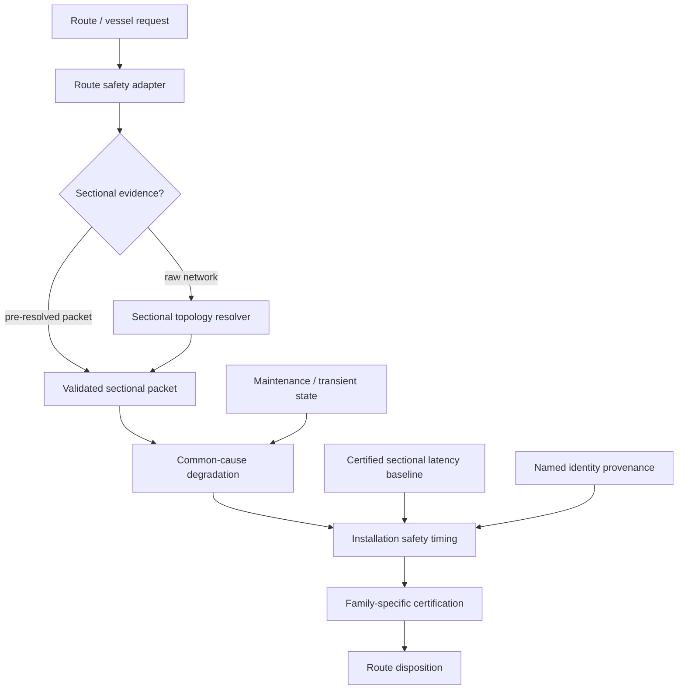
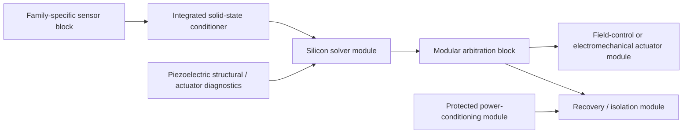

# Black Light FTL Route Adapter & Sectional Certification Contract

**Authority class:** subordinate engineering, API-contract, field-service, and educational authority.  
**Governing design-intent source:** *The different lightspeed methods*.  
**Primary implementation:** `blacklight-exo-ftl-route-safety-runtime.js`.  
**Sectional solver:** `blacklight-exo-ftl-sectional-dependency-topology-runtime.js`.  
**Timing authority:** `blacklight-exo-ftl-installation-safety-timing-runtime.js`.  
**Primary invariant:** route safety may forward sectional evidence, but it may not reinterpret sectional physics, invent missing certified baselines, or change the selected FTL family.

---

## 1. Purpose

The route-safety adapter is the point at which a generated transit route, a named installation, and the installation's actual machinery condition meet.

Before this contract, sectional topology and sectional propagation latency were available to the installation-timing authority, but ordinary route-safety calls did not forward the complete sectional packet. That created an authority discontinuity: a direct installation-timing call could recognize a long emergency cross-tie while the route-level API could omit it.

The route adapter now forwards both raw and pre-resolved sectional evidence into the same authoritative timing chain used by direct installation analysis.



The design deliberately avoids a second route-safety model. The adapter forwards evidence; the downstream authority performs the mathematics.

---

## 2. The three distinct questions

Sectional transit safety must keep three questions separate:

1. **Reachability:** does a physically surviving service path exist?
2. **Timeliness:** can the required service arrive within the relevant response interval?
3. **Certification:** after family physics, uncertainty, lookahead, recovery and intervention requirements are applied, is the route admissible?

Therefore:

\[
\boxed{\text{reachable}\neq\text{timely}\neq\text{certified}.}
\]

A redundant command bus can survive battle damage and still become too slow for a shear-sensitive emergency exit.

---

## 3. Sectional service graph

The installation is represented as directed graph

\[
G=(V,E),
\]

where nodes represent machinery sections and edges represent actual service connections such as:

- electrical power;
- coolant;
- command;
- sensor data;
- navigation/reference data;
- hydraulic pressure;
- dielectric-fluid circulation;
- recovery authority;
- other explicitly sourced machinery services.

For path \(p\), service availability is the bottleneck

\[
A_p=\min\left(A_{source},\min_{e\in p}A_e\right).
\]

The strongest surviving path is

\[
A_s=\max_p A_p.
\]

Propagation latency is independent:

\[
\tau_p=\sum_{e\in p}\tau_e.
\]

A high-availability path can be slow; a low-latency path can be too degraded to satisfy its readiness floor.

---

## 4. k-of-n response timing

For a group requiring at least \(k\) of \(n\) members, readiness is the kth-largest qualifying readiness:

\[
r_{group}=r_{(k)}^{\downarrow}.
\]

If eligible members act in parallel, completion occurs when the kth qualifying response arrives:

\[
\boxed{\tau_{group}=\tau_{(k)}^{\uparrow}.}
\]

This is not permission to parallelize genuinely serial operations. Sensing, solving, command, actuation, exit and clearance remain serial where the actual machinery requires them to be serial.

---

## 5. Certified baseline and excess delay

A certified timing stage normally already includes nominal propagation delay. Consequently, current sectional latency must not simply be added to the certified stage.

For timing channel \(i\),

\[
\boxed{\Delta\tau_i=\max(0,\tau_{i,current}-\tau_{i,certified}).}
\]

Then

\[
\boxed{t_{i,eff}=t_{i,conditioned}+\Delta\tau_i.}
\]

If the current command path is 135 μs and the certified path was 48 μs,

\[
\Delta\tau_{command}=87\ \mu s.
\]

Only that 87 μs penalty is charged to intervention timing.

### Missing-baseline invariant

If

\[
\tau_{current}\text{ is known}
\]

but

\[
\tau_{certified}\text{ is unknown},
\]

then

\[
\boxed{\Delta\tau\text{ is UNRESOLVED, not }\tau_{current}.}
\]

Missing historical decomposition is not a physically meaningful zero.

---

## 6. Intervention timing

The emergency intervention model remains

\[
t_{int}=t_{sensor}+t_{solver}+t_{decision}+t_{command}+t_{actuate}+t_{exit}+t_{clear}+t_{margin}.
\]

Maintenance and readiness first condition each stage:

\[
t_{i,conditioned}=t_{i,0}\frac{m_i}{\max(r_i,\epsilon)}.
\]

Sectional excess latency is added after that condition model:

\[
t_{i,eff}=t_{i,conditioned}+\Delta\tau_i.
\]

This ordering preserves the distinction between a slow component and a slow path to that component.

---

## 7. Continuous projected-progress families

For continuous projected-progress transit,

\[
M_T=\frac{D_B}{v_p}-t_{int}.
\]

The corresponding distance margin is

\[
M_D=D_B-v_pt_{int}.
\]

An added sectional delay \(\Delta\tau\) consumes margin directly:

\[
M_{T,new}=M_{T,old}-\sum_i\Delta\tau_i,
\]

and

\[
M_{D,new}=M_{D,old}-v_p\sum_i\Delta\tau_i.
\]

Here \(v_p\) is route progress speed. It is not automatically local hull velocity.

---

## 8. PRECOMMIT families

For Q-Lattice, Fold Jump, and Phase Displacement, the relevant margin remains

\[
\boxed{M_T=t_{prediction}-t_{int}.}
\]

A slower sectional path can delay observation, solution, rejection, command or exit preparation. It does not create a meaningful intermediate superluminal hull velocity.

\[
\boxed{\text{PRECOMMIT delay}\not\Rightarrow\text{local FTL velocity}.}
\]

---

## 9. Wormhole / gate systems

Gate installations often make the sectional problem more explicit because machinery is geographically distributed around an aperture, anchor structure, power plant or paired mouth.

Useful independently tracked quantities include:

| Quantity | Engineering meaning |
|---|---|
| local aperture-control latency | local machinery response |
| paired-mouth information age | freshness of remote state |
| closure-authority latency | time to reach protected abort machinery |
| anchor sensing latency | structural-state update age |
| chronology/interlock latency | veto propagation |

Remote-state age must not be substituted for local closure latency.

---

## 10. Route API contract

The route-safety adapter accepts the installation-prefixed sectional fields below and also accepts their generic aliases where appropriate.

| Route input | Meaning |
|---|---|
| `installationSectionalNetwork` | raw sectional graph |
| `installationSectionalTopologyPacket` | already-resolved sectional evidence |
| `installationSectionalProfileId` | versioned sectional profile selector |
| `installationSectionalProfile` | explicit profile packet |
| `installationServiceChannelMap` | service-to-readiness/timing mapping |
| `installationBaselineSectionalLatency` | certified per-channel latency baseline |

The adapter forwards these as:

```text
sectionalNetwork
sectionalTopologyPacket
sectionalProfileId
sectionalProfile
serviceChannelMap
baselineSectionalLatency
```

to the installation-timing authority.

The route adapter does **not** recompute widest paths, k-of-n response timing, common-cause degradation, or excess-latency penalties.

---

## 11. Raw versus pre-resolved evidence

Two input modes are legitimate.

### Raw network

The caller provides physical topology. The sectional runtime resolves paths, bottlenecks, group readiness and latency.

### Pre-resolved packet

A higher-fidelity or external engineering process has already resolved sectional state. The packet must retain its profile, evidence status and provenance.

The second mode must not become a provenance bypass. A pre-resolved packet is evidence, not a magic assertion.

---

## 12. Ar'nock machinery embodiment

The general Ar'nock technological baseline is **solid-state electromechanical**. Their ordinary computing and control infrastructure is primarily silicon-based, extensively modular, and commonly uses piezoelectric sensing and precision electromechanical functions. Biotechnology and bioprinting are secondary capabilities used principally for feedstock, medicine, environmental support and life-support applications unless a specific source establishes a biological subsystem.

A plausible Ar'nock transit-control topology is therefore:



Their distinctive engineering feature is not biological computation but the level at which functional integration and replacement occur.

\[
\boxed{\text{Human modularity}\approx\text{components on assemblies}}
\]

versus

\[
\boxed{\text{Ar'nock modularity}\approx\text{complete functional assemblies as components}.}
\]

This has direct timing implications. Two socket-compatible modules can have different buffering, transducer conditioning, arbitration or internal propagation delay. Therefore:

\[
\boxed{\text{mechanically compatible}\neq\text{timing certified}.}
\]

### Piezoelectric engineering

For linear piezoelectric response,

\[
\mathbf D=\mathbf d\mathbf T+\boldsymbol\epsilon^T\mathbf E,
\]

\[
\mathbf S=\mathbf s^E\mathbf T+\mathbf d^T\mathbf E.
\]

Ar'nock systems may exploit these relationships for strain sensing, resonant condition monitoring, precision actuation, pressure measurement, structural settling and machinery-health diagnostics. They do not become gravity, Q-state or manifold sensors unless an independent source establishes that function.

---

## 13. Zwlei Mur'rek machinery embodiment

Mur'rek machinery remains materially different where its sources establish bio-reactive fluids, dielectric field-vane systems, hydraulic authority, Sensor Choir/Forward Sensor Ampulla functions and Navigation Current Well infrastructure.

A sectional delay can arise through:

```text
sensor ampulla / choir
        ↓
navigation-current solution
        ↓
command arbitration
        ↓
hydraulic / dielectric vane actuation
        ↓
exit / recovery response
```

The phrase “gravitic slipstream” remains family-unresolved. Machinery timing cannot promote it to either `gravitational-plane` or `slipstream-shear` without an explicit higher authority.

---

## 14. Large-vessel scaling

The dimensionless control-pressure measure remains

\[
\Pi_c=\frac{L_c}{v_c\tau_r}.
\]

As physical span \(L_c\) increases, propagation velocity \(v_c\) and required response interval \(\tau_r\) place increasing pressure on centralized control.

Consequences include:

- regional solvers;
- local abort authority;
- sectional protected energy reserves;
- redundant power and data trunks;
- local condition sensing;
- explicit inter-zone latency certification;
- refit records that preserve topology as well as module identity.

A kilometer-scale transit installation is not a fighter-scale installation with a larger reactor.

---

## 15. Power and thermal coupling

Sectional timing and common-cause machinery degradation remain separate dimensions.

For power deficit

\[
P_d=\max(0,P_L-P_a),
\]

and protected buffer energy \(E_b\),

\[
t_{hold}=\frac{E_b}{P_L-P_a}
\]

when \(P_L>P_a\).

A reroute can increase \(t_{int}\) until

\[
t_{int}>t_{hold},
\]

turning a previously sufficient protected store into an insufficient one without any additional generator damage.

For short-horizon lumped thermal behavior,

\[
C_{th}\frac{dT}{dt}=P_{heat}-P_{reject}.
\]

Thus topology, timing, power and thermal state can interact without becoming the same variable.

---

## 16. Signature interpretation

Sectional changes can generate diagnostic signatures:

| Machinery event | Possible signature |
|---|---|
| bus cross-tie | switching-pattern and traffic changes |
| alternate converter | harmonic and thermal redistribution |
| long coolant bypass | pump-state change and delayed thermal response |
| Ar'nock module refit | changed resonant/timing fingerprint and revision identity |
| Mur'rek hydraulic bypass | pressure transient and slower vane response |
| local isolation | abrupt service-graph change and load transfer |

These are machinery signatures. They do not prove an exotic transit hazard.

---

## 17. Failure taxonomy

`RSC-NO-SECTIONAL-BASELINE` — current sectional latency exists but no matching certified baseline exists.  
`RSC-SECTIONAL-REROUTE` — the current service path is slower than its certified path.  
`RSC-SECTIONAL-BLOCKED` — no service path satisfies the declared readiness floor.  
`RSC-KOFN-TIMING` — sufficient members remain alive, but the kth qualifying response arrives too late.  
`RSC-DOUBLE-COUNT` — total current path latency was added to a stage already containing nominal propagation.  
`RSC-STALE-REFIT-MAP` — topology does not match the installed module/refit state.  
`RSC-PROVENANCE-LOSS` — sectional evidence lost source/profile identity.  
`RSC-FAMILY-PROMOTION` — machinery terminology was used to infer family identity.  
`RSC-ARNOCK-BIO-DEFAULT` — generic Ar'nock machinery was incorrectly rewritten as biotechnology-first.  
`RSC-PRECOMMIT-VELOCITY` — endpoint timing was converted into a fabricated local superluminal velocity.

---

# Part II — Practical equipment procedures

## 18. RSC-01 Route-adapter sectional intake

1. Confirm the independently established transit family.
2. Capture vessel, installation, manufacturer and named-technology identity without using those fields to select family.
3. Record the sectional profile/version.
4. Choose raw-network or pre-resolved-packet intake; do not silently mix them.
5. Verify service-channel mapping.
6. Retrieve certified sectional latency baselines.
7. Mark absent baselines `UNRESOLVED`.
8. Pass all evidence through the route adapter unchanged.
9. Inspect installation-timing provenance in the returned route result.
10. Reject any downstream presentation that drops the sectional evidence chain.

---

## 19. RSC-02 Post-refit timing recertification

1. Record removed and installed module identities.
2. Verify mechanical and electrical compatibility.
3. Rebuild the actual service graph.
4. Measure sensor, solver, command, actuator, exit and clearance propagation where applicable.
5. Compare against the certified baseline for the same channel and configuration.
6. Compute \(\Delta\tau_i\).
7. Re-run common-cause condition analysis.
8. Recompute installation timing.
9. Re-run family-specific route certification.
10. Preserve both old and new baselines; never overwrite history without lineage.

For Ar'nock refits, module-level replacement is normal; subcomponent equivalence must not be assumed merely because interface geometry matches.

---

## 20. RSC-03 Battle-damage cross-tie audit

1. Freeze current breaker/valve/isolation state.
2. Resolve surviving service paths.
3. Identify any path that changed relative to certification.
4. Measure current latency and bottleneck availability.
5. Evaluate k-of-n groups using the actual qualifying members.
6. Apply common-cause degradation after reachability resolution.
7. Charge only certified excess latency to intervention timing.
8. Compare updated \(t_{int}\) with prediction horizon, blocker reachability and protected reserve hold time.
9. If the certified baseline is missing, report `UNRESOLVED`; do not assume zero.
10. Preserve the damaged topology packet for forensic review.

---

## 21. RSC-04 Ar'nock modular timing survey

1. Inventory each installed functional module and revision.
2. Identify silicon compute, solid-state conditioning, piezoelectric diagnostics, arbitration, actuator and recovery modules.
3. Record connector/bus topology and timing boundaries.
4. Excite approved piezoelectric diagnostics and record resonant/settling behavior.
5. Distinguish structural/actuator diagnostics from actual family-specific navigation sensors.
6. Measure interface latency end-to-end rather than inferring it from module type.
7. Record replacement history.
8. Recreate only explicitly sourced biotechnology where it is actually part of the subsystem.
9. Re-certify sectional latency after any module substitution.
10. Preserve unresolved internal implementation rather than inventing Human-style discrete components.

---

# Part III — Educational text

## 22. Transit Safety Engineering 740

**Course title:** Route Adapter Contracts, Sectional Latency Provenance, and Distributed Transit Certification

### Learning outcomes

A qualified student should be able to:

- distinguish connectivity, timing and certification;
- solve deterministic widest-path service availability;
- calculate k-of-n response latency;
- derive an excess-latency penalty without double counting;
- explain why a missing certified latency is unresolved rather than zero;
- propagate installation condition into continuous and PRECOMMIT safety models correctly;
- audit a route API for authority leakage;
- describe Human, Ar'nock and Mur'rek machinery embodiments without collapsing them into one technology style;
- preserve family identity independently from race/manufacturer identity;
- identify when weak-field physical evidence constrains but does not prove fictional transit behavior.

### Worked problem

A three-of-four regional field-control group has qualifying response latencies

\[
[42,55,91,\infty]\ \mu s.
\]

The group completion latency is

\[
\tau_{group}=91\ \mu s.
\]

If the certified group latency was 60 μs,

\[
\Delta\tau=31\ \mu s.
\]

If conditioned intervention time before sectional delay was 2.400000 s,

\[
t_{int,new}=2.400031\ s.
\]

For a continuous system with 2.401 s remaining to the conservative blocker, the installation is still reachable but has only

\[
M_T=0.000969\ s
\]

of timing margin. Connectivity alone would have hidden how close the installation was to losing certification.

---

## 23. Generation rules

A generator using this authority must:

- generate machinery embodiment separately from FTL family;
- preserve the nine consolidated transit families;
- use race/manufacturer/installation identity only as provenance and embodiment selectors unless an explicit mapping establishes family;
- generate sectional topology for sufficiently large or distributed installations;
- generate latency baselines only when the source class permits a certified or explicitly simulated baseline;
- label simulation values as simulation values;
- preserve missing values as missing;
- never manufacture independence between shared infrastructure failures;
- never convert normalized readiness into probability without a stochastic authority;
- preserve the corrected Ar'nock solid-state, silicon, piezoelectric, modular baseline;
- use Ar'nock biotechnology primarily for feedstock, medicine, environment and life support unless a specific subsystem source overrides that default;
- preserve Mur'rek source-specific fluid/bioreactive machinery without using its terminology to assign a family;
- preserve the distinction between projected progress and local hull velocity;
- keep emergency recovery reserve separate from nominal performance reserve.

---

## 24. Canon safeguards

\[
\boxed{\text{machinery embodiment}\neq\text{family identity}}
\]

\[
\boxed{\text{race identity}\neq\text{family identity}}
\]

\[
\boxed{\text{measured degradation}\neq\text{fictional hazard proof}}
\]

\[
\boxed{\text{unknown baseline}\neq0}
\]

\[
\boxed{\text{same mathematics}\neq\text{same machine}}
\]

These rules are intentionally conservative. They allow the engineering corpus to become deeper without making the setting less coherent by quietly turning an extrapolation into canon.
