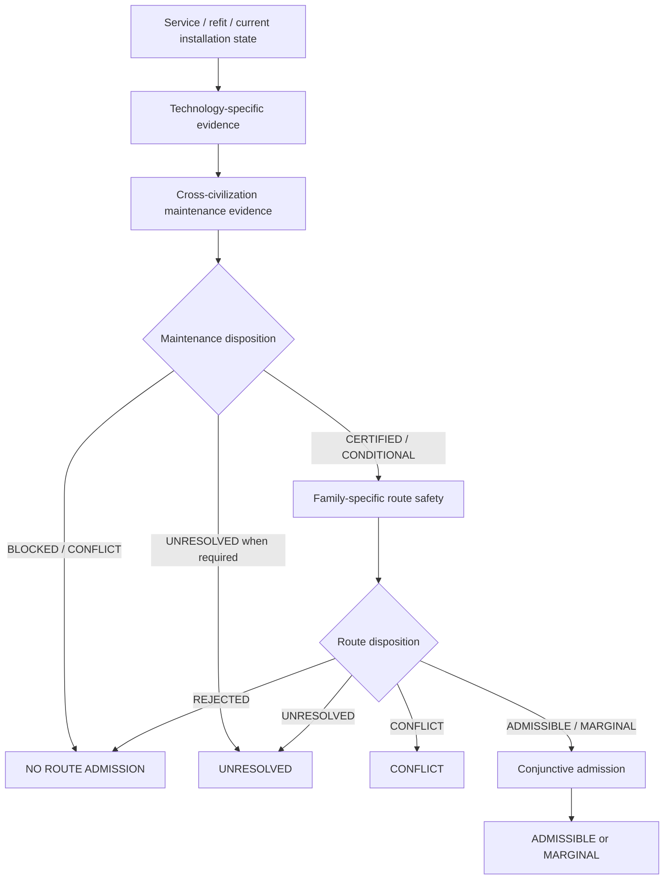
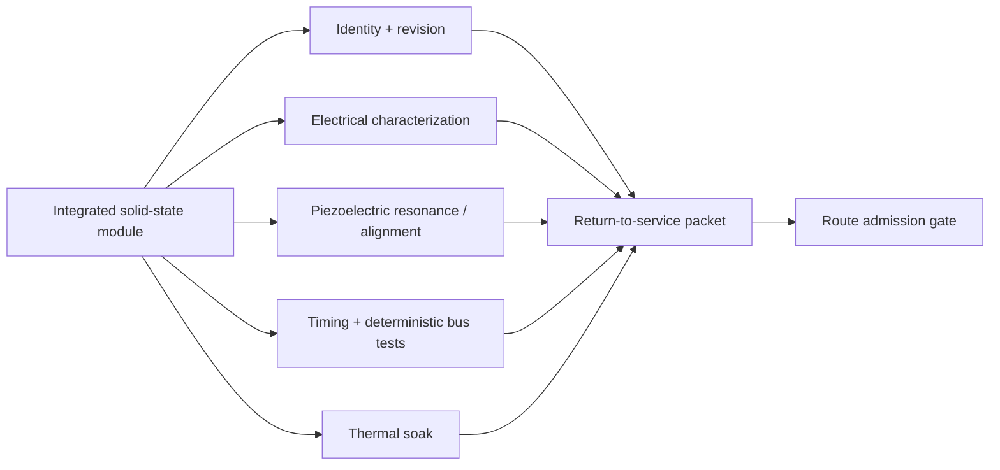
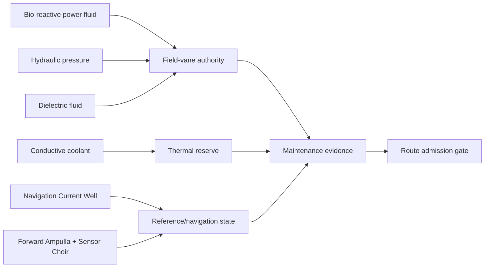

# Black Light FTL Route Admission and Maintenance-Gate Manual

**Status:** authoritative derived engineering manual for operational route admission.  
**Authority relationship:** subordinate to the consolidated propulsion/transit authority, the maintenance-evidence authorities, family-specific safety authorities, and the design source *The different lightspeed methods*.  
**Runtime:** `blacklight-exo-ftl-route-admission-runtime.js`  
**Registry:** `data/exo-vessel/ftl-route-admission-registry.json`

---

## 1. Purpose

A transit route is not operationally safe merely because its geometry is favorable. A vessel is not operationally safe merely because its machinery has passed a repair bench. Black Light therefore treats **route admission** as the conjunction of two independently sourced claims:

1. the installation is fit for the demanded transit operation; and
2. the selected transit family can safely traverse the modeled route/environment.

The top-level rule is:

\[
\boxed{\text{admission}=\text{maintenance fitness}\land\text{route safety}}
\]

Neither side may average away the other.



This layer is intentionally **above** the existing route-safety runtime. It does not duplicate family physics; it decides whether route physics is even allowed to become an operational GO decision.

---

## 2. Why this layer exists

Without a route-admission gate, a repaired vessel can produce an absurd result:

```text
Field geometry: acceptable
Gravity model: acceptable
Predicted route margin: acceptable
Drive module: recently replaced
Replacement timing: uncertified
Protected recovery reserve: unknown
---------------------------------
Old result: GO
Correct result: UNRESOLVED / NO GO
```

The opposite error is equally bad. A perfectly serviced ship does not make a bad route safe.

```text
Machinery: certified
Power reserve: certified
Thermal reserve: certified
Sensors: calibrated
Route crosses catastrophic family-specific shear fork
-----------------------------------------------------
Result: REJECTED
```

Hence:

\[
\boxed{\text{machine health}\neq\text{route health}}
\]

and:

\[
\boxed{\text{route health}\neq\text{machine health}}.
\]

---

## 3. Admission-state algebra

The runtime normalizes maintenance evidence into:

| Maintenance class | Meaning |
|---|---|
| `PASS` | Return-to-service evidence is certified |
| `CONDITIONAL` | Service evidence is usable only inside a stated envelope or with limitations |
| `BLOCK` | Machinery/service evidence forbids operation |
| `CONFLICT` | Equal-precedence or unresolved authority conflict exists |
| `UNRESOLVED` | Required evidence is insufficient |
| `SIMULATION_ONLY` | Suitable for modeling, not operational authority |
| `NOT_REQUIRED` | No service event/evidence requirement was asserted for this route request |

Route safety is normalized independently:

| Route class | Route-safety status |
|---|---|
| `PASS` | `ADMISSIBLE` |
| `CONDITIONAL` | `MARGINAL` |
| `BLOCK` | `REJECTED` or `OUTSIDE_MODEL_VALIDITY` |
| `CONFLICT` | `CONFLICT` |
| `UNRESOLVED` | `UNRESOLVED` |

The combination is deliberately conservative:

| Maintenance | Route | Final admission |
|---|---|---|
| PASS | PASS | ADMISSIBLE |
| CONDITIONAL | PASS | MARGINAL |
| PASS | CONDITIONAL | MARGINAL |
| CONDITIONAL | CONDITIONAL | MARGINAL |
| BLOCK | anything non-conflict | REJECTED |
| anything non-conflict | BLOCK | REJECTED |
| CONFLICT | anything | CONFLICT |
| anything | CONFLICT | CONFLICT |
| required UNRESOLVED | anything non-conflict | UNRESOLVED |
| PASS | UNRESOLVED | UNRESOLVED |
| SIMULATION_ONLY | otherwise safe | SIMULATION_ONLY |

A `CONDITIONAL` maintenance packet therefore cannot be silently promoted because route geometry happens to be excellent.

---

## 4. Maintenance requirement and backward compatibility

The route-admission layer does **not** invent a recent repair event for every voyage.

Maintenance evidence becomes mandatory when the caller explicitly requires it or supplies evidence that a service/recertification event exists. Current triggers include:

- `maintenanceEvidenceRequired === true`;
- a maintenance evidence packet;
- a maintenance evidence context;
- a service event;
- a service-event kind;
- a technology-specific service adapter used for recertification.

When none of those exists, existing installation timing/readiness authority may still be used by route safety. The absence of a declared service event is not itself a failed service event.

This prevents a generator from fabricating maintenance history while still making real service evidence binding when it exists.

---

## 5. Evidence freshness

A calibration or service certificate can become stale, but Black Light does not invent a universal lifetime for every technology.

When an authority explicitly supplies a validity interval,

\[
\Delta t_{age}
=
\max\left(0,t_{eval}-t_{cert}\right).
\]

Certification is fresh only if:

\[
\boxed{\Delta t_{age}\le t_{valid}}.
\]

If a validity interval exists but the evaluation epoch or evidence epoch is missing, freshness is `UNRESOLVED` rather than treating the missing timestamp as zero age.

This is especially important for systems whose calibration is sensitive to:

- thermal cycles;
- radiation dose;
- mechanical shock;
- refit geometry;
- dielectric-fluid condition;
- piezoelectric resonance drift;
- reference-clock aging;
- structural preload;
- repeated high-authority field operation.

The validity interval itself must come from a technology/system authority, manufacturer specification, test campaign, or explicit simulation assumption.

---

## 6. Intervention timing remains physical

The maintenance gate does not replace the installation timing model. It determines whether the timing evidence is trustworthy enough to use.

The emergency chain remains:

\[
t_{int}
=
t_{sensor}
+t_{solver}
+t_{decision}
+t_{command}
+t_{actuate}
+t_{exit}
+t_{clear}
+t_{margin}.
\]

For bounded stages,

\[
t_i\in[l_i,u_i]
\]

implies:

\[
T_{int}
\in
\left[
\sum_i l_i,
\sum_i u_i
\right].
\]

No independence assumption is required to add deterministic bounds.

If a repaired command path changes from certified delay \(\tau_0\) to current delay \(\tau_c\), the added burden is:

\[
\boxed{\Delta\tau=\max(0,\tau_c-\tau_0)}.
\]

Charging the entire current delay a second time would double-count propagation already represented in the certified timing baseline.

---

## 7. Power and energy are separate admission evidence

A stored-energy system can contain enough joules to complete an emergency sequence and still be unable to deliver sufficient instantaneous power.

Energy margin:

\[
M_E=E_{available,protected,lower}-E_{required,upper}.
\]

But the critical interval must also satisfy:

\[
P_{available,lower}(t)\ge P_{required,upper}(t).
\]

For a temporary generation deficit,

\[
P_d=\max(0,P_L-P_a),
\]

and protected hold time is:

\[
t_{hold}=\frac{E_b}{P_L-P_a},\qquad P_L>P_a.
\]

If:

\[
t_{hold}<t_{int},
\]

then emergency transit termination cannot be certified for that operating state.

---

## 8. Thermal evidence

For a short approximately lumped transient,

\[
C_{th}\frac{dT}{dt}=P_{heat}-P_{reject}
\]

and, with approximately constant terms,

\[
T(t)=T_0+\frac{P_{heat}-P_{reject}}{C_{th}}t.
\]

A service-bay thermal soak may establish module behavior. It does **not** automatically establish whole-installation thermal reserve during emergency de-transit.

The model should be replaced or refined when important behavior includes spatial hot spots, coolant redistribution, phase change, strong radiative nonlinearity, actively changing heat rejection, or strongly temperature-dependent material properties.

---

## 9. Sectional infrastructure

For a service path \(p\), normalized deterministic support remains:

\[
A_p=\min\left(A_{source},\min_{e\in p}A_e\right),
\]

with best surviving path:

\[
A_s=\max_p A_p.
\]

Propagation delay remains:

\[
\tau_p=\sum_{e\in p}\tau_e.
\]

These lead to the practical rule:

\[
\boxed{\text{reachable}\neq\text{timely}\neq\text{certified}}.
\]

A cross-tie can restore electrical continuity while creating too much command delay for safe emergency termination.

---

## 10. Family semantics remain separate

### 10.1 Continuous projected-progress families

When a family supports projected route progress \(v_p\), the timing margin can be written:

\[
M_T=\frac{D_B}{v_p}-t_{int}.
\]

Equivalently,

\[
M_D=D_B-v_pt_{int}.
\]

Here \(v_p\) is route-progress semantics, not a claim that local hull velocity exceeds \(c\).

### 10.2 PRECOMMIT families

For families whose safety decision must be completed before commitment,

\[
\boxed{M_T=t_{prediction}-t_{int}}.
\]

No local FTL velocity is invented for fold-jump, Q-lattice, phase-displacement, or any other PRECOMMIT implementation merely to satisfy a generic formula.

### 10.3 Anchored portals

Wormhole/gate systems use admission, synchronization, aperture/throat state, exit occupancy, clearance, and recovery evidence. Their safety state is not reduced to a free-flight travel speed.

---

## 11. Ar'nock admission embodiment

Ar'nock route admission begins from the corrected technology basis:



General Ar'nock computation is solid-state silicon. Their ordinary machinery is modular and electromechanical. Piezoelectric technology is prominent for sensing, precision actuation, structural diagnostics, alignment, pressure, resonance, and mechanically coupled interfaces.

Bioprinting belongs by default to feedstock, medicine, environmental support, ecological processing, and life support. It does not become generic compute or drive maintenance equipment merely because the vessel is Ar'nock.

The service consequence is:

\[
\boxed{\text{module replacement}\neq\text{automatic recertification}}.
\]

A replacement can be physically compatible and functionally correct while differing in timing, calibration, thermal loading, or field alignment enough to require a new transit certificate.

---

## 12. Zwlei Mur'rek admission embodiment

Mur'rek evidence is physically different but feeds the same top-level questions.



The source phrase **gravitic slipstream** remains a source phrase.

\[
\boxed{\text{gravitic slipstream}\not\Rightarrow\texttt{gravitational-plane}}
\]

and:

\[
\boxed{\text{gravitic slipstream}\not\Rightarrow\texttt{slipstream-shear}}.
\]

Machinery evidence may establish readiness without establishing the consolidated transit family.

---

## 13. Signature interpretation

Maintenance and route hazards produce different signatures and should remain distinguishable.

| Evidence source | Example signatures | What it can establish |
|---|---|---|
| Power interface | bus sag, current rise, converter heating | delivery degradation |
| Piezoelectric diagnostics | resonance shift, damping change, phase asymmetry | changed mechanical/electromechanical state |
| Thermal system | coolant rise, radiator saturation, hotspot growth | reduced thermal margin |
| Hydraulic system | response lag, pressure decay, asymmetric vane motion | actuator/control degradation |
| Dielectric system | leakage, polarization drift, field asymmetry | insulation/field-control degradation |
| Gravity/navigation sensors | model residual, reference disagreement | route-model/navigation uncertainty |
| Exotic family sensors | family-specific boundary/topology evidence | only the family hazard they are designed to observe |

A machinery signature is not automatically an exotic route signature.

---

## 14. Failure taxonomy

Recommended route-admission failure codes:

| Code | Meaning |
|---|---|
| `RAG-MAINT-BLOCK` | mandatory maintenance evidence blocks operation |
| `RAG-MAINT-CONFLICT` | maintenance authority conflict |
| `RAG-MAINT-UNRESOLVED` | required service evidence incomplete |
| `RAG-MAINT-EXPIRED` | explicitly time-bounded service evidence is stale |
| `RAG-ROUTE-REJECTED` | family/route calculation rejects transit |
| `RAG-ROUTE-UNRESOLVED` | route evidence insufficient |
| `RAG-ROUTE-OUTSIDE-MODEL` | physical model outside declared validity |
| `RAG-CONDITIONAL` | one or both authorities impose a conditional envelope |
| `RAG-FAMILY-LEAK` | technology/species evidence was used to infer transit family |
| `RAG-ZERO-UNKNOWN` | missing evidence was replaced with zero or nominal value |
| `RAG-PROVENANCE-GAP` | result cannot be traced to its evidence sources |

---

## 15. Practical route-admission procedure RA-01

1. Identify vessel, installation, family authority, and route request.
2. Determine whether a service/refit event requires maintenance evidence.
3. Resolve technology-specific service evidence.
4. Normalize it through the cross-civilization maintenance contract.
5. Check explicit certificate freshness when a validity interval exists.
6. Stop immediately on maintenance `BLOCKED`, `CONFLICT`, or required `UNRESOLVED`.
7. Resolve installation timing/readiness and sectional state.
8. Resolve physical route/environment evidence.
9. Apply family-specific hazard and intervention semantics.
10. Combine maintenance and route results conjunctively.
11. Preserve both source packets in the final admission packet.
12. Record warnings, unresolved assumptions, authority versions, and any conditional operating envelope.

The stop-before-route behavior in step 6 is intentional. There is no engineering value in spending route-certification authority on a vessel already known to be unfit for transit.

---

## 16. Worked example: conditional Ar'nock refit

An Ar'nock command module is replaced after a fault. Static, dynamic, calibration, power, and thermal checks pass, but the replacement requires a compatibility adapter.

Certified command propagation:

\[
\tau_0=46\ \mu s.
\]

Measured current propagation:

\[
\tau_c=128\ \mu s.
\]

Therefore:

\[
\Delta\tau=82\ \mu s.
\]

Suppose route physics is otherwise `ADMISSIBLE`, but the service authority permits operation only inside a reduced authority envelope pending a full depot recalibration. Maintenance therefore returns `CONDITIONALLY_CERTIFIED`.

The admission table gives:

\[
\text{CONDITIONAL}\land\text{ADMISSIBLE}
\Rightarrow
\boxed{\text{MARGINAL}}.
\]

The route calculator is not allowed to promote the vessel back to `ADMISSIBLE`.

---

## 17. Worked example: favorable route, blocked recovery plant

A route through low-gradient deep space produces generous geometric margin. The vessel, however, has a protected recovery-power failure.

Let:

\[
E_b=48\ \mathrm{MJ},\quad
P_L=5.0\ \mathrm{MW},\quad
P_a=3.0\ \mathrm{MW}.
\]

Then:

\[
t_{hold}=\frac{48\times10^6}{2\times10^6}=24\ s.
\]

If the certified worst-case intervention sequence requires:

\[
t_{int}=31\ s,
\]

then:

\[
t_{hold}<t_{int}.
\]

Maintenance/installation evidence blocks transit before route geometry matters.

---

## 18. Generator rules

A generator using this authority must:

- keep maintenance and route source packets separate;
- preserve race/technology embodiment without using it to select family;
- retain unknowns as unknowns;
- retain explicit measurement bounds;
- preserve provenance and revision identifiers;
- avoid universal service lifetimes unless sourced;
- avoid fictitious local FTL velocity for PRECOMMIT or portal systems;
- preserve the corrected Ar'nock solid-state modular baseline;
- preserve Mur'rek source terminology without keyword family inference;
- expose the final admission reason, not merely a green/red icon.

A useful generated summary is:

```text
ROUTE ADMISSION
  Maintenance required: yes
  Maintenance: CONDITIONAL
  Route safety: ADMISSIBLE
  Final: MARGINAL
  Limiting evidence: command-path latency after refit
  Family authority: independently resolved
  Evidence freshness: PASS
  Provenance: retained
```

---

## 19. Educational text: Transit Safety Engineering 760

### Learning objective

A qualified engineer should be able to explain why a route certificate and a return-to-service certificate are different objects, calculate bounded intervention timing, distinguish energy from power reserve, identify stale or unresolved service evidence, and combine technology-specific maintenance evidence with family-specific route physics without collapsing either into the other.

### Examination principle

The correct answer to an apparently favorable route is sometimes:

> The route is fine. The ship is not.

The correct answer to an apparently healthy ship is sometimes:

> The ship is fine. The route is not.

Operational admission exists only when both statements are favorable under the applicable authority.

---

## 20. Canon and provenance safeguards

The admission layer may combine evidence. It may not manufacture canon.

\[
\boxed{\text{generated admission result}\neq\text{new setting-wide technology fact}}
\]

\[
\boxed{\text{technology basis}\neq\text{family identity}}
\]

\[
\boxed{\text{unknown}\neq0}
\]

\[
\boxed{\text{conditional}\neq\text{fully certified}}
\]

Every operational packet should remain auditable back through:

```text
route admission
    ↓
route-safety result + maintenance result
    ↓                         ↓
family/environment        technology/service evidence
    ↓                         ↓
physics authorities       race/system authorities
    └──────────────┬──────────┘
                   ↓
          source / provenance chain
```

That chain is the point. The final GO/NO-GO state should be explainable, not mystical.
