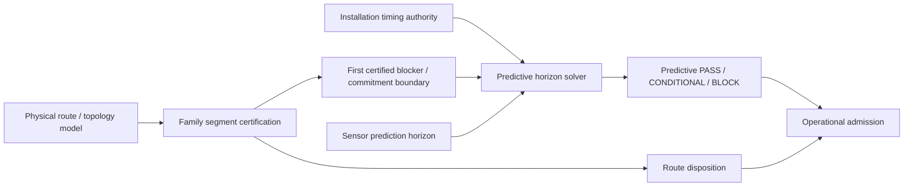
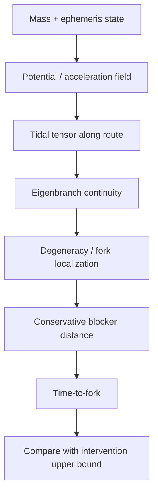

# Black Light FTL Route Blocker and Predictive Closure Manual

**Status:** derived engineering authority subordinate to the consolidated propulsion/transit authority and family-physics sources.  
**Design-intent source:** *The different lightspeed methods*.  
**Purpose:** connect family-specific route blocker localization to the certified time required for a particular installation to sense, decide, exit, clear, and recover.

---

## 1. The engineering question

Route safety and predictive safety answer different questions.

**Route safety asks:** where does the currently modeled path cease to be certifiable?

**Predictive safety asks:** does the installation possess enough trustworthy warning time to complete its certified intervention before that point becomes unavoidable?

The correct operational relation is therefore

\[
\boxed{\text{route geometry} + \text{installation timing} \rightarrow \text{escape feasibility}}
\]

not

\[
\boxed{\text{route score} \rightarrow \text{generic danger percentage}}.
\]

A good route model with a slow, damaged or rerouted ship can still be operationally unusable. A fast-response ship cannot make an intrinsically rejected route safe.

---

## 2. Authority separation



The family route solver owns the meaning and location of a route blocker. The predictive solver owns time-to-response mathematics. Neither may manufacture the other's evidence.

### Canon safeguards

\[
\boxed{\text{blocker probability}\neq\text{blocker distance}}
\]

\[
\boxed{\text{route distance}\neq\text{local hull velocity}}
\]

\[
\boxed{\text{predictive PASS}\not\Rightarrow\text{route ADMISSIBLE}}
\]

\[
\boxed{\text{route ADMISSIBLE}\not\Rightarrow\text{predictive PASS}}.
\]

---

## 3. Continuous projected-progress families

Where a family has a meaningful continuous route-progress coordinate, let the conservative distance from the current state to the first certified blocker be

\[
D_B^-.
\]

Let an upper bound on projected progress rate be

\[
v_p^+.
\]

Then the conservative time to the blocker is

\[
\boxed{t_B^- = \frac{D_B^-}{v_p^+}}.
\]

If blocker localization has bounded uncertainty \(u_D\), then

\[
D_B^- = \max(0,D_B-u_D).
\]

If projected progress has an upper uncertainty contribution \(u_v\), then

\[
v_p^+ = v_p+u_v.
\]

The combination is deliberately pessimistic: the blocker may be closer and the ship may progress toward it faster than the nominal model suggests.

### Available warning time

Let the conservative trustworthy prediction horizon be

\[
H_P^-.
\]

Then

\[
\boxed{t_{available}^- = \min(H_P^-,t_B^-)}.
\]

A sensor capable of predicting 30 s ahead provides no 30 s escape window if the certified blocker is only 7 s away.

---

## 4. Certified intervention time

The installation timing chain remains

\[
t_{int}
=t_{sensor}
+t_{solver}
+t_{decision}
+t_{command}
+t_{actuate}
+t_{exit}
+t_{clear}
+t_{margin}.
\]

For bounded stages

\[
t_i\in[l_i,u_i],
\]

use

\[
\boxed{t_{int}^{+}=\sum_i u_i}.
\]

The predictive timing margin is then

\[
\boxed{M_T=t_{available}^- - t_{int}^{+}}.
\]

with the governing rule

\[
\boxed{M_T<0\Rightarrow BLOCK}.
\]

A nonnegative margin may still be `CONDITIONAL` if an explicit engineering authority defines an advisory reserve.

---

## 5. Sectional rerouting and battle damage

A route to an actuator or termination system may survive while becoming slower.

For a service path \(p\),

\[
\tau_p=\sum_{e\in p}\tau_e.
\]

When the certified baseline delay is \(\tau_0\), only excess delay is charged against a baseline timing certificate:

\[
\boxed{\Delta\tau=\max(0,\tau_p-\tau_0)}.
\]

Thus a post-damage cross-tie can preserve reachability while destroying predictive margin.

\[
\boxed{\text{reachable}\neq\text{timely}\neq\text{certified}}.
\]

---

## 6. Gravitational-plane shear forks

A gravitational-plane family can localize route hazards through the predicted gravitational field rather than an arbitrary danger meter.

For appropriate weak-field conditions,

\[
\Phi(\mathbf r)=-\sum_j\frac{GM_j}{|\mathbf r-\mathbf r_j|}
\]

and

\[
\mathbf g=-\nabla\Phi.
\]

The local tidal tensor is

\[
T_{ij}=\frac{\partial g_i}{\partial x_j}.
\]

A shear-fork predictor can therefore track eigendirections/eigenvalues of the local tidal structure and identify where a previously continuous permitted branch becomes degenerate or bifurcates.



The blocker distance must come from the family route model. A generic maintenance system may not invent it from a probability or technology tier.

---

## 7. Metric-compression systems

Metric-compression systems may have continuous projected progress, but their blocker can be governed by curvature burden, field-unwind authority, or a region in which controlled relaxation can no longer complete safely.

The relevant blocker is therefore not simply 'nearest massive object.' It is the first interval at which the family-specific route certificate fails.

The predictive bridge consumes that certified boundary without reinterpreting why the boundary exists.

---

## 8. Slipstream-shear systems

For slipstream/shear systems the important blocker can be a boundary, adhesion loss, detachability loss, or a shear transition.

The bridge may use a route-derived conservative blocker distance when the family runtime supplies one, but it does not infer slipstream identity from race, manufacturer, or descriptive words such as 'gravitic slipstream.'

---

## 9. Inertial torch

The Inertial Torch is continuous but physically distinct from the exotic families. A blocker can correspond to collision geometry, braking insufficiency, thermal/acceleration limits, or failure to retain a stopping trajectory.

For ordinary braking under approximately constant usable deceleration \(a>0\),

\[
d_{stop}=\frac{v^2}{2a}.
\]

A more realistic certification should use bounded available deceleration and response delay:

\[
d_{req}^{+}=v^{+}t_{int}^{+}+\frac{(v^{+})^2}{2a^{-}}.
\]

The route is not operationally safe merely because an obstacle is farther away than the nominal braking distance if the control system cannot begin braking soon enough.

---

## 10. PRECOMMIT families

The following families retain PRECOMMIT semantics:

- Q-Lattice;
- N-Manifold;
- Fold Jump;
- Phase Displacement.

They do not receive a fabricated continuous projected speed.

Let the minimum trustworthy time remaining before commitment become effectively irreversible be

\[
t_C^-.
\]

Then

\[
\boxed{t_{available}^- = \min(H_P^-,t_C^-)}
\]

and

\[
M_T=t_{available}^- - t_{int}^{+}.
\]

A route solver may still identify endpoint/topology blockers, but predictive closure for these families is fundamentally a deadline problem rather than distance divided by speed.

---

## 11. Wormhole / gate systems

Gate transit is handled through admission state rather than free-flight route progress.

Relevant horizons can include:

\[
t_A^- = \text{minimum admission-state validity}
\]

\[
t_C^- = \text{minimum safe closure/rejection horizon}
\]

\[
t_P^- = \text{prediction validity}
\]

with

\[
\boxed{t_{available}^- = \min(t_A^-,t_C^-,t_P^-)}.
\]

No hull velocity through the wormhole is required for this certification.

---

## 12. Power and recovery coupling

Predictive escape is meaningless if the exit/recovery system cannot be powered through the intervention window.

For protected energy \(E_b\), available generation \(P_a\), and emergency load \(P_L\):

\[
P_d=\max(0,P_L-P_a).
\]

When \(P_d>0\),

\[
t_{hold}=\frac{E_b}{P_d}.
\]

The intervention is energy-feasible only when

\[
\boxed{t_{hold}\ge t_{int}^{+}}
\]

and the instantaneous delivery path separately satisfies

\[
P_{available}^{-}(t)\ge P_{required}^{+}(t).
\]

---

## 13. Thermal closure

For a short interval where a lumped model is valid,

\[
C_{th}\frac{dT}{dt}=P_{heat}-P_{reject}.
\]

The conservative heating rate is

\[
\left(\frac{dT}{dt}\right)_{max}
=\frac{P_{heat}^{+}-P_{reject}^{-}}{C_{th}^{-}}.
\]

If the emergency exit process itself drives the installation outside its certified thermal envelope before clearance completes, predictive timing must not be called safe merely because the command/actuator chain is fast enough.

---

## 14. Ar'nock embodiment

Ar'nock predictive closure should be embodied through the corrected technology authority:

```text
family-specific sensors
        ↓
solid-state conditioning
        ↓
silicon regional estimator
        ↓
deterministic decision / command network
        ↓
field or actuator module
        ↓
exit / clear machinery

piezoelectric diagnostics ──► alignment / actuator / structural health
```

Piezoelectric evidence can validate machinery condition and alignment. It does not become a gravity, topology, Q-state, or endpoint sensor unless a narrower authority explicitly connects that device to that measurement.

Typical service effects on predictive closure include:

- changed command propagation after a module or bus refit;
- altered actuator latency;
- timing-reference drift;
- field-former alignment shift;
- power-converter derating;
- cooling limits that lengthen recovery;
- changed vessel geometry requiring recertification.

---

## 15. Zwlei Mur'rek embodiment

Mur'rek machinery may express the same abstract timing chain through:

```text
Sensor Choir / Forward Sensor Ampulla
        ↓
Navigation Current reference state
        ↓
fluid / field control logic
        ↓
hydraulic vane response
        ↓
dielectric / gravitic field change
        ↓
detach / exit / recover
```

Power-fluid condition, hydraulic pressure, conductive coolant, dielectric-fluid state and vane response can all alter intervention time.

The source phrase **gravitic slipstream** remains source terminology and is not by itself a family assignment.

---

## 16. Scaling behavior

As vessel control span \(L_c\) grows relative to carrier propagation speed \(v_c\) and required response time \(\tau_r\),

\[
\Pi_c=\frac{L_c}{v_c\tau_r}
\]

increases.

Large vessels therefore require stronger regionalization:

| Scale | Predictive-safety consequence |
|---|---|
| Probe | central timing may remain acceptable |
| Shuttle | short deterministic chains dominate |
| Corvette | sectional isolation appears |
| Frigate | redundant sensing and command paths matter |
| Cruiser | regional solvers and local abort authority become useful |
| Capital | hierarchical prediction, local reserves and bounded cross-region latency are required |
| Fixed infrastructure | independent sectors, deep redundancy and remote state validation dominate |

The large ship is not safer merely because it contains more sensors. Shared references, common power, common software or long command routes can create correlated failure and latency.

---

## 17. Signature model

Predictive closure can create observable signatures without turning every drive into the same detector problem.

Possible engineering signatures include:

- high-rate sensor activity before a hazard;
- increased solver/power demand;
- synchronized reference updates;
- field-sector prebias;
- actuator preload or hydraulic pressure change;
- protected-store discharge/recharge;
- emergency cooling transients;
- gate aperture modulation.

Signature presence identifies activity, not necessarily intent or exact family state.

---

## 18. Failure codes

| Code | Meaning |
|---|---|
| `RPC-BLOCKER-UNRESOLVED` | family route solver provides no usable blocker/commitment authority |
| `RPC-DISTANCE-UNRESOLVED` | continuous family has no conservative route-derived blocker distance |
| `RPC-PROGRESS-UNRESOLVED` | continuous family lacks an upper progress-rate bound |
| `RPC-TIMING-UNRESOLVED` | intervention upper bound cannot be established |
| `RPC-MARGIN-NEGATIVE` | available time is shorter than intervention time |
| `RPC-ROUTE-BLOCK` | route itself is rejected regardless of predictive margin |
| `RPC-FAMILY-CONFLICT` | family identity/semantics conflict |
| `RPC-PROVENANCE-GAP` | blocker source cannot be traced to authority |
| `RPC-CANON-LEAK` | technology/race description attempted to select family or blocker physics |

---

## 19. Procedure RPC-01: route-to-escape certification

1. Resolve the transit family through explicit authority.
2. Resolve the physical/family route certificate.
3. Identify the first blocking interval or commitment/admission deadline.
4. Prefer the conservative blocker edge when route authority supplies one.
5. Record blocker provenance and units.
6. Resolve installation intervention timing from current sectional/service state.
7. Contract prediction horizon and blocker distance under bounded uncertainty.
8. Expand intervention/progress burden under bounded uncertainty.
9. Compute conservative available time.
10. Compute \(M_T\).
11. Verify protected power, energy and thermal support for the full intervention.
12. Preserve both route and predictive packets.
13. Pass both packets to operational admission; never average their dispositions.

---

## 20. Worked continuous example

Suppose a family-certified route reports a conservative blocker distance

\[
D_B^-=1.8\times10^8\;\text{m}
\]

and the upper projected route-progress rate is

\[
v_p^+=3.0\times10^7\;\text{m/s}.
\]

Then

\[
t_B^-=\frac{1.8\times10^8}{3.0\times10^7}=6.0\;\text{s}.
\]

If the trustworthy prediction horizon is 9.5 s,

\[
t_{available}^-=\min(9.5,6.0)=6.0\;\text{s}.
\]

If certified intervention upper bound is 5.4 s,

\[
M_T=6.0-5.4=0.6\;\text{s}.
\]

The result is nonnegative but may be only conditionally acceptable if an explicit authority requires, for example, 1.0 s of advisory margin. No such advisory number is universal and none should be invented where absent.

---

## 21. Worked reroute example

Certified command propagation:

\[
\tau_0=52\;\mu s.
\]

Damage reroutes command over

\[
\tau_p=141\;\mu s.
\]

Then

\[
\Delta\tau=89\;\mu s.
\]

That 89 microseconds belongs in the current intervention budget if the nominal 52 microseconds were already included in the baseline certificate. Charging all 141 microseconds would double-count baseline propagation.

---

## 22. Generator contract

A generator emitting predictive route closure should expose at least:

```text
family
routeSafetyPacket
firstBlocker / commitment authority
blockerDistanceM (continuous families only)
blockerDistanceKind
blockerSource
projectedProgressRateUpper (continuous families only)
predictionHorizonLower
interventionTimeUpper
uncertainty fields actually supported by evidence
predictiveSafetyHorizonPacket
routePredictiveClosureStatus
provenance
```

Unknown values remain unknown.

---

## 23. Educational text: Transit Safety Engineering 780

**Course:** Transit Safety Engineering 780 — Route Blocker Geometry and Escape Closure

Students should be able to:

- distinguish route certification from installation response certification;
- derive conservative time-to-blocker for continuous projected-progress systems;
- explain why PRECOMMIT systems require deadline rather than velocity semantics;
- trace sectional latency into emergency response time;
- identify when power, energy or thermal support invalidates an apparently adequate timing margin;
- preserve blocker provenance;
- reject probability-to-distance conversions without a physical model;
- prevent race/technology descriptors from selecting transit family;
- construct a complete route-to-admission evidence chain.

### Examination principle

A candidate who computes a beautiful time-to-blocker from an invented blocker distance has failed the exercise.

A candidate who computes a beautiful emergency response from nominal timing after the command bus has rerouted has also failed it.

The certificate exists only when both the route boundary and the machine response are supported by current evidence.

---

## 24. Final governing rule

\[
\boxed{
\text{safe departure requires knowing both where the route becomes unsafe and whether this installation can complete the certified escape before reaching it}
}
\]

That is the purpose of route-predictive closure.