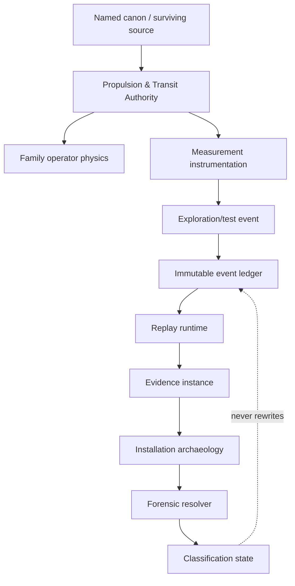
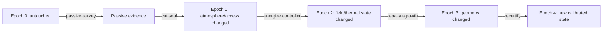
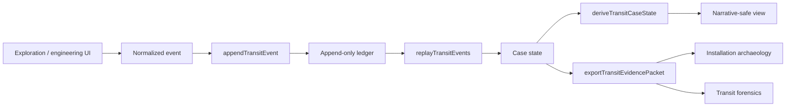

# Black Light FTL Runtime Event & Replay Engineering Manual

**Status:** `DERIVED` integration manual constrained by the consolidated propulsion/transit authority, the surviving FTL archive, current family-specific manuals, current measurement/evidence/archaeology/forensic registries, and the Google Drive source **The different lightspeed methods**.  
**Purpose:** define how observations, calibrations, access changes, tests, aborts, repairs, translations, and recertifications become durable case state without rewriting history, laundering inference into canon, or revealing an unresolved transit family.  
**Runtime companion:** `blacklight-exo-ftl-event-replay-runtime.js`  
**Machine-readable companion:** `data/exo-vessel/ftl-runtime-event-replay-registry.json`  
**Schema:** `data/schemas/exo-vessel-ftl-runtime-event-replay.schema.json`

---

## 1. Why this layer exists

The propulsion/transit corpus now distinguishes four things that earlier generic FTL tooling routinely collapsed:

1. what an instrument can observe;
2. what was actually observed;
3. what investigators infer from those observations;
4. what canon actually establishes.

Those are not interchangeable.

A transit investigation therefore needs a durable transition layer between field activity and interpretation. Without one, a repaired compartment can silently replace its damaged predecessor, a retranslation can overwrite an earlier reading, an active test can contaminate the very residue it was intended to inspect, or a later family hypothesis can leak backward into descriptions of earlier rooms.

The governing runtime principle is:

\[
\boxed{\text{record first}\rightarrow\text{replay deterministically}\rightarrow\text{derive second}\rightarrow\text{classify last}}
\]

The event log is historical evidence. The replayed case state is a reconstruction. A family classification is a derived result. None of those three objects should impersonate the others.

---

## 2. Authority chain



The runtime layer is deliberately subordinate. It owns **event ordering, preservation, replay, supersession, disclosure state, and provenance continuity**. It does not own family physics, race ownership, manufacturer attribution, historical invention, Path maturity, T-tier, or universal constants.

### Canon labels

| Label | Meaning in this manual |
|---|---|
| `CONFIRMED` | directly supported by current project authority within the stated scope |
| `DERIVED` | engineering consequence constrained by confirmed authority |
| `PROPOSED` | useful extension not independently established as setting canon |
| `UNRESOLVED` | source does not currently establish the value |
| `MIXED` | object contains more than one status and must retain field-level provenance |

---

## 3. Event sourcing model

Let the case state after event \(n\) be \(S_n\). Let \(E_n\) be the event and \(A_n\) the authority/provenance snapshot carried with it.

\[
S_{n+1}=F(S_n,E_n,A_n)
\]

This is not an assertion about Black Light physics. It is a software and forensic-accounting model.

The important invariant is that \(E_n\) is immutable after admission. If a later interpretation changes, the correction is appended as a new event.

### 3.1 Event identity

A runtime event contains at minimum:

| Field | Purpose |
|---|---|
| `eventId` | durable unique identity |
| `caseId` | investigation / vessel case |
| `epoch` | causal environment interval |
| `sequence` | authoritative within-epoch ordering |
| `eventType` | event reducer category |
| `observedAt` | timestamp metadata, not ordering authority |
| `authoritySnapshot` | source/revision basis applicable when recorded |
| `provenanceRoots` | ancestry roots for covariance and independence |
| `payload` | event-specific data |
| `status` | canon/provenance label |

Clock metadata can be wrong. Sequence order therefore outranks wall-clock time for deterministic replay.

### 3.2 Event classes

The current runtime recognizes:

`CASE_INITIALIZED`, `PASSIVE_MEASUREMENT`, `CALIBRATION_RECORDED`, `ACCESS_CHANGED`, `SAMPLE_COLLECTED`, `LOW_AUTHORITY_TEST`, `ABORT_TRIGGERED`, `REPAIR_OR_REGROWTH`, `TRANSLATION_REVISED`, `EVIDENCE_SUPERSEDED`, `FAMILY_HYPOTHESIS_UPDATED`, and `RECERTIFICATION_RECORDED`.

These are bookkeeping classes, not a claim that every civilization organizes engineering practice this way.

---

## 4. Append-only history

A later result must not silently edit an older one.

Bad:

```text
09:10  residue = topology-active
11:45  translator improved
09:10  residue = fold residue
```

Correct:

```text
09:10  PASSIVE_MEASUREMENT: untranslated topology-active residue
11:45  TRANSLATION_REVISED: archive noun now maps to "boundary closure"
11:47  EVIDENCE_SUPERSEDED: old interpretation no longer preferred
```

The physical observation remains where it occurred. Only the interpretation changes.

### 4.1 Integrity chain

A deterministic digest chain can detect local mutation or event reordering:

\[
h_n=H\left(h_{n-1}\parallel\operatorname{canon}(E_n)\right)
\]

The current JavaScript runtime uses a compact deterministic checksum suitable for replay integrity diagnostics. It is **not a cryptographic signature**, not proof of authorship, and not an in-universe technology claim.

---

## 5. Epochs and causal boundaries

Investigation changes wreckage.



An epoch boundary should be created whenever an intervention can materially alter later evidence: opening a sealed volume, changing atmosphere, cutting a conduit, collecting destructive samples, energizing hardware, changing reference clocks, repairing machinery, biological regrowth, moving a component, or recalibrating against a new standard.

The rule is:

\[
\boxed{\text{post-intervention evidence cannot be backdated into a pre-intervention epoch}}
\]

---

## 6. Observation weighting and provenance independence

The existing evidence model remains:

\[
W_o=R_oD_oP_oS_o
\]

where:

- \(R_o\) = reliability;
- \(D_o\) = detectability under current damage state;
- \(P_o\) = provenance independence;
- \(S_o\) = spatial specificity.

Replay does not recompute these factors merely because an event is newer.

If five displays read one cultivated controller, they may represent five presentations of one provenance root rather than five independent measurements.

```text
Controller C7
 ├─ display A
 ├─ display B
 ├─ archive mirror
 └─ translated maintenance panel

Independent evidence groups: 1, not 4
```

---

## 7. Negative evidence survives replay only with its observability proof

Absence remains conditional:

\[
A^- = I\,V\,R\,B\,S\,(1-D)
\]

where instrument capability, observed volume, resolution, bandwidth/dynamic range, marker survivability, and damage loss all matter.

A replayed statement such as “no throat-control structure was detected” must therefore retain the instrument and coverage conditions that made the absence meaningful.

A later geometry scan may make the earlier negative evidence stronger or weaker, but it does not alter the earlier event.

---

## 8. Family classification firewall

The runtime deliberately sets:

```text
familyAutoSelection = false
```

The eight current true-FTL families remain:

| Family | Runtime implication during investigation |
|---|---|
| Metric Compression | protect unwind reserve; require curvature/tidal observability |
| Gravitational-Plane Skimmer | require shear/fork observability and recoupling margin |
| Slipstream Shear | require adhesion/detachment evidence and Q-boundary observability |
| Q-Lattice | preserve address/epoch/reference ancestry |
| N-Manifold | preserve embedding and return-map admissibility |
| Fold-Jump | hard precommit endpoint/coverage/closure proof remains mandatory |
| Wormhole / Gate | distinguish throat, mouth synchronization, anchoring, chronology, closure |
| Phase Displacement | distinguish state coverage, target compatibility, continuity, reconciliation |

A runtime replay may carry family hypotheses. It may not manufacture the family.

### 8.1 Unknown-family active-test envelope

For an unresolved installation, let \(\mathcal A_f\) be the safe active-test envelope of each still-admissible family.

\[
\mathcal A_{unknown}\subseteq\bigcap_{f\in F_{admissible}}\mathcal A_f
\]

If the intersection is empty, active energization is forbidden.

That is a powerful practical result: uncertainty can reduce allowable test authority all the way to zero.

---

## 9. Abortability and observability

An emergency stop is not a button. It is a timing proof.

\[
T_{abort}\ge
 t_{detect}
+t_{validate}
+t_{command}
+t_{actuate}
+t_{decay}
+t_{margin}
\]

A test cannot be admitted if hazardous state growth can exceed the verified abort horizon.

The second invariant is equally important:

\[
\boxed{\text{loss of hazard observability}\Rightarrow\text{abort}}
\]

unless an independently validated guard channel remains available.

Sensor saturation, clipping, clock desynchronization, aliasing, bandwidth loss, neural incoherence, or translator failure cannot be treated as reassuring silence.

---

## 10. Protected recovery authority

Every family has some form of recovery capacity that must remain unavailable to experimental ambition.

\[
R_{available,test}=R_{total}-R_{protected}
\]

and admissible testing requires:

\[
R_{available,test}>0.
\]

The protected reserve can represent Metric unwind, Gravitational-Plane recoupling, Slipstream detachment, Q-Lattice rejection, N-Manifold return, Fold closure, Gate stabilization/closure, or Phase reconciliation.

The information-gain optimizer does not get to spend it.

---

## 11. Test selection

Information gain remains useful when constrained by hazard and evidence preservation:

\[
U_T=
\frac{IG(T)}
{1+\lambda_hH_T+\lambda_cC_T+\lambda_sS_T+\lambda_dD_T+\lambda_rR_T}.
\]

Where:

- \(H_T\) = hazard;
- \(C_T\) = evidence contamination;
- \(S_T\) = emitted signature;
- \(D_T\) = destructive cost;
- \(R_T\) = recovery burden.

The highest-information test can therefore be rejected in favor of a less informative but reversible measurement.

---

## 12. Pre/post comparison

A vessel can evolve without an experiment. Cooling, biological decay, regeneration, orbital environment, external gravity, or autonomous control can change measurements.

Therefore:

\[
\Delta y=y_{post}-M(y_{pre},\Delta t,\mathcal E)
\]

rather than simply \(y_{post}-y_{pre}\).

Shared references require covariance-aware treatment:

\[
\Sigma_{\Delta}
=
\Sigma_{post}
+J_M\Sigma_{pre}J_M^T
-2\operatorname{Cov}(post,M(pre)).
\]

This is particularly important for alien wreckage where both measurements may depend on the same damaged clock, cultivated neural reference, translation model, or reconstructed geometry.

---

## 13. Runtime architecture



The runtime is intentionally pure-data oriented. The event reducer does not manipulate DOM state and does not decide UI presentation.

### 13.1 API surface

`createInitialState(caseId, seed?)`
: creates an explicit case state. Missing canon-bearing values remain absent/unknown.

`appendTransitEvent(caseState, event, options?)`
: validates and applies one event without mutating the input state.

`replayTransitEvents(initialState, events, options?)`
: reconstructs state from the event stream.

`deriveTransitCaseState(state)`
: exposes derived classification/disclosure information without rewriting event history.

`compareTransitEpochs(state, epochA, epochB, model?)`
: prepares pre/post comparison while warning when interventions lie between epochs.

`exportTransitEvidencePacket(state, options?)`
: emits downstream evidence while preserving unresolved-family disclosure boundaries.

---

## 14. Replay modes

### STRICT

Use for deterministic validation and authoritative case loading. Duplicate IDs, backward epochs, non-monotonic sequence values, or malformed events reject replay.

### AUDIT

Use when inspecting damaged or legacy data. Valid events replay; invalid events are reported separately rather than silently repaired.

### NARRATIVE_SAFE

Use for player-facing or limited-access views. An unresolved family remains unnamed even if internal hypothesis objects exist.

This protects campaign discovery from implementation leakage.

---

## 15. Practical field procedures

### ER-01 — Case initialization

Record the case identifier, authority snapshot, untouched epoch number, known provenance roots, instrument inventory, inaccessible volumes, and all values that remain explicitly unknown. Do not pre-populate a family to make later forms easier.

### ER-02 — Passive measurement admission

Before admission, bind the observation to the instrument instance, calibration record, spatial frame, epoch, damage state, dynamic range, provenance roots, and raw/processed distinction.

### ER-03 — Access-change boundary

Opening, cutting, venting, moving, or exposing a previously isolated volume creates a new epoch when the intervention can alter later chemistry, fields, thermal state, contamination, or biological activity.

### ER-04 — Low-authority test admission

Verify the unknown-family safe-envelope intersection, abort horizon, guard-channel observability, protected recovery reserve, and evidence-contamination plan before energization.

### ER-05 — Abort event

Record the triggering channel, raw threshold crossing, validation latency, command latency, actuator response, decay interval, remaining reserve, and whether any primary hazard sensor was saturated or unavailable.

### ER-06 — Repair or regrowth

Treat structural healing, biological regeneration, replacement tissue, component substitution, cable rerouting, or geometry change as a calibration-breaking event whenever coverage or field geometry depends on shape.

\[
\boxed{\text{healed}\neq\text{recertified}}
\]

### ER-07 — Translation revision

Append the new lexical/semantic interpretation, record the previous translation event, retain clock/context confidence, and identify all derived conclusions that depended on the superseded reading.

### ER-08 — Evidence export

Export only accepted events and derived state appropriate to the recipient's disclosure authority. Narrative-safe export must not expose an unresolved family name.

---

## 16. Maintenance model for the event system

The event/replay subsystem itself has maintenance requirements:

| Maintenance target | Failure if neglected |
|---|---|
| event IDs | collisions / ambiguous supersession |
| ordering | non-deterministic reconstruction |
| provenance roots | false independence |
| calibration ancestry | false precision |
| epoch boundaries | contamination misattribution |
| family safeguards | premature classification |
| disclosure policy | campaign-information leakage |
| schema/runtime version | incompatible replay semantics |

A runtime version change that alters event semantics should trigger migration or explicit legacy replay handling. Silent reinterpretation is prohibited.

---

## 17. Scaling behavior

Large vessels create an evidence-volume problem as well as an engineering problem.

For approximately spatial sampling:

\[
N_{sample}\gtrsim\frac{V_{effective}}{V_{resolution}}.
\]

For data rate:

\[
R_{data}=\sum_i N_i b_i f_i.
\]

At large scale, aggressive preprocessing becomes tempting. Any lossy reduction capable of erasing short topology, Q-boundary, gravitic, synchronization, or reconciliation transients must therefore be recorded as a provenance transform.

Large biological installations add a second scaling term: regrowth can change the observed machine while the investigation is still in progress.

---

## 18. Power and infrastructure implications

The replay layer does not invent new drive power equations. It records the evidence necessary to evaluate existing family-specific power models.

Useful event-linked power records include:

- bus state and isolation state;
- stored energy and protected reserve;
- family-specific unwind/detachment/return/closure/reconciliation capacity;
- thermal capacity and current heat load;
- active-test energy ceiling;
- emergency loads actually observed during an abort;
- infrastructure dependencies such as gate mouths, beacons, remote clocks, anchors, or route references.

An absent infrastructure record is not proof of infrastructure independence.

---

## 19. Signature archaeology through replay

The cross-family signature vector remains multidimensional:

\[
\mathbf S_f=
[S_{EM},S_{thermal},S_{grav},S_Q,S_{topology},S_{neutrino},S_{wake},S_{traffic},S_{recovery}]_f.
\]

Race- or technology-basis specific channels may add biochemical, acoustic, vibratory, crystalline, optical, pressure, or other carriers where supported.

Replay gives signatures chronology. This matters because a wake-like residue before an investigator test and a wake-like residue created by the test are not equivalent evidence.

---

## 20. Failure model

The runtime distinguishes at least five classes of failure:

1. **physical transit-system failure** — governed by family engineering;
2. **instrument failure** — missing, saturated, damaged, aliased, or miscalibrated observation;
3. **provenance failure** — correlated evidence presented as independent;
4. **replay failure** — duplicated, reordered, malformed, or conflicting event history;
5. **classification failure** — inference promoted beyond evidence or canon.

The last three are epistemic failures, but they can still kill a crew if they cause the wrong machinery to be energized.

---

## 21. Ar'nock application

The Ar'nock derelict remains a useful canonical restraint case.

Existing authority supports biological fabrication, cultivated computation, nonhuman control assumptions, damaged networks, inaccessible spaces, and incomplete history. It does not establish the derelict's FTL family.

The runtime therefore allows records such as:

```text
PASSIVE_MEASUREMENT
  metabolically active conduit tissue
  provenance root: compartment C000 survey
  family implication: none by itself

ACCESS_CHANGED
  sealed vascular manifold opened
  epoch advances

REPAIR_OR_REGROWTH
  field-bearing membrane regrew across former tear
  consequence: prior geometry calibration invalid
```

It does not permit:

```text
REPAIR_OR_REGROWTH
  "Fold membrane healed"
```

unless the installation has already earned a Fold classification from higher authority or operator-specific evidence.

---

## 22. Educational text: what students should learn

### Undergraduate rule

A log entry is not a conclusion.

### Advanced engineering rule

A deterministic replay can be perfectly faithful to bad measurements. Event integrity is not measurement validity.

### Forensic rule

A corrected interpretation must preserve the earlier interpretation's existence because the path by which investigators changed their minds can itself reveal correlated assumptions or contamination.

### Canon rule

An inference can become an excellent engineering hypothesis without becoming setting history.

---

## 23. Research and thesis directions

The following are `PROPOSED` research programs, not confirmed setting history:

- covariance-aware family discrimination from event streams;
- optimal test planning under unknown-family safe-envelope intersections;
- causal inference across biological regrowth epochs;
- information-theoretic stopping rules for family classification;
- provenance graph compression that preserves independence structure;
- reversible active spectroscopy for topology-sensitive machinery;
- cross-civilization event ontology translation without assuming terrestrial maintenance categories;
- replay migration proofs across runtime schema versions.

---

## 24. Patent-style engineering concepts

The following are deliberately `PROPOSED` design concepts:

**Self-Ancestrying Sensor Packet**  
A measurement package that emits its calibration roots, clock ancestry, processing transforms, dynamic-range state, and contamination flags with every recorded observation.

**Abort-Proof Recorder**  
An independently powered event recorder whose write path remains alive after the main test controller enters protective shutdown.

**Regrowth Geometry Witness**  
A distributed spatial fiducial mesh for living machinery that records whether healed field-bearing tissue remains inside a previously certified geometry envelope.

**Disclosure-Safe Forensic Bus**  
A data interface that can expose observations and uncertainty to operators or players while withholding internal family labels until classification state authorizes them.

None of these names establish in-world manufacturers, inventors, dates, or prevalence.

---

## 25. Generator rules

A generator consuming this layer must obey all of the following:

1. never select a family merely because one has the highest current score;
2. never rewrite an earlier event after a later translation or interpretation;
3. never treat inaccessible space as positive evidence;
4. never count common-root observations as independent;
5. never backdate intervention-created signatures;
6. never use protected recovery reserve as experimental budget;
7. never continue an active test after hazard observability is lost unless an independent guard channel remains valid;
8. never call healed living machinery recertified without a recertification event;
9. never equate Q-MAP terminology with Phase Displacement without authority;
10. never expose a family name to a narrative-safe consumer before classification earns it.

---

## 26. Worked replay example

```text
Epoch 0 / Seq 0
CASE_INITIALIZED
Family: UNRESOLVED

Epoch 0 / Seq 1
PASSIVE_MEASUREMENT
annular field-bearing structure detected
coverage incomplete due collapsed section

Epoch 0 / Seq 2
PASSIVE_MEASUREMENT
remote-reference traffic recovered
same provenance root as local maintenance archive

Epoch 1 / Seq 0
ACCESS_CHANGED
collapsed section opened

Epoch 1 / Seq 1
PASSIVE_MEASUREMENT
second annular structure observed
new independent provenance root: direct geometry scan

Epoch 1 / Seq 2
FAMILY_HYPOTHESIS_UPDATED
Gate and Fold remain candidates
no classification promotion

Epoch 2 / Seq 0
LOW_AUTHORITY_TEST
reversible topology-response test admitted

Epoch 2 / Seq 1
ABORT_TRIGGERED
primary topology channel saturated
independent guard channel detected margin loss

Epoch 2 / Seq 2
FAMILY_HYPOTHESIS_UPDATED
Gate support increases
classification remains PROVISIONAL only if forensic promotion criteria are met
```

The important outcome is not which family wins. The important outcome is that every later conclusion can be reconstructed from retained events and provenance.

---

## 27. Origin and provenance statement

This manual is not a recovered in-universe textbook. It is a project engineering authority written from current Black Light source material and explicitly labeled derivation. Its family behavior inherits from the recovered FTL corpus and subsequent family technical volumes. Its treatment of gravity, miscalculation, sensor maturation, emergency behavior, and imperfect safety margins is constrained by **The different lightspeed methods**. Its event-sourcing and replay mathematics are implementation/forensic techniques used to preserve the distinction between observation, inference, and canon.

Where this manual offers software architecture, checksum strategy, event ontology, thesis programs, or patent-style devices, those elements are `DERIVED` or `PROPOSED` unless a higher source later promotes them.

---

## 28. Final doctrine

Black Light FTL investigation must be able to answer not only:

> What do we currently think this machine is?

but also:

> What did we observe, when did we observe it, what had we already changed, which instruments and references produced it, what did we believe at the time, what later evidence changed that belief, and which part of the final answer is canon rather than inference?

If the system cannot answer those questions, it does not yet have enough provenance to call the result authoritative.
