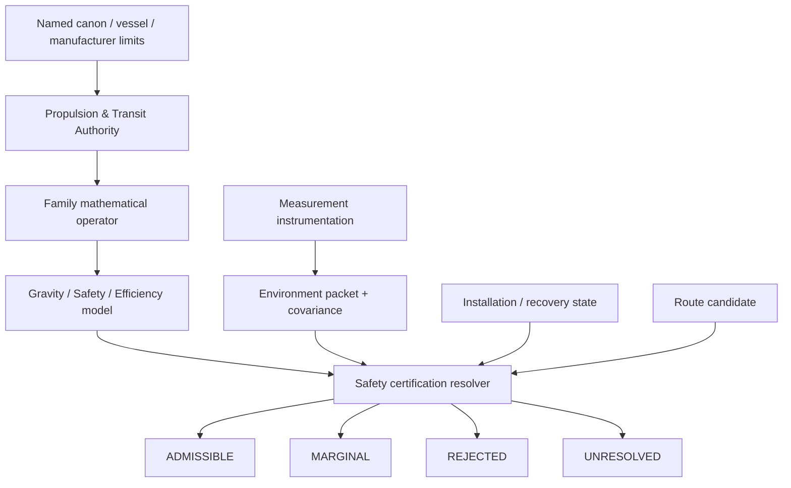
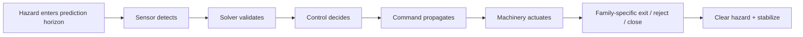

# Black Light FTL Safety Certification, Lookahead & Emergency Egress Operations Manual

**Status:** subordinate practical engineering, certification, education, and API reference.  
**Authority:** subordinate to named race/manufacturer/vessel/installation canon and `BLACK_LIGHT_PROPULSION_TRANSIT_AUTHORITY.md`; operationalizes `BLACK_LIGHT_FTL_GRAVITY_SAFETY_EFFICIENCY_MODELS.md`, the measurement/evidence chain, and current family operator physics.  
**Design-source impetus:** Google Drive document **“The different lightspeed methods”**, document id `1e0Xp71EFubBZgXWjjvPxAqPoJIZNwqS6nu1-r7Kil7Y`, observed revision `ANLCKQllC5h6dLaX5H1RpK8aUFVWsi-IV7gbMHUd0Qq7mIe5uGsLFi5_Hrsr8B6dl8t_ezB0fTSygxrnIBtifAHW79bgSbswp1zF3NaEil0`.  
**Machine-readable companion:** `data/exo-vessel/ftl-safety-certification-registry.json`.  
**Validation contract:** `data/schemas/exo-vessel-ftl-safety-certification.schema.json`.  
**Runtime:** `blacklight-exo-ftl-safety-certification-runtime.js`.  
**Authority-chain index supplement:** `data/exo-vessel/propulsion-transit-authority-manifest.json`.

---

## 1. What this manual adds

The existing gravity/safety model already establishes the mathematical intent: all true transit systems are affected by gravitational terrain, but **not in the same way**; environmental uncertainty becomes family-specific calculation error; sensor lookahead must remain ahead of intervention time; and advanced technology increases safety margin without granting absolute safety.

This manual turns those principles into a certification discipline with stable machine-readable terms and an executable resolver.

The central operational rule is:

\[
\boxed{\text{No certified hazard observability} \;\Rightarrow\; \text{no certified transit authority}}
\]

The second is equally important:

\[
\boxed{\text{More power} \not\Rightarrow \text{more safety}}
\]

A reactor can provide more field energy. It cannot repair an invalid endpoint reference, an unseen shear fork, an ill-conditioned return map, a saturated sensor channel, or an unavailable closure path merely by producing more power.

---

## 2. Authority and provenance chain



The certificate is not canon by itself. It is a reproducible engineering conclusion over a declared authority snapshot, environment epoch, measured installation state, calibration profile, and route candidate.

A later measurement can invalidate an earlier certificate without rewriting the earlier historical record.

---

## 3. Certified environmental state

A transit navigator does not receive a single number called “gravity.” The minimum environment state is a vector:

\[
\mathbf E_g=
[
|\Phi|,
|\nabla\Phi|,
\|\mathsf T\|,
\|R\|,
U_m,
P_{hidden},
B_f
]^T
\]

where:

- \(\Phi\) is a potential-like gravity term;
- \(\nabla\Phi\) captures acceleration/gradient;
- \(\mathsf T\) is the tidal tensor;
- \(R\) is a curvature measure where the family requires it;
- \(U_m\) is mass-model uncertainty;
- \(P_{hidden}\) is hidden/unmodeled mass probability;
- \(B_f\) is a family-specific boundary/topology hazard term.

The uncertainty state remains separate:

\[
\mathbf U_E=
[
\Sigma_{eph},
\Sigma_{mass},
\Sigma_{clock},
\Sigma_{sensor},
\Sigma_{reg},
\Sigma_{model},
\Sigma_{common}
]^T.
\]

That separation is deliberate. A route through a severe but exquisitely measured field is a different engineering problem from a route through modest gravity with poor mass knowledge.

---

## 4. Environmental penalty and calibration discipline

A family-specific gravity penalty may be represented by

\[
P_f=a_fG+b_fG^2+c_fG^{n_f}+d_fU_m+e_fB_f
\]

and

\[
\eta_{g,f}=e^{-P_f}.
\]

The source design intent supports the **shape** of this behavior: burden rises rapidly as the environment becomes less compatible with the operator. It does **not** supply canonical numerical coefficients.

Therefore every numerical coefficient set must live inside a named calibration profile with provenance, version, gameplay purpose, and scope.

The runtime intentionally refuses to calculate a numerical severity when a complete labeled calibration profile is absent.

That refusal is correct behavior.

---

## 5. Miscalculation is family physics, not generic dice noise

Let environmental/model error be \(\delta E\). A first-order family response is

\[
\delta y_f \approx J_{f,E}\delta E + J_{f,\Theta}\delta\Theta.
\]

Define

\[
A_f=\|J_{f,E}\|.
\]

A convenient derived calculation-efficiency form is

\[
\eta_{calc,f}=\exp[-k_f A_f^2\operatorname{tr}(\Sigma_E)].
\]

Two drives observing the same environment through the same sensors can therefore suffer very different practical uncertainty.

This is one of the strongest continuity requirements in the Black Light transit corpus: **sensor quality alone does not determine safety; the operator's sensitivity to sensor error matters just as much.**

---

## 6. Lookahead is a race between prediction and intervention

Define prediction horizon

\[
H_s=v_{proj}t_{predict}.
\]

Define total intervention time

\[
t_{int}=t_{sensor}+t_{solver}+t_{decision}+t_{command}+t_{actuate}+t_{exit}+t_{clear}+t_{margin}.
\]

For route representations where projected progress rate is physically meaningful,

\[
D_{int}=v_{proj}t_{int}
\]

and

\[
M_H=H_s-D_{int}.
\]

The certification requirement is

\[
M_H>0.
\]

For nonlocal or commit-bound operators, the same logic is evaluated in **decision time**, not by pretending the vessel has a local superluminal hull velocity.



If the hazard reaches the irreversible boundary before step H, the certificate fails even if the sensors eventually identify the problem perfectly.

---

## 7. Maturity does not mean magic

The Path ladder now has a safety meaning in addition to speed/range/implementation maturity.

| Path | Environment knowledge | Lookahead | Emergency authority | Redundancy character |
|---|---|---|---|---|
| P0 | static or pre-surveyed | local test volume | reject before test commitment | one certified chain |
| P1 | local dynamic | immediate route segment | basic shutdown / decouple | duplicate guard begins |
| P2 | full local multi-body | route-scale | controlled termination | separate safety chain |
| P3 | mobile long-baseline | beyond immediate segment | shipboard emergency exit where physics permits | independent guard + recovery reserve |
| P4 | probabilistic multi-sector | several intervention windows | layered family-specific recovery | diverse sensing physics |
| P5 | hidden-terrain prediction | strategic | preemptive reroute / alternate reference / protected shunt where valid | common-cause analysis |
| P6 | adaptive probabilistic field solution | maximum useful observable horizon | rapid re-solve plus layered recovery | degraded-mode certification |

A P6 installation can be safer because it predicts farther, models better, reacts faster, has more independent observations, has more capable recovery hardware, and can choose better-conditioned routes.

It is not safe because the universe stopped being dangerous.

---

# 8. Family-specific certification doctrine

## 8.1 Metric Compression Envelope

### Observables

Metric residual, tidal gradient, boundary closure, horizon geometry, field symmetry, protected-volume coverage, and unwind reserve.

### Machinery embodiment

Certification normally touches distributed field-formers, reference baselines, envelope metrology, structural strain sensing, energy-conditioning buses, field-collapse sinks, timing references, and independent safety controllers.

Different technology bases may realize these functions as coils, pressure-fed superconducting cavities, mineral photonic lattices, biological field organs, or postmaterial control surfaces. The end effects remain the same.

### Failure criterion

An envelope can be powerful enough to form and still be unsafe to close.

A useful state vector is

\[
\mathbf M=[\epsilon_{closure},\epsilon_{sym},L_{tidal},R_{unwind},C_{sensor}]^T.
\]

When closure residual, asymmetry, or tidal loading outruns the verified unwind envelope, the route is rejected or the drive must lower authority.

### Emergency doctrine

Metric recovery is **unwind**, not “turn it off.” Energy, field momentum, accumulated boundary radiation, and asymmetric load must be dumped in a controlled sequence.

---

## 8.2 Gravitational-Plane Skimmer

This family is the most direct expression of the Drive source's warning about gravitational shear lanes.

The environment is literally part of the road.

Let tidal eigendirections satisfy

\[
\mathsf T\mathbf e_k=\lambda_k\mathbf e_k.
\]

A fork hazard can be summarized by

\[
H_{fork}=c_1c_2\sin^2(\Delta_b/2)K_fQ_f.
\]

### Required safety package

- long-baseline gravimetry;
- tidal eigensolver;
- hidden-mass residual mapping;
- lane curvature prediction;
- independent branch/fork guard;
- plane-decoupling authority;
- recoupling solution cache.

### Failure sequence

```text
unmodeled mass / changing multi-body geometry
                    ↓
              lane solution forks
                    ↓
      incompatible branch coupling grows
                    ↓
       field + structural differential load
                    ↓
 decouple before certified fork threshold OR fail
```

The safety computer is forbidden from choosing a fork merely because one branch is faster after the coupling state has become structurally ambiguous.

---

## 8.3 Hyperspatial Slipstream Shear

The principal certification problem is not “is gravity low?” but whether the normal/Q correspondence remains well conditioned and whether boundary adhesion can be safely shed.

Define

\[
\kappa_Q=\|J_Q\|\|J_Q^{-1}\|.
\]

Large \(\kappa_Q\) means small state error can produce large exit error.

### Required safety package

- Q-boundary / weather proxy sensing;
- adhesion state metrology;
- wake/shear prediction;
- exit correspondence solver;
- protected detachment energy;
- post-detachment inertial stabilization.

A route is unsafe when the exit correspondence evolves faster than the system can sense, solve, command, and detach.

---

## 8.4 Q-Lattice Phase Translation

The certification object is an address/reference solution.

\[
r_Q=[\Delta a,\Delta\phi,\Delta\tau,\Delta E_{env}]^T
\]

and safe translation requires a bounded residual such as

\[
r_Q^TWr_Q\le J_{max}.
\]

### Required safety package

- phase and epoch clocks with recorded ancestry;
- address covariance monitor;
- independent destination authentication;
- rejection authority;
- alternate certified address graph where available.

A display agreeing with another display is not redundancy if both derive from one corrupted phase reference.

---

## 8.5 N-Dimensional Manifold Drive

The danger is an attractive shortcut with an unstable return map.

Let \(\kappa_\pi\) be the return-map condition number.

A route can become uncertifiable even while higher-dimensional path length remains excellent.

### Required safety package

- manifold tomography proxy;
- dimensional-axis state monitoring;
- return-map condition estimator;
- ordinary-space registration array;
- protected re-embedding solution;
- axis reserve.

Higher Path systems gain safety chiefly by detecting bad conditioning earlier and having more valid embeddings available—not by making all embeddings safe.

---

## 8.6 Discrete Fold-Jump

Fold safety is overwhelmingly precommit safety.

For destination uncertainty \(\Sigma_B\), define clearance margin

\[
M_{clear}=d(\partial V_B,O)-k_\sigma\sqrt{\lambda_{max}(\Sigma_B)}.
\]

The fold is rejected if the remote volume is not sufficiently clear.

### Required safety package

- endpoint covariance mapper;
- occupancy exclusion sensing;
- topology residual monitor;
- commit-state guard;
- closure/ringing metrology;
- protected closure sink.

The runtime does not invent mid-fold steering. Once the operator is inside a noncorrectable commit state, safety becomes closure/recovery rather than route correction.

---

## 8.7 Anchored Wormhole / Gate Transit

Gate safety is infrastructure engineering.

For throat radius \(r_0\), a useful tidal load term is

\[
L_T\sim r_0\|\mathsf T_{env}\|.
\]

Aperture margin may be represented as

\[
M_W=S_{throat}-L_T-L_{flow}-L_{sync}.
\]

### Required safety package

- throat geometry sensing;
- paired-mouth clocks and reference ancestry;
- tidal load sensing;
- mass-flow metrology;
- anchor structural network;
- independent closure control.

A gate may be safe for an empty aperture and unsafe for the same aperture under asymmetric mass flow.

---

## 8.8 Quantum Phase Displacement

The certification question is whether the complete transported state and the destination state are mutually admissible.

\[
\Psi_B\in\mathcal S_B(E).
\]

### Required safety package

- whole-object state coverage;
- destination reference authentication;
- occupation exclusion;
- continuity-invariant bookkeeping;
- reconciliation reserve;
- post-arrival state audit.

Post-commit “course correction” is not assumed. The family recovers through state reconciliation and verified destination handling.

---

## 8.9 Relativistic Inertial Torch

The torch is included as the control case precisely because it does not have exotic transit failure.

\[
\ddot{\mathbf x}=\mathbf a_{prop}+\mathbf g(\mathbf x,t)
\]

Its safety problems are trajectory, collision horizon, thermal load, proper acceleration, braking reserve, relativistic navigation, and reaction mass/energy.

This keeps the setting honest: not every dangerous high-speed transit problem needs an exotic field explanation.

---

# 9. Recovery reserve is protected capacity

A safety-certified installation reserves recovery authority before nominal performance is calculated.

\[
R_{available,nominal}=R_{total}-R_{protected}.
\]

The required condition is

\[
R_{protected}\ge R_{required,recovery}.
\]

The generator may not spend the last unwind, recoupling, detachment, rejection, return-map, closure, throat-stabilization, or reconciliation capacity to increase advertised range.

This produces realistic engineering behavior: vessels often carry apparently “unused” capacity because that capacity is not actually available for routine operation.

---

# 10. Common-cause redundancy

Suppose nominally independent detectors have miss probabilities \(p_i\). Only if they are genuinely independent may we write

\[
P_{miss}=\prod_i p_i.
\]

If the sensors share one reference clock, one forward aperture, one model, one power bus, one translated archive, one biological sense organ, or one controller, a common-cause term must remain explicit.

A safe design therefore seeks **diverse sensing physics**, not simply more copies.

Examples:

| Hazard | Weak redundancy | Stronger redundancy |
|---|---|---|
| gravity fork | three displays from one gravimeter | independent baselines + separate mass-model inference |
| fold endpoint | duplicated software on one remote reference | independent reference ancestry + occupancy channel |
| gate throat | multiple strain gauges on one support | geometry metrology + field residual + structural strain |
| slipstream adhesion | duplicated boundary processor | boundary interferometry + wake response + independent exit-map check |
| Q address | mirrored displays | separate clock ancestry + destination authentication |

---

# 11. Signature and safety are coupled

Longer lookahead often requires more powerful active sensing, larger baselines, remote beacons, or infrastructure.

Therefore safety systems can increase detectable signature.

A mission planner should preserve a signature vector

\[
\mathbf S=[S_{EM},S_{thermal},S_{grav},S_Q,S_{topology},S_{wake},S_{active},S_{network}]^T.
\]

A low-signature transit mode may deliberately reduce active sensing and therefore reduce certified route authority.

The generator must not offer full tactical stealth **and** maximum safety lookahead for free unless a named technology explicitly earns both.

---

# 12. Scaling behavior

Safety burden scales with more than vessel mass.

A useful derived burden model is

\[
B_{safe}=F(V_{protected},L_{baseline},N_{channels},R_{data},\tau_{response},\Sigma_{sync},R_{recovery},\mathcal E_g).
\]

Larger vessels may need:

- longer field-coverage baselines;
- more spatial modes;
- greater synchronization accuracy across the hull;
- higher sensor data rate;
- larger protected recovery reserves;
- stronger structural instrumentation;
- more independent failure zones;
- more time to propagate commands through distributed machinery.

Miniaturization has the opposite problem: shrinking the prime mover is not enough if the certified sensor baseline, timing reference, heat sink, or recovery hardware does not shrink proportionally.

---

# 13. Practical Equipment Manual SC-01 — Environmental Baseline Certification

**Purpose:** create the environment packet used by a route certificate.

1. Bind an environment epoch and coordinate frame.
2. Load current ephemerides and visible mass model.
3. Measure local acceleration and gradient.
4. Measure tidal tensor where the family requires it.
5. Record curvature/topology proxy where applicable.
6. Compare prediction with observation and calculate mass-model residual.
7. Record hidden-mass probability rather than forcing the model to agree.
8. Bind clock, sensor, registration, and model covariance.
9. Reject saturated or resolution-limited channels as negative evidence.
10. Export the packet with raw provenance.

**Acceptance:** every term used by the downstream calibration profile is measured or explicitly `UNRESOLVED`.

---

# 14. Practical Equipment Manual SC-02 — Safety Sensor Independence Audit

**Purpose:** determine whether apparently redundant channels are actually independent.

For every safety-critical channel, trace:

```text
sensor head
   ↓
local conditioning
   ↓
clock/reference
   ↓
data bus
   ↓
solver/model
   ↓
control processor
   ↓
actuator path
```

Two channels sharing a critical ancestor belong to the same common-cause group for that ancestor.

**Reject** safety claims that multiply correlated channels as if independent.

---

# 15. Practical Equipment Manual SC-03 — Actionable Lookahead Test

1. Select the worst credible detectable route hazard.
2. Measure sensor latency.
3. Measure solver latency.
4. Measure validation/decision latency.
5. Measure command propagation.
6. Measure actuator response.
7. Measure family-specific exit/closure/rejection time.
8. Add clearance and engineering margin.
9. Compare the complete chain against the prediction horizon.
10. Repeat in degraded sensor and control states.

The test passes only if the hazard remains actionable, not merely visible.

---

# 16. Practical Equipment Manual SC-04 — Protected Recovery Reserve Test

1. Establish total recovery-capable authority.
2. Identify the physically required recovery function for the family.
3. Reserve the minimum certified capacity.
4. Lock routine performance calculations out of that reserve.
5. Simulate the highest-authority permitted route.
6. Verify that recovery remains possible after the worst credible nominal expenditure.
7. Repeat with one credible failure zone unavailable.

A route that needs the protected reserve merely to complete nominal transit is not certified at that authority.

---

# 17. Practical Equipment Manual SC-05 — Gravity-Shear Fork Survey

**Primary family:** Gravitational-Plane Skimmer.  
**Secondary use:** any family whose route model depends strongly on gravitational terrain.

1. Map the tidal tensor over the route volume.
2. Extract principal eigendirections.
3. Track lane curvature with time.
4. Search for branch competition and hidden-mass residuals.
5. Calculate branch separation and coupling uncertainty.
6. Propagate the fork through vessel response latency.
7. Confirm a decoupling window exists before the structural/field threshold.
8. If not, reroute or reduce authority.

Never allow the route solver to hide a fork by averaging the two branches into a mathematically smooth but physically nonexistent centerline.

---

# 18. Practical Equipment Manual SC-06 — Commit-Boundary Certification

This procedure applies to Fold, Q-Lattice, Phase Displacement, and any operator whose ability to correct changes sharply at commitment.

1. Identify the final reversible state.
2. Identify every condition that must be proven before crossing it.
3. Verify destination/reference validity.
4. Verify protected-volume or whole-object coverage.
5. Verify occupancy/exclusion where applicable.
6. Verify recovery/closure/reconciliation reserve.
7. Confirm the safety chain has no unresolved required input.
8. Commit only while the certificate remains valid.

After the commit boundary, the system must not pretend a precommit option still exists.

---

# 19. Practical Equipment Manual SC-07 — Degraded-Mode Recertification

A damaged installation does not retain its old certificate automatically.

Examples requiring recertification include:

- sensor loss;
- changed clock reference;
- repaired field former;
- biological regrowth;
- replaced fluid or dielectric medium;
- hull deformation;
- changed remote beacon;
- changed software/solver;
- rerouted power/control bus;
- new environmental epoch.

The governing doctrine remains:

\[
\boxed{\text{repaired or healed}\neq\text{recertified}}
\]

---

# 20. Practical Equipment Manual SC-08 — Route Certificate Review

The reviewing engineer should be able to answer, from the record alone:

- Which source establishes the family/operator?
- Which Path and T-tier are implementation/runtime values rather than historical canon?
- What environment epoch was used?
- Which sensors measured it?
- What calibration profile supplied numerical coefficients?
- Which hazards are directly observable?
- Which hazards depend on model inference?
- What is the lookahead margin?
- What is the family-specific abort state?
- What capacity is protected for recovery?
- Which safety channels share common causes?
- What changed since the last certificate?

If those answers require oral tradition from the engineer who ran the calculation, the record is incomplete.

---

# 21. API contract

The primary resolver is:

`resolveTransitSafetyCertificate(context)`

### Inputs

```json
{
  "certificateId": "<id>",
  "subjectId": "<vessel or installation>",
  "family": "<confirmed/resolved family>",
  "path": "p0-p6",
  "sharedTier": "t0-t8",
  "authoritySnapshot": {},
  "environmentPacket": {},
  "routeCandidate": {},
  "measurementPacket": {},
  "safetyState": {},
  "recoveryState": {},
  "requiredHazards": [],
  "calibrationProfile": {},
  "provenance": []
}
```

### Outputs

The runtime returns environment severity, family response, calculation efficiency where bounded, lookahead margin, hazard observability, recovery reserve, common-cause warning state, route adjustments, certificate status, reasons, and provenance.

It does **not** choose a family.

`familyAutoSelection = false` is a deliberate canon safeguard.

---

# 22. Runtime refusal modes

The safety runtime returns `UNRESOLVED` rather than filling gaps when:

- a complete labeled calibration profile is missing;
- required environment terms are missing;
- uncertainty cannot be bounded;
- route progress/decision semantics are unspecified;
- timing chain is incomplete;
- recovery authority is unmeasured.

It returns `REJECTED` when:

- actionable lookahead is non-positive;
- required hazard observability is lost without an independent guard;
- protected recovery reserve is inadequate;
- another explicit certification invariant fails.

A user interface may simplify these outcomes visually. It may not reinterpret them.

---

# 23. Race- and technology-specific embodiment

Safety certification deliberately separates **operator physics** from **machine embodiment**.

An electromechanical civilization might use phased gravimeters, superconducting clocks, fiber timing networks, and servo-actuated decouplers.

A biological civilization might use distributed gravitic sensory organs, cultivated timing tissue, vascular field-control organs, and metabolic recovery sacs.

A mineral-photonic civilization might use interferometric crystal trunks, piezoelectric strain lattices, phase-locked optical references, and fracture-isolated reserve nodes.

A fluidic gas-giant civilization might represent route hazards as pressure/current topology and physically embody safety channels in separated electrofluidic pathways.

The certification record should describe the actual embodiment while preserving the stable end-effect vocabulary so two alien machines can be compared without pretending they are built alike.

---

# 24. Zwlei / Mur'rek application

The named Mur'rek source establishes a bio-reactive gravitic slipstream installation and machinery such as the Gravitic Slipstream Regulator and Navigation Current Well, but the consolidated FTL family remains unresolved.

Therefore this safety resolver may be used only after the Mur'rek discrimination chain provides a sufficiently authoritative operator-family result for the specific safety calculation.

Before that point, active tests remain constrained by the intersection of the safe envelopes of all admissible hypotheses:

\[
\mathcal A_{unknown}\subseteq\bigcap_{h\in H_{admissible}}\mathcal A_h.
\]

The existence of a Current Well is not permission to assume Gravitational-Plane safety semantics. The word *slipstream* is not permission to assume Q-boundary detachment semantics.

---

# 25. Ar'nock application

The Ar'nock derelict remains an example of the opposite problem: a rich biological/cultivated machinery basis without an established FTL family.

A safety certificate cannot exist merely because the wreck contains sophisticated navigation, field, power, or computation organs.

The investigation must first establish operator-level evidence through the existing measurement → evidence → installation archaeology → forensic chain.

Until then, family-specific emergency semantics are `UNRESOLVED` and active testing remains bounded by the common-safe-envelope doctrine.

---

# 26. Educational text — Transit Safety Engineering 101

### Learning objective

Students must stop thinking of an FTL drive as a speed number.

A complete transit system is a coupled machine containing:

1. an operator;
2. a route/environment model;
3. sensors;
4. a solver;
5. control machinery;
6. structural/field coverage;
7. termination machinery;
8. recovery reserve;
9. provenance sufficient to know which assumptions are real.

### Exercise

Give students identical sensors and identical environmental covariance for Metric, Gravitational-Plane, and Fold systems. Ask why the same measurement uncertainty yields different operational risk.

Correct answer: the family Jacobians, commit semantics, recovery options, and characteristic failure modes are different.

---

# 27. Educational text — Transit Safety Engineering 301

Students build a route certificate from a supplied environment packet.

They must calculate or symbolically preserve:

- environmental severity;
- family penalty;
- miscalculation amplification;
- lookahead margin;
- common-cause sensor groups;
- recovery margin;
- route status.

Marks are deducted for invented zeroes, unlabelled calibration constants, treating correlated sensors as independent, or silently substituting equivalent speed for physical latency.

---

# 28. Graduate seminar — Failure-Causal Transit Engineering

Research questions include:

- How should hidden-mass probability propagate into gravitational-plane route rejection?
- How does a slipstream system estimate exit-map conditioning when its strongest sensors are themselves distorted by the boundary state?
- What topology metrics best predict gate closure margin under asymmetric traffic?
- How should a biological transit machine prove calibration after regrowth?
- How does one certify a phase-displacement continuity invariant without allowing the certificate generator to define personhood by fiat?
- How should tactical signature constraints trade against active lookahead?

These are deliberately framed as engineering questions rather than opportunities to canonize unsupported historical answers.

---

# 29. Thesis program proposals

## Thesis ST-01 — Receding-Horizon Fork Avoidance

Develop a probabilistic branch predictor for gravitational-plane lanes with explicit hidden-mass uncertainty and a certified decoupling horizon.

## Thesis ST-02 — Common-Cause Sensor Graphs

Represent safety channels as dependency graphs and compute effective redundancy after removing shared clock, power, model, aperture, and control ancestors.

## Thesis ST-03 — Biological Recertification After Regrowth

Study how healed field organs can satisfy biological health metrics while violating geometric/timing calibration.

## Thesis ST-04 — Safety/Signature Pareto Frontiers

Quantify how passive sensing, active probing, beacon dependence, and network queries alter both route safety and detectability.

## Thesis ST-05 — Commit-Safe Nonlocal Operators

Construct formal precommit certificates for Fold, Q-Lattice, and Phase Displacement without inventing post-commit maneuverability.

---

# 30. Patent-style technology concepts

The following are `PROPOSED` development concepts, not retroactive canon.

### PT-SAFE-01 — Provenance-Isolated Hazard Guard

A physically and computationally independent safety channel whose clock, power, model, and sensing ancestry are intentionally separated from the primary navigation chain.

**Changed terms:** reduces common-cause covariance; preserves hazard observability after primary-chain loss.

### PT-SAFE-02 — Recovery-Reserve Hardware Escrow

A control architecture that makes protected recovery capacity unavailable to nominal performance scheduling without an explicit emergency state transition.

**Changed terms:** enforces \(R_{available,nominal}=R_{total}-R_{protected}\).

### PT-SAFE-03 — Distributed Lookahead Fusion Lattice

A family-neutral data architecture that carries independent hazard channels and covariance ancestry without collapsing them into one confidence score.

**Changed terms:** lowers solver latency and prevents false independence.

### PT-SAFE-04 — Adaptive Calibration Envelope

A calibration system that marks which numerical safety coefficients remain valid under current vessel scale, environment, damage state, and Path implementation.

**Changed terms:** prevents stale gameplay/manufacturer calibration from being applied outside scope.

---

# 31. Generator integration rules

The generation order is now:

```text
authority
  → family/operator
    → Path/T implementation
      → technology/race embodiment
        → installation state
          → environment epoch
            → measured covariance
              → nominal route
                → family environmental response
                  → safety lookahead
                    → abort/recovery proof
                      → common-cause audit
                        → certificate
                          → selectable route/UI presentation
```

The UI sits at the end.

A route does not become safe because a green button was drawn for it.

If the certificate fails, the generator may lower authority, reroute, seek better measurements, restore redundant sensing, increase recovery reserve, or reject transit. It may not alter the physical inputs until the calculation passes.

---

# 32. Certificate example

```json
{
  "certificateId": "EXAMPLE-ONLY",
  "subjectId": "training-vessel",
  "family": "gravitational-plane",
  "path": "p4",
  "sharedTier": "t4",
  "environmentEpoch": "training-epoch",
  "environmentSeverity": {"value": null, "status": "UNRESOLVED"},
  "familyResponse": {"gravityEfficiency": null, "calculationEfficiency": null},
  "sensorLookahead": {"margin": null, "status": "UNRESOLVED"},
  "hazardObservability": {"lost": [], "status": "ADMISSIBLE"},
  "recoveryReserve": {"margin": null, "status": "UNRESOLVED"},
  "status": "UNRESOLVED",
  "reasons": ["No labeled calibration profile supplied."],
  "canonStatus": "MIXED"
}
```

This is intentionally less exciting than fabricated precision.

It is also correct.

---

# 33. Canon safeguards

1. The Drive document establishes design requirements, not exact constants.
2. Named race/manufacturer/vessel limits outrank generic safety profiles.
3. Higher Path/T technology increases safety margin; it does not create perfect safety.
4. Gravity penalties remain family specific.
5. Family selection is outside this resolver.
6. Unknown measurements remain unknown; they are not zero.
7. Saturated channels cannot prove absence.
8. Correlated sensors are not independent redundancy.
9. Protected recovery reserve is not normal operating capacity.
10. Nonlocal equivalent speed is not local hull velocity.
11. Commit-bound operators do not receive invented mid-commit steering.
12. Race-specific machinery embodiment does not change operator physics without source authority.
13. Generated calibration profiles remain generated calibration profiles.
14. Every certificate binds authority snapshot, environment epoch, provenance, and calibration identity.
15. A repaired or healed installation must be recertified before previous limits are restored.
16. A narrative or UI layer cannot promote `REJECTED` or `UNRESOLVED` to safe.

---

# 34. Authority-chain repair

The propulsion/transit corpus has grown substantially beyond the source list embedded in the original consolidated authority. Replacing that authority wholesale merely to refresh an index would create needless mutation risk.

`data/exo-vessel/propulsion-transit-authority-manifest.json` therefore acts as the current machine-readable discoverability bridge. It lists the primary authority, mathematical/environmental corpus, family volumes, measurement/evidence/forensics chain, development/education corpus, race/vessel-specific material, and live runtime spine while explicitly preserving the existing authority order.

The manifest is an index supplement, not a new authority above the primary authority.

---

# 35. Closing engineering rule

The design-source requirement can be reduced to one safety principle:

\[
\boxed{\text{transit capability may increase only as fast as the system can understand, observe, and survive the state it creates}}
\]

A more advanced drive therefore earns more useful speed/range not only by making a stronger exotic effect, but by extending prediction, reducing uncertainty, improving operator conditioning, diversifying sensing, shortening response time, protecting recovery authority, and maintaining enough provenance to know when those claims are actually true.
