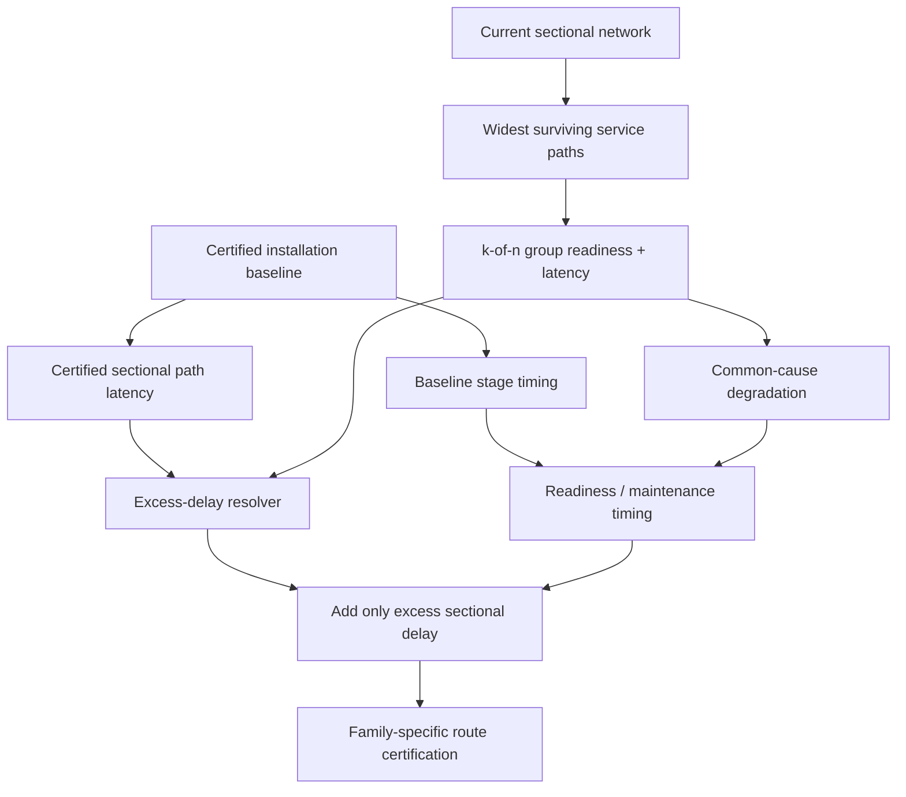
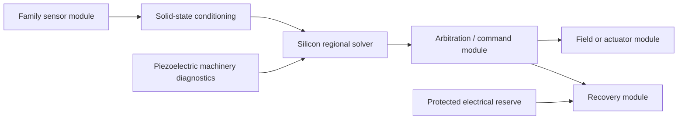

# Black Light FTL Sectional Propagation Latency & Modular Refit Timing Manual

**Authority class:** subordinate engineering/manual authority.  
**Governing family-design source:** *The different lightspeed methods*.  
**Primary runtime chain:** sectional dependency topology -> coupled degradation -> installation safety timing -> family/route certification.  
**Primary rule:** current sectional path delay may consume emergency response margin only where it is compared against a certified baseline for the same timing function. A missing baseline is not zero.

---

## 1. Why this authority exists

Large transit installations are not single control boxes. Power, sensor data, command authority, cooling and recovery may cross hundreds of metres or kilometres of ship through sectional infrastructure. Battle damage, refit, isolation, fire doors, breaker trips, rerouting and replacement modules can leave a function operational while changing how long it takes information or authority to reach it.

Earlier sectional topology already answered:

> Is there a physically surviving service path, and how strong is its bottleneck?

It also calculated path latency, but installation timing used only readiness. That left an important failure mode unrepresented: a vessel could retain command connectivity through a long emergency cross-tie without paying any additional response time.

This manual closes that gap while preventing the opposite error—adding the entire present path delay to a timing budget that already contains nominal propagation time.

---

## 2. Authority chain



The order matters. Connectivity, condition and latency are related but not interchangeable.

---

## 3. Sectional service graph

Represent the installation as directed graph

\[
G=(V,E),
\]

with machinery sections \(V\) and service edges \(E\).

For a candidate service path \(p\), deterministic support availability is

\[
A_p=\min\left(A_{source},\min_{e\in p}A_e\right).
\]

The strongest surviving service path is

\[
A_s=\max_p A_p.
\]

Its propagation latency is

\[
\tau_p=\sum_{e\in p}\tau_e.
\]

These are engineering state variables, not probabilities:

\[
\boxed{A_s=0.8\not\equiv80\%\text{ survival probability}.}
\]

---

## 4. k-of-n functional timing

Many capital-scale systems require some subset of regional controllers rather than every controller.

If at least \(k\) of \(n\) eligible members are required, group readiness is the kth-largest readiness:

\[
r_{group}=r_{(k)}^{\downarrow}.
\]

For timing, if those responders can operate in parallel, the earliest moment at which \(k\) qualifying responses have arrived is the kth-smallest eligible latency:

\[
\boxed{\tau_{group}=\tau_{(k)}^{\uparrow}.}
\]

For an all-of-n group this becomes the slowest required responder. For a one-of-n backup group it becomes the fastest eligible responder.

This does not authorize treating unrelated serial stages as parallel.

---

## 5. The double-counting problem

Suppose a certified command stage is

\[
t_{command,0}=0.80\ \mathrm{ms}.
\]

That certified figure already includes the ordinary command path used during certification. If the certified sectional propagation component was

\[
\tau_{command,0}=40\ \mu\mathrm{s}
\]

and battle-damage routing changes the current path to

\[
\tau_{command,p}=115\ \mu\mathrm{s},
\]

adding all 115 microseconds would count the original 40 microseconds twice.

The correct degradation is

\[
\boxed{\Delta\tau_i=\max(0,\tau_{i,p}-\tau_{i,0}).}
\]

Therefore

\[
\Delta\tau_{command}=75\ \mu\mathrm{s}
\]

and

\[
t_{command,eff}=0.800+0.075=0.875\ \mathrm{ms}.
\]

This is the governing integration rule.

---

## 6. Missing baseline doctrine

If current path latency is known but certified baseline latency is not, the system must not assume

\[
\tau_{i,0}=0.
\]

Doing so would quietly convert unknown historical decomposition into a known zero and usually over-penalize the route by double counting nominal propagation.

Instead:

\[
\boxed{\tau_{i,p}\ \text{known},\ \tau_{i,0}\ \text{unknown}\Rightarrow\Delta\tau_i\ \text{UNRESOLVED}.}
\]

The present latency remains valuable evidence. It simply cannot be converted into an additive penalty until its relationship to the baseline timing packet is known.

---

## 7. Installation intervention model

The installation emergency sequence remains

\[
t_{int}=t_{sensor}+t_{solver}+t_{decision}+t_{command}+t_{actuate}+t_{exit}+t_{clear}+t_{margin}.
\]

Readiness and maintenance first create conditioned stage timing:

\[
t_{i,conditioned}=t_{i,0}\frac{m_i}{\max(r_i,\epsilon)}.
\]

Sectional excess latency is then added:

\[
\boxed{t_{i,eff}=t_{i,conditioned}+\Delta\tau_i.}
\]

The current runtime directly maps sectional latency to stages where the relationship is unambiguous:

| Sectional channel | Timing stage |
|---|---|
| sensor | `sensorTime` |
| solver | `solverTime` |
| command | `commandTime` |
| actuator | `actuationTime` |
| exit | `exitTime` |
| clearance | `clearTime` |

Navigation/reference/recovery/thermal/structure latencies remain evidence unless a narrower installation authority defines how they decompose into a timing stage. This avoids inventing a universal architecture.

---

## 8. Continuous projected-progress safety

For continuous families with authoritative projected-progress semantics,

\[
M_T=\frac{D_B}{v_p}-t_{int}.
\]

An emergency reroute that adds \(\Delta\tau\) therefore consumes timing margin directly:

\[
M_{T,new}=M_{T,old}-\sum_i\Delta\tau_i.
\]

Likewise distance margin changes by

\[
\Delta M_D=-v_p\sum_i\Delta\tau_i.
\]

Here \(v_p\) is route progress, not necessarily local hull velocity.

---

## 9. PRECOMMIT families

For Q-Lattice, Fold Jump and Phase Displacement the correct decision quantity remains

\[
M_T=t_{prediction}-t_{int}.
\]

Sectional rerouting can consume that margin by delaying sensing, solution, command, rejection or exit preparation. It still does not create a meaningful local FTL speed.

\[
\boxed{\text{PRECOMMIT timing degradation}\not\Rightarrow\text{fabricated local transit velocity}.}
\]

---

## 10. Gate infrastructure

Wormhole/gate systems are sectional infrastructure by nature. Relevant delays may span:

- mouth-local aperture control;
- anchor structural sensing;
- power-conversion zones;
- chronology-veto networks;
- paired-mouth reference systems;
- traffic interlocks;
- protected closure authority.

Remote-mouth information latency must not be confused with local control latency. A remote state may be stale even if local gate control responds quickly.

---

## 11. Ar'nock machinery embodiment

The corrected Ar'nock baseline is solid-state/electromechanical and modular.

A typical transit-control service chain may be:



### 11.1 Refit timing consequence

An Ar'nock replacement module may:

- fit the mechanical bay;
- accept the expected power;
- speak enough of the bus protocol to boot;
- pass a local functional test;

and still alter total safety timing because its internal buffering, solver revision, transducer conditioning or interface latency differs.

Therefore:

\[
\boxed{\text{mechanically compatible}\neq\text{timing certified}.}
\]

Ar'nock refit records should preserve module identity, revision, calibration, installed location, certified path latency and timing-stage relationship.

### 11.2 Piezoelectric role

Piezoelectric channels may verify mounting, strain, vibration, actuator response and structural settling. They do not become gravity/Q/topology sensors merely because they are precise.

---

## 12. Zwlei Mur'rek machinery embodiment

Mur'rek timing can be affected by physically different machinery:

```text
Forward Sensor Ampulla / Sensor Choir
            -> observation latency
Navigation Current Well
            -> solution / reference latency
Command arbitration
            -> command latency
hydraulic control + dielectric field vanes
            -> actuator latency
bio-reactive power fluid + conductive coolant
            -> common-cause readiness / recovery
```

A longer hydraulic route or emergency fluid bypass can change actuator response. Conductive-coolant failure may simultaneously degrade solver, actuator and recovery thermal margin.

The source phrase “gravitic slipstream” remains family-unresolved:

\[
\text{gravitic slipstream}\not\Rightarrow\texttt{gravitational-plane}
\]

and

\[
\text{gravitic slipstream}\not\Rightarrow\texttt{slipstream-shear}.
\]

Machinery timing evidence does not normalize family identity.

---

## 13. Large-vessel scaling

The control-pressure measure remains

\[
\Pi_c=\frac{L_c}{v_c\tau_r}.
\]

As vessel span \(L_c\) grows or required response interval \(\tau_r\) shrinks, designs are pushed toward:

- local sensing;
- local computation;
- regional command authority;
- sectional isolation;
- local protected recovery;
- redundant service paths;
- explicit latency certification.

Large ships are therefore not simply small ships with larger reactors.

---

## 14. Power and thermal interaction

Sectional delay and common-cause degradation must remain distinct.

A rerouted command path may be slower while still fully powered. A cooling failure may leave path delay unchanged while reducing solver readiness. Both can occur together.

For power deficit

\[
P_d=\max(0,P_L-P_a)
\]

with buffer energy \(E_b\),

\[
t_{hold}=\frac{E_b}{P_L-P_a}.
\]

If rerouting raises intervention time beyond hold time,

\[
t_{hold}<t_{int,new},
\]

a previously adequate buffer can become inadequate even though the power system itself did not worsen.

That coupling is operationally important.

---

## 15. Signatures

Sectional rerouting can create observable signatures without changing family physics:

| Event | Possible signature |
|---|---|
| bus reroute | changed switching traffic / link utilization |
| backup converter path | altered harmonic spectrum and heat distribution |
| longer coolant route | pump state and delayed thermal response |
| Ar'nock module replacement | changed timing fingerprint, resonant response, revision identity |
| Mur'rek hydraulic bypass | pressure transient and slower vane response |
| emergency isolation | abrupt topology change and localized load transfer |

These are machinery/infrastructure signatures, not proof of an exotic transit hazard.

---

## 16. Failure taxonomy

`SPL-NO-BASELINE` — current sectional latency exists but certified baseline latency is absent.  
`SPL-REROUTE-DELAY` — current path exceeds certified path latency.  
`SPL-GROUP-LATENCY` — k-of-n completion latency exceeds certified group timing.  
`SPL-PATH-BLOCKED` — required service group cannot satisfy readiness floor.  
`SPL-DOUBLE-COUNT` — full current latency was added despite nominal latency already existing in baseline stage timing.  
`SPL-REFIT-IDENTITY` — replacement module identity/revision provenance is incomplete.  
`SPL-REFIT-LATENCY` — replacement changes measured timing relative to certified baseline.  
`SPL-STALE-TOPOLOGY` — service graph no longer matches physical installation.  
`SPL-FAMILY-PROMOTION` — machinery terminology was used to infer FTL family.  
`SPL-PROBABILITY-LEAK` — normalized availability was misrepresented as failure probability.

---

# Part II — Practical equipment procedures

## 17. SPL-01 Certified baseline capture

1. Freeze installation configuration and module identities.
2. Record each safety-critical sectional group.
3. Verify readiness floor and k-of-n requirement.
4. Measure or derive service-path latency with traceable instrumentation.
5. Associate each certified latency with its timing channel.
6. Record timing-stage baseline separately.
7. Record environmental/test conditions.
8. Preserve clock/reference uncertainty.
9. Sign the baseline with installation/refit authority.
10. Never backfill a missing historical baseline from current degraded state without labeling it derived.

---

## 18. SPL-02 Reroute delay audit

1. Resolve current service graph.
2. Confirm the selected surviving path.
3. Record \(\tau_{current}\).
4. Retrieve matching certified \(\tau_0\).
5. Compute

\[
\Delta\tau=\max(0,\tau_{current}-\tau_0).
\]

6. Add only \(\Delta\tau\) to the applicable conditioned timing stage.
7. Recompute total intervention time.
8. Recompute route safety margin.
9. Preserve both baseline and current values for forensic readback.

---

## 19. SPL-03 k-of-n response timing

For each group:

1. remove members below readiness floor;
2. verify at least \(k\) eligible members remain;
3. sort eligible response latencies ascending;
4. select the kth latency;
5. compare with the certified group baseline;
6. preserve member identities used in the calculation.

A redundant group can remain operational yet materially slower after losing its fastest members.

---

## 20. SPL-04 Battle-damage reconfiguration

`isolate damage -> recompute reachability -> recompute group readiness -> recompute group latency -> apply common-cause condition -> apply excess delay -> recompute recovery horizon -> certify or reject`

Do not let an automatically discovered backup route inherit the primary route's latency certification.

---

## 21. SPL-05 Refit recertification

A refit requiring recertification includes any change to:

- module revision;
- bus/signal carrier;
- cable/fiber/fluid routing;
- bridge/cross-tie topology;
- control hierarchy;
- k-of-n membership;
- readiness floor;
- local processing placement;
- recovery-store placement;
- timing/reference distribution.

---

## 22. SPL-06 Ar'nock modular replacement

1. Preserve removed module identity.
2. Verify replacement function and revision.
3. Verify silicon solver/control version where readable.
4. Verify piezoelectric reference/alignment response.
5. Measure local input-to-output latency.
6. Verify service-path latency to supervisory and actuator modules.
7. Compare against certified baseline.
8. Recompute excess delay.
9. Recertify family-specific operation.

Biological tissue viability is not a default step unless the replaced subsystem is actually biological.

---

## 23. SPL-07 Mur'rek fluid/control path audit

Measure separately:

- sensor-chain response;
- Navigation Current solution time;
- command arbitration;
- hydraulic pressure propagation;
- field-vane response;
- dielectric condition;
- coolant/power-fluid common-cause state.

A hydraulic response delay is not automatically a navigation delay merely because both occur inside the same regulator complex.

---

## 24. SPL-08 Derelict with unknown baseline

If an ancient vessel has no surviving timing certification:

1. measure current path latency;
2. map current module/service graph;
3. identify obvious damage/reroutes;
4. preserve current latency as observed evidence;
5. do not declare observed latency equal to original certified latency;
6. do not add it wholesale to an unrelated generic timing baseline;
7. establish a new test-derived baseline only through controlled low-authority calibration;
8. label the result `DERIVED`, not historical canon.

---

# Part III — Generator and API doctrine

## 25. Packet semantics

Installation timing packets now preserve:

```text
baselineTiming
baselineRecovery
readiness
coupledDegradation
sectionalLatency:
    currentByChannel
    baselineByChannel
    excessByChannel
    appliedByStage
    unresolvedChannels
timing
recovery
provenance
```

The important audit relation is visible rather than implicit:

\[
\text{certified baseline}\rightarrow\text{current path}\rightarrow\text{excess delay}\rightarrow\text{effective timing}.
\]

---

## 26. Generation safeguards

A generator MUST NOT:

- invent sectional latency from vessel size alone;
- assume missing baseline latency is zero;
- treat availability as probability;
- add current latency twice;
- average conflicting path authorities;
- invent biological Ar'nock control paths;
- infer Mur'rek family identity from the word slipstream;
- change FTL-family equations because machinery is damaged;
- call a simulation-derived refit baseline historical canon.

A generator SHOULD preserve the difference between measured, certified, derived, proposed and unresolved values per field.

---

# Part IV — Educational text

## 27. Transit Safety Engineering 730

### Sectional Propagation, Rerouting Latency, and Refit Timing Certification

Students should be able to:

- solve a widest-path service problem;
- distinguish bottleneck availability from probability;
- compute path propagation delay;
- compute k-of-n completion latency;
- identify double counting in a timing budget;
- propagate excess latency into continuous and PRECOMMIT safety margins;
- analyze power-buffer consequences of increased response time;
- recertify an Ar'nock modular replacement without reverting to biotechnology-first assumptions;
- preserve Mur'rek machinery evidence without normalizing family identity;
- reconstruct a timing baseline for a derelict while preserving historical uncertainty.

### Worked exercise

A three-of-four command group has eligible current latencies

\[
[0.22,0.31,0.48,0.90]\ \mathrm{ms}.
\]

The group completion latency is the third-smallest:

\[
\tau_{group}=0.48\ \mathrm{ms}.
\]

Its certified baseline was

\[
\tau_{group,0}=0.29\ \mathrm{ms}.
\]

Therefore

\[
\Delta\tau=0.19\ \mathrm{ms}.
\]

If conditioned command time is 1.05 ms,

\[
t_{command,eff}=1.24\ \mathrm{ms}.
\]

If the fourth member is merely a spare, its 0.90 ms delay is irrelevant to the three-of-four completion time. If one of the three fastest members is lost, the group may remain operational while its completion latency jumps to 0.90 ms. Redundancy can preserve function without preserving performance.

---

## 28. Closing engineering rule

Large-vessel resilience is not binary. A damaged installation may remain connected, remain above readiness floor, retain enough redundant modules, and still become too slow to react safely.

The correct relation is therefore:

\[
\boxed{\text{reachable}\neq\text{timely}\neq\text{certified}.}
\]

And for the timing integration itself:

\[
\boxed{\text{current delay}-\text{certified nominal delay}=\text{degradation actually charged}.}
\]
