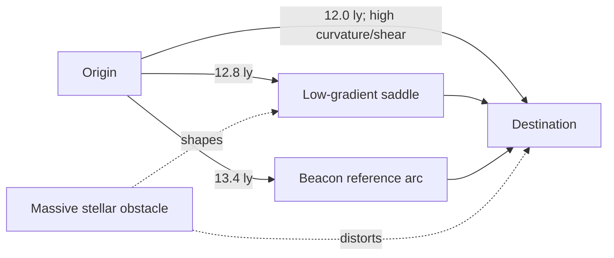
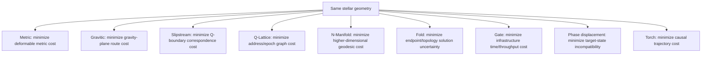
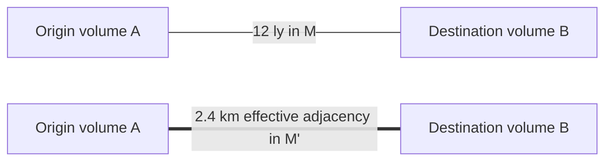
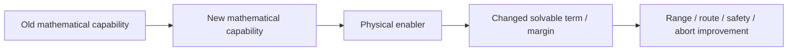

# Black Light FTL Solved Transit Cases

**Status:** technical/educational worked-example manual.  
**Authority:** subordinate to `BLACK_LIGHT_PROPULSION_TRANSIT_AUTHORITY.md`, surviving race/manufacturer canon, and live generator data.  
**Numerical status:** all fixture numbers are `PROPOSED`; the equations are `DERIVED`; family identities and recovered behavioral distinctions are `CONFIRMED` where inherited from authority.

This manual exists to make a central Black Light rule mechanically visible: **different FTL systems do not merely assign different speeds to the same distance. They solve different mathematical problems.** The same origin, destination, vessel and stellar environment can therefore produce different routes, different effective distances, different engineering loads, different warning horizons, and different reasons for rejecting an otherwise shorter path.

The machine-readable companion is `data/exo-vessel/ftl-solved-case-registry.json`.

---

## 1. Shared worked environment

Fixture `SOLVED-001-GRAVITY-FORK` uses a 12.0 light-year ordinary separation. A massive star lies near the direct line. The direct path is geometrically shortest but crosses stronger curvature and tidal shear. A 12.8 ly saddle path passes through a broader, lower-gradient gravitational region. A 13.4 ly beacon arc is longest in ordinary space but supplies the strongest destination/reference certainty and lowest route-branch ambiguity.



Shared vessel: 60,000-tonne frigate/merchant scale, nominal hull, relative protected volume 1.0.

Illustrative environment values:

| Quantity | Direct | Saddle | Beacon arc |
|---|---:|---:|---:|
| ordinary path length | 12.0 ly | 12.8 ly | 13.4 ly |
| normalized gravity severity | 0.62 | 0.28 | low/contextual |
| normalized tidal severity | 0.44 | 0.18 | low/contextual |
| route/reference uncertainty | higher | 0.12 | 0.07 |
| fork/branch risk | 0.22 | 0.07 | 0.05 |

The numbers are not setting constants. Their job is to expose mechanism behavior.

---

## 2. Why the drives disagree

A useful abstraction is to define a drive-specific objective functional

\[
\Gamma_f^*=\arg\min_{\Gamma}\mathcal{J}_f(\Gamma, E, V, T)
\]

where \(f\) is transit family, \(E\) the environment, \(V\) the vessel state and \(T\) the Path/maturity state.

The crucial point is that \(\mathcal{J}_f\) is **not the same function** for every drive.



This is the mathematical expression of the legacy “different lightspeed methods” design goal: the drives must respond differently to gravity, topology, route uncertainty and engineering maturity rather than being cosmetic aliases.

---

## 3. Metric Compression Envelope — P4 worked case

The metric drive changes the effective spatial metric around a protected volume. Its route cost is not ordinary length alone:

\[
D_M=\int_\Gamma\sqrt{\gamma^{\mathrm{eff}}_{ij}\,dx^i dx^j}
\]

with useful gain

\[
G_M=\frac{D_0}{D_M}.
\]

For this fixture, the P4 drive chooses the 12.8 ly saddle instead of the 12.0 ly direct line. The direct path is shorter in ordinary geometry, but stronger external curvature and tides consume tensor-control authority and raise field-wall gradients. The P4 mathematical advance—dynamic multi-sector tensor solving—makes the broad saddle cheaper to deform coherently.

With an illustrative compression gain of 18,

\[
D_{M,\mathrm{eff}}\approx\frac{12.8}{18}=0.711\;\mathrm{ly\ equivalent}.
\]

This is not “the ship traveled 0.711 ly through ordinary space.” It is a comparison metric for the engineered route.

### Equipment interpretation

The practical machine consequence is a longer-duration but lower-peak loading cycle. Distributed tensor sectors, stress waveguides and recovery systems remain active longer, yet each sector experiences lower curvature correction demand than on the direct path. Larger energy stores alone would not make the direct path automatically superior; field authority and recovery margin are the limiting quantities.

### Operator note

If sector closure degrades while the recovery reserve remains positive, P4 permits degraded abort through controlled sector collapse. If the remaining sectors cannot maintain whole-effect closure, the route is rejected before commit.

---

## 4. Gravitational-Plane Skimmer — P4 worked case

The skimmer does not impose arbitrary geometry. It rides usable gravitational geometry. Its route is therefore modeled as

\[
\mathcal{J}_g[\Gamma]=\int_\Gamma
\left(1+a_g\chi_g+a_t\chi_t+a_u u_r+a_f p_{\mathrm{fork}}\right)ds,
\]

and

\[
\Gamma_g^*=\arg\min_\Gamma\mathcal{J}_g.
\]

The drive again selects the saddle, but for an entirely different reason from the metric system. The broad gradient is the road. The direct route contains a ridge/fork condition where two admissible geodesic-plane solutions diverge too rapidly for safe commitment.

An illustrative plane gain of 24 gives

\[
D_{g,\mathrm{eff}}\approx\frac{12.8}{24}=0.533\;\mathrm{ly\ equivalent}.
\]

### Equipment interpretation

The dominant upgrade is not “stronger engine.” It is better gradiometry, plane-transition hardware, ephemeris quality and control bandwidth. A civilization can therefore make a major transit advance through mathematics, sensing and prediction while changing the prime mover only modestly.

### Technician rule

If a new mass concentration appears ahead, do not compare it to a simple obstacle radius. Recompute the plane graph. A newly discovered moon, fleet mass, compact object or artificial gravity source may move the usable saddle or create a new fork.

---

## 5. Hyperspatial Slipstream Shear — P4 worked case

Slipstream transit follows a Q-boundary whose normal-space correspondence changes with time. A useful route quantity is

\[
D_S=\int_\Gamma \sigma_Q(x,t,u_Q,a)\,ds,
\qquad
G_S=\frac{D_0}{D_S}.
\]

The P4 system chooses the longer 13.4 ly beacon arc because the reference network improves Q-boundary correspondence, reduces fork risk and preserves known exit windows. An illustrative gain of 31 yields

\[
D_{S,\mathrm{eff}}\approx\frac{13.4}{31}=0.432\;\mathrm{ly\ equivalent}.
\]

The longer physical arc wins because the drive is solving a moving boundary-layer problem, not minimizing Euclidean distance.

### Machinery consequence

Range improvements come from Q-weather sensing, phase-reference stability, adhesion-control bandwidth and exit prediction. More field power without better correspondence sensing can make the system more dangerous by allowing stronger adhesion to the wrong or deteriorating shear.

---

## 6. Q-Lattice Phase Translation — P4 worked case

Q-Lattice transit is discrete. Its natural mathematical object is a graph of address/epoch states:

\[
C_Q(\pi)=\sum_k\left[c_k+a_\phi e_{\phi,k}+a_\tau e_{\tau,k}+a_oP_{\mathrm{occ},k}+a_uu_{r,k}\right].
\]

The selected route is

\[
\pi^*=\arg\min_\pi C_Q(\pi).
\]

The fixture uses a seven-hop beacon-supported route with low phase, epoch and occupancy uncertainty. Twelve light-years of ordinary separation remains twelve light-years geometrically; the transit solver is concerned instead with the integrity of the discrete Q-address chain.

### Educational distinction

A Q-Lattice navigator does not primarily ask “which direction?” The better question is “which sequence of valid state addresses reaches the desired physical correspondence without aliasing?”

### Equipment consequence

Improved strategic range can come from better clocking, immutable address memory, quantum tomography, defect correction and anti-alias solvers even when the projector's raw field strength remains unchanged.

---

## 7. N-Dimensional Manifold Drive — P4 worked case

The manifold drive searches a higher-dimensional geometry:

\[
D_N=\min_{\Gamma_N}\int_{\Gamma_N}\sqrt{g_{AB}\,dX^A dX^B}.
\]

Its normal-space projection may resemble the saddle route, but the actual optimized path exists in the active higher-dimensional manifold. The example uses six active dimensions and an illustrative projected geodesic of 0.384 ly-equivalent, corresponding to a gain near 33.3 against the 12.8 ly projected route.

The critical constraint is the return map. A spectacularly short higher-dimensional route is useless if the vessel cannot maintain a well-conditioned embedding back into ordinary 3+1D spacetime.

### Mechanical upgrade path

Higher Path levels buy more than additional dimensions. They improve axis resonance, topology sensing, embedding stability, geodesic computation, projection control and return-map recovery. Adding another dimension without improving those systems can enlarge the solution space faster than the vessel can safely solve it.

---

## 8. Discrete Fold-Jump — P4 worked case

The Fold-Jump creates temporary topological adjacency. Its defining comparison is

\[
G_F=\frac{d_M(A,B)}{d_{M'}(A,B)}.
\]

For a 12 ly ordinary separation and an illustrative manipulated adjacency separation of 2.4 km,

\[
G_F\approx4.73\times10^{13}.
\]

This enormous ratio should **not** be interpreted as a conventional speed multiplier. It expresses how radically the manipulated topology changes endpoint separation.



The beacon-supported solution wins because Fold-Jump quality is dominated by endpoint metrology, destination exclusion, topology branch risk and protected-volume definition. Once the adjacency is committed, ordinary route geometry largely ceases to be the relevant control problem.

### Equipment consequence

Metric aperture rings, topology waveguides, closed fold-volume panels, recoil framing, endpoint gravimetry and authenticated references determine success. Larger drives mostly buy larger protected volumes, stronger topology control and better structural/recovery margins—not a simple cruise-speed increase.

### Abort rule

Before commit: recompute, hold or abort.  
After commit: there is no meaningful “turn left.” Recovery-only logic applies.

---

## 9. Anchored Wormhole / Gate Transit — P4 worked case

For gate travel, interstellar distance is moved into infrastructure. A practical trip-time model is

\[
T_{gate}=T_{approach}+T_{queue}+T_{sync}+T_{cross}+T_{depart}.
\]

A twelve-light-year route can therefore be strategically slow because of a two-hour gate queue, or strategically fast because a synchronized gate pair provides near-immediate crossing. This is not contradictory; the engineering bottleneck has changed from ship drive performance to aperture stability, throughput, traffic management and mouth synchronization.

### Infrastructure consequence

A civilization with superior gate mathematics can possess ordinary ships and extraordinary logistics. The “drive upgrade” may physically reside in a stellar gate complex rather than aboard the vessel.

---

## 10. Quantum Phase Displacement — P4 worked case

Phase displacement treats transit as target-state selection. One useful normalized cost is

\[
C_\Phi=w_s(1-S)+w_oP_{occ}+w_c(1-C)+w_r(1-R)+w_mM_{mut}.
\]

Here \(S\) is state compatibility, \(P_{occ}\) target occupation risk, \(C\) continuity confidence, \(R\) reference authenticity and \(M_{mut}\) mutable biological/software burden.

Ordinary geometric distance may be nearly absent from the dominant terms. A farther but strongly authenticated compatible state can be preferable to a nearer ambiguous one.

### Equipment consequence

Tomography, continuity records, reference authentication, mutable-state capture, biological phase handling and quarantine are first-class drive components. Calling this machine a “teleporter” without those systems loses most of its engineering identity.

---

## 11. Relativistic Inertial Torch — comparison baseline

The Torch remains ordinary causal propulsion. It therefore retains ordinary distance:

\[
D_I=D_0.
\]

Its improvements come from exhaust velocity, mass ratio, power density, thermal rejection, structural acceleration tolerance and better relativistic trajectory control. This baseline is essential because it prevents every technology gain from being mislabeled as a spacetime manipulation gain.

---

## 12. Cross-family comparison chart

| Family | Primary mathematical object | What reduces practical trip cost? | Dominant P4 danger |
|---|---|---|---|
| Metric | engineered metric/geodesic | lower integrated deformation burden | field-wall/horizon/recovery loss |
| Gravitic | weighted gravity-plane graph | smoother usable curvature | ridge/fork/plane ejection |
| Slipstream | Q-boundary shear path | stable correspondence and exits | adhesion/branch loss |
| Q-Lattice | discrete state graph | clean address/epoch chain | alias/occupation error |
| N-Manifold | higher-D geodesic | short well-conditioned embedding | invalid return map |
| Fold | endpoint topology | precise safe adjacency | wrong/occupied endpoint, topology branch |
| Gate | network/aperture schedule | infrastructure access/throughput | throat/sync/flow instability |
| Phase displacement | state compatibility | valid authenticated target state | continuity/occupation/reference failure |
| Torch | causal trajectory | propulsion/thermal efficiency | propellant/heat/acceleration limits |

This chart is the simplest sanity test for future generator work. If two drive families are producing the same optimization objective with only different nouns, the implementation has collapsed distinct canon into one generic mechanism and must be repaired.

---

## 13. Upgrade causality rule

For every P0→P6 improvement, generator output must preserve this chain:



A valid upgrade explanation therefore sounds like:

> “P4 gravitic transit gains usable range because distributed gradiometry and faster plane-control hardware permit a dynamic multi-plane graph to be solved. That reduces unresolved fork probability and permits safe plane switching.”

An invalid explanation sounds like:

> “P4 is four times faster because the drive is better.”

Raw scalar multipliers are allowed only when an authoritative table actually supplies them, and even then the engineering explanation should identify what changed physically and mathematically.

---

## 14. Practical engineer checklist for a solved route

Before accepting a generated solution, verify that the report identifies the ordinary origin-destination separation, selected family, Path/maturity, actual mathematical object solved, selected route or state sequence, environmental terms that mattered, whole-effect coverage, structural reserve, recovery reserve, navigation/reference uncertainty, fork/branch condition, abort boundary, physical machinery responsible for the solved capability, and provenance/status of every numerical coefficient.

A solution that outputs only `distance`, `speed` and `time` is incomplete for Black Light.

### Minimum solver report

```json
{
  "ordinaryDistance": "12.0 ly",
  "family": "fold-jump",
  "tier": "P4",
  "optimizedQuantity": "endpoint topology/admissibility",
  "selectedSolution": "beacon-supported endpoint pair",
  "effectiveDistanceRepresentation": "2.4 km manipulated adjacency",
  "environmentalPenalties": ["gravity covariance", "topology branch risk"],
  "margins": {"coverage":"positive","structure":"positive","recovery":"positive"},
  "abortState": "PRECOMMIT_SAFE",
  "sourceStatus": "MIXED",
  "numericStatus": "PROPOSED"
}
```

---

## 15. Provenance and origin

Every worked case must retain its ancestry:

`surviving named canon -> Propulsion & Transit Authority -> recovered FTL family -> mathematical model registry -> upgrade-causality registry -> calibration registry -> solved-case fixture -> generated narrative/manual/API view`

The legacy **“The different lightspeed methods”** document remains a design-source authority for the requirement that the mechanisms behave differently under gravity, route uncertainty, efficiency loss, forks, safety sensing and maturity. Its exact current repository path remains `UNRESOLVED`; that fact must remain visible until the source is recovered rather than being replaced with an invented path.

---

## 16. Next calibration step

The solved fixtures establish mechanism differentiation. The next quantitative layer should calibrate families against several environment classes rather than one scenario: deep interstellar flat space, close stellar passage, compact-object neighborhood, binary/multiple-star gravity field, dense fleet/artificial-gravity environment, Q-weather disturbance, weak-reference frontier space, and prepared high-infrastructure corridor. Each fixture should be reusable by the generator as a regression case so later tuning cannot accidentally make all drives converge on the same behavior.
