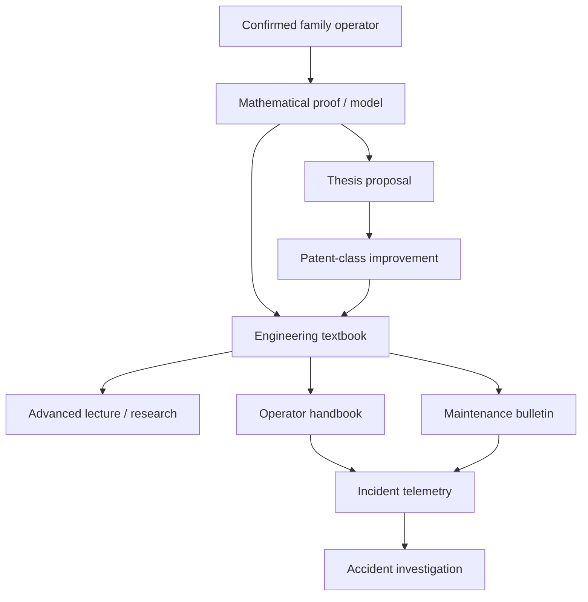

# Black Light FTL Technical Corpus Manual

**Status:** subordinate engineering, educational, practical-manual, research, incident, patent-form, and generator reference.  
**Primary authority:** `docs/blacklight/BLACK_LIGHT_PROPULSION_TRANSIT_AUTHORITY.md`.  
**Machine-readable source:** `data/exo-vessel/ftl-technical-corpus-registry.json`.  
**Research-tradition parent:** `data/exo-vessel/ftl-research-tradition-registry.json`.  
**Legacy design source:** Google Drive document **“The different lightspeed methods”**, file ID `1e0Xp71EFubBZgXWjjvPxAqPoJIZNwqS6nu1-r7Kil7Y`, retrieved revision `ANLCKQllC5h6dLaX5H1RpK8aUFVWsi-IV7gbMHUd0Qq7mIe5uGsLFi5_Hrsr8B6dl8t_ezB0fTSygxrnIBtifAHW79bgSbswp1zF3NaEil0`.

The legacy design source explicitly calls for different mathematical behavior among transit families, family-specific gravity sensitivity and efficiency loss, forward sensing and emergency de-transit that mature with drive performance, mathematically credible underlays, educational courses, thesis work, design records, and alien patent-style incremental development. This manual turns that requirement into an actual technical-document system.

`CONFIRMED` denotes recovered authority within its stated scope. `DERIVED` denotes an engineering consequence constrained by authority. `PROPOSED` denotes a new extension awaiting adoption. `UNRESOLVED` denotes a fact not established by available authority. Document style, plausible scholarship, training accidents, and patent classes do **not** become setting history merely because they read like in-universe records.

---

## 1. What a believable technical corpus has to do

A civilization that has operated a transit technology for generations should not possess one encyclopedia paragraph saying how the drive works. It should possess layers of explanation aimed at different jobs and different mathematical competence.

The same installation therefore needs multiple legitimate textual views:



None of these layers is allowed to reverse the authority chain. A textbook may explain a confirmed Fold-Jump using derived topology mathematics. It may not decide that a named species invented the Fold-Jump. An accident-training case may demonstrate endpoint-covariance failure. It may not become a historical disaster unless a higher source establishes that event.

---

## 2. The eight canonical document classes

| Class | Primary reader | What it must answer |
|---|---|---|
| Proof note | mathematician / theorist | What exactly is being claimed, under what assumptions, and where does the model cease to apply? |
| Textbook section | engineering student | What does the equation mean physically, and how do I calculate a representative case? |
| Advanced lecture | graduate engineer / researcher | Which term currently limits performance, and what mathematical or physical change could move it? |
| Operator handbook | qualified operator | What must be true before commit, what warnings matter, and when do I abort? |
| Maintenance bulletin | technician / maintainer | Which measurable symptom isolates which subsystem, and what proves return to service? |
| Accident investigation | incident board | What happened in sequence, what did the equations predict, what did the machine actually do, and what was root cause? |
| Thesis proposal | researcher | What bounded unknown is being tested, how will it be tested, and what observation falsifies the proposal? |
| Patent-class record | engineering historian / design office | Which prior limitation was moved, by what new relation and physical enabler, with what measurable effect? |

The same technical claim must change vocabulary and depth across these classes without changing its physical meaning.

---

## 3. Universal mathematical safety requirement

The legacy source requires sensing and emergency de-transit capability to grow with transit capability. The common derived inequality remains:

\[
L_{sensor} \ge v_{eff}
\left(
 t_{detect}+t_{solve}+t_{command}+t_{field}+t_{exit}
\right)+D_{margin}.
\]

Define

\[
H_s=\frac{L_{sensor}}{L_{safe}},
\qquad
L_{safe}=v_{eff}
\left(
 t_{detect}+t_{solve}+t_{command}+t_{field}+t_{exit}
\right)+D_{margin}.
\]

`H_s > 1` means the installation possesses positive modeled lookahead margin under the stated conditions. It does **not** mean that the drive is perfectly safe. Higher transit performance without better sensing, solving, actuation, and recovery can reduce safety even if the prime mover becomes more powerful.

This relation is intentionally family-neutral. Each family then defines what must be sensed and what “exit” means.

---

## 4. Family mathematics at a glance

| Family | Mathematical object manipulated or solved | Representative derived objective |
|---|---|---|
| Metric Compression Envelope | effective local metric tensor | \(J_M=D_{eff}+\lambda_hH+\lambda_sS+\lambda_rR\) |
| Gravitational-Plane Skimmer | natural gravitational/shear geodesic | \(J_G=\int(1+a_g\chi_g+a_t\chi_t+a_uu_r+a_fp_{fork})ds\) |
| Slipstream Shear | metastable Q-boundary and adhesion state | \(J_S=w_qe_q+w_ve_v+w_a(1-A_{adh})+w_xe_{exit}\) |
| Q-Lattice Translation | indexed state graph with epoch | \(J_Q(P)=\sum_e(c_e+\lambda_uu_e+\lambda_aa_e)+\lambda_c(1-C_{coverage})\) |
| N-Manifold Drive | higher-dimensional geodesic and return projection | \(J_N=D_N+\lambda_k\kappa(R_{return})+\lambda_gC_g+\lambda_uU\) |
| Fold-Jump | finite-volume topological adjacency | \(J_F=w_dd_{M'}(A,B)+w_c\Sigma_{end}+w_oO+w_gG+w_rR\) |
| Wormhole / Gate | maintained throat plus synchronized mouths | \(J_W=w_r\sigma_r+w_t\sigma_t+w_cC_{chron}+w_qQ_{queue}+w_eE_{loss}\) |
| Phase Displacement | bounded nonlocal state correspondence | \(J_P=\sum_kw_kC_k(\Psi_A,\Psi_B)+\lambda_rU_{ref}+\lambda_oO_{target}\) |

The coefficients in these expressions remain `PROPOSED` until explicitly calibrated. The equations are modeling tools and are `DERIVED` unless a higher source adopts them.

---

# 5. Worked corpus: Discrete Fold-Jump Drive

Fold-Jump is useful as the first fully expanded example because its operating concept is frequently confused with ordinary travel or N-dimensional transit.

## 5.1 Proof note — finite-volume adjacency

**Claim (`DERIVED`):** a Fold-Jump is admissible only if the protected origin volume and target volume can be represented by a temporary topology in which their manipulated separation is sufficiently small **and** origin closure, endpoint covariance, occupancy exclusion, gravity-conditioned stability, topology support, and recovery all remain inside certified bounds.

Let the ordinary spatial manifold be `M` with origin volume `A` and destination volume `B`. Let `M'` be a candidate manipulated topology. Then

\[
G_F=\frac{d_M(A,B)}{d_{M'}(A,B)}.
\]

`G_F` is a topological distance-reduction ratio. It is **not** a velocity multiplier.

The candidate solution is not selected by minimizing manipulated separation alone. A usable objective is

\[
J_F=
 w_d d_{M'}(A,B)
 +w_c\Sigma_{end}
 +w_oO
 +w_gG
 +w_rR.
\]

Here `Sigma_end` measures endpoint-reference covariance, `O` measures occupancy/exclusion burden, `G` measures gravity-conditioned topology burden, and `R` measures recovery burden.

A fold can therefore be rejected even when

\[
d_{M'}(A,B) \rightarrow 0
\]

if its endpoint covariance or occupancy risk becomes unacceptable.

### Bounded-domain statement

The model is valid only inside the installation's certified payload volume, gravimetric environment, reference covariance, topology-support authority, energy/recovery envelope, and solver horizon. No claim is made that arbitrary spacetime regions can be made adjacent.

### Falsification condition

For a proposed improvement claiming safer long folds, hold vessel volume, environment, endpoint references, and certified machinery authority constant. If the new solver does not lower either admissible `J_F`, endpoint covariance, rejected unsafe-solution rate, or required support burden without worsening another protected constraint beyond certification, the claimed improvement fails.

---

## 5.2 Undergraduate textbook section — adjacency is not traversal

Imagine two rooms on opposite ends of a continent. Ordinary propulsion asks how fast a vehicle can cross the land between them. N-Manifold transit asks whether a shorter path exists through a larger-dimensional geometry. Fold-Jump asks a different question: can the two protected rooms be made temporarily adjacent without destroying either room or confusing which room is which?

```text
Ordinary space

[A] ---------------------------------------------------------- [B]
                   ordinary separation d_M(A,B)

Candidate fold topology

[A] ---------\                               /--------- [B]
              \____ controlled adjacency ___/
                    d_M'(A,B) << d_M(A,B)
```

The engineering consequence is severe: nearly all meaningful navigation authority occurs **before topology commit**. The navigation computer is not primarily steering during the displacement. It is determining which target volume is about to become adjacent, whether that volume is empty enough to receive the protected vessel volume, and whether the surrounding gravity/reference state permits the topology to close and recover correctly.

### Student exercise

Two candidates produce:

- Candidate X: smaller `d_M'`, but endpoint covariance is close to the certified maximum.
- Candidate Y: `d_M'` is 12% larger, but endpoint covariance is one-third as large and occupancy evidence is stronger.

Explain why an advanced installation can legitimately choose Candidate Y even though its nominal topological distance reduction is worse.

**Expected reasoning:** mature Fold-Jump systems optimize survivable adjacency, not maximum geometric compression in isolation.

---

## 5.3 Advanced engineering lecture — why higher tiers travel farther

A useful Fold-Jump development sequence is:

\[
\text{local adjacency}
\rightarrow
\text{finite protected volume}
\rightarrow
\text{paired remote endpoints}
\rightarrow
\text{moving origin}
\rightarrow
\text{multiple candidate topologies}
\rightarrow
\text{gravity-conditioned long baseline}
\rightarrow
\text{continuous precommit optimization}.
\]

Each step requires both mathematics and machinery.

| Development | Mathematical advance | Physical enabler | Limit moved |
|---|---|---|---|
| finite payload fold | closed finite-volume topology | stronger boundary/support structure | payload volume |
| paired endpoint | two-volume correspondence | authenticated remote references | endpoint distance |
| mobile fold core | moving-origin covariance | shipboard gravimetry and timing | mobile operation |
| multi-candidate solving | rank many admissible folds | parallel topology solvers and sectional waveguides | rejection efficiency |
| gravity-conditioned long fold | include environment in topology objective | longer-baseline gravimetry, better materials, reserve energy | gravity tolerance and baseline |
| adaptive precommit | continually update candidate set | higher control bandwidth, sensors, solver density | safety margin and usable range |

This is the intended Black Light progression rule:

\[
\boxed{
\text{better solvable mathematics}
+\text{physical realization}
\Rightarrow
\text{moved engineering limit}
\Rightarrow
\text{better transit}
}
\]

A new reactor alone may increase available support energy, but if endpoint covariance remains the limiting term it will not automatically extend certified fold distance.

---

## 5.4 Practical equipment manual — Fold-Jump precommit procedure

**Applicability:** generic `DERIVED` procedure. A named installation's confirmed checklist overrides it.

### PRECOMMIT HOLD

The drive remains physically inhibited until the following independent gates have passed:

1. **Origin closure:** the full protected vessel volume plus certified margin is inside the controlled fold boundary.
2. **Destination authentication:** destination references agree within the installation's certified covariance.
3. **Occupancy exclusion:** no unresolved object, vessel, structure, hazardous field volume, or contradictory return occupies the target exclusion volume.
4. **Gravity solution:** local and endpoint gravitational reconstruction lies inside the topology solver's certified domain.
5. **Topology support:** boundary generators, waveguides/support structure, field-forming elements, and structural load paths possess positive margin.
6. **Energy and recovery:** the drive can both create the topology and safely terminate it. Reserve energy allocated to recovery is not available for increasing jump ambition.
7. **Abort horizon:** before commit, enough time and machinery authority remain to reject the solution without forcing a degraded topology-release sequence.

### COMMIT

At commit, freeze the identity of the selected candidate topology and record:

```text
family              fold-jump
path level          required
shared T tier       required when runtime-resolved
origin solution     hash/reference ID
endpoint solution   hash/reference ID
reference epoch     required
occupancy solution  required
solver version      required
environment model   required
provenance snapshot required
```

### POST-COMMIT

Do not issue ordinary course-correction commands. Monitor topology integrity, protected-volume closure, endpoint identity, support load, and recovery readiness. Commands available after commit are installation-specific termination/recovery controls, not conventional steering.

### ABORT

Abort before commit whenever any protected constraint fails. If the system has already committed, invoke the installation's confirmed termination/recovery procedure. Never invent a universal “drop out anywhere” capability: whether intermediate recovery is possible is a family/path/installation fact.

---

## 5.5 Maintenance bulletin — false endpoint drift versus hardware drift

**Symptom:** endpoint covariance rises during final solution ranking.

Do not immediately replace the topology solver.

Diagnostic isolation order:

```text
reference freshness
      |
      v
external gravimetry ----> endpoint authentication
      |                         |
      v                         v
boundary closure -------> topology solver residual
      |                         |
      v                         v
waveguide/support ------> recovery reserve
```

A rising covariance can originate in stale references, changing external mass distribution, boundary deformation, timing disagreement, support-mode drift, or solver failure. Replace hardware only after reproducing the residual against an authenticated reference input.

**Return-to-service condition (`DERIVED`):** the installation must reproduce a certified test topology with reference covariance, closure residual, support load, and recovery reserve inside its approved envelope on repeated trials.

---

## 5.6 Accident-investigation training case — occupancy return discounted as noise

**Status:** `PROPOSED TRAINING EXEMPLAR`; this is not a confirmed Black Light historical accident.

During the final seconds before commit, the endpoint solution receives a weak but coherent occupancy return. The primary solver marks the return low-confidence because a recent gravimetric reconstruction predicts an empty volume. A secondary solver simultaneously reports widening endpoint covariance. The operator accepts the higher-confidence historical target model and continues commit.

The investigation must not stop at “operator ignored warning.” It reconstructs the causal chain:

\[
\text{reference age}
\rightarrow
\text{occupancy-model conflict}
\rightarrow
\text{covariance widening}
\rightarrow
\text{ranking bias}
\rightarrow
\text{unsafe commit decision}.
\]

Questions for the board:

- Was the occupancy sensor physically functioning?
- Was confidence weighting appropriate for a potentially catastrophic exclusion-zone observation?
- Should contradictory occupancy evidence have been a hard inhibit rather than a weighted term?
- Did the endpoint covariance increase for the same underlying reason?
- Did the operator interface show provenance and reference age prominently enough?

The corrective action may therefore be mathematical, procedural, interface-related, sensor-related, or some combination. “Install a larger reactor” does not address the failure chain.

---

## 5.7 Thesis proposal — covariance-ranked long folds

**Question:** can a solver that admits slightly larger manipulated separation substantially lower endpoint covariance and therefore increase the number of certified long-baseline solutions?

**Hypothesis (`PROPOSED`):** minimizing `d_M'` too aggressively produces brittle solutions in uncertain gravity/reference environments. A multi-objective solver should produce a larger safe-operating region by accepting modestly worse distance reduction.

Test objective:

\[
\min J_F
\quad\text{subject to}\quad
\Sigma_{end}<\Sigma_{max},\;O<O_{max},\;G<G_{max},\;R<R_{max}.
\]

Required experiment: replay the same reference/environment ensemble through minimum-distance and covariance-ranked solvers using identical machinery limits.

Falsification: if the covariance-ranked solver fails to increase accepted safe solutions, reduce catastrophic near-boundary candidates, or lower required support margin under the same test distribution, reject the hypothesis.

---

## 5.8 Patent-class record — finite-volume adjacency ranker

**Status:** `DERIVED patent class`; inventor, jurisdiction, date, institution, race, manufacturer, and priority are `UNRESOLVED`.

**Prior limitation:** single-candidate or minimum-separation solving discarded information about endpoint covariance and environmental uncertainty.

**Novel relation:** rank several topologically admissible candidates by a joint cost including manipulated separation, endpoint covariance, occupancy, gravity burden, and recovery.

**Physical enabler:** parallel topology solving, higher-dynamic-range gravimetry, improved endpoint-reference authentication, and sectional topology-support control.

**Changed limit:** long-baseline fold rejection is no longer dominated by one brittle minimum-distance solution.

**Measurable effect:** more certified solutions at the same machinery authority, or the same certified-route fraction at greater ordinary separation.

This is the required patent-development grammar:

\[
\text{old limitation}
\rightarrow
\text{new relation}
\rightarrow
\text{physical enabler}
\rightarrow
\text{changed certified limit}
\rightarrow
\text{measured effect}.
\]

---

# 6. Compact corpus notes for the other families

The registry carries all eight document classes for every family. The following notes establish the distinctive educational and maintenance language each family must preserve.

## 6.1 Metric Compression Envelope

**Educational invariant:** reduced proper route length is not ordinary ship acceleration. The machine must maintain a closed protected volume while controlling horizon, structural, and recovery penalties.

**Operator maxim:** a favorable `D_eff` does not overrule a failed horizon or structure gate.

**Maintenance signature:** sector phase residuals, clock disagreement, active-material hysteresis, load-path strain, and recovery-sink saturation must be separable.

**Research direction:** covariance-aware regional tensor solving can improve usable deformation without merely increasing peak field amplitude.

## 6.2 Gravitational-Plane Skimmer

**Educational invariant:** the machine exploits natural gravitational geometry. The same environment that burdens an imposed metric deformation can be useful transit terrain for a skimmer.

Fork ambiguity can be represented by

\[
A_f=1-\max_i p_i,
\]

where `p_i` is the posterior probability assigned to candidate shear branch `i`. As ambiguity rises and remaining decoupling time falls, the route becomes unsafe.

**Maintenance maxim:** investigate the mass map and coupling geometry before declaring a reactor fault when power draw rises unexpectedly.

## 6.3 Hyperspatial Slipstream Shear

**Educational invariant:** adhesion, boundary health, phase velocity, and exit correspondence form a coupled problem.

**Operator maxim:** stronger grip is not automatically safer. A drive that cannot detach from a decaying boundary is not healthy merely because adhesion remains high.

**Research direction:** joint Q-weather prediction and detachment-cost optimization.

## 6.4 Q-Lattice Phase Translation

**Educational invariant:** coordinate, Q address, epoch, authentication, and payload coverage are different variables.

**Operator maxim:** “we know where it is” does not mean “we possess a valid state address for it.”

**Research direction:** temporal graph pruning that removes alias-prone edges while retaining useful reachability.

## 6.5 N-Dimensional Manifold Drive

**Educational invariant:** shorter higher-dimensional geodesics are valuable only when their return map is well conditioned.

A mature optimizer therefore treats

\[
\kappa(R_{return})
\]

as an independent safety/performance term rather than an afterthought.

**Research direction:** regularized multi-axis embeddings that sacrifice a little path gain for a large improvement in return conditioning.

## 6.6 Wormhole / Gate Transit

**Educational invariant:** gate performance is dominated by infrastructure and throughput as often as by the aperture itself.

\[
t_{total}=t_{approach}+t_{queue}+t_{sync}+t_{aperture}+t_{departure}.
\]

A gate that is nearly instantaneous to cross can still be strategically slow because queueing, synchronization, derating, maintenance, or approach exclusion dominates.

**Maintenance maxim:** mouth-clock disagreement and throat structural modes belong in the same operational picture as power reserve.

## 6.7 Quantum Phase Displacement

**Educational invariant:** target state is not target position. Continuity, identity-preserving invariants, authentication, and occupancy must remain bounded.

\[
C_k(\Psi_A,\Psi_B)\le\epsilon_k.
\]

**Research direction:** hierarchical state representations that lower sensing and computation burden without weakening conservative rejection.

---

# 7. Technology-basis translation

Technical literature must also look like it came from the machinery culture that produced it. The **content of the family operator does not change**, but the representation can.

| Technology basis | Proof / laboratory expression | Operator manual expression | Maintenance evidence |
|---|---|---|---|
| Terrestrial mechanical | equations, simulation, metrology benches | displays, checklists, control states | calibration logs, replaceable components, phase residuals |
| Aquatic pressure | pressure-qualified experiments, flow/acoustic models | distributed wet controls and hydroacoustic cues | cavitation, chemistry drift, pressure asymmetry |
| Cryogenic | superconducting references, low-noise coherence tests | thermal-state and coherence limits | quench history, thermal gradients, reference noise |
| Gas-giant floating | long-baseline atmospheric observatories | distributed buoyant control volumes | membrane strain, buoyancy drift, baseline deformation |
| Biological symbiotic | trained/grown sensory and field tissues | physiological state and learned control cues | tissue fatigue, metabolic reserve, neural disagreement |
| Mineral crystalline | lattice-domain proofs and resonance maps | resonant state selection | domain fractures, defect migration, prestress drift |
| Postmaterial | executable proofs and live reference meshes | direct state-authority constraints | reconstruction mismatch, reference divergence, coherence debt |

These are `DERIVED` technology-basis translations. They do not establish which race owns which FTL family.

---

# 8. Scaling and upgrade causality

Every technical document that claims an improvement must identify which limit changed.

A useful shared upgrade vector is

\[
U=(M,F,A,S,E,N,D,C,R,I),
\]

where:

- `M` = mathematical sophistication,
- `F` = field/topology manipulation,
- `A` = active materials,
- `S` = structure,
- `E` = energy generation/conditioning,
- `N` = navigation and sensing,
- `D` = drive size/distribution,
- `C` = control bandwidth,
- `R` = recovery/abort authority,
- `I` = external infrastructure.

A claimed range increase should therefore read like:

```text
P3 limitation:
  endpoint covariance dominates long-fold rejection

P4 improvement:
  M + N + C improve

physical embodiment:
  better gravimetry + parallel solvers + sectional support control

changed term:
  Sigma_end decreases and topology candidate count increases

result:
  greater ordinary baseline can be accepted at the same certified risk
```

This is preferable to `P4 range = P3 range x 2` unless an adopted calibration specifically provides that numeric relation.

---

# 9. Signature and intelligence use

A transit system's literature should teach that signatures arise from machinery and operation, not from a universal “FTL glow.” A resolved signature can be represented as

\[
S_{total}=S_{power}+S_{field}+S_{structure}+S_{control}+S_{thermal}+S_{recovery}+S_{infrastructure}.
\]

Different technology bases can make the same family observable in different ways. A terrestrial metric engine might advertise clock/field harmonics and waste heat; a biological embodiment could advertise metabolic and coherent field-tissue activity; a mineral system could expose resonance and domain-strain signatures. These are implementation consequences, not automatic species identifiers.

An intelligence analyst therefore may infer **compatible machinery classes** from a signature but may not leap from one signature feature to a confirmed race or manufacturer unless higher authority supplies that relationship.

---

# 10. API and generator contract

A generated technical document should retain enough data to reproduce why it says what it says.

```json
{
  "family": "fold-jump",
  "documentClass": "operator-handbook",
  "pathLevel": "p4",
  "sharedTier": "t4",
  "technologyBasis": "TERRESTRIAL_MECHANICAL",
  "namedSystemSource": null,
  "mathematicalModel": "J_F",
  "equationStatus": "DERIVED",
  "numericCoefficientStatus": "PROPOSED",
  "historicalAttribution": "UNRESOLVED",
  "sourceSnapshot": [
    "BLACK_LIGHT_PROPULSION_TRANSIT_AUTHORITY.md",
    "ftl-research-tradition-registry.json",
    "ftl-technical-corpus-registry.json"
  ]
}
```

Resolution order:

```text
named confirmed source
  -> confirmed family operator
  -> Path / shared-tier resolution
  -> confirmed race/manufacturer technology where present
  -> operative technology basis
  -> research tradition
  -> document class
  -> rendered provenance
```

Forbidden promotions include:

- repeating a derived equation until it appears canonical,
- converting a training accident into history,
- assigning a patent-class invention to a race because its machinery style fits,
- treating generated prevalence as proof of setting-wide infrastructure,
- replacing a confirmed named system with a generic technology-basis embodiment.

---

# 11. Practical authoring rules

A future corpus document should pass five tests.

**Physics test:** does it preserve the family's confirmed physical action?

**Causality test:** if performance improves, can the text identify the mathematical or physical limit that moved?

**Machine test:** can an engineer point to the actual sensors, field-forming elements, structural support, control system, energy path, termination system, and maintenance evidence involved?

**Safety test:** are sensing, solving, actuation, recovery, and uncertainty represented as finite rather than perfect?

**Provenance test:** can the reader distinguish recovered canon, constrained derivation, proposal, and unknown history without guessing?

If any of those tests fails, the document may still be useful prose, but it is not yet acceptable as Black Light technical authority.

---

# 12. Source and provenance note

The family identities and physical actions remain governed by `BLACK_LIGHT_PROPULSION_TRANSIT_AUTHORITY.md` and its cited recovered FTL archive/runtime sources. The technology-basis machinery language remains governed by `EXO_OPERATIVE_TECHNOLOGY_BASIS.md` and higher specific race/manufacturer sources. The mathematical kernels, research-school language, training documents, generic procedures, thesis seeds, and patent classes in this manual are subordinate `DERIVED` or `PROPOSED` material unless separately adopted.

The current Google Drive document **“The different lightspeed methods”** is retained as a confirmed design-intent source for the requirements that FTL families behave differently in gravity, incur different error/efficiency losses, possess family-specific sensing and emergency de-transit behavior, improve safety as technology matures, use realistic mathematical underlays where possible, and accumulate deep educational/research/patent documentation.
