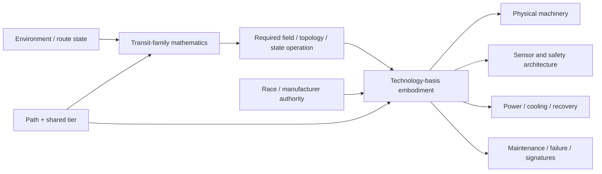
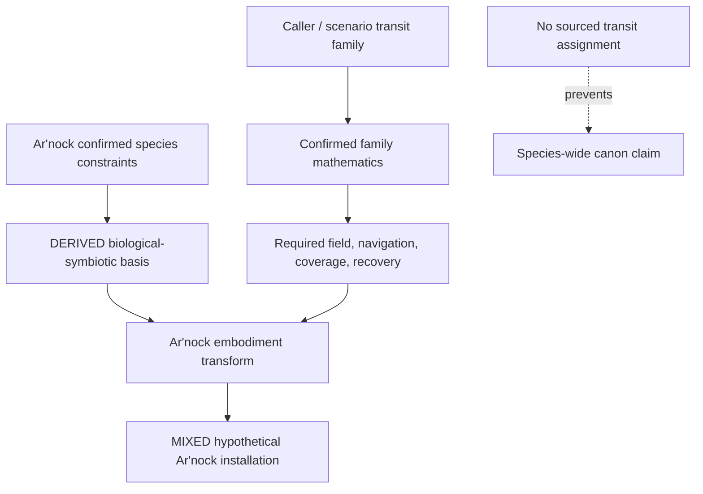

# Black Light FTL Technology-Basis Response Manual

**Status:** subordinate engineering, educational, generator, and practical-service reference.  
**Authority:** `docs/blacklight/BLACK_LIGHT_PROPULSION_TRANSIT_AUTHORITY.md` remains the integration authority. `EXO_OPERATIVE_TECHNOLOGY_BASIS.md` governs nonhuman machinery ancestry. Confirmed race/manufacturer/named-system sources outrank this manual.  
**Machine-readable companion:** `data/exo-vessel/ftl-technology-response-registry.json`.  
**Legacy design source:** Google Drive document **The different lightspeed methods**, file id `1e0Xp71EFubBZgXWjjvPxAqPoJIZNwqS6nu1-r7Kil7Y`, inspected revision `ANLCKQllC5h6dLaX5H1RpK8aUFVWsi-IV7gbMHUd0Qq7mIe5uGsLFi5_Hrsr8B6dl8t_ezB0fTSygxrnIBtifAHW79bgSbswp1zF3NaEil0`.  
**Canon labels:** `CONFIRMED`, `DERIVED`, `PROPOSED`, `UNRESOLVED`, and `MIXED` retain the meanings defined by the Propulsion & Transit Authority.

---

## 1. The governing engineering distinction

A transit family answers **what operation is performed on space, spacetime, topology, phase state, or a higher-dimensional route**. A technology basis answers **how a civilization physically performs, senses, powers, controls, maintains, and survives that operation**.

These are orthogonal axes.



A biological Fold-Jump and a terrestrial Fold-Jump therefore share the same confirmed topological-adjacency problem. They do **not** share the same machine room, control loop, repair procedure, signature burden, failure vocabulary, or path by which a higher tier becomes possible.

The correct resolver is:

\[
R_{instance}=T_{basis}\left(T_{race}\left(R_{family}(E,P,T,V)\right),S,C\right)
\]

where:

- \(R_{family}\) is the family-specific transit solution applied to environment \(E\), Path \(P\), shared tier \(T\), and vessel state \(V\);
- \(T_{race}\) applies sourced species/organization/manufacturer constraints;
- \(T_{basis}\) realizes the required end effects in the operative machinery language;
- \(S\) is vessel scale;
- \(C\) is condition/damage state.

This equation is `DERIVED`. It is a generator architecture, not a claim of recovered physical law.

---

## 2. Requirements recovered from “The different lightspeed methods”

The legacy design document establishes several design obligations that now constrain all future FTL development.

First, different transit systems require different coefficients for **miscalculation**, **efficiency loss**, **gravity proximity**, and **interaction with gravitational lensing/shear structures**. Large gravity wells distort the spacetime volume being solved and can raise the field burden sharply enough that practical emergence or transit near planets, stars, and other extreme gravity regions becomes impossible or uneconomic.

Second, gravity terrain is not universally bad in the same way. A shear-plane or hyperlane-like method may depend on precisely the same large-scale gravitational structures that make another field solution less efficient. A fork in such a shear path can produce competing vectors and catastrophic destruction if the system commits without detecting the bifurcation.

Third, the safety system must grow with the drive. If a higher-tier drive can place the ship farther into danger before the crew can react, the corresponding sensor and prediction package must look farther ahead, solve earlier, carry more redundancy, and preserve a larger emergency de-transit margin. The source explicitly rejects perfect safety: technology enlarges the margin; it does not produce certainty.

Fourth, mathematical models may be invented where the setting requires missing physics, but they should remain internally coherent, physically literate, extensively documented, and explicitly distinguished from recovered canon.

Those requirements are treated here as `CONFIRMED` design-source requirements. The specific equations below are `DERIVED` or `PROPOSED` implementations unless separately adopted.

---

## 3. Safety horizon mathematics

For a transit family whose forward hazard can develop faster than the ship can safely leave the transit state, define a minimum useful lookahead distance:

\[
L_{safe} \ge v_{eff}\left(t_{detect}+t_{solve}+t_{command}+t_{field}+t_{exit}\right)+D_{margin}
\]

where:

- \(v_{eff}\) is the rate at which the transit solution carries the vessel through relevant route state;
- \(t_{detect}\) is sensor detection latency;
- \(t_{solve}\) is hazard classification and route recomputation time;
- \(t_{command}\) is control propagation and authorization delay;
- \(t_{field}\) is the physical response time of the drive machinery;
- \(t_{exit}\) is mechanism-specific safe de-transit time;
- \(D_{margin}\) is the manufacturer/civilization safety reserve.

This is `DERIVED`. It directly expresses the legacy requirement that safety sensing must keep pace with the drive.

Define a safety-horizon ratio:

\[
H_s=\frac{L_{sensor}}{L_{safe}}
\]

A useful noncanonical interpretation is:

- \(H_s<1\): the installation can outrun its own reliable warning horizon;
- \(H_s\approx1\): little residual margin;
- \(H_s>1\): positive warning reserve;
- increasing \(H_s\) improves safety but never guarantees it.

Thresholds remain `PROPOSED` until tied to named equipment or calibrated runtime data.

### 3.1 Fork danger

For a route family that can encounter a gravitational or Q-space bifurcation, define competing branch confidence values \(p_i\). A simple ambiguity measure is:

\[
A_f=1-\max_i(p_i)
\]

As \(A_f\) grows, the route solver becomes less certain that one branch dominates. A mature system should not merely possess a faster ship; it should reduce uncertainty through better sensors, better models, better clocks/references, and faster field response.

A conceptual catastrophic-fork condition is:

\[
A_f>A_{lim}\quad \land \quad t_{remaining}<t_{exit}+t_{field}
\]

The exact threshold \(A_{lim}\) is `PROPOSED`. The causal structure is `DERIVED` from the design requirement.

---

## 4. Why technological maturity changes mathematics

Higher Path/tier performance is valid only when the generator can trace the improvement:

```text
old solvable mathematical state
        ↓
new mathematical method or larger solved domain
        ↓
physical technology that makes the solution realizable
        ↓
changed control / structure / energy / sensing limit
        ↓
measurable range, efficiency, precision or safety improvement
```

A range increase can therefore come from several very different sources.

A better mathematical model may reduce unnecessary field work by selecting a lower-cost geometry. Better materials may tolerate higher field stress before distortion. Better structure may hold a larger emitter or membrane in tighter alignment. Better energy conditioning may hold the same field with lower conversion loss. Better clocks and sensors may make a previously unsafe route certifiable. A larger drive may create a larger valid field volume. Distributed control may allow capital-scale coverage without phase lag. Better recovery may permit deeper entry before abort becomes impossible. Infrastructure may supply route references or preconditioned geometry that a ship cannot create alone.

The generator must name the cause. `rangeMultiplier = 5` without an engineering cause is invalid.

---

## 5. Basis-specific embodiments of the same mathematical requirement

Consider one shared requirement: the drive mathematics determines that a field boundary must be corrected every \(\Delta t\) seconds and that hazard sensing must maintain a lookahead \(L_{safe}\).

The *numbers* can be identical while the hardware is radically different.

### 5.1 Terrestrial electromechanical

A terrestrial implementation expresses the requirement through clocks, processors, optical links, current/field drivers, superconductive buses, coils or projector surfaces, structural mounts, cryogenic loops, and replaceable sensor modules.

Increasing control bandwidth may mean faster photonic timing, more local field controllers, higher switching capability, lower-inductance buses, improved superconductors, and more sensors per field sector.

**Typical signatures:** electromagnetic transients, thermal rejection, optical timing traffic, pump/structural vibration, plus the family-specific exotic/gravitational/Q signature.

**Failure chain example:** clock/reference drift -> sector phase error -> asymmetric field correction -> rising recovery burden -> automatic quench/de-transit.

**Practical service:** isolate power, stabilize thermal state, verify reference clocks, map field-element alignment, test insulation and coolant, run low-power sector calibration, compare against certified geometry.

### 5.2 Aquatic electrochemical-hydraulic

The same requirement can be realized through pressure-balanced wet active surfaces, ionic/electrochemical energy networks, hydraulic bias structures, immersed optical timing, fluidic local control, and membrane heat exchange.

Higher bandwidth does not simply mean “better computer.” It may require shorter hydraulic paths, more local valves/controllers, reduced compressibility uncertainty, cleaner fluid chemistry, improved wet photonics, and cavitation-resistant active surfaces.

**Typical signatures:** pressure pulses, acoustic propagation, ionic/electrochemical changes, chemistry shifts, heat exchange, and family-specific field signatures.

**Failure chain example:** dissolved gas excursion -> local cavitation -> actuator geometry error -> field-sector phase slip -> route uncertainty rise -> degraded abort margin.

**Practical service:** sample chemistry, measure dissolved gas, inspect wet-mate boundaries, pressure-cycle the active sector, verify optical timing under operating density, certify cavitation margin.

### 5.3 Cryogenic ammonia-halocarbon

Here mathematical precision depends on preserving geometry while the entire installation contracts, changes phase, and carries enormous low-temperature energy density.

Improvements may come from higher critical-field superconductors, better contraction models, photonic timing, cleaner cryofluids, more stable phase-change buffers, or structures whose thermal expansion tensor is deliberately matched to the field lattice.

**Typical signatures:** strong thermal gradients, cryofluid acoustic behavior, photonic control, superconductive magnetic activity, and mechanism signatures.

**Failure chain example:** local warming -> differential contraction loss -> resonator alignment shift -> navigation/field-model mismatch -> increased control effort -> superconductive transition -> forced recovery.

**Practical service:** establish certified temperature, inspect contraction references, verify seals and phase state, clean contamination, perform low-field alignment sweep before strategic operation.

### 5.4 Gas-giant fluidic-electrostatic

The field geometry may literally be held by pressure, membrane tension, electrostatic bias, ionized flows, and distributed buoyant structures.

Higher transit performance therefore requires stronger adaptive membranes, finer pressure metrology, higher electrostatic field strength without breakdown, more local control cells, better turbulent-state prediction, and denser timing/reference nodes.

**Typical signatures:** electrostatic corona or field effects, acoustic/pressure waves, charged flow, membrane oscillation, thermal convection, and family-specific field disturbance.

**Failure chain example:** turbulent impulse -> membrane displacement -> local field geometry error -> electrostatic correction overload -> discharge -> neighboring cell desynchronization.

**Practical service:** balance pressure, map membrane tension, inspect charge leakage, excite diagnostic acoustic modes, compare active geometry with certified field shape, isolate unstable cells.

### 5.5 Biological-symbiotic

The mathematical requirements remain exact even when the machine is alive. A biological implementation can use distributed field-bearing tissue, mineralized organs, neural ganglia, vascular cooling, metabolically supported conversion structures, sensory organs, and regenerative isolation systems.

Increasing capability can come from faster cultivated neural pathways, more stable field tissues, denser local ganglia, stronger biological composites, better symbionts, larger metabolic buffers, improved regeneration, or genetically constrained growth geometry.

**Typical signatures:** metabolic heat, chemical consumption/waste, vascular changes, neural/electrochemical patterns, acoustic/vibratory state and family-specific field signatures.

**Failure chain example:** vascular occlusion -> field-organ hypoxia -> local output lag -> control ganglion overcorrection -> field asymmetry -> tissue strain -> abort/recovery debt.

**Practical service:** assay chemistry and perfusion, image field-bearing tissue, map neural synchronization, inspect scar/necrotic regions, establish metabolic reserve, test one isolated sector before integrated spool.

### 5.6 Mineral piezoelectric-photonic

A mineral implementation converts stress, polarization, photonic state, resonance, and crystallographic geometry into field control. The drive may appear architecturally static while its actual control system moves through strain waves, phase relationships, polarization domains, and engineered optical defects.

Higher capability can come from purer crystals, larger coherent domains, better defect engineering, stronger prestress, lower-loss optical channels, faster modal control and self-annealing structures.

**Typical signatures:** optical emission, phononic modes, polarization change, strain, thermal gradients and mechanism-specific field signatures.

**Failure chain example:** microcrack -> local preload redistribution -> mode splitting -> phase-reference disagreement -> field-shape error -> crack acceleration under corrective stress.

**Practical service:** map cracks/inclusions, measure preload, verify crystallographic axes, clean optical channels, run modal sweep, anneal or regrow permitted regions, repeat phase map.

### 5.7 Field-mediated postmaterial

A postmaterial implementation does not escape engineering. It shifts the burden toward reference integrity, persistent field state, authenticated geometry, coherence volume, adaptive anchor matter, distributed tomography, reversible storage and fallback reconstruction.

Higher capability may come from a denser reference mesh, larger coherent field domains, faster continuous tomography, more reversible energy storage, better self-validation, improved fallback matter, and stronger partitioning against hostile or accidental state corruption.

**Typical signatures:** coherence/reference artifacts, adaptive-matter transitions, residual field geometry, gravitational/Q/topological disturbances where the selected family produces them.

**Failure chain example:** reference corruption -> incorrect local state reconstruction -> controller disagreement -> coherence partition -> reserve draw -> fallback-material deployment -> forced de-transit.

**Practical service:** authenticate references, compare live topology with known-safe state, measure coherence reserve, test fallback reconstruction, isolate unauthorized changes, recertify anchor nodes.

---

## 6. Cross-basis safety response chart

| Basis | Primary latency risk | Typical lookahead improvement | Primary recovery limiter |
|---|---|---|---|
| Terrestrial electromechanical | computation/communication + field actuator response | better clocks, processors, sensors, optical links, distributed controllers | thermal dump, field decay, structural load |
| Aquatic electrochemical-hydraulic | fluid propagation, chemistry and actuator compliance | local wet controllers, optical timing, cleaner fluid, shorter hydraulic paths | cavitation, pressure state, heat/chemistry recovery |
| Cryogenic ammonia-halocarbon | contraction geometry + cryofluid/thermal state | photonic metrology, better cold materials, local contraction compensation | phase buffer and safe thermal state |
| Gas-giant fluidic-electrostatic | pressure/acoustic propagation + membrane motion | distributed cells, denser pressure sensing, faster electrostatic correction | membrane/tension/charge stability |
| Biological symbiotic | neural/chemical propagation + tissue response | specialist fast pathways, local ganglia, predictive cultivated computation | perfusion, metabolic reserve, tissue recovery |
| Mineral piezoelectric-photonic | modal propagation + resonant settling | faster photonic control, cleaner modes, hierarchical domains | crack/preload state and thermal annealing |
| Field-mediated postmaterial | reference validation + coherence propagation | denser reference mesh, continuous tomography, autonomous local correction | coherence reserve and safe fallback state |

This table is `DERIVED`. It is a transformation rule for generator output, not a claim that every named civilization uses the generic form unchanged.

---

## 7. Technology basis does not change the family mathematics

Suppose a Fold-Jump solution requires a manipulated adjacency distance \(d_{M'}\), endpoint covariance \(\Sigma_B\), and exclusion volume \(V_x\). A terrestrial and biological implementation may realize those values differently, but both must satisfy the same solution:

\[
G_F=\frac{d_M(A,B)}{d_{M'}(A,B)}
\]

and both must keep endpoint uncertainty within the family-specific acceptance condition.

The basis may alter how expensive or difficult that solution is to realize by modifying achievable field strength, geometric tolerance, response latency, recovery capacity and sensor precision:

\[
C_{realize}=f(F_{req},\epsilon_g,B_c,E_m,R_m,S_m)
\]

where the terms describe required field state, geometry error, control bandwidth, energy margin, recovery margin and structural margin. This cost function is `PROPOSED`.

The same rule applies to every family. Technology basis changes **realizability**, not mechanism identity.

---

## 8. Scaling and distributed control

Large FTL systems cannot simply enlarge every component by the same linear factor.

Define a generic coordination number:

\[
\Pi_c=\frac{L}{v_c t_r}
\]

where \(L\) is the installation span, \(v_c\) is effective control-state propagation speed, and \(t_r\) is the family-required response interval.

As \(\Pi_c\) grows, a centralized controller becomes increasingly unable to maintain phase/geometry everywhere before the next correction is required. The basis then determines the physical answer:

- terrestrial: local sector controllers and optical synchronization;
- aquatic: local wet control cells and shorter pressure loops;
- cryogenic: independently referenced cold sectors;
- gas giant: pressure/electrostatic membrane cells;
- biological: ganglia and vascularly isolated field organs;
- mineral: hierarchical resonant domains and phase bridges;
- postmaterial: partitioned coherent regions with authenticated reference exchange.

This is why a capital drive is not merely a fighter drive multiplied by mass.

---

## 9. Ar'nock worked specialization

The surviving Ar'nock archive confirms biological fabrication, cultivated neural computation, vibration/flexible interfaces, nonhuman ergonomic assumptions, and a chemically unfamiliar but partly human-survivable atmosphere. The modern `BIOLOGICAL_SYMBIOTIC` binding remains `DERIVED` because the archive predates that registry name.

No inspected source currently assigns the Ar'nock a specific transit family. That remains `UNRESOLVED`.

Therefore the valid generator pattern is:



### 9.1 Example: hypothetical Ar'nock Gravitational-Plane Skimmer

**Status:** `MIXED`, because the Gravitational-Plane mechanism is confirmed Black Light physics but its association with the Ar'nock is not.

The family mathematics requires continuous gravity-gradient measurement, plane/fork detection and safe emergence-vector solving. The Ar'nock transform would plausibly express those requirements through cultivated predictive neural structures, vibration-native local interfaces, distributed sensory organs and biological field structures.

A fork warning would not need to appear as a red icon on a human console. It might be represented as a changing vibration mode, coordinated contraction of control tissue, chemically gated neural state or a deliberate inhibition response that prevents the field organs from committing. Those embodiments are `DERIVED`, not recovered named Ar'nock procedures.

### 9.2 Ar'nock safety horizon

For a biological implementation, the safety chain becomes:

\[
t_{safe}=t_{sense}+t_{neural}+t_{decision}+t_{organ}+t_{exit}
\]

An upgrade can therefore improve safety by changing any one of these terms. Faster sensory organs reduce \(t_{sense}\). Better cultivated computation reduces \(t_{neural}\). More local ganglia reduce propagation delay. Stronger field tissue reduces \(t_{organ}\). Greater recovery reserve may reduce the minimum safe de-transit interval \(t_{exit}\).

This is exactly the kind of causal tier improvement required by **The different lightspeed methods**: safety grows because the civilization has improved a particular mathematical and physical bottleneck, not because a generic `safetyLevel` increased.

---

## 10. Practical equipment manual: diagnosing a basis-specific FTL safety fault

The following procedure is `DERIVED` generic engineering doctrine.

### Step 1 — identify the failed mathematical predicate

Do not start with the broken-looking component. Determine what the transit solver can no longer guarantee: field closure, endpoint covariance, shear adhesion, Q-address integrity, manifold return condition, throat stability, state compatibility, or another family-specific predicate.

### Step 2 — identify the physical carrier of that predicate

Trace the predicate through the basis. Is its reference carried by optical clocks, fluid pressure, tissue state, crystal preload, membrane charge, or persistent field reference?

### Step 3 — measure safety horizon

Recalculate \(L_{safe}\) using current sensor, control, field-response and exit latency. A damaged drive may still generate full field strength while no longer possessing enough warning distance to use that field safely.

### Step 4 — compare structural and recovery margins

Verify that the installation can both create the required transit state and leave it. Gross energy availability alone is insufficient.

### Step 5 — isolate by native method

Use breakers/valves/vascular gates/resonant isolation/coherence partitions appropriate to the basis. Do not impose terrestrial isolation semantics onto alien hardware without an adapter.

### Step 6 — low-power proof

Exercise the smallest field or control domain that can prove the failed predicate. Do not use full transit as a diagnostic tool.

### Step 7 — recertify provenance

Record what value changed, which source or measurement authorized it, whether the result is confirmed/derived/proposed, and which prior certification it supersedes.

---

## 11. Failure composition

A complete failure is produced by composition rather than a universal malfunction table:

\[
F_{instance}=F_{family}\otimes F_{basis}\otimes F_{race}\otimes F_{condition}\otimes F_{environment}
\]

This is categorical, not arithmetic.

A crack in a mineral Metric Envelope emitter and a crack in a mineral Fold-Jump aperture structure are both mineral failures, but they must have different consequences because the family mathematics asks those crystals to preserve different predicates.

Likewise, the same biological vascular fault might produce envelope asymmetry in a Metric drive, adhesion loss in Slipstream, endpoint uncertainty in Fold, or reference/coherence degradation in Q-Lattice.

The generator should narrate the causal chain, not merely return `drive damaged`.

---

## 12. Signature composition

Signatures should be emitted as the union of family and embodiment evidence:

\[
S_{instance}=S_{family}\cup S_{basis}\cup S_{condition}
\]

Examples:

- a terrestrial Slipstream drive may show Q-boundary evidence plus EM switching, cryogenic heat rejection and optical timing;
- a biological Slipstream drive may show the same Q-boundary evidence plus metabolic heat, vascular load and neural/vibratory changes;
- a mineral Slipstream drive may add phononic/polarization modes and stress-state changes;
- a postmaterial Slipstream system may emphasize reference/coherence artifacts and adaptive-anchor transitions.

No advanced basis is automatically signatureless.

---

## 13. Upgrade provenance record

Every material improvement should be explainable with a trace such as:

```json
{
  "field": "safety.sensorLookahead",
  "oldValue": "<prior capability>",
  "newValue": "<resolved capability>",
  "status": "DERIVED",
  "mathematicalCause": "higher Path route solver can project farther along the active shear manifold",
  "physicalEnabler": "denser sensor network plus faster local control and stronger field abort authority",
  "basisEmbodiment": "BIOLOGICAL_SYMBIOTIC",
  "basisMechanism": "specialized sensing tissue + cultivated predictor ganglia + sectional field organs",
  "sourceRefs": [
    "The different lightspeed methods@google-drive:1e0Xp71EFubBZgXWjjvPxAqPoJIZNwqS6nu1-r7Kil7Y",
    "EXO_OPERATIVE_TECHNOLOGY_BASIS.md",
    "data/exo-vessel/ftl-upgrade-causality-registry.json"
  ]
}
```

This makes the answer to “why is this drive safer?” mechanically inspectable.

---

## 14. Educational text

### Crew level

Two ships can bend or traverse space in the same mathematical way and still have completely different engines. The navigation problem belongs to the drive family. The machinery that solves it belongs to the civilization that built the ship.

### Technician level

When a fault appears, identify the failed end effect before touching hardware. Then trace that end effect through the ship's native carrier. The equivalent of a bad timing cable might be contaminated hydraulic fluid, desynchronized living tissue, a cracked optical crystal, or a corrupted field reference.

### Engineering student level

Treat FTL as two coupled problems. First solve the admissible spacetime/topology/state transformation. Then solve the realizability problem under material, energy, structural, control, metrology, thermal and recovery constraints. Technological progress can improve either problem, and mature systems usually improve both.

### Generator/API designer level

Never store `family`, `basis`, and `tier` as flavor labels and then select a canned description. Resolve the family mathematics, obtain the required predicates, transform those predicates through the technology basis, then apply race/manufacturer overrides and provenance. The resulting machinery description must be a consequence of that chain.

---

## 15. Validation invariants

A generated installation fails validation if any of the following occurs:

1. The technology basis changes the confirmed transit mechanism.
2. Two technology bases produce identical machinery descriptions with cosmetic noun substitution.
3. Higher range/tier has no identifiable mathematical or physical cause.
4. Safety sensing does not scale with the distance/time over which the drive can encounter unrecoverable danger.
5. A high tier becomes perfectly safe.
6. Family failures replace basis failures or basis failures replace family failures instead of composing.
7. Race-specific details lack source provenance.
8. An unresolved race-specific transit assignment is silently promoted to canon.
9. Numerical constants invented for calibration are marked `CONFIRMED`.
10. Maintenance procedures ignore the native carrier, service environment, interfaces, working chemistry or safety assumptions of the basis.

---

## 16. Next integration targets

The next high-value work is to apply this transform systematically to named race/manufacturer records as they are recovered, beginning with the Ar'nock profile already present in the repository. Each race-specific implementation should gain family-by-family hypothetical views only where useful, preserving `MIXED` provenance until an actual family assignment is sourced.

The generator should eventually emit, from one resolved installation record, a mathematical solution sheet, machinery diagram, operator checklist, maintenance manual, educational explanation, intelligence signature profile, failure tree, infrastructure dependency report and provenance ledger. Those are views of one machine, not separate lore generators.
