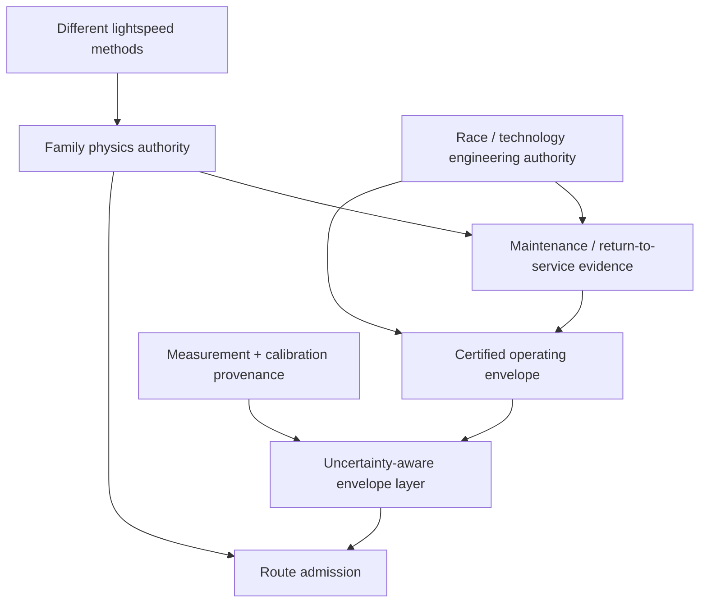
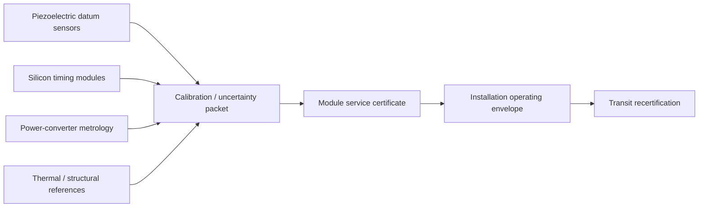
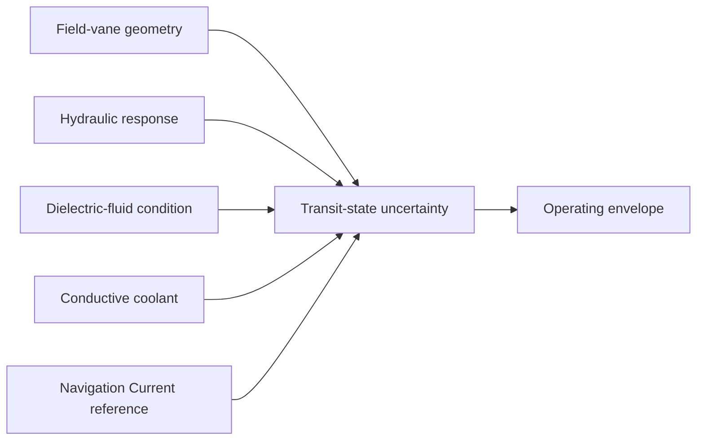
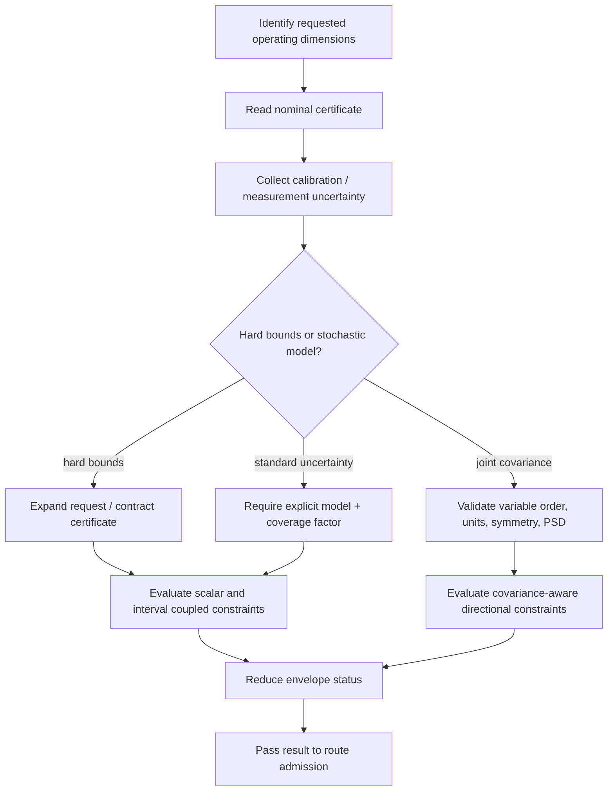

# Black Light FTL Uncertainty-Aware Operating Envelope Manual

**Status:** derived engineering authority subordinate to family physics, the consolidated propulsion/transit authority, and source-specific canon.  
**Design source:** *The different lightspeed methods*.  
**Purpose:** define how measurement uncertainty, calibration uncertainty, model uncertainty, covariance, aging drift, and incomplete evidence constrain a certified operating envelope without inventing false precision or unsupported probability claims.

---

## 1. Why this layer exists

An operating-envelope certificate that says

\[
T\in[260,340]\ \mathrm{K}
\]

is incomplete if the lower and upper limits themselves are uncertain, if the current temperature estimate is uncertain, or if the relevant power, thermal, timing, and alignment quantities are correlated.

The first operating-envelope implementation correctly enforced interval containment, but it treated supplied interval edges as exact. This manual closes that gap.

The governing distinction is:

\[
\boxed{\text{numerical value}\neq\text{exact knowledge of that value}.}
\]

Likewise:

\[
\boxed{\text{standard deviation}\neq\text{guaranteed bound}.}
\]

and:

\[
\boxed{\text{missing covariance}\neq 0\text{ covariance}.}
\]

A safety system that silently replaces missing uncertainty with zero does not become precise. It becomes dishonest.

---

## 2. Authority chain



The uncertainty layer does not choose a transit family and does not replace family-specific route safety.

---

## 3. Three kinds of uncertainty must not be conflated

### 3.1 Deterministic bounded uncertainty

A source may establish a guaranteed or conservative absolute error:

\[
x=x_0\pm u.
\]

This is usable directly as a safety bound because the authority has already declared the interval semantics.

For asymmetric uncertainty:

\[
x\in[x_0-u_L,\ x_0+u_U].
\]

### 3.2 Standard uncertainty

A standard uncertainty, standard error, or standard deviation-like value describes spread under a declared model. It is not itself a guaranteed limit.

If an authority explicitly supplies a coverage factor \(k\), then an engineering coverage interval may be formed as

\[
u_{\rm eff}=k u_s.
\]

The runtime does **not** supply a default \(k\).

It also does not infer that the underlying model is Gaussian simply because a quantity is called sigma.

### 3.3 Joint covariance

For a vector of quantities

\[
\mathbf x=[x_1,x_2,\ldots,x_n]^T,
\]

joint second-order uncertainty is represented by

\[
\Sigma=\operatorname{Cov}(\mathbf x).
\]

The diagonal terms are variances and the off-diagonal terms are covariances.

These off-diagonal terms matter whenever common thermal, power, calibration, structural, or reference effects move multiple quantities together.

---

## 4. Conservative scalar envelope mathematics

Let the nominal certified interval be

\[
X_c=[L_c,U_c]
\]

and the nominal requested interval be

\[
X_r=[L_r,U_r].
\]

If certified lower/upper uncertainties are \(u_{cL}\) and \(u_{cU}\), the guaranteed certified interval contracts to

\[
\boxed{X_c^*=[L_c+u_{cL},\ U_c-u_{cU}]}. 
\]

If requested-state uncertainties are \(u_{rL}\) and \(u_{rU}\), the state that must be demonstrated safe expands to

\[
\boxed{X_r^*=[L_r-u_{rL},\ U_r+u_{rU}]}. 
\]

Certification requires full containment:

\[
\boxed{
L_r-u_{rL}\ge L_c+u_{cL}
\quad\land\quad
U_r+u_{rU}\le U_c-u_{cU}
}.
\]

The uncertainty-aware signed margin is

\[
\boxed{
m^*=\min\left[(L_r-u_{rL})-(L_c+u_{cL}),\ (U_c-u_{cU})-(U_r+u_{rU})\right].
}
\]

If

\[
m^*<0,
\]

the requested state is outside the conservative certified region.

---

## 5. Certificate uncertainty can destroy the certificate

Suppose a nominal certificate claims

\[
X_c=[100,120]
\]

but its lower and upper boundary uncertainties are both 11 units.

Then

\[
X_c^*=[111,109].
\]

The lower guaranteed limit exceeds the upper guaranteed limit.

That is not a narrow certificate. It is an internally inconsistent certificate:

\[
\boxed{L_c+u_{cL}>U_c-u_{cU}\Rightarrow\texttt{CONFLICT}.}
\]

The correct response is not to clamp the interval to a point or ignore uncertainty. The evidence is inadequate for the claimed certification.

---

## 6. Standard uncertainty requires explicit coverage semantics

If an instrument reports

\[
x=50,
\qquad
u_s=0.4,
\]

that alone does not define a safety interval.

If the calibration authority additionally establishes

\[
k=3,
\]

under a stated distribution/model convention, then

\[
u_{\rm eff}=3(0.4)=1.2.
\]

Only then may the safety evaluator use

\[
x\in[48.8,51.2]
\]

for that declared coverage semantics.

No universal mapping from \(k\) to a percentage is asserted by Black Light unless the statistical distribution is itself part of the authority.

---

## 7. Correlation and covariance

Consider a coupled safety quantity

\[
y=\mathbf a^T\mathbf x.
\]

For mean vector \(\boldsymbol\mu\),

\[
\mu_y=\mathbf a^T\boldsymbol\mu.
\]

For covariance matrix \(\Sigma\), the directional variance is

\[
\boxed{\sigma_y^2=\mathbf a^T\Sigma\mathbf a}. 
\]

Thus

\[
\boxed{\sigma_y=\sqrt{\mathbf a^T\Sigma\mathbf a}}.
\]

When an authority explicitly supplies a coverage factor \(k\), a one-sided engineering demand may be evaluated as

\[
\boxed{d_k=\mathbf a^T\boldsymbol\mu+k\sqrt{\mathbf a^T\Sigma\mathbf a}}.
\]

For a constraint

\[
\mathbf a^T\mathbf x\le b,
\]

certification requires

\[
\boxed{d_k\le b}.
\]

This is not a universal probability-of-failure calculation. It is an authority-declared confidence/coverage calculation under the supplied model.

---

## 8. Why independence must never be assumed silently

For two variables,

\[
Y=aX_1+bX_2,
\]

variance is

\[
\operatorname{Var}(Y)=a^2\sigma_1^2+b^2\sigma_2^2+2ab\operatorname{Cov}(X_1,X_2).
\]

Dropping the covariance term is equivalent to asserting

\[
\operatorname{Cov}(X_1,X_2)=0.
\]

That is a physical/statistical claim.

It cannot be inferred merely because two values came from different instruments.

Two nominally separate sensors may share:

- the same thermal reference;
- the same structural datum;
- the same timing oscillator;
- the same power rail;
- the same calibration fixture;
- the same navigation reference;
- the same fluid reservoir;
- the same model assumptions.

Therefore:

\[
\boxed{\text{separate sensors}\not\Rightarrow\text{independent errors}.}
\]

---

## 9. Covariance-matrix validity

A covariance matrix must be square and symmetric:

\[
\Sigma=\Sigma^T.
\]

Its diagonal must be nonnegative:

\[
\Sigma_{ii}\ge0.
\]

It must also be positive semidefinite:

\[
\boxed{\mathbf z^T\Sigma\mathbf z\ge0\quad\forall\mathbf z}. 
\]

Otherwise some linear combination of variables would have negative variance, which is physically meaningless.

The runtime checks the supplied matrix rather than silently repairing it.

A materially non-positive-semidefinite matrix is `CONFLICT`.

---

## 10. Units and covariance

Covariance is dimensional.

If \(x_1\) is measured in watts and \(x_2\) in kelvin, then

\[
\operatorname{Cov}(x_1,x_2)
\]

has units of watt-kelvin.

Therefore covariance calculations require a declared variable order and normalized unit convention.

The runtime requires `normalizedUnits: true` for covariance models used by the generic adapter.

This is deliberately strict. Silent unit conversion inside a covariance matrix is an excellent way to produce plausible-looking nonsense.

---

## 11. Deterministic interval arithmetic remains the fallback

When a joint probability model is absent but bounded intervals exist, Black Light uses deterministic conservative interval arithmetic.

For

\[
y=\sum_i a_i x_i
\]

with

\[
x_i\in[L_i,U_i],
\]

the maximum possible value is

\[
\boxed{
y_{\max}=\sum_i\max(a_iL_i,a_iU_i).
}
\]

This requires no independence assumption.

It may be conservative, but it is epistemically honest.

---

## 12. Confidence regions are not route-safety probabilities

Even if an operating-envelope model uses covariance, the resulting coverage calculation applies to the installation state variables represented by that model.

It does not automatically include:

- hidden mass along the route;
- unobserved shear-lane bifurcations;
- destination occupancy;
- Q-state topology;
- manifold state;
- emergent gravitational disturbances;
- family-specific sensor blind spots;
- sabotage or battle damage outside the model.

Therefore:

\[
\boxed{
P(\text{installation state inside modeled envelope})
\neq
P(\text{safe transit}).
}
\]

The generic runtime intentionally does not output a probability of successful transit.

---

## 13. Aging and drift

A calibration certificate may become less informative with time.

If a source supplies a worst-case bounded drift rate \(r_{\max}\), a conservative allowance may be

\[
\boxed{u_{\rm age}(t)=u_0+r_{\max}\Delta t}. 
\]

This is valid only if the linear worst-case model is itself justified over the interval.

It must not be extrapolated indefinitely.

Random walk or stochastic process drift requires its own process model. Elapsed time alone does not justify inventing one.

---

## 14. Thermal uncertainty

For the short-time lumped model

\[
C_{th}\frac{dT}{dt}=P_{heat}-P_{reject},
\]

uncertainty may exist in all three terms.

Even where nominal heat balance is favorable,

\[
P_{reject}>P_{heat},
\]

uncertainty can erase the apparent margin.

A deterministic conservative evaluation can use

\[
P_{heat}^{\max}
\]

and

\[
P_{reject}^{\min}.
\]

The resulting conservative temperature slope is

\[
\boxed{
\left(\frac{dT}{dt}\right)_{\max}
=
\frac{P_{heat}^{\max}-P_{reject}^{\min}}{C_{th}^{\min}}
}
\]

provided \(C_{th}^{\min}>0\) and the lumped model remains valid.

---

## 15. Power and energy uncertainty

Protected energy margin is nominally

\[
M_E=E_{available}-E_{required}.
\]

Under deterministic bounds, a conservative margin becomes

\[
\boxed{
M_E^{\min}=E_{available}^{\min}-E_{required}^{\max}.
}
\]

Likewise, power delivery must satisfy

\[
\boxed{
P_{available}^{\min}(t)\ge P_{required}^{\max}(t)
}
\]

through every critical interval.

Enough expected energy is not enough.

Enough mean power is not enough.

The lower guaranteed delivery must cover the upper guaranteed demand where a deterministic certification is claimed.

---

## 16. Timing uncertainty

For an intervention chain

\[
t_{int}=\sum_i t_i,
\]

deterministic interval bounds give

\[
\boxed{
T_{int}
\in
\left[
\sum_i L_i,
\sum_i U_i
\right].
}
\]

If a valid joint covariance model exists for stage timing, then

\[
\operatorname{Var}(T_{int})
=
\mathbf1^T\Sigma_t\mathbf1.
\]

Again, the covariance terms matter.

A shared clock/reference disturbance can move many stages together.

---

## 17. Continuous projected-progress families

For a continuous projected-progress family,

\[
M_T=\frac{D_B}{v_p}-t_{int}.
\]

The quantity \(v_p\) is projected route progress, not necessarily local hull velocity.

If deterministic uncertainty exists in all terms, route authority should use conservative combinations appropriate to the signs of those terms.

The generic operating-envelope uncertainty layer does not invent the family-specific mapping. It supplies certified installation bounds to the family authority.

---

## 18. PRECOMMIT families

PRECOMMIT systems retain

\[
M_T=t_{prediction}-t_{int}.
\]

No local superluminal speed is invented.

If the prediction horizon and intervention time are uncertain, a deterministic safety bound is

\[
\boxed{
M_T^{\min}=t_{prediction}^{\min}-t_{int}^{\max}.
}
\]

A positive nominal margin with negative conservative margin is not certified.

---

## 19. Wormhole and gate systems

Gate systems may have uncertainty in:

- mouth synchronization;
- reference state;
- throat/aperture stability;
- power reserve;
- admission timing;
- exit occupancy sensing;
- clearance timing;
- structural alignment;
- endpoint environment.

They are not converted into free-flight speed simply to reuse a velocity equation.

---

## 20. Gravitational environment uncertainty

The design source specifically establishes that transit technologies interact differently with gravitational environment and that gravitational shear can become catastrophic.

A tidal or gravity-gradient measurement may therefore carry both measurement and model uncertainty.

An installation tolerance such as

\[
\|\mathbf T\|\le T_{max}
\]

must be evaluated against the conservative requested environment when used as a machinery certificate.

But passing that machinery limit still does not prove that a shear-lane route is safe.

That remains family-specific route physics.

---

## 21. Ar'nock embodiment

Ar'nock uncertainty work should ordinarily be embodied through their solid-state modular engineering tradition.



Common uncertainty sources include:

- module-to-module calibration transfer;
- piezoelectric preload and mounting state;
- resonant-reference drift;
- deterministic-bus propagation measurement;
- thermal datum movement;
- converter measurement accuracy;
- connector and interface resistance;
- refit alignment;
- vessel configuration changes.

Ordinary Ar'nock metrology remains electromechanical and solid-state by default.

Bioprinting does not become the default calibration technology simply because it exists elsewhere aboard the vessel.

---

## 22. Zwlei Mur'rek embodiment

Mur'rek uncertainty may be expressed through different machinery:



Useful uncertainty sources may include:

- hydraulic response variation;
- vane geometry and symmetry;
- fluid dielectric-state variation;
- coolant conductivity/flow state;
- Navigation Current reference stability;
- Sensor Choir/Ampulla calibration.

The machinery embodiment does not resolve the consolidated FTL family.

\[
\boxed{\text{gravitic slipstream}\not\Rightarrow\texttt{slipstream-shear}}
\]

and

\[
\boxed{\text{gravitic slipstream}\not\Rightarrow\texttt{gravitational-plane}}.
\]

---

## 23. Scaling behavior

Larger vessels accumulate more potential common causes:

- longer timing/reference trees;
- more thermal zones;
- more cross-ties;
- more module revisions;
- more structural datum chains;
- more calibration-transfer events;
- more sectional failover states.

The control scaling parameter remains

\[
\Pi_c=\frac{L_c}{v_c\tau_r}.
\]

As \(\Pi_c\) grows, local control becomes more important.

The uncertainty analogue is organizational rather than a new universal constant: large ships need sectional uncertainty budgets and explicit common-cause accounting rather than one vessel-wide fictional error percentage.

---

## 24. Signature implications

Uncertainty work itself can produce observable signatures.

Calibration may require:

- controlled drive pulses;
- resonant sweeps;
- thermal holds;
- synchronized field-sector actuation;
- hydraulic cycling;
- high-power converter tests;
- navigation-reference interrogation.

A vessel conducting post-refit recertification may therefore be externally distinguishable from a vessel merely idling.

Generators may use these signatures as scene evidence when supported by the machinery embodiment.

---

## 25. Failure taxonomy

| Code | Meaning |
|---|---|
| `UE-NO-BOUND` | Required uncertainty bound absent |
| `UE-STD-NO-COVERAGE` | Standard uncertainty supplied without explicit coverage semantics |
| `UE-UNIT` | Uncertainty units not normalized to the evaluated quantity |
| `UE-CERT-COLLAPSE` | Certified uncertainty consumes the entire nominal certified interval |
| `UE-COV-MISSING` | Covariance-aware certification requested but covariance model missing |
| `UE-COV-SHAPE` | Covariance matrix/variable shape invalid |
| `UE-COV-SYMMETRY` | Covariance matrix materially nonsymmetric |
| `UE-COV-PSD` | Covariance matrix not positive semidefinite |
| `UE-COV-VAR` | Required covariance variable absent |
| `UE-COV-UNITS` | Covariance model units not explicitly normalized |
| `UE-OUTSIDE` | Uncertainty-expanded request falls outside uncertainty-contracted certificate |
| `UE-PROBABILITY-LEAK` | Generator incorrectly interprets the packet as transit-success probability |
| `UE-FAMILY-LEAK` | Technology/uncertainty evidence incorrectly selects FTL family |

---

## 26. Practical procedure UE-01



Technician checklist:

1. Identify which quantities actually govern this installation and requested operating point.
2. Record nominal certified limits without rounding away source precision.
3. Record current requested values/ranges.
4. Separate deterministic guaranteed bounds from statistical standard uncertainties.
5. Require explicit coverage semantics before converting standard uncertainty into an engineering band.
6. Preserve units and normalize them before matrix operations.
7. If a covariance model is used, verify variable order, matrix shape, symmetry and positive semidefiniteness.
8. Contract uncertain certified regions.
9. Expand uncertain requested regions.
10. Evaluate coupled constraints conservatively.
11. Record unresolved common-cause correlation rather than assuming independence.
12. Preserve source/calibration/model provenance.
13. Pass only the resulting envelope disposition to route admission; do not invent a route-success probability.

---

## 27. Worked scalar example

Certified coolant-flow range:

\[
[8.0,14.0]\ \mathrm{kg/s}.
\]

Certified-bound uncertainty:

\[
\pm0.25\ \mathrm{kg/s}.
\]

Therefore:

\[
X_c^*=[8.25,13.75].
\]

Requested operating range:

\[
[9.0,13.4]\ \mathrm{kg/s}
\]

with measurement uncertainty

\[
\pm0.20\ \mathrm{kg/s}.
\]

Thus:

\[
X_r^*=[8.8,13.6].
\]

The signed conservative margin is

\[
m^*=\min(8.8-8.25,13.75-13.6)=0.15\ \mathrm{kg/s}.
\]

The request remains inside the certified region, but the physical margin is only 0.15 kg/s.

---

## 28. Worked standard-uncertainty example

Suppose Ar'nock command-latency metrology reports

\[
\tau=118\ \mu s
\]

with standard uncertainty

\[
u_s=2\ \mu s.
\]

The service authority explicitly requires

\[
k=3
\]

for this calibration class under its declared distribution model.

Then:

\[
u_{eff}=6\ \mu s.
\]

The request must be treated as

\[
\tau\in[112,124]\ \mu s.
\]

If the upper certified limit after certificate uncertainty is 122 μs, the request is blocked even though the nominal 118 μs value appears acceptable.

---

## 29. Worked covariance example

Consider a cooling burden expressed through two normalized variables:

\[
y=0.7x_1+0.5x_2
\]

with mean

\[
\boldsymbol\mu=
\begin{bmatrix}
4\\
3
\end{bmatrix}
\]

and covariance

\[
\Sigma=
\begin{bmatrix}
0.25 & 0.12\\
0.12 & 0.36
\end{bmatrix}.
\]

For

\[
\mathbf a=
\begin{bmatrix}
0.7\\
0.5
\end{bmatrix},
\]

nominal demand is

\[
\mu_y=0.7(4)+0.5(3)=4.3.
\]

Directional variance is

\[
\sigma_y^2=\mathbf a^T\Sigma\mathbf a.
\]

Expanding:

\[
\sigma_y^2
=0.7^2(0.25)+0.5^2(0.36)+2(0.7)(0.5)(0.12)
=0.2965.
\]

Thus

\[
\sigma_y\approx0.5445.
\]

If the authority declares \(k=2\),

\[
d_k=4.3+2(0.5445)\approx5.389.
\]

For a certified limit

\[
b=5.2,
\]

the covariance-aware demand exceeds the limit and blocks certification.

If the covariance term had been silently discarded, the computed uncertainty would have been smaller and the decision could change. That is precisely why missing covariance may not be treated as zero.

---

## 30. Educational text: what a junior engineer should learn

A junior transit engineer should be able to explain the difference between:

- a measured value;
- a displayed number;
- a calibrated uncertainty;
- a guaranteed engineering bound;
- a standard uncertainty;
- a covariance;
- a coverage factor;
- an operating-envelope margin;
- a family-specific route-safety margin.

They should also be able to say, without hesitation:

> A model can be mathematically precise and still be physically wrong if its uncertainty assumptions are unsupported.

---

## 31. Transit Safety Engineering 780

### Course title

**Transit Safety Engineering 780 — Uncertainty, Covariance, and Conservative Operating-Envelope Certification**

### Core competencies

Students must be able to:

- propagate deterministic scalar bounds;
- distinguish aleatory/statistical spread from bounded engineering uncertainty;
- audit coverage-factor assumptions;
- validate covariance matrices;
- calculate directional variance \(\mathbf a^T\Sigma\mathbf a\);
- identify hidden independence assumptions;
- build conservative power, thermal and timing margins;
- preserve race/technology embodiment without collapsing machinery cultures together;
- preserve FTL-family firewalls;
- explain why installation confidence is not transit-success probability.

### Laboratory exercises

1. Re-certify an Ar'nock command module after calibration transfer between revisions.
2. Diagnose a covariance matrix with impossible negative variance.
3. Compare deterministic interval arithmetic against a justified covariance-aware calculation.
4. Re-certify a Mur'rek field-vane control section with uncertain hydraulic response.
5. Demonstrate a route that is physically admissible but operationally rejected because uncertainty erases the installation margin.

---

## 32. Generator requirements

Every generated uncertainty-aware system should preserve:

- nominal value/range;
- uncertainty representation;
- effective conservative range;
- units;
- epoch where relevant;
- calibration/model identity;
- distribution semantics where statistical treatment is used;
- coverage factor when used;
- covariance variable order and matrix when used;
- source/provenance;
- unresolved assumptions;
- family status separately from technology basis.

Do not generate a confidence percentage unless the source/model explicitly supports that exact interpretation.

Do not generate random decimal precision as a substitute for metrology.

---

## 33. Canon safeguards

\[
\boxed{\text{more decimal places}\not\Rightarrow\text{more accuracy}}
\]

\[
\boxed{\text{standard uncertainty}\not\Rightarrow\text{hard bound}}
\]

\[
\boxed{\text{missing covariance}\not\Rightarrow\text{independence}}
\]

\[
\boxed{\text{operating-envelope confidence}\not\Rightarrow\text{route-success probability}}
\]

\[
\boxed{\text{technology basis}\not\Rightarrow\text{FTL family}}
\]

These are generator invariants, not stylistic suggestions.

---

## 34. Provenance close-out

An uncertainty-aware certificate should be reconstructible from its evidence.

At minimum retain:

```text
CERTIFICATE / INSTALLATION
  identity
  revision
  family status

NOMINAL LIMITS
  value or interval
  unit
  source

UNCERTAINTY
  representation
  magnitude
  coverage semantics if statistical
  calibration/model authority
  epoch

CORRELATION
  covariance model id
  variable order
  matrix
  unit normalization
  distribution model
  coverage factor

RESULT
  conservative effective bounds
  coupled-constraint demand
  margin
  disposition
  unresolved assumptions
```

If those records are missing, later engineers should not be forced to reverse-engineer the safety case from a single word saying `CERTIFIED`.
