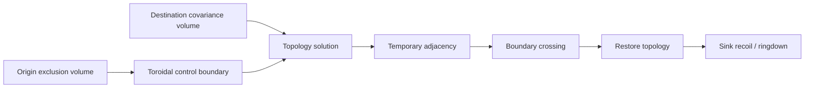
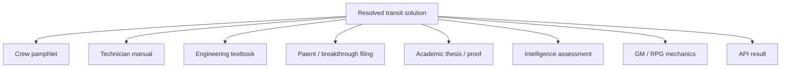

# Black Light FTL Upgrade Causality Calculus

**Status:** subordinate mathematical progression and generator-accounting reference.  
**Authority:** subordinate to `BLACK_LIGHT_PROPULSION_TRANSIT_AUTHORITY.md`, surviving named race/species/manufacturer canon, `BLACK_LIGHT_FTL_MATHEMATICAL_TRANSIT_MODELS.md`, and `BLACK_LIGHT_FTL_GRAVITY_SAFETY_EFFICIENCY_MODELS.md`.  
**Source impetus:** Google Drive document **“The different lightspeed methods”**, document id `1e0Xp71EFubBZgXWjjvPxAqPoJIZNwqS6nu1-r7Kil7Y`, observed revision `ANLCKQllC5h6dLaX5H1RpK8aUFVWsi-IV7gbMHUd0Qq7mIe5uGsLFi5_Hrsr8B6dl8t_ezB0fTSygxrnIBtifAHW79bgSbswp1zF3NaEil0`.  
**Canon discipline:** drive identities, recovered Path stages, current runtime envelopes, gravity-sensitivity requirements, shear/lensing-plane hazards, sensor-horizon doctrine, and safety-improves-with-drive-maturity requirements are `CONFIRMED` where they survive in authority. The calculus below is `DERIVED` unless marked otherwise. Numerical coefficients not fixed by source are `PROPOSED` and must be calibrated rather than presented as recovered constants.

---

## 1. Why this calculus exists

A Black Light transit Path may not advance because a table says that P5 is faster than P4. Every increase in equivalent speed, safe range, payload, cycle rate, gravity tolerance, endpoint accuracy, route freedom, or efficiency must be explainable as the consequence of one or more real improvements in the civilization's ability to **model, create, contain, measure, control, power, survive, or recover the transit transformation**.

The governing relationship is therefore:

\[
\text{capability improvement} = \text{changed mathematics} + \text{changed machinery} + \text{changed admissible operating set}.
\]

The confirmed runtime speed/range envelopes remain authoritative capability coordinates. This document supplies the missing causal bookkeeping beneath those coordinates.

---

## 2. Common performance state

For family \(f\), Path stage \(p\), vessel state \(S\), environment \(E\), infrastructure \(I\), and technology basis \(B\), define the resolved performance vector

\[
\mathbf Y_{f,p}=\begin{bmatrix}
\chi\\
R_{safe}\\
v_{eq}\\
t_{solve}\\
t_{spool}\\
t_{active}\\
t_{recover}\\
B_{source}\\
\sigma_{endpoint}\\
r_{min}\\
H_s\\
P_{loss}\\
M_{payload}
\end{bmatrix}.
\]

The terms are:

- \(\chi\): route/geometric gain, meaning ordinary separation divided by the family's effective transit measure;
- \(R_{safe}\): certified maximum range in the resolved environment;
- \(v_{eq}=D_0/t_{total}\): equivalent comparison speed, not necessarily hull velocity;
- \(t_{solve},t_{spool},t_{active},t_{recover}\): mission-time components;
- \(B_{source}\): required source burden, deliberately not assumed to be literal joules for every family;
- \(\sigma_{endpoint}\): endpoint/state uncertainty measure;
- \(r_{min}\): solved gravity-proximity exclusion boundary for the family and installation;
- \(H_s\): actionable sensor/prediction horizon;
- \(P_{loss}\): probability of unrecoverable transit loss under the modeled condition set;
- \(M_{payload}\): safely enclosed/translated payload mass.

This common vector does **not** imply common drive physics. It exists so a generator can compare what improved without pretending the mechanisms are equivalent.

---

## 3. Upgrade vector and causal attribution

Use the upgrade vector already established by the Mathematical Transit Models:

\[
\mathbf U=(M,F,A,S,E,N,D,C,R,I),
\]

where:

- \(M\): mathematical model and solver sophistication;
- \(F\): field/topology/state-control fidelity;
- \(A\): active material science;
- \(S\): structure, alignment, containment and load path;
- \(E\): energy density, conditioning and conversion efficiency;
- \(N\): navigation, sensing, reference quality and prediction;
- \(D\): drive size, distribution, miniaturization and effect coverage;
- \(C\): control bandwidth, synchronization and redundancy;
- \(R\): termination, damping, recovery and abort authority;
- \(I\): supporting infrastructure, beacons, surveyed corridors, gates, remote references or stellar plants.

The local causal sensitivity matrix is

\[
\mathsf J^{U}_{f,p}=\frac{\partial \mathbf Y_{f,p}}{\partial \mathbf U}.
\]

For a Path transition,

\[
\Delta\mathbf Y\approx \mathsf J^{U}_{f,p}\Delta\mathbf U
+\frac12\Delta\mathbf U^T\mathsf H_{f,p}\Delta\mathbf U,
\]

where \(\mathsf H\) permits nonlinear interaction effects. This matters because, for example, a stronger field generator may produce little additional range until a new solver can control it, and a better solver may produce little benefit until materials tolerate the newly found solution.

### 3.1 Causal contribution ledger

For reported output \(y_k\), define the unnormalized contribution from upgrade axis \(j\):

\[
q_{kj}=\left|\frac{\partial y_k}{\partial U_j}\Delta U_j\right|.
\]

When calibrated, the explanatory share is

\[
w_{kj}=\frac{q_{kj}}{\sum_j q_{kj}}.
\]

Until calibration exists, generators emit **qualitative ranks** (`PRIMARY`, `SECONDARY`, `ENABLING`, `NEUTRAL`) rather than invented percentages.

Example machine-readable explanation:

```json
{
  "transition":"P4->P5",
  "output":"safeRange",
  "causes":[
    {"axis":"MATH","rank":"PRIMARY","status":"DERIVED"},
    {"axis":"NAVIGATION","rank":"PRIMARY","status":"DERIVED"},
    {"axis":"ENERGY","rank":"SECONDARY","status":"CONFIRMED_SOURCE_FAMILY"},
    {"axis":"MATERIALS","rank":"ENABLING","status":"DERIVED"}
  ],
  "numericShares":null,
  "calibrationStatus":"UNCALIBRATED"
}
```

---

## 4. Gravity modifies the admissible solution, not merely the fuel bill

“The different lightspeed methods” requires all exotic transit families to lose efficiency or certainty near sufficiently strong gravitational distortion, with **different coefficients and tolerances by method**. It also requires gravitational shear/lensing structures to form useful but dangerous travel geography for methods that exploit them.

Let environmental gravity severity be

\[
G=w_\Phi\left|\frac{\Phi}{\Phi_*}\right|
+w_g\frac{\|\nabla\Phi\|}{g_*}
+w_T\frac{\|\nabla\nabla\Phi\|}{T_*}
+w_R\frac{\|R\|}{R_*}
+w_U U_m.
\]

For family \(f\):

\[
\eta_{g,f}=\exp[-(a_fG+b_fG^2+c_fG^{n_f}+d_fU_m+e_fB_f)].
\]

The effective family gain is

\[
\chi_{eff,f}=1+(\chi_{0,f}-1)
\eta_{g,f}\eta_{nav,f}\eta_{field,f}\eta_{struct,f}.
\]

The safety boundary is solved from constraints, not drawn as a universal magic sphere:

\[
\Omega_f=\{x:\eta_{g,f}\ge\eta_{min,f},\;M_H>0,\;M_{recovery}>0,\;J_f\le J_{max,f}\}.
\]

The apparent minimum jump radius around a planet or star is the boundary \(\partial\Omega_f\). A higher Path can push that boundary inward by changing mathematics, sensing, field control, structure, materials or recovery. It does not make gravity irrelevant.

---

## 5. Primitive-to-mature progression rule

Each Path family follows the same **development logic**, even though the mathematics differs:


This is not a universal statement that every archive Path has identical hardware milestones. It is the `DERIVED` causal pattern connecting the recovered P0–P6 stages: primitive systems know a narrow mathematical case and require fixed geometry; mature systems expand the admissible solution family, reduce uncertainty, distribute machinery, improve control and recover from disturbances.

---

# 6. Metric Compression Envelope — causal calculus

**Operator:** controlled metric perturbation \(g_{\mu\nu}^{eff}=g_{\mu\nu}^{env}+h_{\mu\nu}^{drive}\).  
**Effective distance:**

\[
D_M=\int_\Gamma\sqrt{\gamma_{ij}^{eff}dx^idx^j},\qquad \chi_M=D_0/D_M.
\]

**Primitive mathematical limitation:** P0 can solve only small, nearly static perturbations with narrow boundary conditions.  
**Primary advanced limitation:** high-gain solutions must remain closed, low-tidal, controllable across horizons, and dynamically stable against the real environment.

| Transition | Dominant changed mathematics | Dominant machinery/material change | Term that improves |
|---|---|---|---|
| P0→P1 | longitudinal compression + inertial-relief terms | better symmetry/timing/supports | \(\chi_M\uparrow, P_{grad}\downarrow\) |
| P1→P2 | closed 3D boundary-value solution | whole-hull emitters, radiation handling | coverage margin \(\uparrow\) |
| P2→P3 | causal-horizon constrained optimization | higher field density, horizon sensors | admissible \(\chi_M\) crosses c-equivalent regime |
| P3→P4 | multi-sector time-dependent solution | distributed emitters/control | residual \(\epsilon_M\downarrow\) under hull motion |
| P4→P5 | predictive route optimization through gravity terrain | strategic energy/material endurance | \(R_{safe}\uparrow, B_{source}/D_0\downarrow\) |
| P5→P6 | adaptive receding-horizon tensor control | compact sectors, self-calibration | cycle time \(\downarrow\), control density \(\uparrow\) |

**Efficiency development:** a primitive drive seeks more deformation; a mature drive seeks more **useful geodesic reduction per unit curvature stress**.

\[
\eta_M^*=\frac{D_0-D_M}{B_{source}(1+P_{grad}+P_{tidal})}.
\]

---

# 7. Gravitational-Plane Skimmer — causal calculus

**Operator:** constrained route selection over gravitational/equipotential/shear geometry.  
**Effective distance:**

\[
D_G=\int_{\Gamma^*}\frac{1+H_g}{1+L_g}\,ds.
\]

The Drive source's “gravitational lensing/shear planes” requirement is most directly relevant here. The environment is partly the propulsion infrastructure.

| Transition | Mathematical advance | Physical advance | Result |
|---|---|---|---|
| P0→P1 | fixed surveyed rail → local continuous equipotential solve | faster gradient sensing | leaves one ballistic rail and adheres to a changing surface |
| P1→P2 | multi-body barycentric model | interferometry, certified ephemerides | safe plane transitions inside complex systems |
| P2→P3 | stellar saddle and long-baseline curvature model | better references/field coupling | interstellar shear-plane transit |
| P3→P4 | dynamic sequence of admissible planes | distributed control | multiple-plane routing rather than single lane |
| P4→P5 | hidden-mass Bayesian/probabilistic inference | proxy sensing, larger libraries | unknown ridges become quantified risk |
| P5→P6 | receding-horizon geodesic re-optimization | high-bandwidth sensing/tiles | route can change before predicted lane failure |

For lane bifurcation, with branch coupling fractions \(c_1,c_2\) and branch-angle \(\Delta_b\):

\[
H_{fork}=c_1c_2\sin^2(\Delta_b/2)K_fQ_f.
\]

At sufficient \(H_{fork}\), the correct result is **forced de-transit or loss**, not a hidden random branch choice.

---

# 8. Hyperspatial Slipstream Shear — causal calculus

**Operator:** couple vessel to a metastable Q-boundary flow with normal-space projection \(\pi_Q\).  
**Effective distance:**

\[
D_S=\int_\Gamma \sigma_Q(q,u_Q,a)ds,
\]

where favorable shear yields small \(\sigma_Q\).

| Transition | Mathematical advance | Physical advance | Result |
|---|---|---|---|
| P0→P1 | observe boundary → solve one adhesion trajectory | phase-control payload coupler | controlled probe attachment |
| P1→P2 | bounded time-varying corridor prediction | stronger containment/tunnel | repeatable superluminal-equivalent route |
| P2→P3 | moving-origin and exit phase-velocity solution | shipboard coupler/Q sensors | mobile independent entry/exit |
| P3→P4 | stochastic Q-weather model | fleet sensors/wake control | reliable operations in variable streams |
| P4→P5 | long-horizon directional shear optimization | endurance and predictive sensing | strategic range through changing Q terrain |
| P5→P6 | rapid local reconstruction of ephemeral flow/wakes | compact high-bandwidth coupling | tactical exploitation of short-lived high-gain paths |

The conditioning of normal/Q correspondence is

\[
\kappa_Q=\|J_Q\|\|J_Q^{-1}\|.
\]

Higher capability is partly the ability to operate at larger \(\kappa_Q\) without intolerable emergence covariance.

---

# 9. Q-Lattice Phase Translation — causal calculus

**Operator:** graph/state translation across indexed phase cells \(\mathcal G_Q=(V_Q,E_Q)\).  
**Route cost:**

\[
C_Q(\pi)=\sum_{(i,j)\in\pi}
(w_d\ell_{ij}+w_\phi\epsilon_{\phi,ij}+w_\tau\epsilon_{\tau,ij}+w_oP_{occ}+w_sP_{state}).
\]

**Primitive mathematics:** nearest/known address transitions.  
**Mature mathematics:** authenticated long-range graph search with epoch correction, state-error correction and alternate-route handling.

| Transition | Main advance | Capability cause |
|---|---|---|
| P0→P1 | preserve bonded molecular invariants | payload state dimension increases |
| P1→P2 | coherent macroscopic whole-volume mapping | coverage and error correction improve |
| P2→P3 | remote authenticated address + epoch synchronization | usable interstellar address baseline increases |
| P3→P4 | autonomous graph search + anti-aliasing | dependence on fixed route computers falls |
| P4→P5 | network-scale dynamic route optimization | alternate paths and strategic throughput increase |
| P5→P6 | fault-tolerant mutable-state correction | living/damaged/active payloads remain admissible at extreme range |

For this family, “more range” is fundamentally a **better address/state solution**, not faster conventional motion.

---

# 10. N-Dimensional Manifold Drive — causal calculus

**Operator:** choose a geodesic \(\Gamma_N\) in \((\mathcal M^N,g_{AB})\) and maintain a valid return projection \(\pi\).  
**Effective distance:**

\[
D_N=\int_{\Gamma_N}\sqrt{g_{AB}dX^AdX^B},\qquad \chi_N=D_0/D_N.
\]

Increasing the number of controllable axes enlarges the candidate shortcut space but also increases topology and projection failure modes.

| Transition | Main mathematical advance | Enabling hardware | Result |
|---|---|---|---|
| P0→P1 | detect axes → hold one additional-axis test volume | axis resonators/reference frame | reproducible higher-dimensional displacement |
| P1→P2 | solve captive multi-axis geodesic and return map | topology metamaterials, clamps | useful payload traverses fixed manifold shortcut |
| P2→P3 | mobile embedding/orientation solve | shipboard projection rings | independent shipboard manifold travel |
| P3→P4 | adaptive multi-axis route search | distributed topology sensors/control | dynamically chooses better embeddings |
| P4→P5 | continuation/prediction beyond directly sampled manifold | deeper sensing + solver capacity | long-range geodesics remain certifiable |
| P5→P6 | fault-tolerant multi-axis solution under lost/degraded axes | self-reconfiguring field architecture | compact drive survives topology/machinery degradation |

Return-map conditioning remains a hard safety term:

\[
\kappa_\pi=\|J_\pi\|\|J_\pi^{-1}\|.
\]

A shorter \(D_N\) is useless if \(\kappa_\pi\) makes ordinary-space emergence indeterminate.

---

# 11. Discrete Fold-Jump — causal calculus

**Operator:** create controlled temporary topological adjacency \(\mathcal F_\Theta:\mathcal M\rightarrow\mathcal M_\Theta\).  
**Distance transform:**

\[
d_{\mathcal M_\Theta}(A,B)\ll d_\mathcal M(A,B),\qquad
\chi_F=\frac{d_\mathcal M(A,B)}{d_{\mathcal M_\Theta}(A,B)}.
\]

A toroidal 3D **control volume** is a coherent `DERIVED` embodiment of the recovered aperture-ring/waveguide machinery, but is not to be mislabeled as confirmed \(T^3\) topology.



| Transition | Mathematical advance | Mechanical/material advance | Why range/cycle improves |
|---|---|---|---|
| P0→P1 | larger bijective payload boundary | stronger rings/panels | larger useful folded volume |
| P1→P2 | stable repeated endpoint solution | occupancy sensing/recoil frame | repeated logistics without requalifying entire geometry |
| P2→P3 | remote mobile endpoint solve | shipboard gravimetry/high-density storage | fixed orbital system becomes independent jump drive |
| P3→P4 | lower endpoint covariance + residual minimization | distributed timing, sinks/dampers | safe cycle time falls; fleet deconfliction possible |
| P4→P5 | propagate endpoint/environment covariance over strategic baseline | predictive gravity model, stronger waveguides | long-fold admissible set expands |
| P5→P6 | robust topology-mode search under short-notice conditions | compact storage, rapid ringdown, autonomous verification | tactical cycle with extreme adjacency gain |

The primitive drive can fold only a **known nearby geometry**. The mature drive is superior chiefly because it can certify and impose a much more remote, uncertain and dynamically changing adjacency with lower residual stress.

---

# 12. Anchored Wormhole / Gate — causal calculus

**Operator:** maintain multiply connected topology with controlled mouth/throat geometry.  
**Useful distance:**

\[
D_W=D_{approach}+L_{throat}+D_{departure}+C_{queue}+C_{transfer}.
\]

| Transition | Main advance | Result |
|---|---|---|
| P0→P1 | microscopic stability solution → macroscopic flow model | cargo aperture becomes possible |
| P1→P2 | two-mouth synchronization + asymmetric mass-flow control | vehicle-scale paired gates |
| P2→P3 | long-baseline independent mouth control | interstellar fixed route |
| P3→P4 | network graph scheduling/fault isolation | civilization-scale corridor network |
| P4→P5 | deep synchronization + controlled mouth relocation | strategic links and higher throughput |
| P5→P6 | coupled self-stabilizing lattice control | damaged nodes can be isolated/rebalanced without network collapse |

For gate technology, a ship's “FTL range” may be nearly meaningless. The relevant strategic variables are **network reach, mouth separation, throat capacity, queue time, synchronization margin and access rights**.

---

# 13. Quantum Phase Displacement — causal calculus

**Operator:** map a macroscopic state to an admissible nonlocal destination state.  
**State-space mismatch:**

\[
J_P=w_sD_B^2+w_oP_{occupation}+w_rP_{reference}+w_cP_{conservation}+w_iP_{identity}.
\]

| Transition | Mathematical advance | Physical advance | Result |
|---|---|---|---|
| P0→P1 | simple prepared state → high-dimensional material invariants | tomography/coherence volume | industrial masses become admissible |
| P1→P2 | whole macroscopic state mapping + duplicate/residual checks | full-volume control/quarantine | vehicles and complex cargo |
| P2→P3 | remote authenticated target state + continuity ledger | beacons, strategic references | interstellar displacement |
| P3→P4 | onboard compatibility analysis | autonomous tomography/reference hardware | independent operation |
| P4→P5 | scalable decomposition/recomposition and long reference chains | strategic coherence infrastructure | fleets/populations become tractable |
| P5→P6 | fault-tolerant mutable-state/identity preservation | compact error correction | extreme range without freezing occupants into idealized static cargo |

Range rises when the solver can prove that a distant target is a **valid state destination with acceptable continuity and occupation risk**. Distance is only one contributor to that proof burden.

---

# 14. Relativistic Inertial Torch — causal control baseline

**Operator:** ordinary acceleration through every intervening kilometer.  
**Physics:**

\[
\gamma=\frac{1}{\sqrt{1-v^2/c^2}},\qquad
\Delta\eta=\frac{v_e}{c}\ln\frac{m_0}{m_1},\qquad
v=c\tanh\Delta\eta.
\]

| Transition | Primary cause of improvement |
|---|---|
| P0→P1 | replaces one external launch impulse with sustained onboard fusion pulse acceleration |
| P1→P2 | higher exhaust velocity/energy density through antimatter catalysis |
| P2→P3 | integrates shielding, braking, life support and relativistic navigation into independent ship |
| P3→P4 | fleet-grade debris prediction/reference handling and crew survival |
| P4→P5 | extreme thermal/material/shielding capability sustains near-light operation |
| P5→P6 | autonomous prediction and field-assisted protection approaches practical causal asymptote |

This family is the control experiment for the setting. It demonstrates that simply pouring more energy into ordinary velocity encounters the relativistic asymptote; the exotic families obtain strategic gains by changing the relevant route or state mathematics.

---

## 15. Technology basis changes coefficients and machinery, not the family operator

A family operator remains recognizable across civilizations, while its physical variables are implemented in the seven current technology bases.

For resolved installation \(i\):

\[
\Theta_i=\mathcal R_f(\Theta_{math},B,manufacturer,scale,condition).
\]

Examples:

| Basis | What an improvement in \(F\), \(C\), or \(E\) physically means |
|---|---|
| Terrestrial electromechanical | tighter coil geometry, lower-loss buses, faster optical/electronic control, stronger cryogenic structures |
| Aquatic electrochemical-hydraulic | purer ionic working medium, higher pressure authority, less cavitation, faster hydraulic/electrochemical phase control |
| Cryogenic ammonia-halocarbon | improved superconductive state, contraction-aligned structure, cleaner cryofluid, lower timing drift |
| Gas-giant fluidic-electrostatic | higher membrane stability, charge-density control, pressure-field precision, acoustic timing fidelity |
| Biological symbiotic | more coherent field-bearing tissue, stronger vascular energy/heat transport, better neural phase synchrony, regenerative reserve |
| Mineral piezoelectric-photonic | larger coherent crystal domains, better preload, fewer defects, faster photonic/phononic control, improved annealing |
| Field-mediated postmaterial | greater coherence volume, stronger authenticated reference, denser adaptive anchor topology, safer fallback reconstruction |

Thus a race-specific generator should never output “+20% field efficiency” without also explaining what physically changed in that civilization's machine language.

---

## 16. Sensor horizon must scale with transit capability

The Drive document explicitly requires safety sensing to improve with jump/transit technology. Define

\[
H_s=v_{proj}t_{predict},
\]

and required intervention horizon

\[
H_{req}=v_{proj}(t_{sensor}+t_{solve}+t_{decision}+t_{field}+t_{exit}+t_{clear}).
\]

Then

\[
M_H=H_s-H_{req}.
\]

An installation is not safe merely because its sensors detect a hazard. It is safe enough to continue only when detection occurs with enough margin to execute a family-valid intervention.

The maturity rule is:

\[
\frac{dH_s}{dp}>0 \quad\text{and/or}\quad
\frac{dt_{intervention}}{dp}<0
\]

for meaningful Path safety improvement, subject to family limits.

A Fold-Jump mostly improves pre-commit certainty because post-commit intervention is poor. A Skimmer or Slipstream can gain more from forward prediction and emergency de-transit. A Gate gains from upstream scheduling, throat monitoring and traffic isolation. Phase Displacement gains from destination-state prevalidation and quarantine rather than “steering.”

---

## 17. Mathematical efficiency is not one number

Every generated drive should expose an efficiency vector:

\[
\boldsymbol\eta_f=(\eta_E,\eta_G,\eta_N,\eta_F,\eta_S,\eta_R,\eta_I),
\]

where:

- \(\eta_E\): source-to-useful-transit energy efficiency;
- \(\eta_G\): gravitational-environment efficiency;
- \(\eta_N\): navigation/reference efficiency;
- \(\eta_F\): field/topology/state coupling efficiency;
- \(\eta_S\): structure/coverage efficiency;
- \(\eta_R\): recovery/ringdown efficiency;
- \(\eta_I\): infrastructure utilization efficiency.

A scalar can be produced for UI only if the weights are shown:

\[
\eta_{display}=\prod_k\eta_k^{w_k},\qquad \sum_k w_k=1.
\]

The source record must identify those weights as calibration/game-design choices, not laws of nature.

---

## 18. Generator causal certificate

Every resolved transit result should be capable of emitting:

```json
{
  "equationSetId":"blacklight.ftl.<family>.v1",
  "family":"<archive-key>",
  "pathStage":"P0-P6",
  "ordinaryDistance":"<value+unit>",
  "effectiveTransitMeasure":{"type":"<geodesic|lane|q-boundary|graph|manifold|adjacency|throat|state|ordinary>","value":"<resolved>"},
  "equivalentSpeed":"<resolved>",
  "safeRange":"<resolved>",
  "gravity":{"severity":"<resolved>","efficiency":"<resolved>","exclusionMargin":"<resolved>"},
  "uncertainty":{"endpoint":"<resolved>","model":"<resolved>","reference":"<resolved>"},
  "safety":{"sensorHorizon":"<resolved>","interventionHorizon":"<resolved>","margin":"<resolved>","abortState":"<resolved>"},
  "upgradeCausality":[
    {"axis":"MATH|FIELD|MATERIALS|STRUCTURE|ENERGY|NAVIGATION|DRIVE_SCALE|CONTROL|RECOVERY|INFRASTRUCTURE","rank":"PRIMARY|SECONDARY|ENABLING|NEUTRAL","changedTerms":["<term>"],"sourceStatus":"CONFIRMED|DERIVED|PROPOSED"}
  ],
  "technologyBasis":"<registry-id>",
  "physicalRealization":"<basis-specific explanation>",
  "calibrationStatus":"UNCALIBRATED|PARTIAL|CALIBRATED",
  "provenance":[{"source":"<path-or-drive-doc>","revision":"<sha-or-revision>","status":"<label>"}]
}
```

This certificate is the bridge between lore, mathematics, mechanics and API behavior.

---

## 19. Educational and in-universe documentation rule

One mathematical solution should support many texts without creating contradictory lore:



A primitive-era paper or patent should describe the **specific term it learned to control**. A later patent should not merely say “improved drive.” Examples of plausible documentation subjects are:

- proof that a closed metric boundary exists below a given residual;
- a new barycentric shear-plane estimator;
- a Q-boundary adhesion predictor;
- phase-address anti-alias correction;
- a stable additional-axis embedding theorem;
- a lower-residual topological adjacency construction;
- asymmetric throat-flow stabilization;
- mutable-state displacement error correction;
- higher-exhaust-velocity torch nozzle/field containment.

These titles are `PROPOSED` examples, not recovered named alien inventions.

---

## 20. Validation invariants

A generated progression fails validation when any of the following occurs:

1. a higher Path receives more speed/range with no changed mathematical or physical term;
2. energy alone is used to explain an upgrade whose recovered breakthrough is solver, navigation, topology, material, structural, control or recovery related;
3. every family receives identical gravity sensitivity or exclusion radius;
4. a lane-following method ignores shear-plane forks or changing gravitational geometry;
5. sensor horizon fails to scale with projected transit capability or intervention latency;
6. a discontinuous system reports equivalent speed as local hull speed;
7. a technology-basis implementation changes only nouns rather than physical carrier and service behavior;
8. uncalibrated coefficients are presented as recovered canon;
9. an inferred topology such as \(T^3\) is promoted without source evidence;
10. generated output cannot identify which source and revision produced its family, Path and explanatory terms.

---

## 21. Next calibration work

This calculus deliberately leaves coefficient values open. Calibration should proceed family by family against the existing runtime speed/range windows and recovered Path breakthroughs. For each family, solve or fit a minimal parameter set that reproduces the confirmed envelopes without making the parameters universal across unrelated transit physics.

The preferred sequence is:

`confirmed Path envelope -> primitive equation form -> changed-term map -> environmental penalty -> machinery constraint -> fit coefficients -> cross-check monotonicity -> validate failure boundaries -> publish generator constants with provenance`.

Only after that calibration should the generator emit numerical causal shares or numerical gravity-tolerance coefficients. Until then, it should emit resolved mathematics where supported and qualitative causal rank everywhere else.
