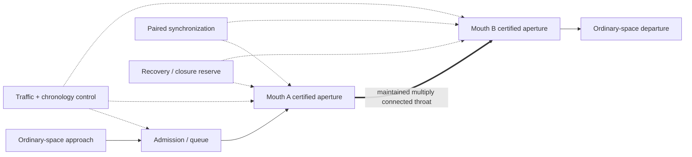
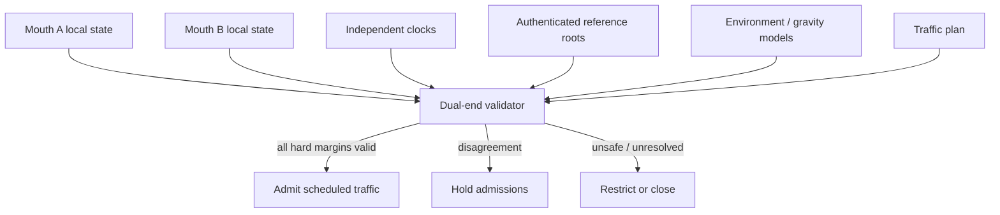
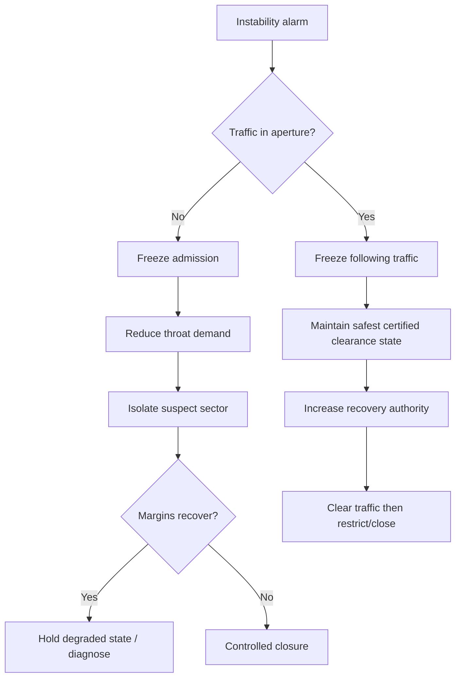

# Black Light Anchored Wormhole / Gate Transit Technical Volume

**Family:** `wormhole-gate` — Anchored Wormhole / Gate Transit  
**Status:** `MIXED` — recovered family identity, physical action and Path implementation names are authoritative within their scope; new mathematics, procedures, control models and basis-specific machinery are `DERIVED` unless independently sourced. Unsourced numeric constants remain `PROPOSED`.  
**Primary authority:** `docs/blacklight/BLACK_LIGHT_PROPULSION_TRANSIT_AUTHORITY.md`  
**Machine-readable companion:** `data/exo-vessel/ftl-wormhole-gate-technical-volume.json`  
**Schema:** `data/schemas/exo-vessel-ftl-wormhole-gate-technical-volume.schema.json`

## 1. Authority and origin

This volume deepens the existing Anchored Wormhole / Gate family without replacing its authority chain. The recovered family is a **maintained multiply connected spacetime topology between synchronized mouths**. It is therefore infrastructure transit, not a shipboard speed multiplier and not a Fold-Jump drive held open for convenience.

The legacy design document **The different lightspeed methods**, Google Drive ID `1e0Xp71EFubBZgXWjjvPxAqPoJIZNwqS6nu1-r7Kil7Y`, current reconciled revision `ANLCKQllC5h6dLaX5H1RpK8aUFVWsi-IV7gbMHUd0Qq7mIe5uGsLFi5_Hrsr8B6dl8t_ezB0fTSygxrnIBtifAHW79bgSbswp1zF3NaEil0`, requires transit-family-specific gravity response, efficiency loss, safety sensing, emergency de-transit/recovery, realistic mathematical underlays, vigorous documentation, educational courses, thesis work and incremental development records. Those requirements govern the extensions below.

The recovered development lineage is:

| Path | Recovered implementation | Principal transition |
|---|---|---|
| P0 | Microscopic Throat Foundry | transient microscopic throat |
| P1 | Cargo Aperture Gate | finite-radius throat with bounded mass flux |
| P2 | Orbital Paired Gate | synchronized separated mouths |
| P3 | Stellar Gate Complex | high-throughput strategic traffic |
| P4 | Corridor Gate Network | network flow and alternate routing |
| P5 | Strategic Deep Gate | extreme-baseline fixed links |
| P6 | Self-Stabilizing Gate Lattice | adaptive throat, traffic and recovery control |

No race, manufacturer, inventor, date, polity or historical owner is inferred from this progression.

---

## 2. What a gate actually does

A gate does not make the vessel locally faster. The vessel approaches an aperture, satisfies admission constraints, crosses a maintained throat and departs from the paired mouth.



A useful decomposition of end-to-end travel time is therefore

\[
T_{journey}=T_{approach}+T_{queue}+T_{sync}+T_{cross}+T_{departure}.
\]

For mature gates, `T_cross` can become a small part of the operational problem. Strategic mobility is instead dominated by where gates exist, whether they are healthy, queue capacity, mouth synchronization, routing policy and the ability to move vessels safely through a finite aperture.

This is why a civilization with excellent gates may possess extraordinary logistics without every vessel carrying extraordinary FTL machinery.

---

## 3. Throat geometry

### 3.1 Finite aperture

A traversable gate has a throat cross-section rather than a dimensionless portal. Let the induced metric on the throat section be \(h_{ab}\). A derived throat area is

\[
A_t=\int_{S_t}\sqrt{\det h_{ab}}\,d^2x.
\]

For operator displays, an equivalent circular radius may be reported as

\[
r_{eff}=\sqrt{\frac{A_t}{\pi}}.
\]

`r_eff` is an engineering convenience, not a claim that every gate is literally circular.

A vessel's admissible envelope must include hull, deployed appendages, tow loads, navigation covariance, control error and required wall clearance:

\[
\Omega_{admit}=\Omega_{hull}\oplus\Omega_{appendage}\oplus\Omega_{nav}\oplus\Omega_{clearance}.
\]

The generator must not compare aperture diameter only to a vessel's nominal beam and call the passage safe.

### 3.2 Stability margin

The gate's useful question is not simply whether a throat exists but whether enough control authority remains to keep it traversable under actual traffic and environment.

Define

\[
\mu_W = W_{available}-W_{required}(r_{eff},K,T,\dot m,\epsilon_{sync},E).
\]

Here \(K\) represents curvature burden, \(T\) tidal/environmental burden, \(\dot m\) traffic mass flux, \(\epsilon_{sync}\) mouth disagreement and \(E\) other local environmental terms.

A planned passage requires

\[
\mu_W>0
\]

with a separate certified reserve. Operating deliberately at \(\mu_W=0\) is not efficiency; it is elimination of recovery authority.

### 3.3 Gravity interaction

The legacy design source establishes that all advanced transit becomes harder in sufficiently distorted spacetime and that different families pay that burden differently. For a fixed gate, gravity appears chiefly as **throat-conditioning and mouth-state burden** rather than in-route steering.

A useful derived environmental cost is

\[
C_g = a_\Phi\frac{|\Phi|}{\Phi_*}
+a_1\frac{|\nabla\Phi|}{g_*}
+a_2\frac{\|H(\Phi)\|}{T_*}
+a_R\frac{\|R\|}{R_*}.
\]

The coefficients are `PROPOSED`. The engineering distinction is the important part: potential, gradient, tidal variation and curvature are not interchangeable.

A gate near a severe gravity volume may therefore need more field authority merely to preserve the same throat geometry. At some point no reasonable amount of added power restores an admissible solution because structural, chronology, thermal, synchronization or curvature margins fail first.

---

## 4. Mass flux and traffic

### 4.1 Aperture passage as flow

For density \(\rho\) and throat-normal velocity \(v_n\), instantaneous traffic mass flux may be represented as

\[
\dot m(t)=\int_{A_t}\rho(x,t)v_n(x,t)\,dA.
\]

Mass admitted through a scheduling window is then

\[
M_{window}=\int_{t_0}^{t_1}\dot m(t)\,dt.
\]

This matters because two ships of equal total mass need not impose equal gate burden. A long sparse vessel, compact dense vessel, articulated tow, bulk freighter, distributed formation or vessel crossing at a different throat-normal velocity creates a different time-dependent load.

### 4.2 Traffic envelope

A practical capacity model is therefore

\[
C_{gate}=f(A_t,\mu_W,\mu_\chi,\epsilon_{sync},P_{reserve},Q_{thermal},S_{traffic},H_{gate}),
\]

where \(\mu_\chi\) is chronology margin, \(S_{traffic}\) is required separation and \(H_{gate}\) is health state.

There is deliberately no universal `tons per second per meter` coefficient in canon. Such a number would need to be adopted separately by gate class or named technology.

### 4.3 Passage scheduling

A safe scheduler should consider at minimum:

- full vessel envelope;
- mass and mass distribution;
- current mouth geometry;
- projected throat loading through the whole crossing;
- preceding and following traffic separation;
- remote-mouth exclusion volume;
- throat and recovery reserve after passage;
- thermal duty cycle;
- chronology margin;
- maintenance restrictions;
- provenance and freshness of remote-mouth state.

A queue is therefore not necessarily first-in/first-out. A smaller vessel may be delayed because its required remote exclusion window conflicts with another passage, while a heavier vessel may be admitted first if it fits a stable reserved loading window.

---

## 5. Mouth synchronization

The two mouths are parts of one engineered transit system but can exist in radically different local environments. Their state must be compared continuously.

A derived synchronization error norm is

\[
\epsilon_{sync}=\sqrt{
 w_t\Delta t^2
+w_F\|\Delta F\|^2
+w_O\|\Delta\Omega\|^2
+w_R\|\Delta R\|^2
}.
\]

The terms represent clock disagreement, field-state disagreement, orientation disagreement and reference-state disagreement. The weights are `PROPOSED` and may be gate-class dependent.



A critical canon safeguard follows: **one mouth may not manufacture the other mouth's state by inference and then call the pair synchronized.** Predictions are useful, but a stale predicted remote state remains predicted.

---

## 6. Chronology constraint

The recovered gate lineage explicitly contains chronology constraints and a chronology-protection trip. The precise physical chronology functional is not currently recovered and remains `UNRESOLVED`.

This volume therefore models chronology only as an admissibility margin:

\[
\mu_\chi=\Chi_{limit}-\Chi_{route}(A,B,v_{rel},t_A,t_B,H).
\]

The exact form of \(\Chi\) is not claimed.

The hard rule is:

\[
\mu_\chi\le0 \Rightarrow \text{passage veto / gate protective state}.
\]

A throughput optimizer cannot trade chronology margin against profit, schedule pressure, military priority or a high overall safety score.

This is an important provenance boundary. The existence of chronology constraints is recovered. A detailed fictional chronology theory may later be added as `PROPOSED` or adopted canon, but this manual does not silently invent it.

---

## 7. Safety horizon

Gate safety is pre-admission heavy. A useful derived timing requirement is

\[
T_{guard}\ge
 t_{detect}
+t_{auth}
+t_{sync}
+t_{schedule}
+t_{field}
+t_{abort}
+t_{margin}.
\]

For traffic already crossing, the relevant clearance horizon is

\[
T_{clear}\ge t_{remaining\ crossing}+t_{geometry\ settle}+t_{closure\ preparation}.
\]

The general legacy rule remains: more advanced transit requires safety systems that can look and act sufficiently far ahead for the new performance envelope. A high-throughput P6 gate therefore needs more capable prediction, health monitoring, dual-end validation and fault isolation than a P1 cargo aperture.

There is no 100-percent-safe gate.

---

## 8. Eight-block machinery model

### 8.1 Energy conditioning

Gate power has at least three distinct duties: persistent hold, traffic-dependent transient work and protected recovery/closure reserve.

\[
P_{total}=P_{hold}+P_{shape}+P_{sync}+P_{control}+P_{thermal}+P_{recovery-charge}+P_{traffic}(t).
\]

`P_recovery-charge` is not a discretionary throughput pool.

### 8.2 Prime mover

The prime mover creates and sustains the multiply connected topology. Its exact exotic physical mechanism remains unresolved at the setting-wide level. A terrestrial implementation may contain enormous rings and field buses; another technology basis may use a completely different carrier while producing the same end effect.

### 8.3 Field formation

Field-formation machinery controls throat geometry, effective aperture radius, orientation and local boundary conditions. Mature systems should be sectional so a local actuator or field defect can be isolated without forcing immediate uncontrolled global collapse.

### 8.4 Transit control

The transit controller predicts how scheduled traffic changes throat loading and adjusts field sectors accordingly. It is not merely an autopilot for the vessel. Its controlled object is the gate itself.

### 8.5 Navigation and sensing

Gate navigation authenticates destination mouth identity, orientation, time/reference state, local environment and traffic exclusion. At network scale it also solves which sequence of gates is admissible.

### 8.6 Termination and recovery

A proper gate has machinery specifically intended to reject unsafe openings, reduce aperture authority, isolate sectors, absorb topology ringing and execute controlled closure.

Recovery must remain possible after the initiating fault. A design whose only closure controller, power bus or reference system is the same one whose failure destabilizes the gate does not possess independent recovery.

### 8.7 Whole-effect coverage

The aperture is a controlled traffic volume. Certification must cover the entire ship envelope through every phase of the crossing.

### 8.8 Control / thermal / abort backbone

This includes independent clocks, structural sensors, thermal rejection, gate-health interlocks, emergency communications and closure logic. Mature traffic software must not be authorized to bypass it simply to maintain schedule.

---

## 9. Physical layout

A mature fixed gate complex is more comparable to a port, power station, observatory and industrial plant combined than to a starship engine.

```text
                         DEEP-SPACE / REMOTE REFERENCES
                                     |
                        +------------+------------+
                        | Timing / authentication |
                        +------------+------------+
                                     |
        STRUCTURAL ANCHOR             |             STRUCTURAL ANCHOR
              \                       |                       /
               \       +=============+=============+        /
                +======|  APERTURE FIELD SECTORS   |=======+
                       |      TRAVERSABLE THROAT    |
                +======|  APERTURE FIELD SECTORS   |=======+
               /       +=============+=============+        \
              /                       |                       \
      POWER CONDITIONING      TRAFFIC / THROAT CONTROL      RECOVERY PLANT
              |                       |                       |
        ENERGY BUFFER          DUAL-END TELEMETRY       CLOSURE / SINKS
              \______________________|_______________________/
                                     |
                              THERMAL REJECTION
```

Nothing in this diagram fixes aesthetic design. The arrangement expresses required functions and load relationships.

---

## 10. Scaling laws

### 10.1 Aperture growth is not linear

Doubling a nominal diameter does not merely double gate cost. Larger throats increase controlled area, structural span, field nonuniformity, traffic-envelope variety, stored field energy, potential mouth asymmetry and heat-rejection burden.

A deliberately schematic derived scaling relation is

\[
B_{scale}\sim
c_A A_t+c_L L_s^\alpha+c_C N_{sector}+c_EE_{stored}+c_QQ_{thermal},
\]

with \(\alpha>1\) a `PROPOSED` structural-scaling exponent. The equation is intended to enforce nonlinearity, not establish setting-wide constants.

### 10.2 Throughput is multidimensional

Increasing aperture size can fail to improve useful throughput when synchronization, recovery plant, traffic separation or heat rejection becomes the bottleneck.

### 10.3 Parallel gates

Two apertures are not automatically twice the capacity. If they share a single power reserve, thermal sink, reference root, traffic controller or structural anchor, a common-mode failure can disable both.

### 10.4 Network scaling

At P4 and above, resilience may be gained more efficiently by alternate graph routes than by endlessly enlarging a single throat.

Let a network be

\[
G=(V,E),
\]

where each edge \(e\) has capacity, health, chronology, queue and provenance state. Strategic routing can be represented as

\[
F^*=\arg\max_F\sum_kU_k(F_k)
\]

subject to edge capacity and hard safety constraints.

This formalizes the recovered rule that **network topology, not ship speed, drives strategic mobility**.

---

## 11. Path development as engineering history

### P0 — Microscopic Throat Foundry

The civilization proves a transient throat can exist and be measured. Machinery is enormous, fixed and inefficient. Tests belong in remote chambers because the safest recovery method may still be simple loss of the experiment.

Educational focus: topology, instrumentation, vacuum isolation and destructive test reconstruction.

### P1 — Cargo Aperture Gate

The decisive breakthrough is finite radius and bounded mass flux. The machine must now protect an aperture rather than merely detect a topology event. Structural rings, recovery sinks, payload exclusion and geometry interlocks become core equipment.

Educational focus: aperture geometry, mass-flow limits and throat stabilization.

### P2 — Orbital Paired Gate

The decisive problem becomes remote correspondence. Two separated mouths must agree on identity, orientation, timing and safe geometry. Continuous synchronization becomes an infrastructure duty rather than an occasional calibration.

Educational focus: clocks, authenticated telemetry, dual-end fault logic and chronology constraints.

### P3 — Stellar Gate Complex

The throat is now treated as an industrial transport resource. Variable vessel mass, fleet spacing, thermal duty cycle and maintenance scheduling dominate practical performance.

Educational focus: traffic engineering, high-throughput control, sector isolation and industrial maintenance.

### P4 — Corridor Gate Network

Individual mouths become nodes in a strategic graph. Standards compatibility, route health, alternate routing, congestion and cascading failure are now first-class engineering problems.

Educational focus: network optimization, standards, distributed clocks and capacity markets/traffic priority where setting context supports them.

### P5 — Strategic Deep Gate

The civilization can maintain extremely long fixed links under poor baseline/reference conditions. The likely breakthroughs are better field materials, stronger anchors, deep redundancy, superior gravimetry/references and conservative chronology handling rather than a simple power multiplier.

Educational focus: extreme-baseline metrology, provenance, structural aging and long-horizon recovery.

### P6 — Self-Stabilizing Gate Lattice

Throat geometry, local health, traffic and recovery are co-solved continuously. Smart field sectors can isolate faults and predictive maintenance can replace much constant manual retuning.

The system is still not magical infrastructure. More automation increases the importance of reference integrity, failure containment and auditability because a bad model can execute the wrong solution rapidly and consistently.

---

## 12. Technology-basis embodiments

All embodiments in this section are `DERIVED`. Technology basis is **not evidence of race ownership**.

| Technology basis | Characteristic gate embodiment | Service language |
|---|---|---|
| `TERRESTRIAL_ELECTROMECHANICAL` | segmented aperture rings, buses, precision clocks, structural foundations, heat and recovery plant | alignment, insulation, strain, coolant, clock calibration |
| `AQUATIC_ELECTROCHEMICAL_HYDRAULIC` | wet pressure-supported sectors, ionic field banks, hydraulic throat-shaping surfaces | chemistry, fouling, membrane pressure, seals, cavitation |
| `CRYOGENIC_AMMONIA_HALOCARBON` | superconductive cold aperture lattices and cryogenic reference cavities | purity, quench margin, contraction, cryofluid state |
| `GAS_GIANT_FLUIDIC_ELECTROSTATIC` | charged tension membranes and pressure-stabilized aperture webs | tension, pressure balance, discharge damage, ionic contamination |
| `BIOLOGICAL_SYMBIOTIC` | cultivated aperture organs, mineralized support rings and distributed sensory ganglia | perfusion, tissue health, neural consensus, regeneration |
| `MINERAL_PIEZOELECTRIC_PHOTONIC` | prestressed crystalline aperture domains and photonic reference paths | cracks, preload, modal spectra, optical defects, annealing |
| `FIELD_MEDIATED_POSTMATERIAL` | distributed authenticated persistent field nodes defining mouth state | coherence, trust roots, state proofs, fallback matter |

A biological gate is therefore not a steel gate with fleshy textures. Its actuators, sensing, maintenance cycles, redundancy and failure vocabulary arise from cultivated living systems. A mineral gate can literally use crack propagation and preload drift as topology-control concerns. A postmaterial gate can be physically sparse yet extremely dependent on authenticated state and coherence.

---

## 13. Practical equipment manual

### WG-01 — Paired-Mouth Certification

**Purpose:** establish that both ends describe the same admissible transit system before traffic is accepted.

1. Authenticate Mouth A and Mouth B identity roots independently.
2. Compare clock state and drift estimates.
3. Compare mouth orientation and throat field state.
4. Validate local gravitational/environmental models at both ends.
5. Verify chronology margin remains positive.
6. Certify effective aperture geometry and exclusion volume.
7. Prove protected closure/recovery reserve.
8. Only then transition from `HOLD` to `TRAFFIC ENABLED`.

**Reject certification if:** remote state is stale beyond policy, reference roots disagree, chronology is unresolved, recovery reserve is unavailable, or one mouth merely predicts the other mouth's state without authenticated observation.

### WG-02 — Vessel Admission

1. Acquire full vessel mass and geometry manifest.
2. Reconcile observed silhouette/mass with declared manifest.
3. Include deployed appendages, cargo booms, tethers and towed bodies.
4. Expand geometry by navigation and control covariance.
5. Reserve a complete aperture occupancy window.
6. Project throat load across the crossing, not only at entry.
7. Recalculate post-passage thermal and recovery reserve.
8. Issue an admission token tied to that exact vessel state and slot.

A vessel changing geometry after certification invalidates the token unless the gate class explicitly supports live re-certification.

### WG-03 — Mouth Desynchronization

**Symptoms:** clock residual growth, orientation disagreement, remote field telemetry mismatch or conflicting authenticated reference state.

1. Freeze new admissions.
2. Determine whether any traffic is already inside the certified crossing envelope.
3. Preserve the safest completed direction for in-aperture traffic; do not reverse traffic merely because the alarm occurred.
4. Compare independent timing/reference channels.
5. Separate local instrument drift from genuine pair disagreement.
6. Reduce throat demand if doing so preserves positive stability margin.
7. Close only under the certified recovery sequence once the aperture is clear or emergency procedure commands otherwise.

### WG-04 — Throat Instability

**Symptoms:** rising field correction energy, aperture ellipticity, curvature residual, sector disagreement, unexpected passage loading.



### WG-05 — Controlled Closure

1. Confirm no uncertified traffic remains in the aperture envelope.
2. Reserve the closure sink and recovery bus.
3. Reduce throat radius according to certified sector sequence.
4. Maintain paired timing and orientation through closure.
5. Absorb topology ringing rather than dumping it into the structural anchor if the design provides a sink.
6. Verify ordinary-space boundary conditions at both mouths.
7. Enter post-closure inspection state.

### WG-06 — Return to Service

A gate returns to service only after the cause of the protective state is identified or positively bounded, failed hardware/reference state is repaired, recovery plant is restored, both mouths recertify and a low-demand proof cycle completes successfully.

Resetting the alarm is not a repair.

---

## 14. Maintenance doctrine

### 14.1 Aperture geometry survey

Survey physical/field sector position, stiffness and actuator authority. Trend change over time; absolute pass/fail alone is insufficient because progressive drift can reveal an approaching structural problem.

### 14.2 Reference and clock audit

Audit independent timing references, trust roots, remote state freshness and disagreement history. A highly precise clock that is precisely wrong is not a safe reference.

### 14.3 Anchor inspection

Persistent topology can impose repeated or continuous loads on the gate structure. Inspect foundations, tension members, field anchors and interfaces for fatigue, creep, crack growth, differential movement or basis-specific equivalents.

### 14.4 Recovery proof test

Periodically demonstrate that closure/recovery can operate without the nominal traffic controller and without consuming the normal traffic power path.

### 14.5 Thermal capacity test

Verify sustained hold power plus projected traffic peaks can be rejected while keeping safety systems inside their qualified temperature envelope.

### 14.6 Condition-based maintenance

A mature gate should track leading indicators such as

\[
\frac{dP_{correct}}{dt},\quad
\frac{d\epsilon_{sync}}{dt},\quad
\frac{d\mu_W}{dt},\quad
\frac{dQ_{thermal}}{dt}.
\]

A slow coherent rise across many sectors implicates environment, references or common plant before isolated local hardware. A single-sector residual points more strongly toward a local actuator, structure, sensor or carrier path.

---

## 15. Signature model

Gate signatures are difficult to hide because the family is persistent infrastructure.

A useful decomposition is

\[
S_{gate}=S_{topology}+S_{gravity}+S_{power}+S_{thermal}+S_{sync}+S_{traffic}.
\]

`S_topology` and the maintained-mouth state are intrinsic family clues. `S_power` and `S_thermal` vary strongly with technology basis. `S_sync` may be radio, optical, Q-linked, biological, photonic or another implementation-specific exchange depending on confirmed machinery.

A low-power mature gate is not necessarily stealthy if the maintained topology itself remains detectable.

---

## 16. Failure taxonomy

### Throat instability

The gate lacks enough remaining control authority for demanded geometry and traffic. Root cause can be environment, power, field hardware, structure, bad traffic prediction or several interacting causes.

### Mouth desynchronization

The two ends no longer agree within admissible timing/orientation/field/reference bounds.

### Asymmetric mass flux

Traffic loads the throat differently from the scheduled model, producing local curvature and stabilization burden.

### Chronology-protection trip

A recovered hard constraint is approached or crossed. The exact physics remains unresolved; the protective behavior is retained without fictionalizing the missing function.

### Reference poisoning

A stale or compromised state can be more dangerous than obvious sensor failure because the controller may execute a mathematically coherent solution for the wrong mouth state.

### Thermal saturation

Heat rejection, not raw generation capacity, becomes the limiting term. Control authority then derates and throughput must fall.

### Network cascade

Closing one gate pushes traffic toward alternatives. If routing ignores reserve margin, those gates can be driven toward their own limits.

### Anchor drift

A persistent mouth's structural or field reference migrates away from certified geometry.

---

## 17. Failure propagation example — training case

**Status: `PROPOSED` training scenario; not a historical event.**

A P4 Corridor Gate Network loses one high-capacity edge to scheduled structural maintenance. Routing software transfers traffic to two neighboring gates. One has adequate aperture diameter but has accumulated heat-sink fouling; the other is healthy but its remote timing reference is operating on a degraded redundant channel.

The naive network optimizer sees sufficient nominal aggregate capacity.

The correct optimizer notices that:

\[
C_{usable}<C_{nominal}
\]

because one gate's thermal margin and the other's synchronization margin have fallen. It sheds low-priority traffic before either gate trips.

The teaching point is that **network redundancy is not the number of remaining links**. It is the sum of their currently admissible capacity after independent safety reserves.

---

## 18. Educational text

### 18.1 Undergraduate principle: a gate is a port, not an engine

Students commonly ask, “How fast is the gate?” The better question is, “What traffic can this maintained topology move, under what geometry and safety conditions, and how often?”

The gate's principal performance measures are therefore aperture class, admissible mass/geometry envelope, duty cycle, pair synchronization quality, recovery capacity, queue throughput and network position.

### 18.2 Engineering principle: hard margins do not average

Suppose a control dashboard reports:

| Variable | Normalized margin |
|---|---:|
| stability | +0.41 |
| thermal | +0.36 |
| synchronization | +0.22 |
| chronology | -0.03 |

The arithmetic average is positive. The gate is still **not admissible**. Chronology is a hard veto in the recovered family.

This is a general Black Light engineering rule: an invalid hard constraint cannot be hidden inside a weighted health score.

### 18.3 Advanced principle: optimize the network, not the spectacular machine

A civilization can improve strategic mobility through several routes:

\[
\Delta M_{strategic}
=
\Delta C_{mouth}
+\Delta U_{uptime}
+\Delta R_{routing}
+\Delta S_{standards}
+\Delta Q_{queue}
+\Delta P_{recovery}.
\]

The equation is schematic, but the lesson is concrete. Better standards, uptime, routing and recovery can matter as much as a larger throat.

---

## 19. Research and thesis tracks

The following are `DERIVED` research directions unless separately adopted:

**Throat stability under transient asymmetric loading.** Determine whether distributed sectional control can maintain positive margin during heterogeneous fleet passages without excessive stored recovery energy.

**Chronology-safe network routing.** Develop routing algorithms that preserve hard pair and network chronology constraints without collapsing usable capacity under conservative uncertainty.

**Remote-mouth state provenance.** Quantify how stale-but-authenticated data should affect admission and synchronization confidence.

**Aperture geometry versus structural scaling.** Determine which non-circular throat sections minimize structure and field burden for different vessel populations.

**Traffic-induced topology ringing.** Separate harmless post-passage residuals from signatures of cumulative throat damage.

**Self-stabilizing lattice fault containment.** Prove that a P6 local controller cannot produce a network-level unsafe state while repairing a local mouth disturbance.

---

## 20. Patent-style incremental inventions

These are invention **classes**, not historical attributions.

### Finite-Radius Throat Stabilizer

Problem: microscopic throat solutions collapse under finite protected volume.  
Advance: sectional stabilization around a bounded aperture.  
Changed limit: usable radius and bounded mass flux.  
Attribution: `UNRESOLVED`.

### Dual-Mouth Chronology Interlock

Problem: paired mouths can each appear locally healthy while their joint state is inadmissible.  
Advance: independently authenticated dual-end hard-veto logic.  
Changed limit: remote-pair safety.  
Attribution: `UNRESOLVED`.

### Variable-Mass Aperture Governor

Problem: fixed field settings perform poorly across heterogeneous traffic.  
Advance: predictively reshape stabilization authority using declared and observed crossing mass distribution.  
Changed limit: throughput and recovery reserve.  
Attribution: `UNRESOLVED`.

### Self-Stabilizing Gate Lattice Controller

Problem: local defects can propagate through monolithic mouth control.  
Advance: distributed health-aware aperture sectors jointly optimize throat shape, traffic and recovery.  
Changed limit: uptime and fault containment.  
Attribution: `UNRESOLVED`.

---

## 21. Generator and API contract

A resolved gate record should accept at minimum:

```json
{
  "family": "wormhole-gate",
  "transitPath": "P4",
  "sharedTier": "T4",
  "technologyBasis": "TERRESTRIAL_ELECTROMECHANICAL",
  "mouthPairId": "UNRESOLVED_OR_INSTANCE_ID",
  "apertureClass": "instance-defined",
  "trafficProfile": "mixed",
  "environmentState": {},
  "networkState": {},
  "condition": {},
  "provenanceMode": "LABELED_DERIVATION"
}
```

The output should expose throat state, stability margin, synchronization state, chronology state, usable capacity envelope, queue policy, power/recovery state, maintenance state, signatures, risks and field-level provenance.

### Mandatory hard guards

- Never resolve `wormhole-gate` as a ship speed multiplier.
- Never infer owner/race/manufacturer from technology basis.
- Never admit traffic when either mouth lacks independently authenticated state.
- Never average a failed hard constraint into a positive overall score.
- Never spend protected closure reserve to maintain normal throughput.
- Never invent the missing chronology mechanism and label it confirmed.
- Never promote repeated generated derivation into setting-wide canon.
- Never discard stale-reference provenance when displaying a currently usable estimate.

---

## 22. Provenance display

A useful human-facing record should make provenance visible beside the claim:

| Claim | Status | Origin |
|---|---|---|
| family is maintained paired-mouth topology | `CONFIRMED` | propulsion/transit authority / recovered archive |
| P3 is Stellar Gate Complex | `CONFIRMED` | recovered development lineage |
| finite mass flux matters at P1+ | `CONFIRMED` broad fact | recovered lineage |
| specific flux integral used by this manual | `DERIVED` | engineering formalization |
| exact maximum tons/second | `UNRESOLVED` unless named source exists | not invented |
| chronology constraint exists | `CONFIRMED` | recovered lineage |
| exact chronology functional | `UNRESOLVED` | intentionally not filled |
| terrestrial segmented ring embodiment | `DERIVED` | family-basis embodiment layer |
| a named race invented it | `UNRESOLVED` absent specific source | canon guard |

This distinction must survive API serialization, UI rendering, generated equipment manuals and educational text.

---

## 23. Engineering comparison chart

| Dimension | Gate emphasis |
|---|---|
| range | fixed paired infrastructure baseline rather than shipboard leg range |
| speed | traversal plus queue/synchronization; not a ship multiplier |
| gravity sensitivity | mouth/throat conditioning and local environment |
| navigation | mouth identity, orientation, pair state and network routing |
| principal scaling | aperture, duty cycle, parallel links and graph resilience |
| power | persistent hold + passage transients + protected recovery |
| key maintenance | sectors, anchors, clocks, thermal plant, recovery plant |
| intrinsic signature | persistent topology and industrial infrastructure |
| characteristic catastrophic error | unstable or desynchronized throat during admitted traffic |
| mature strategic advantage | predictable high-volume logistics and network mobility |

---

## 24. Canon safeguard summary

The Anchored Wormhole / Gate family should feel old, industrial and deeply engineered when its civilization has had generations to refine it. That depth comes from control theory, materials, metrology, maintenance, traffic engineering, structural design, safety doctrine, network standards, education and incremental research—not from quietly inventing a universal aperture size or assigning the technology to whichever race happens to be generated next.

When evidence ends, the document must say where evidence ends.

When a derived model is useful, it should expose its parents and remain derived.

When a number is merely convenient for play, it should remain proposed until deliberately adopted.

That is how the gate corpus can become richer without allowing its own accumulated documentation to manufacture canon by repetition.
