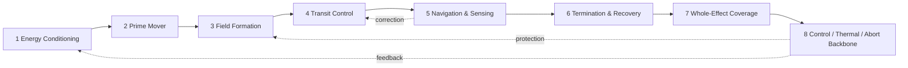
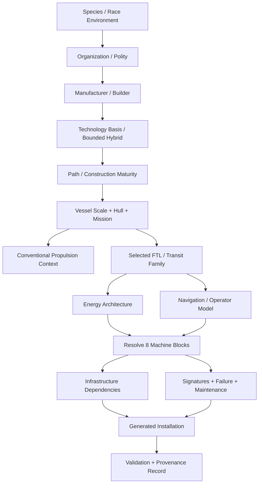

# Black Light Propulsion & Transit Authority

**Status:** authoritative integration reference for Black Light propulsion, FTL/transit engineering, generator semantics, and EXO vessel handoff.  
**Authority scope:** this document consolidates surviving repository authority; it does not retroactively invent missing race-specific canon.  
**Revision basis:** recovered FTL archive + current EXO technology-basis registry.  
**Canon labels:** `CONFIRMED` = directly recovered from repository authority; `DERIVED` = engineering consequence constrained by confirmed canon; `PROPOSED` = useful extension not yet independently established as canon; `UNRESOLVED` = source or claim cannot currently be recovered.

---

## 1. Purpose

Black Light separates **how a vessel moves in ordinary spacetime** from **how it achieves nonlocal or effectively superluminal transit**. Conventional and relativistic propulsion remain within the EXO vessel propulsion engineering domain. FTL/transit is an adjacent capability domain with its own physical action, machinery, infrastructure, navigation, operating hazards, maintenance requirements, and provenance.

FTL is therefore **not P7**. The recovered P0–P6 FTL construction sequence is a maturity/construction axis within the archived FTL system and must not be confused with an unrelated propulsion tier or with the current EXO technology-basis vocabulary.

The governing generator rule is:

> **Comparable end effects do not imply comparable machines.** A species' environment, organization, manufacturer, maturity, vessel scale, mission, and selected transit mechanism resolve the actual installation.

A biological drive is not a terrestrial drive with organic nouns substituted for mechanical ones. A mineral drive is not a metal drive with crystals glued to the console. The physical carrier, manufacturing logic, service method, failure vocabulary, sensory architecture, and spatial arrangement must all emerge from the technology basis.

---

## 2. Authority order and provenance

When two records disagree, resolve them in this order:

1. **Specific surviving race/species, organization, manufacturer, and named-technology source material.**
2. **This Propulsion & Transit Authority** for domain boundaries, shared vocabulary, generation order, provenance, and integration rules.
3. **Recovered FTL archive definitions** represented by `FTL_ENGINEERING_CATALOG_WORKING.md` for named transit families, Path progression, scale, infrastructure, energy, and construction doctrine.
4. **Current EXO registries**, especially `data/exo-vessel/technology-basis-registry.json` and `data/exo-vessel/engineering-registry.json`, for operative engineering language and vessel subsystem integration.
5. **`FTL_TECHNOLOGY_BASIS_INTEGRATION_WORKING.md`** as a derived physical-implementation adapter.
6. **Mathematical/physics analogies** as validation and explanatory tools only.
7. **Model inference** only when explicitly labeled `DERIVED` or `PROPOSED`.

A generated vessel instance becomes authoritative for that generated vessel only after its input authority, resolver choices, and generator version have been recorded. Generated output never silently rewrites setting-wide canon.

### 2.1 Source index

- `docs/blacklight/BLACK_LIGHT_PROPULSION_TRANSIT_AUTHORITY.md` — this consolidated authority entrypoint.
- `docs/blacklight/FTL_ENGINEERING_CATALOG_WORKING.md` — recovered FTL archive and supporting physics appendix.
- `docs/blacklight/FTL_TECHNOLOGY_BASIS_INTEGRATION_WORKING.md` — technology-basis embodiment work.
- `data/exo-vessel/technology-basis-registry.json` — current seven operative technology families and routing principles.
- `data/exo-vessel/engineering-registry.json` — current EXO engineering implementation registry, including conventional/relativistic propulsion context.
- `data/schemas/exo-vessel-technology-basis.schema.json` — machine-readable technology-basis validation.

### 2.2 Repaired authority gap

`FTL_TECHNOLOGY_BASIS_INTEGRATION_WORKING.md` historically cites `docs/blacklight/EXO_OPERATIVE_TECHNOLOGY_BASIS.md`. That path is not present on the currently inspected `main` authority tree and must therefore be treated as `UNRESOLVED`, not as a live higher authority. The surviving machine-readable authority for the seven operative technology families is `data/exo-vessel/technology-basis-registry.json`. This document supersedes the missing path **as the integration entrypoint**, while preserving the possibility that older source history may later recover additional material.

No content attributed solely to the missing document may be treated as confirmed unless it also survives elsewhere.

---

## 3. Confirmed transit families

The recovered FTL archive establishes the following named families.

| Archive key | Confirmed family | Physical action | Principal operational character |
|---|---|---|---|
| `metric-envelope` | Metric Compression Envelope | 4D local metric deformation | protected local volume; contracted/expanded external geometry |
| `gravitic-plane` | Gravitational-Plane Skimmer | 4D geodesic-plane transit with gradient correction | rides favorable gravitational/equipotential geometry |
| `slipstream-shear` | Hyperspatial Slipstream Shear | Q-space boundary-layer coupling | rides a metastable shear adjacent to normal spacetime |
| `q-lattice` | Q-Lattice Phase Translation | indexed Q-state translation | address/epoch-sensitive discrete translation |
| `n-manifold` | N-Dimensional Manifold Drive | higher-dimensional geodesic projected to 3+1D | shortened route through valid embedding/return map |
| `fold-jump` | Discrete Fold-Jump Drive | temporary topological adjacency | origin/destination volumes made adjacent; little post-commit correction |
| `wormhole-gate` | Anchored Wormhole / Gate Transit | maintained multiply connected topology | infrastructure-heavy aperture network |
| `phase-displacement` | Quantum Phase Displacement | macroscopic nonlocal state displacement | compatible-state transfer with continuity/identity burdens |
| `inertial-torch` | Relativistic Inertial Torch | ordinary continuous causal travel | precursor/comparison baseline; **not true FTL** |

These names and mechanisms outrank generic descriptive buckets such as “warp,” “jump,” “subspace,” or “gate” when generating Black Light equipment.

---

## 4. Universal machine-chain model

Every confirmed FTL family resolves through eight end-effect blocks. Their functions are stable; their physical embodiment is not.



The blocks mean:

| Block | Required end effect | Examples of questions the generator must answer |
|---|---|---|
| Energy conditioning | make usable drive-state energy available | source, buffer, pulse/continuous delivery, isolation, reserve |
| Prime mover | create the initiating exotic/field/topological condition | what actually changes the physical state? |
| Field formation | shape the transit effect around payload/route | ring, dermis, lattice, membrane, distributed field, aperture |
| Transit control | modulate and hold the effect | rate, vector, adhesion, embedding, address, throat geometry |
| Navigation & sensing | solve route/reference/condition | clocks, gravimetry, Q-weather, beacons, topology, biological senses |
| Termination & recovery | return to safe ordinary state | collapse, reinsertion, momentum matching, quench, ringing disposal |
| Whole-effect coverage | ensure the complete payload is inside valid effect | hull envelope, chamber boundary, skin, aperture, translated volume |
| Backbone | keep all blocks synchronized and survivable | control, thermal, abort, diagnostics, isolation, emergency reserves |

A generator that produces a drive name without resolving all eight blocks has produced a label, not an engineering installation.

---

## 5. Current operative technology bases — CONFIRMED

The current EXO technology-basis registry establishes seven environment-rooted machinery languages:

1. `TERRESTRIAL_ELECTROMECHANICAL`
2. `AQUATIC_ELECTROCHEMICAL_HYDRAULIC`
3. `CRYOGENIC_AMMONIA_HALOCARBON`
4. `GAS_GIANT_FLUIDIC_ELECTROSTATIC`
5. `BIOLOGICAL_SYMBIOTIC`
6. `MINERAL_PIEZOELECTRIC_PHOTONIC`
7. `FIELD_MEDIATED_POSTMATERIAL`

The registry additionally fixes invariant route semantics — structural, power, cooling, data, atmosphere, access — and declares that species environment supplies the primary technological pressure while organization, manufacturer focus, and Path level may create bounded hybrids.

### 5.1 Machine-language crosswalk — DERIVED from confirmed bases

| Basis | Energy / power carrier | Control language | Typical physical structure | Maintenance language |
|---|---|---|---|---|
| Terrestrial electromechanical | electrical, thermal, stored-field, chemical/nuclear plant interfaces | electronic/optical computation, actuators | pressure vessels, coils, buses, frames, cryostats | inspection, replacement, calibration, insulation, coolant service |
| Aquatic electrochemical-hydraulic | ionic gradients, electrochemistry, pressure stores, wet superconductive elements | hydraulic/pressure logic + optical/electrochemical control | immersed manifolds, pressure cells, wet field surfaces | chemistry, fouling, cavitation, seals, dissolved gas, corrosion |
| Cryogenic ammonia-halocarbon | cryogenic superconductive networks, phase-change stores | photonic timing, cold electronics, cryofluid actuation | vacuum jackets, contraction frames, cold loops | contamination control, contraction alignment, seals, fluid purity |
| Gas-giant fluidic-electrostatic | pressure gradients, charge separation, electrostatic/ionic flow | fluidic/acoustic/electrostatic logic | membranes, tension webs, charged skins, buoyancy cells | pressure integrity, membrane repair, charge control, resonance tuning |
| Biological symbiotic | metabolic/electrochemical organs, mineral inclusions, symbionts | neural, hormonal, distributed biological sensing | organs, vascular loops, field-bearing tissues, grown inclusions | feeding, surgery, grafting, microbiome/electrolyte control, regeneration |
| Mineral piezoelectric-photonic | strain, polarization, thermal gradients, photonic/phononic transfer | stress, light, resonance, lattice state | crystal bodies, resonant domains, optical defect channels | flaw mapping, annealing, re-growth, preload and axis restoration |
| Field-mediated postmaterial | controlled persistent field state with material reserves | state-authenticated distributed control | field nodes, programmable surfaces, adaptive anchor matter | coherence/reference restoration, state validation, safe fallback reconstruction |

---

## 6. Generator resolution order

The installation resolver must not begin with a component list. It begins with authority.



Conceptually:

`installation = resolve(species, organization, manufacturer, technologyBasis, maturity, vesselScale, hullState, mission, transitFamily, energyArchitecture, infrastructure)`

The resolver should be deterministic when supplied with an explicit seed and authority snapshot, while still permitting bounded procedural variation.

### 6.1 Canon-safe generation precedence

A generated value is selected in this order:

`explicit named canon > race/species constraint > organization constraint > manufacturer doctrine > technology basis > Path/maturity > vessel/mission constraint > family default > labeled derived engineering > labeled proposal`

A lower layer may specialize a higher layer but cannot contradict it without an explicit compatibility or exception record.

---

## 7. Vessel scale and embodiment

The recovered FTL archive uses approximate scale bands from uncrewed probes through gatework/megastructures. Scale changes what the installation must physically become.

| Scale | Approximate recovered mass band | Dominant FTL engineering pressure |
|---|---:|---|
| Uncrewed probe | 1–40 t | minimum viable field coverage; no crew servicing; thermal reserve |
| Fighter / strike craft | 18–180 t | extreme miniaturization; limited redundancy; violent duty cycle |
| Shuttle / courier | 120–2,200 t | compact autonomous navigation; rapid turnaround |
| Corvette | 1,800–18,000 t | distributed redundancy begins; hull-flex compensation |
| Frigate / merchant | 15,000–180,000 t | endurance, cargo-state variation, serviceability |
| Cruiser | 160,000–1,800,000 t | multiple field sectors; battle damage; large internal mass changes |
| Capital / carrier | 1.5–24 million t | coherent effect around enormous dynamic mass; networked emitters |
| Gatework / megastructure | 24 million–24 billion t | stationary geometry, throughput, stellar-scale infrastructure, route politics |

**Derived scaling rule:** ship size modifies **embodiment**, not technological identity. A larger biological installation grows more/distributed tissue and support circulation; a mineral installation requires greater resonant volume, segmented crystal domains, or hierarchical lattice control; terrestrial installations distribute rings/nodes and service trunks; postmaterial installations expand authenticated field volume and reserve/fallback capacity.

A useful non-canon design estimator is:

`B_effect = k_family * M^alpha * V_effect^beta * C_geometry * C_environment * C_damage`

where `B_effect` is engineering burden rather than literal energy, `M` is translated mass, `V_effect` is protected volume, and correction coefficients capture geometry, local environment, and degraded hull state. The exponents are **not canonical constants** and must be calibrated per recovered family if quantitative tables are later adopted.

---

## 8. Energy architecture

Recovered supporting energy plants include fusion pulse banks, antimatter-catalyzed field plants, contained micro-singularity accumulators, metastable vacuum-polarization cells, Q-state condensate reservoirs, and direct stellar power/mass taps for fixed gateworks.

Power plant and FTL mechanism are independent generator dimensions. The same transit family can therefore have different valid energy embodiments at different maturity levels or cultures, subject to the family’s archive constraints.

The generator must resolve at least:

`source -> conditioning -> storage/buffer -> pulse or continuous delivery -> drive block -> recovery/dump -> emergency isolation`

A drive that has an energy source but no delivery, isolation, dump, or recovery path is mechanically incomplete.

---

## 9. Navigation, operators, and reference authority

Navigation is mechanism-specific. A coordinate is not enough.

### Metric Compression Envelope
Requires external-field knowledge, route hazard prediction, envelope geometry, internal horizon avoidance, and safe emergence conditions.

### Gravitational-Plane Skimmer
Requires barycentric mass models, gradient maps, certified ephemerides, and continuous detection of ridges/plane departure.

### Hyperspatial Slipstream Shear
Requires Q-weather, boundary shear, adhesion state, phase velocity, and normal-space correspondence.

### Q-Lattice Phase Translation
Requires destination Q-address, phase epoch, protected route/address records, and anti-aliasing validation.

### N-Dimensional Manifold Drive
Requires topology sensing, selected dimensional axes, embedding integrity, higher-dimensional geodesic solution, and valid return projection.

### Fold-Jump
Requires origin and destination empty-volume certification, precision gravimetry/ranging, authenticated destination reference, and pre-commit solution confidence.

### Wormhole / Gate
Requires mouth identity, synchronization, aperture/throughput state, gate scheduling, mass-flow limits, and chronology-safe operating state.

### Quantum Phase Displacement
Requires compatible state target, occupation exclusion, reference authenticity, continuity bookkeeping, and biological/software mutability handling.

Operator models may be bridge-directed, specialist-navigator, distributed AI, bonded organism, collective biological sensing, resonant crystalline controller/caste, gate traffic control, or postmaterial authenticated state-control. The generator must preserve source-specific operator practice when one exists.

---

## 10. Signatures and observability

Every generated installation must expose signatures over four operational phases:

1. **pre-entry/spool**;
2. **transit/active state**;
3. **emergence/termination**;
4. **aftermath/recovery**.

Each phase may emit or perturb:

`electromagnetic | thermal | optical | gravitational | neutrino | Q/exotic | acoustic/structural | chemical | biological`

Signatures are not flavor-only. They support detection, intelligence, tactical warning, maintenance, forensic reconstruction, and worldbuilding.

### Signature record

```json
{
  "phase": "pre-entry",
  "channel": "gravitational",
  "strengthClass": "contextual",
  "geometry": "annular/distributed/localized",
  "duration": "generator-resolved",
  "detectability": "sensor-and-range-dependent",
  "persistence": "none|transient|residual",
  "source": "CONFIRMED|DERIVED|PROPOSED"
}
```

Biological systems should produce biological/chemical/thermal consequences where appropriate; mineral systems should expose resonant, phononic, polarization, fracture, and optical consequences; field-mediated systems should emphasize state/coherence/reference artifacts rather than being magically signatureless.

---

## 11. Failure model

Failures derive from the mechanism **and** the technology basis.

The common hazard equation is descriptive rather than canonically numerical:

`risk = f(mechanismState, technologyHealth, environment, navigationConfidence, energyMargin, coverageIntegrity, recoveryMargin)`

### Mechanism failures

- Metric envelope: closure asymmetry, horizon formation, bow-radiation handling failure, ringing, field collapse.
- Gravitational-plane: plane loss, ridge encounter, ephemeris error, gradient overload, emergence-vector error.
- Slipstream: adhesion loss, Q-weather upset, shear excursion, phase-velocity mismatch, wake shock.
- Q-lattice: address alias, epoch mismatch, corrupted reference, partial-state/coverage error, quarantine-triggering residual.
- N-manifold: embedding loss, axis-order error, topology trap, invalid return map, projection distortion.
- Fold-jump: occupied destination, aperture asymmetry, bad adjacency solution, recoil/metric ringing, abort-after-commit impossibility.
- Wormhole/gate: throat instability, asymmetric mass-flow excursion, mouth desynchronization, aperture shear, chronology protection trip.
- Phase displacement: occupied target state, reference spoof, residual/duplicate-state anomaly, conservation mismatch, continuity certification failure.

### Basis failures

- Terrestrial: breaker/isolation faults, conductor quench, cryostat/coolant failure, alignment, sensor/control fault.
- Aquatic: cavitation, contamination, osmotic/chemical drift, valve/manifold failure, galvanic attack, dissolved gas excursion.
- Cryogenic: warm contamination, contraction misalignment, superconductive transition, seal failure, phase-change buffer exhaustion.
- Gas-giant: membrane rupture, pressure imbalance, electrostatic discharge, tension-web instability, acoustic timing corruption.
- Biological: rejection, necrosis, infection, electrolyte/hormone drift, neural desynchronization, scar/tumor interference, exhausted regeneration.
- Mineral: crack growth, domain inversion, preload loss, modal detuning, optical defect contamination, lattice annealing failure.
- Field-mediated: coherence collapse, reference loss, authorization corruption, state drift, hostile state injection, reserve depletion, fallback reconstruction failure.

The failure generator combines these layers rather than drawing from one universal “drive malfunction” table.

---

## 12. Maintenance and lifecycle

Every drive instance requires a maintenance record with:

- inspection interval and event-triggered checks;
- calibration references;
- consumables/working media;
- life-limited components or tissues;
- acceptable degradation envelope;
- field/route recertification triggers;
- post-transit inspection requirements;
- emergency isolation method;
- depot/manufacturer-only operations;
- environmental servicing requirements;
- evidence/signatures of latent failure.

**Derived lifecycle principle:** advanced technology may reduce manual component replacement without eliminating maintenance. Maintenance changes form. A self-healing biological or postmaterial system still requires nutrition/reserve, reference integrity, validation, pathology or state-drift management, and known-safe recovery states.

---

## 13. Practical equipment manual framework

This section defines the **minimum practical manual** a generated FTL installation should be able to emit. Procedures below are `DERIVED` templates unless a specific race/manufacturer source supplies authoritative procedure.

### 13.1 Operator quick-reference sequence

**A. Cold / dormant inspection**

Verify hull/effect coverage state, isolation boundaries, energy reserve, thermal/working-medium state, navigation references, destination/route authority, control synchronization, recovery capacity, and abort chain. Any unresolved coverage or reference fault blocks commitment.

**B. Conditioning**

Bring the installation into its basis-specific operating state: energize and cool terrestrial field hardware; equalize chemistry and pressure for aquatic systems; reach contraction geometry for cryogenic plants; tension/inflate charged gas-giant surfaces; synchronize metabolism and field tissue for biological systems; establish preload/resonance for mineral systems; authenticate and stabilize persistent state for postmaterial systems.

**C. Calibration**

Measure the actual vessel, not the design drawing. Reconcile mass distribution, protected volume, hull deformation, cargo movement, active appendages, local curvature/topology/Q conditions, clocks/references, and destination state. Record covariance/uncertainty.

**D. Spool**

Charge the prime mover while the coverage system establishes a complete valid boundary. Navigation and transit control continuously compare predicted and observed state. Abort remains available only within the family-specific pre-commit envelope.

**E. Commit / entry**

Require independent agreement between navigation solution, drive-state health, effect coverage, recovery reserve, and route/destination exclusion checks. The exact number and form of human/alien approvals is organization/manufacturer doctrine, not universal canon.

**F. Active transit**

Monitor family-specific control quantities rather than generic “FTL speed.” Examples include envelope symmetry, skim-plane error, shear adhesion, Q-address integrity, embedding/return-map condition, gate throat state, or displacement continuity state.

**G. Termination**

Recover normal vessel state while managing momentum, field energy, recoil, stored radiation, ringing, phase mismatch, topology, or residual state according to family.

**H. Post-transit**

Quarantine any residual anomaly, compare expected versus measured emergence state, inspect basis-specific damage, preserve immutable event logs, and recertify references before another transit.

### 13.2 Abort doctrine

The generator must explicitly mark:

`SAFE_ABORT -> DEGRADED_ABORT -> COMMIT_BOUNDARY -> NO_ABORT -> RECOVERY_ONLY`

A fold jump and a continuous metric envelope must not be given identical abort semantics. “Emergency stop” is not an acceptable generic answer.

### 13.3 Maintenance manual examples by basis

**Biological-symbiotic — DERIVED:** establish metabolic baseline; assay electrolytes/hormones/symbiont activity; image field-bearing tissue; map scar/necrotic regions; test sensory-phase organs; verify vascular cooling; induce low-power coherence; permit regeneration; quarantine anomalous tissue before full spool.

**Mineral piezoelectric-photonic — DERIVED:** map cracks and inclusions; compare crystallographic axes to certified reference; measure preload; clean/revalidate optical defect channels; perform low-amplitude modal sweep; anneal permitted defects; re-grow service faces; repeat resonance map before high-energy operation.

**Aquatic electrochemical-hydraulic — DERIVED:** sample working-fluid chemistry; check dissolved gases; inspect wet-mate seals and pressure cells; flush contamination; characterize cavitation margin; test isolation valves; verify ionic reference gradients; pressure-cycle field surfaces before drive certification.

**Field-mediated postmaterial — DERIVED:** authenticate state references; compare active topology with signed known-safe model; measure coherence reserve; simulate fallback reconstruction; isolate unauthorized state changes; restore missing anchor nodes; prove material fallback before strategic transit.

---

## 14. Educational text: how to understand a Black Light FTL drive

### 14.1 Crew level

Do not ask first, “How fast does it go?” Ask, “What must be true for this system to make the ship arrive somewhere it could not ordinarily reach in that time?” A metric drive changes local geometry. A skimmer exploits gravitational geometry. A slipstream drive couples to a Q-boundary. Q-lattice translation and fold-jump are discrete in different ways. A manifold drive solves a shorter higher-dimensional route. A gate maintains a path in infrastructure. Phase displacement treats the vessel as a state to be nonlocally displaced.

### 14.2 Technician level

The drive is eight coupled machines/functions. A fault in navigation can be just as fatal as a failed energy plant because navigation defines the state the field controller is trying to create. Coverage matters because the entire intended payload must lie inside the valid effect. Recovery matters because creating an exotic condition is only half the engineering problem; returning the ship, its momentum, heat, fields, information, and occupants to a valid state is the other half.

### 14.3 Engineer level

Treat transit as a constrained state transformation. Define the admissible initial state `S0`, the mechanism operator `T`, the required environmental/reference state `E`, and admissible terminal state `S1`:

`S1 = T(S0, E, theta)`

where `theta` is the solved control parameter set. Engineering validity requires more than a mathematically solvable `T`; it requires machinery to measure `S0` and `E`, construct `theta`, physically realize the operator, bound uncertainty, reject unsafe solutions, and recover afterward.

### 14.4 Generator/API designer level

Never encode “driveType = warp” as sufficient state. The canonical drive family is only one axis. A complete generator result must retain source provenance and resolve machinery through the species/organization/manufacturer technology basis.

---

## 15. Mathematical validation appendix — non-canon unless separately adopted

The mathematics here is a vocabulary for consistency checks, not an assertion that Black Light archive machinery literally implements a modern published metric.

### 15.1 Shared spacetime vocabulary

Einstein field relation:

`G_{mu nu} + Lambda g_{mu nu} = (8 pi G / c^4) T_{mu nu}`

Spacetime interval:

`ds^2 = g_{mu nu} dx^mu dx^nu`

These are useful because several archive families manipulate or exploit geometry, stress-energy, geodesics, topology, or effective dimensional paths.

### 15.2 Metric-envelope analogy

A useful conceptual comparison is an Alcubierre-like line element:

`ds^2 = -c^2 dt^2 + [dx - v_s f(r_s)dt]^2 + dy^2 + dz^2`

Black Light canon constraints — field closure, negative/effectively negative stress-energy control, horizon avoidance, and bow-radiation disposal — outrank the analogy.

### 15.3 State-translation abstraction

Discrete systems can be validated as mappings:

`J : (x^mu, p^mu, Psi, I) -> (x'^mu, p'^mu, Psi', I')`

where `I` includes identity/reference/continuity state when relevant. This makes momentum mismatch, destination occupation, mutable biological state, software state, and continuity certification explicit rather than hand-waved.

### 15.4 Tidal safety

A generic relativistic tidal check uses geodesic deviation:

`D^2 xi^mu / D tau^2 = -R^mu_{ nu alpha beta} u^nu xi^alpha u^beta`

This is especially useful for envelope, gravitic, gate, and emergence validation: a mathematically available route can still be mechanically lethal if differential acceleration across the protected volume exceeds its allowed envelope.

### 15.5 Uncertainty and solution margin

A generator may expose a covariance matrix `Sigma_endpoint` and normalized margins:

`C_nav = 1 - clamp(trace(W Sigma_endpoint), 0, 1)`

`M_recovery = reserve_recovery / required_recovery`

`M_coverage = valid_effect_volume / required_payload_volume`

The exact weighting matrix `W` and thresholds are `PROPOSED` until calibrated by canonical data. The important engineering rule is confirmed in spirit: uncertainty must be represented rather than hidden behind a single perfect coordinate.

---

## 16. API and machine-readable contract

A future authoritative schema should expose at minimum:

```json
{
  "schemaVersion": "0.x",
  "authoritySnapshot": {
    "repository": "mrcalzon02/HB-TTRPG-tools",
    "branch": "main",
    "sourceCommit": "<sha>",
    "generatorVersion": "<version>",
    "seed": "<seed>"
  },
  "identity": {
    "species": "<id>",
    "organization": "<id>",
    "manufacturer": "<id>",
    "technologyBasis": "<registry id>",
    "hybridBasis": []
  },
  "vessel": {
    "scaleClass": "<class>",
    "mass": "<resolved>",
    "protectedVolume": "<resolved>",
    "mission": "<role>",
    "hullState": "<state>"
  },
  "transit": {
    "family": "<archive key>",
    "pathImplementation": "<resolved>",
    "infrastructureClass": "<resolved>",
    "energyPlant": "<resolved>"
  },
  "machineChain": {
    "energyConditioning": {},
    "primeMover": {},
    "fieldFormation": {},
    "transitControl": {},
    "navigationSensing": {},
    "terminationRecovery": {},
    "wholeEffectCoverage": {},
    "backbone": {}
  },
  "operations": {
    "operatorModel": "<resolved>",
    "spool": {},
    "commitBoundary": {},
    "abortStates": [],
    "recovery": {}
  },
  "maintenance": {},
  "signatures": [],
  "failureModes": [],
  "validation": {
    "sourceStatus": "CONFIRMED|DERIVED|PROPOSED|MIXED",
    "warnings": [],
    "unresolved": []
  },
  "provenance": []
}
```

### 16.1 Provenance entry

Every nontrivial generated property should be traceable:

```json
{
  "field": "machineChain.fieldFormation.embodiment",
  "value": "<resolved value>",
  "status": "CONFIRMED|DERIVED|PROPOSED",
  "sourcePath": "<repository path or generator rule>",
  "sourceRevision": "<commit/schema version>",
  "resolverRule": "<rule id>",
  "parentInputs": ["technologyBasis", "transit.family", "vessel.scaleClass"],
  "notes": "<why this value follows>"
}
```

This is essential for readable procedural canon: a user should be able to ask **why this ship has this machine** and receive an answer grounded in its generating sources.

---

## 17. Infrastructure and strategic geography

Confirmed infrastructure configurations are:

- self-contained ship drive;
- beacon-assisted navigation;
- prepared transit corridor;
- paired mobile/orbital gates;
- fixed stellar gateworks.

These are configuration layers, not additional physics families. They may alter range, solution quality, energy burden, speed, route dependence, throughput, spool time, emergence accuracy, and political control.

A generator should therefore emit both `transitFamily` and `infrastructureClass`. A wormhole/gate civilization can centralize extreme technology into gateworks and allow comparatively ordinary ships to cross strategic distances. A beacon-assisted Q-lattice or fold network can create navigational geography even where no physical road exists. Prepared corridors and gate networks can become customs points, military chokepoints, trade monopolies, surveying projects, and failure cascades.

---

## 18. Chronology and causality safeguards

No generator may infer time travel merely from superluminal or exotic transit.

`FTL != chronology violation`

Chronology effects require a source that explicitly authorizes them. Gate synchronization, manifold routing, tachyonic analogy, phase displacement, or spacelike separation may trigger **validation warnings**, but must not create historical alteration, closed timelike curves, backwards messaging, or duplicate timelines by default.

If a candidate solution implies a chronology issue, the API should return something like:

```json
{
  "solutionStatus": "REQUIRES_CANON_AUTHORITY",
  "warning": "Candidate route intersects chronology-sensitive conditions; no chronology effect is authorized by current source authority."
}
```

---

## 19. Interoperability

Current EXO authority recognizes `DIRECT`, `ADAPTER_REQUIRED`, and `HOSTILE_WITHOUT_CONVERSION` interoperability states. FTL integration must use the same principle.

A terrestrial ship cannot assume that an aquatic pressure-logic navigation feed, biological neural reference, mineral photonic lattice, or postmaterial state bus is electrically meaningful. Adapters must explicitly convert **power, data/reference, structure, cooling/working medium, atmosphere/environment, access/service assumptions, and safety semantics**.

The most dangerous adapter is one that converts a connector while failing to convert the underlying reference model.

---

## 20. Readability and origin requirements for future expansion

Every future FTL expansion should answer four audiences simultaneously:

- **setting reader:** what is it and why does this civilization use it?
- **crew/technician:** what do I physically see, touch, feed, align, tune, replace, or avoid?
- **engineer/designer:** what end effects and constraints make it work, scale, fail, and recover?
- **generator/API:** which authoritative inputs caused each output and how can the result be reproduced?

Each new entry should therefore contain: origin/source, canon status, physical principle, eight-block machine chain, physical layout, materials/working medium, construction method, scale behavior, energy architecture, navigation, controls/operators, startup/spool/commit/transit/recovery, abort boundaries, maintenance, signatures, hazards/failures, infrastructure dependencies, interoperability, maturity progression, validation criteria, and provenance.

---

## 21. Known gaps and next expansion targets

`UNRESOLVED:` the historical `EXO_OPERATIVE_TECHNOLOGY_BASIS.md` path referenced by the working adapter is absent from the inspected current `main` tree. Source history may later recover additional prose, but the current registry is the surviving authority for basis-family names and principles.

`UNRESOLVED:` race-specific and manufacturer-specific named FTL implementations must be added only as their surviving source records are located. This document intentionally does not manufacture names for them.

`PROPOSED:` formal JSON schemas for FTL solutions, machinery blocks, signatures, maintenance, failure modes, and provenance should be added under `data/schemas/` after their fields are reconciled against all surviving generator source records.

`PROPOSED:` educational/manual generation should become a view over the same structured installation record rather than a second independent lore generator. One resolved machine should be capable of emitting a technical data sheet, operator checklist, maintenance manual, classroom explanation, intelligence profile, and narrative description without contradicting itself.

---

## 22. Supporting-document roles

`FTL_ENGINEERING_CATALOG_WORKING.md` remains the archive-recovery ledger and mathematical workshop. It is not deleted because its recovered commit provenance and detailed family reconstruction remain useful.

`FTL_TECHNOLOGY_BASIS_INTEGRATION_WORKING.md` remains the detailed embodiment workshop. Its references to the missing operative-basis prose document are subordinate to the current registry and this authority document.

This document is the **single authoritative integration entrypoint** tying those supporting works to current EXO engineering. Future refinements should update or extend this authority deliberately rather than creating another competing top-level FTL authority.
