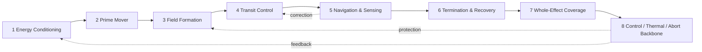
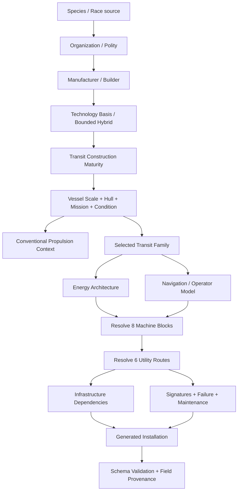
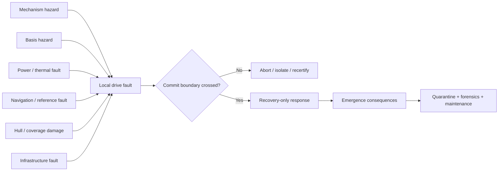
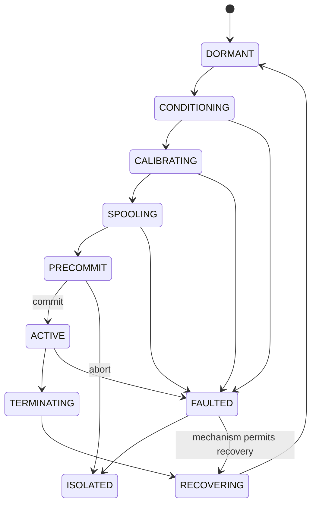
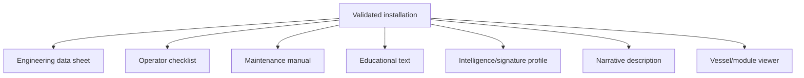

# Black Light Propulsion & Transit Authority

**Status:** authoritative integration reference for Black Light propulsion, FTL/transit engineering, generator semantics, EXO vessel handoff, provenance, and presentation views.  
**Authority scope:** consolidates surviving repository authority without retroactively inventing missing race-, manufacturer-, or mechanism-specific canon.  
**Reconciliation base:** `main` at `2ff9f2af0aa86962dadc51bb7a7346c87a0e9aaf`, plus the registry/schema/manual integration created from that reconciliation.  
**Canon labels:** `CONFIRMED` = directly recovered from repository authority; `DERIVED` = engineering consequence constrained by confirmed canon; `PROPOSED` = useful extension not independently established as canon; `UNRESOLVED` = source or claim cannot currently be recovered; `MIXED` = structured result contains more than one status and must preserve field-level provenance.

---

## 1. Purpose and domain boundary

Black Light separates **how a vessel moves through ordinary spacetime** from **how it achieves nonlocal or effectively superluminal transit**. Conventional and relativistic propulsion remain part of EXO vessel propulsion engineering. FTL/transit is an adjacent capability domain with its own physical action, machinery, infrastructure, navigation, operating hazards, maintenance, signatures, failure modes, and provenance.

FTL is therefore **not P7**. Two repository systems use P0-P6 terminology, but they describe different axes:

- `data/exo-vessel/engineering-registry.json` uses P0-P6 for ordinary-spacetime propulsion technology bands.
- the recovered FTL archive uses P0-P6 for **construction maturity within a transit path**, from monumental precursor machinery through mature compact/adaptive implementation.

Those axes may correlate in a particular civilization only when source material says they do. They MUST NOT be merged into one `Path`, `technologyLevel`, or performance number.

The governing rule is:

> **Comparable end effects do not imply comparable machines.**

Species environment, body plan, senses, civilization, organization, manufacturer, technology basis, maturity, vessel scale, mission, condition, and selected transit mechanism determine the installation. A biological drive is not a terrestrial drive with organic nouns substituted for mechanical ones. A mineral drive is not a terrestrial drive with crystals glued to a console. The carrier, manufacturing logic, service method, spatial arrangement, control assumptions, failure vocabulary, and signatures must emerge from the operative technology basis and any higher-authority race/manufacturer source.

---

## 2. Authority order and provenance

When two records disagree, resolve them in this order:

1. **Specific surviving race/species, organization, manufacturer, named vessel, named installation, and named-technology source material.**
2. **This Propulsion & Transit Authority** for domain boundaries, common vocabulary, generation order, source/status discipline, and integration rules.
3. **Recovered FTL archive definitions** represented by `docs/blacklight/FTL_ENGINEERING_CATALOG_WORKING.md` for confirmed transit families, Path implementations, construction maturity, scale, infrastructure, energy families, and recovered machinery doctrine.
4. **`EXO_OPERATIVE_TECHNOLOGY_BASIS.md`** for species/environment/organization/manufacturer-derived operative machinery, route carriers, controls, service environments, hybridization, interoperability, and failure language.
5. **`EXO_VESSEL_SYSTEM_DESIGN_GUIDE.md`** for deterministic vessel-source layers, seed hierarchy, engineering/layout auditability, load-path rules, condition state, and vessel integration.
6. **Current EXO registries**, especially `data/exo-vessel/technology-basis-registry.json` and `data/exo-vessel/engineering-registry.json`, for machine-readable basis identifiers and ordinary-spacetime propulsion values.
7. **`docs/blacklight/FTL_TECHNOLOGY_BASIS_INTEGRATION_WORKING.md`** as a `DERIVED` embodiment workshop mapping confirmed mechanism functions through operative technology bases.
8. **Mathematical and real-physics analogies** as consistency/education tools only unless separately adopted into setting canon.
9. **Model inference** only when explicitly labeled `DERIVED` or `PROPOSED` and accompanied by parent inputs and a resolver rule.

A generated vessel instance can become authoritative **for that generated instance** only when its input authority snapshot, resolver choices, seed hierarchy, generator version, and provenance are retained. Generated output never silently rewrites setting-wide canon.

### 2.1 Source index

- `docs/blacklight/BLACK_LIGHT_PROPULSION_TRANSIT_AUTHORITY.md` — consolidated authority entrypoint.
- `docs/blacklight/FTL_ENGINEERING_CATALOG_WORKING.md` — recovered FTL archive spine and provisional mathematical workshop.
- `EXO_OPERATIVE_TECHNOLOGY_BASIS.md` — live governing operative-technology supplement.
- `EXO_VESSEL_SYSTEM_DESIGN_GUIDE.md` — governing EXO vessel design/integration guide.
- `data/exo-vessel/technology-basis-registry.json` — seven operative technology families and six invariant route semantics.
- `data/exo-vessel/engineering-registry.json` — ordinary-spacetime P0-P6 propulsion registry.
- `BLACKLIGHT_EXO_SOURCE_AUTHORITY.md` — cross-domain published-first/provenance precedent used here for canon-safe supplement behavior.
- `data/blacklight-continuum/wiki/foundation-lore.json` — surviving Black Light campaign/race source including Ar'nock engineering constraints.
- `docs/blacklight/FTL_TECHNOLOGY_BASIS_INTEGRATION_WORKING.md` — derived family-by-basis machinery embodiment workshop.
- `data/exo-vessel/propulsion-transit-registry.json` — machine-readable mirror of confirmed families, invariants, source chain, and canon safeguards.
- `data/schemas/exo-vessel-propulsion-transit.schema.json` — generated-installation validation contract.
- `docs/blacklight/PROPULSION_TRANSIT_GENERATOR_REFERENCE.md` — subordinate resolver/generator implementation reference.
- `docs/blacklight/PROPULSION_TRANSIT_FIELD_MANUAL.md` — subordinate practical equipment/training view.

### 2.2 Repaired authority-chain gap

An earlier revision of this authority incorrectly treated the operative-technology prose source as missing because it searched for the obsolete path `docs/blacklight/EXO_OPERATIVE_TECHNOLOGY_BASIS.md`.

The source is live at repository root as:

`EXO_OPERATIVE_TECHNOLOGY_BASIS.md`

It explicitly declares itself a Charles-authored Blacklight EXO engineering framework and a **governing supplement to `EXO_VESSEL_SYSTEM_DESIGN_GUIDE.md`**. The current technology-basis registry is therefore its machine-readable companion, not a replacement invented to fill a missing source.

This correction closes the gap without promoting any inferred race-specific FTL content. Material previously marked unresolved solely because of the bad path is restored to the authority chain; genuinely missing race/manufacturer transit assignments remain unresolved.

### 2.3 Canon-safe overwrite policy

The propulsion/transit resolver adopts the repository's existing published-first source discipline as a cross-domain provenance rule:

| Source condition | Allowed resolver behavior |
|---|---|
| Confirmed value | Preserve. A lower layer may specialize within explicit constraints but may not replace it. |
| Confirmed lower bound/classification | Preserve the bound/classification; any refinement remains separately labeled. |
| Candidate/disputed record | Keep separate from confirmed values and conclusions. |
| Explicit unknown | Remain unknown in `AUTHORITY_ONLY`. |
| Gap with sufficient confirmed parents | May become `DERIVED` only in `LABELED_DERIVATION`, with rule and provenance. |
| Gap lacking sufficient authority | May become `PROPOSED` only in `LABELED_PROPOSAL`. |

Repeated generation, documentation, UI display, or model confidence cannot promote `DERIVED` or `PROPOSED` material to `CONFIRMED`.

---

## 3. Confirmed transit families

The recovered archive establishes these mechanism families:

| Archive key | Confirmed family | Physical action | Principal operational character |
|---|---|---|---|
| `metric-envelope` | Metric Compression Envelope | 4D local metric deformation | protected local volume; contracted/expanded external geometry |
| `gravitic-plane` | Gravitational-Plane Skimmer | 4D geodesic-plane transit with higher-order gradient correction | follows favorable gravitational/equipotential geometry |
| `slipstream-shear` | Hyperspatial Slipstream Shear | Q-space boundary-layer coupling | rides a metastable shear adjacent to normal spacetime |
| `q-lattice` | Q-Lattice Phase Translation | indexed quantized Q-state translation | address/epoch-sensitive discrete translation |
| `n-manifold` | N-Dimensional Manifold Drive | higher-dimensional geodesic projected to 3+1D | shortened route through valid embedding/return map |
| `fold-jump` | Discrete Fold-Jump Drive | temporary topological adjacency | origin/destination volumes made adjacent; little meaningful post-commit correction |
| `wormhole-gate` | Anchored Wormhole / Gate Transit | maintained multiply connected topology | infrastructure-heavy aperture network |
| `phase-displacement` | Quantum Phase Displacement | macroscopic nonlocal state displacement | compatible-state transfer with continuity/reference burdens |
| `inertial-torch` | Relativistic Inertial Torch | ordinary continuous causal travel | precursor/comparison baseline; **not true FTL** |

These names and actions outrank generic buckets such as `warp`, `jump`, `subspace`, `hyperspace`, `teleport`, or `gate` when producing a resolved Black Light installation.

### 3.1 Recovered Path implementations

The archive preserves a seven-stage implementation progression for each family. Representative named implementations include:

- Metric: Metric Stress-Test Monolith -> Inertial Relief Envelope -> Subluminal Compression Bubble -> First Causal-Horizon Envelope -> Operational Warp Envelope -> Strategic Metric Drive -> Compact Dynamic Metric Engine.
- Gravitic: Gravitational Rail Monolith -> Equipotential Skim Array -> Barycentric Plane Rider -> Interstellar Plane Skimmer -> Multi-Plane Transit Drive -> Deep-Gradient Skimmer -> Adaptive Geodesic Drive.
- Slipstream: Boundary-Shear Observatory -> Q-Boundary Probe Launcher -> Captive Slipstream Tunnel -> Shipboard Slipstream Coupler -> Operational Shear Drive -> Strategic Slipstream Drive -> Compact Wake-Riding Drive.
- Q-Lattice: Q-Cell Addressing Monolith -> Molecular Phase Conveyor -> Macroscopic Lattice Translator -> Beacon-Indexed Jump Array -> Autonomous Q-Lattice Drive -> Strategic Phase Network -> Compact State-Translation Core.
- N-Manifold: Dimensional Topology Observatory -> Five-Axis Test Volume -> Captive Manifold Transit Array -> Shipboard N-Manifold Drive -> Adaptive Higher-Dimensional Drive -> Deep-Range Manifold Engine -> Compact Multi-Axis Drive.
- Fold: Adjacency Test Monolith -> Cargo Fold Chamber -> Orbital Fold Gate -> Capital Fold-Jump Core -> Fleet Fold Drive -> Strategic Long-Fold Engine -> Compact Tactical Fold Core.
- Gate: Microscopic Throat Foundry -> Cargo Aperture Gate -> Orbital Paired Gate -> Stellar Gate Complex -> Corridor Gate Network -> Strategic Deep Gate -> Self-Stabilizing Gate Lattice.
- Phase displacement: Quantum State Conveyor -> Gram-to-Tonne Displacement Vault -> Macroscopic Phase Chamber -> Beacon-Coupled Vessel Displacement -> Autonomous Phase Drive -> Strategic Nonlocal Transit Core -> Compact Identity-Preserving Displacer.
- Inertial torch: Beamed Reaction Launch Monolith -> Fusion-Pulse Acceleration Spine -> Antimatter-Catalyzed Torch Array -> Relativistic Courier Torch -> Fleet Inertial Torch -> Near-Light Strategic Torch -> Asymptotic Relativistic Drive.

The supporting recovery catalog remains authoritative for the complete recovered component lists and path details.

---

## 4. Universal eight-block transit machine

Every transit family resolves through eight stable end-effect blocks. Their function is shared; their physical embodiment is not.



| Block | Required end effect | Mandatory generator question |
|---|---|---|
| Energy conditioning | make usable drive-state energy available | source, conditioning, buffer, delivery, isolation, reserve? |
| Prime mover | create the initiating exotic/field/topological condition | what physically changes state? |
| Field formation | shape the effect around payload/route | what surface, lattice, organ, membrane, ring, aperture, or field defines it? |
| Transit control | modulate and hold the effect | what quantities are actively controlled and by what actuator/carrier? |
| Navigation & sensing | solve route/reference/condition | what must be measured and authenticated? |
| Termination & recovery | return to an admissible ordinary state | what energy/momentum/phase/topology/radiation state must be disposed or reconciled? |
| Whole-effect coverage | include the complete intended payload | what boundary proves the entire vessel/cargo/occupants are inside the valid effect? |
| Backbone | synchronize and protect all blocks | control, thermal, abort, diagnostics, reserve, isolation, fallback? |

A generator that emits a drive name but does not resolve or explicitly mark all eight blocks unresolved has generated a label, not an engineering installation.

---

## 5. Operative technology bases — CONFIRMED

The live root operative-technology authority and its registry jointly establish seven current machinery languages:

1. `TERRESTRIAL_ELECTROMECHANICAL`
2. `AQUATIC_ELECTROCHEMICAL_HYDRAULIC`
3. `CRYOGENIC_AMMONIA_HALOCARBON`
4. `GAS_GIANT_FLUIDIC_ELECTROSTATIC`
5. `BIOLOGICAL_SYMBIOTIC`
6. `MINERAL_PIEZOELECTRIC_PHOTONIC`
7. `FIELD_MEDIATED_POSTMATERIAL`

They also establish the invariant route semantics `structural`, `power`, `cooling`, `data`, `atmosphere`, and `access`; the end effects are stable while their carrier, interface, tolerance, controller, seal/boundary, service environment, and human interoperability vary.

### 5.1 Technology-basis machine languages — DERIVED crosswalk

| Basis | Power/energy language | Control/sensing language | Typical embodiment | Maintenance language |
|---|---|---|---|---|
| Terrestrial electromechanical | electrical, thermal, chemical/nuclear interfaces, stored fields | electronic/optical computation, actuators | buses, vessels, coils, frames, cryostats, pumps | inspect, isolate, replace, calibrate, coolant/insulation service |
| Aquatic electrochemical-hydraulic | ionic gradients, electrochemistry, pressure stores, wet superconductive elements | pressure/fluidic logic + optical/electrochemical sensing | immersed manifolds, membranes, pressure cells, wet field surfaces | chemistry, dissolved gas, fouling, cavitation, valves, seals, corrosion |
| Cryogenic ammonia-halocarbon | cold superconductive networks, ionic cryofluid, phase-change stores | photonic timing, cold control, cryofluid actuation | vacuum jackets, contraction frames, cold loops, bellows | contamination, contraction alignment, seals, fluid purity, thermal history |
| Gas-giant fluidic-electrostatic | pressure gradients, charge separation, electrostatic/ionic flow | acoustic/fluidic/electrostatic logic | charged skins, membranes, tension webs, buoyancy cells | pressure integrity, membrane/tension repair, charge and resonance tuning |
| Biological symbiotic | metabolic/electrochemical organs, symbionts, mineral inclusions | neural, hormonal, distributed sensory biology | organs, vascular routes, field-bearing tissue, grown inclusions | feeding, husbandry, surgery, grafting, microbiome/electrolyte control, regeneration |
| Mineral piezoelectric-photonic | strain, polarization, thermal gradients, photonic/phononic transfer | stress, light, resonance, lattice state | crystal bodies, resonant domains, defect channels | flaw mapping, preload/axis restoration, annealing, cleaning, regrowth |
| Field-mediated postmaterial | persistent controlled field state with material reserve | state-authenticated distributed control | adaptive anchor matter, field nodes, programmable surfaces | coherence/reference restoration, authorization audit, known-safe fallback reconstruction |

The crosswalk is not a declaration that every species fits neatly into exactly seven boxes. It is the current deterministic starting framework. Specific source material can refine or override it within the authority chain.

---

## 6. Race- and culture-specific authority

### 6.1 Ar'nock — confirmed engineering constraints

The surviving Black Light foundation record establishes several Ar'nock engineering facts without establishing their FTL family:

- their civilization possessed instruction-driven biological fabrication capable of producing complete organisms from versatile feedstock;
- vessel computation includes cultivated neural components and unfamiliar identity controls;
- controls can be vibration-based;
- architecture supports upright tool use but reflects elongated segmented reach and flexible interfaces;
- the vessel atmosphere is survivable to humans at useful pressure/oxygen-equivalent exchange while containing acidic compounds and unfamiliar trace gases;
- the observed derelict contains biological printers, medical systems, cultivated computation, environmental controls, storage, fabrication feedstock, damaged networks, and inaccessible compartments.

These are `CONFIRMED` constraints on any Ar'nock machinery explanation.

### 6.2 Ar'nock transit assignment — UNRESOLVED

No currently reconciled source establishes a named Ar'nock transit family. Therefore:

`Ar'nock transitFamily = UNRESOLVED`

A generator MAY derive service/interface consequences from the confirmed Ar'nock facts: cultivated control substrates, vibration feedback, flexible nonhuman service geometry, biological fabrication compatibility, nonhuman identity/authentication boundaries, and atmosphere/material compatibility. It MUST NOT choose Metric, Q-Lattice, Slipstream, Fold, or any other family simply because one seems aesthetically compatible.

This is the template for all future race-specific integration: recover facts first, constrain embodiment second, leave mechanism unknown until sourced.

---

## 7. Generator resolution order



Canon-safe precedence is:

`explicit named canon > race/species constraint > organization constraint > manufacturer doctrine > technology basis > transit construction maturity > vessel/mission/condition > family default > labeled derived engineering > labeled proposal`

Unknowns are allowed. Silent invention is not.

### 7.1 Supplement modes

The registry establishes three generation modes:

- `AUTHORITY_ONLY` — no procedural gap filling. Unknown stays unknown.
- `LABELED_DERIVATION` — permits engineering consequences when confirmed parents and an explicit resolver rule exist.
- `LABELED_PROPOSAL` — permits clearly labeled design proposals for exploration; proposals cannot masquerade as recovered setting truth.

---

## 8. Scale and embodiment

Recovered scale bands are:

| Scale | Approximate recovered mass band | Dominant engineering pressure |
|---|---:|---|
| Uncrewed probe | 1-40 t | minimum viable coverage, autonomous operation, little thermal/redundancy reserve |
| Fighter / strike craft | 18-180 t | extreme miniaturization, violent duty cycle, limited redundancy |
| Shuttle / courier | 120-2,200 t | compact navigation, rapid turnaround |
| Corvette | 1,800-18,000 t | distributed redundancy and hull-flex compensation begin |
| Frigate / merchant | 15,000-180,000 t | endurance, cargo-state variation, serviceability |
| Cruiser | 160,000-1,800,000 t | field sectors, battle damage, large internal mass changes |
| Capital / carrier | 1.5-24 million t | coherent effect around enormous dynamic mass and distributed machinery |
| Gatework / megastructure | 24 million-24 billion t | stationary geometry, aperture/throughput, route infrastructure, strategic geography |

Scale changes embodiment rather than technological identity. A larger biological system grows/distributes additional tissue and circulation; a mineral system expands or segments resonant domains; a terrestrial system distributes field nodes/rings, buses, coolant, service trunks, and supports; a gas-giant system expands membrane/tension architecture; a postmaterial system expands authenticated field volume, anchor density, reserve, and fallback capability.

### 8.1 Non-canon burden estimator

A useful design-only relationship remains:

`B_effect = k_family * M^alpha * V_effect^beta * C_geometry * C_environment * C_damage`

`B_effect` is an engineering-burden comparison, not literal drive energy. `M`, `V_effect`, and correction factors make explicit that mass, protected volume, geometry, environment, and damage matter. `k_family`, `alpha`, and `beta` are **not canonical constants**.

Useful normalized diagnostics are:

`M_coverage = V_valid_effect / V_required_payload`

`M_recovery = recovery_available / recovery_required`

`M_power = P_available_at_drive / P_required_at_drive`

Values below 1 represent an unmet modeled requirement. Thresholds beyond that statement remain installation/generator policy unless canon supplies them.

---

## 9. Power and thermal architecture

Recovered FTL-supporting plant families include fusion pulse banks, antimatter-catalyzed field plants, contained micro-singularity accumulators, metastable vacuum-polarization cells, Q-state condensate reservoirs, and direct stellar power/mass taps for fixed gateworks.

Power plant and transit mechanism are independent axes. The same family can admit different energy embodiments where the recovered Path permits them.

Every installation must resolve:

`source -> conditioning -> buffer/storage -> pulse or continuous delivery -> drive block -> recovery/dump -> emergency isolation`

A power source without delivery, isolation, recovery/dump, and thermal/working-medium consequences is mechanically incomplete.

For **ordinary reaction propulsion only**, physical validation may use:

`Delta_v = v_e * ln(m_0 / m_1)`

This is not an FTL range/speed equation.

A generic non-canon thermal audit may express:

`Q_dot_reject >= Q_dot_waste_power + Q_dot_transit_residual + Q_dot_environment - Q_dot_stored`

The equation is an accounting prompt: the actual heat/disorder carrier may be pumped fluid, cryogenic phase change, vascular circulation, mineral conduction/phononics, radiating surfaces, sacrificial storage, or postmaterial state management according to basis.

---

## 10. Navigation, reference authority, and controls

A coordinate is not enough. Each family requires different state:

| Family | Required navigation/reference state |
|---|---|
| Metric envelope | external-field knowledge, route hazards, envelope geometry, horizon/radiation emergence conditions |
| Gravitic plane | barycentric mass models, gradient maps, ephemerides, ridge/plane-departure detection |
| Slipstream | Q-weather, shear/adhesion state, phase velocity, normal-space correspondence |
| Q-lattice | destination Q-address, phase epoch, protected address/route records, anti-aliasing validation |
| N-manifold | topology, active axes, embedding integrity, higher-dimensional geodesic, valid return projection |
| Fold-jump | origin/destination exclusion, precision gravimetry/ranging, authenticated destination reference, precommit confidence |
| Wormhole/gate | mouth identity/synchronization, aperture/throughput, schedule/mass-flow, chronology-safe state |
| Phase displacement | compatible target state, occupation exclusion, reference authenticity, continuity and mutable-state handling |
| Inertial torch | ordinary astrogation, thrust/reaction-mass state, acceleration/thermal limits |

Operator models may be bridge-directed, specialist navigator, distributed automation, bonded organism, collective biological sensing, resonant crystalline controller/caste, gate traffic control, or postmaterial authenticated state control where supported by source and basis.

A useful engineering abstraction is:

`S1 = T(S0, E, theta)`

`S0` is measured initial vessel state, `E` is measured environment/reference state, `theta` is the solved control set, and `S1` is an admissible terminal state. The machine must be able to measure/bound inputs, solve control, realize the mechanism, reject unsafe solutions, and recover afterward.

---

## 11. Signatures and observability

Every generated installation exposes signatures across four phases:

1. `PRE_ENTRY_SPOOL`
2. `ACTIVE_TRANSIT`
3. `EMERGENCE_TERMINATION`
4. `AFTERMATH_RECOVERY`

Possible channels are electromagnetic, thermal, optical, gravitational, neutrino, Q/exotic, acoustic/structural, chemical, and biological.

Each signature entry records phase, channel, strength class, geometry, duration, detectability, persistence, canon status, and provenance. `contextual` or `UNRESOLVED` is preferable to an invented numerical detection range.

Technology basis changes signature language. Biological systems may produce metabolic, chemical, thermal, neural, tissue, or symbiont changes. Mineral systems may expose resonant, phononic, polarization, fracture, or optical artifacts. Gas-giant systems may reveal membrane motion, electrostatic discharge, pressure/acoustic state, or ionic flow. Postmaterial systems can reveal coherence/reference/state effects. Unfamiliar does not mean invisible.

---

## 12. Failure model

Failures combine mechanism, basis, integration, vessel condition, navigation, power margin, coverage, infrastructure, and recovery.

`risk = f(mechanismState, technologyHealth, environment, navigationConfidence, energyMargin, coverageIntegrity, recoveryMargin)`

This relation is descriptive, not a canonical probability function.

### 12.1 Confirmed/recovered mechanism failure vocabulary

- Metric: closure asymmetry, horizon formation, bow-radiation handling failure, ringing, field collapse.
- Gravitic: plane loss, gravity-ridge encounter, ephemeris error, gradient overload, emergence-vector error.
- Slipstream: adhesion loss, Q-weather upset, shear excursion, phase-velocity mismatch, wake shock.
- Q-lattice: address alias, epoch mismatch, corrupted reference, partial-state/coverage error, residual anomaly/quarantine condition.
- N-manifold: embedding loss, axis-order error, topology trap, invalid return map, projection distortion.
- Fold-jump: occupied destination, aperture asymmetry, bad adjacency solution, recoil/metric ringing, attempted abort after commit.
- Gate: throat instability, asymmetric mass-flow excursion, mouth desynchronization, aperture shear, chronology-protection trip.
- Phase displacement: occupied target state, reference spoof, residual/duplicate-state anomaly, conservation mismatch, continuity-certification failure.

### 12.2 Basis failure vocabulary

- Terrestrial: breaker/isolation faults, conductor quench, cryostat/coolant failure, alignment, sensor/control fault.
- Aquatic: cavitation, contamination, osmotic/chemical drift, valve/manifold failure, galvanic attack, dissolved-gas excursion.
- Cryogenic: warm contamination, contraction misalignment, superconductive transition, seal failure, phase-change buffer exhaustion.
- Gas-giant: membrane rupture, pressure imbalance, electrostatic discharge, tension-web instability, acoustic timing corruption.
- Biological: rejection, necrosis, infection, electrolyte/hormone drift, neural desynchronization, scar/tumor interference, exhausted regeneration.
- Mineral: crack growth, domain inversion, preload loss, modal detuning, optical-defect contamination, failed annealing/regrowth.
- Field-mediated: coherence collapse, reference loss, authorization corruption, state drift, hostile state injection, reserve depletion, failed fallback reconstruction.

### 12.3 Failure propagation



The generator combines layers; it does not draw one generic “FTL malfunction.”

---

## 13. Maintenance and lifecycle

Every installation must carry:

- inspection and event-triggered checks;
- calibration/reference requirements;
- consumables or working media;
- life-limited components, tissues, lattice domains, membranes, or state resources;
- acceptable degradation indicators;
- field/route recertification triggers;
- post-transit inspection requirements;
- emergency isolation method;
- depot/manufacturer-only operations;
- service environment;
- evidence/signatures of latent failure.

Advanced technology can reduce manual replacement without eliminating maintenance. Maintenance may become husbandry, surgery, annealing, state authentication, coherence restoration, membrane/tension management, chemistry control, automated metrology, or fallback reconstruction.

### 13.1 Lifecycle state machine



The common state vocabulary does not make all drives operationally identical.

---

## 14. Practical equipment-manual framework

The practical companion is `PROPULSION_TRANSIT_FIELD_MANUAL.md`. It is a derived presentation view, not a second authority source.

Every installation manual should be rendered from the same structured record and include:

1. installation identity, source snapshot, and canon-status key;
2. physical machinery identification and locations;
3. six utility-route carriers/interfaces/tolerances;
4. cold/dormant inspection;
5. basis-specific conditioning;
6. vessel/route calibration;
7. spool and precommit checks;
8. explicit commit boundary and abort state;
9. family-specific active-transit quantities;
10. termination/recovery procedure;
11. post-transit inspection and forensic preservation;
12. maintenance procedures, consumables, service environment, and depot-only work;
13. failure symptom -> owning block -> dependency -> repair -> proof-of-restoration tracing;
14. provenance appendix.

The standard derived operating progression is:

`DORMANT -> CONDITIONING -> CALIBRATING -> SPOOLING -> PRECOMMIT -> ACTIVE -> TERMINATING -> RECOVERING -> DORMANT`

with fault/isolation branches as the family permits.

Abort vocabulary remains:

`SAFE_ABORT -> DEGRADED_ABORT -> COMMIT_BOUNDARY -> NO_ABORT -> RECOVERY_ONLY`

A fold jump and a continuous metric envelope MUST NOT receive identical emergency-stop semantics.

---

## 15. Educational model

### 15.1 Crew level

Do not begin with “how fast is it?” Begin with “what must remain true for this mechanism to deliver the complete vessel to an admissible endpoint?” Different families manipulate geometry, gravitational paths, Q-boundaries, indexed states, higher-dimensional embeddings, topology, maintained apertures, or nonlocal state.

### 15.2 Technician level

Learn the eight machine blocks and six route end effects. Find which end effect failed, then identify the native carrier and interface. An alien `power` route can be ionic, fluidic, biological, photonic, field-mediated, or otherwise non-terrestrial; the word `power` describes the required result, not a copper cable.

### 15.3 Engineer level

Transit is a constrained state transformation. Mathematical availability is not engineering viability. The installation must measure state, build a solution under uncertainty, physically realize it, keep the complete payload inside the valid effect, maintain structural and utility dependencies, and recover afterward.

### 15.4 Intelligence level

Observe signatures by phase and attach confidence/provenance. A vibration-control culture, cultivated computation, biological machinery, or crystalline resonance may constrain hypotheses without proving a specific drive family. Do not promote visual resemblance into mechanism identity.

### 15.5 API/generator level

`driveType = warp` is insufficient. A valid record retains source snapshot, separate propulsion/transit axes, race/manufacturer/basis, vessel state, all eight blocks, all six routes, navigation, operations, maintenance, signatures, failures, infrastructure, validation, and field provenance.

---

## 16. Mathematical validation appendix — non-canon unless separately adopted

The mathematics here provides consistency vocabulary. It does not assert that archive machinery literally implements a contemporary published metric.

Einstein field relation:

`G_mu_nu + Lambda g_mu_nu = (8 pi G / c^4) T_mu_nu`

Spacetime interval:

`ds^2 = g_mu_nu dx^mu dx^nu`

Metric-envelope conceptual analogy:

`ds^2 = -c^2 dt^2 + [dx - v_s f(r_s)dt]^2 + dy^2 + dz^2`

State/nonlocal translation abstraction:

`J : (x^mu, p^mu, Psi, I) -> (x'^mu, p'^mu, Psi', I')`

Tidal/geodesic-deviation audit:

`D^2 xi^mu / D tau^2 = -R^mu_(nu alpha beta) u^nu xi^alpha u^beta`

Endpoint uncertainty may be represented by covariance `Sigma_endpoint`; a UI-oriented confidence illustration is:

`C_nav = 1 - clamp(trace(W * Sigma_endpoint), 0, 1)`

`W` and thresholds are `PROPOSED` until calibrated.

For compatible ordinary reaction propulsion:

`Delta_v = v_e ln(m0/m1)`

This is explicitly an ordinary-space propulsion audit and MUST NOT be used to manufacture FTL performance.

---

## 17. API and machine-readable contract

The authoritative machine-readable integration now consists of:

- `data/exo-vessel/propulsion-transit-registry.json`
- `data/schemas/exo-vessel-propulsion-transit.schema.json`

The schema requires these top-level domains:

```json
{
  "recordType": "exoVesselPropulsionTransitInstallation",
  "schemaVersion": "1.0.0",
  "authoritySnapshot": {},
  "supplementMode": "AUTHORITY_ONLY|LABELED_DERIVATION|LABELED_PROPOSAL",
  "identity": {},
  "vessel": {},
  "conventionalPropulsion": {},
  "transit": {},
  "machineChain": {},
  "routes": {},
  "navigation": {},
  "operations": {},
  "maintenance": {},
  "signatures": [],
  "failureModes": [],
  "infrastructure": {},
  "validation": {},
  "provenance": []
}
```

The schema intentionally allows `null` for unresolved values where fabricating an answer would be worse than an incomplete record.

### 17.1 Provenance entry

Every nontrivial field should be traceable:

```json
{
  "field": "machineChain.fieldFormation.embodiment",
  "status": "CONFIRMED|DERIVED|PROPOSED|UNRESOLVED|MIXED",
  "sourcePath": "<repository path>",
  "sourceRevision": "<blob/commit/schema version or null>",
  "resolverRule": "<rule id or null>",
  "parentInputs": ["<input field>", "<input field>"],
  "notes": "<why this value is justified>"
}
```

A user should be able to ask **why this ship has this machine** and receive the source chain, not a post-hoc narrative.

---

## 18. Infrastructure and strategic geography

Confirmed infrastructure configurations are:

- self-contained ship drive;
- beacon-assisted navigation;
- prepared transit corridor;
- paired mobile/orbital gates;
- fixed stellar gateworks.

They are configuration layers, not additional physics families.


The diagram illustrates increasing external infrastructure; it is **not** a mandatory developmental progression.

Infrastructure can change range, solution quality, energy burden, spool behavior, emergence accuracy, throughput, scheduling, route dependence, service geography, customs control, military chokepoints, survey requirements, and political monopoly. These consequences are derived only where the infrastructure exists.

---

## 19. Interoperability

Current EXO authority recognizes `DIRECT`, `ADAPTER_REQUIRED`, and `HOSTILE_WITHOUT_CONVERSION`.

FTL integration applies the same principle across **power, control/reference, structural load transfer, cooling/working medium, atmosphere/environment, access/service assumptions, authentication, and safety semantics**.

A terrestrial connector that can physically mate with an aquatic pressure-logic system is not direct interoperability if reference potential, chemistry, pressure, or control meaning differs. A biological neural reference cannot be treated as ordinary digital data without a defined translation boundary. A postmaterial state interface cannot be reduced to a plug shape.

The most dangerous adapter is one that converts the connector while failing to convert the underlying reference model.

---

## 20. Chronology and causality safeguards

No generator may infer time travel merely from superluminal or exotic transit.

`FTL != chronology violation`

Chronology effects require explicit source authority. Gate synchronization, manifold routing, phase displacement, spacelike separation, or mathematical analogy may trigger a validation warning but MUST NOT create historical alteration, backwards messaging, closed timelike curves, duplicate timelines, or retrocausal gameplay by default.

A candidate route that intersects chronology-sensitive conditions returns a state such as:

```json
{
  "solutionStatus": "REQUIRES_CANON_AUTHORITY",
  "warning": "Candidate route intersects chronology-sensitive conditions; no chronology effect is authorized by current source authority."
}
```

---

## 21. Layout and vessel integration

The governing EXO vessel guide requires machinery-first generation and a continuous structural load path connecting ordinary thrust, FTL foundations/coverage anchors, major fuel/reaction-mass loads, docking/landing loads, habitat acceleration support, weapons recoil/launch forces, and major external modules.

Transit generation therefore hands the vessel assembler at least:

- machine-block bounding/clearance requirements;
- structural foundation and load-path requirements;
- protected effect volume/coverage geometry;
- power, cooling, data/reference, atmosphere/environment, and access routes;
- catastrophic-risk segregation requirements;
- navigation sensor baselines and low-noise placement needs;
- radiator/exchange/deployment requirements;
- service environment and replace/grow/anneal/reconstruct access;
- infrastructure interfaces;
- condition/failure propagation dependencies.

Current closed mass/volume references are not silently recalculated merely because a richer technology methodology exists. A methodology-aware rebalance must explicitly reopen the appropriate engineering ledger and preserve/reconcile prior reference records.

---

## 22. Single-record, multiple-view rule

One validated installation record feeds all presentations:



A renderer, manual writer, viewer, or narrative generator may change language and detail level. It may not independently re-resolve canon or invent a different drive.

This is the practical meaning of readable procedural canon: every view can be more or less detailed without contradicting the same source object.

---

## 23. Validation invariants

A valid propulsion/transit installation proves that:

1. ordinary propulsion band and transit construction maturity remain separate axes;
2. confirmed source values have not been overwritten by procedural values;
3. every `DERIVED` or `PROPOSED` value carries provenance and parent inputs;
4. all eight machine blocks are present or explicitly unresolved;
5. all six invariant EXO route semantics have carrier/interface/tolerance state;
6. whole-effect coverage includes the intended payload or reports the shortfall;
7. navigation/reference inputs match the selected mechanism;
8. energy architecture includes delivery, isolation, recovery/dump, and thermal/working-medium consequences;
9. structural integration supplies a continuous load/foundation path;
10. abort state respects the family-specific commit boundary;
11. technology-basis embodiment changes actual carrier/control/service/failure language rather than merely vocabulary;
12. race-specific constraints outrank generic basis assumptions;
13. no race-specific transit family is invented from aesthetic or technological compatibility;
14. alien compatibility is not assumed from identical end effects;
15. no chronology effect is created without explicit canon authority;
16. output views consume the same validated record;
17. identical source snapshot, complete seed hierarchy, generator version, and deterministic inputs reproduce the same result;
18. unresolved material remains visible rather than being silently normalized away.

---

## 24. Known gaps and next expansion targets

`RESOLVED:` the operative-technology authority is not missing; it is the root `EXO_OPERATIVE_TECHNOLOGY_BASIS.md`. The stale-path authority gap is closed by this revision.

`UNRESOLVED:` Ar'nock and other race/manufacturer-specific named FTL assignments must be added only when surviving source records establish them.

`UNRESOLVED:` canonical numerical range, speed, spool time, detection range, failure probability, energy cost, and scaling exponents cannot be inferred uniformly across the recovered transit families. Where numbers do not survive, the system retains qualitative constraints or labeled design estimators.

`PROPOSED:` software resolver implementation should consume `propulsion-transit-registry.json` and validate output against `exo-vessel-propulsion-transit.schema.json` rather than duplicating family/basis lists in renderer code.

`PROPOSED:` manufacturer-specific manuals, conversion-bay engineering, mixed-technology salvage/refit rules, damage propagation into transit capability, infrastructure traffic models, and transit-signature intelligence tools should be generated as views/extensions of the same structured installation record.

---

## 25. Supporting-document roles

`FTL_ENGINEERING_CATALOG_WORKING.md` remains the archive-recovery ledger and mathematical workshop. Its recovered commit provenance, path implementations, component families, scale, infrastructure, and energy reconstruction remain important.

`FTL_TECHNOLOGY_BASIS_INTEGRATION_WORKING.md` remains the detailed `DERIVED` embodiment workshop. It is subordinate to confirmed race/manufacturer source material, the live root operative-technology authority, and this consolidated authority.

`PROPULSION_TRANSIT_GENERATOR_REFERENCE.md` explains how to resolve the structured installation without becoming a competing lore authority.

`PROPULSION_TRANSIT_FIELD_MANUAL.md` demonstrates how practical equipment manuals and educational text are rendered from that structured installation.

`propulsion-transit-registry.json` and `exo-vessel-propulsion-transit.schema.json` make the core vocabulary and validation rules machine-readable.

This document remains the **single authoritative integration entrypoint**. Future refinements should extend or correct this authority deliberately rather than creating another competing top-level propulsion/FTL authority.
