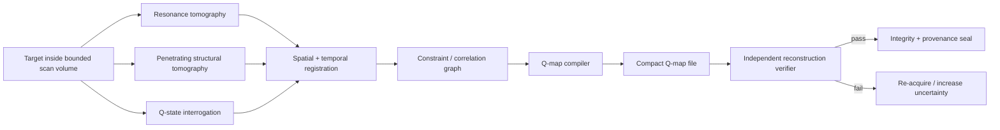
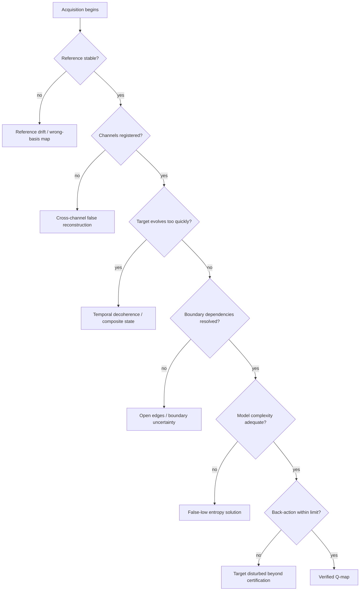
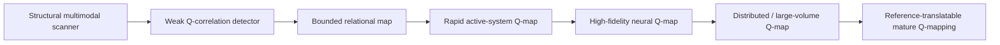

# Black Light Q-map Technology

**Status:** authoritative integration reference for the Q-map concept introduced by current Black Light project direction, with engineering details explicitly status-labelled.  
**Machine-readable authority:** `data/blacklight-continuum/rules/q-map-technology.json`  
**Validation schema:** `data/schemas/blacklight-q-map.schema.json`

**Canon labels:** `CONFIRMED` = established by current project directive or surviving authority; `DERIVED` = engineering consequence constrained by confirmed material; `PROPOSED` = coherent setting extension not yet independently established; `UNRESOLVED` = deliberately unknown or unrecovered.

---

## 1. Definition

The **Q-map** is a bounded, multi-channel physical-state mapping technology. It combines three kinds of observation into one synchronized reconstruction:

1. an MRI-like **resonance tomography channel**;
2. an X-ray-like or diffraction-like **penetrating structural channel**;
3. a setting-specific **Q-state interrogation channel** capable of observing relational quantum information that contemporary human physics cannot obtain at comparable scale, completeness, speed, and non-destructiveness.

The first two channels provide the ordinary physical skeleton of the target: geometry, density, composition, internal boundaries, material response, fields, tissue state, and timing. The third channel is what turns an extremely sophisticated scanner into a Q-map.

The Q-channel does **not** merely improve resolution. It observes relationships among microscopic states: phase constraints, correlation structure, entanglement dependencies, uncertainty, and how resolved domains are related to a common Q-reference basis.

The exact particle, field, or carrier responsible for this interaction is presently **UNRESOLVED**. No particle name should be invented merely to make the technology sound finished.

---

## 2. The scanner is three instruments pretending to be one



The architecture matters because Q-mapping is not allowed to become a narrative omniscience machine. The classical channels constrain *where matter is and what ordinary measurements say it is*. The Q-channel constrains *how the measured state is relationally organized*. Each catches different classes of error in the others.

A scanner that has only the third channel is therefore not a complete Q-map system. It may be a Q-sensor, but it lacks the independently measured structural priors required for trustworthy reconstruction.

---

## 3. Bounded scan mathematics

For scanner center \(\mathbf{x}_0\) and certified scan radius \(R\), define the scan domain

\[
\Omega_R = \{\mathbf{x}:\|\mathbf{x}-\mathbf{x}_0\|\leq R\}.
\]

Everything the Q-map claims directly must be traceable to measurements and constraints inside \(\Omega_R\), plus explicitly declared boundary relationships.

This is especially important for entanglement. If a resolved degree of freedom inside the volume remains correlated with something outside it, the scanner cannot truthfully write, “the outside state is known.” It records an **open edge**.

If \(i\in\Omega_R\) is correlated with \(j\notin\Omega_R\), then conceptually:

\[
(i,j)\in E_Q,\qquad j\in B_{open}.
\]

The file may preserve the measurable relationship across the boundary without claiming to contain the full state of the remote partner.

That single rule prevents Q-mapping from quietly turning into universal remote sensing.

---

## 4. What the Q-map file actually stores

The central engineering mistake would be to imagine a Q-map as a gigantic spreadsheet:

```text
particle 1 = ...
particle 2 = ...
particle 3 = ...
...
particle 10^N = ...
```

That representation is both absurdly large and, for a general quantum system, conceptually inadequate.

The Q-map instead stores a **generative relational state description**.

A useful engineering abstraction is

\[
G_Q=(V,E,\Theta,\Sigma,B),
\]

where:

- \(V\) represents resolved state domains, modes, structures, cells, particles, or compressed groups;
- \(E\) stores correlation and entanglement relationships;
- \(\Theta\) stores phase relationships and local generator parameters;
- \(\Sigma\) stores uncertainty and covariance;
- \(B\) stores scan-boundary conditions, unresolved relationships, and open edges.

The classical tomography channels provide a structural constraint set \(C_{structural}\). Reconstruction can then be written abstractly as

\[
\hat{\rho}_{\Omega}
=
\mathcal{R}
\left(
Q_0,
G_Q,
C_{structural},
B,
Q_{reference}
\right).
\]

Here \(Q_0\) is the map's reference/seed state and \(Q_{reference}\) is the physically meaningful reference relationship used by the reconstruction architecture.

This equation is **PROPOSED formalism**, not a claim about contemporary quantum tomography.

---

# 5. The compression paradox

This is the part that makes the Q-map scientifically offensive.

For an arbitrary system of \(N\) generic \(d\)-level subsystems, naïve state-space burden grows roughly with

\[
d^N.
\]

It becomes unusable almost immediately. Ordinary compression cannot simply wish away arbitrary information. If every microscopic degree of freedom is independent and meaningful, the description must pay for that information somewhere.

Yet a mature Q-map is drastically smaller than a naïve complete state dump would imply.

The working Black Light explanation is not that Q-mapping defeats information theory by using a particularly good archive format. It changes **what is stored**.

The scanner appears to discover a highly constrained relational description in which much of the target's apparent microscopic information can be regenerated from a smaller set of measured relationships, generators, boundary conditions, structural priors, and a Q-reference relation.

A provisional storage model is

\[
S_Q
\sim
S_V + S_E + S_{\Theta} + S_{\Sigma} + S_B + S_{residual},
\]

rather than

\[
S_Q\sim d^N.
\]

Define the apparent compression ratio

\[
\mathcal{C}_Q
=
\frac{S_{naive}}{S_Q}.
\]

For sufficiently complex targets, \(\mathcal{C}_Q\) becomes grotesquely large.

But that ratio alone does not explain anything. Computer scientists immediately ask the correct question:

> Where did the missing information go?

A normal answer would be one of the following: it is lossy; it is in a giant dictionary; it is hidden in the decoder; it is in a trained model; it is in an external database; the test is inadequate; or the claimed reconstruction is fraudulent.

Mature Q-map systems are disturbing because those explanations do not fully close the accounting.

The working information balance is therefore:

\[
I_{reconstruction}
=
I_{file}
+
I_{Q-reference}
+
I_{constraints/laws}.
\]

Conventional storage analysis accounts comfortably for \(I_{file}\). It can partly account for the explicit mathematics and decoder represented by \(I_{constraints/laws}\). The scandal is \(I_{Q-reference}\).

The Q-map behaves as though some of the reconstruction basis is **physically available through the Q-domain itself**. The file does not contain all information in the conventional sense; it contains enough information to cause the correct physical relationships to become recoverable when paired with the appropriate Q-reference process.

That produces the quantity that bothers information theorists:

\[
\Delta I_Q
=
I_{apparent}
-I_{file}
-I_{declared\ decoder/reference\ data}.
\]

In ordinary computing, a persistently large positive \(\Delta I_Q\) means the accounting is wrong.

In Q-mapping, experimentally verified reconstruction leaves a stubborn residual.

The uncomfortable hypothesis is therefore:

> **The Q-map is not merely compressed data. It is data plus a lawful physical relationship used as part of decompression.**

Whether this means spacetime, vacuum structure, an unknown Q-field, relational state space, or some still-poorly-understood information-bearing substrate is **UNRESOLVED**.

There should be entire scientific disciplines arguing over whether a Q-map file is genuinely a complete record, a physical index, a state-generating boundary condition, an extraordinarily sophisticated lossy encoding with undetected priors, or evidence that conventional definitions of stored information are incomplete.

Nobody sensible should be completely comfortable with it.

---

## 6. Why neural Q-maps are uniquely unsettling

A Q-map of a girder is interesting.

A Q-map of a working brain is politically, scientifically, and philosophically unpleasant.

A neural Q-map can, to instrument resolution, combine:

- gross anatomy and vascular/support geometry;
- cellular and synaptic structure;
- membrane and ionic state;
- molecular and neurotransmitter distributions;
- time-correlated electrical and chemical activity;
- setting-specific Q correlations and entanglement relationships;
- explicit uncertainty and unresolved outside-volume dependencies.

The map is therefore enormously more than a static anatomical scan.

It is still **not automatically a person**.

This technology does not by itself establish that consciousness requires quantum entanglement, that consciousness is fully captured by a Q-map, that a reconstructed nervous system is legally identical to the scanned person, that a stored map is a soul, or that restoring one constitutes continuity rather than copying.

Those are separate Black Light authorities.

This distinction must remain hard-coded because otherwise every medical or engineering Q-map quietly becomes a setting-wide answer to consciousness, resurrection, identity, and metaphysics.

### 6.1 Time is part of the map

Brains do not hold still simply because the scanner would find that convenient.

Let the acquisition window be \(\Delta t_a\), and let \(\tau_s\) represent the characteristic time over which the target state changes materially for the desired reconstruction.

Define a simple temporal-smear ratio:

\[
\eta_t=\frac{\Delta t_a}{\tau_s}.
\]

As \(\eta_t\) increases, the scanner is no longer measuring one usefully coherent state. It is assembling a composite of states that existed at different moments.

Higher Q-map technology therefore improves neural scanning not merely by increasing spatial resolution, but by reducing acquisition time, increasing synchronization bandwidth, modelling state evolution during acquisition, and recording covariance between time slices.

---

## 7. Resolution is a multidimensional budget

A Q-map does not possess one magical "resolution" number.

Its usable result depends on at least:

\[
\mathcal{R}_Q
=
f
\left(
\delta x,
\delta t,
\delta q,
D_p,
F_r,
B_m,
E_s,
A_d
\right),
\]

where:

- \(\delta x\): spatial resolution;
- \(\delta t\): temporal resolution;
- \(\delta q\): Q-relational resolution;
- \(D_p\): penetration depth;
- \(F_r\): reference fidelity;
- \(B_m\): measurement bandwidth;
- \(E_s\): energy/signal budget;
- \(A_d\): acceptable disturbance/back-action.

You do not get to reduce every \(\delta\) toward zero while increasing radius and penetration indefinitely at fixed power, aperture, detector count, acquisition time, and target disturbance.

That would not be an advanced scanner. That would be an authorial loophole.

---

## 8. Measurement back-action

`DERIVED:` Q-mapping does not eliminate the measurement problem by administrative decree.

Define a target pre-scan state \(\rho_0\), post-scan state \(\rho_1\), and a scanner-specific disturbance functional \(D\):

\[
A_Q=D(\rho_0,\rho_1).
\]

A scanner is certified for a target class when

\[
A_Q \le A_{max,target}
\]

for its declared scan mode.

Advanced systems may reduce probe energy, infer more from fewer interactions, characterize disturbance precisely, exploit reversible interactions, compensate some induced state changes, or reconstruct the expected unperturbed state. None of those mechanisms justify writing `backAction = 0` unless explicit higher authority says so.

For neural scans the permitted disturbance envelope is particularly narrow.

---

## 9. Q-reference architecture

The Q-reference is not merely a timestamp or coordinate frame.

It is the scanner's physically validated basis for deciding that measurements taken by different channels, sensors, times, and locations belong to the same relational state solution.

A Q-reference package therefore needs four things:

1. **identity** — which reference state is this map tied to?;
2. **stability** — how far may it drift during acquisition?;
3. **translation** — can another scanner reproduce or convert the reference?;
4. **authentication** — how do we know a hostile or damaged reference has not caused valid data to compile into the wrong state model?

The last problem creates a particularly ugly failure mode: a Q-map may be internally consistent and cryptographically intact while being **physically registered to the wrong relational basis**.

That is worse than corrupted data because ordinary checks can say everything is fine.

---

## 10. Failure anatomy



The dangerous failures are not always spectacular equipment explosions. The worst failures are **plausible maps that are wrong**.

A melted detector announces itself.

A beautifully compressed, internally self-consistent neural map registered to an incorrect Q-reference does not.

---

# 11. Practical equipment manual

## Q-MAP OPERATOR PROCEDURE — GENERAL OBJECT

### Stage A — Define the claim

Before powering the scanner, specify what the resulting map is expected to support. Structural diagnosis, manufacturing metrology, forensic comparison, neural archival research, machine-state reconstruction, and material analysis require different resolutions and disturbance limits.

Never certify a scan for a claim it was not configured to answer.

### Stage B — Establish the bounded volume

Record:

- scan center;
- scan radius;
- excluded regions;
- target motion envelope;
- external field environment;
- expected open-boundary relationships.

Anything outside the certified boundary is not silently part of the map.

### Stage C — Calibrate the ordinary channels

The resonance and penetrating channels establish the target's physical registration. Calibrate field uniformity, detector response, attenuation model, geometry, timing, and source energy.

If the ordinary structural channels disagree significantly, do not ask the Q-channel to arbitrate reality for you. Repair the instrument.

### Stage D — Establish Q-reference lock

Authenticate the reference package or reference organ/domain. Measure drift. Run a known-state calibration target. Compare redundant reference channels.

A reference fault blocks high-fidelity acquisition.

### Stage E — Acquire synchronously

Run the three channels under common timing authority. Record raw timing, reference state, environmental disturbances, energy deposition, and target movement rather than only storing the final reconstruction.

### Stage F — Audit the boundary

Enumerate significant open correlations. Tag unresolved relationships. Increase scan volume if required and safe.

The correct result may be "insufficiently bounded."

That is preferable to a confident fiction.

### Stage G — Compile the Q-map

Build \(G_Q\), structural constraints, uncertainty, boundary state, and reconstruction metadata. The compiler is allowed to find compact relational descriptions but may not silently discard residuals to hit a desired file-size target.

### Stage H — Withheld-data reconstruction test

Reconstruct test regions using data deliberately withheld from the compiler. Compare predicted and measured state.

A compact representation that cannot predict withheld measurements is merely small, not good.

### Stage I — Disturbance audit

Estimate post-scan back-action against the target's permitted disturbance envelope.

### Stage J — Seal provenance

The final Q-map package must contain or bind to:

- scanner identity and revision;
- technology basis/manufacturer if known;
- scan geometry;
- acquisition window;
- reference identity;
- channel calibration state;
- uncertainty/covariance summary;
- open-boundary edges;
- back-action estimate;
- reconstruction-verification results;
- file integrity seal;
- generation/provenance record.

---

## 12. Neural acquisition procedure

Neural scans add stricter rules.

The operator must minimize \(\Delta t_a\), preserve electrochemical timing, constrain deposited energy, audit target physiological change during scanning, and refuse to collapse unresolved external dependencies into invented known values.

A neural scan report should distinguish at least:

```text
ANATOMICAL FIDELITY
CELLULAR / SYNAPTIC FIDELITY
MOLECULAR STATE FIDELITY
ELECTROCHEMICAL TEMPORAL FIDELITY
Q-RELATIONAL FIDELITY
OPEN-BOUNDARY DEPENDENCIES
REFERENCE CONFIDENCE
BACK-ACTION ESTIMATE
```

It should **not** contain an automatically generated field called `soulCaptured: true`.

That would be both bad science and remarkably poor database design.

---

# 13. Technology-basis embodiments

The required end effects stay comparable while the machine can look completely alien.

| Technology basis | Scanner embodiment | Q-reference embodiment | Principal maintenance concern |
|---|---|---|---|
| Terrestrial electromechanical | superconducting rings, emitter/detector arcs, Q-detector tiles | cryogenic calibrated reference package | timing, alignment, cryostat and detector calibration |
| Aquatic electrochemical-hydraulic | immersed pressure-cell sensor mantle, ionic field cells, wet optics | sealed distributed electrochemical/Q cells | chemistry, dissolved gas, pressure and fouling |
| Cryogenic ammonia-halocarbon | deep-cold resonant shell and superconductive detector stack | cold reference lattice | contamination, contraction geometry and phase transition |
| Gas-giant fluidic-electrostatic | charged membrane/tension-web scanner | suspended charged reference nodes | pressure modes, membrane integrity and charge |
| Biological symbiotic | grown sensory organs, phase ganglia, mineralized emitter tissues | cultivated reference organ/symbiont | pathology, nutrition, neural timing and regeneration |
| Mineral piezoelectric-photonic | preloaded resonant crystal body and defect-channel optics | certified crystal reference domains | cracks, preload, modal detuning and annealing |
| Field-mediated postmaterial | programmable distributed field shell with sparse anchors | authenticated persistent reference mesh | coherence, reference authentication and fallback state |

These embodiments are `DERIVED` until more specific race/manufacturer sources override them.

The important rule is that a biological Q-map scanner is not a terrestrial scanner with the coils renamed “organs.” Its timing, heat transport, repair, reference stability, failure signatures, physical access, and calibration all arise from biological machinery.

---

## 14. Scaling behavior

Let scanner radius be \(R\), useful detector surface density be \(\sigma_d\), desired spatial resolution be \(\delta x\), temporal resolution be \(\delta t\), and relational complexity density be \(\kappa_Q\).

A deliberately non-canonical engineering burden estimator is

\[
B_{scan}
=
K
R^{\alpha}
\delta x^{-\beta}
\delta t^{-\gamma}
\kappa_Q^{\zeta}
C_{material}
C_{motion}
C_{environment}.
\]

The exponents are **PROPOSED** and must be calibrated by later setting authority.

This expression exists to enforce a design truth: doubling the scan diameter while demanding finer spatial and temporal resolution is not a free upgrade.

Larger systems improve through some combination of:

- greater aperture and detector area;
- more synchronized local processing;
- better reference distribution;
- lower-noise materials;
- improved penetrating-source efficiency;
- higher field uniformity;
- better reconstruction mathematics;
- stronger structural/thermal management;
- faster Q-state correlation solvers.

Miniaturization creates the opposite engineering battle: short baselines, limited heat rejection, weak penetrating sources, fewer redundant references, and less ability to isolate the scanner from its own electronics or biology.

---

## 15. Storage does not equal reconstruction cost

Q-map storage can be almost trivial compared with the naïve information content while reconstruction remains computationally and physically demanding.

Define:

\[
C_{store}=|Q_{file}|
\]

and

\[
C_{reconstruct}
=
f(|V|,|E|,rank(C),|B|,\Sigma,Q_{reference},F_{target}).
\]

There is no requirement that a one-gigabyte-equivalent file be cheap to reconstruct merely because it is cheap to archive.

This distinction is essential to worldbuilding. Civilizations may accumulate enormous libraries of Q-maps long before they possess the hardware, legal authority, energy, or Q-reference infrastructure to reconstruct them at maximum fidelity.

It also creates excellent archaeological problems: finding the file is not the same thing as understanding how to open it.

---

## 16. Why ordinary decompression tests fail to explain it

A Q-map laboratory attempting to debunk the compression claim would naturally perform the following experiments:

1. copy the file bit-for-bit to unrelated storage;
2. reconstruct it on a second certified machine;
3. remove network access;
4. inspect the decoder and firmware;
5. replace the local database;
6. provide incorrect Q-reference calibration;
7. restore correct Q-reference calibration;
8. compare withheld physical measurements against reconstruction;
9. vary environmental Q conditions;
10. destroy the original scanned object and test what remains reproducible.

The disturbing observation should be that ordinary digital duplication is easy, yet **full physical reconstruction fidelity depends on valid Q-reference conditions that do not look like a conventional secret dictionary**.

That is why computer scientists and physicists talk past each other about Q-maps.

The computer scientist says, correctly, “those bits cannot contain all of that arbitrary information.”

The Q-physicist says, also correctly, “the bits were never claimed to be the entire reconstruction system.”

The argument then becomes whether the reference physics is a storage medium, an oracle, a lawful prior, an address into some physical relational state space, or an entirely new category of information-bearing mechanism.

Black Light science has not settled the terminology merely because its engineers have learned how to make the machines work.

---

## 17. API representation

A generated Q-map record should resemble:

```json
{
  "scanId": "<uuid>",
  "scannerBasis": "TERRESTRIAL_ELECTROMECHANICAL",
  "scannerRevision": "<manufacturer revision>",
  "scanDomain": {
    "center": "<frame-relative center>",
    "radius": "<quantity>",
    "acquisitionWindow": "<quantity>"
  },
  "resolution": {
    "spatial": "<quantity>",
    "temporal": "<quantity>",
    "qRelational": "<class or calibrated quantity>"
  },
  "qReference": {
    "id": "<reference id>",
    "confidence": "<resolved>",
    "translationState": "DIRECT|TRANSLATED|DEGRADED|UNAVAILABLE"
  },
  "representation": {
    "relationalGraph": "<graph reference>",
    "openBoundaryEdges": "<count/summary>",
    "residualEntropy": "<resolved>",
    "fileSize": "<quantity>"
  },
  "validation": {
    "reconstructionFidelity": "<resolved>",
    "covariance": "<summary>",
    "withheldDataTest": "PASS|DEGRADED|FAIL",
    "backAction": "<estimate>"
  },
  "provenance": [],
  "warnings": []
}
```

A renderer can then produce multiple views from the same record: medical report, engineering scan, forensic comparison, research dataset, neural-state archive report, intelligence assessment, or technician troubleshooting sheet.

One machine record should not generate six mutually contradictory explanations.

---

## 18. Development ladder

Future Q-map advancement should be expressed as explicit engineering changes rather than generic “scanner level.” A useful progression is:



The exact tier names are `PROPOSED`. What matters is the causal progression.

### Early systems

Early scanners should require long acquisition times, controlled targets, small scan volumes, large apparatus, extremely stable references, and significant post-processing. They detect correlation but cannot efficiently compile general relational maps.

### Intermediate systems

Improved detector materials, timing, penetrating tomography, reference stability, and graph/reconstruction mathematics allow moving machinery, biological tissue, larger volumes, and lower disturbance.

### Mature systems

Mature systems achieve rapid acquisition, distributed local detectors, reference translation, strong open-boundary modelling, reliable neural temporal reconstruction, reduced back-action, and extraordinary compactness.

The storage miracle should therefore have its own development history. Early Q-maps may be enormous because their compilers cannot discover efficient state generators. Later mathematics and Q-reference theory progressively remove redundant explicit state storage.

In other words, part of the “compression technology” is not compression software. It is **better physics**.

---

## 19. Canon safeguards

The following rules are binding until higher authority says otherwise:

- The canonical technology name is **Q-map**. “Queue mapping” may be treated as a spoken/transcribed alias.
- The Q-channel's microscopic carrier remains `UNRESOLVED`.
- Contemporary real-world physics is not claimed to support this capability.
- A Q-map is bounded; it does not know arbitrary remote state merely because entanglement exists.
- Measurement back-action exists.
- Neural Q-mapping does not automatically resolve consciousness, soul, identity, resurrection, or legal continuity.
- Compact storage does not imply negligible reconstruction cost.
- The proposed compression equations are models for Black Light engineering consistency, not presently canonical constants.
- Specific surviving race/manufacturer Q-map sources, when recovered, outrank the generic technology-basis embodiments in this document.

---

## 20. Provenance and origin

The Q-map's current **CONFIRMED design origin** is the Black Light project directive of 2026-09-17: a scanner combining MRI-like, X-ray-like/penetrating, and unknown atomic/quantum interrogation capable of producing a quantum map of an object, with particular emphasis on neural matter and a paradoxically compact stored result.

Repository searches at the start of this development slice did not locate an older Q-map, neural quantum tomography, or equivalent named authority under the obvious terminology. Accordingly, this document does not pretend to have recovered a lost historical implementation.

The three-channel architecture, bounded-domain mathematics, open-edge model, technology-basis embodiments, back-action model, and relational compression formalism are `DERIVED` or `PROPOSED` expansions intended to make the confirmed concept mechanically usable without falsifying its provenance.

The result is deliberately stranger than an extremely good medical scanner.

A Q-map is a machine that has forced Black Light computer science to confront a deeply inconvenient possibility:

> **A file may be much smaller than the physical state it can reconstruct because the file is not the whole information system. The universe may be participating in the decoder.**
