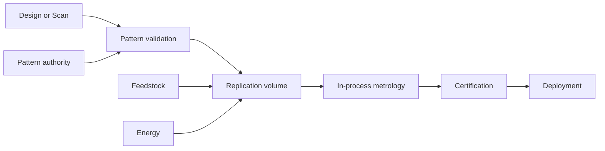

# Black Light Replicator Industrial Automation Authority

**Status:** authoritative industrial consequence doctrine established by authorial directive.  
**Scope:** physicalized matter-replication technology, industrial automation, fabrication scale, logistics, maintenance, shipboard support, alien-technology reproduction, and integration with propulsion/FTL engineering.  
**Authority relationship:** specific named technology, species, manufacturer, campaign, or artifact canon outranks this general doctrine. This document governs the consequences of a civilization **once physicalized replication is explicitly available at the relevant scale**. It must not be used to grant replicators to a civilization that does not already possess them.

**Canon labels:** `CONFIRMED` = established directly by authorial directive or surviving source; `DERIVED` = necessary engineering/economic consequence of confirmed behavior; `PROPOSED` = quantitative model or maturity notation introduced for consistency; `UNRESOLVED` = source-specific limitation not yet established.

---

## 1. Governing premise

### 1.1 Physicalized replication — CONFIRMED

A mature industrial replicator is not merely an automated machine shop. It is a physical matter-fabrication system able to reproduce an object whose relevant physical state can be captured as a sufficiently complete pattern.

The setting-level rule is:

> **Once a replicator volume is large enough to contain the intended product, anything that can be adequately scanned and represented can be reproduced without recreating the original object's conventional manufacturing chain.**

The word **adequately** is important. It means the scan contains every physical property that materially determines the reproduced object's behavior at the replication technology's supported state resolution. It does **not** mean that operators must understand the design.

A replicator may therefore copy an object that its users cannot design from first principles. Replication and comprehension are separate capabilities.

### 1.2 Industrial consequence — CONFIRMED / DERIVED

Once industrial-scale physicalized replication is established, conventional factory production ceases to be the default means of making ordinary replicable goods. Requiring a civilization with mature industrial replicators to maintain separate casting lines, machining centers, component assembly plants, dedicated tooling chains, and warehouses of every finished spare merely to reproduce already-scanned objects is inconsistent unless a narrower source establishes a specific exception.

Traditional industry does not vanish. Its role changes.

It becomes primarily:

- energy generation and distribution;
- raw-mass/feedstock acquisition, recovery, purification, and transport;
- scan capture and metrology;
- pattern engineering, validation, storage, security, and authorization;
- construction and maintenance of replicators themselves;
- certification and inspection;
- research and first-of-kind design;
- exceptional fabrication outside the replicator's volume or state domain;
- assembly of structures too large to reproduce in one active volume when segmented construction is permitted;
- commissioning of active fields, living ecologies, software identities, or other operational states not reducible to a dormant physical object;
- logistics for moving replication capacity, feedstock, energy, and certified patterns to where they are needed.

The civilization still has an industrial base. It simply no longer resembles a twentieth-century collection of product-specific factories.

---

## 2. Manufacturing-chain collapse

A conventional production chain is approximately:

A mature replication chain becomes:

This is the critical industrial discontinuity. **Product complexity stops dictating the number of dedicated manufacturing processes required.** Complexity moves into pattern information, state resolution, process control, and certification.

A thousand mechanically different spare parts no longer require a thousand stocked bins or a thousand production fixtures. They require a pattern library, suitable replication capacity, and sufficient feedstock and energy.

---

## 3. Replication admissibility

The following is a `DERIVED` engineering model, not a claim that every Black Light replicator uses the same internal physics.

Let an object be described by

\[
O = \{V_O,M_O,R_O,\mathcal S_O,I_O\}
\]

where:

- \(V_O\) is the object's required fabrication volume;
- \(M_O\) is its matter requirement;
- \(R_O\) is the minimum state/spatial resolution necessary to reproduce its behavior;
- \(\mathcal S_O\) is the set of physical states/material phases that must be represented;
- \(I_O\) is the pattern information required to specify the object.

Let a replicator installation be

\[
\mathcal R = \{V_R,\dot M_R,P_R,R_R,\mathcal S_R,B_R\}.
\]

A dormant physical object is replication-admissible when, at minimum,

\[
V_O \le V_R,
\]

\[
R_R \le R_O,
\]

\[
\mathcal S_O \subseteq \mathcal S_R,
\]

and the installation can supply the required matter/energy/information flow.

In the mature physicalized-replicator case established by the authorial premise, a successful **complete scan** is understood to include the material/state description required by the replicator. Consequently, the practical limiting question becomes less “can this civilization machine this material?” and more “can this installation contain, supply, resolve, authorize, and certify this pattern?”

### 3.1 Large objects

If an object fits inside the active replication volume, no conventional assembly line is required merely because the object is mechanically complicated.

If it does not fit, one of three things must occur:

1. use a larger replication volume;
2. replicate certified sections and join them where the design permits segmentation;
3. use an extended/continuous fabrication field if the technology possesses one.

This makes **replication volume itself an industrial capability metric**.

---

## 4. Replication time and throughput

A useful `PROPOSED` planning equation is:

\[
t_{rep}
=
t_{setup}
+
\max\left(
\frac{M_O}{\dot M_R},
\frac{E_O}{P_R},
\frac{I_O}{B_R},
\frac{V_O}{\dot V_R}
\right)
+
t_{cert}.
\]

This does not assert a universal microscopic mechanism. It expresses the practical truth that reproduction cannot finish faster than the slowest controlling resource: matter throughput, delivered energy, pattern/control bandwidth, or active fabrication-front rate.

Increasing replicator sophistication therefore produces industrial gains through:

- higher mass throughput;
- greater active volume;
- larger continuous field geometry;
- better scan resolution;
- greater supported-state range;
- higher power density and conversion efficiency;
- faster pattern/control bandwidth;
- improved in-process metrology;
- more autonomous certification;
- better fault isolation and self-recovery.

A mature replicator does not need a new dedicated factory because a product became more complicated. It may need **more time, more energy, more matter, a larger bay, or a higher-resolution pattern**.

---

## 5. Automation and labor

### 5.1 Direct production labor — DERIVED

Replication makes routine production intrinsically automatable because the production instructions are already encoded in the pattern.

Human, alien, biological, synthetic, or postmaterial labor therefore migrates away from repetitive fabrication and toward:

- design;
- first-of-kind experimentation;
- scanning and metrology;
- validation and certification;
- exception handling;
- replication-plant maintenance;
- pattern governance;
- infrastructure operation;
- logistics;
- field installation;
- active-system commissioning;
- failure investigation.

The direct labor cost of producing one additional known item approaches the labor required to authorize, load, supervise, certify, and deploy it rather than the labor historically required to manufacture its individual components.

### 5.2 Do not artificially recreate obsolete factories

When a civilization has a mature industrial replicator large enough for an object, generator output should **not** automatically add conventional foundries, stamping lines, machine shops, component-assembly halls, or product-specific tooling as necessities.

Such facilities may still exist for cultural, historical, security, experimental, high-throughput, emergency, state-domain, or non-replicator reasons, but those reasons must be stated.

---

## 6. Inventory and logistics

Replication converts much of physical inventory into **pattern inventory**.

The old problem:

[
\text{spares logistics} \sim
\text{number of part types} \times
\text{physical stock requirement}
]

becomes approximately:

[
\text{spares logistics} \sim
\text{replicator availability}
+
\text{feedstock}
+
\text{energy}
+
\text{pattern availability}
+
\text{certification time}.
]

A ship with a sufficiently capable replication bay does not need to carry every low- and medium-criticality spare part. It carries:

- replication feedstock;
- critical patterns;
- protected pattern backups;
- components that cannot safely wait for replication;
- items outside the installed replicator's volume/state envelope;
- replacement parts for the replicator itself;
- emergency equipment capable of restoring replication after damage.

This creates a new failure mode: **replicator loss can convert a ship from effectively unlimited spare diversity to severe material scarcity in a single casualty.**

Critical systems therefore still justify stored spares even in a replication economy when restoration latency is unacceptable.

---

## 7. Recycling and closed-loop industry

A mature replicator economy naturally pairs with reclamation.

Damaged, obsolete, or unwanted physical goods can be broken down into standardized mass/feedstock streams and returned to the replication system. The industrial loop becomes:

Waste therefore becomes primarily:

- unrecoverable entropy/heat;
- contaminated or deliberately quarantined matter;
- mass lost from the system;
- feedstock whose separation cost exceeds its value;
- damaged information/pattern provenance;
- hazardous material intentionally excluded from recycling.

This strongly favors remote settlements, starships, military bases, and exploration vessels because they can carry generalized production capacity rather than a miniature version of every conventional factory.

---

## 8. Replicators and propulsion / FTL engineering

Industrial replication changes **how drive hardware is produced and repaired**. It does not change the transit mathematics.

A replicator may reproduce, subject to its scan/state/volume envelope:

- field coils;
- emitter structures;
- topology waveguides;
- structural frames;
- crystal resonators;
- control modules;
- sensor packages;
- pressure vessels;
- thermal components;
- hull sections;
- complete dormant drive modules.

However:

[
\boxed{\text{replicating hardware} \neq \text{commissioning an active transit state}}
]

A Fold-Jump aperture solution, an active wormhole throat, a live metric field, a synchronized Q-address, a living bonded navigator, or an authenticated postmaterial state may require commissioning, reference establishment, calibration, external infrastructure, or operating conditions after the physical hardware has been replicated.

Consequently, FTL documentation should distinguish:

1. **fabrication reproducibility** — can the dormant hardware be replicated?
2. **installation reproducibility** — can it be installed within required geometry?
3. **calibration reproducibility** — can certified references be restored?
4. **operational-state reproducibility** — can the active field/topology/state be recreated?
5. **authority reproducibility** — are required keys, identities, beacons, pattern rights, or external infrastructure available?

Replication eliminates many manufacturing bottlenecks. It does not make physics, calibration, or missing external infrastructure optional.

---

## 9. Alien technology and reverse engineering

The setting must preserve this distinction:

[
\boxed{\text{ability to reproduce} \not\Rightarrow \text{ability to understand}}
]

If an alien device can be completely scanned within a compatible replication domain, a mature physicalized replicator can reproduce the physical object even when the operators do not understand its design.

That copy may still fail to function if operation depends on:

- an unavailable active field state;
- external reference infrastructure;
- authentication;
- missing software or mutable state not captured by the scan;
- a bonded organism or symbiont;
- environmental conditions absent from the replication bay;
- consumables or exotic working media not represented in the captured state;
- calibration against a source that no longer exists.

This creates a useful Black Light salvage distinction:

- **copyable**;
- **operable**;
- **maintainable**;
- **understood**;
- **redesignable**.

They are five different claims.

---

## 10. Technology-basis embodiments

Physicalized replication should inherit the civilization's operative technology basis rather than always looking like a human transporter alcove.

### Terrestrial electromechanical

Likely embodiments emphasize controlled chambers, field arrays, feedstock systems, high-density power conversion, metrology frames, digital pattern stores, and robotic handling.

### Aquatic electrochemical-hydraulic

Replication may occur inside pressure-balanced wet volumes with ionic feedstocks, dissolved/colloidal material transport, immersed field surfaces, hydraulic handling, and wet-compatible metrology.

### Cryogenic ammonia-halocarbon

Fabrication can use cold reaction volumes, superconductive field control, cryofluid material transport, phase-managed deposition, and contraction-aware certification.

### Gas-giant fluidic-electrostatic

Large flexible fabrication envelopes, charged aerosols/ions, field-shaped matter flow, membrane confinement, and buoyant industrial volumes may replace rigid terrestrial bays.

### Biological-symbiotic

The equivalent may be a growth/assembly organ or managed biotechnical foundry capable of reproducing integrated living and nonliving structures from recorded patterns. Maintenance becomes pathology control, feeding, genomic/state validation, and regeneration.

### Mineral piezoelectric-photonic

Replication may use crystal growth fronts, resonant field templating, photonic pattern projection, controlled mineral feed, stress-state programming, and post-growth annealing.

### Field-mediated adaptive

The distinction between replicator and ordinary construction may nearly disappear: authenticated field architecture and adaptive matter can reconfigure feedstock directly into the stored physical state, constrained by coherence, energy reserve, state integrity, and volume.

These are `DERIVED` embodiments, not declarations that every civilization possesses replication.

---

## 11. Practical industrial replicator manual

### 11.1 Pre-production

1. Authenticate the requested pattern and revision.
2. Confirm provenance and any restrictions.
3. Confirm the scan/pattern is complete for the required function.
4. Verify object bounds against active replication volume.
5. Confirm feedstock mass and supported state domain.
6. Confirm energy reserve and thermal rejection.
7. Clear the fabrication exclusion volume.
8. Load certification profile and comparison references.

### 11.2 Replication

1. Establish containment and coordinate references.
2. Begin low-rate material/state formation.
3. Compare in-process metrology against the pattern.
4. Abort on unresolved divergence outside the certified correction envelope.
5. Increase to normal fabrication rate only after reference lock.
6. Preserve the production trace and deviation log.

### 11.3 Certification

A completed object is not automatically serviceable merely because it visually matches the pattern.

Certification should verify as applicable:

- dimensions and datums;
- mass and density distribution;
- material/state composition;
- continuity and insulation;
- thermal behavior;
- pressure integrity;
- resonance;
- field response;
- software/configuration identity;
- calibration state;
- biological viability;
- critical defect bounds.

### 11.4 Release

Only after certification should the object move from **replicated** to **serviceable**.

For critical propulsion, FTL, life-support, reactor, weapon, or pressure-boundary hardware, subsystem recertification may still be required after installation.

---

## 12. Security and strategic consequences

Industrial replicators make **patterns** strategically comparable to factories, tooling archives, and supply chains combined.

Security therefore concentrates on:

- pattern integrity;
- revision authority;
- malicious pattern substitution;
- hidden defects;
- authorization;
- replication logs;
- prohibited/hazardous items;
- sabotage of scan libraries;
- denial of feedstock;
- denial of energy;
- replicator-core damage;
- false certification.

A captured factory can manufacture only what its tooling supports. A captured universal industrial replicator plus a useful pattern library may manufacture an enormous fraction of a civilization's material culture.

That makes pattern archives strategic infrastructure.

---

## 13. Proposed maturity ladder

This notation is `PROPOSED` and exists to help generators express industrial consequences consistently.

| Level | Replication capability | Industrial consequence |
|---|---|---|
| R0 | laboratory microfabrication | specialized components only |
| R1 | part-scale physical replication | many spares become patterns |
| R2 | module/appliance scale | conventional component plants sharply decline |
| R3 | room/vehicle scale | most finished goods can be produced locally |
| R4 | hull-section / heavy-equipment scale | conventional heavy manufacturing largely collapses into replication yards |
| R5 | shipyard-scale replication volumes | ships and very large machinery can be produced with minimal product-specific tooling |
| R6 | extended/continuous replication fields | production becomes generalized matter logistics constrained mainly by mass, energy, pattern authority, certification, and construction geometry |

This ladder must never be assigned automatically from FTL Path, species age, or narrative sophistication. Replication capability requires its own source or generator authority.

---

## 14. Generator contract

When generating a civilization, vessel, installation, or economy:

1. Determine whether physicalized replication exists at all.
2. Determine the maximum certified replication scale.
3. Determine scan/state resolution and whether living/exotic/active states are supported.
4. Determine matter/feedstock and energy logistics.
5. Determine pattern governance and security.
6. Remove redundant conventional production chains for objects inside the certified replication envelope unless a specific reason preserves them.
7. Preserve exceptional industry for first-of-kind work, oversize structures, active-state commissioning, replicator construction, research, and source-specific limitations.
8. Convert most spare-parts inventory into pattern + feedstock + critical-ready-spare logic.
9. Keep certification and subsystem recertification distinct from physical reproduction.
10. Record provenance for every imposed limitation. Do not manufacture scarcity simply to make the setting resemble a pre-replicator economy.

---

## 15. Canon safeguard

The central safeguard is symmetrical:

> **Do not grant replication where canon does not establish it, and do not ignore its industrial consequences where canon does establish it.**

Once a civilization possesses mature physicalized industrial replication, conventional manufacturing scarcity cannot be reintroduced merely by habit. Any continuing conventional factory must have a reason grounded in throughput, scale, security, active-state physics, culture, regulation, unavailable scan data, or another explicit setting constraint.

That is the intended Black Light interpretation of industrial replicator technology.
