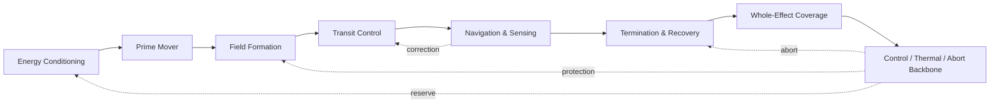
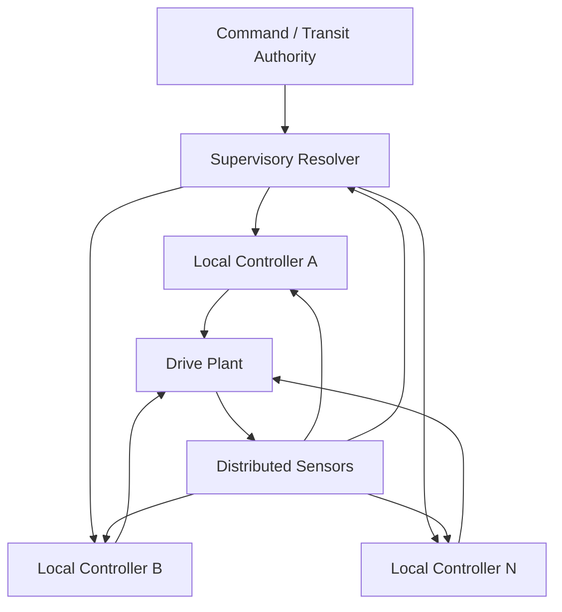
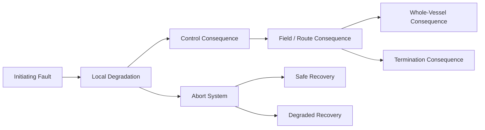
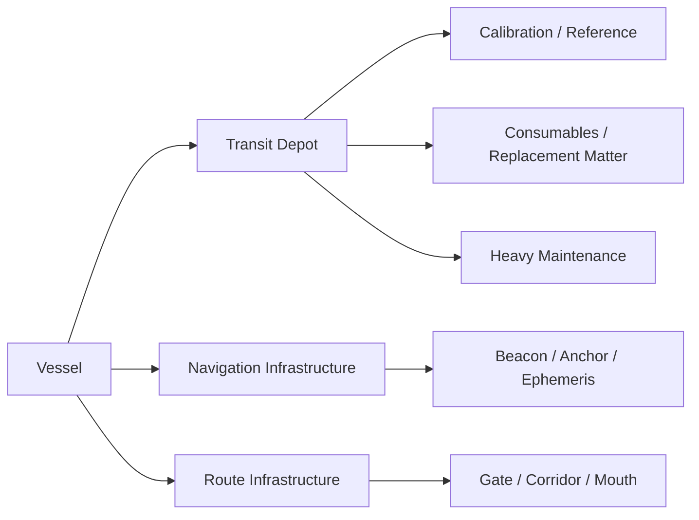

# Black Light Propulsion & Transit Engineering Annex

**Status:** subordinate engineering, generator, educational, and maintenance annex.

**Authority relationship:** this file extends `docs/blacklight/BLACK_LIGHT_PROPULSION_TRANSIT_AUTHORITY.md` without superseding it. Specific surviving race/species, organization, manufacturer, named-vessel, named-installation, and named-technology sources remain higher authority. `BLACK_LIGHT_PROPULSION_TRANSIT_AUTHORITY.md` remains the single consolidated propulsion/transit integration entrypoint. This annex exists to deepen machinery embodiment, scaling, operational mathematics, generation rules, API semantics, field procedures, provenance readability, and educational use without promoting extrapolation to canon.

**Canon labels:** `CONFIRMED`, `DERIVED`, `PROPOSED`, `UNRESOLVED`, and `MIXED` retain exactly the meanings defined by the consolidated authority.

---

## 1. Reconciliation statement

This annex is constrained by the currently reconciled three-coordinate model:

- ordinary-spacetime propulsion maturity: conventional propulsion `P0-P6`;
- transit-family implementation maturity: transit Path `P0-P6`;
- cross-family transit capability envelope: shared transit `T0-T8`.

These coordinates are not aliases. A generator MUST preserve all three when present, and MUST NOT infer a conventional propulsion P-band from a transit Path or shared T-tier unless a named source explicitly establishes the relationship.

The confirmed transit-family vocabulary remains: Metric Compression Envelope, Gravitational-Plane Skimmer, Hyperspatial Slipstream Shear, Q-Lattice Phase Translation, N-Dimensional Manifold Drive, Discrete Fold-Jump Drive, Anchored Wormhole/Gate Transit, Quantum Phase Displacement, and Relativistic Inertial Torch as the non-FTL precursor/comparison family.

The universal eight-block installation model remains binding for generator completeness:



Any generated installation missing one of these end effects is incomplete even if the embodiment merges multiple blocks into one organ, structure, lattice, field, or machine.

---

## 2. Authority-chain and provenance repair rules

A generator or authoring tool SHALL resolve claims field-by-field rather than assigning one status to an entire record by convenience.

### 2.1 Resolution order

For each requested field `f`:

1. Search a named installation or named vessel source.
2. Search manufacturer/organization/race/species authority.
3. Search consolidated propulsion/transit authority.
4. Search recovered family/Path source material.
5. Search operative technology-basis authority.
6. Search vessel-system integration authority.
7. Search current runtime behavior if the question concerns generator output.
8. Search machine-readable registries.
9. Apply a documented derivation only if confirmed parents are sufficient.
10. Otherwise retain `UNRESOLVED`, or emit a `PROPOSED` value only in a mode that explicitly allows proposals.

A lower layer MAY specialize a higher layer only when the higher layer is intentionally generic. It MUST NOT overwrite a named fact.

### 2.2 Required provenance object

Every nontrivial generated field SHOULD carry:

```json
{
  "status": "CONFIRMED | DERIVED | PROPOSED | UNRESOLVED | MIXED",
  "value": null,
  "sourceRefs": [],
  "sourceScope": "named-installation | named-vessel | manufacturer | species | authority | archive | runtime | registry | derivation | proposal",
  "resolverRule": null,
  "parents": [],
  "generatorVersion": null,
  "generatedAt": null,
  "notes": null
}
```

`sourceRefs` SHOULD be stable repository paths, source IDs, or canonical external authority references where supported. `resolverRule` is mandatory for `DERIVED` values. `parents` is mandatory for a derivation that combines more than one source value. `PROPOSED` values MUST state the design problem they are solving.

### 2.3 Provenance readability

Human-facing output SHALL expose provenance in three layers:

- **headline status:** one visible label adjacent to the displayed value;
- **short origin:** one sentence describing where the value came from;
- **expandable trace:** complete source refs, resolver rule, parents, and generator version.

Do not bury `PROPOSED` or `DERIVED` status in a footnote while presenting the generated value in the same visual style as confirmed canon.

---

## 3. Engineering state vector

`DERIVED:` a transit installation is most coherently modeled as a coupled state rather than a single performance number.

Define the installation state vector:

\[
\mathbf{s}=\begin{bmatrix}
E & G & N & C & R & H & S & I
\end{bmatrix}^{T}
\]

where:

- `E` = usable conditioned energy/resource state;
- `G` = geometry/field/topology validity;
- `N` = navigation/reference validity;
- `C` = control coherence;
- `R` = recovery/termination reserve;
- `H` = health/maintenance condition;
- `S` = signature/emission state;
- `I` = infrastructure dependency satisfaction.

The point is not to universalize the physical units. Biological, mineral, wet-hydraulic, cryogenic, electromechanical, and postmaterial systems embody these state variables differently. The state vector gives the generator a common bookkeeping language while allowing the hardware to remain species- and technology-specific.

A transit attempt is admissible only if all family-defined predicates over `s` pass.

\[
A_{transit}=\bigwedge_{k=1}^{n} P_k(\mathbf{s},\mathbf{r},\mathbf{e})
\]

where `r` is route state and `e` is environment state.

This prevents a generator from reducing readiness to a single arbitrary percentage.

---

## 4. Scaling behavior

No universal canonical scaling exponent is established across all transit families. The following is therefore `DERIVED` as a generator framework and `PROPOSED` where numerical fitting is used.

### 4.1 Four burdens of scale

Every installation SHOULD separately evaluate:

1. **translated mass burden** — how much inertial/rest mass participates;
2. **coverage geometry burden** — what protected/effected volume and topology must be enclosed;
3. **distribution burden** — how many synchronized emitters/organs/nodes must coordinate across hull dimensions;
4. **recovery burden** — how much stored disturbance, heat, phase error, strain, metabolic debt, or field energy must be safely dissipated after transit.

A generic burden estimator is:

\[
B_f=K_f
\left(\frac{M}{M_0}\right)^{\alpha_f}
\left(\frac{A_c}{A_0}\right)^{\beta_f}
\left(1+\lambda_f L_s\right)
C_g C_d C_e C_n
\]

where `A_c` is characteristic coverage area, `L_s` is a normalized synchronization span, and the correction terms represent geometry, damage, environment, and navigation/reference uncertainty.

Numerical `K`, `alpha`, `beta`, and `lambda` values are not canon unless sourced. Generator defaults MUST be labeled `PROPOSED` and versioned.

### 4.2 Segmentation pressure

`DERIVED:` as vessel characteristic length `L` grows, one physically centralized field-former becomes less plausible for families whose effect must conform to hull geometry or react faster than structural disturbance propagates.

Define a segmentation pressure estimator:

\[
\Pi_{seg}=\frac{L/t_c}{v_{coord}}\left(1+\sigma_{flex}+\sigma_{damage}\right)
\]

where `t_c` is permitted correction time and `v_coord` is the effective coordination speed through the selected technology basis. Increasing `Pi_seg` should push generation toward distributed sectors, local control nodes, redundant sensing, and sectional isolation.

This produces culturally distinct large-ship machinery without inventing new physics. A terrestrial installation may become segmented ring sectors; a biological one may grow synchronized lobes; a mineral one may divide into coupled crystal domains; a postmaterial one may use authenticated regional field anchors.

### 4.3 Small-vessel compression

Small vessels SHOULD not merely receive the same room plan at 25% scale. The generator should preferentially merge functions, reduce service clearances, accept lower redundancy, externalize infrastructure dependencies, and increase replacement-over-repair behavior where the technology basis permits it.

---

## 5. Power and resource models

### 5.1 Power architecture categories

The generator SHALL describe power in at least four stages:

`source -> conditioning -> buffer -> transit distribution`

and separately identify:

`recovery sink -> rejection/storage -> reset path`.

A drive can therefore be energy-rich but transit-incapable if its conditioning or recovery path is damaged.

### 5.2 Technology-basis embodiments

`DERIVED:`

| Technology basis | Conditioning embodiment | Buffer embodiment | Distribution embodiment | Recovery embodiment |
|---|---|---|---|---|
| Terrestrial electromechanical | converters, pulse-formers, cryogenic power electronics | capacitor/inductor/field stores | buses, waveguides, superconducting trunks | dump resistors, thermal stores, reversible field sinks |
| Aquatic electrochemical-hydraulic | ionic/electrochemical conditioning, pressure staging | electrochemical cells, pressure reservoirs | conductive fluid paths, hydraulic manifolds | chemistry reset, decompression, thermal dissolution |
| Cryogenic ammonia-halocarbon | superconducting conversion, phase-controlled cold electronics | cryogenic field/phase stores | cold buses, photonic timing paths | phase-change reservoirs, controlled warm rejection |
| Gas-giant fluidic-electrostatic | charge separation, pressure/flow conditioning | charged membranes, pressure cells | ionic flow structures, electrostatic skins | bleed meshes, pressure equalization, acoustic damping |
| Biological symbiotic | metabolic conversion, symbiont catalytic stages | biochemical reserve, elastic/mineralized tissue | vascular/conductive tissue | metabolism, excretion, tissue relaxation, regenerative cycles |
| Mineral piezoelectric-photonic | stress/optical/polarization conditioning | elastic strain, polarized domains, photonic storage | crystal axes, optical defect channels | annealing, depolarization, phonon/heat release |
| Field-mediated postmaterial | state transformation at anchors | persistent field-state reserve | field continuity / authenticated anchor network | state rollback, reserve-matter reconstruction, topology reset |

No row assigns a specific FTL family to a species. These are embodiment grammars only.

---

## 6. Navigation and route models

Navigation SHALL be family-specific. A universal `destination + accuracy` pair is insufficient.

### 6.1 Family navigation state

| Family | Primary solved object | Pre-commit uncertainty that matters |
|---|---|---|
| Metric envelope | continuous trajectory through deformed local metric | envelope geometry, external mass distribution, horizon behavior |
| Gravitic-plane | viable geodesic/equipotential route | mass-model drift, ridge crossings, emergence vector |
| Slipstream shear | boundary layer / shear track | Q-weather, adhesion margin, normal-space correspondence |
| Q-lattice | destination address and phase epoch | aliasing, epoch drift, address corruption |
| N-manifold | higher-dimensional embedding and return map | topology validity, axis selection, return-map covariance |
| Fold-jump | endpoint adjacency solution | destination occupancy, endpoint geometry, relative velocity |
| Wormhole/gate | mouth pair / throat state | synchronization, traffic state, throat stability |
| Phase displacement | compatible destination/reference state | identity/reference integrity, exclusion, target-state ambiguity |
| Inertial torch | continuous causal trajectory | burn uncertainty, relativistic navigation, intercept geometry |

### 6.2 Navigation covariance

`DERIVED:` use a covariance object rather than a scalar accuracy when the generator supports mathematical detail.

\[
\Sigma_{route}=J\Sigma_{obs}J^T+\Sigma_{model}+\Sigma_{epoch}
\]

where `J` maps observation uncertainty into the solved family state. UI may display a simplified confidence class, but the machine-readable record should retain the components when available.

### 6.3 Infrastructure-aware routing

Route feasibility SHOULD be expressed as:

\[
F_{route}=F_{physics}\cap F_{infrastructure}\cap F_{authority}\cap F_{maintenance}\cap F_{mission}
\]

A theoretically reachable destination may still be unavailable because beacons, gate mouths, corridor anchors, certified ephemerides, service capacity, or political transit authority are absent.

---

## 7. Control architecture

A generator SHALL produce control at three levels:

- **fast local control:** keeps machinery inside physical stability limits;
- **installation coordination:** synchronizes sectors, organs, nodes, or field regions;
- **command authority:** validates route, commit, abort, and recovery permission.

A race-specific control model may be centralized, federated, reflexive, biological, ritualized, consensual, hierarchical, or postmaterial. These social/organizational properties MUST come from operative technology and cultural authority, not from generic assumptions.



`DERIVED:` fast stabilization should remain locally possible after supervisory-link degradation when the technology basis supports it. This is not equivalent to permitting a transit commit without command authority.

---

## 8. Maintenance model

Maintenance MUST be expressed as restoration of required physical state, not generic `repair points`.

### 8.1 Maintenance dimensions

Each generated installation SHOULD state:

- inspection method;
- calibration/reference method;
- contamination or environmental sensitivity;
- wear/degradation mode;
- replaceable, regrowable, annealable, reconfigurable, or non-serviceable elements;
- alignment requirements;
- safe isolation state;
- post-maintenance recommission test;
- required specialist roles;
- required shipyard/infrastructure class.

### 8.2 Maintenance debt

`PROPOSED` estimator:

\[
D_m=\sum_i w_i\left(d_i+u_i+r_i\right)
\]

where `d_i` is measured degradation, `u_i` unresolved inspection uncertainty, and `r_i` overdue reference/calibration burden. Maintenance debt SHOULD affect reliability, permissible transit envelope, and service interval rather than acting only as cosmetic flavor.

### 8.3 Practical recommission sequence

Unless contradicted by a higher-authority source, field manuals SHOULD teach this invariant sequence:

`isolate -> inspect -> restore physical state -> calibrate references -> dry-run local control -> integrated low-energy test -> verify recovery path -> re-certify operating envelope`.

This is `DERIVED` procedure, not a universal named canon checklist.

---

## 9. Signature model

Signature is not a single stealth number. The generator SHOULD independently describe:

- pre-transit preparation signature;
- active-transit local signature;
- remote/route signature;
- emergence/termination signature;
- post-transit recovery signature;
- persistent forensic signature.

A signature record SHOULD use modalities rather than one magnitude:

```json
{
  "thermal": null,
  "electromagnetic": null,
  "gravitational": null,
  "optical": null,
  "particle": null,
  "acousticFluidic": null,
  "phaseOrQ": null,
  "topological": null,
  "biochemical": null,
  "forensicPersistence": null
}
```

Unsupported modalities remain `null` or `UNRESOLVED`; they are not silently set to zero.

---

## 10. Failure model

Failure generation SHALL proceed from physical dependency chains.

### 10.1 Failure graph



The generator MUST distinguish:

- **fault:** component/state outside intended condition;
- **failure:** loss or degradation of required function;
- **hazard:** resulting unsafe condition;
- **cascade:** propagation into another required function;
- **abort:** intentional transition toward a safer state;
- **loss state:** unrecoverable consequence.

### 10.2 Family-specific failure vocabulary

Examples are `DERIVED` unless recovered elsewhere:

- metric: envelope closure error, emitter-sector desynchronization, horizon instability, ringing overload;
- gravitic: plane departure, gradient overload, reference-frame divergence;
- slipstream: adhesion loss, boundary shear excursion, Q-weather capture;
- Q-lattice: address alias, epoch mismatch, lattice decoherence;
- manifold: embedding collapse, axis misselection, invalid return map;
- fold: false adjacency, endpoint exclusion failure, incomplete commit/termination;
- gate: throat pinch, mouth desynchronization, traffic interference;
- phase displacement: reference loss, compatible-state ambiguity, incomplete reintegration;
- inertial torch: thrust asymmetry, containment failure, thermal rejection loss.

### 10.3 Fault containment geometry

Large installations SHOULD have fault-containment zones aligned with actual technology embodiment. A terrestrial vessel may isolate bus/ring sectors; a biological vessel may constrict vascular flow or neurologically quarantine tissue; a mineral vessel may optically decouple crystal domains; a postmaterial vessel may revoke an anchor region and reconstruct it from authenticated fallback state.

---

## 11. Infrastructure model

Infrastructure SHALL be generated as a capability graph, not a yes/no `requires station` flag.

### 11.1 Infrastructure nodes

Potential nodes include:

- fabrication yard;
- calibration/reference observatory;
- fuel/resource refinery;
- cryogenic/chemical service plant;
- symbiont nursery or medical growth facility;
- crystal-growth/annealing works;
- authenticated field-anchor foundry;
- beacon/reference network;
- gate mouth/corridor anchor;
- navigation ephemeris service;
- heavy recovery/dump facility;
- specialist depot;
- transit traffic control.

### 11.2 Dependency graph



The generator SHOULD state which dependencies are mandatory for operation, mandatory only for maintenance, optional performance enhancers, or civilization-scale background infrastructure.

---

## 12. Race- and technology-specific engineering generation

The generator SHALL separate **race identity** from **technology-basis embodiment**.

A species may use more than one technology basis through trade, conquest, refit, historical development, or manufacturer specialization. Therefore generation order SHOULD be:

`named canon -> species constraints -> organization/manufacturer -> operative technology basis -> transit family -> Path -> T-tier -> vessel scale -> mission -> condition -> embodiment`.

Race identity alone MUST NOT select an FTL family unless a surviving source actually states that association.

### 12.1 Embodiment questions

For each of the eight blocks ask:

1. What physical carrier performs the function?
2. What material or living state must be maintained?
3. How is the state measured by this civilization?
4. How is command communicated?
5. How is local fast control performed?
6. How does the system fail physically?
7. How is it isolated?
8. How is it serviced?
9. What sensory evidence does a technician perceive?
10. Which parts scale with mass, area, length, route, or performance?

The answers form the machinery description. Noun substitution is not acceptable.

---

## 13. Generator rules

### 13.1 Deterministic resolution order

A generator SHOULD execute:

1. freeze source snapshot;
2. resolve named authority;
3. resolve mechanism family;
4. resolve transit Path and shared T-tier independently;
5. resolve conventional propulsion P-band independently;
6. resolve operative technology basis;
7. resolve vessel geometry/scale and mission;
8. instantiate all eight end-effect blocks;
9. instantiate control, navigation, recovery, maintenance, signature, failure, and infrastructure models;
10. run completeness and contradiction checks;
11. attach field-level provenance;
12. render technical, practical, educational, and API views from the same structured record.

### 13.2 Generation modes

Recommended modes:

- `AUTHORITY_ONLY` — leave gaps unresolved;
- `LABELED_DERIVATION` — permit derivations from confirmed parents;
- `LABELED_PROPOSAL` — permit explicit speculative completion;
- `DESIGN_STUDY` — maximize coherent extrapolation but never relabel it as canon.

### 13.3 Canon-preserving randomization

Randomness may select among valid embodiments only after constraints are resolved.

\[
X=Sample(ValidCandidates(Canon,Technology,Family,Scale,Mission,Condition),Seed)
\]

The candidate set MUST be empty rather than silently widened if confirmed canon excludes every available option.

### 13.4 Seed hierarchy

Recommended deterministic seed tree:

```text
vesselSeed
  propulsionSeed
  transitSeed
    familySeed
    pathSeed
    embodimentSeed
      energySeed
      primeMoverSeed
      formationSeed
      controlSeed
      navigationSeed
      recoverySeed
      coverageSeed
      backboneSeed
    maintenanceSeed
    failureSeed
    signatureSeed
    infrastructureSeed
```

The seed is provenance, not authority. Repeated generation from a seed does not make the result setting-wide canon.

---

## 14. Validation invariants

A generated transit installation MUST fail validation if any of these apply:

- a named confirmed source is overwritten by a lower-authority field;
- Path P-level and conventional propulsion P-band are conflated;
- Path P-level and shared T-tier are silently normalized against higher named canon;
- the transit family is replaced by a generic `warp/jump/hyperspace` label when a resolved family exists;
- any of the eight end-effect blocks is absent without an explicit source-defined reason;
- embodiment conflicts with operative technology basis without a hybrid/refit provenance record;
- a `DERIVED` field lacks parent provenance and resolver rule;
- a `PROPOSED` field is presented as confirmed;
- an `UNRESOLVED` field is silently converted to zero/default;
- signature, maintenance, recovery, or infrastructure is omitted merely because combat performance is present;
- randomization changes a confirmed named fact;
- a generated value cannot state its source snapshot and generator version.

Recommended warnings rather than hard failures:

- minimal recovery reserve;
- high maintenance debt;
- poor coverage margin;
- large segmentation pressure without distributed control;
- unsupported infrastructure at mission destination;
- unresolved route/reference covariance;
- condition state inconsistent with advertised performance.

---

## 15. API record extension

The following structure is `PROPOSED` as a coherent extension surface for `exo-vessel-propulsion-transit.schema.json`.

```json
{
  "engineeringState": {
    "energy": {},
    "geometry": {},
    "navigation": {},
    "control": {},
    "recovery": {},
    "health": {},
    "signature": {},
    "infrastructure": {}
  },
  "scaling": {
    "translatedMass": null,
    "coverageGeometry": {},
    "distribution": {},
    "recoveryBurden": {},
    "estimators": []
  },
  "powerModel": {},
  "navigationModel": {},
  "controlModel": {},
  "maintenanceModel": {},
  "signatureModel": {},
  "failureModel": {},
  "infrastructureModel": {},
  "provenance": {
    "sourceSnapshot": [],
    "resolverVersion": null,
    "generatorVersion": null,
    "fields": {}
  }
}
```

This extension MUST remain additive. Existing runtime consumers must not be broken merely to make room for deeper engineering data.

---

## 16. Practical equipment manual template

Every generated installation SHOULD be able to render a practical manual from the same source record.

### Equipment identity

- installation name and family;
- vessel or platform;
- manufacturer/organization if confirmed;
- Path P-level and shared T-tier;
- conventional propulsion P-band separately;
- authority/canon status summary.

### Safe condition

Describe the physical safe state in technology-specific terms: de-energized bus, neutral ionic pressure, metabolic rest, depolarized crystal domain, authenticated fallback topology, etc.

### Pre-transit inspection

Teach what the technician actually checks, how it is sensed, and why the check matters.

### Startup

Explain energy conditioning, reference acquisition, formation sequencing, local-controller synchronization, coverage validation, route validation, and commit authorization.

### Transit watch

Explain which variables drift, which alarms demand correction, which demand abort, and what local crews can physically do.

### Termination

Explain emergence/termination sequencing, recovery sink behavior, post-event inspection, and minimum reset criteria.

### Maintenance

Give inspection intervals as source-defined values where they exist; otherwise use qualitative condition triggers rather than invented universal hours.

### Emergency action

Describe the shortest route to the family-appropriate safe state. Avoid one generic `SCRAM` procedure for every technology basis.

---

## 17. Educational text model

Educational output SHOULD explicitly teach three layers at once:

1. **What is canon?** State the recovered or named fact.
2. **What follows from it?** Explain the engineering consequence as `DERIVED`.
3. **What is merely a useful model?** Mark estimators and design aids as `PROPOSED`.

Example:

> `CONFIRMED:` Fold-jump transit creates temporary topological adjacency. `DERIVED:` because useful post-commit correction is limited, endpoint solution quality and exclusion validation dominate pre-commit navigation. `PROPOSED:` a simulator may express endpoint risk with a covariance-derived confidence score, but that numeric score is not itself setting canon.

This three-layer pedagogy is the preferred default for training material because it teaches the setting without laundering engineering extrapolation into lore.

---

## 18. Mathematical chart set

### 18.1 Coverage margin

\[
\mu_c=\frac{V_{valid}-V_{required}}{V_{required}}
\]

### 18.2 Recovery reserve ratio

\[
\mu_r=\frac{R_{available}}{R_{required}}
\]

`R` is a generalized recovery resource and need not be electrical energy.

### 18.3 Navigation confidence display

For a selected family weighting matrix `W`:

\[
C_{nav}=\exp\left[-\frac{1}{2}\mathrm{tr}(W\Sigma_{route})\right]
\]

This is `PROPOSED` as a UI/engineering metric.

### 18.4 Health-limited capability

`PROPOSED:`

\[
T_{effective}=T_{resolved}-\Delta T_{damage}-\Delta T_{maintenance}-\Delta T_{infrastructure}
\]

The deltas are capability penalties, not necessarily literal tier subtraction in runtime. A production implementation SHOULD prefer explicit constraint fields such as maximum route, charge time, duty cycle, or forbidden operating modes rather than physically mutating canonical T-tier identity.

### 18.5 Serviceability index

`PROPOSED:`

\[
S_v=\frac{R_f A_c D_g}{C_s T_r}
\]

where `R_f` is repair fraction achievable in the field, `A_c` access factor, `D_g` diagnostic quality, `C_s` specialist dependency, and `T_r` reset/recommission burden. Use only for comparative generator scoring.

---

## 19. Readability and presentation contract

Technical depth MUST NOT force every audience into raw engineering detail. The same structured record SHOULD support:

- **operator view:** status, route, commit/abort, reserves, critical alarms;
- **technician view:** machinery blocks, sensors, limits, maintenance, isolation;
- **engineer view:** state vector, covariance, scaling, failure propagation, provenance;
- **educational view:** canon/derivation/proposal separation with diagrams;
- **GM/worldbuilding view:** cultural embodiment, visible machinery, infrastructure, signatures, story hooks;
- **API view:** lossless structured record.

The renderer may shorten detail. It may not change provenance status to simplify prose.

---

## 20. Origin ledger

This annex deliberately does not create new named race-to-drive assignments, manufacturer ownership, universal energy constants, universal detection ranges, universal failure probabilities, or universal scaling exponents.

Its origin is the currently reconciled propulsion/transit authority, recovered FTL archive, operative-technology framework, EXO vessel-system integration rules, current runtime scale semantics, and existing subordinate field manual. All new equations and cross-family engineering abstractions here are `DERIVED` or `PROPOSED` unless a higher source independently confirms them.

Future integration work SHOULD fold stable, validated portions of this annex into the consolidated authority, generator reference, field manual, registry, and schema while preserving this provenance distinction. Until that deliberate migration occurs, this annex is supporting documentation, not a second authority root.
